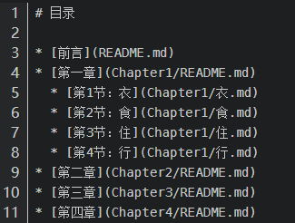

如何将一个 md  的 git 项目 利用 gitbook 变成一个静态网站呢？

1.安装nodejs：[https://nodejs.org/en/download/]

2.执行命令：npm install -g gitbook-cli

3.在 git 项目根目录下，执行：

```shell
gitbook init
```

​	执行完后，你会看到多了两个文件 —— [README.md](http://readme.md/) 和 [SUMMARY.md](http://summary.md/)，它们的作用如下：

> - [README.md](http://readme.md/) —— 书籍的介绍写在这个文件里
> - [SUMMARY.md](http://summary.md/) —— 书籍的目录结构在这里配置

​	编辑 SUMMARY.md 文件，内容修改为：



​	再次执行 `gitbook init` 命令。GitBook 会查找 [SUMMARY.md](http://summary.md/) 文件中描述的目录和文件，如果没有则会将其创建。

4.执行 `gitbook build` 命令构建书籍，默认将生成的静态网站输出到 _book 目录