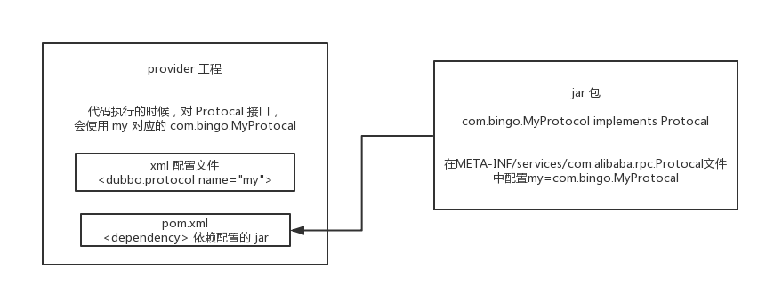

## 如何自己扩展 dubbo 中的组件

​	下面来说说怎么来自己扩展 dubbo 中的组件。

​	自己写个工程，要是那种可以打成 jar 包的，里面的 `src/main/resources` 目录下，搞一个 `META-INF/services`，里面放个文件叫：`com.alibaba.dubbo.rpc.Protocol`，文件里搞一个`my=com.bingo.MyProtocol`。自己把 jar 弄到 nexus 私服里去。

​	然后自己搞一个 `dubbo provider` 工程，在这个工程里面依赖你自己搞的那个 jar，然后在 spring 配置文件里给个配置：

```xml
<dubbo:protocol name=”my” port=”20000” />Copy to clipboardErrorCopied
```

​	provider 启动的时候，就会加载到我们 jar 包里的`my=com.bingo.MyProtocol` 这行配置里，接着会根据你的配置使用你定义好的 MyProtocol 了，这个就是简单说明一下，你通过上述方式，可以替换掉大量的 dubbo 内部的组件，就是扔个你自己的 jar 包，然后配置一下即可。



​	dubbo 里面提供了大量的类似上面的扩展点，就是说，你如果要扩展一个东西，只要自己写个 jar，让你的 consumer 或者是 provider 工程，依赖你的那个 jar，在你的 jar 里指定目录下配置好接口名称对应的文件，里面通过 `key=实现类`。

​	然后对于对应的组件，类似 `` 用你的那个 key 对应的实现类来实现某个接口，你可以自己去扩展 dubbo 的各种功能，提供你自己的实现。
