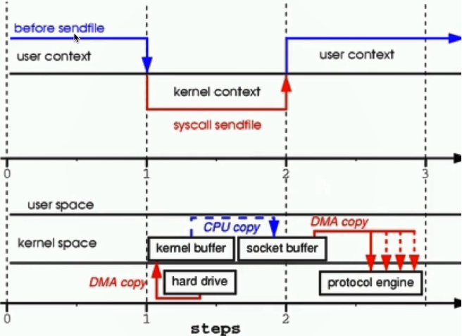

#### **NIO服务端和客户端代码实现**

**服务端：**

```java
import java.io.IOException;
import java.net.InetSocketAddress;
import java.nio.ByteBuffer;
import java.nio.channels.SelectionKey;
import java.nio.channels.Selector;
import java.nio.channels.ServerSocketChannel;
import java.nio.channels.SocketChannel;
import java.util.Iterator;

/**
 * NIO服务端
 */
public class NIOServer {
	//通道管理器
	private Selector selector;

	/**
	 * 获得一个ServerSocket通道，并对该通道做一些初始化的工作
	 * @param port  绑定的端口号
	 * @throws IOException
	 */
	public void initServer(int port) throws IOException {
		// 获得一个ServerSocket通道
		ServerSocketChannel serverChannel = ServerSocketChannel.open();
		// 设置通道为非阻塞
		serverChannel.configureBlocking(false);
		// 将该通道对应的ServerSocket绑定到port端口
		serverChannel.socket().bind(new InetSocketAddress(port));
		// 获得一个通道管理器
		this.selector = Selector.open();
		//将通道管理器和该通道绑定，并为该通道注册SelectionKey.OP_ACCEPT事件,注册该事件后，
		//当该事件到达时，selector.select()会返回，如果该事件没到达selector.select()会一直阻塞。
		serverChannel.register(selector, SelectionKey.OP_ACCEPT);
	}

	/**
	 * 采用轮询的方式监听selector上是否有需要处理的事件，如果有，则进行处理
	 * @throws IOException
	 */
	@SuppressWarnings("unchecked")
	public void listen() throws IOException {
		System.out.println("服务端启动成功！");
		// 轮询访问selector
		while (true) {
			//当注册的事件到达时，方法返回；否则,该方法会一直阻塞
			selector.select();
			// 获得selector中选中的项的迭代器，选中的项为注册的事件
			Iterator ite = this.selector.selectedKeys().iterator();
			while (ite.hasNext()) {
				SelectionKey key = (SelectionKey) ite.next();
				// 删除已选的key,以防重复处理
				ite.remove();
				// 客户端请求连接事件
				if (key.isAcceptable()) {
					ServerSocketChannel server = (ServerSocketChannel) key
							.channel();
					// 获得和客户端连接的通道
					SocketChannel channel = server.accept();
					// 设置成非阻塞
					channel.configureBlocking(false);

					//在这里可以给客户端发送信息哦
					channel.write(ByteBuffer.wrap(new String("向客户端发送了一条信息").getBytes()));
					//在和客户端连接成功之后，为了可以接收到客户端的信息，需要给通道设置读的权限。
					channel.register(this.selector, SelectionKey.OP_READ);
					
					// 获得了可读的事件
				} else if (key.isReadable()) {
						read(key);
				}
			}

		}
	}

	/**
	 * 处理读取客户端发来的信息 的事件
	 * @param key
	 * @throws IOException 
	 */
	public void read(SelectionKey key) throws IOException{
		// 服务器可读取消息:得到事件发生的Socket通道
		SocketChannel channel = (SocketChannel) key.channel();
		// 创建读取的缓冲区
		ByteBuffer buffer = ByteBuffer.allocate(10);
		channel.read(buffer);
		byte[] data = buffer.array();
		String msg = new String(data).trim();
		System.out.println("服务端收到信息："+msg);
		ByteBuffer outBuffer = ByteBuffer.wrap(msg.getBytes());
		channel.write(outBuffer);// 将消息回送给客户端
	}
	
	/**
	 * 启动服务端测试
	 * @throws IOException 
	 */
	public static void main(String[] args) throws IOException {
		NIOServer server = new NIOServer();
		server.initServer(8000);
		server.listen();
	}

}
```

**客户端：**

```java
import java.io.IOException;
import java.net.InetSocketAddress;
import java.nio.ByteBuffer;
import java.nio.channels.SelectionKey;
import java.nio.channels.Selector;
import java.nio.channels.SocketChannel;
import java.util.Iterator;

/**
 * NIO客户端
 */
public class NIOClient {
	//通道管理器
	private Selector selector;

	/**
	 * 获得一个Socket通道，并对该通道做一些初始化的工作
	 * @param ip 连接的服务器的ip
	 * @param port  连接的服务器的端口号         
	 * @throws IOException
	 */
	public void initClient(String ip,int port) throws IOException {
		// 获得一个Socket通道
		SocketChannel channel = SocketChannel.open();
		// 设置通道为非阻塞
		channel.configureBlocking(false);
		// 获得一个通道管理器
		this.selector = Selector.open();
		
		// 客户端连接服务器,其实方法执行并没有实现连接，需要在listen（）方法中调
		//用channel.finishConnect();才能完成连接
		channel.connect(new InetSocketAddress(ip,port));
		//将通道管理器和该通道绑定，并为该通道注册SelectionKey.OP_CONNECT事件。
		channel.register(selector, SelectionKey.OP_CONNECT);
	}

	/**
	 * 采用轮询的方式监听selector上是否有需要处理的事件，如果有，则进行处理
	 * @throws IOException
	 */
	@SuppressWarnings("unchecked")
	public void listen() throws IOException {
		// 轮询访问selector
		while (true) {
			selector.select();
			// 获得selector中选中的项的迭代器
			Iterator ite = this.selector.selectedKeys().iterator();
			while (ite.hasNext()) {
				SelectionKey key = (SelectionKey) ite.next();
				// 删除已选的key,以防重复处理
				ite.remove();
				// 连接事件发生
				if (key.isConnectable()) {
					SocketChannel channel = (SocketChannel) key
							.channel();
					// 如果正在连接，则完成连接
					if(channel.isConnectionPending()){
						channel.finishConnect();
						
					}
					// 设置成非阻塞
					channel.configureBlocking(false);

					//在这里可以给服务端发送信息哦
					channel.write(ByteBuffer.wrap(new String("向服务端发送了一条信息").getBytes()));
					//在和服务端连接成功之后，为了可以接收到服务端的信息，需要给通道设置读的权限。
					channel.register(this.selector, SelectionKey.OP_READ);
					
					// 获得了可读的事件
				} else if (key.isReadable()) {
						read(key);
				}
			}
		}
	}

	/**
	 * 处理读取服务端发来的信息 的事件
	 * @param key
	 * @throws IOException 
	 */
	public void read(SelectionKey key) throws IOException{
		//和服务端的read方法一样
	}
	
	/**
	 * 启动客户端测试
	 * @throws IOException 
	 */
	public static void main(String[] args) throws IOException {
		NIOClient client = new NIOClient();
		client.initClient("localhost",8000);
		client.listen();
	}
}
```

**NIO和epoll：**

    epoll是Linux内核的IO模型。我想一定有人想问，AIO听起来比NIO更加高大上，为什么不使用AIO？AIO其实也有应用，但是有一个问题就是，Linux是不支持AIO的，因此基于AIO的程序运行在Linux上的效率相比NIO反而更低。而Linux是最主要的服务器系统，因此相比AIO，目前NIO的应用更加广泛。
    
    epoll和NIO非常相似，都是基于“通道”和缓冲区的，也有selector，只是在epoll中，通道实际上是操作系统的“管道”。和NIO不同的是，NIO解放了线程，但是需要由selector阻塞式地轮询IO事件的就绪；而epoll中，IO事件就绪后，会自动发送消息，通知selector：“我已经就绪了”。可以认为，Linux的epoll是一种效率更高的NIO。

#### Buffer在 **堆内创建内存** 和 **堆外创建内存** 的底层原理，与 **零拷贝** 的具体实现

**Buffer**

Buffer是一个抽象类，首先我们来看看Buffer有哪些实现类。


从上面这张截图可以看出，Buffer的直接子类有7种。除了Java中Boolean类型。剩余的7种基本类型都有与之对应的Buffer。不同类型的Buffer存储的内容也不同，比如说ByteBuffer存储的就是byte。IntBuffer存储的就是int。**不要想得太复杂，把底层想象成数组即可**。

---

接下来对**ByteBuffer**来进行讲解。理解了一个其他的理解起来都差不多。

首先我们来看ByteBuffer的继承关系图：


由上面的继承关系图可以看出，ByteBuffer的子类有五个，分别为：

```
HeapByteBuffer：代表的是jvm堆内的缓存。
    HeapByteBufferR: 代表的是jvm堆内的只读缓存。
MappedByteBuffer： 直接缓存的抽象基类。
    DirectByteBuffer： 代表的是操作系统内存的缓存。
        DirectByteBufferR： 代表的是操作系统内存的只读缓存
```

上面这几个类看名字和我的介绍我想你应该知道有什么区别了，这里其实只分为两大类。

**分配在堆内存的缓存**和**分配在操作系统内存的缓存**。

**HeapByteBuffer**

我们首先来看在堆内分配缓存的底层原理。

先来看一段代码。

```java
public static void main(String args[]){
   ByteBuffer byteBuffer = ByteBuffer.allocate(1024);
}
```

我们直接调用ByteBuffer的静态方法创建了一个1024个字节的ByteBuffer缓存。那么ByteBuffer的静态方法allocate()在底层到底做了些什么呢？

我们再来看看ByteBuffer类对于静态方法allocate()的实现。

```java
public abstract class ByteBuffer extends Buffer implements Comparable<ByteBuffer>{
    public static ByteBuffer allocate(int capacity) {
        if (capacity < 0)
            throw new IllegalArgumentException();
        return new HeapByteBuffer(capacity, capacity);
    }
}
```

没错，就是很简单。直接new了一个HeapByteBuffer对象，并指定大小为1024个字节。在这里capacity就是我们传入的1024。

到目前为止，我们已经创建了一个HeapByteBuffer对象。我们创建这个对象的意义就是用来对Channel进行读写。此时我们内存模型已经变成了如下图所示：


对照着上图我们再来看看之前写的这个方法。

```
ByteBuffer byteBuffer = ByteBuffer.allocate(1024);
```

首先再栈空间的某个栈帧中创建了byteBuffer，接着将其指向堆内存中的对象HeapByteBuffer。

此时操作系统会自动在JVM之外的内存中分配一块内存空间，这部分内存空间的创建和销毁完全由操作系统来管理。

Channel的数据无论是读还是写都是与操作系统分配的这块内存打交道而不是我们的堆内存，当准备读数据的时候，Channel将数据读到操作系统分配的内存中，然后再复制到JVM堆内存中的HeapByteBuffer对象中。写操作也是如此，当我们修改了HeapByteBuffer的数据，会将修改后的数据复制到操作系统分配的内存中，然后再写到Channel中。

我们之前学的普通的IO操作底层基本上都是如此。为什么不能直接将Channel怼到HeapByteBuffer中呢？

因为当发生垃圾回收的时候，我们的对象在堆内存中是会出现移动的，移动后内存地址是会改变的，而io操作并不能追踪到你改变后的内存地址。所以只能在jvm外分配内存来操作数据。因为这一块内存从创建到销毁之间都是不会移动的。

**DirectByteBuffer**

来看看在堆外分配内存是如何实现的。

首先来看在操作系统中直接分配内存的底层原理。

先来看一段代码。

```java
public static void main(String args[]){
   ByteBuffer byteBuffer = ByteBuffer.allocateDirect(1024);
}
```

与创建堆内缓存类似，我们直接调用ByteBuffer的静态方法创建了一个1024个字节的DirectByteBuffer缓存。那么ByteBuffer的静态方法allocateDirect()方法与allocate()方法又有什么区别呢？

再来看看ByteBuffer类对于静态方法allocateDirect()的实现。

```java
public abstract class ByteBuffer extends Buffer implements Comparable<ByteBuffer>{
      public static ByteBuffer allocateDirect(int capacity) {
        return new DirectByteBuffer(capacity);
    }
}
```

这里也是直接new了一个DirectByteBuffer对象，我们进入该对象的构造函数看看干了些什么


这里调用了unsafe的allocateMemory(size)方法。我们进去后会发现这是一个native方法，底层调用的c语言的代码。就是在操作系统内存中分配了一个我们指定大小的内存用以操作数据。并且记录了这块内存的地址。

此时我们的内存模型如下图所示：


因为内存中这块内存不再是操作系统分配的，而是我们java代码调用native方法，自己分配的内存，并且记录了该内存的地址。所以我们操作数据就不需要再堆内操作可以直接在jvm内存以外的内存操作。此时每次读写操作都节省了两次内存复制操作。

这就是我们大名鼎鼎的**zero copy**（零拷贝）技术。

**总结**

其实Channel中IO的操作相对于内存的复制来说是慢很多的，即便我们在读写数据的时候多了两次复制的过程对于整体来说影响是不大的。

那么什么时候就会体现出零拷贝的优势呢？有大量并发io操作，并且io操作是短暂完成的。这时由于节省了大量的内存copy操作，这些节省的时间积累下来也是非常可观的。

netty的底层就是用的零拷贝技术，所以netty能做到很高的并发。

#### 零拷贝底层分析

Nio并不能解决网络传输的速度。但是为什么很多人却说Nio的速度比传统IO快呢？

没错，zero copy。我们先抛出一个案例，然后根据案例来讲解底层原理。

首先，我们实现一个IO的服务端接受数据，然后分别用传统IO传输方式和NIO传输方式来直观对比传输相同大小的文件所耗费的时间。

服务端代码如下：

```java
public class OldIOServer {

    public static void main(String[] args) throws Exception {
        ServerSocket serverSocket = new ServerSocket(8899);

        while (true) {
            Socket socket = serverSocket.accept();
            DataInputStream dataInputStream = new DataInputStream(socket.getInputStream());

            try {
                byte[] byteArray = new byte[4096];

                while (true) {
                    int readCount = dataInputStream.read(byteArray, 0, byteArray.length);

                    if (-1 == readCount) {
                        break;
                    }
                }
            } catch (Exception ex) {
                ex.printStackTrace();
            }
        }
    }
}
```

这个是最普通的socket编程的服务端，就是绑定本地的8899端口，死循环不断接受数据。

**传统IO传输**

```java
public class OldIOClient {

    public static void main(String[] args) throws Exception {
        Socket socket = new Socket("localhost", 8899);

        String fileName = "C:\\Users\\Administrator\\Desktop\\test.zip";  //大小两百M的文件
        InputStream inputStream = new FileInputStream(fileName);

        DataOutputStream dataOutputStream = new DataOutputStream(socket.getOutputStream());

        byte[] buffer = new byte[4096];
        long readCount;
        long total = 0;

        long startTime = System.currentTimeMillis();

        while ((readCount = inputStream.read(buffer)) >= 0) {
            total += readCount;
            dataOutputStream.write(buffer);
        }

        System.out.println("发送总字节数： " + total + ", 耗时： " + (System.currentTimeMillis() - startTime));

        dataOutputStream.close();
        socket.close();
        inputStream.close();
    }
}
```

客户端向服务端发送一个119M大小的文件。计算一下耗时用了多久

大概平均每次消耗的时间大概是 500ms左右。值得注意的是，我们客户端和服务端分配的缓存大小都是4096个字节。如果将这个字节分配的更小一点，那么所耗时间将会更多。因为上述传统的IO实际表现并不是我们想象的那样直接将文件读到内存，然后发送。

**NIO传输**

```java
public class NewIOClient {

    public static void main(String[] args) throws Exception {
        SocketChannel socketChannel = SocketChannel.open();
        socketChannel.connect(new InetSocketAddress("localhost", 8899));
        socketChannel.configureBlocking(true);

        String fileName = "C:\\Users\\Administrator\\Desktop\\test.zip"; //大小200M的文件

        FileChannel fileChannel = new FileInputStream(fileName).getChannel();

        long startTime = System.currentTimeMillis();

        long transferCount = fileChannel.transferTo(0, fileChannel.size(), socketChannel); //1

        System.out.println("发送总字节数：" + transferCount + "，耗时： " + (System.currentTimeMillis() - startTime));

        fileChannel.close();
    }
}
```

这里我们来关注一下注释1关于FileChannel的transferTo方法。

```
    /**
     * Transfers bytes from this channel's file to the given writable byte
     * channel.
     *
     * <p> This method is potentially much more efficient than a simple loop
     * that reads from this channel and writes to the target channel.  Many
     * operating systems can transfer bytes directly from the filesystem cache
     * to the target channel without actually copying them.  </p>
     */
    public abstract long transferTo(long position, long count, WritableByteChannel target) throws IOException;
```

翻译一下：

​    将文件channel的数据写到指定的channel
​    这个方法可能比简单的将数据从一个channel循环读到另一个channel更有效，
​    许多操作系统可以直接从文件系统缓存传输字节到目标通道，而不实际复制它们。

意思是：我们调用FileChannel的transferTo方法就实现了零拷贝（想实现零拷贝并不止这一种方法，有更优雅的方法，这里只是作为一个演示）。当然也要看你操作系统支不支持底层zero copy。因为这部分工作其实是操作系统来完成的。

此时平均执行下来大概在200ms左右。比传统IO快了300ms。

**底层原理**

在上诉代码中，指定的缓存只有4096个字节，而传送的文件大小有125581592个字节。

对于传统的IO而言，读取的缓存满了以后会有两次零拷贝过程。那么换算下来传输这个文件大概在内存中进行了6w多次无意义的内存拷贝，这6w多次拷贝在我的电脑上，大概所耗费的时间就是300ms左右。这就是导致NIO比传统IO快的根本原因。

**传统IO底层时序图**


由上图我们可以看到。当我们想**将磁盘中的数据通过网络发送的时候**，

> 1.  底层调用的了sendfile()方法，然后切换用户态（User space）->内核态（Kemel space）。
> 2.  从本地磁盘获取数据。获取的数据存储在内核态的内存空间内。
> 3.  将数据复制到用户态内存空间里。
> 4.  切换内核态->用户态。
> 5.  用户操作数据，这里就是我们编写的java代码的具体操作。
> 6.  调用操作系统的write()方法，将数据复制到内核态的socket buffer中。
> 7.  切换用户态->内核态。
> 8.  发送数据。
> 9.  发送完毕以后，切换内核态->用户态。继续执行我们编写的java代码。

由上图可以看出。传统的IO发送一次数据，进行了两次“无意义”的内存拷贝。虽然内存拷贝对于整个IO来说耗时是可以忽略不计的。但是操作达到一定次数以后，就像我们上面案例的代码。就会由量变引起质变。导致速率大大降低。

**linux2.4版本前的NIO时序图**


> 1.  底层调用的了sendfile()方法，然后切换用户态（User space）->内核态（Kemel space）。
> 2.  从本地磁盘获取数据。获取的数据存储在内核态的内存空间内。
> 3.  将内核缓存中的数据拷贝到socket缓冲中。
> 4.  将socket缓存的数据发送。
> 5.  发送完毕以后，切换内核态->用户态。继续执行我们编写的java代码。

可以看出，即便我们使用了NIO，其实在我们的缓存中依旧会有一次内存拷贝。拷贝到socket buffer（也就是发送缓存区）中。

到这里我们可以看到，用户态已经不需要再缓存数据了。也就是少了用户态和系统态之间的数据拷贝过程。也少了两次用户态与内核态上下文切换的过程。但是还是不够完美。因为在底层还是执行了一次拷贝。

要想实现真真意义上的零拷贝，还是需要操作系统的支持，操作系统支持那就支持。不支持你代码写出花了也不会支持。所以在linux2.4版本以后，零拷贝进化为以下模式。

**linux2.4版本后的NIO时序图**


这里的步骤与上面的步骤是类似的。看图可以看出，到这里内存中才真正意义上实现了零拷贝。

很多人就会发问了。为什么少了一次内核缓存的数据拷贝到socket缓存的操作？

我们先看另一张NIO的流程图：



首先第一条黑线我们可以看出，在NIO只切换了两次用户态与内核态之间的上下文切换。

重点看这张图下面的部分。

首先将硬盘（hard drive）上的数据复制到内核态缓存中（kemel buffer）。然后发生了一次拷贝（CPU copy）到socket缓存中(socket buffer)。最后再通过协议引擎将数据发送出去。

在linux2.4版本前的的确是这样。

在linux2.4版本以后，上图中的从内核态缓存中（kemel buffer）的拷贝到socket缓存中(socket buffer)的就不再是数据了。而是对内核态缓存中数据的描述符（也就是指针）。协议引擎发送数据的时候其实是通过socket缓存中的描述符。找到了内核态缓存中的数据。再将数据发送出去。这样就实现了真正的零拷贝。


## Channel

Java NIO的通道类似流，但又有些不同：

1. 既可以从通道中读取数据，又可以写数据到通道。但流的读写通常是单向的。
2. 通道可以异步地读写。
3. 通道中的数据总是要先读到一个Buffer，或者总是要从一个Buffer中写入。

## Selector

Selector（选择器）是Java NIO中能够检测一到多个NIO通道，并能够知晓通道是否为诸如读写事件做好准备的组件。这样，一个单独的线程可以管理多个channel，从而管理多个网络连接。 Channel 可以向 Selector 注册监听四种不同类型的事件：

1. Connect
2. Accept
3. Read
4. Write

一旦向 Selector 注册了一或多个通道，就可以调用几个重载的 `select()` 方法。这些方法返回你所感兴趣的事件（如连接、接受、读或写）已经准备就绪的那些通道。换句话说，如果你对“读就绪”的通道感兴趣， `select()` 方法会返回读事件已经就绪的那些通道。

### select 方法空转

若 Selector 的轮询结果为空，也没有 wakeup 或新消息处理，则发生空轮询，CPU使用率 100%，Netty的解决办法：对 Selector 的 select 操作周期进行统计，每完成一次空的 select 操作进行一次计数。若在某个周期内连续发生N次空轮询，则触发了 epoll 死循环 bug 。**重建 Selector** 判断是否是其他线程发起的重建请求，若不是则将原 SocketChannel 从旧的 Selector 上去除注册，重新注册到新的 Selector 上，并将原来的 Selector 关闭。

## SelectionKey

当向 Selector 注册 Channel 时，`Channel.register()` 方法会返回一个 SelectionKey 对象，这个对象代表了注册到该 Selector 和 Channel 的关联关系，并提供了一组方法来操作。当 Channel 注册的事件来到时，这个对象会在 `Selector.selectedKeys()` 中返回，直到 Channel 或者 Selector 被关闭。

1. isAcceptable
2. isReadable
3. channel
4. selector

```java
Set<SelectionKey> selectedKeys = selector.selectedKeys();
Iterator<SelectionKey> keyIterator = selectedKeys.iterator();
while(keyIterator.hasNext()) {
    SelectionKey key = keyIterator.next();
    if(key.isAcceptable()) {
        // a connection was accepted by a ServerSocketChannel.
    } else if (key.isConnectable()) {
        // a connection was established with a remote server.
    } else if (key.isReadable()) {
        // a channel is ready for reading
    } else if (key.isWritable()) {
        // a channel is ready for writing
    }
    keyIterator.remove();
}
```

注意每次迭代末尾的 `keyIterator.remove()` 调用。Selector 不会自己从已选择键集中移除 SelectionKey 实例。必须在处理完通道时自己移除。下次该通道变成就绪时， Selector 会再次将其放入已选择键集中。

## Buffer

缓冲区本质上是一块可以写入数据，然后可以从中读取数据的内存。这块内存被包装成 NIO Buffer 对象，并提供了一组方法，用来方便的访问该块内存。为了理解Buffer的工作原理，需要熟悉它的三个属性： `capacity` 、 `position` 、 `limit`。

`position` 和 `limit` 的含义取决于 Buffer 处在读模式还是写模式。不管 Buffer 处在什么模式， `capacity` 的含义总是一样的。


**capacity**：作为一个内存块，Buffer有一个固定的大小值。你只能往里写 capacity 个byte、long，char等类型。一旦 Buffer 满了，需要将其清空（通过读数据或者清除数据）才能继续写数据往里写数据。

- `flip()`：方法将 Buffer **从写模式切换到读模式**。调用 `flip()` 方法会将 `position` 设回 0 ，并将 `limit` 设置成之前 `position` 的值。
- `clear()`： `position` 将被设回0， `limit` 被设置成 `capacity` 的值
- `compact()`：将所有未读的数据拷贝到 Buffer 起始处。然后将 `position` 设到最后一个未读元素正后面。 `limit` 属性依然像 `clear()` 方法一样，设置成 `capacity` 。
- `rewind()`：将 position 设回0，所以你可以重读 Buffer 中的所有数据，limit保持不变。

### 堆内内存（HeapByteBuffer）

HeapByteBuffer 是在 Java Heap 上分配的，但是Java NIO在读写到相应的 Channel 的时候，会先将 Java Heap 的 buffer 内容拷贝至直接内存 —— Direct Memory。这样的话，无疑 DirectByteBuffer 的 IO 性能肯定强于使用 HeapByteBuffer ，它省去了临时 buffer 的拷贝开销。

### 堆外内存（DirectByteBuffer）

DirectByteBuffer 底层的数据其实是维护在 JVM 堆外的用户空间中， DirectByteBuffer 里维护了一个引用 address 指向了数据，从而操作数据。虽然 GC 仍然管理着 DirectBuffer 的回收，但它是使用 `PhantomReference` 来达到的，在平常的 Young GC 或者 mark and compact 的时候却不会在内存里搬动。如果IO的数量比较大，比如在网络发送很大的文件，那么 GC 的压力下降就会很明显。**只有在 Full GC 以及调用 `System.gc` 的时候才会进行回收。**

DirectByteBuffer Java 堆内只会占用一个对象的指针引用的大小，堆外的的空间只有当 java 对象被回收时，才会被回收，这里会发现一个明显的不对称现象，就是堆外可能占用了很多，而堆内没占用多少，导致还没触发 GC ，那就很容易出现 Direct Memory 造成物理内存耗光。

## EchoNIOServer

```java
@Slf4j
public class NIOServer {
  private static final ByteBuffer buffer = ByteBuffer.allocate(32);

  public static void main(String[] args) throws Exception {
    ServerSocketChannel serverSocketChannel = ServerSocketChannel.open();
    serverSocketChannel.bind(new InetSocketAddress(8080));
    serverSocketChannel.configureBlocking(false);

    Selector selector = Selector.open();
    serverSocketChannel.register(selector, SelectionKey.OP_ACCEPT);

    while (true) {
      if (selector.select() == 0) {
        log.warn("selector.select() == 0");
        TimeUnit.MILLISECONDS.sleep(100);
        continue;
      }

      Iterator<SelectionKey> iterator = selector.selectedKeys().iterator();
      while (iterator.hasNext()) {
        SelectionKey selectedKey = iterator.next();
        if (selectedKey.isAcceptable()) {
          handleAccept(selectedKey);
        } else if (selectedKey.isReadable()) {
          handleRead(selectedKey);
        } else {
          log.warn("{}", selectedKey);
        }
        iterator.remove();
      }
    }
  }

  private static void handleRead(SelectionKey selectedKey) throws Exception {
    SocketChannel channel = (SocketChannel) selectedKey.channel();

    int readSize = channel.read(buffer);
    if (readSize == -1) {
      channel.close();
      return;
    }

    buffer.flip();
    byte[] readed = Arrays.copyOf(buffer.array(), readSize);
    log.info("from:{} read data:{}", channel, new String(readed));
    buffer.clear();

    buffer.put("echo:".getBytes());
    buffer.put(readed);
    buffer.flip();
    channel.write(buffer);
    buffer.compact();
  }

  private static void handleAccept(SelectionKey selectionKey) throws Exception {
    ServerSocketChannel serverSocketChannel = (ServerSocketChannel) selectionKey.channel();
    SocketChannel socketChannel = serverSocketChannel.accept();
    socketChannel.configureBlocking(false);
    socketChannel.register(selectionKey.selector(), SelectionKey.OP_READ);

    log.info("handleAccept from:{}", socketChannel);
  }
```