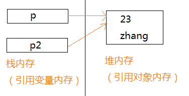
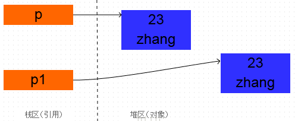
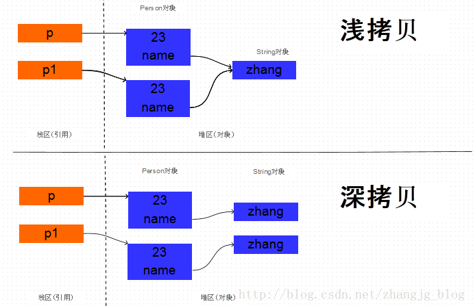

# **1.Java中对象的创建过程**

java创建对象的方式有以下两种：

（1）使用new操作符创建一个对象

（2）使用clone的方法复制一个对象（在Java中，clone是Object类的protected方法）

这两种对象创建方法有什么区别？

-   new操作时，首先根据new后面的类型（知道类型才能判断需要分配多大的内存空间）分配内存空间（此时分配到的内存空间相当于产生了一个新的对象，只是还有初始化），分配完内存空间后，在调用构造函数，初始化对象（填充对象的各个域的值）。构造方法返回后，一个对象创建完毕，可以把它的引用发布到外面，可以根据这个引用操作这个对象。
-   clone方法拷贝对象的第一步与new操作类似，都是分配内存，调用clone方法时，分配的内存和源对象（即调用的clone方法的对象）相同，然后再使用源对象中对应的各个域，填充新对象域，填充完成后，clone方法返回，一个新的相同的对象被创建，同样可以把这个新对象的引用发布到外部。

# **2 复制对象|复制引用**

首先定义一个Person类

```java
public class Person {
    private String name;
    private int age;

    public Person(String name, int age) {
        this.name = name;
        this.age = age;
    }

    public String getName() {
        return name;
    }

    public void setName(String name) {
        this.name = name;
    }

    public int getAge() {
        return age;
    }

    public void setAge(int age) {
        this.age = age;
    }

}
```

测试：

```java
public static void main(String[] args) {
        Person p = new Person(23, "zhang");  
        Person p1 = p;  

        System.out.println(p);  
        System.out.println(p1);         
}
```

运行结果：

> test1.Person@5f4fcc96
>
> test1.Person@5f4fcc96

由此可知p和p1指向的是同一个对象，p和p1只是引用而已。它们都指向了一个相同的对象Person(23, "zhang") 。 可以把这种现象叫做引用的复制。



克隆了一个对象：

```java
public class Person implements Cloneable{
    private String name;
    private int age;

    public Person(int age, String name) {
        this.name = name;
        this.age = age;
    }

    public String getName() {
        return name;
    }

    public void setName(String name) {
        this.name = name;
    }

    public int getAge() {
        return age;
    }

    public void setAge(int age) {
        this.age = age;
    }

    @Override
    protected Object clone() throws CloneNotSupportedException {
        return super.clone();
    }

    public static void main(String[] args) {
        Person p = new Person(23, "zhang");  
        Person p1 = null;
        try {
            p1 = (Person) p.clone();
        } catch (CloneNotSupportedException e) {
            e.printStackTrace();
        } 

        System.out.println(p);  
        System.out.println(p1); 

    }
}
```

运行结果：

> test1.Person@2f57d162  
> test1.Person@2e739136

由结果可以知道，两个对象的地址是不一样的，也就是说p1指向了新的对象，而不是把原来的对象的地址赋给p1。



# **3 深拷贝和浅拷贝**

```java
public class Person implements Cloneable{
    private String name;
    private int age;

    public Person(int age, String name) {
        this.name = name;
        this.age = age;
    }

    public String getName() {
        return name;
    }

    public void setName(String name) {
        this.name = name;
    }

    public int getAge() {
        return age;
    }

    public void setAge(int age) {
        this.age = age;
    }

    @Override
    protected Object clone() throws CloneNotSupportedException {
        return super.clone();
    }
}
```

上面的示例代码中，Person中有两个成员变量，分别是name和age， name是String类型， age是int类型.

由于age是基本数据类型， 那么对它的拷贝没有什么疑议，直接将一个4字节的整数值拷贝过来就行。但是name是String类型的，它只是一个引用，指向一个真正的String对象，那么对它的拷贝有两种方式：

-       浅拷贝：直接将源对象中的name的引用值拷贝给新对象的name字段。
-       深拷贝：根据原Person对象中的name指向的字符串对象创建一个新的相同的字符串对象，将这个新字符串对象的引用赋给新拷贝的Person对象的name字段。

    深拷贝和浅拷贝的原理如下图所示：



如果两个Person对象的name的地址值相同， 说明两个对象的name都指向同一个String对象， 也就是浅拷贝， 而如果两个对象的name的地址值不同， 那么就说明指向不同的String对象， 也就是在拷贝Person对象的时候， 同时拷贝了name引用的String对象， 也就是深拷贝。

测试：

```java
public static void main(String[] args) throws CloneNotSupportedException {   
    Person p = new Person(23, "zhang");
    Person p1 = (Person) p.clone();
    String result = p.getName() == p1.getName() ? //
            "clone是浅拷贝的": "clone是深拷贝的";
        System.out.println(result);
}
```

运行结果：

> clone是浅拷贝的

直接在clone()方法中,调用super.clone()则一定是浅拷贝。

**深拷贝**

在clone()方法中除了调用super.clone()之外，针对对象引用，需要将源对象引用的对象也clone一份，也可以重新创建一个对象实例,使用getter和setter方法进行赋值。

```java
public class Body implements Cloneable{  
    public Head head;  
    public Body() {}  
    public Body(Head head) {this.head = head;}  
  
    @Override  
    protected Object clone() throws CloneNotSupportedException {  
        Body newBody =  (Body) super.clone();
        newBody.head = (Head) head.clone();//针对对象引用,执行对象的clone方法
        return newBody;  
    }
}
```

```java
public class Head implements Cloneable{  
    public  Face face;

    public Head() {}

    public Head(Face face){this.face = face;}

    @Override  
    protected Object clone() throws CloneNotSupportedException {  
        return super.clone();  
    }  
}
```

```java
public static void main(String[] args) throws CloneNotSupportedException {   
    Body body = new Body(new Head());       
    Body body1 = (Body) body.clone();       
    System.out.println("body == body1 : " + (body == body1) );       
    System.out.println("body.head == body1.head : " +  (body.head == body1.head));     
}
```

运行结果：

> body == body1 : false
>
> body.head == body1.head : false

由此可见， body和body1内的head引用指向了不同的Head对象， 也就是说在clone Body对象的同时， 也拷贝了它所引用的Head对象， 进行了深拷贝。

**深拷贝-序列化与反序列化实现**

被拷贝对象实现Serializable接口，然后把对象的一个拷贝写到一个流里，再从流里读出来，便可以重建对象。 

这样做的前提是对象以及对象内部所引用到的对象**都是可串行化的**，否则，就需要仔细考察那些不可串行化的对象可否设成transient，从而将之排除在复制过程之外。

```java
import java.io.ByteArrayInputStream;
import java.io.ByteArrayOutputStream;
import java.io.ObjectInputStream;
import java.io.ObjectOutputStream;
import java.io.Serializable;

class Worker implements Serializable {
    private int age;
    private String name;

    public int getAge() {
        return age;
    }

    public void setAge(int age) {
        this.age = age;
    }

    public String getName() {
        return name;
    }

    public void setName(String name) {
        this.name = name;
    }
}

class Manager implements Serializable {
    private int age;
    private String name;
    private Worker worker;

    public Worker getWorker() {
        return worker;
    }

    public void setWorker(Worker worker) {
        this.worker = worker;
    }

    public int getAge() {
        return age;
    }

    public void setAge(int age) {
        this.age = age;
    }

    public String getName() {
        return name;
    }

    public void setName(String name) {
        this.name = name;
    }

    /**
     * 利用对象的序列化和反序列化实现对象的深拷贝
     *
     * @return
     * @throws Exception
     */
    public Object deepCopy() throws Exception {
        //字节数组输出流ByteArrayOutputStream类是在创建它的实例时，程序内部创建一个byte型别数组的缓冲区
        //将待序列化的对象数据暂存入该缓冲区
        ByteArrayOutputStream bos = new ByteArrayOutputStream();
        //创建对象输出流，是过滤流
        ObjectOutputStream oos = new ObjectOutputStream(bos);
        //将对象写入
        oos.writeObject(this);
        //bos.toArray()可以获得缓冲区内的数据
        ByteArrayInputStream bis = new ByteArrayInputStream(bos.toByteArray());
        ObjectInputStream ois = new ObjectInputStream(bis);
        return ois.readObject();
    }
}

public class CloneTest {
    public static void main(String[] args) throws Exception {
        Worker worker = new Worker();
        worker.setAge(25);
        worker.setName("zhangsan");

        Manager manager = new Manager();
        manager.setAge(50);
        manager.setName("tom");
        manager.setWorker(worker);

        Manager manager2 = (Manager) manager.deepCopy();//执行序列化和反序列化复制操作
        System.out.println("被拷贝的对象的年龄:"+manager.getAge() + "姓名:" + manager.getName());
        System.out.println("拷贝得到对象的年龄:"+manager2.getAge() + "姓名:" + manager2.getName());//输出克隆之后的变量值
        System.out.println("worker age:"+manager.getWorker().getAge() + " name:" + manager.getWorker().getName());
        System.out.println("worker1 age:"+manager2.getWorker().getAge() + " name:" + manager2.getWorker().getName());//查看对象引用的对象变量值
        manager2.getWorker().setName("lisi");//修改克隆对象的对象引用的对象变量值
        System.out.println(manager.getWorker().getName()+","+manager2.getWorker().getName());//观察是否影响到被克隆的对象的对象引用的对象变量值
    }
}
```

运行结果：

> 被拷贝的对象的年龄:50姓名:tom  
> 拷贝得到对象的年龄:50姓名:tom  
> worker age:25 name:zhangsan  
> worker1 age:25 name:zhangsan  
> zhangsan,lisi