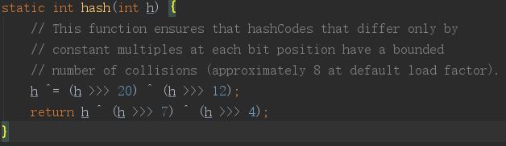

#### 常用的hash算法有哪些？

• 加法Hash：把输入元素一个一个的加起来构成最后的结果

• 位运算Hash：这类型Hash函数通过利用各种位运算（常见的是移位和异或）来充分的混合输入元素

• 乘法Hash：这种类型的Hash函数利用了乘法的不相关性（乘法的这种性质，最有名的莫过于平方取头尾的随机数生成算
法，虽然这种算法效果并不好）；jdk5.0里面的String类的hashCode()方法也使用乘法Hash；32位FNV算法

• 除法Hash：除法和乘法一样，同样具有表面上看起来的不相关性。不过，因为除法太慢，这种方式几乎找不到真正的应用

• 查表Hash：查表Hash最有名的例子莫过于CRC系列算法。虽然CRC系列算法本身并不是查表，但是，查表是它的一种最快
的实现方式。查表Hash中有名的例子有：Universal Hashing和Zobrist Hashing。他们的表格都是随机生成的。

• 混合Hash：混合Hash算法利用了以上各种方式。各种常见的Hash算法，比如MD5、Tiger都属于这个范围。它们一般很少
在面向查找的Hash函数里面使用


**Object类的hashCode.** 

  返回对象的经过处理后的内存地址，由于每个对象的内存地址都不一样，所以哈希码也不一样。这个是native方法，取决于JVM的内部设计，一般是某种C地址的偏移。


**String类的hashCode**

  根据String类包含的字符串的内容，根据 s[0]*31^(n-1) + s[1]*31^(n-2) + ... + s[n-1] 的计算，返回哈希码，只要字符串的内容相同，返回的哈希码也相同。

```
public int hashCode() {
    int h = hash;
    if (h == 0) {
        int off = offset;
        char val[] = value;
        int len = count;

        for (int i = 0; i < len; i++) {
            h = 31*h + val[off++];
        }
        hash = h;
    }
    return h;
}
```

  为什么选择31作为乘积因子，而且没有用一个常量来声明？主要原因有两个：

　　①、31是一个不大不小的质数，是作为 hashCode 乘子的优选质数之一。

　　②、31可以被 JVM 优化，`31 * i = (i << 5) - i。因为移位运算比乘法运行更快更省性能。`


**Integer**

  返回的哈希码就是Integer对象里所包含的那个整数的数值，例如Integer i1=new Integer(100), i1.hashCode的值就是100 。由此可见，2个一样大小的Integer对象，返回的哈希码也一样。


**Long**

  value ^ (value >>> 32)


**Boolean**

  value ? 1231 : 1237


**int，char这样的基本数据类型**

  它们不需要hashCode，如果需要存储时，将进行自动装箱操作，然后再存储。


**hashMap 的 hash():**

  在hashMap 中，key在数组中的位置计算：需要根据key的 hash值 对其数组长度进行取模得到。

  需要注意：元素的 hash 值，不是简单的使用key的 hashCode()。

  JDK8 中：

​    将key的hashCode的二进制表示： 高16位 与 低16位进行异或运算 的得到hash值。

  

  JDK 8 以前：

  


**hashtable**

  在**hashtable**中，key在数组中的位置计算：

> int hash = key.hashCode();
>
> int index = (hash & 0x7FFFFFFF) % tab.length;


**一致性hash**

   构造一个2^32的整数环，即0~(2^32-1)的数字空间，形成一个环，起点为0，终点为2^32-1。

  

  计算机器的ip的hash值，再对 2^32 取模。即：hash(IP) % 2^32，会映射到圆上的一点。

  将存储的key进行hash(key) % 2^32， 它的值在圆上映射的位置开始，顺时针方向找到的第一个机器节点，即为存储该key的机器节点。

  如果 新增/删除 服务器，则对受影响的key 进行重新分配即可。

  **虚拟节点**：解决 数据倾斜 的情况，防止出现大量数据存放在某一个 node 的情形。 

​    此时，将真实节点计算多个哈希形成多个虚拟节点并放置到哈希环上，真实节点不放置到哈希环上，只有虚拟节点才会放上去。 每次根据key得到存储对应的某个虚拟节点，还需要做一次虚拟节点向真实节点的映射处理。

  hash()方法的选用没有特别指明，但是需要保证出现hash碰撞的可能性要尽可能的小。重新计算Hash值的算法有很多，比如CRC32_HASH、FNV1_32_HASH、KETAMA_HASH等，其中KETAMA_HASH是默认的MemCache推荐的一致性Hash算法，用别的Hash算法也可以，比如FNV1_32_HASH算法的计算效率就会高一些。

```java
     /**
      * 使用FNV1_32_HASH算法计算服务器的Hash值,这里不使用重写hashCode的方法，最终效果没区别 
      */
     private static int getHash(String str)
     {
         final int p = 16777619;
         int hash = (int)2166136261L;
         for (int i = 0; i < str.length(); i++)
             hash = (hash ^ str.charAt(i)) * p;
         hash += hash << 13;
         hash ^= hash >> 7;
         hash += hash << 3;
         hash ^= hash >> 17;
         hash += hash << 5;
         
         // 如果算出来的值为负数则取其绝对值
         if (hash < 0)
             hash = Math.abs(hash);
         return hash;
     }
```


**hash 槽**

   Redis 集群的键空间被分割为 16384 个 hash 槽（slot）， 集群的最大节点数量也是 16384 个 。

  一个 Redis Cluster包含16384（0~16383）个哈希槽，存储在Redis Cluster中的所有键都会被映射到这些slot中。

  所有的master节点都会有一个槽区比如：0～1000，槽数是可以迁移的。 master节点的slave节点不分配槽，**只拥有读权限。**

   key的定位规则：**根据CRC-16(key)%16384的值来判断属于哪个槽区，从而判断该key属于哪个节点** 。CRC16(key) 是用于计算key的 CRC16校验和。

  当前集群有3个节点,槽默认是平均分的：
    节点 A （6381）包含 0 到 5499号哈希槽.
    节点 B （6382）包含5500 到 10999 号哈希槽.
    节点 C （6383）包含11000 到 16383号哈希槽.

​    如果想新添加一个节点D，我需要从节点 A, B, C中得部分槽到D上。

​    如果想移除节点A，需要将A中的槽，移到B和C节点上，然后将没有任何槽的A节点从集群中移除即可。

​    由于从一个节点将哈希槽移动到另一个节点并不会停止服务，所以无论添加删除或者改变某个节点的哈希槽的数量，都不会造成集群不可用的状态。


## 1. Hash是什么，它的作用

  先举个例子。我们每个活在世上的人，为了能够参与各种社会活动，都需要一个用于识别自己的标志。也许你觉得名字或是身份证就足以代表你这个人，但是这种代表性非常脆弱，因为重名的人很多，身份证也可以伪造。最可靠的办法是把一个人的所有基因序列记录下来用来代表这个人，但显然，这样做并不实际。而指纹看上去是一种不错的选择，虽然一些专业组织仍然可以模拟某个人的指纹，但这种代价实在太高了。

  而对于在互联网世界里传送的文件来说，如何标志一个文件的身份同样重要。比如说我们下载一个文件，文件的下载过程中会经过很多网络服务器、路由器的中转，如何保证这个文件就是我们所需要的呢？我们不可能去一一检测这个文件的每个字节，也不能简单地利用文件名、文件大小这些极容易伪装的信息，这时候，我们就需要一种指纹一样的标志来检查文件的可靠性，这种指纹就是我们现在所用的Hash算法(也叫散列算法)。

  **散列算法（Hash Algorithm）**，又称哈希算法，杂凑算法，是一种从任意文件中创造小的数字「指纹」的方法。与指纹一样，散列算法就是一种以较短的信息来保证文件唯一性的标志，这种标志与文件的每一个字节都相关，而且难以找到逆向规律。因此，当原有文件发生改变时，其标志值也会发生改变，从而告诉文件使用者当前的文件已经不是你所需求的文件。

  这种标志有何意义呢？之前文件下载过程就是一个很好的例子，事实上，现在大部分的网络部署和版本控制工具都在使用散列算法来保证文件可靠性。而另一方面，我们在进行文件系统同步、备份等工具时，使用散列算法来标志文件唯一性能帮助我们减少系统开销，这一点在很多云存储服务器中都有应用。

  当然，作为一种指纹，散列算法最重要的用途在于给证书、文档、密码等高安全系数的内容添加加密保护。这一方面的用途主要是得益于散列算法的**不可逆性**，这种不可逆性体现在，你不仅不可能根据一段通过散列算法得到的指纹来获得原有的文件，也不可能简单地创造一个文件并让它的指纹与一段目标指纹相一致。散列算法的这种不可逆性维持着很多安全框架的运营，而这也将是本文讨论的重点。

## 2. Hash算法有什么特点

  一个优秀的 hash 算法，将能实现：

- 正向快速：给定明文和 hash 算法，在有限时间和有限资源内能计算出 hash 值。
- 逆向困难：给定（若干） hash 值，在有限时间内很难（基本不可能）逆推出明文。
- 输入敏感：原始输入信息修改一点信息，产生的 hash 值看起来应该都有很大不同。
- 冲突避免：很难找到两段内容不同的明文，使得它们的 hash 值一致（发生冲突）。即对于任意两个不同的数据块，其hash值相同的可能性极小；对于一个给定的数据块，找到和它hash值相同的数据块极为困难。

  但在不同的使用场景中，如数据结构和安全领域里，其中对某一些特点会有所侧重。

### 2.1 Hash在管理数据结构中的应用(用于查找)

  在用到hash进行管理的数据结构中，就对速度比较重视，对抗碰撞不太看中，只要保证hash均匀分布就可以。比如hashmap，hash值（key）存在的目的是加速键值对的查找，key的作用是为了将元素适当地放在各个桶里，对于抗碰撞的要求没有那么高。换句话说，hash出来的key，只要保证value大致均匀的放在不同的桶里就可以了。但整个算法的set性能，直接与hash值产生的速度有关，所以这时候的hash值的产生速度就尤为重要，以JDK中的String.hashCode()方法为例：

```
public int hashCode() {
    int h = hash;
    //hash default value : 0 
    if (h == 0 && value.length > 0) {
        //value : char storage
        char val[] = value;
        for (int i = 0; i < value.length; i++) {
            h = 31 * h + val[i];
        }
        hash = h;
    }
    return h;
}
```

  很简洁的一个乘加迭代运算，在不少的hash算法中，使用的是异或+加法进行迭代，速度和前者差不多。

### 2.1 Hash在在密码学中的应用(用于加解密)

  在密码学中，hash算法的作用主要是用于消息摘要和签名，换句话说，它主要用于对整个消息的完整性进行校验。举个例子，我们登陆知乎的时候都需要输入密码，那么知乎如果明文保存这个密码，那么黑客就很容易窃取大家的密码来登陆，特别不安全。那么知乎就想到了一个方法，使用hash算法生成一个密码的签名，知乎后台只保存这个签名值。由于hash算法是不可逆的，那么黑客即便得到这个签名，也丝毫没有用处；而如果你在网站登陆界面上输入你的密码，那么知乎后台就会重新计算一下这个hash值，与网站中储存的原hash值进行比对，如果相同，证明你拥有这个账户的密码，那么就会允许你登陆。银行也是如此，银行是万万不敢保存用户密码的原文的，只会保存密码的hash值而而已。在这些应用场景里，对于抗碰撞和抗篡改能力要求极高，对速度的要求在其次。一个设计良好的hash算法，其抗碰撞能力是很高的。以MD5为例，其输出长度为128位，设计预期碰撞概率为，这是一个极小极小的数字——而即便是在MD5被王小云教授破解之后，其碰撞概率上限也高达，也就是说，至少需要找次才能有1/2的概率来找到一个与目标文件相同的hash值。而对于两个相似的字符串，MD5加密结果如下：

```
MD5("version1") = "966634ebf2fc135707d6753692bf4b1e";
MD5("version2") = "2e0e95285f08a07dea17e7ee111b21c8";
```

  可以看到仅仅一个比特位的改变，二者的MD5值就天差地别了

> ps : 其实把hash算法当成是一种加密算法，这是不准确的，我们知道加密总是相对于解密而言的，没有解密何谈加密呢，HASH的设计以无法解为目的的。并且如果我们不附加一个随机的salt值，HASH口令是很容易被字典攻击入侵的。

## 3. Hash算法是如何实现的？

  密码学和信息安全发展到现在，各种加密算法和散列算法已经不是只言片语所能解释得了的。在这里我们仅提供几个简单的概念供大家参考。

  作为散列算法，首要的功能就是要使用一种算法把原有的体积很大的文件信息用若干个字符来记录，还要保证每一个字节都会对最终结果产生影响。那么大家也许已经想到了，求模这种算法就能满足我们的需要。

  事实上，求模算法作为一种不可逆的计算方法，已经成为了整个现代密码学的根基。只要是涉及到计算机安全和加密的领域，都会有模计算的身影。散列算法也并不例外，一种最原始的散列算法就是单纯地选择一个数进行模运算，比如以下程序。

```
#  构造散列函数
def hash(a):
    return a % 8

#  测试散列函数功能
print(hash(233))
print(hash(234))
print(hash(235))

# 输出结果
- 1
- 2
- 3
```

  很显然，上述的程序完成了一个散列算法所应当实现的初级目标：用较少的文本量代表很长的内容（求模之后的数字肯定小于8）。但也许你已经注意到了，单纯使用求模算法计算之后的结果带有明显的规律性，这种规律将导致算法将能难保证不可逆性。所以我们将使用另外一种手段，那就是异或。

  再来看下面一段程序，我们在散列函数中加入一个异或过程。

```
#  构造散列函数
def hash(a):
    return (a % 8) ^ 5

#  测试散列函数功能
print(hash(233))
print(hash(234))
print(hash(235))

# 输出结果
- 4
- 7
- 6
```

  很明显的，加入一层异或过程之后，计算之后的结果规律性就不是那么明显了。

  当然，大家也许会觉得这样的算法依旧很不安全，如果用户使用连续变化的一系列文本与计算结果相比对，就很有可能找到算法所包含的规律。但是我们还有其他的办法。比如在进行计算之前对原始文本进行修改，或是加入额外的运算过程（如移位），比如以下程序。

```
#  构造散列函数
def hash(a):
    return (a + 2 + (a << 1)) % 8 ^ 5

#  测试散列函数功能
print(hash(233))
print(hash(234))
print(hash(235))

# 输出结果
- 0
- 5
- 6
```

  这样处理得到的散列算法就很难发现其内部规律，也就是说，我们并不能很轻易地给出一个数，让它经过上述散列函数运算之后的结果等于4——除非我们去穷举测试。

  上面的算法是不是很简单？事实上，下面我们即将介绍的常用算法MD5和SHA1，其本质算法就是这么简单，只不过会加入更多的循环和计算，来加强散列函数的可靠性。

## 4. Hash有哪些流行的算法

  目前流行的 Hash 算法包括 MD5、SHA-1 和 SHA-2。

- MD4（RFC 1320）是 MIT 的 Ronald L. Rivest 在 1990 年设计的，MD 是 Message Digest 的缩写。其输出为 128 位。MD4 已证明不够安全。
- MD5（RFC 1321）是 Rivest 于1991年对 MD4 的改进版本。它对输入仍以 512 位分组，其输出是 128 位。MD5 比 MD4 复杂，并且计算速度要慢一点，更安全一些。MD5 已被证明不具备”强抗碰撞性”。
- SHA （Secure Hash Algorithm）是一个 Hash 函数族，由 NIST（National Institute of Standards and Technology）于 1993 年发布第一个算法。目前知名的 SHA-1 在 1995 年面世，它的输出为长度 160 位的 hash 值，因此抗穷举性更好。SHA-1 设计时基于和 MD4 相同原理，并且模仿了该算法。SHA-1 已被证明不具”强抗碰撞性”。
- 为了提高安全性，NIST 还设计出了 SHA-224、SHA-256、SHA-384，和 SHA-512 算法（统称为 SHA-2），跟 SHA-1 算法原理类似。SHA-3 相关算法也已被提出。

  可以看出，上面这几种流行的算法，它们最重要的一点区别就是”强抗碰撞性”。

## 5. 那么，何谓Hash算法的「碰撞」？

  你可能已经发现了，在实现算法章节的第一个例子，我们尝试的散列算法得到的值一定是一个不大于8的自然数，因此，如果我们随便拿9个数去计算，肯定至少会得到两个相同的值，我们把这种情况就叫做散列算法的「碰撞」（Collision）。

  这很容易理解，因为作为一种可用的散列算法，其位数一定是有限的，也就是说它能记录的文件是有限的——而文件数量是无限的，两个文件指纹发生碰撞的概率永远不会是零。

  但这并不意味着散列算法就不能用了，因为凡事都要考虑代价，买光所有彩票去中一次头奖是毫无意义的。现代散列算法所存在的理由就是，它的不可逆性能在较大概率上得到实现，也就是说，发现碰撞的概率很小，这种碰撞能被利用的概率更小。

  随意找到一组碰撞是有可能的，只要穷举就可以。散列算法得到的指纹位数是有限的，比如MD5算法指纹字长为128位，意味着只要我们穷举21282128次，就肯定能得到一组碰撞——当然，这个时间代价是难以想象的，而更重要的是，仅仅找到一组碰撞并没有什么实际意义。更有意义的是，如果我们已经有了一组指纹，能否找到一个原始文件，让它的散列计算结果等于这组指纹。如果这一点被实现，我们就可以很容易地篡改和伪造网络证书、密码等关键信息。

  你也许已经听过MD5已经被破解的新闻——但事实上，即便是MD5这种已经过时的散列算法，也很难实现逆向运算。我们现在更多的还是依赖于海量字典来进行尝试，也就是通过已经知道的大量的文件——指纹对应关系，搜索某个指纹所对应的文件是否在数据库里存在。

### 5.1 MD5的实际碰撞案例

  下面让我们来看看一个真实的碰撞案例。我们之所以说MD5过时，是因为它在某些时候已经很难表现出散列算法的某些优势——比如在应对文件的微小修改时，散列算法得到的指纹结果应当有显著的不同，而下面的程序说明了MD5并不能实现这一点。

```
import hashlib

#  两段HEX字节串，注意它们有细微差别
a = bytearray.fromhex("0e306561559aa787d00bc6f70bbdfe3404cf03659e704f8534c00ffb659c4c8740cc942feb2da115a3f4155cbb8607497386656d7d1f34a42059d78f5a8dd1ef")

b = bytearray.fromhex("0e306561559aa787d00bc6f70bbdfe3404cf03659e744f8534c00ffb659c4c8740cc942feb2da115a3f415dcbb8607497386656d7d1f34a42059d78f5a8dd1ef")

#  输出MD5，它们的结果一致
print(hashlib.md5(a).hexdigest())
print(hashlib.md5(b).hexdigest())

### a和b输出结果都为：
cee9a457e790cf20d4bdaa6d69f01e41
cee9a457e790cf20d4bdaa6d69f01e41
```

  而诸如此类的碰撞案例还有很多，上面只是原始文件相对较小的一个例子。事实上现在我们用智能手机只要数秒就能找到MD5的一个碰撞案例，因此，MD5在数年前就已经不被推荐作为应用中的散列算法方案，取代它的是SHA家族算法，也就是[安全散列算法](https://zh.wikipedia.org/wiki/SHA家族)（Secure Hash Algorithm，缩写为SHA）。

### 5.2 SHA家族算法以及SHA1碰撞

  安全散列算法与MD5算法本质上的算法是类似的，但安全性要领先很多——这种领先型更多的表现在碰撞攻击的时间开销更大，当然相对应的计算时间也会慢一点。

  SHA家族算法的种类很多，有SHA0、SHA1、SHA256、SHA384等等，它们的计算方式和计算速度都有差别。其中SHA1是现在用途最广泛的一种算法。包括GitHub在内的众多版本控制工具以及各种云同步服务都是用SHA1来区别文件，很多安全证书或是签名也使用SHA1来保证唯一性。长期以来，人们都认为SHA1是十分安全的，至少大家还没有找到一次碰撞案例。

  但这一事实在2017年2月破灭了。CWI和Google的研究人员们成功找到了一例SHA1碰撞，而且很厉害的是，发生碰撞的是两个真实的、可阅读的PDF文件。这两个PDF文件内容不相同，但SHA1值完全一样。(对于这件事的影响范围及讨论，可参考知乎上的讨论:[如何评价 2 月 23 日谷歌宣布实现了 SHA-1 碰撞？](https://www.zhihu.com/question/56234281/answer/148349930))

  所以，对于一些大的商业机构来说， MD5 和 SHA1 已经不够安全，推荐至少使用 SHA2-256 算法。

## 6. Hash在Java中的应用

### 6.1 HashMap的复杂度

  在介绍HashMap的实现之前，先考虑一下，HashMap与ArrayList和LinkedList在数据复杂度上有什么区别。下图是他们的性能对比图：

|            | 获取             | 查找             | 添加/删除        | 空间 |
| ---------- | ---------------- | ---------------- | ---------------- | ---- |
| ArrayList  | O(1)             | O(1)             | O(N）            | O(N) |
| LinkedList | O(N)             | O(N)             | O(1)             | O(N) |
| HashMap    | O(N/Bucket_size) | O(N/Bucket_size) | O(N/Bucket_size) | O(N) |

  可以看出HashMap整体上性能都非常不错，但是不稳定，为O(N/Buckets)，N就是以数组中没有发生碰撞的元素，Buckets是因碰撞产生的链表。

> 注：发生碰撞实际上是非常稀少的，所以N/Bucket_size约等于1

  HashMap是对Array与Link的折衷处理，Array与Link可以说是两个速度方向的极端，Array注重于数据的获取，而处理修改（添加/删除）的效率非常低；Link由于是每个对象都保持着下一个对象的指针，查找某个数据需要遍历之前所有的数据，所以效率比较低，而在修改操作中比较快。

### 6.2 [HashMap](http://hg.openjdk.java.net/jdk8/jdk8/jdk/file/687fd7c7986d/src/share/classes/java/util/HashMap.java)的实现

  本文以JDK8的API实现进行分析

#### 6.2.1 对key进行Hash计算

  在JDK8中，由于使用了红黑树来处理大的链表开销，所以hash这边可以更加省力了，只用计算hashCode并移动到低位就可以了。

```
static final int hash(Object key) {
    int h;
    //计算hashCode，并无符号移动到低位
    return (key == null) ? 0 : (h = key.hashCode()) ^ (h >>> 16);
}
```

  举个例子: 363771819^(363771819 >>> 16)

```
0001 0101 1010 1110 1011 0111 1010 1011(363771819)
0000 0000 0000 0000 0001 0101 1010 1110(5550) XOR
--------------------------------------- =
0001 0101 1010 1110 1010 0010 0000 0101(363766277)
```

  这样做可以实现了高地位更加均匀地混到一起。

  下面给出在Java中几个常用的哈希码(hashCode)的算法。

1. Object类的hashCode. 返回对象的经过处理后的内存地址，由于每个对象的内存地址都不一样，所以哈希码也不一样。这个是native方法，取决于JVM的内部设计，一般是某种C地址的偏移。
2. String类的hashCode. 根据String类包含的字符串的内容，根据一种特殊算法返回哈希码，只要字符串的内容相同，返回的哈希码也相同。
3. Integer等包装类，返回的哈希码就是Integer对象里所包含的那个整数的数值，例如Integer i1=new Integer(100), i1.hashCode的值就是100 。由此可见，2个一样大小的Integer对象，返回的哈希码也一样。
4. int，char这样的基础类，它们不需要hashCode，如果需要存储时，将进行自动装箱操作，计算方法同上。

#### 6.2.2 获取到数组的index的位置

  计算了Hash，我们现在要把它插入数组中了

```
i = (tab.length - 1) & hash；
```

  通过位运算，确定了当前的位置，因为HashMap数组的大小总是2^n，所以实际的运算就是 (0xfff…ff) & hash ，这里的tab.length-1相当于一个mask，滤掉了大于当前长度位的hash，使每个i都能插入到数组中。

#### 6.2.3 生成包装类

  这个对象是一个包装类，Node

```
static class Node<K,V> implements Map.Entry<K,V> {
        final int hash;
        final K key;
        V value;
        Node<K,V> next;
        //getter and setter .etc.
}
```

#### 6.2.4 插入包装类到数组

(1). 如果输入当前的位置是空的，就插进去，如图，左为插入前，右为插入后

```
    0           0
    |           |
    1 -> null   1 - > null
    |           |
    2 -> null   2 - > null
    |           | 
    ..-> null   ..- > null
    |           | 
    i -> null   i - > new node
    |           |
    n -> null   n - > null
```


(2). 如果当前位置已经有了node，且它们发生了碰撞，则新的放到前面，旧的放到后面，这叫做链地址法处理冲突。

```
    0           0
    |           |
    1 -> null   1 - > null
    |           |
    2 -> null   2 - > null
    |           | 
    ..-> null   ..- > null
    |           | 
    i -> old    i - > new - > old
    |           |
    n -> null   n - > null
```


  我们可以发现，失败的hashCode算法会导致HashMap的性能由数组下降为链表，所以想要避免发生碰撞，就要提高hashCode结果的均匀性。

### 6.3 扩容

  如果当表中的75%已经被占用，即视为需要扩容了

```
(threshold = capacity * load factor ) < size
```

  它主要有两个步骤：

#### 6.3.1 容量加倍

  左移1位，就是扩大到两倍，用位运算取代了乘法运算

```
newCap = oldCap << 1;
newThr = oldThr << 1;
```

#### 6.3.2 遍历计算Hash

```java
for (int j = 0; j < oldCap; ++j) {
        Node<K,V> e;
        //如果发现当前有Bucket
        if ((e = oldTab[j]) != null) {
            oldTab[j] = null;
            //如果这里没有碰撞
            if (e.next == null)
                //重新计算Hash，分配位置
                newTab[e.hash & (newCap - 1)] = e;
            //这个见下面的新特性介绍，如果是树，就填入树
            else if (e instanceof TreeNode)
                ((TreeNode<K,V>)e).split(this, newTab, j, oldCap);
            //如果是链表，就保留顺序....目前就看懂这点
            else { // preserve order
                Node<K,V> loHead = null, loTail = null;
                Node<K,V> hiHead = null, hiTail = null;
                Node<K,V> next;
                do {
                    next = e.next;
                    if ((e.hash & oldCap) == 0) {
                        if (loTail == null)
                            loHead = e;
                        else
                            loTail.next = e;
                        loTail = e;
                    }
                    else {
                        if (hiTail == null)
                            hiHead = e;
                        else
                            hiTail.next = e;
                        hiTail = e;
                    }
                } while ((e = next) != null);
                if (loTail != null) {
                    loTail.next = null;
                    newTab[j] = loHead;
                }
                if (hiTail != null) {
                    hiTail.next = null;
                    newTab[j + oldCap] = hiHead;
                }
            }
        }
    }
```


  由此可以看出扩容需要遍历并重新赋值，成本非常高，所以选择一个好的初始容量非常重要。

### 6.4 扩容如何提升性能？

- 解决扩容损失：如果知道大致需要的容量，把初始容量设置好以解决扩容损失；
  比如我现在有1000个数据，需要 1000/0.75 = 1333 个坑位，又 1024 < 1333 < 2048，所以最好使用2048作为初始容量。
- 解决碰撞损失：使用高效的HashCode与loadFactor，这个…由于JDK8的高性能出现，这儿问题也不大了。

### 6.5 HashMap与HashTable的主要区别

  在很多的Java基础书上都已经说过了，他们的主要区别其实就是Table全局加了线程同步保护

- HashTable线程更加安全，代价就是因为它粗暴的添加了同步锁，所以会有性能损失。
- 其实有更好的concurrentHashMap可以替代HashTable，一个是方法级，一个是Class级。

##  

### 7 用于查找的Hash函数实现

  用于查找的 Hash函数应用的主要对象是数组（比如，字符串），而其目标一般是一个int类型，可以简单的划分为如下几类：

> \1. 加法Hash；
> \2. 位运算Hash；
> \3. 乘法Hash；
> \4. 除法Hash；
> \5. 查表Hash；
> \6. 混合Hash；

  下面详细的介绍以上各种方式在实际中的运用。

#### 7.1 加法Hash

  所谓的加法Hash就是把输入元素一个一个的加起来构成最后的结果。标准的加法Hash的构造如下：

>  static int additiveHash(String key, int prime)
>  {
>  int hash, i;
>  for (hash = key.length(), i = 0; i < key.length(); i++)
>   hash += key.charAt(i);
>  return (hash % prime);
>  }

  这里的prime是任意的质数，看得出，结果的值域为[0,prime-1]。

#### 7.2 位运算Hash

  这类型Hash函数通过利用各种位运算（常见的是移位和异或）来充分的混合输入元素。比如，标准的旋转Hash的构造如下：

>  static int rotatingHash(String key, int prime)
>  {
>   int hash, i;
>   for (hash=key.length(), i=0; i<key.length(); ++i)
>    hash = (hash<<4)^(hash>>28)^key.charAt(i);
>   return (hash % prime);
>  }

  先移位，然后再进行各种位运算是这种类型Hash函数的主要特点。比如，以上的那段计算hash的代码还可以有如下几种变形：

>    hash = (hash<<5)^(hash>>27)^key.charAt(i);
>    hash += key.charAt(i);
>    hash += (hash << 10);
>    hash ^= (hash >> 6);
>    if((i&1) == 0) {
>      hash ^= (hash<<7) ^ key.charAt(i) ^ (hash>>3);
>    }  else {
>      hash ^= ~((hash<<11) ^ key.charAt(i) ^ (hash >>5));
>    }
>    hash += (hash<<5) + key.charAt(i);
>    hash = key.charAt(i) + (hash<<6) + (hash>>16) – hash;
>    hash ^= ((hash<<5) + key.charAt(i) + (hash>>2));

#### 7.3 乘法Hash

  这种类型的Hash函数利用了乘法的不相关性（乘法的这种性质，最有名的莫过于平方取头尾的随机数生成[算法](http://lib.csdn.net/base/datastructure)，虽然这种算法效果并不好）。比如，

>  static int bernstein(String key)
>  {
>   int hash = 0;
>   int i;
>   for (i=0; i<key.length(); ++i) hash = 33*hash + key.charAt(i);
>   return hash;
>  }

  jdk5.0里面的String类的hashCode()方法也使用乘法Hash。不过，它使用的乘数是31。推荐的乘数还有：131, 1313, 13131, 131313等等。

使用这种方式的著名Hash函数还有：

>  // 32位FNV算法
>  int M_SHIFT = 0;
>   public int FNVHash(byte[] data) {
>     int hash = (int)2166136261L;
>     for(byte b : data)
>       hash = (hash * 16777619) ^ b;
>     if (M_SHIFT == 0)
>       return hash;
>     return (hash ^ (hash >> M_SHIFT)) & M_MASK;
> }

  以及改进的FNV算法：

> public static int FNVHash1(String data)
>   {
>     final int p = 16777619;
>     int hash = (int)2166136261L;
>     for(int i=0;i<data.length();i++)
>       hash = (hash ^ data.charAt(i)) * p;
>     hash += hash << 13;
>     hash ^= hash >> 7;
>     hash += hash << 3;
>     hash ^= hash >> 17;
>     hash += hash << 5;
>     return hash;
> }

  除了乘以一个固定的数，常见的还有乘以一个不断改变的数，比如：

> static int RSHash(String str) {
>     int b  = 378551;
>     int a  = 63689;
>     int hash = 0;
>
> ​    for(int i = 0; i < str.length(); i++)
> ​    {
> ​     hash = hash * a + str.charAt(i);
> ​     a  = a * b;
> ​    }
> ​    return (hash & 0x7FFFFFFF);
> }

  虽然Adler32算法的应用没有CRC32广泛，不过，它可能是乘法Hash里面最有名的一个了。关于它的介绍，大家可以去看RFC 1950规范。

#### 7.4 除法Hash

  除法和乘法一样，同样具有表面上看起来的不相关性。不过，因为除法太慢，这种方式几乎找不到真正的应用。需要注意的是，我们在前面看到的hash的 结果除以一个prime的目的只是为了保证结果的范围。如果你不需要它限制一个范围的话，可以使用如下的代码替代”hash%prime”： hash = hash ^ (hash>>10) ^ (hash>>20)。

#### 7.5 查表Hash

  查表Hash最有名的例子莫过于CRC系列算法。虽然CRC系列算法本身并不是查表，但是，查表是它的一种最快的实现方式。查表Hash中有名的例子有：Universal Hashing和Zobrist Hashing。他们的表格都是随机生成的。

#### 7.6 混合Hash

  混合Hash算法利用了以上各种方式。各种常见的Hash算法，比如MD5、Tiger都属于这个范围。它们一般很少在面向查找的Hash函数里面使用。

#### 7.7 对Hash算法的评价

[  http://www.burtleburtle.net/bob/hash/doobs.html](http://www.burtleburtle.net/bob/hash/doobs.html) 这个页面提供了对几种流行Hash算法的评价。我们对Hash函数的建议如下：

  \1. 字符串的Hash。最简单可以使用基本的乘法Hash，当乘数为33时，对于英文单词有很好的散列效果（小于6个的小写形式可以保证没有冲突）。复杂一点可以使用FNV算法（及其改进形式），它对于比较长的字符串，在速度和效果上都不错。

  \2. 长数组的Hash。可以使用http://burtleburtle.net/bob/c/lookup3.c这种算法，它一次运算多个字节，速度还算不错。

#### 7.8 后记

  本文简略的介绍了一番实际应用中的用于查找的Hash算法。Hash算法除了应用于这个方面以外，另外一个著名的应用是巨型字符串匹配（这时的 Hash算法叫做：rolling hash，因为它必须可以滚动的计算）。设计一个真正好的Hash算法并不是一件容易的事情。做为应用来说，选择一个适合的算法是最重要的。

#### **7.9 数组hash**

```cpp
inline int hashcode(const int *v) {
   int s = 0;
   for(int i=0; i<k; i++)
     s=((s<<2)+(v[i]>>4))^(v[i]<<10);
     s = s % M;
     s = s < 0 ? s + M : s;
   return s;
}
```


  注：虽说以上的hash能极大程度地避免冲突，但是冲突是在所难免的。所以无论用哪种hash函数，都要加上处理冲突的方法。


```java
/**
 * Hash算法大全<br>
 * 推荐使用FNV1算法
 */
public class HashAlgorithms {
	/**
	 * 加法hash
	 * 
	 * @param key
	 *            字符串
	 * @param prime
	 *            一个质数
	 * @return hash结果
	 */
	public static int additiveHash(String key, int prime) {
		int hash, i;
		for (hash = key.length(), i = 0; i < key.length(); i++)
			hash += key.charAt(i);
		return (hash % prime);
	}
 
	/**
	 * 旋转hash
	 * 
	 * @param key
	 *            输入字符串
	 * @param prime
	 *            质数
	 * @return hash值
	 */
	public static int rotatingHash(String key, int prime) {
		int hash, i;
		for (hash = key.length(), i = 0; i < key.length(); ++i)
			hash = (hash << 4) ^ (hash >> 28) ^ key.charAt(i);
		return (hash % prime);
		// return (hash ^ (hash>>10) ^ (hash>>20));
	}
	// 替代：
	// 使用：hash = (hash ^ (hash>>10) ^ (hash>>20)) & mask;
	// 替代：hash %= prime;
 
	/**
	 * MASK值，随便找一个值，最好是质数
	 */
	static int M_MASK = 0x8765fed1;
 
	/**
	 * 一次一个hash
	 * 
	 * @param key
	 *            输入字符串
	 * @return 输出hash值
	 */
	public static int oneByOneHash(String key) {
		int hash, i;
		for (hash = 0, i = 0; i < key.length(); ++i) {
			hash += key.charAt(i);
			hash += (hash << 10);
			hash ^= (hash >> 6);
		}
		hash += (hash << 3);
		hash ^= (hash >> 11);
		hash += (hash << 15);
		// return (hash & M_MASK);
		return hash;
	}
 
	/**
	 * Bernstein's hash
	 * 
	 * @param key
	 *            输入字节数组
	 * @param level
	 *            初始hash常量
	 * @return 结果hash
	 */
	public static int bernstein(String key) {
		int hash = 0;
		int i;
		for (i = 0; i < key.length(); ++i)
			hash = 33 * hash + key.charAt(i);
		return hash;
	}
 
	/**
	 * Universal Hashing
	 */
	public static int universal(char[] key, int mask, int[] tab) {
		int hash = key.length, i, len = key.length;
		for (i = 0; i < (len << 3); i += 8) {
			char k = key[i >> 3];
			if ((k & 0x01) == 0)
				hash ^= tab[i + 0];
			if ((k & 0x02) == 0)
				hash ^= tab[i + 1];
			if ((k & 0x04) == 0)
				hash ^= tab[i + 2];
			if ((k & 0x08) == 0)
				hash ^= tab[i + 3];
			if ((k & 0x10) == 0)
				hash ^= tab[i + 4];
			if ((k & 0x20) == 0)
				hash ^= tab[i + 5];
			if ((k & 0x40) == 0)
				hash ^= tab[i + 6];
			if ((k & 0x80) == 0)
				hash ^= tab[i + 7];
		}
		return (hash & mask);
	}
 
	/**
	 * Zobrist Hashing
	 */
	public static int zobrist(char[] key, int mask, int[][] tab) {
		int hash, i;
		for (hash = key.length, i = 0; i < key.length; ++i)
			hash ^= tab[i][key[i]];
		return (hash & mask);
	}
 
	// LOOKUP3
	// 见Bob Jenkins(3).c文件
 
	// 32位FNV算法
	static int M_SHIFT = 0;
 
	/**
	 * 32位的FNV算法
	 * 
	 * @param data
	 *            数组
	 * @return int值
	 */
	public static int FNVHash(byte[] data) {
		int hash = (int) 2166136261L;
		for (byte b : data)
			hash = (hash * 16777619) ^ b;
		if (M_SHIFT == 0)
			return hash;
		return (hash ^ (hash >> M_SHIFT)) & M_MASK;
	}
 
	/**
	 * 改进的32位FNV算法1
	 * 
	 * @param data
	 *            数组
	 * @return int值
	 */
	public static int FNVHash1(byte[] data) {
		final int p = 16777619;
		int hash = (int) 2166136261L;
		for (byte b : data)
			hash = (hash ^ b) * p;
		hash += hash << 13;
		hash ^= hash >> 7;
		hash += hash << 3;
		hash ^= hash >> 17;
		hash += hash << 5;
		return hash;
	}
 
	/**
	 * 改进的32位FNV算法1
	 * 
	 * @param data
	 *            字符串
	 * @return int值
	 */
	public static int FNVHash1(String data) {
		final int p = 16777619;
		int hash = (int) 2166136261L;
		for (int i = 0; i < data.length(); i++)
			hash = (hash ^ data.charAt(i)) * p;
		hash += hash << 13;
		hash ^= hash >> 7;
		hash += hash << 3;
		hash ^= hash >> 17;
		hash += hash << 5;
		return hash;
	}
 
	/**
	 * Thomas Wang的算法，整数hash
	 */
	public static int intHash(int key) {
		key += ~(key << 15);
		key ^= (key >>> 10);
		key += (key << 3);
		key ^= (key >>> 6);
		key += ~(key << 11);
		key ^= (key >>> 16);
		return key;
	}
 
	/**
	 * RS算法hash
	 * 
	 * @param str
	 *            字符串
	 */
	public static int RSHash(String str) {
		int b = 378551;
		int a = 63689;
		int hash = 0;
		for (int i = 0; i < str.length(); i++) {
			hash = hash * a + str.charAt(i);
			a = a * b;
		}
		return (hash & 0x7FFFFFFF);
	}
	/* End Of RS Hash Function */
 
	/**
	 * JS算法
	 */
	public static int JSHash(String str) {
		int hash = 1315423911;
		for (int i = 0; i < str.length(); i++) {
			hash ^= ((hash << 5) + str.charAt(i) + (hash >> 2));
		}
		return (hash & 0x7FFFFFFF);
	}
	/* End Of JS Hash Function */
 
	/**
	 * PJW算法
	 */
	public static int PJWHash(String str) {
		int BitsInUnsignedInt = 32;
		int ThreeQuarters = (BitsInUnsignedInt * 3) / 4;
		int OneEighth = BitsInUnsignedInt / 8;
		int HighBits = 0xFFFFFFFF << (BitsInUnsignedInt - OneEighth);
		int hash = 0;
		int test = 0;
		for (int i = 0; i < str.length(); i++) {
			hash = (hash << OneEighth) + str.charAt(i);
 
			if ((test = hash & HighBits) != 0) {
				hash = ((hash ^ (test >> ThreeQuarters)) & (~HighBits));
			}
		}
		return (hash & 0x7FFFFFFF);
	}
	/* End Of P. J. Weinberger Hash Function */
 
	/**
	 * ELF算法
	 */
	public static int ELFHash(String str) {
		int hash = 0;
		int x = 0;
		for (int i = 0; i < str.length(); i++) {
			hash = (hash << 4) + str.charAt(i);
			if ((x = (int) (hash & 0xF0000000L)) != 0) {
				hash ^= (x >> 24);
				hash &= ~x;
			}
		}
		return (hash & 0x7FFFFFFF);
	}
	/* End Of ELF Hash Function */
 
	/**
	 * BKDR算法
	 */
	public static int BKDRHash(String str) {
		int seed = 131; // 31 131 1313 13131 131313 etc..
		int hash = 0;
		for (int i = 0; i < str.length(); i++) {
			hash = (hash * seed) + str.charAt(i);
		}
		return (hash & 0x7FFFFFFF);
	}
	/* End Of BKDR Hash Function */
 
	/**
	 * SDBM算法
	 */
	public static int SDBMHash(String str) {
		int hash = 0;
		for (int i = 0; i < str.length(); i++) {
			hash = str.charAt(i) + (hash << 6) + (hash << 16) - hash;
		}
		return (hash & 0x7FFFFFFF);
	}
	/* End Of SDBM Hash Function */
 
	/**
	 * DJB算法
	 */
	public static int DJBHash(String str) {
		int hash = 5381;
		for (int i = 0; i < str.length(); i++) {
			hash = ((hash << 5) + hash) + str.charAt(i);
		}
		return (hash & 0x7FFFFFFF);
	}
	/* End Of DJB Hash Function */
 
	/**
	 * DEK算法
	 */
	public static int DEKHash(String str) {
		int hash = str.length();
		for (int i = 0; i < str.length(); i++) {
			hash = ((hash << 5) ^ (hash >> 27)) ^ str.charAt(i);
		}
		return (hash & 0x7FFFFFFF);
	}
	/* End Of DEK Hash Function */
 
	/**
	 * AP算法
	 */
	public static int APHash(String str) {
		int hash = 0;
		for (int i = 0; i < str.length(); i++) {
			hash ^= ((i & 1) == 0) ? ((hash << 7) ^ str.charAt(i) ^ (hash >> 3))
					: (~((hash << 11) ^ str.charAt(i) ^ (hash >> 5)));
		}
		// return (hash & 0x7FFFFFFF);
		return hash;
	}
	/* End Of AP Hash Function */
 
	/**
	 * JAVA自己带的算法
	 */
	public static int java(String str) {
		int h = 0;
		int off = 0;
		int len = str.length();
		for (int i = 0; i < len; i++) {
			h = 31 * h + str.charAt(off++);
		}
		return h;
	}
 
	/**
	 * 混合hash算法，输出64位的值
	 */
	public static long mixHash(String str) {
		long hash = str.hashCode();
		hash <<= 32;
		hash |= FNVHash1(str);
		return hash;
	}
}
```


### 8.加密算法的应用

  Hash算法严格上来说并不属于加密算法，而是与加密算法属于并列关系的一种算法。

  概括来说，哈希（Hash）是将目标文本转换成具有相同长度的、不可逆的杂凑字符串（或叫做消息摘要），而加密（Encrypt）是将目标文本转换成具有不同长度的、可逆的密文。

  因为Hash算法在信息的转化过程中，具体来说，两者的主要区别有以下两个：

​    1）Hash算法转换过程不可逆，而加密转换过程可逆

​    2）Hash算法无论输入的源数据的长度是多少，同一种Hash算法转换后结果的长度都相同。而加密转换后结果的长度一般与源数据的长度正相关。

  关于Hash算法和加解密算法，我们讨论如下几个问题：

  1.为什么Hash算法是不可逆，但是加密算法是可逆的？

​    这里的不可逆既指不能根据转换后的结果逆转回原文，也指对于两个输入，即使其转换结果相同也不能说这两个输入就一定相同。
因为，Hash算法的定义域是一个无限集合，但是值域确是一个有限集合，将一个无限集合映射到有限集合上，根据“鸽笼原理”，每个哈希结果都存在无数个可能的目标文本，因此哈希是一个多对一的映射，所以它也不存在逆映射。

​    但是对于加密算法，它的结果往往取决于输入，其定义域和值域都是无限集合，明显是一个一一映射，对于一一映射，理论上都是可逆的。

  2.对于Hash算法和加解密算法一般情况下我们是如何选择的呢

​    基本原则是：如果被保护数据仅仅用作比较验证，在以后不需要还原成明文形式，则使用哈希；如果被保护数据在以后需要被还原成明文，则需要使用加密。

​    如一般情况下，几乎所有的注册用户时我们输入的密码都是使用Hash算法进行加密然后将其保存在数据库中的。当我们登录时，输入我们的密码，然后通过Hash运算，将运算结果与数据库中存储的结果比较，相同的话就登录，不同的话就代表密码错误，需要重新输入。

​    当我们忘记自己的密码需要修改密码时，我们需要使用密保等进行验证，验证成功后需要设置新密码，然后Hash算出新密码的结果，将数据库中的源密码的Hash结果覆盖。而不是我们忘记密码后服务器将我们的原密码给我们重新发送过来，然后我么是原密码进行登录。这是几乎是不可能的，原因就是因为Hash算法是不可逆的。

​    而对于使用加解密算法，例子就很多了。比如加密文件，将加密后的数据保存后者发送给他人。别人不知道密码时是无法解密的，只有输入密码后才能将加密后的文件解密出来。

  先来我们来看常用的Hash算法都有哪些。

  常见的Hash算法有：MD2、MD4、MD5、HAVAL、SHA、SHA-1、HMAC、HMAC-MD5、HMAC-SHA1等

  下来我们看MD5和SHA1两种Hash算法在Java中的使用。

#### 8.1 MD5算法

  Message Digest Algorithm MD5（消息摘要算法5）为计算机安全领域广泛使用的一种散列函数，用以提供消息的完整性保护。是计算机广泛使用的杂凑算法之一，将数据（如汉字）运算为另一固定长度值，是杂凑算法的基础原理，MD5的前身有MD2、MD3和MD4。

  MD5算法具有以下特点：

> ​    1、压缩性：任意长度的数据，算出的MD5值长度都是固定的。
> ​    2、容易计算：从原数据计算出MD5值很容易。
> ​    3、抗修改性：对原数据进行任何改动，哪怕只修改1个字节，所得到的MD5值都有很大区别。
> ​    4、强抗碰撞：已知原数据和其MD5值，想找到一个具有相同MD5值的数据（即伪造数据）是非常困难的。

  MD5应用场景：

> ​    1、一致性验证
> ​    2、数字签名
> ​    3、安全访问认证

  首先，我们还是先新建一个MD5Util类来封装MD5的操作：

```java
import java.io.File;
import java.io.FileInputStream;
import java.io.IOException;
import java.io.UnsupportedEncodingException;
import java.security.MessageDigest;
import java.security.NoSuchAlgorithmException;

public class MD5Util {
    /**
     * 计算字符串的MD5值
     * @param string 明文
     * @return       字符串的MD5值
     */
    public static String md5(String string) {
        if (string.isEmpty()) {
            return "";
        }
        MessageDigest md5 = null;
        try {
            md5 = MessageDigest.getInstance("MD5");
            byte[] bytes = md5.digest(string.getBytes("UTF-8"));
            String result = "";
            for (byte b : bytes) {
                String temp = Integer.toHexString(b & 0xff);
                if (temp.length() == 1) {
                    temp = "0" + temp;
                }
                result += temp;
            }
            return result;
        } catch (NoSuchAlgorithmException e) {
            e.printStackTrace();
        } catch (UnsupportedEncodingException e) {
            e.printStackTrace();
        }
        return "";
    }

    /**
     * 计算文件的MD5值
     * @param file 文件File
     * @return     文件的MD5值
     */
    public static String md5(File file) {
        if (file == null || !file.isFile() || !file.exists()) {
            return "";
        }
        FileInputStream in = null;
        String result = "";
        byte buffer[] = new byte[0124];
        int len;
        try {
            MessageDigest md5 = MessageDigest.getInstance("MD5");
            in = new FileInputStream(file);
            while ((len = in.read(buffer)) != -1) {
                md5.update(buffer, 0, len);
            }
            byte[] bytes = md5.digest();

            for (byte b : bytes) {
                String temp = Integer.toHexString(b & 0xff);
                if (temp.length() == 1) {
                    temp = "0" + temp;
                }
                result += temp;
            }
        } catch (Exception e) {
            e.printStackTrace();
        }finally {
            if(null!=in){
                try {
                    in.close();
                } catch (IOException e) {
                    e.printStackTrace();
                }
            }
        }
        return result;
    }
}
```


  在MD5Util类中，我们分别定义了对字符串和文件计算MD5值的函数，接下来只需要在main函数使用这两个函数。

#### 8.2 SHA1算法

  安全哈希算法（Secure Hash Algorithm）主要适用于数字签名标准（Digital Signature Standard DSS）里面定义的数字签名算法（Digital Signature Algorithm DSA）。对于长度小于2^64位的消息，SHA1会产生一个160位的消息摘要。当接收到消息的时候，这个消息摘要可以用来验证数据的完整性。在传输的过程中，数据很可能会发生变化，那么这时候就会产生不同的消息摘要。

  SHA1有如下特性：不可以从消息摘要中复原信息；两个不同的消息不会产生同样的消息摘要。

  SHA1算法原理大概如下：

  首先进行SHA1分组：
    对于任意长度的明文，SHA1可以产生160位的摘要。对明文的分组处理过程如下：

> ​    1）对数据流尾部添加0x80标记。任意长度的明文首先需要添加位数，使明文总长度为448（mod512）位。将0x80 字节追加到数据流尾部以后，源数据流的整个长度将会发生变化，考虑到还要添加64位（8个字节）的位长度，必须填充0 以使修改后的源数据流是64字节（512位）的倍数。在明文后添加位的方法是第 一个添加位是l，其余都是0。
>
> ​    2）然后将真正明文的长度（没有添加位以前的明文长度）以64位表示，附加于前面已添加过位的明文后，此时的明文长度正好是 512位的倍数。当明文长度大于2的64次方时，仅仅使用低64位比特填充，附加到最后一个分组的末尾。
>
> ​    3）经过添加处理的明文，其长度正好为512位的整数倍，然后按512位的长度进行分组（block），可以划分成L份明文分组，我们用Y0，Y1，……，YL-1表示这些明文分组。
>
> ​    4）Sha1默认数据流以big endian 方式存放。

  分组之后，对所得到的若干分组反复重复处理。对每个明文分组的摘要生成过程如下：

> 1）将512位划分成16个子明文分组，每个子分组32位
> 2）申请5个链接变量a、b、c、d、e，初始为H0、H1、H2、H3、H4
> 3）将16个子分组扩展为80份
> 4）80个子分组进行4轮运算，得到新的a、b、c、d、e值
> 5）新的链接变量与原始链接变量进行求和
> 6）链接变量作为下一个明文分组的初始链接变量
> 7）最后一个分组的5个链接变量就是SHA1摘要

  计算SHA1值的Java代码与计算MD5值的代码基本相同，区别只在于：

  MessageDigest.getInstance("MD5");//这句话里面的"MD5"的不同，当计算SHA1值时只需要将"MD5"改为"SHA1"就行。

  所以我们将上面计算MD5值的MD5Util类进行扩展，重新建一个HashUtil类，此类可以计算各种Hash算法的Hash值，只需要将算法名传入hash函数就行。

```java
import java.io.File;
import java.io.FileInputStream;
import java.io.IOException;
import java.io.UnsupportedEncodingException;
import java.security.MessageDigest;
import java.security.NoSuchAlgorithmException;

public class HashUtil {
    /**
     * 计算字符串的hash值
     * @param string    明文
     * @param algorithm 算法名
     * @return          字符串的hash值
     */
    public static String hash(String string, String algorithm) {
        if (string.isEmpty()) {
            return "";
        }
        MessageDigest hash = null;
        try {
            hash = MessageDigest.getInstance(algorithm);
            byte[] bytes = hash.digest(string.getBytes("UTF-8"));
            String result = "";
            for (byte b : bytes) {
                String temp = Integer.toHexString(b & 0xff);
                if (temp.length() == 1) {
                    temp = "0" + temp;
                }
                result += temp;
            }
            return result;
        } catch (NoSuchAlgorithmException e) {
            e.printStackTrace();
        } catch (UnsupportedEncodingException e) {
            e.printStackTrace();
        }
        return "";
    }

    /**
     * 计算文件的hash值
     * @param file      文件File
     * @param algorithm 算法名
     * @return          文件的hash值
     */
    public static String hash(File file, String algorithm) {
        if (file == null || !file.isFile() || !file.exists()) {
            return "";
        }
        FileInputStream in = null;
        String result = "";
        byte buffer[] = new byte[0124];
        int len;
        try {
            MessageDigest hash = MessageDigest.getInstance(algorithm);
            in = new FileInputStream(file);
            while ((len = in.read(buffer)) != -1) {
                hash.update(buffer, 0, len);
            }
            byte[] bytes = hash.digest();

            for (byte b : bytes) {
                String temp = Integer.toHexString(b & 0xff);
                if (temp.length() == 1) {
                    temp = "0" + temp;
                }
                result += temp;
            }
        } catch (Exception e) {
            e.printStackTrace();
        }finally {
            if(null!=in){
                try {
                    in.close();
                } catch (IOException e) {
                    e.printStackTrace();
                }
            }
        }
        return result;
    }
}
```


#### 8.3 运行程序

  在main函数中添加测试代码：

```java
import java.io.File;

public class Test {

    public static void main(String[] args) {
        String str = "啦啦啦，我是字符串！";
        System.out.println("MD5前的字符串：" + str);
        File file = new File("D:/test.txt");

        String strMD5 = MD5Util.md5(str);
        System.out.println("字符串的MD5值为：" + strMD5);

        String fileMD5 = MD5Util.md5(file);
        System.out.println("文件的MD5值为：" + fileMD5 + "\n\n");

        String hashStrMD5 = HashUtil.hash(str, "MD5");
        System.out.println("hash算法字符串的MD5值为：" + hashStrMD5);
        String hashStrSHA1 = HashUtil.hash(str, "SHA1");
        System.out.println("hash算法字符串的SHA1值为：" + hashStrSHA1 + "\n\n");

        String hashFileMD5 = HashUtil.hash(file, "MD5");
        System.out.println("hash算法文件的MD5值为：" + hashFileMD5);
        String hashFileSHA1 = HashUtil.hash(file, "SHA1");
        System.out.println("hash算法文件的SHA1值为：" + hashFileSHA1);
    }
}
```


  运行程序，可以看到程序运行后的结果为：


#### 8.4 补充

  MD5、SHA1等hash算法作为一种不可逆算法，一定程度上保证了密码的安全性，但是MD5等hash算法真的是完全安全的吗，其实不然。

  从概率来说16的32次方遍历后至少出现两个相同的MD5值，但是16的32次方有多大？3402823669209384634633746074317.7亿，就算全世界最快的超级计算机也要跑几十亿年才能跑完。可是，王小云教授发现，可以很快的找到MD5的“磕碰”，便是两个文件可以产生相同的“指纹”。这意味着，当你在网络上运用电子签名签署一份合同后，还可能找到其他一份具有相同签名但内容悬殊的合同，这么两份合同的真伪性便无从辨别。王小云教授的研究效果证明了利用MD5算法的磕碰可以严重威胁信息体系安全，这一发现使现在电子签名的法律效力和技能体系受到应战。因此，业界专家普林斯顿计算机教授Edward Felten等强烈呼吁信息体系的设计者赶快更换签名算法，而且他们侧重这是一个需要当即处理的疑问。

  同时美国国家技能与规范局（NIST）于2004年8月24日宣布专门谈论，谈论的首要内容为：“在近来的世界暗码学会议（Crypto 2004）上，研究人员宣布他们发现了破解数种HASH算法的办法，其间包含MD4，MD5，HAVAL-128，RIPEMD还有 SHA-0。剖析标明，于1994年代替SHA-0成为联邦信息处理规范的SHA-1的削弱条件的变种算法能够被破解；但完好的SHA-1并没有被破解，也没有找到SHA-1的碰撞。研究结果阐明SHA-1的安全性暂时没有问题，但随着技能的发展，技能与规范局计划在2010年之前逐步筛选SHA-1，换用别的更长更安全的算法（如SHA-224、SHA-256、SHA-384和SHA-512）来代替。

  所以从这里也可以看出，单步的hash算法还是存在很大的漏洞，容易被碰撞。

  那么该如何进一步的加强hash算法的安全性呢，可以使用如下的办法：

  1）hash+盐（salt）
salt可以简单的理解成：随机产生的一定长度的，可以和密码相结合，从而使hash算法产生不同结果的字符串。也就相当于你的新密码 = 旧密码 + 随机的盐值，然后对新密码进行hash。
优点：这种方法会极大防止受到彩虹表的攻击，因为即便攻击者构造出彩虹表，因为你使用了 hash（密码+ salt），攻击者彩虹表里的哈希值（hash（密码））和你数据库中的哈希值是不同的。
缺点： 如果攻击者知道了salt和你的哈希值，就可以计算出你的原始密码（当然也没有那么容易）

  2）增加计算的时间 （哈希 + salt + Iteration）
通过迭代计算的方式增加计算密码的成本。迭代的周期控制在用户可以接受范围内，这样攻击者的计算和时间成本就会大大增加。

  类似的方法可以使用： BCript

  hashed value = BCript(password，salt，cost factor)

  一般到此时，hash结果就比较安全了。但是如果还需要更加地安全，可以继续对这种方法计算出来的hash值使用加密算法加密：


> 1）定时更换密钥（准备一组密钥定时更换，首先通过密钥解密加密存储的密码得到 bscript计算出的hash值，在用新的密钥进行加密）
> 2）密钥存储在在不同的数据源 （通过将密钥存储在不同的数据源的方法，进一步增加了破解难度，因为需要同时获得用户密码表数据，同时要获得其他数据源存储的密钥）


## 总结

  「The Algorithm Design Manual」一书中提到，雅虎的 Chief Scientist ，Udi Manber 曾说过，在 yahoo 所应用的算法中，最重要的三个是：Hash，Hash 和 Hash。其实从上文中所举的git用sha1判断文件更改，密码用MD5生成摘要后加盐等等对Hash的应用可看出，Hash的在计算机世界扮演着多么重要的角色。另书中还举了一个很有趣的显示中例子：

  一场拍卖会中，物品是价高者得，如果每个人只有一次出价机会，同时提交自己的价格后，最后一起公布，出价最高则胜出。这种形式存在作弊的可能，如果有出价者能 hack 进后台，然后将自己的价格改为最高价 +1，则能以最低的代价获得胜利。如何杜绝这种作弊呢？

  答案很简单，参与者都提交自身出价的 hash 值就可以了，即使有人能黑进后台也无法得知明文价格，等到公布之时，再对比原出价与 hash 值是否对应即可。是不是很巧妙？

  是的，上面的做法，与上文提到的网站上储存密码用MD5 值而非明文，是同一种思想，殊途同归。