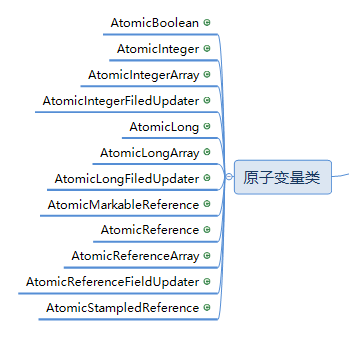

#### **类图：**

[](https://my.oschina.net/u/3858564/blog/1942191)

#### **源码**：

```java
package java.util.concurrent.atomic;

import java.util.function.IntUnaryOperator;
import java.util.function.IntBinaryOperator;
import sun.misc.Unsafe;


public class AtomicInteger extends Number implements java.io.Serializable {
    private static final long serialVersionUID = 6214790243416807050L;//版本号

    private static final Unsafe unsafe = Unsafe.getUnsafe();//使用sun的Unsafe完成cas指令

    private volatile int value;//int的值,设为volatile,保证线程之间的可见性

    private static final long valueOffset;//value内存地址相对于对象内存地址的偏移量

    static {
        try {
            //初始化valueOffset：通过unsafe.objectFieldOffset方法获取成员属性value内存地址相对于对象内存地址的偏移量
            valueOffset = unsafe.objectFieldOffset (AtomicInteger.class.getDeclaredField("value"));
        } catch (Exception ex) { throw new Error(ex); }
    }

    /**
     * 构造方法，使用默认值0
     */
    public AtomicInteger() {
    }

    /**
     * 构造方法，传入指定int值
     */
    public AtomicInteger(int initialValue) {
        value = initialValue;
    }
    
    /**
     * 获取int值
     */
    public final int get() {
        return value;
    }

    /**
     * 设为指定值
     */
    public final void set(int newValue) {
        value = newValue;
    }

    /**
     * 最终设为指定值，但其它线程不能马上看到变化，会延时一会
     */
    public final void lazySet(int newValue) {
        unsafe.putOrderedInt(this, valueOffset, newValue);
    }

    /**
     * 以原子方式设置为给定值，并返回旧值
     */
    public final int getAndSet(int newValue) {
        return unsafe.getAndSetInt(this, valueOffset, newValue);
    }

    /**
     * CAS操作，现代CPU已广泛支持，是一种原子操作；
     * 简单地说，当期待值expect与valueOffset地址处的值相等时，设置为update值
     */
    public final boolean compareAndSet(int expect, int update) {
        return unsafe.compareAndSwapInt(this, valueOffset, expect, update);
    }

    //和compareAndSet()方法相同
    public final boolean weakCompareAndSet(int expect, int update) {
        return unsafe.compareAndSwapInt(this, valueOffset, expect, update);
    }

    /**
     * 原子操作，自增，返回旧值
     */
    public final int getAndIncrement() {
        return unsafe.getAndAddInt(this, valueOffset, 1);
    }

    /**
     * 原子操作，自减，返回旧值
     */
    public final int getAndDecrement() {
        return unsafe.getAndAddInt(this, valueOffset, -1);
    }

    /**
     * 原子操作，加上一个数delta，返回旧值
     */
    public final int getAndAdd(int delta) {
        return unsafe.getAndAddInt(this, valueOffset, delta);
    }

    /**
     * 原子操作，自增，返回新值
     */
    public final int incrementAndGet() {
        return unsafe.getAndAddInt(this, valueOffset, 1) + 1;
    }

    /**
     * 原子操作，自减，返回新值
     */
    public final int decrementAndGet() {
        return unsafe.getAndAddInt(this, valueOffset, -1) - 1;
    }

    /**
     * 原子操作，加上一个数delta，返回新值
     */
    public final int addAndGet(int delta) {
        return unsafe.getAndAddInt(this, valueOffset, delta) + delta;
    }

    /**
     * 以原子方式设置为给定值，并返回旧值
     * updateFunction 一个参数的无副作用函数
     */
    public final int getAndUpdate(IntUnaryOperator updateFunction) {
        int prev, next;
        do {
            prev = get();
            next = updateFunction.applyAsInt(prev);
        } while (!compareAndSet(prev, next));
        return prev;
    }

    /**
     * 以原子方式设置为给定值，并返回新值
     * updateFunction 一个参数的无副作用函数
     */
    public final int updateAndGet(IntUnaryOperator updateFunction) {
        int prev, next;
        do {
            prev = get();
            next = updateFunction.applyAsInt(prev);
        } while (!compareAndSet(prev, next));
        return next;
    }

    /**
     * 以原子方式设置为给定值，并返回旧值
     * accumulatorFunction 两个参数的无副作用函数
     */
    public final int getAndAccumulate(int x, IntBinaryOperator accumulatorFunction) {
        int prev, next;
        do {
            prev = get();
            next = accumulatorFunction.applyAsInt(prev, x);
        } while (!compareAndSet(prev, next));
        return prev;
    }

    /**
     * 以原子方式设置为给定值，并返回新值
     * accumulatorFunction 两个参数的无副作用函数
     */
    public final int accumulateAndGet(int x, IntBinaryOperator accumulatorFunction) {
        int prev, next;
        do {
            prev = get();
            next = accumulatorFunction.applyAsInt(prev, x);
        } while (!compareAndSet(prev, next));
        return next;
    }

    //得到value的string格式
    public String toString() {
        return Integer.toString(get());
    }

    //得到value的int格式
    public int intValue() {
        return get();
    }

    //得到value的long格式
    public long longValue() {
        return (long)get();
    }

    //得到value的float格式
    public float floatValue() {
        return (float)get();
    }

    //得到value的double格式
    public double doubleValue() {
        return (double)get();
    }

}

```

对于使用到的unsafe类的方法，需要进行一些说明：  
    lazySet(int newValue) ：直接调用native方法

> public native void putOrderedInt(Object var1, long var2, int var4);


    compareAndSet(int expect, int update) ，weakCompareAndSet(int expect, int update)，
    
    getAndIncrement()，getAndDecrement()，getAndAdd(int delta)，
    
    incrementAndGet()，decrementAndGet()，addAndGet(int delta)：直接调用native方法

> //var1对象的内存地址加上偏移量var2得到的value的值。如果该值等于期望值var4，则将value的内存地址上的值修改为var5，并返回true；不相等则不更新，直接返回false。  
> public final native boolean compareAndSwapInt(Object var1, long var2, int var4, int var5);


    getAndSet(int newValue):调用了unsafe类的getAndSetInt(Object var1, long var2, int var4) 

> //在线程竞争激烈的时候，可能会导致多次重试，但最终可以保证更新操作一定能成功。  
> public final int getAndSetInt(Object var1, long var2, int var4) {  
>  int var5;  
>  do {  
>      var5 = this.getIntVolatile(var1, var2);//得到当前在对象var1偏移地址var2的值  
>  } while(!this.compareAndSwapInt(var1, var2, var5, var4));//再去读一次偏移地址对应的值和上次读的做比较：相同则更新为var4，不相同则不更新，然后继续循环重试。  
>  return var5;//返回最后一次读取的值  
> }

   此处，调用了getIntVolatile(Object var1, long var2) 和 compareAndSwapInt(Object var1, long var2, int var4, int var5)：

> // 获取对象var1内存地址加上偏移量offset所对应的整型值（支持volatile，具有线程可见性）  
> public native int getIntVolatile(Object var1, long var2);