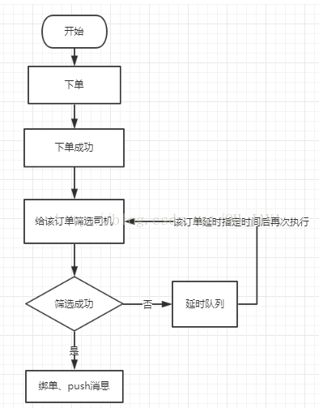

# 概述

　　java延迟队列提供了在指定时间才能获取队列元素的功能，队列头元素是最接近过期的元素。没有过期元素的话，使用poll()方法会返回null值，超时判定是通过getDelay(TimeUnit.NANOSECONDS)方法的返回值小于等于0来判断。延时队列不能存放空元素。

   延时队列实现了Iterator接口，但iterator()遍历顺序不保证是元素的实际存放顺序。

# 队列元素

　　DelayQueue<E extends Delayed>的队列元素需要实现Delayed接口，该接口类定义如下:

public interface Delayed extends Comparable<Delayed> {

    /\*\*
     \* Returns the remaining delay associated with this object, in the
     \* given time unit.
     \*
     \* @param unit the time unit
     \* @return the remaining delay; zero or negative values indicate
     \* that the delay has already elapsed
     */
    long getDelay(TimeUnit unit);
}

由Delayed定义可以得知，队列元素需要实现getDelay(TimeUnit unit)方法和compareTo(Delayed o)方法, getDelay定义了剩余到期时间，compareTo方法定义了元素排序规则，注意，元素的排序规则影响了元素的获取顺序，将在后面说明。

# 内部存储结构　　

    DelayedQuene的元素存储交由优先级队列存放。

public class DelayQueue<E extends Delayed> extends AbstractQueue<E> implements BlockingQueue<E> {
    private final transient ReentrantLock lock = new ReentrantLock();
    private final PriorityQueue<E> q = new PriorityQueue<E>();//元素存放

DelayedQuene的优先级队列使用的排序方式是队列元素的compareTo方法，优先级队列存放顺序是从小到大的，所以队列元素的compareTo方法影响了队列的出队顺序。

若compareTo方法定义不当，会造成延时高的元素在队头，延时低的元素无法出队。

# 获取队列元素

##     非阻塞获取

```java
public E poll() {
        final ReentrantLock lock = this.lock;
        lock.lock();
        try {
            E first = q.peek();
            if (first == null || first.getDelay(NANOSECONDS) > 0)
                return null;
            else
                return q.poll();
        } finally {
            lock.unlock();
        }
    }
```

PriorityQueue队列peek()方法:

```java
public E peek() {
    return (size == 0) ? null : (E) queue\[0\];
}
```

由代码我们可以看出，获取元素时，总是判断PriorityQueue队列的队首元素是否到期，若未到期，返回null，所以compareTo()的方法实现不当的话，会造成队首元素未到期，当队列中有到期元素却获取不到的情况。因此，队列元素的compareTo方法实现需要注意。

##     阻塞方式获取

```java
public E take() throws InterruptedException {
    final ReentrantLock lock = this.lock;
    lock.lockInterruptibly();
    try {
        for (; ; ) {
            E first = q.peek();
            if (first == null) //没有元素，让出线程，等待java.lang.Thread.State#WAITING
                available.await();
            else {
                long delay = first.getDelay(NANOSECONDS);
                if (delay <= 0) // 已到期，元素出队
                    return q.poll();
                first = null; // don't retain ref while waiting
                if (leader != null)
                    available.await();// 其它线程在leader线程TIMED_WAITING期间，会进入等待状态，这样可以只有一个线程去等待到时唤醒，避免大量唤醒操作
                else {
                    Thread thisThread = Thread.currentThread();
                    leader = thisThread;
                    try {
                        available.awaitNanos(delay);// 等待剩余时间后，再尝试获取元素，他在等待期间，由于leader是当前线程，所以其它线程会等待。
                    } finally {
                        if (leader == thisThread) leader = null;
                    }
                }
            }
        }
    } finally {
        if (leader == null && q.peek() != null) available.signal();
        lock.unlock();
    }
}
```

示例：

```java
import java.time.LocalDateTime;
import java.time.format.DateTimeFormatter;
import java.util.concurrent.DelayQueue;
import java.util.concurrent.Delayed;
import java.util.concurrent.TimeUnit;

/**
 * @description: 延时队列测试
 */

public class DelayedQueneTest {

    public static void main(String[] args) throws InterruptedException {
        Item item1 = new Item("item1", 5, TimeUnit.SECONDS);
        Item item2 = new Item("item2", 10, TimeUnit.SECONDS);
        Item item3 = new Item("item3", 15, TimeUnit.SECONDS);

        DelayQueue<Item> queue = new DelayQueue<>();
        queue.put(item1);
        queue.put(item2);
        queue.put(item3);

        System.out.println("begin time:" + LocalDateTime.now().format(DateTimeFormatter.ISO_LOCAL_DATE_TIME));

        for (int i = 0; i < 3; i++) {
            Item take = queue.take();
            System.out.format("name:{}s, time:{}s\n", take.name, LocalDateTime.now().format(DateTimeFormatter.ISO_DATE_TIME));
        }
    }
}


class Item implements Delayed {
    /* 触发时间*/
    private long time;

    String name;

    public Item(String name, long time, TimeUnit unit) {
        this.name = name;
        this.time = System.currentTimeMillis() + (time > 0 ? unit.toMillis(time) : 0);
    }

    @Override
    public long getDelay(TimeUnit unit) {
        return time - System.currentTimeMillis();
    }

    @Override
    public int compareTo(Delayed o) {
        Item item = (Item) o;
        long diff = this.time - item.time;
        if (diff <= 0) {// 改成>=会造成问题
            return -1;
        } else {
            return 1;
        }
    }

    @Override
    public String toString() {
        return "Item{" +
                "time=" + time +
                ", name='" + name + '\'' +
                '}';
    }
}
```

运行结果：每5秒取出一个

> begin time:2019-10-29T22:17:38.203  
> name:{item1}, time:{2019-10-29T22:17:43.16}  
> name:{item2}, time:{2019-10-29T22:17:48.16}  
> name:{item3}, time:{2019-10-29T22:17:53.16}

修改compareTo方法 diff >= 0 后的运行结果： 在15秒之后几乎同时取出:

> begin time:2019-10-29T22:18:45.271  
> name:{item3}, time:{2019-10-29T22:19:00.229}  
> name:{item2}, time:{2019-10-29T22:19:00.234}  
> name:{item1}, time:{2019-10-29T22:19:00.234}

简单的延时队列要有三部分：第一实现了Delayed接口的消息体、第二消费消息的消费者、第三存放消息的延时队列，那下面就来看看延时队列demo。

一、消息体

```java
import java.util.concurrent.Delayed;
import java.util.concurrent.TimeUnit;

/**
 * 消息体定义 实现Delayed接口就是实现两个方法即compareTo 和 getDelay最重要的就是getDelay方法，这个方法用来判断是否到期……
 */
public class Message implements Delayed {
    private int id;
    private String body; // 消息内容  
    private long excuteTime;// 延迟时长，这个是必须的属性因为要按照这个判断延时时长。  

    public int getId() {
        return id;
    }

    public String getBody() {
        return body;
    }

    public long getExcuteTime() {
        return excuteTime;
    }

    public Message(int id, String body, long delayTime) {
        this.id = id;
        this.body = body;
        this.excuteTime = TimeUnit.NANOSECONDS.convert(delayTime, TimeUnit.MILLISECONDS) + System.nanoTime();
    }

    // 自定义实现比较方法返回 1 0 -1三个参数  
    @Override
    public int compareTo(Delayed delayed) {
        Message msg = (Message) delayed;
        return Integer.valueOf(this.id) > Integer.valueOf(msg.id) ? 1
                : (Integer.valueOf(this.id) < Integer.valueOf(msg.id) ? -1 : 0);
    }

    // 延迟任务是否到时就是按照这个方法判断如果返回的是负数则说明到期否则还没到期  
    @Override
    public long getDelay(TimeUnit unit) {
        return unit.convert(this.excuteTime - System.nanoTime(), TimeUnit.NANOSECONDS);
    }
}
```

二、消息消费者

```java
import java.util.concurrent.DelayQueue;

public class Consumer implements Runnable {
    // 延时队列 ,消费者从其中获取消息进行消费  
    private DelayQueue<Message> queue;

    public Consumer(DelayQueue<Message> queue) {
        this.queue = queue;
    }

    @Override
    public void run() {
        while (true) {
            try {
                Message take = queue.take();
                System.out.println("消费消息id：" + take.getId() + " 消息体：" + take.getBody());
            } catch (InterruptedException e) {
                e.printStackTrace();
            }
        }
    }
}
```

三、延时队列

```java
import java.util.concurrent.DelayQueue;
import java.util.concurrent.ExecutorService;
import java.util.concurrent.Executors;

public class DelayQueueTest {
    public static void main(String[] args) {
        // 创建延时队列    
        DelayQueue<Message> queue = new DelayQueue<Message>();
        // 添加延时消息,m1 延时3s    
        Message m1 = new Message(1, "world", 3000);
        // 添加延时消息,m2 延时10s    
        Message m2 = new Message(2, "hello", 10000);
        //将延时消息放到延时队列中  
        queue.offer(m2);
        queue.offer(m1);
        // 启动消费线程 消费添加到延时队列中的消息，前提是任务到了延期时间   
        ExecutorService exec = Executors.newFixedThreadPool(1);
        exec.execute(new Consumer(queue));
        exec.shutdown();
    }
}
```

 将消息体放入延迟队列中，在启动消费者线程去消费延迟队列中的消息，如果延迟队列中的消息到了延迟时间则可以从中取出消息否则无法取出消息也就无法消费。

使用场景描述：

在打车软件中对订单进行派单的流程，当有订单的时候给该订单筛选司机，然后给当订单绑定司机，但是有时运气没那么好，订单进来后第一次没有筛选到合适的司机，但我们也不能就此结束派单，而是将该订单的信息放到延时队列中过个2秒钟在进行一次，其实这个2秒钟就是一个延迟，所以这里我们就可以使用延时队列来实现……

下面看看简单的流程图：



    下面来看看具体代码实现：
    
    在项目中有如下几个类：第一 、任务类   第二、按照任务类组装的消息体类  第三、延迟队列管理类
    
    任务类即执行筛选司机、绑单、push消息的任务类

```java
public class DelayOrderWorker implements Runnable {

    @Override
    public void run() {
        //相关业务逻辑处理  
        System.out.println(Thread.currentThread().getName() + " do something ……");
    }
}
```

消息体类，在延时队列中这个实现了Delayed接口的消息类是比不可少的，实现接口时有一个getDelay(TimeUnit unit)方法，这个方法就是判断是否到期的.

这里定义的是一个泛型类，所以可以将我们上面的任务类作为其中的task，这样就将任务类分装成了一个消息体:

```java
import java.util.concurrent.Delayed;
import java.util.concurrent.TimeUnit;

public class DelayOrderTask<T extends Runnable> implements Delayed {
    private final long time;
    private final T task; // 任务类，也就是之前定义的任务类  

    /**
     * @param timeout 超时时间(秒)
     * @param task    任务
     */
    public DelayOrderTask(long timeout, T task) {
        this.time = System.nanoTime() + timeout;
        this.task = task;
    }

    @Override
    public int compareTo(Delayed o) {
        DelayOrderTask other = (DelayOrderTask) o;
        long diff = time - other.time;
        if (diff > 0) {
            return 1;
        } else if (diff < 0) {
            return -1;
        } else {
            return 0;
        }
    }

    @Override
    public long getDelay(TimeUnit unit) {
        return unit.convert(this.time - System.nanoTime(), TimeUnit.NANOSECONDS);
    }

    @Override
    public int hashCode() {
        return task.hashCode();
    }

    public T getTask() {
        return task;
    }
}
```

延时队列管理类，这个类主要就是将任务类封装成消息并并添加到延时队列中，以及轮询延时队列从中取出到时的消息体，在获取任务类放到线程池中执行任务:

```java
import java.util.Map;
import java.util.concurrent.DelayQueue;
import java.util.concurrent.ExecutorService;
import java.util.concurrent.Executors;
import java.util.concurrent.TimeUnit;
import java.util.concurrent.atomic.AtomicLong;

public class DelayOrderQueueManager {
    private final static int DEFAULT_THREAD_NUM = 5;
    private static int thread_num = DEFAULT_THREAD_NUM;
    // 固定大小线程池  
    private ExecutorService executor;
    // 守护线程  
    private Thread daemonThread;
    // 延时队列  
    private DelayQueue<DelayOrderTask<?>> delayQueue;
    private static final AtomicLong atomic = new AtomicLong(0);
    private final long n = 1;
    private static DelayOrderQueueManager instance = new DelayOrderQueueManager();

    private DelayOrderQueueManager() {
        executor = Executors.newFixedThreadPool(thread_num);
        delayQueue = new DelayQueue<>();
        init();
    }

    public static DelayOrderQueueManager getInstance() {
        return instance;
    }

    /**
     * 初始化
     */
    public void init() {
        daemonThread = new Thread(() -> {
            execute();
        });
        daemonThread.setName("DelayQueueMonitor");
        daemonThread.start();
    }

    private void execute() {
        while (true) {
            Map<Thread, StackTraceElement[]> map = Thread.getAllStackTraces();
            System.out.println("当前存活线程数量:" + map.size());
            int taskNum = delayQueue.size();
            System.out.println("当前延时任务数量:" + taskNum);
            try {
                // 从延时队列中获取任务  
                DelayOrderTask<?> delayOrderTask = delayQueue.take();
                if (delayOrderTask != null) {
                    Runnable task = delayOrderTask.getTask();
                    if (null == task) {
                        continue;
                    }
                    // 提交到线程池执行task  
                    executor.execute(task);
                }
            } catch (Exception e) {
                e.printStackTrace();
            }
        }
    }

    /**
     * 添加任务
     *
     * @param task
     * @param time 延时时间
     * @param unit 时间单位
     */
    public void put(Runnable task, long time, TimeUnit unit) {
        // 获取延时时间  
        long timeout = TimeUnit.NANOSECONDS.convert(time, unit);
        // 将任务封装成实现Delayed接口的消息体  
        DelayOrderTask<?> delayOrder = new DelayOrderTask<>(timeout, task);
        // 将消息体放到延时队列中  
        delayQueue.put(delayOrder);
    }

    /**
     * 删除任务
     *
     * @param task
     * @return
     */
    public boolean removeTask(DelayOrderTask task) {
        return delayQueue.remove(task);
    }
}
```

    测试类

```java
import com.test.delayqueue.DelayOrderQueueManager;
import com.test.delayqueue.DelayOrderWorker;
import java.util.concurrent.TimeUnit;

public class Test {
    public static void main(String[] args) {
        DelayOrderWorker work1 = new DelayOrderWorker();// 任务1  
        DelayOrderWorker work2 = new DelayOrderWorker();// 任务2  
        DelayOrderWorker work3 = new DelayOrderWorker();// 任务3  
        // 延迟队列管理类，将任务转化消息体并将消息体放入延迟对列中等待执行  
        DelayOrderQueueManager manager = DelayOrderQueueManager.getInstance();
        manager.put(work1, 3000, TimeUnit.MILLISECONDS);
        manager.put(work2, 6000, TimeUnit.MILLISECONDS);
        manager.put(work3, 9000, TimeUnit.MILLISECONDS);
    }
}  
```

如果down机则会出现任务丢失，所以也可以考虑使用mq、redis来实现