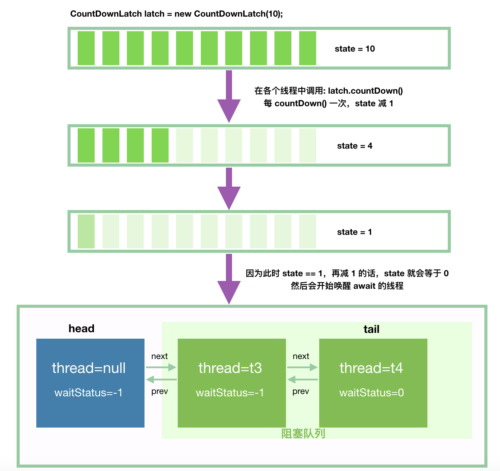

### CountDownLatch

`CountDownLatch` 是可以使一个或者多个线程等待其他线程完成某些操作的同步器。`CountDownLatch` 通过一个给定的数字 `count` 进行初始化。调用 `await` 方法的线程会一直阻塞到其他线程调用 `countDown` 将 `count` 变为0，这时所有的线程都将释放，并且后续的 `await` 方法调用都会立即返回。`count` 值不能重置。如果你需要重置 `count` 请考虑使用 `CyclicBarrier`。

`CountDownLatch` 是一个能力很强的同步工具，可以用在多种途径。`CountDownLatch` 最重要的属性是其不要求 调用 `countDown` 的线程等待到 `count` 为0，只是要求所有 `await` 调用线程等待。

`CountDownLatch` 内部使用的是 AQS，AQS 里面的 state 是一个整数值，这边用一个 `int count` 参数其实初始化就是设置了这个值，所有调用了 `await` 方法的等待线程会挂起，然后有其他一些线程会做 `state = state - 1` 操作，当 `state` 减到 `0` 的同时，那个将 `state` 减为 `0` 的线程会负责唤醒 所有调用了 `await` 方法的线程。

- `countDown()` 方法每次调用都会将 `state` 减 1，直到 `state` 的值为 0；而 `await` 是一个阻塞方法，当 `state` 减为 `0` 的时候，`await` 方法才会返回。`await` 可以被多个线程调用，读者这个时候脑子里要有个图：所有调用了 `await` 方法的线程阻塞在 `AQS` 的阻塞队列中，等待条件满足（`state == 0`），将线程从队列中一个个唤醒过来。
- `await()` 方法，它代表线程阻塞，等待 `state` 的值减为 `0`。

### countLatch的await方法是否安全，怎么改造

> 执行countdown的某个子线程可能会因为某些原因无法执行countdown，这样就会导致await线程一直阻塞下去。
>
> 在线程池中多次调用await方法，因为await方法会阻塞一段时间，有可能导致线程池可用线程被大量阻塞。