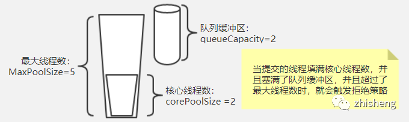

### 线程池的最大线程数目根据什么确定

> 任务的性质
>
> 1. CPU密集型任务
>    要进行大量的计算，消耗CPU资源，比如计算圆周率、对视频进行高清解码等等，全靠CPU的运算能力。要最高效地利用CPU，计算密集型任务同时进行的数量应当等于CPU的核心数。
>
> 一般配置线程数=CPU总核心数+1    (+1是为了利用等待空闲)
>
> 2. IO密集型任务
>    这类任务的CPU消耗很少，任务的大部分时间都在等待IO操作完成（因为IO的速度远远低于CPU和内存的速度）。常见的大部分任务都是IO密集型任务，比如Web应用。对于IO密集型任务，任务越多，CPU效率越高(但也有限度)。
>
> 一般配置线程数=CPU总核心数 * 2 +1
>
> 总结
>
> 最佳线程数目 = (线程等待时间与线程CPU时间之比 + 1)\* CPU数目
>
> 所以	**线程等待时间所占比例越高，需要越多线程。线程CPU时间所占比例越高，需要越少线程**
>
> 
>
> 是否使用线程池就一定比单线程效率高呢？
>
> > ​	否。比如Redis。
>
> 高并发、任务执行时间短的业务怎样使用线程池?
>
> > ​	线程池线程数可以设置为CPU核数+1，减少线程上下文的切换
>
> 并发不高、任务执行时间长的业务怎样使用线程池？
>
> > ​	a）假如是业务时间长集中在IO操作上，也就是IO密集型的任务，因为IO操作并不占用CPU，所以不要让所有的CPU闲下来，可以适当加大线程池中的线程数目，让CPU处理更多的业务 
> >
> > ​	b）假如是业务时间长集中在计算操作上，也就是计算密集型任务，线程池中的线程数设置得少一些，减少线程上下文的切换 
>
> 并发高、业务执行时间长的业务怎样使用线程池？ 
>
> > ​	并发高、业务执行时间长，解决这种类型任务的关键不在于线程池而在于整体架构的设计，看看这些业务里面某些数据是否能做缓存是第一步，增加服务器是第二步，以及线程池的设置。最后，业务执行时间长的问题，也可能需要分析一下，看看能不能使用中间件对任务进行拆分和解耦。

### 线程池参数，整个流程描述

> - 如果当前线程池中的线程数目小于corePoolSize，则每来一个任务，就会创建一个线程去执行这个任务；
> - 如果当前线程池中的线程数目>=corePoolSize，则每来一个任务，会尝试将其添加到任务缓存队列当中，若添加成功，则该任务会等待空闲线程将其取出去执行；若添加失败（一般来说是任务缓存队列已满），则会尝试创建新的线程去执行这个任务；
> - 如果当前线程池中的线程数目达到maximumPoolSize，则会采取任务拒绝策略进行处理；
> - 如果线程池中的线程数量大于 corePoolSize时，如果某线程空闲时间超过keepAliveTime，线程将被终止，直至线程池中的线程数目不大于corePoolSize；如果允许为核心池中的线程设置存活时间，那么核心池中的线程空闲时间超过keepAliveTime，线程也会被终止。

**Executors**提供四种线程池：
	newCachedThreadPool ：缓存线程池，如果线程池长度超过处理需要，可回收空闲线程，若无可回收，则新建线程。
	newFixedThreadPool ： 定长线程池，可控制线程最大并发数，超出的线程会在队列中等待。
	newScheduledThreadPool ： 计划线程池，支持定时及周期性任务执行。
	newSingleThreadExecutor ：单线程线程池，用唯一的线程来执行任务，保证所有任务按照指定顺序(FIFO, LIFO, 优先级)执行。

**ThreadPoolExecutor** 有几个重要的成员变量：keepAliveTime、allowCoreThreadTimeOut、poolSize、corePoolSize、maximumPoolSize。

**corePoolSize**：线程池的基本大小。

**maximumPoolSize**：线程池中允许的最大线程数。

​	注意还有一个 largestPoolSize，记录了曾经出现的最大线程个数。因为setMaximumPoolSize()可以改变最大线程数。

**poolSize**：线程池中当前线程的数量。

------

poolSize、corePoolSize、maximumPoolSize三者的关系是如何的呢？
	当新提交一个任务时：
（1）如果poolSize<corePoolSize，新增加一个线程处理新的任务。
（2）如果poolSize=corePoolSize，新任务会被放入阻塞队列等待。
（3）如果阻塞队列的容量达到上限，且这时poolSize<maximumPoolSize，新增线程来处理任务。
（4）如果阻塞队列满了，且poolSize=maximumPoolSize，那么线程池已经达到极限，会根据饱和策略RejectedExecutionHandler拒绝新的任务。

​	所以通过上面的描述可知corePoolSize<=maximumPoolSize，poolSize<=maximumPoolSize；而poolSize和corePoolSize无法比较，poolSize是有可能比corePoolSize大的。

------

corePoolSize、maximumPoolSize在上面四种线程池中如何设定的？

​	通过几个newXXX函数的源码就可以知道，源码如下：

​	1）定长线程池的corePoolSize、maximumPoolSize相同。都是设定值。

```java
public static ExecutorService newFixedThreadPool(int nThreads) {
    return new ThreadPoolExecutor(nThreads, nThreads,
                                  0L, TimeUnit.MILLISECONDS,
                                  new LinkedBlockingQueue<Runnable>());
}
```

​	

​	2）缓存线程池corePoolSize为0，maximumPoolSize则是int最大值。

```java
public static ExecutorService newCachedThreadPool() {
    return new ThreadPoolExecutor(0, Integer.MAX_VALUE,
                                  60L, TimeUnit.SECONDS,
                                  new SynchronousQueue<Runnable>());
}
```

​	3）单线程线程池corePoolSize和maximumPoolSize都是1。

```java
public static ExecutorService newSingleThreadExecutor() {
    return new FinalizableDelegatedExecutorService
        (new ThreadPoolExecutor(1, 1,
                                0L, TimeUnit.MILLISECONDS,
                                new LinkedBlockingQueue<Runnable>()));
}
```

​	4）计划线程池用的是ThreadPoolExecutor的一个子类，可以看到corePoolSize是定义的，而maximumPoolSize则是int最大值。注意：这里的corePoolSize、maximumPoolSize不是最终的，因为可以通过setCorePoolSize和setMaximumPoolSize()改变。

```java
public static ScheduledExecutorService newScheduledThreadPool(int corePoolSize) {
    return new ScheduledThreadPoolExecutor(corePoolSize);
}

public ScheduledThreadPoolExecutor(int corePoolSize) {
    super(corePoolSize, Integer.MAX_VALUE,
          DEFAULT_KEEPALIVE_MILLIS, MILLISECONDS,
          new DelayedWorkQueue());
}
```

------

阻塞队列的饱和值：

​	1）定长线程池和单线程线程都使用LinkedBlockingQueue，而LinkedBlockingQueue默认的大小是int的最大值，如下：

```java
public LinkedBlockingQueue() {
    this(Integer.MAX_VALUE);
}
```


​	2）计划线程池使用的是DelayedWordQueue，它默认大小是16，但是可以动态增长，最大值则是int的最大值，如下：

```java
private static final int INITIAL_CAPACITY = 16;
private RunnableScheduledFuture<?>[] queue =
    new RunnableScheduledFuture<?>[INITIAL_CAPACITY];
private void grow() {
    int oldCapacity = queue.length;
    int newCapacity = oldCapacity + (oldCapacity >> 1); // grow 50%
    if (newCapacity < 0) // overflow
        newCapacity = Integer.MAX_VALUE;
    queue = Arrays.copyOf(queue, newCapacity);
}
```


3）缓存线程池使用的则是SynchronousQueue，这个比较特殊没有所谓的饱和值，而且前面也看到了缓存线程池的corePoolSize默认是0。所以它新建一个线程与SynchronousQueue的机制有关.

------

**allowCoreThreadTimeOut**：是否允许核心线程超时退出。
	如果该值为false，且poolSize<=corePoolSize，线程池都会保证这些核心线程处于存活状态，不会超时退出。
	如果为true，则不论poolSize的大小，都允许超时退出。
	如果poolSize>corePoolSize，则该参数不论true还是false，都允许超时退出。

​	相关判断：(poolSize > corePoolSize || allowCoreThreadTimeOut)

------

**keepAliveTime**：如果一个线程处在空闲状态的时间超过了该属性值，就会因为超时而退出。是否允许超时退出则取决于上面的逻辑。

------

​	不论你用 FixedThreadPool 还是 CachedThreadPool 其背后实现都是ThreadPoolExecutor。ThreadPoolExecutor 是一个典型的缓存池化设计的产物，因为池子有大小，当池子体积不够承载时，就涉及到拒绝策略。JDK 中已经预设了 4 种线程池拒绝策略，下面结合场景详细聊聊这些策略的使用场景，以及我们还能扩展哪些拒绝策略。

##### 	池化设计思想

​	常见的如 Java 线程池、JDBC 连接池、Redis 连接池等就是这类设计的代表实现。这种设计会初始预设资源，解决的问题就是抵消每次获取资源的消耗，如创建线程的开销，获取远程连接的开销等。除了初始化资源，池化设计还包括如下这些特征：池子的初始值、池子的活跃值、池子的最大值等，这些特征可以直接映射到 Java 线程池和数据库连接池的成员属性中。

##### 	线程池触发拒绝策略的时机

​	和数据源连接池不一样，线程池除了初始大小和池子最大值，还多了一个阻塞队列来缓冲。数据源连接池一般请求的连接数超过连接池的最大值的时候就会触发拒绝策略，策略一般是阻塞等待设置的时间或者直接抛异常。而线程池的触发时机如下图：

img

​	当提交的任务数大于 corePoolSize 时，会优先放到队列缓冲区，只有填满了缓冲区后，才会判断当前运行的任务是否大于 maxPoolSize，小于时会新建线程处理。大于时就触发了拒绝策略，总结就是：当前提交任务数大于（maxPoolSize + queueCapacity）时就会触发线程池的拒绝策略了。

#### JDK内置4种线程池拒绝策略

##### 	拒绝策略接口定义

​	在分析 JDK 自带的线程池拒绝策略前，先看下 JDK 定义的 拒绝策略接口，如下：

```java
public interface RejectedExecutionHandler {
   void rejectedExecution(Runnable r, ThreadPoolExecutor executor);
}
```

​	接口定义很明确，当触发拒绝策略时，线程池会调用你设置的具体的策略，将当前提交的任务以及线程池实例本身传递给你处理，具体作何处理，不同场景会有不同的考虑，下面看 JDK 为我们内置了哪些实现：

##### 	CallerRunsPolicy（调用者运行策略）

```java
public static class CallerRunsPolicy implements RejectedExecutionHandler {
   public CallerRunsPolicy() { }
   public void rejectedExecution(Runnable r, ThreadPoolExecutor e) {
      if (!e.isShutdown()) {
         r.run();
      }
    }
}
```

​	功能：当触发拒绝策略时，只要线程池没有关闭，就由提交任务的当前线程处理。

​	使用场景：一般在不允许失败的、对性能要求不高、并发量较小的场景下使用，因为线程池一般情况下不会关闭，也就是提交的任务一定会被运行，但是由于是调用者线程自己执行的，当多次提交任务时，就会阻塞后续任务执行，性能和效率自然就慢了。

##### 	AbortPolicy（中止策略）

```java
public static class AbortPolicy implements RejectedExecutionHandler {
   public AbortPolicy() { }
   public void rejectedExecution(Runnable r, ThreadPoolExecutor e) {
      throw new RejectedExecutionException("Task " + r.toString() + 
         " rejected from " + 
         e.toString()); 
    }
}
```

​	功能：当触发拒绝策略时，直接抛出拒绝执行的异常，中止策略的意思也就是打断当前执行流程

​	使用场景：这个就没有特殊的场景了，但是一点要正确处理抛出的异常。ThreadPoolExecutor 中默认的策略就是AbortPolicy，ExecutorService 接口的系列 ThreadPoolExecutor 因为都没有显示的设置拒绝策略，所以默认的都是这个。但是请注意，ExecutorService 中的线程池实例队列都是无界的，也就是说把内存撑爆了都不会触发拒绝策略。当自己自定义线程池实例时，使用这个策略一定要处理好触发策略时抛的异常，因为他会打断当前的执行流程。

##### 	DiscardPolicy（丢弃策略）

```java
public static class DiscardPolicy implements RejectedExecutionHandler {
   public DiscardPolicy() { }
   public void rejectedExecution(Runnable r, ThreadPoolExecutor e) {}
}
```

​	功能：直接静悄悄的丢弃这个任务，不触发任何动作

​	使用场景：如果你提交的任务无关紧要，你就可以使用它 。因为它就是个空实现，会悄无声息的吞噬你的的任务。所以这个策略基本上不用了

##### 	DiscardOldestPolicy（弃老策略）

```java
public static class DiscardOldestPolicy implements RejectedExecutionHandler {
    public DiscardOldestPolicy() { }
    public void rejectedExecution(Runnable r, ThreadPoolExecutor e) {
        if (!e.isShutdown()) {
            e.getQueue().poll();
            e.execute(r);
        }
    }
}
```

​	功能：如果线程池未关闭，就弹出队列头部的元素，然后尝试执行

​	使用场景：这个策略还是会丢弃任务，丢弃时也是毫无声息，但是特点是丢弃的是老的未执行的任务，而且是待执行优先级较高的任务。基于这个特性，我能想到的场景就是，发布消息，和修改消息，当消息发布出去后，还未执行，此时更新的消息又来了，这个时候未执行的消息的版本比现在提交的消息版本要低就可以被丢弃了。因为队列中还有可能存在消息版本更低的消息会排队执行，所以在真正处理消息的时候一定要做好消息的版本比较

#### 第三方实现的拒绝策略

##### 	Dubbo 中的线程拒绝策略

```java
public class AbortPolicyWithReport extends ThreadPoolExecutor.AbortPolicy {
    protected static final Logger logger = LoggerFactory.getLogger(AbortPolicyWithReport.class);
    private final String threadName;
    private final URL url;
    private static volatile long lastPrintTime = 0;
    private static Semaphore guard = new Semaphore(1);
    
    public AbortPolicyWithReport(String threadName, URL url) {
        this.threadName = threadName;
        this.url = url;
    }
    
    @Override
    public void rejectedExecution(Runnable r, ThreadPoolExecutor e) {
        String msg = String.format("Thread pool is EXHAUSTED!" +
                                   " Thread Name: %s, Pool Size: %d (active: %d, core: %d, max: %d, largest: %d), Task: %d (completed: %d)," +
                                   " Executor status:(isShutdown:%s, isTerminated:%s, isTerminating:%s), in %s://%s:%d!",
                                   threadName, e.getPoolSize(), 
                                   e.getActiveCount(), e.getCorePoolSize(), 
                                   e.getMaximumPoolSize(), e.getLargestPoolSize(),
                                   e.getTaskCount(), e.getCompletedTaskCount(), 
                                   e.isShutdown(), e.isTerminated(),
                                   e.isTerminating(),url.getProtocol(), 
                                   url.getIp(), url.getPort());
        logger.warn(msg);
        dumpJStack();
        throw new RejectedExecutionException(msg);
    }
    
    private void dumpJStack() {
        //省略实现
    }
}
```

​	可以看到，当dubbo的工作线程触发了线程拒绝后，主要做了三个事情，原则就是尽量让使用者清楚触发线程拒绝策略的真实原因

- 输出了一条警告级别的日志，日志内容为线程池的详细设置参数，以及线程池当前的状态，还有当前拒绝任务的一些详细信息。可以说，这条日志，使用dubbo的有过生产运维经验的或多或少是见过的，这个日志简直就是日志打印的典范，其他的日志打印的典范还有spring。得益于这么详细的日志，可以很容易定位到问题所在
- 输出当前线程堆栈详情，这个太有用了，当你通过上面的日志信息还不能定位问题时，案发现场的dump线程上下文信息就是你发现问题的救命稻草，这个可以参考《dubbo线程池耗尽事件-"CyclicBarrier惹的祸"》
- 继续抛出拒绝执行异常，使本次任务失败，这个继承了JDK默认拒绝策略的特性

####    Netty 中的线程池拒绝策略

```java
private static final class NewThreadRunsPolicy implements RejectedExecutionHandler {
    NewThreadRunsPolicy() {
        super();
    }
    
    public void rejectedExecution(Runnable r, ThreadPoolExecutor executor) {
        try {
            final Thread t = new Thread(r, "Temporary task executor");
            t.start();
        } catch (Throwable e) {
            throw new RejectedExecutionException(
                "Failed to start a new thread", e);
        }
    }
}
```

​	Netty 中的实现很像 JDK 中的 CallerRunsPolicy，舍不得丢弃任务。不同的是，CallerRunsPolicy 是直接在调用者线程执行的任务。而 Netty是新建了一个线程来处理的。所以，Netty的实现相较于调用者执行策略的使用面就可以扩展到支持高效率高性能的场景了。但是也要注意一点，Netty的实现里，在创建线程时未做任何的判断约束，也就是说只要系统还有资源就会创建新的线程来处理，直到new不出新的线程了，才会抛创建线程失败的异常

#### 	ActiveMQ 中的线程池拒绝策略

```java
new RejectedExecutionHandler() {
    @Override
    public void rejectedExecution(final Runnable r, final ThreadPoolExecutor executor) {
        try {
            executor.getQueue().offer(r, 60, TimeUnit.SECONDS);
        } catch (InterruptedException e) {
            throw new RejectedExecutionException("Interrupted waiting for BrokerService.worker");
        }
        throw new RejectedExecutionException("Timed Out while attempting to enqueue Task.");
    }
});
```

​	activeMq中的策略属于最大努力执行任务型，当触发拒绝策略时，在尝试一分钟的时间重新将任务塞进任务队列，当一分钟超时还没成功时，就抛出异常

#### 	PinPoint 中的线程池拒绝策略

```java
public class RejectedExecutionHandlerChain implements RejectedExecutionHandler {
    private final RejectedExecutionHandler[] handlerChain;
    
    public static RejectedExecutionHandler build(List<RejectedExecutionHandler> chain) {
        Objects.requireNonNull(chain, "handlerChain must not be null");
        RejectedExecutionHandler[] handlerChain = chain.toArray(new RejectedExecutionHandler[0]);
        return new RejectedExecutionHandlerChain(handlerChain);
    }
    
    private RejectedExecutionHandlerChain(RejectedExecutionHandler[] handlerChain) {
        this.handlerChain = Objects.requireNonNull(handlerChain, "handlerChain must not be null");
    }
    
    @Override
    public void rejectedExecution(Runnable r, ThreadPoolExecutor executor) {
        for (RejectedExecutionHandler rejectedExecutionHandler : handlerChain) {
            rejectedExecutionHandler.rejectedExecution(r, executor);
        }
    }
}
```

​	pinpoint的拒绝策略实现很有特点，和其他的实现都不同。他定义了一个拒绝策略链，包装了一个拒绝策略列表，当触发拒绝策略时，会将策略链中的rejectedExecution依次执行一遍.