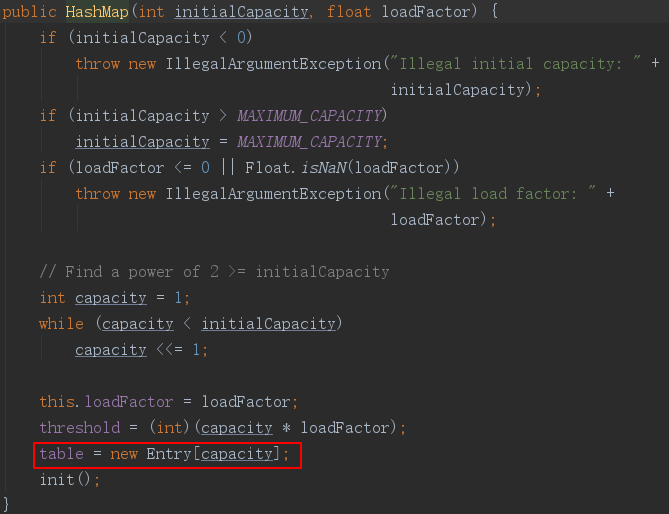
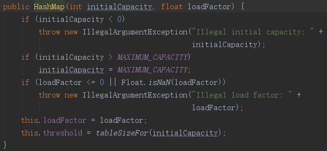
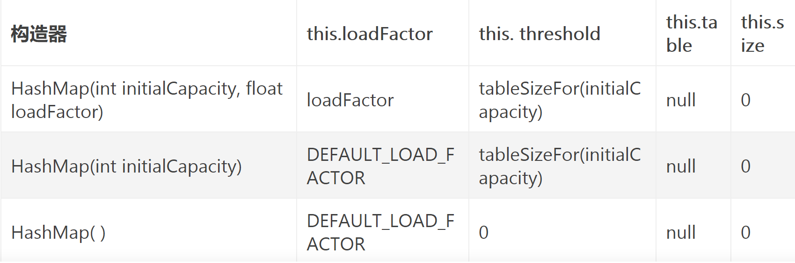
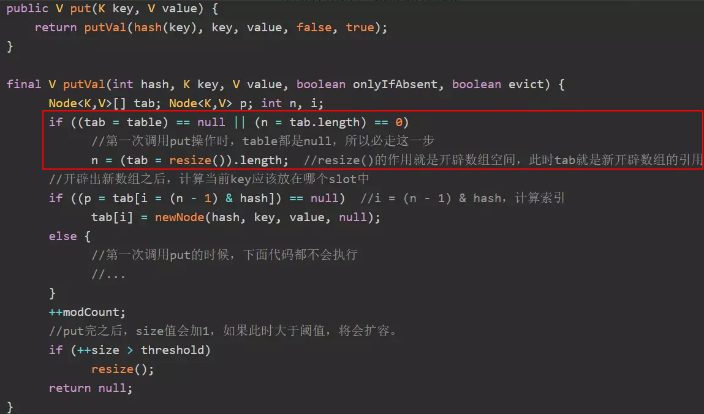
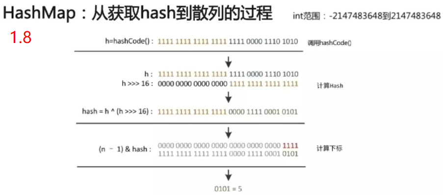
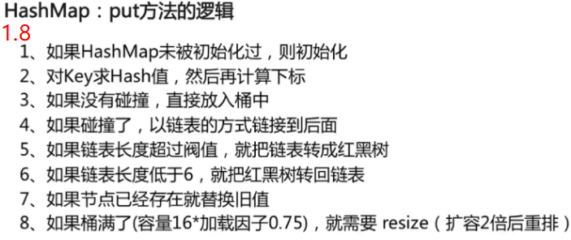

### hashMap 在JDK8与之前的版本实现上的不同点

    hashMap 在 JDK8 之前的实现为：数组 + 链表

 **构造方法：**

            在初始化 loadFactor、threshold 之后，会指向初始化操作，创建一个长度为capacity 的 Entry 数组：

   

**计算 hash**：    h ^= (h >>> 20) ^ (h >>> 12); return h ^ (h >>> 7) ^ (h >>> 4);

​    **计算table对应的index**：    h & (length-1);

​    **扩容**：不存在什么红黑树与链表的转化，将当前 table 的容量翻倍，重新计算每个元素的index。

​        对于旧table的数组上的链表遍历操作，每次计算出对应的新的index，然后放置到新 table 上链表的头部 且 next 将指向刚刚在该位置的第一个元素。

​        因此， 对于再次计算出index 相同的 键值对来说，它们的顺序会变成了原来的倒序。 

**JDK 8** 中：数组+链表，当链表长度超过8将转为 红黑树，红黑树元素小于 6 将转为链表

​    **构造方法：**

​        只进行初始化 loadFactor、threshold 操作，不会开辟数组的空间。

​        

​        几种构造器的执行结果：

​        

​        初始化操作，将在第一次执行put()时，调用 putVal() 时完成：

​        

​        开辟数组空间的方法，也是扩容的方法：

```java
final Node<K,V>[] resize() {
        Node<K,V>[] oldTab = table; // now the table is null
        int oldCap = (oldTab == null) ? 0 : oldTab.length;  // so oldCap == 0
        /*
         * 1、若调用的是带有参数的构造器，oldThr = tableSizeFor(initialCapacity)  > 0,
         * 2、若调用的是无参数的构造器，oldThr == 0
        */
        int oldThr = threshold; 
        int newCap, newThr = 0;
        if (oldCap > 0) {
            //下面代码不会调用，因为oldCap == 0
        }
        else if (oldThr > 0) // initial capacity was placed in threshold
            //若调用的是带有参数的构造器，此时计算的桶数组大小就是 tableSizeFor(initialCapacity) > 0
            newCap = oldThr;
        else {               // zero initial threshold signifies using defaults
            //若调用的是无参数的构造器，newCap == 16, newThr == (int) 16 * 0.75
            newCap = DEFAULT_INITIAL_CAPACITY;
            newThr = (int)(DEFAULT_LOAD_FACTOR * DEFAULT_INITIAL_CAPACITY);
        }
        if (newThr == 0) {
            //到这里如果newThr还没有被赋值，就执行下面代码
            //为什么到这里newThr依然为0呢？如果调用带有参数的构造器，那么threashold是大于0的，那么
            //就执行上面的if(oldThr > 0),将oldThr值赋给newCap，此时newThr依然为0, 而原来的threshold也就没有了用处
            //这说明之前将一个2的幂次方值赋值给threshold，只是为了赋值给桶数组的默认容量值（newCap = oldThr），赋值完之后，
            //threashold就需要重新计算了，下面就是计算过程：
            float ft = (float)newCap * loadFactor;
            newThr = (newCap < MAXIMUM_CAPACITY && ft < (float)MAXIMUM_CAPACITY ?
                      (int)ft : Integer.MAX_VALUE);
        }
        //覆盖threshold
        threshold = newThr;
        //开辟空间在这里
        Node<K,V>[] newTab = (Node<K,V>[])new Node[newCap];
        table = newTab;
        if (oldTab != null) {
            //这里面的代码不会调用，因为oldTab == null。
        }
        //返回桶数组的引用
        return newTab;
}
```

>     **总结**：
>
>     1.      调用HashMap构造器的时候，并不会开辟桶数组的空间。而 ArrayList的构造器，在指定大小的时候会分配空间；调用无参数的构造器，则会分配一个长度为0的数组。
>     2.      调用initialCapacity参数的构造器后，第一次 put，table 数组空间大小是不小于 initialCapacity 的最小2的幂次方值。
>     3.      调用无参的构造方法之后，第一次 put，table 数组的空间大小是16，`threshold`是16*0.75=12。
>     4.      putVal() 处理流程：先将key 放置好，然后比较size和threshold，若 size \> threshold ，则进行扩容，threshold 将扩容到之前的两倍。

​    **计算hash**:    (key == null) ? 0 : (h = key.hashCode()) ^ (h >>> 16)

​    **计算table对应的index**:    i = (n - 1) & hash

​    **扩容**：存在红黑树与链表的区别，将当前 table 的容量翻倍之后，两者的重新计算index，将分为单个元素、红黑树与链表 3种情况处理。

​        **对于单个元素：**

​            newTab\[e.hash & (newCap - 1)\] = e;

​            直接计算当前元素 e 在新table上的index，且 新table的index 将直接指向该元素。

​        **对于链表：**

​            引入两个链表 1、loHead --> loTail  
​                                   2、hiHead --> hiTail  
​              第一个链表存放的是那些索引位置不变的键值对  
​              第二个链表存放的是那些索引位置变化的键值对

```java
                        do {
                            next = e.next;
                            //将元素的hash值与原来的table长度作'且'操作
                            //且操作结果为:0，则说明再次计算索引位置不变
                            if ((e.hash & oldCap) == 0) {
                                if (loTail == null)
                                    loHead = e;
                                else
                                    loTail.next = e;
                                loTail = e;
                            }
                            //索引位置发生变化了，新的index为旧index j 加上 旧table 长度
                            else {
                                if (hiTail == null)
                                    hiHead = e;
                                else
                                    hiTail.next = e;
                                hiTail = e;
                            }
                        } while ((e = next) != null);
                        //旧table上index为j的链表处理完毕

                        //将索引值不变的链表指向新table的j上
                        if (loTail != null) {
                            loTail.next = null;
                            newTab[j] = loHead;
                        }
                        //将索引值改变的链表指向新table的 j + oldCap 上
                        if (hiTail != null) {
                            hiTail.next = null;
                            newTab[j + oldCap] = hiHead;
                        }
```

​        扩容时，对链表中的键值对重新计算桶索引。

​        原来的链表会分裂为两个新链表，一个存放索引值不变的键值对，另一个存放索引值变化的键值对；并且键值对在新链表中的相对顺序没有变。

​    **对于红黑树：**

```java
        final void split(HashMap<K,V> map, Node<K,V>[] tab, int index, int bit) {
            TreeNode<K,V> b = this;
            //引入两个红黑树 1、loHead --> loTail
            //            2、hiHead --> hiTail
            //  第一个红黑树存放的是那些索引位置不变的键值对
            //  第二个红黑树表存放的是那些索引位置变化的键值对
            TreeNode<K,V> loHead = null, loTail = null;
            TreeNode<K,V> hiHead = null, hiTail = null;
            //对这两个红黑树的元素个数进行计数
            int lc = 0, hc = 0;
            //遍历红黑树
            for (TreeNode<K,V> e = b, next; e != null; e = next) {
                next = (TreeNode<K,V>)e.next;
                e.next = null;
                //索引位置不变
                if ((e.hash & bit) == 0) {
                    
                    if ((e.prev = loTail) == null)
                        loHead = e;
                    else
                        loTail.next = e;
                    loTail = e;
                    ++lc;//计数加一
                }
                //索引位置变为:当前索引index + 旧table数组长度 bit
                else {
                    if ((e.prev = hiTail) == null)
                        hiHead = e;
                    else
                        hiTail.next = e;
                    hiTail = e;
                    ++hc;//计数加一
                }
            }
            //索引位置不变的红黑树
            if (loHead != null) {
                //红黑树元素个数小于等于6,降为链表
                if (lc <= UNTREEIFY_THRESHOLD)
                    tab[index] = loHead.untreeify(map);
                else {
                    tab[index] = loHead;
                    if (hiHead != null) // (else is already treeified)
                        loHead.treeify(tab);
                }
            }
            //索引位置改变的红黑树
            if (hiHead != null) {
                //红黑树元素个数小于等于6,降为链表
                if (hc <= UNTREEIFY_THRESHOLD)
                    tab[index + bit] = hiHead.untreeify(map);
                else {
                    tab[index + bit] = hiHead;
                    if (loHead != null)
                        hiHead.treeify(tab);
                }
            }
        }
```



