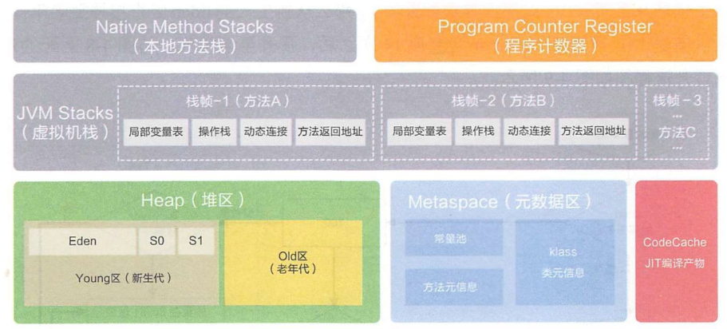
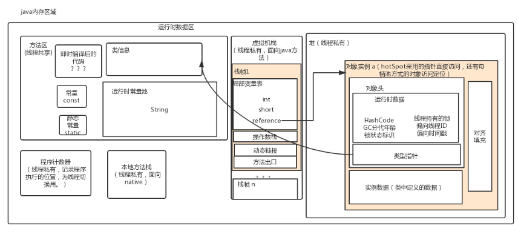
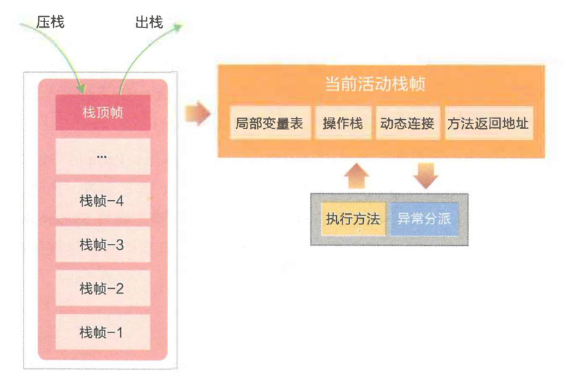
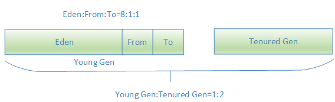
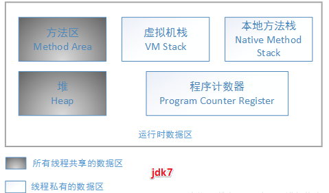
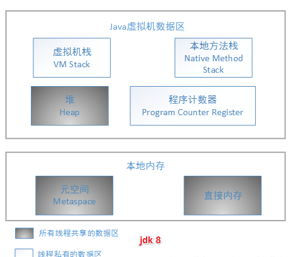
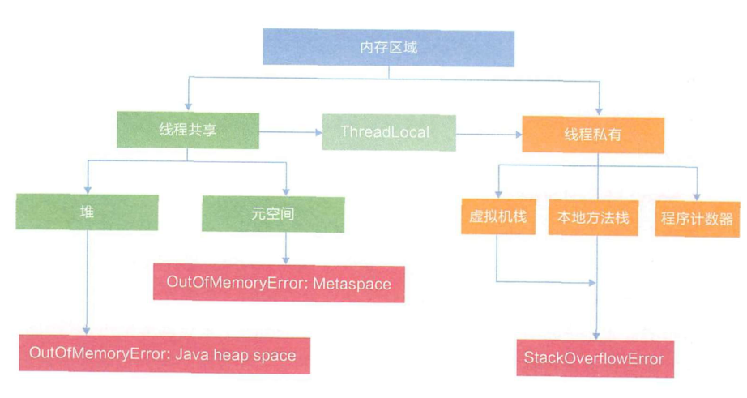
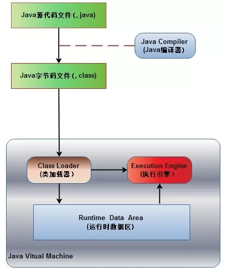

# [Java内存区域（运行时数据区域）](https://www.cnblogs.com/czwbig/p/11127124.html)

Java 内存区域和内存模型是不一样的东西，内存区域是指 Jvm 运行时将数据分区域存储，强调对内存空间的划分。

而内存模型（Java Memory Model，简称 JMM ）是定义了线程和主内存之间的抽象关系，即 JMM 定义了 JVM 在计算机内存(RAM)中的工作方式，如果我们要想深入了解Java并发编程，就要先理解好Java内存模型。

# Java运行时数据区域

众所周知，Java 虚拟机有自动内存管理机制，如果出现内存泄漏和溢出方面的问题，排查错误就必须要了解虚拟机是怎样使用内存的。

下图是 JDK8 之后的 JVM 内存布局。

这里再放一张 JDK8 之前得内存区域图。

### 程序计数器

​    程序计数器（Program Counter Register）是一块较小的内存空间，它可以看作是当前线程所执行的字节码的行号指示器。

由于 Java 虚拟机的多线程是通过线程轮流切换并分配处理器执行时间的方式来实现的，在任何一个确定的时刻，一个处理器内核都只会执行一条线程中的指令。

因此，为了线程切换后能恢复到正确的执行位置，每条线程都需要有一个独立的程序计数器，各条线程之间计数器互不影响，独立存储，我们称这类内存区域为“线程私有”的内存。

如果线程正在执行的是一个 Java 方法，这个计数器记录的是正在执行的虚拟机字节码指令的地址；如果正在执行的是 Native 方法，这个计数器值则为空（Undefined）。

 由于程序计数器中存储的数据所占空间的大小不会随程序的执行而发生改变，因此，对于程序计数器是不会发生内存溢出现象(OutOfMemory)的，此内存区域是唯一一个在 Java 虚拟机规范中没有规定任何 OutOfMemoryError 情况的区域。

### Java虚拟机栈

与程序计数器一样，Java 虚拟机栈（Java Virtual Machine Stacks）也是线程私有的，它的生命周期与线程相同。

虚拟机栈描述的是 Java 方法执行的内存模型：每个方法在执行的同时都会创建一个栈帧（Stack Frame，是方法运行时的基础数据结构）用于存储**局部变量表、操作数栈、动态链接、 方法返回地址** 等信息。

 当线程执行一个方法时，就会随之创建一个对应的栈帧，并将建立的栈帧压栈。当方法执行完毕之后，便会将栈帧出栈。因此可知，线程当前执行的方法所对应的栈帧必定位于Java栈的顶部。每一个方法从调用直至执行完成的过程，就对应着一个栈帧在虚拟机栈中入栈到出栈的过程。

在活动线程中，只有位于栈顶的帧才是有效的，称为当前栈帧。

正在执行的方法称为当前方法，栈帧是方法运行的基本结构。

在执行引擎运行时，所有指令都只能针对当前栈帧进行操作。

虚拟机栈规定了两种异常状况：如果线程请求的栈深度大于虚拟机所允许的深度，将抛出 StackOverflowError 异常；如果虚拟机栈可以动态扩展（当前大部分的 Java 虚拟机都可动态扩展），如果扩展时无法申请到足够的内存，就会抛出 OutOfMemoryError 异常。

**1\. 局部变量表**

 用来存储方法中的局部变量（包括在方法中声明的非静态变量以及函数形参）。对于基本数据类型的变量，则直接存储它的值，对于引用类型的变量，则存的是指向对象的引用。局部变量表的大小在编译器就可以确定其大小了，因此在程序执行期间局部变量表的大小是不会改变的。

局部变量没有准备阶段， 必须显式初始化。如果是非静态方法，**则在 index\[0\] 位置上存储的是方法所属对象的实例引用**，一个引用变量占 4 个字节，随后存储的是参数和局部变量。字节码指令中的 STORE 指令就是将操作栈中计算完成的局部变呈写回局部变量表的存储空间内。

**2\. 操作栈**

操作栈是个初始状态为空的桶式结构栈。在方法执行过程中， 会有各种指令往栈中写入和提取信息。

JVM 的执行引擎是基于栈的执行引擎， 其中的栈指的就是操作栈。 程序中的所有计算过程都是在借助于操作数栈来完成的。

字节码指令集的定义都是基于栈类型的，栈的深度在方法元信息的 stack 属性中。

**i++ 和 ++i 的区别：**

>     i++：从局部变量表取出 i 并压入操作栈，然后对局部变量表中的 i 自增 1，将操作栈栈顶值取出使用，最后，使用栈顶值更新局部变量表，如此线程从操作栈读到的是自增之前的值。
>
>     ++i：先对局部变量表的 i 自增 1，然后取出并压入操作栈，再将操作栈栈顶值取出使用，最后，使用栈顶值更新局部变量表，线程从操作栈读到的是自增之后的值。

之所以说 i++ 不是原子操作，即使使用 volatile 修饰也不是线程安全，就是因为，可能 i 被从局部变量表（内存）取出，压入操作栈（寄存器），操作栈中自增，使用栈顶值更新局部变量表（寄存器更新写入内存），其中分为 3 步，volatile 保证可见性，保证每次从局部变量表读取的都是最新的值，但可能这 3 步可能被另一个线程的 3 步打断，产生数据互相覆盖问题，从而导致 i 的值比预期的小。

　　方法返回地址，

　　由于每个线程正在执行的方法可能不同，因此每个线程都会有一个自己的Java栈，互不干扰。

**3\. 动态链接**

    每个栈帧中包含一个在常量池中对当前方法的引用， 目的是支持方法调用过程的动态连接。因为在方法执行的过程中有可能需要用到类中的常量，所以必须要有一个引用指向运行时常量。

**4.方法返回地址**

    当一个方法执行完毕之后，要返回之前调用它的地方，因此在栈帧中必须保存一个方法返回地址。
    
    方法执行时有两种退出情况：

>     正常退出，即正常执行到任何方法的返回字节码指令，如 RETURN、IRETURN、ARETURN 等；
>
>     异常退出。

    无论何种退出情况，都将返回至方法当前被调用的位置。方法退出的过程相当于弹出当前栈帧，退出可能有三种方式：

> 1.  返回值压入上层调用栈帧。
> 2.  异常信息抛给能够处理的栈帧。
> 3.  PC计数器指向方法调用后的下一条指令。

### 本地方法栈

本地方法栈（Native Method Stack）与虚拟机栈所发挥的作用是非常相似的，它们之间的区别不过是虚拟机栈为虚拟机执行 Java 方法（也就是字节码）服务，而本地方法栈则为虚拟机使用到的 Native 方法服务。

在JVM规范中，并没有对本地方发展的具体实现方法以及数据结构作强制规定，虚拟机可以自由实现它。

Sun HotSpot 虚拟机直接就把本地方法栈和虚拟机栈合二为一。

与虚拟机栈一样，本地方法栈区域也会抛出 StackOverflowError 和 OutOfMemoryError 异常。

线程开始调用本地方法时，会进入一个不再受 JVM 约束的世界。

>     本地方法可以通过 JNI(Java Native Interface)来访问虚拟机运行时的数据区，甚至可以调用寄存器，具有和 JVM 相同的能力和权限。
>
>     当大量本地方法出现时，势必会削弱 JVM 对系统的控制力，因为它的出错信息都比较黑盒。
>
>     对内存不足的情况，本地方法栈还是会抛出 nativeheapOutOfMemory。

JNI 类本地方法最著名的应该是 `System.currentTimeMillis()` ，JNI使 Java 深度使用操作系统的特性功能，复用非 Java 代码。 但是在项目过程中， 如果大量使用其他语言来实现 JNI , 就会丧失跨平台特性。

### Java堆

Java中的堆是用来存储对象本身的以及数组（当然，数组引用是存放在Java栈中的）。堆是被所有线程共享的，在JVM中只有一个堆，在虚拟机启动时创建。

此内存区域的唯一目的就是存放对象实例，几乎所有的对象实例都在这里分配内存。

堆是垃圾收集器管理的主要区域，因此很多时候也被称做“GC堆”（Garbage Collected Heap）。从内存回收的角度来看，由于现在收集器基本都采用分代收集算法，所以 Java 堆中还可以细分为：新生代和老年代；再细致一点的有 Eden 空间、From Survivor 空间、To Survivor 空间等。从内存分配的角度来看，线程共享的 Java 堆中可能划分出多个线程私有的分配缓冲区（Thread Local Allocation Buffer,TLAB）。

Java 堆可以处于物理上不连续的内存空间中，只要逻辑上是连续的即可，当前主流的虚拟机都是按照可扩展来实现的（通过 -Xmx 和 -Xms 控制）。

如果在堆中没有内存完成实例分配，并且堆也无法再扩展时，将会抛出 OutOfMemoryError 异常。

**堆分为初生代（Young Gen）和老年代（Tenured Gen），比例默认为1:2，而初生代又分为Eden和From和To三个区域，比例默认为8:1:1**，如下图：

### 方法区

方法区（Method Area）与 Java 堆一样，是各个线程共享的内存区域，它用于存储已被虚拟机加载的类信息（包括类的名称、方法信息、字段信息）、静态变量、常量、即时编译器编译后的代码等数据。

虽然 Java 虚拟机规范把方法区描述为堆的一个逻辑部分，但是它却有一个别名叫做 Non-Heap（非堆），目的应该是与 Java 堆区分开来。

在Class文件中除了类的字段、方法、接口等描述信息外，还有一项信息是常量池，用来存储编译期间生成的字面量和符号引用。

在方法区中有一个非常重要的部分就是运行时常量池，它是每一个类或接口的常量池的运行时表示形式，在类和接口被加载到JVM后，对应的运行时常量池就被创建出来。当然并非Class文件常量池中的内容才能进入运行时常量池，在运行期间也可将新的常量放入运行时常量池中，比如String的intern方法。

在JVM规范中，没有强制要求方法区必须实现垃圾回收。很多人习惯将方法区称为“永久代”，是因为HotSpot虚拟机以永久代来实现方法区。

除了和 Java 堆一样不需要连续的内存和可以选择固定大小或者可扩展外，还可以选择不实现垃圾收集。垃圾收集行为在这个区域是比较少出现的，其内存回收目标主要是针对常量池的回收和对类型的卸载。

不过自从JDK7之后，Hotspot虚拟机便将运行时常量池从永久代移除了。

当方法区无法满足内存分配需求时，将抛出 OutOfMemoryError 异常。

在JDK1.7之前运行时常量池逻辑包含字符串常量池存放在方法区, 此时hotspot虚拟机对方法区的实现为永久代。

在JDK1.7 字符串常量池被从方法区拿到了堆中。字符串常量池被单独拿到堆,运行时常量池剩下的东西还在方法区, 也就是hotspot中的永久代

在JDK1.8 hotspot移除了永久代用元空间(Metaspace)取而代之, 这时候字符串常量池还在堆, 运行时常量池还在方法区, 只不过方法区的实现从永久代变成了元空间(Metaspace) 。

**元空间直接在本地内存分配。**

    为什么要使用元空间取代永久代的实现？

> 1.  字符串存在永久代中，容易出现性能问题和内存溢出。
> 2.  类及方法的信息等比较难确定其大小，因此对于永久代的大小指定比较困难，太小容易出现永久代溢出，太大则容易导致老年代溢出。
> 3.  永久代会为 GC 带来不必要的复杂度，并且回收效率偏低。
> 4.  将 HotSpot 与 JRockit 合二为一。

**运行时常量池**

Class 文件中除了有类的版本、字段、方法、接口等描述信息外，还有一项信息是常量池（Constant Pool Table），用于存放编译期生成的各种字面量和符号引用。

 在JDK1.7中，运行时常量池是方法区的一部分，用于存放编译期生成的各种字符变量和符号引用。其实 除了运行时常量池，还有字符串常量池，class常量池。

一般来说，除了保存 Class 文件中描述的符号引用外，还会把翻译出来的直接引用也存储在运行时常量池中。

运行时常量池相对于 Class 文件常量池的另外一个重要特征是具备动态性，Java 语言并不要求常量一定只有编译期才能产生，也就是并非预置入 Class 文件中常量池的内容才能进入方法区运行时常量池，运行期间也可能将新的常量放入池中，这种特性被开发人员利用得比较多的便是 String 类的 intern() 方法。

既然运行时常量池是方法区的一部分，自然受到方法区内存的限制，当常量池无法再申请到内存时会抛出 OutOfMemoryError 异常。

从JDK8开始，永久代(PermGen)的概念被废弃掉了，取而代之的是一个称为Metaspace的存储空间。Metaspace使用的是本地内存，而不是堆内存，也就是说在默认情况下Metaspace的大小只与本地内存大小有关。

可以通过以下的几个参数对Metaspace进行控制：

> 1.  -XX:MetaspaceSize=N  
>     这个参数是初始化的Metaspace大小，该值越大触发Metaspace GC的时机就越晚。随着GC的到来，虚拟机会根据实际情况调控Metaspace的大小，可能增加上线也可能降低。在默认情况下，这个值大小根据不同的平台在12M到20M浮动。使用java -XX:+PrintFlagsInitial命令查看本机的初始化参数，-XX:Metaspacesize为21810376B（大约20.8M）。
>     
> 2.  -XX:MaxMetaspaceSize=N  
>     这个参数用于限制Metaspace增长的上限，防止因为某些情况导致Metaspace无限的使用本地内存，影响到其他程序。在本机上该参数的默认值为4294967295B（大约4096MB）。
>     
> 3.  -XX:MinMetaspaceFreeRatio=N  
>     当进行过Metaspace GC之后，会计算当前Metaspace的空闲空间比，如果空闲比小于这个参数，那么虚拟机将增长Metaspace的大小。在本机该参数的默认值为40，也就是40%。设置该参数可以控制Metaspace的增长的速度，太小的值会导致Metaspace增长的缓慢，Metaspace的使用逐渐趋于饱和，可能会影响之后类的加载。而太大的值会导致Metaspace增长的过快，浪费内存。
>     
> 4.  -XX:MaxMetasaceFreeRatio=N  
>     当进行过Metaspace GC之后， 会计算当前Metaspace的空闲空间比，如果空闲比大于这个参数，那么虚拟机会释放Metaspace的部分空间。在本机该参数的默认值为70，也就是70%。
>     
> 5.  -XX:MaxMetaspaceExpansion=N  
>     Metaspace增长时的最大幅度。在本机上该参数的默认值为5452592B（大约为5MB）。
>     
> 6.  -XX:MinMetaspaceExpansion=N  
>     Metaspace增长时的最小幅度。在本机上该参数的默认值为340784B（大约330KB为）。
>     

### 直接内存

直接内存（Direct Memory）并不是虚拟机运行时数据区的一部分，也不是 Java 虚拟机规范中定义的内存区域。

在 JDK 1.4 中新加入了 NIO，引入了一种基于通道（Channel）与缓冲区（Buffer）的 I/O 方式，它可以使用 Native 函数库直接分配堆外内存，然后通过一个存储在 Java 堆中的 DirectByteBuffer 对象作为这块内存的引用进行操作。这样能在一些场景中显著提高性能，因为避免了在 Java 堆和 Native 堆中来回复制数据。

显然，本机直接内存的分配不会受到 Java 堆大小的限制，但是，既然是内存，肯定还是会受到本机总内存（包括 RAM 以及 SWAP 区或者分页文件）大小以及处理器寻址空间的限制。服务器管理员在配置虚拟机参数时，会根据实际内存设置 -Xmx 等参数信息，但经常忽略直接内存，使得各个内存区域总和大于物理内存限制（包括物理的和操作系统级的限制），从而导致动态扩展时出现 OutOfMemoryError 异常。

### Java程序具体执行的过程

首先Java源代码文件(.java后缀)会被Java编译器编译为字节码文件(.class后缀)，然后由JVM中的类加载器加载各个类的字节码文件，加载完毕之后，交由JVM执行引擎执行。

在整个程序执行过程中，JVM会用一段空间来存储程序执行期间需要用到的数据和相关信息，这段空间一般被称作为Runtime Data Area（运行时数据区），也就是我们常说的JVM内存。

因此，在Java中我们常常说到的内存管理就是针对这段空间进行管理（如何分配和回收内存空间）