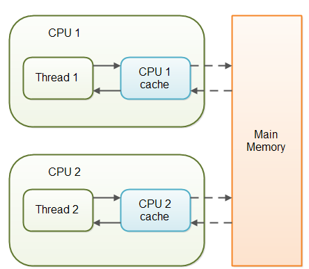
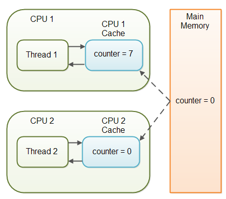
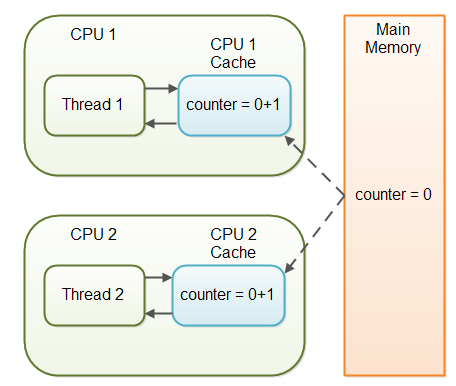
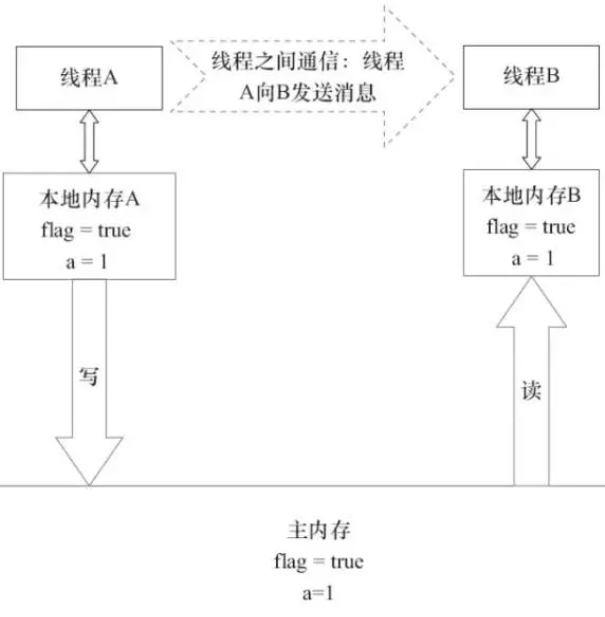
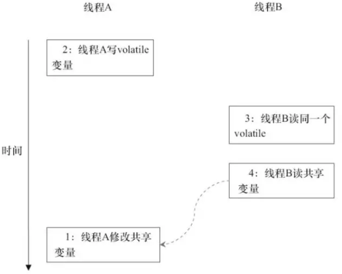
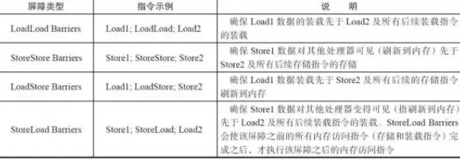
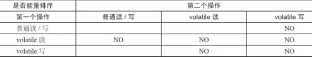

Java的volatile关键字用于标记一个变量“应当存储在主存”。更确切地说，每次读取volatile变量，都应该从主存读取，而不是从CPU缓存读取。每次写入一个volatile变量，应该写到主存中，而不是仅仅写到CPU缓存。

实际上，从Java 5开始，volatile关键字除了保证volatile变量从主存读写外，还提供了更多的保障。

## 变量可见性问题

Java的volatile关键字能保证变量修改后，对各个线程是可见的。

在一个多线程的应用中，线程在操作非volatile变量时，出于性能考虑，每个线程可能会将变量从主存拷贝到CPU缓存中。如果你的计算机有多个CPU，每个线程可能会在不同的CPU中运行。这意味着，每个线程都有可能会把变量拷贝到各自CPU的缓存中，如下图所示：



对于非volatile变量，JVM并不保证会从主存中读取数据到CPU缓存，或者将CPU缓存中的数据写到主存中。这会引起一些问题，在后面的章节中，我会来解释这些问题。

试想一下，如果有两个以上的线程访问一个共享对象，这个共享对象包含一个counter变量，下面是代码示例：

```java
public class SharedObject {

   public int counter = 0; 
}
```

如果只有线程1修改了（自增）counter变量，而线程1和线程2两个线程都会在某些时刻读取counter变量。

如果counter变量没有声明成volatile，则counter的值不保证会从CPU缓存写回到主存中。也就是说，CPU缓存和主存中的counter变量值并不一致，如下图所示：



这就是“可见性”问题，线程看不到变量最新的值，因为其他线程还没有将变量值从CPU缓存写回到主存。一个线程中的修改对另外的线程是不可见的。

## volatile可见性保证

Java的volatile关键字就是设计用来解决变量可见性问题。将counter变量声明为volatile，则在写入counter变量时，也会同时将变量值写入到主存中。同样的，在读取counter变量值时，也会直接从主存中读取。

下面的代码演示了如果将counter声明为volatile：

public class SharedObject {

    public volatile int counter = 0; 
}

将一个变量声明为volatile，可以保证变量写入时对其他线程的可见。

在上面的场景中，一个线程（T1）修改了counter，另一个线程（T2）读取了counter（但没有修改它），将counter变量声明为volatile，就能保证写入counter变量后，对T2是可见的。

然而，如果T1和T2都修改了counter的值，只是将counter声明为volatile还远远不够，后面会有更多的说明。

## 完整的volatile可见性保证

实际上，volatile的可见性保证并不是只对于volatile变量本身那么简单。可见性保证遵循以下规则：

-   如果线程A写入一个volatile变量，线程B随后读取了同样的volatile变量，则线程A在写入volatile变量之前的所有可见的变量值，在线程B读取volatile变量后也同样是可见的。
-   如果线程A读取一个volatile变量，那么线程A中所有可见的变量也会同样从主存重新读取。

    下面用一段代码来示例说明：

```java
public class MyClass {
    private int years;
    private int months;
    private volatile int days;
    public void update(int years, int months, int days) {
        this.years = years;
        this.months = months;
        this.days = days;
    }
}
```


update()方法写入3个变量，其中只有days变量是volatile。

完整的volatile可见性保证意味着，在写入days变量时，线程中所有可见变量也会写入到主存。也就是说，写入days变量时，years和months也会同时被写入到主存。

下面的代码读取了years、months、days变量：

```java
public class MyClass {
    private int years;
    private int months;
    private volatile int days; 
    public int totalDays() {
        int total = this.days;
        total += months \* 3;
        total += years \* 365;
        return total;
     }

     public void update(int years, int months, int days) {
        this.years = years;
        this.months = months;
        this.days = days;
     }
}
```

请注意totalDays()方法开始读取days变量值到total变量。在读取days变量值时，months和years的值也会同时从主存读取。因此，按上面所示的顺序读取时，可以保证读取到days、months、years变量的最新值。

> 译者注：可以将对volatile变量的读写理解为一个触发刷新的操作，写入volatile变量时，线程中的所有变量也都会触发写入主存。而读取volatile变量时，也同样会触发线程中所有变量从主存中重新读取。因此，应当尽量将volatile的写入操作放在最后，而将volatile的读取放在最前，这样就能连带将其他变量也进行刷新。上面的例子中，update()方法对days的赋值就是放在years、months之后，就是保证years、months也能将最新的值写入到主存，如果是放在两个变量之前，则days会写入主存，而years、months则不会。反过来，totalDays()方法则将days的读取放在最前面，就是为了能同时触发刷新years、months变量值，如果是放后面，则years、months就可能还是从CPU缓存中读取值，而不是从主存中获取最新值。

## 指令重排问题

出于性能考虑，JVM和CPU是允许对程序中的指令进行重排的，只要保证（重排后的）指令语义一致即可。如下代码为例：

int a= 1; int b= 2; a++; b++;

这些指令可以按以下顺序重排，而不改变程序的语义：

```
int a=1; a++; int b=2; b++;
```

然而，指令重排面临的一个问题就是对volatile变量的处理。还是以前面提到的MyClass类来说明：

```java
public class MyClass {
    private int years;
    private int months;
    private volatile int days; 

    public void update(int years, int months, int days) {
        this.years = years;
        this.months = months;
        this.days = days;
    }
}
```


一旦update()变量写了days值，则years、months的最新值也会写入到主存。但是，如果JVM重排了指令，比如按以下方式重排：

```java
public void update(int years,int months,int days){
  this.days=days;
  this.months=months;
  this.years=years;
}
```

在days被修改时，months、years的值也会写入到主存，但这时进行写入，months、years并不是新的值（译者注：即在months、years被赋新值之前，就触发了这两个变量值写入主存的操作，自然这两个变量在主存中的值就不是新值）。新的值自然对其他线程是不可见的。指令重排导致了程序语义的改变。

## Java volatile Happens-Before保证

为了解决指令重排的问题，Java的volatile关键字在可见性之外，又提供了happends-before保证。happens-before原则如下：

-   如果有读写操作发生在写入volatile变量之前，读写其他变量的指令不能重排到写入volatile变量之后。写入一个volatile变量之前的读写操作，对volatile变量是有happens-before保证的。注意，如果是写入volatile之后，有读写其他变量的操作，那么这些操作指令是有可能被重排到写入volatile操作指令之前的。但反之则不成立。即可以把位于写入volatile操作指令之后的其他指令移到写入volatile操作指令之前，而不能把位于写入volatile操作指令之前的其他指令移到写入volatile操作指令之后。
-   如果有读写操作发生在读取volatile变量之后，读写其他变量的指令不能重排到读取volatile变量之前。注意，如果是读取volatile之前，有读取其他变量的操作，那么这些操作指令是有可能被重排到读取volatile操作指令之后的。但反之则不成立。即可以把位于读取volatile操作指令之前的指令移到读取volatile操作指令之后，而不能把位于读取volatile操作指令之后的指令移到读取volatile操作指令之前。

    以上的happens-before原则为volatile关键字的可见性提供了强制保证。

> 译者注：这两个原则读起来有些拗口，其实就是不管JVM怎么去禁止/允许某些情况下的指令重排，最终就是保证“完整的volatile可见性保证”的那种效果，所以，只要理解了“完整的volatile可见性保证”的效果就足够了。

## volatile并不总是可行的

虽然volatile关键字能保证volatile变量的所有读取都是直接从主存读取，所有写入都是直接写入到主存中，但在一些情形下，仅仅是将变量声明为volatile还是远远不够的。

就像前面示例所说的，线程1写入共享变量counter的值，将counter声明为volatile已经足够保证线程2总是能获取到最新的值。

事实上，多个线程都能写入共享的volatile变量，主存中也能存储正确的变量值，然而这有一个前提，变量新值的写入不能依赖于变量的旧值。换句话说，就是一个线程写入一个共享volatile变量值时，不需要先读取变量值，然后以此来计算出新的值。

如果线程需要先读取一个volatile变量的值，以此来计算出一个新的值，那么volatile变量就不足够保证正确的可见性。（线程间）读写volatile变量的时间间隔很短，这将导致一个竞态条件，多个线程同时读取了volatile变量相同的值，然后以此计算出了新的值，这时各个线程往主存中写回值，则会互相覆盖。

多个线程对counter变量进行自增操作就是这样的情形.

设想一下，如果线程1将共享变量counter的值0读取到它的CPU缓存，然后自增为1，而还没有将新值写回到主存。线程2这时从主存中读取的counter值依然是0，依然放到它自身的CPU缓存中，然后同样将counter值自增为1，同样也还没有将新值写回到主存。如下图所示：



从实际的情况来看，线程1和线程2现在就是不同步的。共享变量counter正确的值应该是2，但各个线程中CPU缓存的值都是1，而主存中的值依然是0。这是很混乱的。即使线程最终将共享变量counter的值写回到主存，那值也明显是错的。

## 何时使用volatile

正如我前面所说，如果两个线程同时读写一个共享变量，仅仅使用volatile关键字是不够的。你应该使用synchronized来保证读写变量是原子的。（一个线程）读写volatile变量时，不会阻塞（其他）线程进行读写。你必须在关键的地方使用synchronized关键字来解决这个问题。

除了synchronized方法，你还可以使用java.util.concurrent包提供的许多原子数据类型来解决这个问题。比如，AtomicLong或AtomicReference，或是其他的类。

如果只有一个线程对volatile进行读写，而其他线程只是读取变量，这时，对于只是读取变量的线程来说，volatile就已经可以保证读取到的是变量的最新值。如果没有把变量声明为volatile，这就无法保证。

volatile关键字对32位和64位的变量都有效。

## volatile的性能考量

读写volatile变量会导致变量从主存读写。从主存读写比从CPU缓存读写更加“昂贵”。访问一个volatile变量同样会禁止指令重排，而指令重排是一种提升性能的技术。因此，你应当只在需要保证变量可见性的情况下，才使用volatile变量。

**内存可见性**

**内存可见性相关概念：**线程对共享变量修改的可见性。当一个线程修改了共享变量的值，其他线程能够立刻得知这个修改。 

volatile使用Lock前缀的指令禁止线程本地内存缓存，保证不同线程之间的内存可见性。

Java代码如下：

> Singleton volatile instance = new Singleton();                // instance是volatile变量

转变成汇编代码，如下：

> 0x01a3de1d: movb $0×0,0×1104800(%esi);0x01a3de24: lock addl $0×0,(%esp);

为了提高处理速度，处理器不直接和内存进行通信，而是先将系统内存的数据读到内部缓存（L1，L2或其他）后再进行操作，但操作完不知道何时会写到内存。

如果对声明了volatile的变量进行写操作，JVM就会向处理器发送一条Lock前缀的指令，将这个变量所在缓存行的数据会立即写回到系统内存。

但是，就算写回到内存，如果其他处理器缓存的值还是旧的，再执行计算操作就会有问题。

在多处理器下，为了保证各个处理器的缓存是一致的，就会实现缓存一致性协议，每个处理器通过嗅探在总线上传播的数据来检查自己缓存的值是不是过期了，当处理器发现自己缓存行对应的内存地址被修改，就会将当前处理器的缓存行设置成无效状态，当处理器对这个数据进行修改操作的时候，会重新从系统内存中把数据读到处理器缓存里。

Lock前缀的指令在多核处理器下会引发了两件事情：

-   1）将当前处理器缓存行的数据写回到系统内存。
    
-   2）一个处理器的缓存回写到内存会导致其他处理器的缓存无效。在多核处理器系统中进行操作的时候，IA-32和Intel 64处理器能嗅探其他处理器访问系统内存和它们的内部缓存，处理器使用嗅探技术保证它的内部缓存、系统内存和其他处理器的缓存的数据在总线上保持一致
    

    理解volatile特性的一个好方法是把对volatile变量的单个读/写，看成是使用同一个锁对这些单个读/写操作做了同步。

从内存语义的角度来说，volatile的写-读与锁的释放-获取有相同的内存效果：volatile写和锁的释放有相同的内存语义；volatile读与锁的获取有相同的内存语义——这使得volatile变量的写-读可以实现线程之间的通信。

**volatile的内存语义：**

> -   volatile写的内存语义：当写一个volatile变量时，JMM会把该线程对应的本地内存中的共享变量值刷新到主内存
>     
> -   volatile读的内存语义：当读一个volatile变量时，JMM会把该线程对应的本地内存置为无效。线程接下来将从主内存中读取共享变量。
>     

**volatile写 - 读的内存语义：**

> -   线程A写一个volatile变量，实质上是线程A向接下来将要读这个volatile变量的某个线程发出了（其对共享变量所做修改的）消息。 
>     
> -   线程B读一个volatile变量，实质上是线程B接收了之前某个线程发出的（在写这个volatile变量之前对共享变量所做修改的）消息。 
>     
> -   线程A写一个volatile变量，随后线程B读这个volatile变量，这个过程实质上是线程A通过主内存向线程B发送消息。
>     



### 内存屏障禁止指令重排序

volatile关键字本身就包含了禁止指令重排序的语义。

**指令重排序对内存可见性的影响：**



当1和2之间没有数据依赖关系时，1和2之间就可能被重排序（3和4类似）。这样的结果就是：读线程B执行4时，不一定能看到写线程A在执行1时对共享变量的修改。

**volatile禁止指令重排序语义的实现：**

**内存屏障：**

重排序可能会导致多线程程序出现内存可见性问题。对于处理器重排序，JMM的处理器重排序规则会要求Java编译器在生成指令序列时，插入特定类型的内存屏障（Memory Barriers，Intel称之为Memory Fence）指令，通过内存屏障指令来禁止特定类型的处理器重排序。通过禁止特定类型的编译器重排序和处理器重排序，为程序员提供一致的内存可见性保证。

为了保证内存可见性，Java编译器在生成指令序列的适当位置会插入内存屏障指令来禁止特定类型的处理器重排序。



StoreLoad Barriers是一个“全能型”的屏障，它同时具有其他3个屏障的效果。现代的多处理器大多支持该屏障（其他类型的屏障不一定被所有处理器支持）。执行该屏障开销会很昂贵，因为当前处理器通常要把写缓冲区中的数据全部刷新到内存中（Buffer Fully Flush）。

**JMM针对编译器制定volatile重排序规则表：**



> -   当第二个操作是volatile写时，不管第一个操作是什么，都不能重排序。这个规则确保volatile写之前的操作不会被编译器重排序到volatile写之后。 
>     
> -   当第一个操作是volatile读时，不管第二个操作是什么，都不能重排序。这个规则确保volatile读之后的操作不会被编译器重排序到volatile读之前。 
>     
> -   当第一个操作是volatile写，第二个操作是volatile读时，不能重排序
>     

为了实现volatile的内存语义，编译器在生成字节码时，会在指令序列中插入内存屏障来禁止特定类型的处理器重排序。

下面是基于保守策略的JMM内存屏障插入策略：

> -   在每个volatile写操作的前面插入一个StoreStore屏障。 
>     
> -   在每个volatile写操作的后面插入一个StoreLoad屏障。 
>     
> -   在每个volatile读操作的后面插入一个LoadLoad屏障。 
>     
> -   在每个volatile读操作的后面插入一个LoadStore屏障。
>     

从编译器重排序规则和处理器内存屏障插入策略来看，只要volatile变量与普通变量之间的重排序可能会破坏volatile的内存语义（内存可见性），这种重排序就会被编译器重排序规则和处理器内存屏障插入策略禁止。

### 操作原子性

对任意单个volatile变量的读/写具有原子性，但类似于volatile++这种复合操作不具有原子性，因为本质上volatile++是读、写两次操作。

对于复合操作，可以：

> -   同步块技术（锁）
>     
> -   Java concurrent包（原子操作类等）
>     

**总结**

**volatile特点：**

> -   通过使用Lock前缀的指令禁止变量在线程工作内存中缓存来保证volatile变量的内存可见性、通过插入内存屏障禁止会影响变量内存可见性的指令重排序
>     
> -   对任意单个volatile变量的读/写具有原子性，但类似于volatile++这种复合操作不具有原子性
>