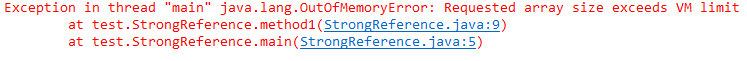
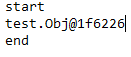
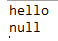
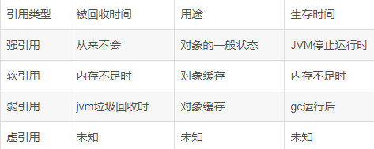

在JDK1.2以前的版本中，当一个对象不被任何变量引用，那么程序就无法再使用这个对象。也就是说，只有对象处于可触及状态，程序才能使用它。这就像在商店购买了某样物品后，如果有用就一直保留它，否则就把它扔到垃圾箱，由清洁工人收走。一般说来，如果物品已经被扔到垃圾箱，想再把它捡回来使用就不可能了。

但有时候情况并不这么简单，可能会遇到可有可无的"鸡肋"物品。这种物品现在已经无用了，保留它会占空间，但是立刻扔掉它也不划算，因为也许将来还会派用场。对于这样的可有可无的物品：如果家里空间足够，就先把它保留在家里，如果家里空间不够，即使把家里所有的垃圾清除，还是无法容纳那些必不可少的生活用品，那么再扔掉这些可有可无的物品。

在Java中，虽然不需要程序员手动去管理对象的生命周期，但是如果希望某些对象具备一定的生命周期的话（比如内存不足时JVM就会自动回收某些对象从而避免OutOfMemory的错误）就需要用到软引用和弱引用了。

从Java SE2开始，就提供了四种类型的引用：强引用、软引用、弱引用和虚引用。Java中提供这四种引用类型主要有两个目的：第一是可以让程序员通过代码的方式决定某些对象的生命周期；第二是有利于JVM进行垃圾回收。

一、强引用  
    之前我们使用的大部分引用实际上都是强引用，这是使用最普遍的引用。比如下面这段代码中的object和str都是强引用：

```java
Object object = new Object();
String str = "StrongReference";
```

如果一个对象具有强引用，那就类似于必不可少的物品，不会被垃圾回收器回收。当内存空间不足，Java虚拟机宁愿抛出OutOfMemoryError错误，使程序异常终止，也不回收这种对象。

```java
public class StrongReference {
    public static void main(String[] args) {
        new StrongReference().method1();
    }
    public void method1(){
        Object object=new Object();
        Object[] objArr=new Object[Integer.MAX_VALUE];
    }
}
```

运行结果：

  
    当运行至Object\[\] objArr = new Object\[Integer.MAX_VALUE\]时，如果内存不足，JVM会抛出OOM错误也不会回收object指向的对象。不过要注意的是，当method1运行完之后，object和objArr都已经不存在了，所以它们指向的对象都会被JVM回收。

如果想中断强引用和某个对象之间的关联，可以显示地将引用赋值为null，这样一来的话，JVM在合适的时间就会回收该对象。

比如ArraryList类的clear方法中就是通过将引用赋值为null来实现清理工作的

public void clear() {
      modCount++;

​      // Let gc do its work
​      for (int i = 0; i < size; i++)
​          elementData[i] = null;

​      size = 0;
}

在ArrayList类中定义了一个私有的变量elementData数组，在调用方法清空数组时可以看到为每个数组内容赋值为null。不同于elementData=null，强引用仍然存在，避免在后续调用 add()等方法添加元素时进行重新的内存分配。使用如clear()方法中释放内存的方法对数组中存放的引用类型特别适用，这样就可以及时释放内存。

二、软引用  
    软引用是用来描述一些有用但并不是必需的对象，在Java中用java.lang.ref.SoftReference类来表示。对于软引用关联着的对象，只有在内存不足的时候JVM才会回收该对象。因此，这一点可以很好地用来解决OOM的问题，并且这个特性很适合用来实现缓存：比如网页缓存、图片缓存等。

软引用可以和一个引用队列（ReferenceQueue）联合使用，如果软引用所引用的对象被JVM回收，这个软引用就会被加入到与之关联的引用队列中。

```java
import java.lang.ref.SoftReference;
 
public class SoftRef {  
 
    public static void main(String[] args){  
        System.out.println("start");            
        Obj obj = new Obj();            
        SoftReference<Obj> sr = new SoftReference<Obj>(obj);  
        obj = null;  
        System.out.println(sr.get());  
        System.out.println("end");     
    }       
}  
 
class Obj{  
    int[] obj ;  
    public Obj(){  
        obj = new int[1000];  
    }  
}
```

运行结果：



当内存足够大时可以把数组存入软引用，取数据时就可从内存里取数据，提高运行效率

软引用在实际中有重要的应用，例如浏览器的后退按钮，这个后退时显示的网页内容可以重新进行请求或者从缓存中取出：

（1）如果一个网页在浏览结束时就进行内容的回收，则按后退查看前面浏览过的页面时，需要重新构建

（2）如果将浏览过的网页存储到内存中会造成内存的大量浪费，甚至会造成内存溢出这时候就可以使用软引用

三、弱引用  
    弱引用也是用来描述非必需对象的，当JVM进行垃圾回收时，无论内存是否充足，都会回收被弱引用关联的对象。在java中，用java.lang.ref.WeakReference类来表示。

弱引用与软引用的区别在于：只具有弱引用的对象拥有更短暂的生命周期。在垃圾回收器线程扫描它所管辖的内存区域的过程中，一旦发现了只具有弱引用的对象，不管当前内存空间足够与否，都会回收它的内存。不过，由于垃圾回收器是一个优先级很低的线程， 因此不一定会很快发现那些只具有弱引用的对象。所以被软引用关联的对象只有在内存不足时才会被回收，而被弱引用关联的对象在JVM进行垃圾回收时总会被回收。

```java
import java.lang.ref.WeakReference;
 
public class WeakRef {
    public static void main(String[] args) {
        WeakReference<String> sr = new WeakReference<String>(new String("hello"));
        System.out.println(sr.get());
        System.gc();                //通知JVM的gc进行垃圾回收
        System.out.println(sr.get());
    }
}
```

运行结果：



在使用软引用和弱引用的时候，我们可以显示地通过System.gc()来通知JVM进行垃圾回收，但是要注意的是，虽然发出了通知，JVM不一定会立刻执行，也就是说这句是无法确保此时JVM一定会进行垃圾回收的。

弱引用还可以和一个引用队列（ReferenceQueue）联合使用，如果弱引用所引用的对象被垃圾回收，Java虚拟机就会把这个弱引用加入到与之关联的引用队列中。

> Object o = new Object(); //只要o还指向对象就不会被回收  
> WeakReference<Object> wr = new WeakReference<Object>(o);

当要获得weak reference引用的object时, 首先需要判断它是否已经被回收，如果wr.get()方法为空, 那么说明weakCar指向的对象已经被回收了。

应用场景：如果一个对象是偶尔的使用，并且希望在使用时随时就能获取到，但又不想影响此对象的垃圾收集，那么应该用 Weak Reference 来记住此对象。或者想引用一个对象，但是这个对象有自己的生命周期，你不想介入这个对象的生命周期，这时候就应该用弱引用，这个引用不会在对象的垃圾回收判断中产生任何附加的影响。

四、虚引用  
    虚引用和前面的软引用、弱引用不同，它并不影响对象的生命周期。在java中用java.lang.ref.PhantomReference类表示。如果一个对象与虚引用关联，则跟没有引用与之关联一样，在任何时候都可能被垃圾回收器回收。虚引用主要用来跟踪对象被垃圾回收的活动。

虚引用必须和引用队列关联使用，当垃圾回收器准备回收一个对象时，如果发现它还有虚引用，就会把这个虚引用加入到与之 关联的引用队列中。程序可以通过判断引用队列中是否已经加入了虚引用，来了解被引用的对象是否将要被垃圾回收。如果程序发现某个虚引用已经被加入到引用队列，那么就可以在所引用的对象的内存被回收之前采取必要的行动。

```java
import java.lang.ref.PhantomReference;
import java.lang.ref.ReferenceQueue;
 
 
public class PhantomRef {
    public static void main(String[] args) {
        ReferenceQueue<String> queue = new ReferenceQueue<String>();
        PhantomReference<String> pr = new PhantomReference<String>(new String("hello"), queue);
        System.out.println(pr.get());
    }
}
```


五、总结  


在实际程序设计中一般很少使用弱引用与虚引用，使用软引用的情况较多，这是因为软引用可以加速JVM对垃圾内存的回收速度，可以维护系统的运行安全，防止内存溢出（OutOfMemory）等问题的产生

利用软引用和弱引用解决OOM问题：假如有一个应用需要读取大量的本地图片，如果每次读取图片都从硬盘读取，则会严重影响性能，但是如果全部加载到内存当中，又有可能造成内存溢出，此时使用软引用可以解决这个问题。

设计思路是：用一个HashMap来保存图片的路径和相应图片对象关联的软引用之间的映射关系，在内存不足时，JVM会自动回收这些缓存图片对象所占用的空间，从而有效地避免了OOM的问题。