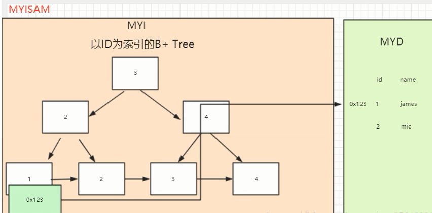
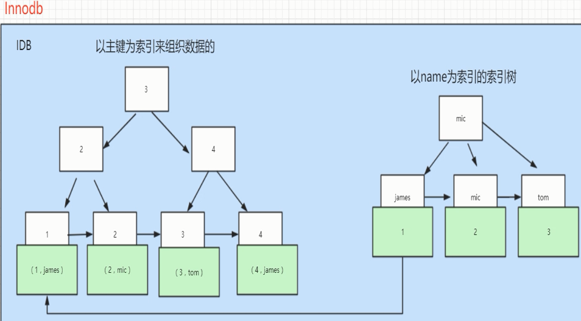

区别：  
1\. InnoDB支持事务，MyISAM不支持，对于InnoDB每一条SQL语言都默认封装成事务，自动提交，这样会影响速度，所以最好把多条SQL语言放在begin和commit之间，组成一个事务； 

2\. InnoDB支持外键，而MyISAM不支持。对一个包含外键的InnoDB表转为MYISAM会失败； 

3\. InnoDB是聚集索引，使用B+Tree作为索引结构，数据文件是和（主键）索引绑在一起的（表数据文件本身就是按B+Tree组织的一个索引结构），必须要有主键，通过主键索引效率很高。但是辅助索引需要两次查询，先查询到主键，然后再通过主键查询到数据。因此，主键不应该过大，因为主键太大，其他索引也都会很大。

MyISAM是非聚集索引，也是使用B+Tree作为索引结构，索引和数据文件是分离的，索引保存的是数据文件的指针。主键索引和辅助索引是独立的。

MyISAM的B+树主键索引和辅助索引的叶子节点都是数据文件的**地址指针：**

InnoDB的B+树主键索引的叶子节点就是数据文件，辅助索引的叶子节点是主键的值：

4.InnoDB表必须有主键（用户没有指定的话会自己找或生产一个主键），而Myisam可以没有

5.Innodb存储文件有frm、ibd，而Myisam是frm、MYD、MYI

​    Innodb：frm是表定义文件，ibd是数据文件

​    Myisam：frm是表定义文件，myd是数据文件，myi是索引文件

锁机制：

MyISAM 默认用的是表级锁，不支持行级锁；

InnoDB 默认用的是行级锁，也支持表级锁。

锁分为共享锁和排他锁。

​    共享锁： 多个事务只能读数据不能改数据。

​    排他锁：一个事务在数据加上排他锁后，其他事务不能再在其上加其他的锁。

​    上了(读)共享锁，依然可以继续上(读)共享锁，不支持上(写)排他锁；

​    要是先上了(写)排他锁，则其他查询的(读)共享锁 和 (写)排他锁都是不允许的。

> MyISAM 不支持事务，因此每一句sql的执行都可以看作一个独立的事务在执行。
>
> InnoDB引擎支持事务。对于 修改数据sql：update,delete,insert都会自动给涉及到的数据加上排他锁，select语句默认不会加任何锁类型。
>
> 如果要给select 语句 加排他锁可以使用select ...for update语句，给select 语句加共享锁可以使用select ... lock in share mode语句。
>
> 加过排他锁的数据行在其他事务中是不能修改数据的，也不能通过for update(排他锁)和lock in share mode(共享锁)的方式查询数据，但可以通过select ...from...查询数据，因为普通查询没有任何锁机制。

如何选择：  
1\. 是否要支持事务，如果要请选择innodb，如果不需要可以考虑MyISAM；

2\. 如果表中绝大多数都只是读查询，可以考虑MyISAM，如果既有读也有写，请使用InnoDB。

3\. 系统崩溃后，MyISAM恢复起来更困难，能否接受；

4\. MySQL5.5版本开始Innodb已经成为Mysql的默认引擎(之前是MyISAM)，说明其优势是有目共睹的，如果你不知道用什么，那就用InnoDB，至少不会差。

InnoDB为什么推荐使用自增ID作为主键？

答：自增ID可以保证每次插入时B+索引是从右边扩展的，可以避免B+树 频繁合并和分裂（对比使用UUID）。如果使用字符串主键和随机主键，会使得数据随机插入，效率比较差。