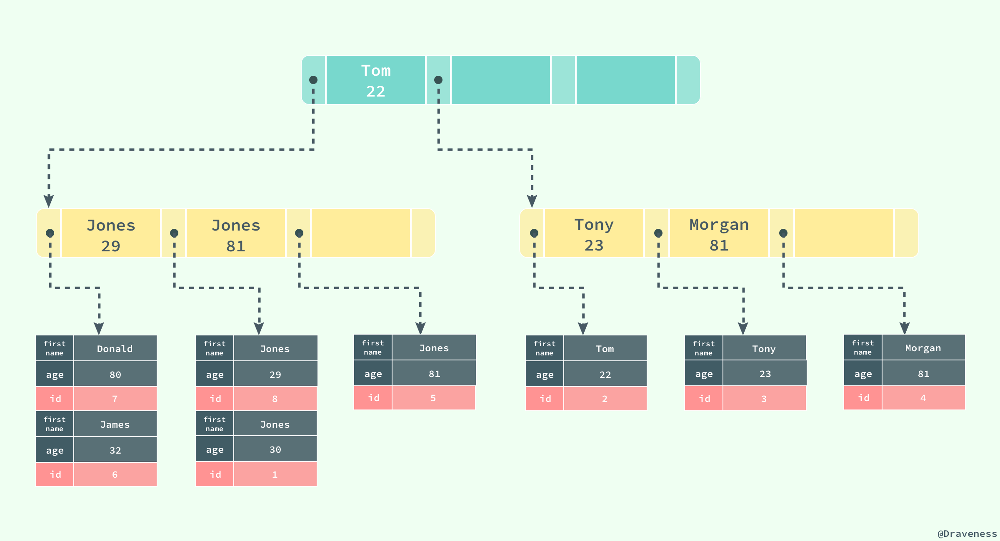

### InnoDB 索引

##### 数据存储

​	当 InnoDB 存储数据时，它可以使用不同的行格式进行存储；MySQL 5.7 版本支持以下格式的行存储方式：


> `Antelope` 是 InnoDB 最开始支持的文件格式，它包含两种行格式 `Compact` 和 `Redundant` ，它最开始并没有名字； `Antelope` 的名字是在新的文件格式 `Barracuda` 出现后才起的， `Barracuda` 的出现引入了两种新的行格式 `Compressed` 和 `Dynamic` ；InnoDB 对于文件格式都会向前兼容，而官方文档中也对之后会出现的新文件格式预先定义好了名字：Cheetah、Dragon、Elk 等等。

​	两种行记录格式 `Compact` 和 `Redundant` 在磁盘上按照以下方式存储：


`Compact` 和 `Redundant` 格式最大的不同就是记录格式的第一个部分；在 `Compact` 中，行记录的第一部分倒序存放了一行数据中列的长度（Length），而 `Redundant` 中存的是每一列的偏移量（Offset），从总体上上看， `Compact` 行记录格式相比 `Redundant` 格式能够减少 `20%` 的存储空间。

##### 行溢出数据

​	当 InnoDB 使用 `Compact` 或者 `Redundant` 格式存储极长的 `VARCHAR` 或者 `BLOB` 这类大对象时，我们并不会直接将所有的内容都存放在数据页节点中，而是将数据中的前 `768` 个字节存储在数据页中，后面会通过偏移量指向溢出页（off-page），最大768字节的作用是便于创建 **前缀索引**。溢出页（off-page）不存储在 B+tree 中，**使用的是uncompress BLOB page，并且每个字段的溢出都是存储独享**。


​	但是当我们使用新的行记录格式 `Compressed` 或者 `Dynamic` 时都只会在行记录中保存 `20` 个字节的指针，实际的数据都会存放在溢出页面中。


​	当然在实际存储中，可能会对不同长度的 TEXT 和 BLOB 列进行优化。

> 想要了解更多与 InnoDB 存储引擎中记录的数据格式的相关信息，可以阅读 [InnoDB Record Structure](https://dev.mysql.com/doc/internals/en/innodb-record-structure.html)

##### 数据页结构

​	与现有的大多数存储引擎一样，InnoDB 使用页作为磁盘管理的最小单位；数据在 InnoDB 存储引擎中都是按行存储的，每个 `16KB` 大小的页中可以存放 `2-200` 行的记录。

​	页是 InnoDB 存储引擎管理数据的最小磁盘单位，而 `B-Tree` 节点就是实际存放表中数据的页面，我们在这里将要介绍页是如何组织和存储记录的；首先，一个 InnoDB 页有以下七个部分：


​	每一个页中包含了两对 `header/trailer`：内部的 `Page Header/Page Directory` 关心的是页的状态信息，而 `Fil Header/Fil Trailer` 关心的是记录页的头信息。

​	在页的头部和尾部之间就是用户记录和空闲空间了，每一个数据页中都包含 `Infimum` 和 `Supremum` 这两个虚拟的记录（可以理解为占位符）， `Infimum` 记录是比该页中任何主键值都要小的值， `Supremum` 是该页中的最大值：


​	`User Records` 就是整个页面中真正用于存放行记录的部分，而 `Free Space` 就是空余空间了，它是一个链表的数据结构，为了保证插入和删除的效率，整个页面并不会按照主键顺序对所有记录进行排序，它会自动从左侧向右寻找空白节点进行插入，行记录在物理存储上并不是按照顺序的，它们之间的顺序是由 `next_record` 这一指针控制的。

​	`B+` 树在查找对应的记录时，并不会直接从树中找出对应的行记录，它只能获取记录所在的页，将整个页加载到内存中，再通过 `Page Directory` 中存储的稀疏索引和 `n_owned、next_record` 属性取出对应的记录，不过因为这一操作是在内存中进行的，所以通常会忽略这部分查找的耗时。这样就存在一个命中率的问题，如果一个page中能够相对的存放足够多的行，那么命中率就会相对高一些，性能就会有提升。

​	B+树底层的叶子节点为一双向链表，因此 **每个页中至少应该有两行记录**，这就决定了 InnoDB 在存储一行数据的时候不能够超过 `8kb`，但事实上应该更小，因为还有一些 InnoDB 内部数据结构要存储。

​	通常我们认为 `blob` 这类的大对象的存储会把数据存放在 off-page，其实不然，**关键点还是要看一个 page 中到底能否存放两行数据，blob 可以完全存放在数据页中(单行长度没有超过 `8kb`)，而 `varchar` 类型的也有可能存放在溢出页中(单行长度超过 `8kb`，前 `768byte` 存放在数据页中)**。

### 索引

​	索引是数据库中非常非常重要的概念，它是存储引擎能够快速定位记录的秘密武器，对于提升数据库的性能、减轻数据库服务器的负担有着非常重要的作用；**索引优化是对查询性能优化的最有效手段**，它能够轻松地将查询的性能提高几个数量级。

​	InnoDB 存储引擎在绝大多数情况下使用 B+ 树建立索引，这是关系型数据库中查找最为常用和有效的索引，但是 **B+ 树索引并不能找到一个给定键对应的具体值，它只能找到数据行对应的页**，然后正如上一节所提到的，数据库把整个页读入到内存中，并在内存中查找具体的数据行。


​	B+ 树是平衡树，它查找任意节点所耗费的时间都是完全相同的，比较的次数就是 B+ 树的高度；

> `B+` 树的叶子节点存放所有指向关键字的指针，节点内部关键字记录和节点之间都根据关键字的大小排列。当顺序递增插入的时候，只有最后一个节点会在满掉的时候引起索引分裂，此时无需移动记录，只需创建一个新的节点即可。而当非递增插入的时候，会使得旧的节点分裂，还可能伴随移动记录，以便使得新数据能够插入其中。**一般建议使用一列顺序递增的 ID 来作为主键**，但不必是数据库的 `autoincrement` 字段，只要满足顺序增加即可，如 `twitter` 的 `snowflake` 即为顺序递增的 ID 生成器。

### B+ 树的高度

​	这里我们先假设 B+ 树高为2，即存在一个根节点和若干个叶子节点，那么这棵 B+ 树的存放总记录数为：根节点指针数*单个叶子节点记录行数。这里假设一行记录的大小为1k，那么一个页上的能放 16 行数据。假设主键ID为 bigint 类型，长度为 8 字节，而指针大小在 InnoDB 源码中设置为 6 字节，这样一共14字节，那么可以算出一棵高度为 2 的 B+ 树，能存放 16 \times 1024\div 14\times 16=1872016×1024÷14×16=18720 条这样的数据记录。

​	根据同样的原理我们可以算出一个高度为3的B+树可以存放： 1170\times 1170\times 16=21,902,4001170×1170×16=21,902,400 条这样的记录。所以在 InnoDB 中 B+ 树高度一般为 1~3 层，它就能满足千万级的数据存储。

### 聚集索引

​	InnoDB 存储引擎中的表都是使用索引组织的，也就是按照键的顺序存放；聚集索引就是按照表中主键的顺序构建一颗 B+ 树，并在叶节点中存放表中的行记录数据。

> 如果没有定义主键，则会使用非空的 UNIQUE键 做主键 ; 如果没有非空的 UNIQUE键 ，则系统生成一个6字节的 `rowid` 做主键;

```
CREATE TABLE users(
    id INT NOT NULL,
    first_name VARCHAR(20) NOT NULL,
    last_name VARCHAR(20) NOT NULL,
    age INT NOT NULL,
    PRIMARY KEY(id),
    KEY(last_name, first_name, age)
    KEY(first_name)
);
```

​	如果使用上面的 SQL 在数据库中创建一张表，B+ 树就会使用 id 作为索引的键，并在叶子节点中存储一条记录中的所有信息。

  

> 图中对 B+ 树的描述与真实情况下 B+ 树中的数据结构有一些差别，不过这里想要表达的主要意思是：**聚集索引叶节点中保存的是整条行记录，而不是其中的一部分**。

​	聚集索引与表的物理存储方式有着非常密切的关系，所有正常的表应该 **有且仅有一个** 聚集索引（绝大多数情况下都是主键），表中的所有行记录数据都是按照 **聚集索引** 的顺序存放的。

​	当我们使用聚集索引对表中的数据进行检索时，可以直接获得聚集索引所对应的整条行记录数据所在的页，不需要进行第二次操作。

### 辅助索引

​	数据库将 **所有的非聚集索引都划分为辅助索引**，但是这个概念对我们理解辅助索引并没有什么帮助；辅助索引也是通过 B+ 树实现的，但是它的叶节点并不包含行记录的全部数据，仅包含索引中的所有键和一个用于查找对应行记录的『书签』，在 InnoDB 中这个书签就是当前记录的主键。

​	辅助索引的存在并不会影响聚集索引，因为聚集索引构成的 B+ 树是数据实际存储的形式，而辅助索引只用于加速数据的查找，所以一张表上往往有多个辅助索引以此来提升数据库的性能。

> 一张表一定包含一个聚集索引构成的 B+ 树以及若干辅助索引的构成的 B+ 树。



​	如果在表 `users` 中存在一个辅助索引 (`first_name, age`)，那么它构成的 B+ 树大致就是上图这样，按照 (first_name, age) 的字母顺序对表中的数据进行排序，当查找到主键时，再通过聚集索引获取到整条行记录。


​	上图展示了一个使用辅助索引查找一条表记录的过程：通过辅助索引查找到对应的主键，最后在聚集索引中使用主键获取对应的行记录，这也是通常情况下行记录的查找方式。

### 覆盖索引

​	聚簇索引这种实现方式使得按主键的搜索十分高效，但是辅助索引搜索需要检索两遍索引：首先检索辅助索引获得主键，然后用主键到主索引中检索获得记录，这种行为被称之为 **回表**。回表会导致查询时多次读取磁盘，为减少IO MySQL 在辅助索引上进行优化，将辅助索引作为 **覆盖索引**（Covering index）。在查询的时候，如果 `SELECT` 子句中的字段为主键、辅助索引的键则不进行回表。

### 索引失效

​	索引并不是时时都会生效的，比如以下几种情况，将导致索引失效：

1. 如果条件中有 or，即使其中有条件带索引也不会使用。要想使用or，又想让索引生效，只能将 or 条件中的每个列都加上索引
2. 对于多列索引，不是使用的最左匹配，则不会使用索引。
3. 如果列类型是字符串，那一定要在条件中将数据使用引号引用起来，否则不使用索引。
4. 如果 mysql 估计使用全表扫描要比使用索引快，则不使用索引。例如，使用`<>`、`not in` 、`not` `exist`，对于这三种情况大多数情况下认为结果集很大，MySQL 就有可能不使用索引。

### 索引使用


​	关于 SQL 语句的执行顺序，有三个值得我们注意的地方：

- **FROM 才是 SQL 语句执行的第一步，并非 SELECT**。 数据库在执行 SQL 语句的第一步是将数据从硬盘加载到数据缓冲区中，以便对这些数据进行操作。
- **SELECT 是在大部分语句执行了之后才执行的，严格的说是在 FROM 和 GROUP BY 之后执行的**。理解这一点是非常重要的，这就是你不能在 WHERE 中使用在 SELECT 中设定别名的字段作为判断条件的原因。
- **无论在语法上还是在执行顺序上， UNION 总是排在在 ORDER BY 之前**。很多人认为每个 UNION 段都能使用 ORDER BY 排序，但是根据 SQL 语言标准和各个数据库 SQL 的执行差异来看，这并不是真的。尽管某些数据库允许 SQL 语句对子查询（subqueries）或者派生表（derived tables）进行排序，但是这并不说明这个排序在 UNION 操作过后仍保持排序后的顺序。

虽然SQL的逻辑查询是根据上述进行查询，但是数据库也许并不会完全按照逻辑查询处理的方式来进行查询。 MySQL 数据库有两个组件 `Parser`（分析SQL语句）和 `Optimizer`（优化）。

​	从官方手册上看，可以理解为， `MySQL` 采用了基于开销的优化器，以确定处理查询的最解方式，也就是说执行查询之前，都会先选择一条自以为最优的方案，然后执行这个方案来获取结果。在很多情况下， `MySQL` 能够计算最佳的可能查询计划，但在某些情况下， `MySQL` 没有关于数据的足够信息，或者是提供太多的相关数据信息，估测就不那么友好了。

​	存在索引的情况下，优化器优先使用条件用到索引且最优的方案。**当 SQL 条件有多个索引可以选择， MySQL 优化器将直接使用效率最高的索引执行**。


### MySQL InnoDB存储的文件结构

>  所有数据都被逻辑地存放在一个空间内，称为表空间，而表空间由段（sengment）、区（extent）、页（page）组成。
>
>  
>
>  一、表空间（table space）
>
>  表空间分为了两种，这里简单的概括一下：
>
>  1. 独立表空间：每一个表都将会生成以独立的文件方式来进行存储，每一个表都有一个.frm表描述文件，还有一个.ibd文件。 其中这个文件包括了单独一个表的数据内容以及索引内容，默认情况下它的存储位置也是在表的位置之中。
>
>  2. 共享表空间： Innodb的所有数据保存在一个单独的表空间里面，而这个表空间可以由很多个文件组成，一个表可以跨多个文件存在，所以其大小限制不再是文件大小的限制，而是其自身的限制。从Innodb的官方文档中可以看到，其表空间的最大限制为64TB，也就是说，Innodb的单表限制基本上也在64TB左右了，当然这个大小是包括这个表的所有索引等其他相关数据。
>
>  InnoDB把数据保存在表空间内，表空间可以看作是InnoDB存储引擎逻辑结构的最高层。本质上是一个由一个或多个磁盘文件组成的虚拟文件系统。InnoDB用表空间并不只是存储表和索引，还保存了回滚段、双写缓冲区等。
>
>  二、段（segment）
>
>  表空间是由各个段组成的，常见的段有数据段、索引段、回滚段等。数据即索引。数据段即为B+树段叶子节点（Leaf node segment），索引段即为B+树段非索引节点。
>
>  三、区（extent）
>
>  区是由连续的页（Page）组成的空间，在任何情况下每个区大小都为1MB，为了保证页的连续性，InnoDB存储引擎每次从磁盘一次申请4-5个区。默认情况下，InnoDB存储引擎的页大小为16KB，即一个区中有64个连续的页。 （1MB／16KB=64）
>
>  InnoDB1.0.x版本开始引入压缩页，每个页的大小可以通过参数KEY_BLOCK_SIZE设置为2K、4K、8K，因此每个区对应的页尾512、256、128.
>
>  InnpDB1.2.x版本新增了参数innodb_page_size，通过该参数可以将默认页的大小设置为4K、8K，但是页中的数据不是压缩的。
>
>  但是有时候为了节约磁盘容量的开销，创建表默认大小是96KB，区中是64个连续的页。（对于一些小表）
>
>  四、页（Page）
>
>  页是InnoDB存储引擎磁盘管理的最小单位，每个页默认16KB；InnoDB存储引擎从1.2.x版本碍事，可以通过参数innodb_page_size将页的大小设置为4K、8K、16K。若设置完成，则所有表中页的大小都为innodb_page_size，不可以再次对其进行修改，除非通过mysqldump导入和导出操作来产生新的库。
>
>  innoDB 存储引擎中，常见的页类型有：
>
>  1. 数据页（B-tree Node)
>
>  2. undo页（undo Log Page）
>
>  3. 系统页 （System Page）
>
>  4. 事物数据页 （Transaction System Page）
>
>  5. 插入缓冲位图页（Insert Buffer Bitmap）
>
>  6. 插入缓冲空闲列表页（Insert Buffer Free List）
>
>  7. 未压缩的二进制大对象页（Uncompressed BLOB Page）
>
>  8. 压缩的二进制大对象页 （compressed BLOB Page）
>
>  五、行（row）
>
>  InnoDB存储引擎是面向列的（row-oriented)，也就是说数据是按行进行存放的，每个页存放的行记录也是有硬性定义的，最多允许存放16KB/2-200，即7992行记录。

### 索引树是如何维护的？

>  在mysql innoDB引擎中 B+树索引可分为聚集索引（clustered index）和辅助索引（secondary index）。不管是辅助索引还是聚集索引，其在数据库内部都是B+树。聚集索引与辅助索引不同的是聚集索引在叶子节点存放着记录一整行的信息。 

### 为什么Mysql用B+树做索引而不用B-树或红黑树

> ​	一般来说，索引本身也很大，不可能全部存储在内存中，因此索引往往以索引文件的形式存储的磁盘上。这样的话，索引查找过程中就要产生磁盘I/O消耗，相对于内存存取，I/O存取的消耗要高几个数量级，所以评价一个数据结构作为索引的优劣最重要的指标就是在查找过程中磁盘I/O操作次数的渐进复杂度。换句话说，索引的结构组织要尽量减少查找过程中磁盘I/O的存取次数。
>
> ​	B+树只有叶节点存放数据，其余节点用来索引，而B-树是每个索引节点都会有Data域，磁盘IO一次读出的数据量大小是固定的，单个数据变大，每次读出的就少。**由于B+Tree内节点去掉了data域，因此可以拥有更大的出度，从而拥有更好的性能。**
>
> ​	**另一个优点是：** B+树所有的Data域在叶子节点，一般来说都会进行一个优化，就是**将所有的叶子节点用指针串起来**。这样遍历叶子节点就能获得全部数据，这样就能进行区间访问啦。在数据库中基于范围的查询是非常频繁的，而B树不支持这样的遍历操作。
>
> ​	根据**磁盘查找存取的次数往往由树的高度所决定**，所以，只要我们通过某种较好的树结构减少树的结构尽量减少树的高度，B树可以有多个子女，从几十到上千，可以降低树的高度。在大规模数据存储的时候，红黑树往往出现由于**树的深度过大**而造成磁盘IO读写过于频繁，进而导致效率低下的情况，所以不选用红黑树。 

### 索引失效场景

> 1.查询条件包含or
>
> 2.联合索引，不是使用第一列索引(不满足最左原则)，索引失效
>
> 3.like 以%开头
>
> 4.对索引列进行函数运算 
>
> 5.当全表扫描速度比索引速度快时，mysql会使用全表扫描，此时索引失效

### 最左原则

> 联合索引(A,B,C) ，等同于 (A),(A,B),(A,B,C)

### 查看执行计划

>  使用explain关键字可以模拟优化器执行SQL查询语句：
>
>  ​	type字段，sql查询优化中一个很重要的指标，结果值从好到坏依次是：**system** > **const** > **eq_ref** > **ref** > fulltext > ref_or_null > index_merge > unique_subquery > index_subquery > **range** > **index** > **ALL**


为什么要使用索引

  因为使用索引可以避免全表扫描去查找数据，提升检索效率。

 

什么样的信息能成为索引

  主键、唯一键（使数据具备一定的区分性的字段）都能成为索引。

 

索引的数据结构

  主流的是B+树，hash、BitMap等。

  mysql 不支持BitMap 索引，且不显式支持hash索引。

 

如何定位并优化慢查询sql

  1.根据慢日志定位慢查询sql

  2.使用explain等工具分析sql

3. 修改sql或者尽量让sql走索引

 

索引是建立的越多越好吗？

  数据量小的表不需要建立索引，建立索引会增加额外的索引开销

  数据变更需要维护索引，因此更多的索引意味着更多的维护成本（B+树的 分裂与合并操作）

  更多的索引也意味着需要更多的空间去进行存储。