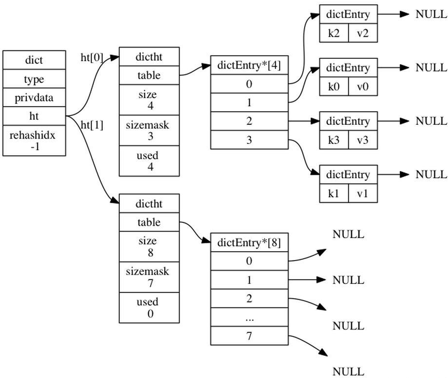
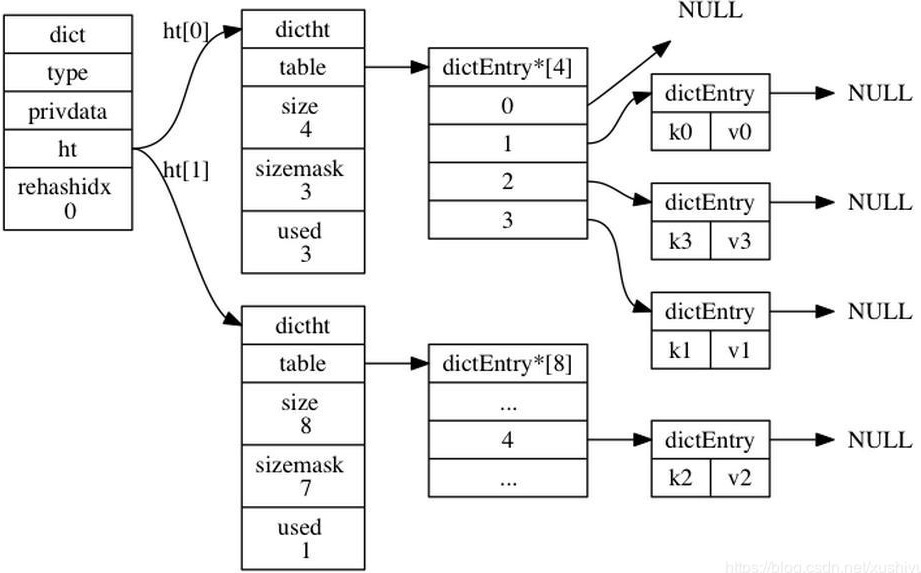
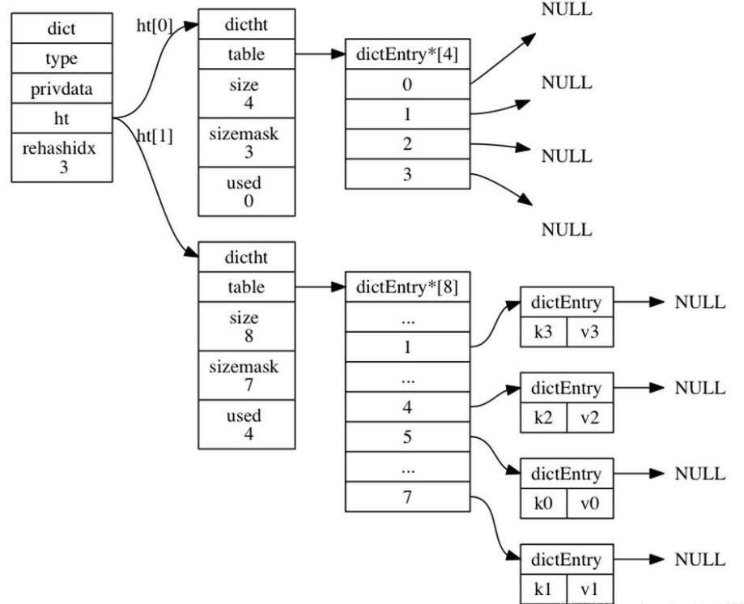
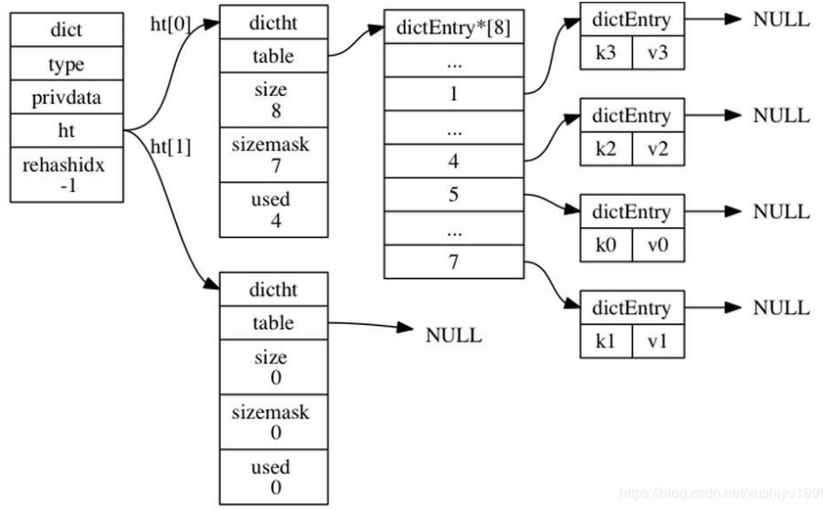

### 为什么要有渐进式哈希

  我们知道当hash表满员时（或负载因子高于阈值时）会进行rehash,也就是重新调整空间大小，并拷贝原来的数据。

  这里rehash就是优化效率的关键。

  例如假设有1w个元素，rehash时要拷贝1w元素到新的空间，这样势必会成为很大的负担。

### 简介

  redis的数据库使用字典来作为底层实现的，对数据库的增删查改操作也是构建在对字典的操作之上。redis的字典使用hash表作为底层实现。

  redis作为一个广泛使用的内存数据库，时间和空间效率都是至关重要的。（redis 的 hash 根本就是一个大的hashmap，所以对hashmap的优化十分重视）

  redis采用渐进式rehash来解决这个问题。

  何为渐进式rehash？就是把拷贝节点数据的过程平摊到后续的操作中，而不是一次性拷贝。

  所谓平摊到后续的操作中，就是对节点操作，例如再次插入，查找，删除，修改时都会进行拷贝。

### 原理

#### 数据结构

  要想实现这个过程，一个hash结构必须要有以下字段：

  两个hash表。一个表拷贝到另一个表的容器

  一个标识rehashidx来表明是否在进行rehash中。如果是，那么对节点的操作启动rehash过程。

#### Rehash何时开始

  何时启动rehash？当hash结构的第一个hash表ht[0]达到扩容条件就可以启动了。此时重新调整并分配新的空间，将hash结构的第二个hash表ht[1]指向这个空间。

#### Rehash过程

> 1 通过rehashidx索引找到要搬移节点的位置，如果是空，则向后跳
> 2 计算要搬移节点的hash值，得出要插入到新hash表的位置
> 3 写入到新节点中，如果节点是链式的，则还要搬移后面所有在链表中的节点
> 4 更新hash表计数

#### Rehash结束

  由于只有两个hash表容器（也只要两个hash表容器就够了），如果ht[1]需要rehash时再搬移到ht[0]吗？这样是没有问题的，但是显得有点混乱，因为搞不清楚哪个容器是要搬移的。巧妙的做法是搬移完成之后，让ht[0]指向新的hash容器。这样ht[0]永远是那个要被搬移的对象，dt[1]是搬移过程中的中转。

#### Rehash详细步骤

> 为 ht[1] 分配空间， 让字典同时持有 ht[0] 和 ht[1] 两个哈希表。
>
> 在字典中维持一个索引计数器变量 rehashidx ， 并将它的值设置为 0 ， 表示 rehash 工作正式开始。
>
> 在 rehash 进行期间， 每次对字典执行添加、删除、查找或者更新操作时， 程序除了执行指定的操作以外， 还会顺带将 ht[0] 哈希表在 rehashidx 索引上的所有键值对 rehash 到 ht[1] ， 当 rehash 工作完成之后， 程序将 rehashidx 属性的值增一。
>
> 随着字典操作的不断执行， 最终在某个时间点上， ht[0] 的所有键值对都会被 rehash 至 ht[1] ， 这时程序将 rehashidx 属性的值设为 -1， 表示 rehash 操作已完成。
>
> Rehash过程中的查找，新增需要注意的是因为在渐进式rehash的过程中，字典同时会使用ht[0],ht[1]两个hash表。
>
> 所以在这个过程中，删除，查找，更新等操作会在这两个hash表上进行。
>
> 例如要在字典里查找一个key的话，会先在ht[0]里面进行查找，如果没有找到的话，就会继续到ht[1]里面进行查找。
>
> 另外，在渐进式rehash执行期间，新添加到字典的key-val一律会被保存到ht[1]里面，而ht[0]不再进行任何添加操作，这一措施保证了ht[0]包含的key-val对数量只增不减，并随着rehash操作的执行而最终变成空表。
>  

### 图解

  **准备开始rehash**

  可以看到ht0，是之前的hash表，等待被扩容，size=4，ht1，是之后的hash表，是扩容后的表，size=8。此时rehashidx= -1

  **rehash过程中**

  可以看到ht0 索引为0的数据跑到ht1 索引为4的地方，rehashid++，ht0 used-- ， ht1 used++

  最后一次移动，将索引3 的放到ht1 索引7 上，此时可以看到rehashidx=3，ht0的used=0，ht1 的used=4，ht0 的table的数据项全为null

  **rehash结束**

  可以看到ht0 的指针指向了之前的ht1 ，ht1的指针指向了一个全为null和0的表