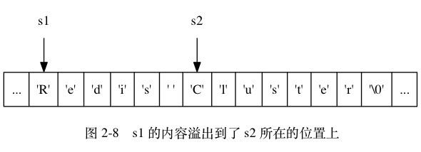

## 数据结构

Redis的外围由一个键、值映射的字典构成。与其他非关系型数据库主要不同在于：Redis中值的类型不仅限于 **字符串**，还支持如下抽象数据类型：

- **List**：字符串列表
- **Set**：无序不重复的字符串集合
- **Soret Set**：有序不重复的字符串集合
- **HashTable**：键、值都为字符串的哈希表

值的类型决定了值本身支持的操作。Redis支持不同无序、有序的列表，无序、有序的集合间的交集、并集等高级服务器端原子操作。

### string

Redis 没有直接使用 C 语言传统的字符串表示（以空字符结尾的字符数组，以下简称 C 字符串）， 而是自己构建了一种名为简单动态字符串（simple dynamic string，SDS）的抽象类型， 并将 SDS 用作 Redis 的默认字符串表示。

在 Redis 里面， C 字符串只会作为字符串字面量（string literal）， 用在一些无须对字符串值进行修改的地方， 比如打印日志。

当 Redis 需要的不仅仅是一个字符串字面量， 而是一个可以被修改的字符串值时， Redis 就会使用 SDS 来表示字符串值： 比如在 Redis 的数据库里面， 包含字符串值的键值对在底层都是由 SDS 实现的。

| C字符串                                          | SDS                                              |
| ------------------------------------------------ | ------------------------------------------------ |
| 获取字符串长度的复杂度为 O(N) 。                 | 获取字符串长度的复杂度为 O(1) 。                 |
| API 是不安全的，可能会造成缓冲区溢出。           | API 是安全的，不会造成缓冲区溢出。               |
| 修改字符串长度 N 次必然需要执行 N 次内存重分配。 | 修改字符串长度 N 次最多需要执行 N 次内存重分配。 |
| 只能保存文本数据。                               | 可以保存文本或者二进制数据。                     |
| 可以使用所有 <string.h> 库中的函数。             | 可以使用一部分 <string.h> 库中的函数。           |

#### 缓冲区溢出

因为 C 字符串不记录自身的长度， 所以 `strcat` 假定用户在执行这个函数时， 已经为 `dest` 分配了足够多的内存， 可以容纳 `src` 字符串中的所有内容， 而一旦这个假定不成立时， 就会产生缓冲区溢出。

举个例子， 假设程序里有两个在内存中紧邻着的 C 字符串 `s1` 和 `s2` ， 其中 s1 保存了字符串 `"Redis"` ， 而 s2 则保存了字符串 `"MongoDB"` ， 如图所示。


如果一个程序员决定通过执行：

```
strcat(s1, " Cluster");
```

将 `s1` 的内容修改为 `"Redis Cluster"` ， 但粗心的他却忘了在执行 `strcat` 之前为 `s1` 分配足够的空间， 那么在 `strcat` 函数执行之后， `s1` 的数据将溢出到 `s2` 所在的空间中， 导致 `s2` 保存的内容被意外地修改， 如图所示。



与 `C` 字符串不同， `SDS` 的空间分配策略完全杜绝了发生缓冲区溢出的可能性： **当 SDS API 需要对 SDS 进行修改时， API 会先检查 SDS 的空间是否满足修改所需的要求**， 如果不满足的话， API 会自动将 `SDS` 的空间扩展至执行修改所需的大小， 然后才执行实际的修改操作， 所以使用 `SDS` 既不需要手动修改 `SDS` 的空间大小， 也不会出现前面所说的缓冲区溢出问题。

#### 减少修改字符串时带来的内存重分配次数

- 空间预分配：解决 append 问题
- 惰性空间释放：解决 strim 问题

#### 二进制安全

C 字符串中的字符必须符合某种编码（比如 `ASCII`）， 并且 **除了字符串的末尾之外， 字符串里面不能包含空字符**， 否则最先被程序读入的空字符将被误认为是字符串结尾 —— 这些限制使得 C 字符串只能保存文本数据， 而不能保存像图片、音频、视频、压缩文件这样的二进制数据。

### zset底层实现

**跳跃表（skiplist）** 是一种有序数据结构， 它通过在每个节点中维持多个指向其他节点的指针， 从而达到快速访问节点的目的。

`Redis` 使用跳跃表作为有序集合键的底层实现之一：

- 如果一个有序集合包含的元素数量比较多，
- 有序集合中元素的成员（`member`）是比较长的字符串时

Redis 就会使用跳跃表来作为有序集合键的底层实现。

和链表、字典等数据结构被广泛地应用在 Redis 内部不同， **Redis 只在两个地方用到了跳跃表， 一个是实现有序集合键， 另一个是在集群节点中用作内部数据结构**， 除此之外， 跳跃表在 Redis 里面没有其他用途。

### BitMap 实现

Bitmaps 并不是实际的数据类型，而是定义在 String 类型上的一个面向字节操作的集合。因为字符串是二进制安全的，最大长度是 512M ，所以最长拥有 2^32232 个不同字节。

Redis 提供以下 BitMap 操作接口：`setBit`、`getBit`、`bitCount`、`bitop`、`bitpos`。其中 `setBit`、`getBit`都是 O(1)*O*(1) 复杂度的操作。

优势：

1. 基于最小的单位bit进行存储，所以非常省空间。
2. 设置时候时间复杂度O(1)、读取时候时间复杂度O(n)，操作是非常快的。
3. 二进制数据的存储，进行相关计算的时候非常快。
4. 方便扩容

限制：Redis中bit映射被限制在512MB之内，所以最大是 2^32232 位。