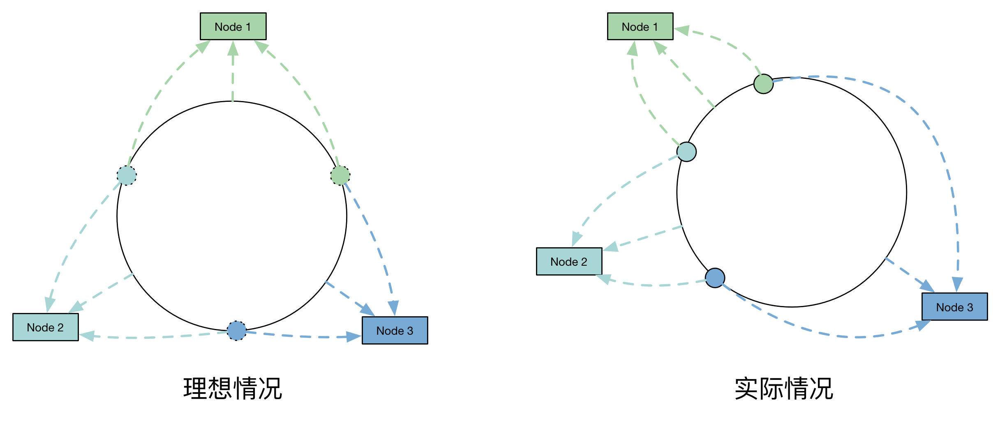
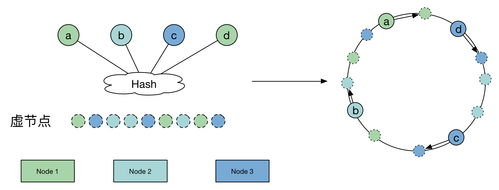

- ## 一致性哈希算法

  一致哈希 是一种特殊的哈希算法。在使用一致哈希算法后，哈希表槽位数（大小）的改变平均只需要对 `K/n` 个关键字重新映射，其中 `K` 是关键字的数量，`n` 是槽位数量。然而在传统的哈希表中，添加或删除一个槽位的几乎需要对所有关键字进行重新映射。

  > 一致哈希也可用于实现健壮缓存来减少大型 Web 应用中系统部分失效带来的负面影响

  ### 需求

  在使用 `n` 台缓存服务器时，一种常用的负载均衡方式是，对资源 `o` 的请求使用 `hash(o)= o mod n` 来映射到某一台缓存服务器。当增加或减少一台缓存服务器时这种方式可能会改变所有资源对应的 `hash` 值，也就是所有的缓存都失效了，这会使得缓存服务器大量集中地向原始内容服务器更新缓存。

  因此需要一致哈希算法来避免这样的问题。 一致哈希尽可能使同一个资源映射到同一台缓存服务器。这种方式要求增加一台缓存服务器时，新的服务器尽量分担存储其他所有服务器的缓存资源。减少一台缓存服务器时，其他所有服务器也可以尽量分担存储它的缓存资源。

  一致哈希算法的主要思想是将每个缓存服务器与一个或多个哈希值域区间关联起来，其中区间边界通过计算缓存服务器对应的哈希值来决定。如果一个缓存服务器被移除，则它所对应的区间会被并入到邻近的区间，其他的缓存服务器不需要任何改变。

  

  场景

  ​	1.负载均衡：将请求分散到多个服务器，mysql ,dubbo

  ​	2.用于缓存与缓存服务器的映射关系维护，redis

  

  ### 实现

  一致哈希将每个对象映射到圆环边上的一个点，系统再将可用的节点机器映射到圆环的不同位置。查找某个对象对应的机器时，需要用一致哈希算法计算得到对象对应圆环边上位置，沿着圆环边上查找直到遇到某个节点机器，这台机器即为对象应该保存的位置。

  当删除一台节点机器时，这台机器上保存的所有对象都要移动到下一台机器。添加一台机器到圆环边上某个点时，这个点的下一台机器需要将这个节点前对应的对象移动到新机器上。更改对象在节点机器上的分布可以通过调整节点机器的位置来实现。
  
  ## [实践](https://yikun.github.io/2016/06/09/一致性哈希算法的理解与实践/)
  
  > 假设有1000w个数据项，100个存储节点，请设计一种算法合理地将他们存储在这些节点上。
  
  看一看普通Hash算法的原理：
  

  
```
  for item in range(ITEMS):
    k = md5(str(item)).digest()
      h = unpack_from(">I", k)[0]
    # 通过取余的方式进行映射
      n = h % NODES
    node_stat[n] += 1
  ```

  普通的Hash算法均匀地将这些数据项打散到了这些节点上，并且分布最少和最多的存储节点数据项数目小于 `1%`。之所以分布均匀，主要是依赖 Hash 算法（实现使用的MD5算法）能够比较随机的分布。

  然而，我们看看存在一个问题，由于 **该算法使用节点数取余的方法，强依赖 `node` 的数目**，因此，当是 `node` 数发生变化的时候，`item` 所对应的 `node` 发生剧烈变化，而发生变化的成本就是我们需要在 `node` 数发生变化的时候，数据需要迁移，这对存储产品来说显然是不能忍的。
  
  #### 一致性哈希
  
  普通 `Hash` 算法的劣势，即当 `node` 数发生变化（增加、移除）后，数据项会被重新“打散”，导致大部分数据项不能落到原来的节点上，从而导致大量数据需要迁移。
  
  那么，一个亟待解决的问题就变成了：当 `node` 数发生变化时，如何保证尽量少引起迁移呢？即当增加或者删除节点时，对于大多数 item ，保证原来分配到的某个 node ，现在仍然应该分配到那个 node ，将数据迁移量的降到最低。
  
  
  
  ```
for n in range(NODES):
      h = _hash(n)
    ring.append(h)
      ring.sort()
    hash2node[h] = n
  for item in range(ITEMS):
    h = _hash(item)
      n = bisect_left(ring, h) % NODES
    node_stat[hash2node[ring[n]]] += 1
  ```

  **虽然一致性Hash算法解决了节点变化导致的数据迁移问题，但是，数据项分布的均匀性很差**。

  
  
  主要是因为这 100 个节点 Hash 后，在环上分布不均匀，导致了每个节点实际占据环上的区间大小不一造成的。
  
  #### 改进 – 虚节点
  
  当我们将 node 进行哈希后，这些值并没有均匀地落在环上，因此，最终会导致，这些节点所管辖的范围并不均匀，最终导致了数据分布的不均匀。
  
  
  
  ```
  for n in range(NODES):
      for v in range(VNODES):
          h = _hash(str(n) + str(v))
          # 构造ring
        ring.append(h)
          # 记录hash所对应节点
          hash2node[h] = n
  ring.sort()
  for item in range(ITEMS):
      h = _hash(str(item))
      # 搜索ring上最近的hash
      n = bisect_left(ring, h) % (NODES*VNODES)
      node_stat[hash2node[ring[n]]] += 1
  ```
  
  通过增加虚节点的方法，使得每个节点在环上所“管辖”更加均匀。这样就既保证了在节点变化时，尽可能小的影响数据分布的变化，而同时又保证了数据分布的均匀。也就是靠增加“节点数量”加强管辖区间的均匀。


**一致性hash**

   构造一个2^32的整数环，即0~(2^32-1)的数字空间，形成一个环，起点为0，终点为2^32-1。

  

  计算机器的ip的hash值，再对 2^32 取模。即：hash(IP) % 2^32，会映射到圆上的一点。

  将存储的key进行hash(key) % 2^32， 它的值在圆上映射的位置开始，顺时针方向找到的第一个机器节点，即为存储该key的机器节点。

  如果 新增/删除 服务器，则对受影响的key 进行重新分配即可。

  **虚拟节点**：解决 数据倾斜 的情况，防止出现大量数据存放在某一个 node 的情形。 

​    此时，将真实节点计算多个哈希形成多个虚拟节点并放置到哈希环上，真实节点不放置到哈希环上，只有虚拟节点才会放上去。 每次根据key得到存储对应的某个虚拟节点，还需要做一次虚拟节点向真实节点的映射处理。

  hash()方法的选用没有特别指明，但是需要保证出现hash碰撞的可能性要尽可能的小。重新计算Hash值的算法有很多，比如CRC32_HASH、FNV1_32_HASH、KETAMA_HASH等，其中KETAMA_HASH是默认的MemCache推荐的一致性Hash算法，用别的Hash算法也可以，比如FNV1_32_HASH算法的计算效率就会高一些。

```
     /**
      * 使用FNV1_32_HASH算法计算服务器的Hash值,这里不使用重写hashCode的方法，最终效果没区别 
      */
     private static int getHash(String str)
     {
         final int p = 16777619;
         int hash = (int)2166136261L;
         for (int i = 0; i < str.length(); i++)
             hash = (hash ^ str.charAt(i)) * p;
         hash += hash << 13;
         hash ^= hash >> 7;
         hash += hash << 3;
         hash ^= hash >> 17;
         hash += hash << 5;
         
         // 如果算出来的值为负数则取其绝对值
         if (hash < 0)
             hash = Math.abs(hash);
         return hash;
     }
```

 

**hash 槽**

   Redis 集群的键空间被分割为 16384 个 hash 槽（slot）， 集群的最大节点数量也是 16384 个 。

  一个 Redis Cluster包含16384（0~16383）个哈希槽，存储在Redis Cluster中的所有键都会被映射到这些slot中。

  所有的master节点都会有一个槽区比如：0～1000，槽数是可以迁移的。 master节点的slave节点不分配槽，**只拥有读权限。**

   key的定位规则：**根据CRC-16(key)%16384的值来判断属于哪个槽区，从而判断该key属于哪个节点** 。CRC16(key) 是用于计算key的 CRC16校验和。

  当前集群有3个节点,槽默认是平均分的：
    节点 A （6381）包含 0 到 5499号哈希槽.
    节点 B （6382）包含5500 到 10999 号哈希槽.
    节点 C （6383）包含11000 到 16383号哈希槽.

​    如果想新添加一个节点D，我需要从节点 A, B, C中得部分槽到D上。

​    如果想移除节点A，需要将A中的槽，移到B和C节点上，然后将没有任何槽的A节点从集群中移除即可。

​    由于从一个节点将哈希槽移动到另一个节点并不会停止服务，所以无论添加删除或者改变某个节点的哈希槽的数量，都不会造成集群不可用的状态。