# 分布式缓存

高并发环境下，例如典型的淘宝双11秒杀，几分钟内上亿的用户涌入淘宝，这个时候如果访问不加拦截，让大量的读写请求涌向数据库，由于磁盘的处理速度与内存显然不在一个量级，服务器马上就要宕机。**从减轻数据库的压力和提高系统响应速度两个角度来考虑，都会在数据库之前加一层缓存**，访问压力越大的，在缓存之前就开始 CDN 拦截图片等访问请求。

并且由于最早的单台机器的内存资源以及承载能力有限，如果大量使用本地缓存，也会使相同的数据被不同的节点存储多份，对内存资源造成较大的浪费，因此，才催生出了分布式缓存。

## 应用场景

1. **页面缓存**：用来缓存Web 页面的内容片段,包括HTML、CSS 和图片等;
2. **应用对象缓存**：缓存系统作为ORM 框架的二级缓存对外提供服务,目的是减轻数据库的负载压力,加速应用访问;解决分布式Web部署的 session 同步问题，状态缓存.缓存包括Session 会话状态及应用横向扩展时的状态数据等,这类数据一般是难以恢复的,对可用性要求较高,多应用于高可用集群。
3. **并行处理**：通常涉及大量中间计算结果需要共享;
4. **云计算领域提供分布式缓存服务**

## 常见问题和挑战

### 缓存雪崩

缓存雪崩我们可以简单的理解为：由于原有缓存失效、新缓存未到之间(**例如：我们设置缓存时采用了相同的过期时间，在同一时刻出现大面积的缓存过期**)，所有原本应该访问缓存的请求都去查询数据库了，而对数据库CPU和内存造成巨大压力，严重的会造成数据库宕机。从而形成一系列连锁反应，造成整个系统崩溃。

### 缓存穿透

缓存穿透是指用户查询数据，在数据库没有，自然在缓存中也不会有。**这样就导致用户查询的时候，在缓存中找不到，每次都要去数据库再查询一遍，然后返回空**（*相当于进行了两次无用的查询*）。这样请求就绕过缓存直接查数据库，这也是经常提的缓存命中率问题。

### 缓存预热

缓存预热这个应该是一个比较常见的概念，相信很多小伙伴都应该可以很容易的理解，缓存预热就是系统上线后，将相关的缓存数据直接加载到缓存系统。这样就可以避免在用户请求的时候，先查询数据库，然后再将数据缓存的问题！用户直接查询事先被预热的缓存数据！

### 缓存更新

除了缓存服务器自带的缓存失效策略之外，我们还可以根据具体的业务需求进行自定义的缓存淘汰，常见的策略有两种：

1. 定时去清理过期的缓存；
2. 当有用户请求过来时，再判断这个请求所用到的缓存是否过期，过期的话就去底层系统得到新数据并更新缓存。

两者各有优劣，第一种的缺点是维护大量缓存的key是比较麻烦的，第二种的缺点就是每次用户请求过来都要判断缓存失效，逻辑相对比较复杂！具体用哪种方案，大家可以根据自己的应用场景来权衡。

### 缓存降级

当访问量剧增、服务出现问题（如响应时间慢或不响应）或非核心服务影响到核心流程的性能时，仍然需要保证服务还是可用的，即使是有损服务。系统可以根据一些关键数据进行自动降级，也可以配置开关实现人工降级。

降级的最终目的是 **保证核心服务可用，即使是有损的**。而且有些服务是无法降级的（如加入购物车、结算）。

在进行降级之前要对系统进行梳理，看看系统是不是可以丢卒保帅；从而梳理出哪些必须誓死保护，哪些可降级；比如可以参考日志级别设置预案：

1. **一般**：比如有些服务偶尔因为网络抖动或者服务正在上线而超时，可以自动降级；
2. **警告**：有些服务在一段时间内成功率有波动（如在95~100%之间），可以自动降级或人工降级，并发送告警；
3. **错误**：比如可用率低于90%，或者数据库连接池被打爆了，或者访问量突然猛增到系统能承受的最大阀值，此时可以根据情况自动降级或者人工降级；
4. **严重错误**：比如因为特殊原因数据错误了，此时需要紧急人工降级。

### 缓存与数据库不一致问题

首先，缓存由于其高并发和高性能的特性，已经在项目中被广泛使用。在读取缓存方面，大家没啥疑问，都是按照下图的流程来进行业务操作。

但是在更新缓存方面，对于更新完数据库，是更新缓存呢，还是删除缓存。又或者是先删除缓存，再更新数据库，其实大家存在很大的争议。

从理论上来说，给 **缓存设置过期时间，是保证最终一致性的解决方案**。这种方案下，我们可以对存入缓存的数据设置过期时间，所有的写操作以数据库为准，对缓存操作只是尽最大努力即可。也就是说如果数据库写成功，缓存更新失败，那么只要到达过期时间，则后面的读请求自然会从数据库中读取新值然后回填缓存。

#### 先删除缓存，再更新数据库

该方案会导致不一致的原因是。同时有一个请求A进行更新操作，另一个请求B进行查询操作。那么会出现如下情形:

1. 请求A进行写操作，删除缓存
2. 请求B查询发现缓存不存在
3. 请求B去数据库查询得到旧值
4. 请求B将旧值写入缓存
5. 请求A将新值写入数据库

上述情况就会导致不一致的情形出现。而且，如果不采用给缓存设置过期时间策略，该数据永远都是脏数据。

可以通过：

1. 更新操作数据库后，再次更新缓存来实现
2. 缓存设置过期时间，等待过期时间后，数据恢复

### 缓存穿透、缓存击穿、缓存雪崩解决方案？

> **缓存穿透：**
>
> 指查询一个一定不存在的数据，如果从存储层查不到数据则不写入缓存，这将导致这个不存在的数据每次请求都要到 DB 去查询，可能导致 DB 挂掉。
>
> **解决方案：**
>
> 1.查询返回的数据为空，仍把这个空结果进行缓存，但过期时间会比较短；
>
> 2.布隆过滤器：将所有可能存在的数据哈希到一个足够大的 bitmap 中，一个一定不存在的数据会被这个 bitmap 拦截掉，从而避免了对 DB 的查询。
>
> **缓存击穿：**
>
> 对于设置了过期时间的 key，缓存在某个时间点过期的时候，恰好这时间点对这个 Key 有大量的并发请求过来，这些请求发现缓存过期一般都会从后端 DB 加载数据并回设到缓存，这个时候大并发的请求可能会瞬间把 DB 压垮。
>
> **解决方案：**
>
> 1.使用互斥锁：当缓存失效时，不立即去 load db，先使用如 Redis 的 setnx 去设置一个互斥锁，当操作成功返回时再进行 load db 的操作并回设缓存，否则重试 get 缓存的方法。
>
> 2.永远不过期：物理不过期，但逻辑过期（后台异步线程去刷新）。
>
> 缓存雪崩：设置缓存时采用了相同的过期时间，导致缓存在某一时刻同时失效，请求全部转发到 DB，DB 瞬时压力过重雪崩。与缓存击穿的区别：雪崩是很多 key，击穿是某一个key 缓存。
>
> 解决方案：将缓存失效时间分散开，比如可以在原有的失效时间基础上增加一个随机值，比如 1-5 分钟随机，这样每一个缓存的过期时间的重复率就会降低，就很难引发集体失效的事件。

###  了解什么是 redis 的雪崩、穿透和击穿？redis 崩溃之后会怎么样？系统该如何应对这种情况？如何处理 redis 的穿透？ 

###### 缓存雪崩

​	对于系统 A，假设每天高峰期每秒 5000 个请求，本来缓存在高峰期可以扛住每秒 4000 个请求，但是缓存机器意外发生了全盘宕机。缓存挂了，此时 1 秒 5000 个请求全部落数据库，数据库必然扛不住，它会报一下警，然后就挂了。此时，如果没有采用什么特别的方案来处理这个故障，DBA 很着急，重启数据库，但是数据库立马又被新的流量给打死了。

​	这就是缓存雪崩。

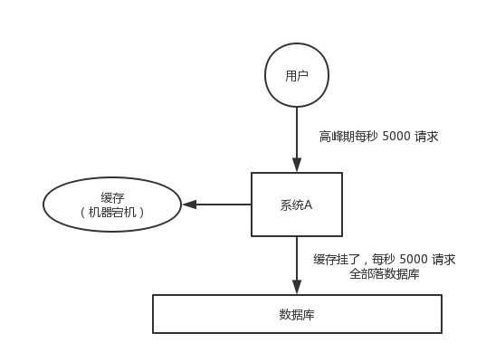

​	大约在 3 年前，国内比较知名的一个互联网公司，曾因为缓存事故，导致雪崩，后台系统全部崩溃，事故从当天下午持续到晚上凌晨 3~4 点，公司损失了几千万。

​	缓存雪崩的事前事中事后的解决方案如下：

- 事前：redis 高可用，主从+哨兵，redis cluster，避免全盘崩溃。
- 事中：本地 ehcache 缓存 + hystrix 限流&降级，避免 MySQL 被打死。
- 事后：redis 持久化，一旦重启，自动从磁盘上加载数据，快速恢复缓存数据。

​	用户发送一个请求，系统 A 收到请求后，先查本地 ehcache 缓存，如果没查到再查 redis。如果 ehcache 和 redis 都没有，再查数据库，将数据库中的结果，写入 ehcache 和 redis 中。

​	限流组件，可以设置每秒的请求，有多少能通过组件，剩余的未通过的请求，怎么办？**走降级**！可以返回一些默认的值，或者友情提示，或者空白的值。

​	好处：

- 数据库绝对不会死，限流组件确保了每秒只有多少个请求能通过。
- 只要数据库不死，就是说，对用户来说，2/5 的请求都是可以被处理的。
- 只要有 2/5 的请求可以被处理，就意味着你的系统没死，对用户来说，可能就是点击几次刷不出来页面，但是多点几次，就可以刷出来一次。

###### 缓存穿透

​	对于系统A，假设一秒 5000 个请求，结果其中 4000 个请求是黑客发出的恶意攻击。

​	黑客发出的那 4000 个攻击，缓存中查不到，每次你去数据库里查，也查不到。

​	举个栗子。数据库 id 是从 1 开始的，结果黑客发过来的请求 id 全部都是负数。这样的话，缓存中不会有，请求每次都“**视缓存于无物**”，直接查询数据库。这种恶意攻击场景的缓存穿透就会直接把数据库给打死。

​	解决方式很简单，每次系统 A 从数据库中只要没查到，就写一个空值到缓存里去，比如 `set -999 UNKNOWN`。然后设置一个过期时间，这样的话，下次有相同的 key 来访问的时候，在缓存失效之前，都可以直接从缓存中取数据。

###### 缓存击穿

​	缓存击穿，就是说某个 key 非常热点，访问非常频繁，处于集中式高并发访问的情况，当这个 key 在失效的瞬间，大量的请求就击穿了缓存，直接请求数据库，就像是在一道屏障上凿开了一个洞。

​	不同场景下的解决方式可如下：

- 若缓存的数据是基本不会发生更新的，则可尝试将该热点数据设置为永不过期。
- 若缓存的数据更新不频繁，且缓存刷新的整个流程耗时较少的情况下，则可以采用基于 redis、zookeeper 等分布式中间件的分布式互斥锁，或者本地互斥锁以保证仅少量的请求能请求数据库并重新构建缓存，其余线程则在锁释放后能访问到新缓存。
- 若缓存的数据更新频繁或者缓存刷新的流程耗时较长的情况下，可以利用定时线程在缓存过期前主动的重新构建缓存或者延后缓存的过期时间，以保证所有的请求能一直访问到对应的缓存。

## 缓存穿透、缓存击穿、缓存雪崩

### 缓存穿透

访问一个不存在的key，缓存不起作用，请求会穿透到 DB，流量大时 DB 会挂掉。

#### 解决方案

- 采用布隆过滤器，使用一个足够大的`bitmap`，用于存储可能访问的 `key`，不存在的key直接被过滤；
- 访问key未在DB查询到值，也将空值写进缓存，但可以设置较短过期时间。

### 缓存雪崩

大量的 key 设置了相同的过期时间，导致在缓存在同一时刻全部失效，造成瞬时DB请求量大、压力骤增，引起雪崩。

#### 解决方案

可以给缓存设置过期时间时加上一个随机值时间，使得每个 key 的过期时间分布开来，不会集中在同一时刻失效。

### 缓存击穿

对于一些设置了过期时间的key，如果这些key可能会在某些时间点被超高并发地访问，是一种非常“热点”的数据。这个时候，需要考虑一个问题：缓存被“击穿”的问题，这个和缓存雪崩的区别在于这里针对某一 key 缓存，前者则是很多key。

缓存在某个时间点过期的时候，恰好在这个时间点对这个Key有大量的并发请求过来，这些请求发现缓存过期一般都会从后端DB加载数据并回设到缓存，这个时候大并发的请求可能会瞬间把后端 DB 压垮。

#### 解决方案

在缓存失效的时候（判断拿出来的值为空），不是立即去 `load db` ，而是先使用缓存工具的某些带成功操作返回值的操作（比如Redis的 `SETNX`）去 `set` 一个 `mutex key` ，当操作返回成功时，再进行 `load db` 的操作并回设缓存；否则，就重试整个 `get` 缓存的方法。

###  如何保证缓存与数据库的双写一致性？ 

​	一般来说，如果允许缓存可以稍微的跟数据库偶尔有不一致的情况，也就是说如果你的系统**不是严格要求** “缓存+数据库” 必须保持一致性的话，最好不要做这个方案，即：**读请求和写请求串行化**，串到一个**内存队列**里去。

​	串行化可以保证一定不会出现不一致的情况，但是它也会导致系统的吞吐量大幅度降低，用比正常情况下多几倍的机器去支撑线上的一个请求。

###### Cache Aside Pattern

​	最经典的缓存+数据库读写的模式，就是 Cache Aside Pattern。

- 读的时候，先读缓存，缓存没有的话，就读数据库，然后取出数据后放入缓存，同时返回响应。
- 更新的时候，**先更新数据库，然后再删除缓存**。

###### [**为什么是删除缓存，而不是更新缓存？**]()

​	原因很简单，很多时候，在复杂点的缓存场景，缓存不单单是数据库中直接取出来的值。

​	比如可能更新了某个表的一个字段，然后其对应的缓存，是需要查询另外两个表的数据并进行运算，才能计算出缓存最新的值的。

​	另外更新缓存的代价有时候是很高的。是不是说，每次修改数据库的时候，都一定要将其对应的缓存更新一份？也许有的场景是这样，但是对于**比较复杂的缓存数据计算的场景**，就不是这样了。如果你频繁修改一个缓存涉及的多个表，缓存也频繁更新。但是问题在于，**这个缓存到底会不会被频繁访问到？**

​	举个栗子，一个缓存涉及的表的字段，在 1 分钟内就修改了 20 次，或者是 100 次，那么缓存更新 20 次、100 次；但是这个缓存在 1 分钟内只被读取了 1 次，有**大量的冷数据**。实际上，如果你只是删除缓存的话，那么在 1 分钟内，这个缓存不过就重新计算一次而已，开销大幅度降低。**用到缓存才去算缓存。**

​	其实删除缓存，而不是更新缓存，就是一个 lazy 计算的思想，不要每次都重新做复杂的计算，不管它会不会用到，而是让它到需要被使用的时候再重新计算。像 mybatis，hibernate，都有懒加载思想。查询一个部门，部门带了一个员工的 list，没有必要说每次查询部门，都把里面的 1000 个员工的数据也同时查出来啊。80% 的情况，查这个部门，就只是要访问这个部门的信息就可以了。先查部门，同时要访问里面的员工，那么这个时候只有在你要访问里面的员工的时候，才会去数据库里面查询 1000 个员工。

###### 最初级的缓存不一致问题及解决方案

​	问题：先更新数据库，再删除缓存。如果删除缓存失败了，那么会导致数据库中是新数据，缓存中是旧数据，数据就出现了不一致。

​	解决思路：先删除缓存，再更新数据库。如果数据库更新失败了，那么数据库中是旧数据，缓存中是空的，那么数据不会不一致。因为读的时候缓存没有，所以去读了数据库中的旧数据，然后更新到缓存中。

###### 比较复杂的数据不一致问题分析

​	数据发生了变更，先删除了缓存，然后要去修改数据库，此时还没修改。一个请求过来，去读缓存，发现缓存空了，去查询数据库，**查到了修改前的旧数据**，放到了缓存中。随后数据变更的程序完成了数据库的修改。完了，数据库和缓存中的数据不一样了...

###### **为什么上亿流量高并发场景下，缓存会出现这个问题？**

​	只有在对一个数据在并发的进行读写的时候，才可能会出现这种问题。其实如果说你的并发量很低的话，特别是读并发很低，每天访问量就 1 万次，那么很少的情况下，会出现刚才描述的那种不一致的场景。但是问题是，如果每天的是上亿的流量，每秒并发读是几万，每秒只要有数据更新的请求，就**可能会出现上述的数据库+缓存不一致的情况**。

###### **解决方案如下：**

​	更新数据的时候，根据**数据的唯一标识**，将操作路由之后，发送到一个 jvm 内部队列中。读取数据的时候，如果发现数据不在缓存中，那么将重新执行“读取数据+更新缓存”的操作，根据唯一标识路由之后，也发送到同一个 jvm 内部队列中。

​	一个队列对应一个工作线程，每个工作线程**串行**拿到对应的操作，然后一条一条的执行。这样的话，一个数据变更的操作，先删除缓存，然后再去更新数据库，但是还没完成更新。此时如果一个读请求过来，没有读到缓存，那么可以先将缓存更新的请求发送到队列中，此时会在队列中积压，然后同步等待缓存更新完成。

​	这里有一个**优化点**，一个队列中，其实**多个更新缓存请求串在一起是没意义的**，因此可以做过滤，如果发现队列中已经有一个更新缓存的请求了，那么就不用再放个更新请求操作进去了，直接等待前面的更新操作请求完成即可。

​	待那个队列对应的工作线程完成了上一个操作的数据库的修改之后，才会去执行下一个操作，也就是缓存更新的操作，此时会从数据库中读取最新的值，然后写入缓存中。

​	如果请求还在等待时间范围内，不断轮询发现可以取到值了，那么就直接返回；如果请求等待的时间超过一定时长，那么这一次直接从数据库中读取当前的旧值。

​	高并发的场景下，该解决方案要注意的问题：

- 读请求长时阻塞

  由于读请求进行了非常轻度的异步化，所以一定要注意读超时的问题，每个读请求必须在超时时间范围内返回。

​	该解决方案，最大的风险点在于说，**可能数据更新很频繁**，导致队列中积压了大量更新操作在里面，然后**读请求会发生大量的超时**，最后导致大量的请求直接走数据库。务必通过一些模拟真实的测试，看看更新数据的频率是怎样的。

​	另外一点，因为一个队列中，可能会积压针对多个数据项的更新操作，因此需要根据自己的业务情况进行测试，可能需要**部署多个服务**，每个服务分摊一些数据的更新操作。如果一个内存队列里居然会挤压 100 个商品的库存修改操作，每个库存修改操作要耗费 10ms 去完成，那么最后一个商品的读请求，可能等待 10 * 100 = 1000ms = 1s 后，才能得到数据，这个时候就导致**读请求的长时阻塞**。

​	一定要做根据实际业务系统的运行情况，去进行一些压力测试，和模拟线上环境，去看看最繁忙的时候，内存队列可能会挤压多少更新操作，可能会导致最后一个更新操作对应的读请求，会 hang 多少时间，如果读请求在 200ms 返回，如果你计算过后，哪怕是最繁忙的时候，积压 10 个更新操作，最多等待 200ms，那还可以的。

​	**如果一个内存队列中可能积压的更新操作特别多**，那么你就要**加机器**，让每个机器上部署的服务实例处理更少的数据，那么每个内存队列中积压的更新操作就会越少。

​	其实根据之前的项目经验，一般来说，数据的写频率是很低的，因此实际上正常来说，在队列中积压的更新操作应该是很少的。像这种针对读高并发、读缓存架构的项目，一般来说写请求是非常少的，每秒的 QPS 能到几百就不错了。

​	我们来**实际粗略测算一下**。

​	如果一秒有 500 的写操作，如果分成 5 个时间片，每 200ms 就 100 个写操作，放到 20 个内存队列中，每个内存队列，可能就积压 5 个写操作。每个写操作性能测试后，一般是在 20ms 左右就完成，那么针对每个内存队列的数据的读请求，也就最多 hang 一会儿，200ms 以内肯定能返回了。

​	经过刚才简单的测算，我们知道，单机支撑的写 QPS 在几百是没问题的，如果写 QPS 扩大了 10 倍，那么就扩容机器，扩容 10 倍的机器，每个机器 20 个队列。

- 读请求并发量过高

  这里还必须做好压力测试，确保恰巧碰上上述情况的时候，还有一个风险，就是突然间大量读请求会在几十毫秒的延时 hang 在服务上，看服务能不能扛的住，需要多少机器才能扛住最大的极限情况的峰值。

  但是因为并不是所有的数据都在同一时间更新，缓存也不会同一时间失效，所以每次可能也就是少数数据的缓存失效了，然后那些数据对应的读请求过来，并发量应该也不会特别大。

- 多服务实例部署的请求路由

  可能这个服务部署了多个实例，那么必须**保证**说，执行数据更新操作，以及执行缓存更新操作的请求，都通过 Nginx 服务器**路由到相同的服务实例上**。

  比如说，对同一个商品的读写请求，全部路由到同一台机器上。可以自己去做服务间的按照某个请求参数的 hash 路由，也可以用 Nginx 的 hash 路由功能等等。

- 热点商品的路由问题，导致请求的倾斜

  万一某个商品的读写请求特别高，全部打到相同的机器的相同的队列里面去了，可能会造成某台机器的压力过大。就是说，因为只有在商品数据更新的时候才会清空缓存，然后才会导致读写并发，所以其实要根据业务系统去看，如果更新频率不是太高的话，这个问题的影响并不是特别大，但是的确可能某些机器的负载会高一些。

### **缓存穿透：**

  缓存和数据库中都没有的数据，而用户不断发起请求，如发起为id为“-1”的数据或id为特别大不存在的数据。这时的用户很可能是攻击者，攻击会导致数据库压力过大。

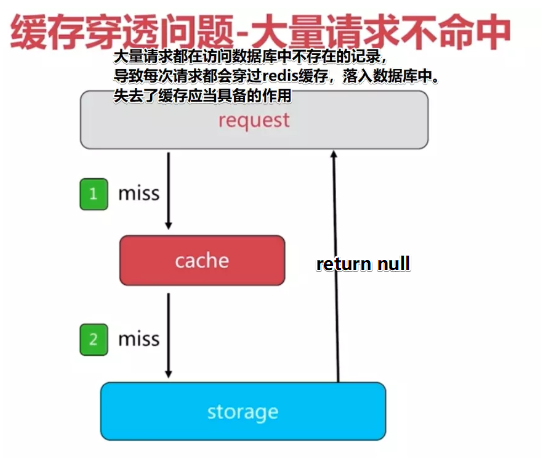

**原因：**

1.业务代码自身问题；

2.恶意攻击、爬虫

 **解决方案：**

  1.从缓存取不到的数据，在数据库中也没有取到，这时也可以将key-value对写为key-null，缓存有效时间可以设置短点，如30秒（设置太长会导致正常情况也没法使用）。这样可以防止攻击用户反复用同一个id暴力攻击

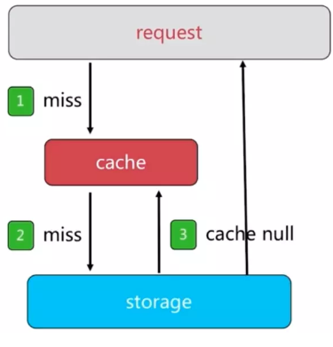

  存在的问题：

  1.需要更多的键（一般通过设置过期时间来解决）

  2.缓存层和存储层数据“短期”不一致

 

2.将数据库中所有的查询条件，放到布隆过滤器中。当一个查询请求来临的时候，先经过布隆过滤器进行检查，如果请求存在这个条件中，那么继续执行，如果不在，直接丢弃。

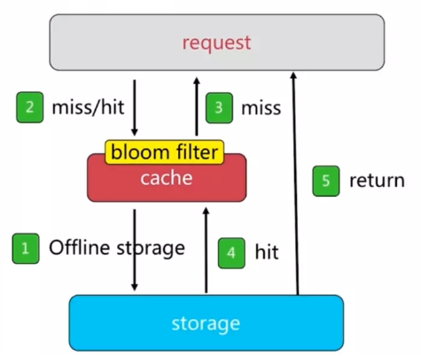

  将所有可能存在的数据哈希到一个足够大的BitSet中，不存在的数据将会被拦截掉，从而避免了对底层存储系统的查询压力。关于布隆过滤器，详情查看：基于BitSet的布隆过滤器(Bloom Filter)

 

 

### **缓存雪崩：**

  如果缓存集中在一段时间内失效，发生大量的缓存穿透，所有的查询都落在数据库上，造成了缓存雪崩。（缓存击穿指并发查同一条数据，缓存雪崩是不同数据都过期了，很多数据都查不到从而查数据库。）

 

  解决方法：

​    1.在缓存失效后，通过加锁或者队列来控制读数据库写缓存的线程数量。比如对某个key只允许一个线程查询数据和写缓存，其他线程等待。

​    2.可以通过缓存reload机制，预先去更新缓存，再即将发生大并发访问前手动触发加载缓存

​    3.不同的key，设置不同的过期时间，让缓存失效的时间点尽量均匀

​    4.做二级缓存，或者双缓存策略。A1为原始缓存，A2为拷贝缓存，A1失效时，可以访问A2，A1缓存失效时间设置为短期，A2设置为长期。

 

 

### **无底洞：**

  加更多的机器，反而性能降低了。

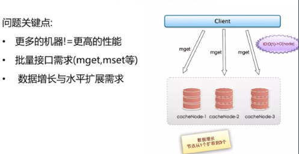

加更多的机器，IO耗费的时间越多。

**优化IO的几个方面：**

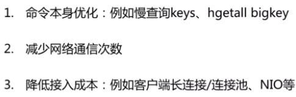

**批量IO优化的四种方法：**

1.串行mget

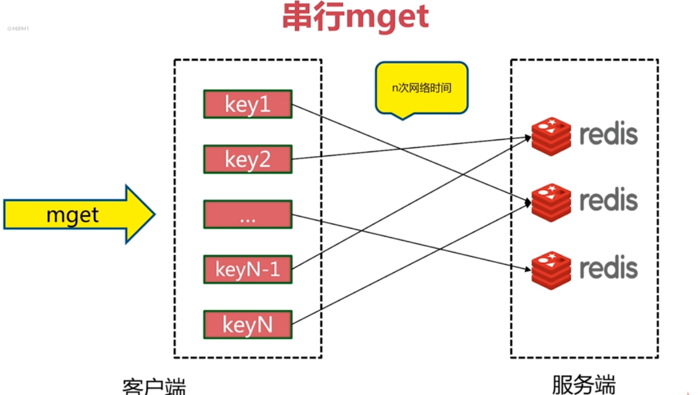

2.串行IO

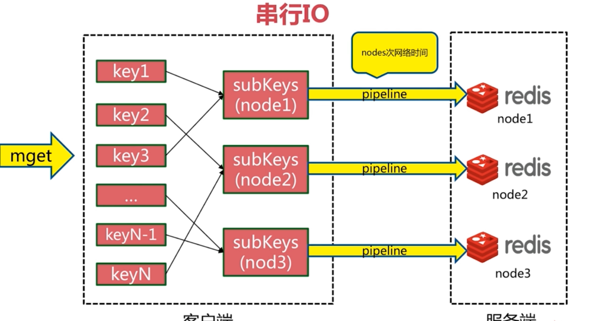

3.并行IO

4.hash_tag

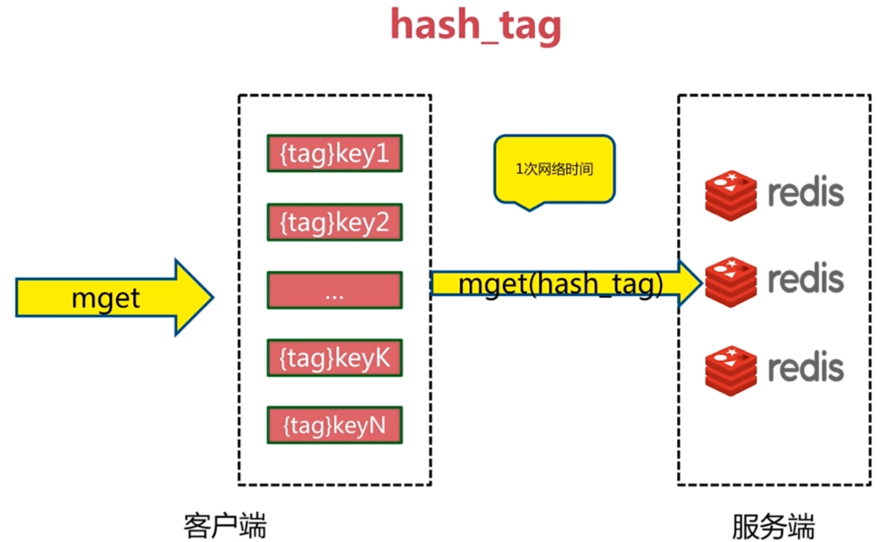

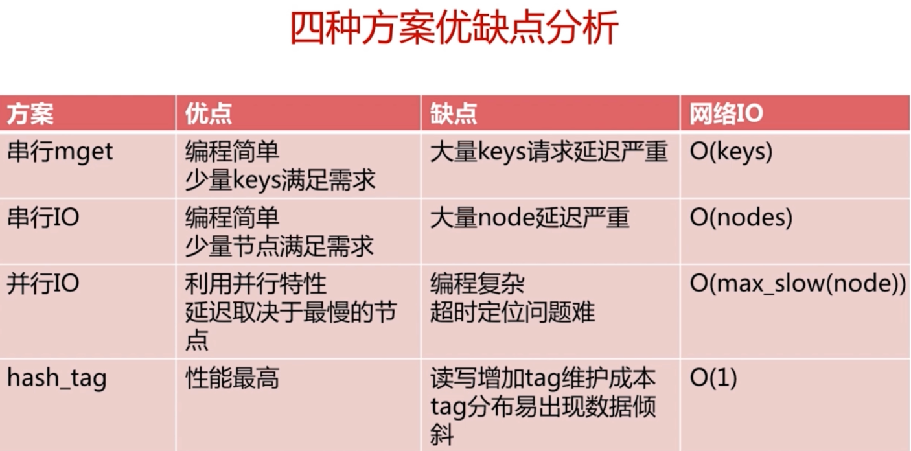

 

 

 

### **热点Key**

  (1) 这个key是一个热点key（例如一个重要的新闻，一个热门的八卦新闻等等），所以这种key访问量可能非常大。

  (2) 缓存的构建是需要一定时间的。（可能是一个复杂计算，例如复杂的sql、多次IO、多个依赖(各种接口)等等）

  于是就会出现一个致命问题：在缓存失效的瞬间，有大量线程来构建缓存，造成后端负载加大，甚至可能会让系统崩溃 。

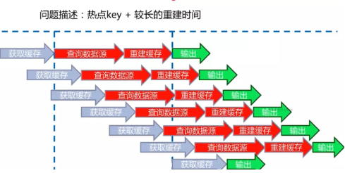

  缓存重建的过程中，其他大量请求再次触发了重建缓存的操作。

 

  **解决问题的思路：**

- 1.减少重缓存的次数
- 2.请求获取的数据尽可能一致
- 3.减少死锁等问题的产生

  可采取 互斥锁和永远不过期来解决。

 

  **使用互斥锁(mutex key):**

  只让一个线程构建缓存，其他线程等待构建缓存的线程执行完，重新从缓存获取数据就可以了。

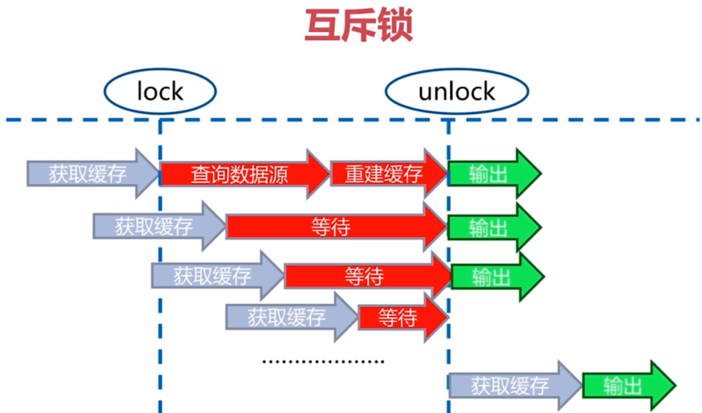

  第一个请求首次获取缓存，将进行加锁，直至重建缓存完成，才会释放锁。

  后续的请求在获取锁失败，则会等待到缓存重建完成为止。

  若某请求发现缓存已存在，则将不会尝试获取锁了。

  存在的问题：会将部分请求阻塞，所以，高并发场景下很少使用。

 

  代码实现：

  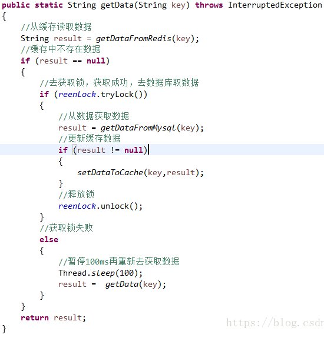

 

  **永远不过期：**

  1.缓存层面：不设置过期时间

  2.功能层面：为每个value添加逻辑过期时间。当超过逻辑过期时间，通过一个后台的异步线程去构建缓存。

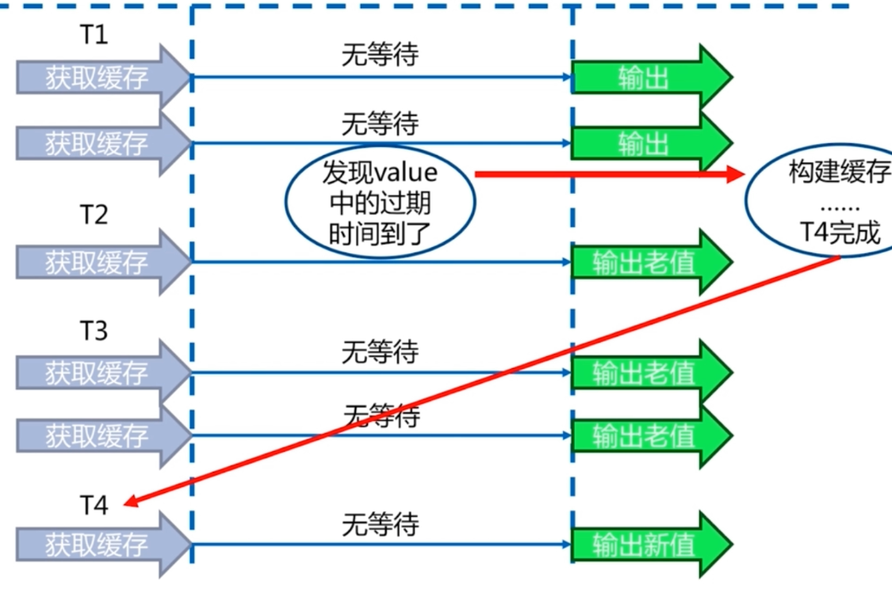

  每一个value都不会设置过期时间，而只是设置一个逻辑过期时间。每次获取缓存时，都会判断是否达到了逻辑过期时间。

  达到过期时间，则该请求将会设置一个互斥锁，并异步重建缓存，自身输出老值。

  其他请求检测到超过逻辑时间，获取锁失败，则直接输出老值。

  当缓存构建完毕，则释放互斥锁。后续请求会输出新值。

 

  代码实现：

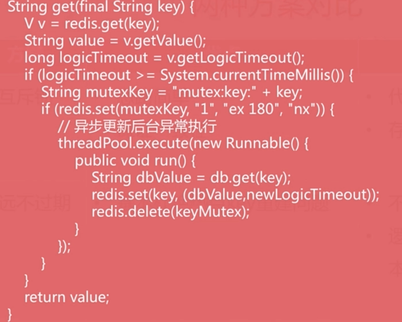

 

  **两种方案的比较：**

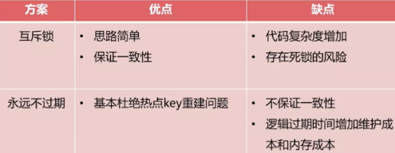

 

 

### **缓存预热**

  系统上线后，将相关的缓存数据直接加载到缓存系统。这样就可以避免在用户请求的时候，先查询数据库，然后再将数据缓存的问题！用户直接查询事先被预热的缓存数据！

 

  解决思路：

  1、直接写个缓存刷新页面，上线时手工操作下；

  2、数据量不大，可以在项目启动的时候自动进行加载；

  3、定时刷新缓存

 

### **缓存更新**

  除了缓存服务器自带的缓存失效策略之外（Redis默认的有6中策略可供选择），我们还可以根据具体的业务需求进行自定义的缓存淘汰，常见的策略有两种：

  （1）定时去清理过期的缓存；

  （2）当有用户请求过来时，再判断这个请求所用到的缓存是否过期，过期的话就去底层系统得到新数据并更新缓存。

  各有优劣，第一种的缺点是维护大量缓存的key是比较麻烦的，第二种的缺点就是每次用户请求过来都要判断缓存失效，逻辑相对比较复杂！

  最简单的是：提供手动清理缓存的接口。具体用哪种方案，大家可以根据自己的应用场景来权衡。

  淘汰算法，可考虑：

-   FIFO算法：First in First out，先进先出。原则：一个数据最先进入缓存中，则应该最早淘汰掉。也就是说，当缓存满的时候，应当把最先进入缓存的数据给淘汰掉。
-   LFU算法：Least Frequently Used，最不经常使用算法。根据使用次数的差异来决定
-   LRU算法：Least Recently Used，近期最少使用算法。根据使用时间的差异来决定

 

### **缓存降级**

  当访问量剧增、服务出现问题（如响应时间慢或不响应）或非核心服务影响到核心流程的性能时，仍然需要保证服务还是可用的，即使是有损服务。

  系统可以根据一些关键数据进行自动降级，也可以配置开关实现人工降级。

  在进行降级之前要对系统进行梳理，梳理出哪些必须誓死保护，哪些可降级：

  1）一般：比如有些服务偶尔因为网络抖动或者服务正在上线而超时，可以自动降级；

  2）警告：有些服务在一段时间内成功率有波动（如在95~100%之间），可以自动降级或人工降级，并发送告警；

  3）错误：比如可用率低于90%，或者数据库连接池被打爆了，或者访问量突然猛增到系统能承受的最大阀值，此时可以根据情况自动降级或者人工降级；

  4）严重错误：比如因为特殊原因数据错误了，此时需要紧急人工降级。