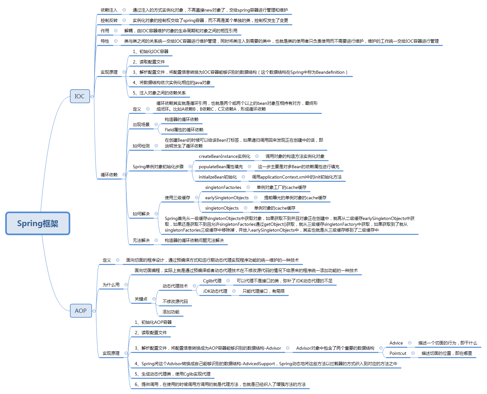

### Spring容器当中包含了哪些常用组件，作用是什么，场景是什么？

### 在Java中依赖注入有哪些方式？

> 1.  构造函数方法注入
> 2.  Setter方法注入
> 3.  接口注入
>
> @Autowired的自动装配，默认是根据类型注入，可以用于构造器、接口、方法注入 
>
> @Resource默认按名称装配，当找不到与名称匹配的bean才会按类型装配。 

###  请解释Spring Bean的生命周期

> 1. 实例化 Instantiation
> 2. 属性赋值 Populate
> 3. 初始化 Initialization
> 4. 销毁 Destruction

### Spring中bean的作用域

> ​	Spring IOC容器创建一个Bean实例时，可以为Bean指定实例的作用域，作用域包括singleton（单例模式）、prototype（原型模式）、request（HTTP请求）、session（会话）、global-session（全局会话）。 

### Spring的beanFactory和factoryBean的区别

> **BeanFactory**(是一个工厂, 用于配置、新建、管理 各种Bean )
>
> ​	BeanFactory定义了IOC容器的最基本形式，并提供了IOC容器应遵守的的最基本的接口，也就是Spring IOC所遵守的最底层和最基本的编程规范。
>
> ​	它的职责包括：实例化、定位、配置应用程序中的对象及建立这些对象间的依赖。
>
> ​	在Spring代码中，BeanFactory只是个接口，并不是IOC容器的具体实现，
>
> ​	Spring容器给出了很多种实现，如 DefaultListableBeanFactory、XmlBeanFactory、ApplicationContext等，都是附加了某种功能的实现。
>
> **FactoryBean**（工厂bean,是一个bean， 主要用于获取 实现该工厂bean接口的bean实例 ）
>
> 	Spring中共有两种bean，一种为普通bean，另一种则为工厂bean。
>
> ​	用户通过实现FactoryBean接口 定制实例化Bean的逻辑。Spring自身就提供了70多个FactoryBean的实现。
>
> 它们隐藏了实例化一些复杂Bean的细节，给上层应用带来了便利。

### 使用Spring框架能带来哪些好处？

> 1. 降低了组件之间的耦合性 ，实现了软件各层之间的解耦
> 2. 可以使用容易提供的众多服务，如事务管理，消息服务等
> 3. 容器提供单例模式支持
> 4. 容器提供了AOP技术，利用它很容易实现如权限拦截，运行期监控等功能
> 5. 容器提供了众多的辅助类，能加快应用的开发
> 6. spring对于主流的应用框架提供了集成支持，如hibernate，JPA，Struts等
> 7. spring属于低侵入式设计，代码的污染极低
> 8. 独立于各种应用服务器
> 9. spring的DI机制降低了业务对象替换的复杂性
> 10. spring的高度开放性，并不强制应用完全依赖于spring，开发者可以自由选择spring的部分或全部

### Spring提供几种配置方式来设置元数据，Spring提供哪些配置形式？

> 1. 基于XML的配置元数据
> 2. 基于注解的配置元数据
> 3. 基于Java的配置元数据


### IOC

`Ioc—Inversion of Control`，即“控制反转”，不是什么技术，而是一种设计思想。在Java 开发中，**Ioc意味着将你设计好的对象交给容器控制，而不是传统的在你的对象内部直接控制**。如何理解好Ioc呢？理解好Ioc的关键是要明确“谁控制谁，控制什么，为何是反转（有反转就应该有正转了），哪些方面反转了”，那我们来深入分析一下：

　　- 谁控制谁，控制什么：传统Java SE程序设计，我们直接在对象内部通过new进行创建对象，是程序主动去创建依赖对象；而IoC是有专门一个容器来创建这些对象，即由Ioc容器来控制对 象的创建；谁控制谁？当然是IoC 容器控制了对象；控制什么？那就是主要控制了外部资源获取（不只是对象包括比如文件等）。 　　- 为何是反转，哪些方面反转了：有反转就有正转，传统应用程序是由我们自己在对象中主动控制去直接获取依赖对象，也就是正转；而反转则是由容器来帮忙创建及注入依赖对象；为何是反转？因为由容器帮我们查找及注入依赖对象，对象只是被动的接受依赖对象，所以是反转；哪些方面反转了？依赖对象的获取被反转了。

### IoC能做什么

　　**IoC 不是一种技术，只是一种思想，一个重要的面向对象编程的法则，它能指导我们如何设计出松耦合、更优良的程序**。传统应用程序都是由我们在类内部主动创建依赖对象，从而导致类与类之间高耦合，难于测试；有了IoC容器后，把创建和查找依赖对象的控制权交给了容器，由容器进行注入组合对象，所以对象与对象之间是 松散耦合，这样也方便测试，利于功能复用，更重要的是使得程序的整个体系结构变得非常灵活。

### IoC和DI

`DI—Dependency Injection`，即“依赖注入”：组件之间依赖关系由容器在运行期决定，形象的说，即由容器动态的将某个依赖关系注入到组件之中。依赖注入的目的并非为软件系统带来更多功能，而是为了提升组件重用的频率，并为系统搭建一个灵活、可扩展的平台。通过依赖注入机制，我们只需要通过简单的配置，而无需任何代码就可指定目标需要的资源，完成自身的业务逻辑，而不需要关心具体的资源来自何处，由谁实现。

理解DI的关键是：“谁依赖谁，为什么需要依赖，谁注入谁，注入了什么”，那我们来深入分析一下：

- **谁依赖于谁**：当然是应用程序依赖于IoC容器；
- **为什么需要依赖**：应用程序需要IoC容器来提供对象需要的外部资源；
- **谁注入谁**：很明显是IoC容器注入应用程序某个对象，应用程序依赖的对象；
- **注入了什么**：就是注入某个对象所需要的外部资源（包括对象、资源、常量数据）。

IoC和DI由什么关系呢？其实它们是同一个概念的不同角度描述，由于控制反转概念比较含糊（可能只是理解为容器控制对象这一个层面，很难让人想到谁来维护对象关系），所以2004年大师级人物Martin Fowler又给出了一个新的名字：“依赖注入”，**相对IoC 而言，“依赖注入”明确描述了“被注入对象依赖IoC容器配置依赖对象”**。

### IOC vs Factory

简单来说，IOC 与 工厂模式 分别代表了 push 与 pull 的机制：

- Pull 机制：类间接依赖于 Factory Method ，而 Factory Method 又依赖于具体类。
- Push 机制：容器可以在一个位置配置所有相关组件，从而促进高维护和松耦合。

**使用 工厂模式 的责任仍然在于类（尽管间接地）来创建新对象，而 依赖注入 将责任外包**。

### 循环依赖

Spring 为了解决单例的循环依赖问题，使用了 三级缓存 ，递归调用时发现 Bean 还在创建中即为循环依赖

```
/** 一级缓存：用于存放完全初始化好的 bean **/
private final Map<String, Object> singletonObjects = new ConcurrentHashMap<String, Object>(256);

/** 二级缓存：存放原始的 bean 对象（尚未填充属性），用于解决循环依赖 */
private final Map<String, Object> earlySingletonObjects = new HashMap<String, Object>(16);

/** 三级级缓存：存放 bean 工厂对象，用于解决循环依赖 */
private final Map<String, ObjectFactory<?>> singletonFactories = new HashMap<String, ObjectFactory<?>>(16);

/**
bean 的获取过程：先从一级获取，失败再从二级、三级里面获取

创建中状态：是指对象已经 new 出来了但是所有的属性均为 null 等待被 init
*/
```

1. A 创建过程中需要 B，于是 A 将自己放到三级缓里面 ，去实例化 B
2. B 实例化的时候发现需要 A，于是 B 先查一级缓存，没有，再查二级缓存，还是没有，再查三级缓存，找到了！
   1. 然后把三级缓存里面的这个 A 放到二级缓存里面，并删除三级缓存里面的 A
   2. B 顺利初始化完毕，将自己放到一级缓存里面（此时B里面的A依然是创建中状态）
3. 然后回来接着创建 A，此时 B 已经创建结束，直接从一级缓存里面拿到 B ，然后完成创建，并将自己放到一级缓存里面
4. 如此一来便解决了循环依赖的问题


### Spring AOP与IOC的实现原理

>  
>
> IoC的实现原理：工厂模式加反射机制 。
>
> ​	通过解析xml文件，或取到用户配置的bean，然后通过反射将这些bean挨个放到集合中，然后对外提供一个getBean()方法，以便我们获得这些bean。 
>
> 
>
> AOP： 面向切面编程
>
> ​	 AOP能够将那些与业务无关，却为业务模块所共同调用的逻辑或责任，例如事务处理、日志管理、权限控制等，封装起来，便于减少系统的重复代码，降低模块间的耦合度 
>
> AOP的实现方式：
>
> JDK的动态代理：只能对实现了接口的类产生代理；缺点：必须让目标对象实现接口，才能使用JDK代理。
>
> ​	**如果目标对象实现接口，spring默认采用JDK代理**
>
> Cglib的动态代理: 可以对没有实现接口的类产生代理。产生了子类对这个类进行增强。
>
> ​	**如果目标对象没有实现接口，spring采用cglib代理**
>
> AOP的基本概念
>
> - 连接点（JoinPoint）：需要在程序中插入横切关注点的点，连接点可能是在类初始化、方法调用、字段调用或处理异常等等。Spring中只支持方法执行连接点。
> - 切入点（Pointcut）：一组相关连接点的集合。
> - 通知（Advice）：在连接点上执行的行为，增强提供了在AOP中需要在切入点所选择的连接点处进行扩展现有行为的手段。包括前置增强（before advice）、后置增强 (after advice)、环绕增强 （around advice）。
> - 切面（Aspect）：通知和切入点的结合。
> - 织入（Weaving）：织入是一个过程，是将切面应用到目标对象从而创建出AOP代理对象的过程。
> - 代理（Proxy）：通过代理方式来对目标对象应用切面。AOP代理可以用JDK动态代理或CGLIB代理实现。
> - 目标对象（Target）：需要被织入关注点的对象。即被代理的对象。
>
> **JDK动态代理模拟**
>
> ​	JDK动态代理的两个核心接口(类)分别是InvocationHandler和Proxy。注意：只能代理接口。 
>
> **CGLIB动态代理模拟**
> 	CGLIB动态代理的两个核心接口(类)分别是MethodInterceptor和Enhancer。跟JDK动态代理很相似，用法也差不多。但CGLIB可以代理类和接口。注意：不能代理final类。


#### **AOP详解**

  涉及到了 设计模式的 代理模式。

  代理模式的实现呢，我们可以分为 静态代理 和 动态代理。

  静态代理，主要是 一个接口，一个接口实现类 和 实现该接口的 代理类。 这些类都是在编译时 就确定好了，所以叫做静态代理，缺点 在于 每次都要写 一个实现接口的 代理类。  因此 出现了 动态代理。

  动态代理 有 很多种框架。AspectJ、JBoss Aop、Spring Aop.  我们主要讨论 spring Aop。

  AOP 实现有 JDK动态代理 和 Cglib 动态代理。spring AOP 这两种都是支持的。

> 单纯不使用spring AOP 去实现 JDK 动态代理，那么就需要 存在一个被代理的接口 和 被代理接口的实现类， 再创建一个实现 InvocationHandler 接口的类，在 invoke 方法中定义 代理类需要做的行为。
>
> 通过调用 Proxy.newProxyInstance 就可以为 被代理接口 动态生成一个 class 代理类。之后 只要调用方法的时候，只使用 代理类去调用，不使用 实现类。就能完成动态代理。
>
> JDK 动态代理 生成的类 实现了 被代理接口，继承了 Proxy。由于java 只支持单继承，因此在 继承Proxy 之后，只能选择 实现 被代理接口，这也是为什么 JDK代理必须要求提供 被代理接口 的原因。

> 单纯不使用spring AOP 去实现 Cglib 动态代理，那么就需要 存在一个被代理的类， 再创建一个实现 MethodInterceptor 接口的类，在 intercept 方法中定义 代理类需要做的行为。
>
> 通过调用 Enhancer类 进行代码增强，就可以为 被代理类 动态生成一个 class 代理类。之后 只要调用方法的时候，只使用 代理类去调用，不使用 实现类。就能完成动态代理。

  两者的不同：

​	1. 通过反射类`Proxy`和`InvocationHandler`回调接口实现的`JDK`动态代理，要求被代理类必须实现一个接口，但事实上并不是所有类都有接口，对于没有实现接口的类，便无法使用JDK动态代理。

​	CGLIB会让生成的代理类继承被代理类，并在代理类中对代理方法进行强化处理(前置处理、后置处理等)。

​    2.JDK动态代理，生成的代理类 是 实现了 被代理接口 的所有方法；

​	CGLIB 动态代理，生成的代理类是 对指定目标类产生一个子类，通过重写 所有父类方法的调用。

​	3. Java 动态代理使用 Java 原生的反射 API 进行操作，在生成类上比较高效；

​	CGLIB 使用 ASM 框架直接对字节码进行操作，在类的执行过程中比较高效。

 

   Spring AOP：

​    1、若目标对象实现了若干接口，spring使用JDK的java.lang.reflect.Proxy类代理。

​    2、若目标对象没有实现任何接口，spring使用CGLIB库生成目标对象的子类。

​    只需要一个定义代理类所需要做的行为的 类。然后 可以选择 使用 xml 或者注解 两种形式 去定义 切面 和 切点。

 

​    代码1： 注解 + 定义一个 代理类所作行为的类

```
@Aspect
public class Audience {

    
    /**
     * 目标方法执行之前调用
     */
    @Before("execution(** com.spring.aop.service.perform(..))")
    public void silenceCellPhone() {
        System.out.println("Silencing cell phones");
    }

    /**
     * 目标方法执行之前调用
     */
    @Before("execution(** com.spring.aop.service.perform(..))")
    public void takeSeats() {
        System.out.println("Taking seats");
    }

    /**
     * 目标方法执行完后调用
     */
    @AfterReturning("execution(** com.spring.aop.service.perform(..))")
    public void applause() {
        System.out.println("CLAP CLAP CLAP");
    }

    /**
     * 目标方法发生异常时调用
     */
    @AfterThrowing("execution(** com.spring.aop.service.perform(..))")
    public void demandRefund() {
        System.out.println("Demanding a refund");
    }

}
```

  在spring 配置中，开启 自动代理功能：

  方法1： 在Java Config 类上，添加 @EnableAspectJAutoProxy

  方法2： 在 spring xml配置中，添加

 

  代码2：

  定义切面和切点

```
<aop:config>
   <!-- 切面 -->
   <aop:aspect id="myAspect" ref="aBean">
   <!-- 切点 -->
   <aop:pointcut id="businessService"
      expression="execution(* com.xyz.myapp.service.*.*(..))"/>  
   <!-- 环绕通知,在切点上执行切面bean的watchPerformance方法 -->
   <aop:around pointcut-ref="businessService" 
         method="watchPerformance"/>

   ...
   </aop:aspect>
</aop:config>

<!-- 切面: 在切点上执行相关代理行为的类 的bean -->
<bean id="aBean" class="..."> 
```

  定义一个abean，实现 watchPerformance方法

```
public void watchPerformance(ProceedingJoinPoint jp) {
    try {
        System.out.println("Silencing cell phones");
        System.out.println("Taking seats");
        jp.proceed();
        System.out.println("CLAP CLAP CLAP!!!");
    } catch (Throwable e) {
        System.out.println("Demanding a refund");
    }
}
```


**spring AOP原理**

　　1、当spring容器启动的时候，加载两个bean，对两个bean进行实例化；
　　2、当spring容器对配置文件解析到<aop:config>的时候，把切入点表达式解析出来，按照切入点表达式匹配spring容器内容的bean；
　　3、如果bean 与 表达式 匹配成功，则为该bean创建代理对象；
　　4、当客户端利用context.getBean获取一个对象时，如果该对象有代理对象，则返回代理对象，如果没有代理对象，则返回对象本身