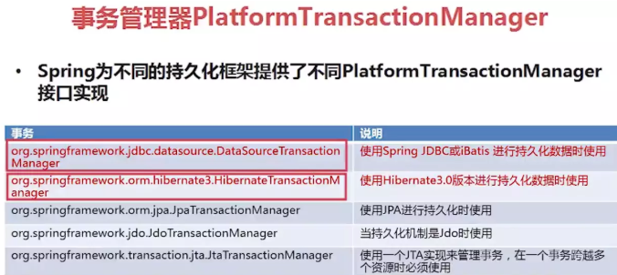

### Spring的事务隔离级别，实现原理

> **ACID**:
>
> 1. 原子性：一个事务中所有对数据库的操作是一个不可分割的操作序列，要么全做要么全不做
> 2. 一致性：事务执行前后过程中数据的完整性必须保持一致性
> 3. 隔离性：多个用户并发访问数据库时，一个用户的事务的执行，不受其他用户事务的干扰，即并发执行的多个事务之间数据要相互隔离。
> 4. 持久性：一个事物一旦提交，它对数据库的改变就是永久的。
>
> spring本身不管理事务，而是提供了多种事务管理器。它们将事务管理的工作委托给对应的持久化平台实现： 
>
> 
>
> **声明式事务**
>
> ​	spring中的声明式事务是通过事务属性去定义的。
>
> ​	事务属性包含了5个方面：传播行为、隔离级别、回滚规则、事务超时、是否只读。
>
> **传播行为**
>
> ​	当一个事务方法被另一个事务方法调用时，这个事务方法应该如何进行。
>
> ​	例如：methodA事务方法调用methodB事务方法时，methodB是继续在调用者methodA的事务中运行呢，还是为自己开启一个新事务运行，这就是由methodB的事务传播行为决定的。
>
> ​	Spring定义了七种传播行为：
>
> - **PROPAGATION_REQUIRED** -- 支持当前事务，如果当前没有事务，就新建一个事务。这是最常见的选择。
> - **PROPAGATION_SUPPORTS** -- 支持当前事务，如果当前没有事务，就以非事务方式执行。
> - **PROPAGATION_MANDATORY** -- 支持当前事务，如果当前没有事务，就抛出异常。
> - **PROPAGATION_REQUIRES_NEW**** -- 新建事务，如果当前存在事务，把当前事务挂起。
> - **PROPAGATION_NOT_SUPPORTED**** -- 以非事务方式执行操作，如果当前存在事务，就把当前事务挂起。
> - **PROPAGATION_NEVER**** -- 以非事务方式执行，如果当前存在事务，则抛出异常。
> - **PROPAGATION_NESTED****--如果当前存在事务，则在嵌套事务内执行。如果当前没有事务，就新建一个事务。嵌套的事务可以独立于当前存在的事务进行单独的提交或回滚，也就是出现异常时，可以选择某一个事务单独提交还是回滚操作。
>
> **隔离级别**
>
> ​	隔离级别是指若干个并发的事务之间的隔离程度。
>
> -   **ISOLATION_DEFAULT**--这是一个PlatfromTransactionManager默认的隔离级别：使用数据库默认的事务隔离级别（mysql默认为REPEATABLE_READ**，**oracle默认为READ_COMMITTED）；
>
> -   **ISOLATION_READ_UNCOMMITTED******--这是事务最低的隔离级别，一个事务可以读取另一个事务读写但未提交的数据。这种隔离级别会产生脏读，不可重复读和幻像读。
>
> -   **ISOLATION_READ_COMMITTED**--保证一个事务修改的数据提交后才能被另外一个事务读取。另外一个事务不能读取该事务未提交的数据。这种事务隔离级别可以避免脏读出现，但是可能会出现不可重复读和幻像读。
>
> -   **ISOLATION_REPEATABLE_READ**--这种事务隔离级别可以防止脏读，不可重复读。但是可能出现幻像读。它除了保证一个事务不能读取另一个事务未提交的数据外，还保证了避免不可重复读。
>
> -   **ISOLATION_SERIALIZABLE**--这是花费最高代价但是最可靠的事务隔离级别。事务被处理为顺序执行。除了防止脏读，不可重复读外，还避免了幻像读。
>
> 隔离级别主要是为了解决并发情况下，数据的一致性问题。因此可以看作是多个线程同时访问一个方法：
>
>     1.   ISOLATION_READ_UNCOMMITTED 就是什么都不做。 
>        
>     2.   ISOLATION_READ_COMMITTED 一旦某个事务对某条记录进行了修改，在提交事务之前都将持有该条记录的行锁，不允许其他事务读取和修改。(只有修改才加锁)
>        
>     3.   ISOLATION_REPEATABLE_READ 一旦某个事务对某条记录进行了修改，在提交事务之前都将持有该条记录的行锁，不允许其他事务读取和修改。 一旦某个事务对某条记录进行了读取，在提交事务之前也将持有该条记录的行锁，不允许其他事务读取和修改。（修改和读取都加锁）
>        
>     4.   ISOLATION_SERIALIZABLE 规定事务的执行顺序，在前一个事务没有提交之前，下一个事务无法开始执行。
>
> **回滚规则**
>
> ​	定义当遇到哪些异常就要进行回滚操作。默认情况，事务只有遇到运行时异常 RunTimeException 才会回滚，而遇到受检型异常时（如IOException、SQLException），则不会回滚。
> ​	spring允许自定义回滚规则。因此，在声明事务时，可以声明当事务遇到特定的检查型异常时同样也会回滚，同样也可以声明在遇到某些特定异常不回滚，哪怕那个异常属于 运行时异常。
>
> **事务超时**
>
> ​	定义一个事务执行的最大时间，可以防止某些事务长时间占用数据库资源，当事务运行超时，将自动回滚，而不是无限等待其运行结束为止。
>
> ​	由于该超时时钟是在事务创建时才会启动，因此只有**PROPAGATION_REQUIRED、PROPAGATION_REQUIRES_NEW 、PROPAGATION_NESTED** 这3个能够在不存在事务时创建新事务的传播行为，考虑设置相应的事务超时时间，才是有意义的。
>
> **是否只读**
>
> ​	如果事务只对数据库进行读取操作，数据库可以利用事务只读特性对其进行相应优化。由于该优化是在事务创建时数据库去实施的，因此只有**PROPAGATION_REQUIRED、PROPAGATION_REQUIRES_NEW 、PROPAGATION_NESTED** 这3个能够在不存在事务时创建新事务的传播行为，考虑设置为只读，才是有意义的。