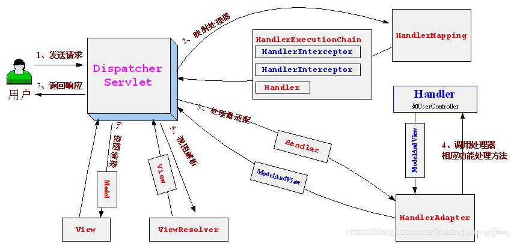

### springmvc的流程

> 1. 用户发送请求至前端控制器DispatcherServlet。
>
> 2. DispatcherServlet收到请求调用HandlerMapping处理器映射器。
>
>    处理器映射器找到具体的处理器(可以根据xml配置、注解进行查找)，生成处理器对象及处理器拦截器(如果有则生成)一并返回给DispatcherServlet。
>
> 3. DispatcherServlet调用HandlerAdapter处理器适配器。
>
> 4. HandlerAdapter经过适配调用具体的处理器(Controller，也叫后端控制器)。
>
> Controller执行完成返回ModelAndView。
>
> HandlerAdapter将controller执行结果ModelAndView返回给DispatcherServlet。
>
> 5. DispatcherServlet将ModelAndView传给ViewReslover视图解析器。
>
> ViewReslover解析后返回具体View.
>
> 6. DispatcherServlet根据View进行渲染视图（即将模型数据填充至视图中）。 
>
> 7. DispatcherServlet响应用户。
>
> 