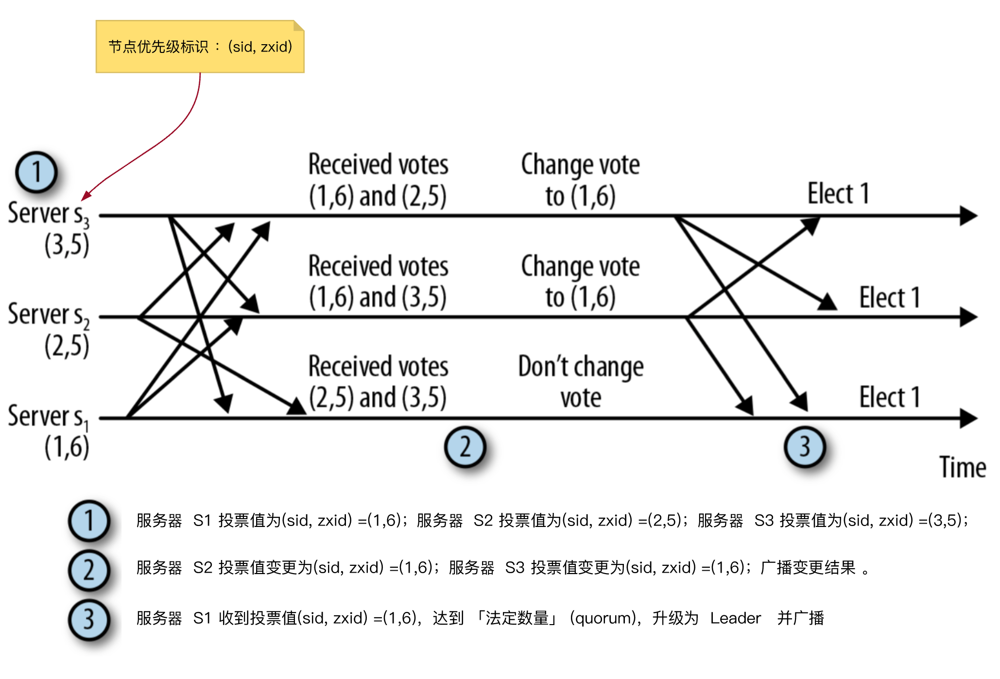

### Zookeeper 工作流程

​	一旦 ZooKeeper 集合启动，它将等待客户端连接。客户端将连接到 ZooKeeper 集合中的一个节点。它可以是 leader 或 follower 节点。一旦客户端被连接，节点将向特定客户端分配 `会话ID` 并向该客户端发送确认。如果客户端没有收到确认，它将尝试连接 ZooKeeper 集合中的另一个节点。 一旦连接到节点，客户端将以有规律的间隔向节点发送 **心跳**，以确保连接不会丢失。

- **如果客户端想要读取特定的znode**，它将会向具有znode路径的节点发送读取请求，并且节点通过从其自己的数据库获取来返回所请求的znode。为此，在ZooKeeper集合中读取速度很快。
- **如果客户端想要将数据存储在ZooKeeper集合中**，则会将 znode 路径和数据发送到服务器。**连接的服务器将该请求转发给 leader，然后leader将向所有的follower重新发出写入请求。如果只有大部分节点成功响应，而写入请求成功，则成功返回代码将被发送到客户端**。 否则，写入请求失败。绝大多数节点被称为 Quorum 。

### ZooKeeper Service 节点数量的影响

- 如果我们有 **单个节点**，则当该节点故障时，ZooKeeper Service 将故障。即“单点故障”，不建议在生产环境中使用。
- 如果我们有 **两个节点** 而一个节点故障，我们没有占多数，ZooKeeper Service 故障，因为两个中的一个不是多数。
- 如果我们有 **三个节点** 而一个节点故障，那么我们有大多数，因此，这是 **最低要求**。ZooKeeper集合在实际生产环境中必须至少有三个节点。
- 如果我们有 **四个节点** 而两个节点故障，它将再次故障。类似于有三个节点，额外节点不用于任何目的，因此，最好添加奇数的节点，例如 3，5，7。

我们知道写入过程比 ZooKeeper 集合中的读取过程要耗时，因为 **所有节点都需要在数据库中写入相同的数据**。因此，对于平衡的环境拥有较少数量（例如3，5，7）的节点比拥有大量的节点要好。

### ZAB 协议

​	ZAB 协议是为分布式协调服务 ZooKeeper 专门设计的一种支持崩溃恢复的原子广播协议。在 ZooKeeper 中，主要依赖 ZAB 协议来实现分布式数据一致性，基于该协议，ZooKeeper 实现了一种主备模式的系统架构来保持集群中各个副本之间的数据一致性。

- 读取时：客户端连接 zk 的任一节点，节点直接拿出自己对应的数据返回，这时该节点扮演 Observer 角色；

- 写入时：客户端的任一提交都会由 Leader 去广播给所有的节点，有半数以上的节点写入成功即视为写入成功；

  ZAB 的所有动作都是节点们通过协议同步的。在 ZAB 协议的事务编号 `Zxid` 设计中， `Zxid` 是一个 64 位的数字，其中低 32 位是一个简单的单调递增的计数器，针对客户端每一个事务请求，计数器加 1；而高 32 位则代表 Leader 周期 epoch 的编号，每个当选产生一个新的 Leader 服务器，就会从这个 Leader 服务器上取出其本地日志中最大事务的 ZXID ，并从中读取 epoch 值，然后加 1，以此作为新的 epoch，并将低 32 位从 0 开始计数。

​	epoch 可以理解为当前集群所处的年代或者周期，每个 leader 就像皇帝，都有自己的年号，所以每次改朝换代，leader 变更之后，都会在前一个年代的基础上加 1。这样就算旧的 leader 崩溃恢复之后，也没有人听他的了，因为 follower 只听从当前年代的 leader 的命令。

### 消息广播

​	在 zookeeper 集群中，数据副本的传递策略就是采用消息广播模式。 zookeeper 中数据副本的同步方式与二段提交相似。二段提交要求协调者必须等到所有的参与者全部反馈 ACK 确认消息后，再发送 commit 消息。要求所有的参与者要么全部成功，要么全部失败，因此二段提交会产生严重的阻塞问题。 Zab 协议中 Leader 等待半数以上的Follower成功反馈即可，不需要收到全部Follower反馈。

​	消息广播具体步骤

1. 客户端发起一个写操作请求。
2. Leader 服务器将客户端的请求转化为事务 Proposal 提案，同时为每个 Proposal 分配一个全局的ID，即 zxid。
3. Leader 服务器为每个 Follower 服务器分配一个单独的队列，然后将需要广播的 Proposal 依次放到队列中取，并且根据 FIFO 策略进行消息发送。
4. Follower 接收到 Proposal 后，会首先将其以事务日志的方式写入本地磁盘中，写入成功后向 Leader 反馈一个 Ack 响应消息。
5. Leader 接收到超过半数以上 Follower 的 Ack 响应消息后，即认为消息发送成功，可以发送 commit 消息。
6. Leader 向所有 Follower 广播 commit 消息，同时自身也会完成事务提交。Follower 接收到 commit 消息后，会将上一条事务提交。

### 崩溃恢复保证数据一致性

主从架构下，leader 崩溃，为了保证数据一致性，会在选出新leader后进入恢复阶段，新 leader 具有所有已经提交的提议，因此它会保证让 followers 同步已经提交的提议，丢弃未提交的提议（以 leader 的记录为准）

### 选举

下面任何一种情况，都会触发 Leader 选举：

- 启动时，集群服务器刚启动
- 运行时，Leader 崩溃

服务器的状态流转：

​	Leader 选举过程，本质就是 **广播优先级消息** 的过程，选出 **数据最新的服务节点**，选出优先级最高的服务节点，基本步骤：

- 各个服务器节点，广播自己的优先级标识 `(sid，zxid)`
- 服务器节点收到其他广播消息后，跟自己的优先级对比，自己优先级低，则变更当前节点投票的优先级`(sid，zxid)` ，并广播变更后的结果
- 当任意一个服务器节点收到的投票数，超过了法定数量(`quorum`)，则，升级为 Leader，并广播结果。

> - 由于网络延时，节点得不到足够多广播信息时，会做出错误的投票判断，纠正过程更耗时
> - 选举过程中，服务器节点会等待一定时间，再广播投票信息，时间间隔一般设定为 200 ms
> - 上面 Leader 选举，采取事件触发 Push 方式 广播消息，称为 快速 Leader 选举，因为之前的 Leader 选举，采用 Pull 方式，每隔 1s 拉取一次。
