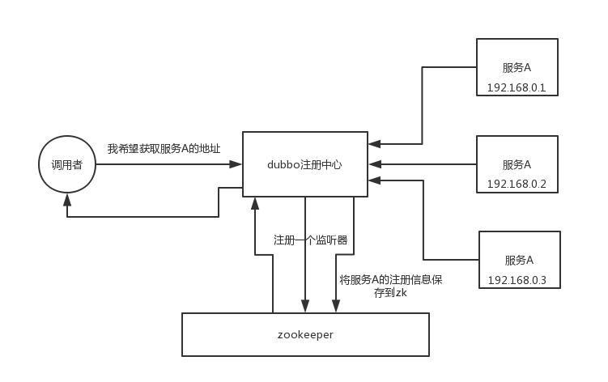

###  **zookeeper 都有哪些使用场景？** 

​	大致来说，zookeeper 的使用场景如下，我就举几个简单的，大家能说几个就好了：

- 分布式协调
- 分布式锁
- 元数据/配置信息管理
- HA高可用性

#### 发布订阅

​	通过 Zookeeper 进行数据的发布与订阅其实可以说是它提供的最基本功能，它能够允许多个客户端同时订阅某一个节点的变更并在变更发生时执行我们预先设置好的回调函数，在运行时改变服务的配置和行为

#### 命名服务

​	除了实现服务配置数据的发布与订阅功能，Zookeeper 还能帮助分布式系统实现命名服务，在每一个分布式系统中，客户端应用都有根据指定名字获取资源、服务器地址的需求，在这时就要求整个集群中的全部服务有着唯一的名字。

​	在大型分布式系统中，有两件事情非常常见，一是不同服务之间的可能拥有相同的名字，另一个是同一个服务可能会在集群中部署很多的节点，Zookeeper 就可以通过文件系统和顺序节点解决这两个问题。

### 协调分布式事务

​	Zookeeper 的另一个作用就是担任分布式事务中的协调者角色，在之前介绍 分布式事务 的文章中我们曾经介绍过分布式事务本质上都是通过 2PC 来实现的，在两阶段提交中就需要一个协调者负责协调分布式事务的执行。

​	所有的事务参与者会向当前节点中写入提交或者终止，一旦当前的节点改变了事务的状态，其他节点就会得到通知，如果出现一个写入终止的节点，所有的节点就会回滚对分布式事务进行回滚。

​	 A 系统发送个请求到 mq，然后 B 系统消息消费之后处理了。那 A 系统如何知道 B 系统的处理结果？用 zookeeper 就可以实现分布式系统之间的协调工作。A 系统发送请求之后可以在 zookeeper 上**对某个节点的值注册个监听器**，一旦 B 系统处理完了就修改 zookeeper 那个节点的值，A 系统立马就可以收到通知，完美解决。

### 分布式锁

​	在数据库中，锁的概念其实是非常重要的，常见的关系型数据库就会对排他锁和共享锁进行支持，而 `Zookeeper` 提供的 API 也可以让我们非常简单的实现分布式锁。

​	作为分布式协调服务，Zookeeper 的应用场景非常广泛，不仅能够用于服务配置的下发、命名服务、协调分布式事务以及分布式锁，还能够用来实现微服务治理中的服务注册以及发现等功能，这些其实都源于 Zookeeper 能够提供高可用的分布式协调服务，能够为客户端提供分布式一致性的支持。

​	举个栗子。对某一个数据连续发出两个修改操作，两台机器同时收到了请求，但是只能一台机器先执行完另外一个机器再执行。那么此时就可以使用 zookeeper 分布式锁，一个机器接收到了请求之后先获取 zookeeper 上的一把分布式锁，就是可以去创建一个 znode，接着执行操作；然后另外一个机器也**尝试去创建**那个 znode，结果发现自己创建不了，因为被别人创建了，那只能等着，等第一个机器执行完了自己再执行。

### 元数据/配置信息管理

​	zookeeper 可以用作很多系统的配置信息的管理，比如 kafka、storm 等等很多分布式系统都会选用 zookeeper 来做一些元数据、配置信息的管理，包括 dubbo 注册中心不也支持 zookeeper 么？

### HA高可用性

​	这个应该是很常见的，比如 hadoop、hdfs、yarn 等很多大数据系统，都选择基于 zookeeper 来开发 HA 高可用机制，就是一个**重要进程一般会做主备**两个，主进程挂了立马通过 zookeeper 感知到切换到备用进程。

