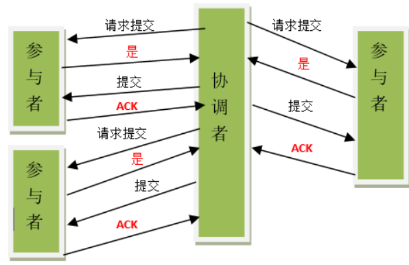
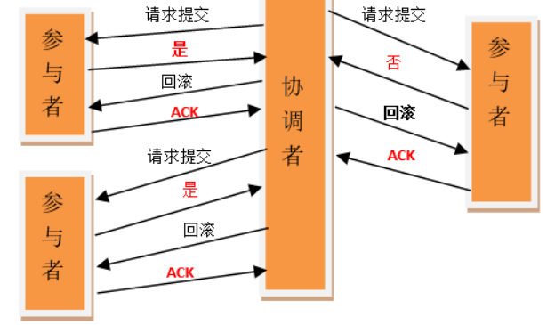
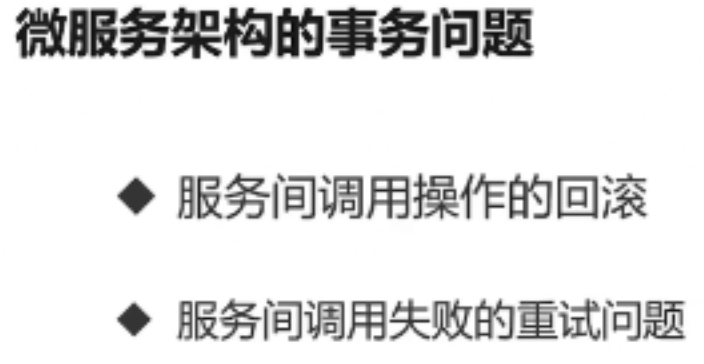
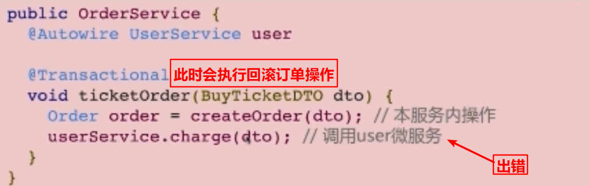
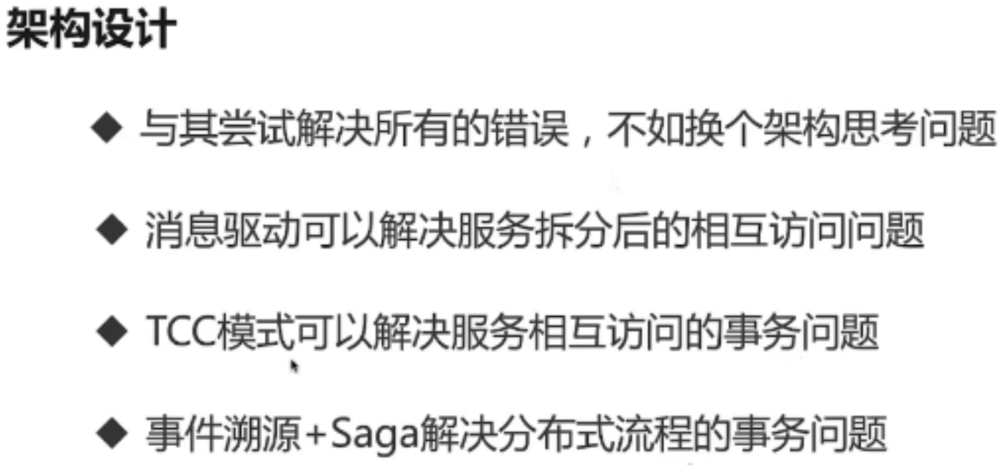

### **对分布式事务的理解**

> 分布式事务
>
> ​	当应用逐渐扩展，出现一个应用使用多个数据源的情况，这个时候本地事务已经无法满足数据一致性的要求。由于多个数据源的同时访问，事务需要跨多个数据源管理，分布式事务应运而生。其中最流行的就是两阶段提交（2PC），分布式事务由事务管理器（TM）统一管理。
>
> 
>
> ​	两阶段提交分为准备阶段和提交阶段。 两阶段提交也不能完全保证数据一致性问题，并且有同步阻塞的问题，所以其优化版本三阶段提交（3PC）被发明了出来。  然而3PC也只能保证绝大多数情况下的数据一致性。
>
> 
>
> TCC 
>
> 1. Try 检查及预留业务资源
>    完成提交事务前的检查，并预留好资源。
> 2. Confirm 确定执行业务操作(try 成功,则一定保成功)
>    对try阶段预留的资源正式执行。
> 3. Cancel 取消执行业务操作(try失败,释放预留资源占用)
>    对try阶段预留的资源释放
>
> 可靠消息传递  消息队列实现 
>
> - ​	前一个事件发生，后一个事件一定发生。
> - ​	可靠事件模式需要注意的有两点，1. 事件的正确发送； 2. 事件的重复消费。
> - ​	通过异步消息服务可以确保事件的正确发送，然而事件是有可能重复发送的，那么就需要消费端保证同一条事件不会重复被消费，简而言之就是保证事件消费的`幂等性`。

###  **分布式事务了解吗？你们是如何解决分布式事务问题的？** 

分布式事务的实现主要有以下 5 种方案：

- XA 方案
- TCC 方案
- 本地消息表
- 可靠消息最终一致性方案
- 最大努力通知方案

**两阶段提交方案/XA方案**

​	所谓的 XA 方案，即：两阶段提交，有一个**事务管理器**的概念，负责协调多个数据库（资源管理器）的事务，事务管理器先问问各个数据库你准备好了吗？如果每个数据库都回复 ok，那么就正式提交事务，在各个数据库上执行操作；如果任何其中一个数据库回答不 ok，那么就回滚事务。

​	这种分布式事务方案，比较适合单块应用里，跨多个库的分布式事务，而且因为严重依赖于数据库层面来搞定复杂的事务，效率很低，绝对不适合高并发的场景。如果要玩儿，那么基于 `Spring + JTA` 就可以搞定，自己随便搜个 demo 看看就知道了。

​	这个方案，我们很少用，一般来说**某个系统内部如果出现跨多个库**的这么一个操作，是**不合规**的。我可以给大家介绍一下， 现在微服务，一个大的系统分成几十个甚至几百个服务。一般来说，我们的规定和规范，是要求**每个服务只能操作自己对应的一个数据库**。

​	如果你要操作别的服务对应的库，不允许直连别的服务的库，违反微服务架构的规范，你随便交叉胡乱访问，几百个服务的话，全体乱套，这样的一套服务是没法管理的，没法治理的，可能会出现数据被别人改错，自己的库被别人写挂等情况。

​	如果你要操作别人的服务的库，你必须是通过**调用别的服务的接口**来实现，绝对不允许交叉访问别人的数据库。

**TCC 方案**

​	TCC 的全称是：`Try`、`Confirm`、`Cancel`。

- Try 阶段：这个阶段说的是对各个服务的资源做检测以及对资源进行**锁定或者预留**。

- Confirm 阶段：这个阶段说的是在各个服务中**执行实际的操作**。

- Cancel 阶段：如果任何一个服务的业务方法执行出错，那么这里就需要**进行补偿**，就是执行已经执行成功的业务逻辑的回滚操作。（把那些执行成功的回滚）

  

  这种方案说实话几乎很少人使用，我们用的也比较少，但是也有使用的场景。因为这个**事务回滚**实际上是**严重依赖于你自己写代码来回滚和补偿**了，会造成补偿代码巨大，非常之恶心。

  比如说我们，一般来说跟**钱**相关的，跟钱打交道的，**支付**、**交易**相关的场景，我们会用 TCC，严格保证分布式事务要么全部成功，要么全部自动回滚，严格保证资金的正确性，保证在资金上不会出现问题。

  而且最好是你的各个业务执行的时间都比较短。

  但是说实话，一般尽量别这么搞，自己手写回滚逻辑，或者是补偿逻辑，实在太恶心了，那个业务代码是很难维护的。

**本地消息表**

​	本地消息表其实是国外的 ebay 搞出来的这么一套思想。

​	这个大概意思是这样的：

1. A 系统在自己本地一个事务里操作同时，插入一条数据到消息表；

2. 接着 A 系统将这个消息发送到 MQ 中去；

3. B 系统接收到消息之后，在一个事务里，往自己本地消息表里插入一条数据，同时执行其他的业务操作，如果这个消息已经被处理过了，那么此时这个事务会回滚，这样**保证不会重复处理消息**；

4. B 系统执行成功之后，就会更新自己本地消息表的状态以及 A 系统消息表的状态；

5. 如果 B 系统处理失败了，那么就不会更新消息表状态，那么此时 A 系统会定时扫描自己的消息表，如果有未处理的消息，会再次发送到 MQ 中去，让 B 再次处理；

6. 这个方案保证了最终一致性，哪怕 B 事务失败了，但是 A 会不断重发消息，直到 B 那边成功为止。

   

   这个方案说实话最大的问题就在于**严重依赖于数据库的消息表来管理事务**啥的，如果是高并发场景咋办呢？咋扩展呢？所以一般确实很少用。

**可靠消息最终一致性方案**

​	这个的意思，就是干脆不要用本地的消息表了，直接基于 MQ 来实现事务。比如阿里的 RocketMQ 就支持消息事务。

​	大概的意思就是：

1. A 系统先发送一个 prepared 消息到 mq，如果这个 prepared 消息发送失败那么就直接取消操作别执行了；
2. 如果这个消息发送成功过了，那么接着执行本地事务，如果成功就告诉 mq 发送确认消息，如果失败就告诉 mq 回滚消息；
3. 如果发送了确认消息，那么此时 B 系统会接收到确认消息，然后执行本地的事务；
4. mq 会自动**定时轮询**所有 prepared 消息回调你的接口，问你，这个消息是不是本地事务处理失败了，所有没发送确认的消息，是继续重试还是回滚？一般来说这里你就可以查下数据库看之前本地事务是否执行，如果回滚了，那么这里也回滚吧。这个就是避免可能本地事务执行成功了，而确认消息却发送失败了。
5. 这个方案里，要是系统 B 的事务失败了咋办？重试咯，自动不断重试直到成功，如果实在是不行，要么就是针对重要的资金类业务进行回滚，比如 B 系统本地回滚后，想办法通知系统 A 也回滚；或者是发送报警由人工来手工回滚和补偿。
6. 这个还是比较合适的，目前国内互联网公司大都是这么玩儿的，要不你举用 RocketMQ 支持的，要不你就自己基于类似 ActiveMQ？RabbitMQ？自己封装一套类似的逻辑出来，总之思路就是这样子的。

**最大努力通知方案**

​	这个方案的大致意思就是：

1. 系统 A 本地事务执行完之后，发送个消息到 MQ；
2. 这里会有个专门消费 MQ 的**最大努力通知服务**，这个服务会消费 MQ 然后写入数据库中记录下来，或者是放入个内存队列也可以，接着调用系统 B 的接口；
3. 要是系统 B 执行成功就 ok 了；要是系统 B 执行失败了，那么最大努力通知服务就定时尝试重新调用系统 B，反复 N 次，最后还是不行就放弃。

**你们公司是如何处理分布式事务的**？

​	如果你真的被问到，可以这么说，我们某某特别严格的场景，用的是 TCC 来保证强一致性；然后其他的一些场景基于阿里的 RocketMQ 来实现分布式事务。

​	你找一个严格资金要求绝对不能错的场景，你可以说你是用的 TCC 方案；如果是一般的分布式事务场景，订单插入之后要调用库存服务更新库存，库存数据没有资金那么的敏感，可以用可靠消息最终一致性方案。

​	友情提示一下，RocketMQ 3.2.6 之前的版本，是可以按照上面的思路来的，但是之后接口做了一些改变，我这里不再赘述了。

### 分布式事务

​	分布式事务的实现主要有以下 5 种方案：

- XA 方案
- TCC 方案
- 可靠消息最终一致性方案
- 最大努力通知方案

## 2PC/XA方案

​	所谓的 XA 方案，即：两阶段提交，有一个事务管理器的概念，负责协调多个数据库（资源管理器）的事务，事务管理器先问问各个数据库你准备好了吗？如果每个数据库都回复 ok，那么就正式提交事务，在各个数据库上执行操作；如果任何其中一个数据库回答不 ok，那么就回滚事务。

​	这种分布式事务方案，比较适合单块应用里，跨多个库的分布式事务，而且因为严重依赖于数据库层面来搞定复杂的事务，效率很低，绝对不适合高并发的场景。

​	一般来说某个系统内部如果出现跨多个库的这么一个操作，是不合规的。如果你要操作别人的服务的库，你必须是通过调用别的服务的接口来实现，绝对不允许交叉访问别人的数据库。

## TCC强一致性方案

​	TCC 的全称是：`Try`、`Confirm`、`Cancel`。

- **Try 阶段**：这个阶段说的是对各个服务的资源做检测以及对资源进行 **锁定或者预留**。

- **Confirm 阶段**：这个阶段说的是在各个服务中执行实际的操作。

- **Cancel 阶段**：如果任何一个服务的业务方法执行出错，那么这里就需要 **进行补偿**，就是执行已经执行成功的业务逻辑的回滚操作。（把那些执行成功的回滚）

  

  这种方案说实话几乎很少人使用，但是也有使用的场景。因为这个 **事务回滚实际上是严重依赖于你自己写代码来回滚和补偿** 了，会造成补偿代码巨大，非常之恶心。

### 可靠消息最终一致性方案

​	基于 MQ 来实现事务。比如阿里的 RocketMQ 就支持消息事务。大概的意思就是：

1. A 系统先发送一个 prepared 消息到 MQ，如果这个 prepared 消息发送失败那么就直接取消操作别执行了；
2. 如果这个消息发送成功过了，那么接着执行本地事务，如果成功就告诉 MQ 发送确认消息，如果失败就告诉 MQ 回滚消息；
3. 如果发送了确认消息，那么此时 B 系统会接收到确认消息，然后执行本地的事务；
4. mq 会自动定时轮询所有 prepared 消息回调你的接口，问你，这个消息是不是本地事务处理失败了，所有没发送确认的消息，是继续重试还是回滚？一般来说这里你就可以查下数据库看之前本地事务是否执行，如果回滚了，那么这里也回滚吧。这个就是避免可能本地事务执行成功了，而确认消息却发送失败了。
5. 这个方案里，要是系统 B 的事务失败了咋办？重试咯，自动不断重试直到成功，如果实在是不行，要么就是针对重要的资金类业务进行回滚，比如 B 系统本地回滚后，想办法通知系统 A 也回滚；或者是发送报警由人工来手工回滚和补偿。

这个还是比较合适的，目前国内互联网公司大都是这么玩儿的，要不你举用 RocketMQ 支持的，要不你就自己基于类似 ActiveMQ？RabbitMQ？自己封装一套类似的逻辑出来，总之思路就是这样子的。

### 最大努力通知方案

​	这个方案的大致意思就是：

1. 系统 A 本地事务执行完之后，发送个消息到 MQ；
2. 这里会有个专门消费 MQ 的最大努力通知服务，这个服务会消费 MQ 然后写入数据库中记录下来，或者是放入个内存队列也可以，接着调用系统 B 的接口；
3. 要是系统 B 执行成功就 ok 了；要是系统 B 执行失败了，那么最大努力通知服务就定时尝试重新调用系统 B，反复 N 次，最后还是不行就放弃。

# 分布式事务

#### 1.1 两阶段提交（2PC）

当应用逐渐扩展，出现一个应用使用多个数据源的情况，这个时候本地事务已经无法满足数据一致性的要求。由于多个数据源的同时访问，事务需要跨多个数据源管理，分布式事务应运而生。其中最流行的就是两阶段提交（2PC），分布式事务由事务管理器（TM）统一管理。

两阶段提交分为准备阶段和提交阶段。

两阶段提交-commit

两阶段提交-rollback

在 JavaEE 平台下，WebLogic、Webshare 等主流商用的应用服务器提供了 JTA 的实现和支持。而在 Tomcat 下是没有实现的，这就需要借助第三方的框架 Jotm、Automikos 等来实现，两者均支持 Spring 事务整合。

然而，两阶段提交也不能完全保证数据一致性问题，并且有同步阻塞的问题，所以其优化版本三阶段提交（3PC）被发明了出来。

#### 1.2 三阶段提交（3PC）

然而3PC也只能保证绝大多数情况下的数据一致性。

#### 2.spring中的分布式事务处理

spring中的分布式事务可以使用JTA来处理，多个数据源事务的同步。但是，JTA实现的分布式事务，有一定的性能问题。所以，很多时候都是不使用JTA来实现分布式事务的。

因此，大多时候，用最终一致性代替强一致性。

> -   两阶段型  2PC
>
>     就是分布式事务两阶段提交，XA 对应技术上的JTA。这是分布式环境下事务处理的典型模式。
>
> -   补偿型   TCC(Try Confirm Cancel)模式
>
>     TCC事务补偿是基于2PC实现的业务层事务控制方案。TCC第二阶段提交还是回滚,依赖于第一阶段try的结果，需要同步阻塞等待结果返回
>
> 1.  Try 检查及预留业务资源  
>     完成提交事务前的检查，并预留好资源。
> 2.  Confirm 确定执行业务操作(try 成功,则一定保成功)  
>     对try阶段预留的资源正式执行。
> 3.  Cancel 取消执行业务操作(try失败,释放预留资源占用)  
>     对try阶段预留的资源释放。
>
>     TCC思路是:尽早释放锁；在Try失败的情况下，如果事务要回滚，Cancel将作为一个补偿机制，回滚Try操作；   
>     TCC各操作事务本地化，且尽早提交 (放弃两阶段约束)；当全局事务要求回滚时，通过另一个本地事务实现“补偿”行为；   
>     TCC是将资源层的两阶段提交协议转换到业务层，成为业务模型中的一部分。
>
>     TCC的软状态时间很短：只有在所有的服务的第一阶段（try）都成功的时候才进行第二阶段确认（Confirm）操作，否则进行补偿(Cancel)操作，而在try阶段是不会进行真正的业务处理的。
>
> -   sagas模式  _[Axon](http://www.baidu.com/link?url=vsPZY_KQb3Pe57nPBeE6FedcVG_vtqssICMrSNM54Taabis7LvMGKYEBlI06kArQ)_框架实现 
>
>     在没有两阶段提交的的情况下解决分布式系统中复杂的业务事务问题。
>
>     Saga事务是一个长事务，整个事务可以由多个本地事务组成，每个本地事务有相应的执行模块和补偿模块。
>
>     将一个长事务，分解成一系列有序的本地事务。每个事务更新数据库或发送消息，来触发下一个本地事务；如果本地事务执行失败，soga会有序执行补偿事务，来回滚之前的操作。
>
>     因为每个微服务仅关注其自己的本地原子事务，所以如果微服务运行很长时间，则不会阻止其他微服务。这也允许事务继续等待用户输入。此外，由于所有本地事务都是并行发生的，因此任何对象都没有锁定。
>
> -   异步确保型   本地消息表/消息队列实现   
>
>     将TCC中同步阻塞的事务操作 变为 异步的操作，避免对数据库事务的争用，典型例子是热点账户异步记账、批量记账的处理。
>
>     热点账户异步记账：多个买家向同一个卖家付款,可以单独使用子账户记录入账金额，每隔一段时间对金额合并，并修改买家账户金额。存在的问题，如果还存在卖家向买家付款的情况，可能会出现 总支出金额小于卖家账户金额的情形。可以采取限制支出金额的范围，来规避这种风险。
>
> -   可靠消息传递   消息队列实现   
>
>      前一个事件发生，后一个事件一定发生。
>
>     可靠事件模式需要注意的有两点，1\. 事件的正确发送； 2. 事件的重复消费。  
>     通过异步消息服务可以确保事件的正确发送，然而事件是有可能重复发送的，那么就需要消费端保证同一条事件不会重复被消费，简而言之就是保证事件消费的`幂等性`。
>
>   
>
>
> -   最大努力通知型    消息队列实现
>
>     分布式事务中要求最低的一种, 也可以通过消息中间件实现, 与前面异步确保型操作不同的一点是, 在消息由MQ投递到消费者之后, **允许在达到最大重试次数之后正常结束事务**.(例如 商户交易结果通知重试、补单重试)
>
>     最大努力通知型的特点是，业务服务在提交事务后，进行有限次数（设置最大次数限制）的消息发送，比如发送三次消息，若三次消息发送都失败，则不予继续发送。所以有可能导致消息的丢失。同时，主业务方需要提供查询接口给从业务服务，用来恢复丢失消息。最大努力通知型对于时效性保证比较差（既可能会出现较长时间的软状态），所以对于数据一致性的时效性要求比较高的系统无法使用。

#### 3.微服务架构的分布式事务处理：

下图中，若调用user微服务出错，则订单操作会被回滚。此时，数据保持一致。

下图中，若调用票仓微服务出错，user微服务则无法进行回滚。

解决方案1:尽可能减少服务间的调用

解决方案2：没有服务间的调用，通过消息驱动调用服务。

基于消息队列实现的微服务分布式事务:

需要注意的问题：

1.消息中间件需要支持事务；

2.如何处理重试的消息：

​    通过全局id,幂等性校验(确保无论重试几次，返回的结果都应当不会变化，保证多次重试不会对系统造成其他影响。)

3.发生业务异常时的回滚操作

​    解决1.把出错的失败消息写入一个队列中，进行相应的回滚操作

​    解决2.通过定时任务检查超时订单，对未完成的订单做自动回滚

​    解决3.保存出错信息，人工处理。

#### 总结：

使用幂等性UUID，防止错误处理时重试对数据造成多次处理。

分布式锁，防止多次相同请求，短时间内重复处理多次。

1.一般情况下，使用最终一致性即可满足业务上的需求；

2.合理地选择同步还是异步进行处理；

3.合理地设计实现代码：设计的原则为 越容易出现错误的代码，越应当优先进行检查和处理；这样可以保证在对数据修改之前，对可能出现的错误情形都考虑到了，然后尽早地返回结果。

从而尽可能地减小 分布式事务出现错误回滚的情况。

参考文章：

1.《微服务下的数据一致性的几种实现方式之概述》[https://www.jianshu.com/p/b264a196b177](https://www.jianshu.com/p/b264a196b177)