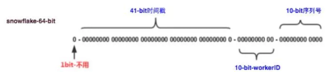

### 分布式集群下如何做到唯一序列号

> **全局唯一ID的特点** 
>
> 全局唯一性：不能出现重复的ID号，既然是唯一标识，这是最基本的要求；
>
> 趋势递增：在MySQL InnoDB引擎中使用的是聚集索引，由于多数RDBMS使用B-tree的数据结构来存储索引数据，在主键的选择上面我们应该尽量使用有序的主键保证写入性能。
>
> 单调递增：保证下一个ID一定大于上一个ID，例如事务版本号、IM增量消息、排序等特殊需求。
>
> 信息安全：如果ID是连续的，恶意用户的扒取工作就非常容易做了，直接按照顺序下载指定URL即可；如果是订单号就更危险了，竞对可以直接知道我们一天的单量。所以在一些应用场景下，会需要ID无规则、不规则。
>
> 高可用性：同时除了对ID号码自身的要求，业务还对ID号生成系统的可用性要求极高，想象一下，如果ID生成系统瘫痪，这就会带来一场灾难。所以不能有单点故障。
>
> 分片支持：可以控制ShardingId。比如某一个用户的文章要放在同一个分片内，这样查询效率高，修改也容易。•长度适中
>
> 由此总结下一个ID生成系统应该做到如下几点：
>
> 1.平均延迟和TP999延迟都要尽可能低；
>
> 2.可用性5个9；
>
> 3.高QPS。
>
> 
>
> ###### 1 UUID生成
>
> ​	UUID (Universally Unique Identifier) 的目的，是让分布式系统中的所有元素，都能有唯一的辨识，而不需要透过中央控制端来做辨识资讯的指定。如此一来，每个人都可以建立不与其它人冲突的 UUID。在这样的情况下，就不需考虑数据库建立时的名称重复问题。
>
> ​	UUID的标准形式包含32个16进制数字，以连字号分为五段，形式为8-4-4-4-12的36个字符，示例：550e8400-e29b-41d4-a716-446655440000，到目前为止业界一共有5种方式生成UUID，详情见IETF发布的UUID规范 A Universally Unique IDentifier (UUID) URN Namespace。
>
> 在Java中我们可以直接使用下面的API生成UUID。
>
> ```java
> UUID uuid  =  UUID.randomUUID(); 
> String s = UUID.randomUUID().toString();
> ```
>
> 优点：
>
> 性能非常高：本地生成，API调用方便，没有网络消耗。
>
> 缺点：
>
> 存储成本高：UUID太长，16字节128位，通常以36长度的字符串表示，很多场景不适用。
>
> 信息不安全：基于MAC地址生成UUID的算法可能会造成MAC地址泄露，这个漏洞曾被用于寻找梅丽莎病毒的制作者位置。
>
> ID作为主键时在特定的环境会存在一些问题，比如做DB主键的场景下，UUID就非常不适用。UUID不是趋势递增的，而现阶段主流的数据库主键索引都是选用的B+树索引，对于无序长度过长的主键插入效率比较低。
>
> ###### 2 数据库生成
>
> ```
> 以MySQL举例，利用给字段设置 auto_increment_increment 和 auto_increment_offset 来保证ID自增，每次业务使用下列SQL读写MySQL得到ID号。 
> ```
>
> 
>
> 优点：
>
> ​	非常简单，利用现有数据库系统的功能实现，成本小，有DBA专业维护。•ID号单调自增，可以实现一些对ID有特殊要求的业务。
>
> 缺点：
>
> ​	强依赖DB，当DB异常时整个系统不可用，属于致命问题。配置主从复制可以尽可能的增加可用性，但是数据一致性在特殊情况下难以保证。主从切换时的不一致可能会导致重复发号。
>
> ​	ID发号性能瓶颈限制在单台MySQL的读写性能。
>
> ###### 3 Redis生成
>
> ​	当使用数据库来生成ID性能不够要求的时候，我们可以尝试使用Redis来生成ID。这主要依赖于Redis是单线程的，所以也可以用生成全局唯一的ID。可以用Redis的原子操作 INCR和INCRBY来实现。
>
> ​	比较适合使用Redis来生成日切流水号。比如订单号=日期+当日自增长号。可以每天在Redis中生成一个Key，使用INCR进行累加。
>
> 优点：
>
> ​	不依赖于数据库，灵活方便，且性能优于数据库。
>
> ​	数字ID天然排序，对分页或者需要排序的结果很有帮助。
>
> 缺点：
>
> ​	如果系统中没有Redis，还需要引入新的组件，增加系统复杂度。
>
> ​	需要编码和配置的工作量比较大。
>
> ​	Redis单点故障，影响序列服务的可用性。
>
> ###### 4 利用zookeeper生成
>
> ​	zookeeper主要通过其znode数据版本来生成序列号，可以生成32位和64位的数据版本号，客户端可以使用这个版本号来作为唯一的序列号。
>
> ​	很少会使用zookeeper来生成唯一ID。主要是由于需要依赖zookeeper，并且是多步调用API，如果在竞争较大的情况下，需要考虑使用分布式锁。因此，性能在高并发的分布式环境下，也不甚理想。
>
> ###### 5 雪花算法生成
>
> ​	 这种方案大致来说是一种以划分命名空间（UUID也算，由于雪花算法生成比较常见，所以单独分析）来生成ID的一种算法，这种方案把64-bit分别划分成多段，分开来标示机器、时间等，比如在snowflake中的64-bit分别表示如下图所示： 
>
> 
>
> ​	41个bit的时间可以表示`（1L<<41/(1000L360024*365)=69`年的时间，10-bit机器可以分别表示1024台机器。如果我们对IDC划分有需求，还可以将10-bit分5-bit给IDC，分5-bit给工作机器。这样就可以表示：32个IDC，每个IDC下可以有32台机器，可以根据自身需求定义。12个自增序列号可以表示2^12个ID，理论上snowflake方案的QPS约为409.6w/s，这种分配方式可以保证在任何一个IDC的任何一台机器在任意毫秒内生成的ID都是不同的。
>
> 优点：
>
> ​	毫秒数在高位，自增序列在低位，整个ID都是趋势递增的。
>
> ​	不依赖数据库等第三方系统，以服务的方式部署，稳定性更高，生成ID的性能也是非常高的。
>
> ​	可以根据自身业务特性分配bit位，非常灵活。
>
> 缺点：
>
> ​	强依赖机器时钟，如果机器上时钟回拨，会导致发号重复或者服务会处于不可用状态。
>
> ###### 6 滴滴 Tinyid
>
> ​	Tinyid是用Java开发的一款分布式id生成系统，基于数据库号段算法实现，关于这个算法可以参考美团leaf或者tinyid原理介绍。Tinyid扩展了leaf-segment算法，支持了多db(master)，同时提供了java-client(sdk)使id生成本地化，获得了更好的性能与可用性。Tinyid在滴滴客服部门使用，均通过tinyid-client方式接入，每天生成亿级别的id。
>
> Tinyid的特性:
>
> 1.全局唯一的long型id
>
> 2.趋势递增的id，即不保证下一个id一定比上一个大
>
> 3.非连续性
>
> 4.提供http和java client方式接入
>
> 5.支持批量获取id
>
> 6.支持生成1,3,5,7,9...序列的id
>
> 7.支持多个db的配置，无单点
>
> tinyid的原理
>
> ​	tinyid是基于数据库发号算法实现的，简单来说是数据库中保存了可用的id号段，tinyid会将可用号段加载到内存中，之后生成id会直接内存中产生。
>
> ​	可用号段在第一次获取id时加载，如当前号段使用达到一定量时，会异步加载下一可用号段，保证内存中始终有可用号段。
>
> ​	如可用号段11000被加载到内存，则获取id时，会从1开始递增获取，当使用到一定百分比时，如20%(默认)，即200时，会异步加载下一可用号段到内存，假设新加载的号段是10012000,则此时内存中可用号段为2001000,10012000，当id递增到1000时，当前号段使用完毕，下一号段会替换为当前号段。依次类推。
>
> ###### 7 其他生成方式
>
> 百度 UidGenerator	https://github.com/baidu/uid-generator
>
> 美团 Leaf	https://github.com/zhuzhong/idleaf