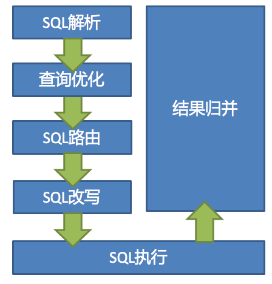
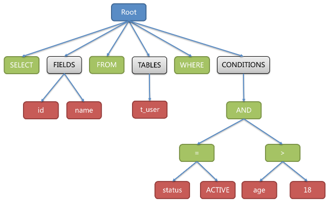
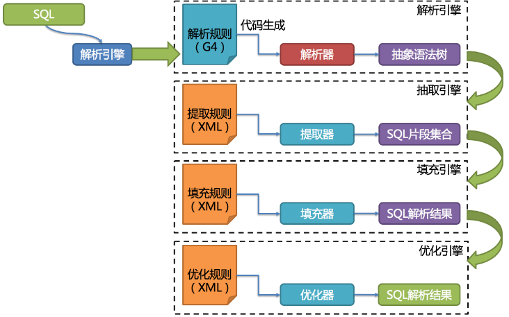
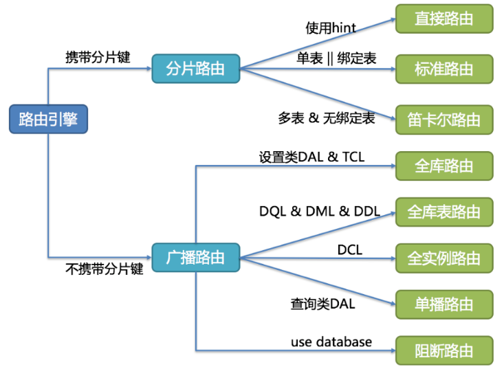

  ShardingSphere的3个产品的数据分片主要流程是完全一致的。 核心由`SQL解析 => 执行器优化 => SQL路由 => SQL改写 => SQL执行 => 结果归并`的流程组成。




## SQL解析

  分为词法解析和语法解析。 先通过词法解析器将SQL拆分为一个个不可再分的单词。再使用语法解析器对SQL进行理解，并最终提炼出解析上下文。 解析上下文包括表、选择项、排序项、分组项、聚合函数、分页信息、查询条件以及可能需要修改的占位符的标记。

   解析过程分为词法解析和语法解析。 词法解析器用于将SQL拆解为不可再分的原子符号，称为Token。并根据不同数据库方言所提供的字典，将其归类为关键字，表达式，字面量和操作符。 再使用语法解析器将SQL转换为抽象语法树。

  以下SQL：

```
SELECT id, name FROM t_user WHERE status = 'ACTIVE' AND age > 18
```

  解析之后的为抽象语法树：



  第三代SQL解析引擎的整体结构划分如下 ：




## 执行器优化

  合并和优化分片条件，如OR等。


## SQL路由

  根据解析上下文匹配用户配置的分片策略，并生成路由路径。目前支持分片路由和广播路由。

  根据解析上下文匹配数据库和表的分片策略，并生成路由路径。 对于携带分片键的SQL，根据分片键的不同可以划分为单片路由(分片键的操作符是等号)、多片路由(分片键的操作符是IN)和范围路由(分片键的操作符是BETWEEN)。 不携带分片键的SQL则采用广播路由。

  分片策略通常可以采用由数据库内置或由用户方配置。 数据库内置的方案较为简单，内置的分片策略大致可分为尾数取模、哈希、范围、标签、时间等。 由用户方配置的分片策略则更加灵活，可以根据使用方需求定制复合分片策略。

  **分片路由**

​    用于根据分片键进行路由的场景，又细分为直接路由、标准路由和笛卡尔积路由这3种类型。

  **直接路由**

  满足直接路由的条件相对苛刻，它需要通过Hint（使用HintAPI直接指定路由至库表）方式分片，并且是只分库不分表的前提下，则可以避免SQL解析和之后的结果归并。 因此它的兼容性最好，可以执行包括子查询、自定义函数等复杂情况的任意SQL。直接路由还可以用于分片键不在SQL中的场景。例如，设置用于数据库分片的键为`3`，

```
hintManager.setDatabaseShardingValue(3);
```

假如路由算法为`value % 2`，当一个逻辑库`t_order`对应2个真实库`t_order_0`和`t_order_1`时，路由后SQL将在`t_order_1`上执行。下方是使用API的代码样例：

```
String sql = "SELECT * FROM t_order";
try (
        HintManager hintManager = HintManager.getInstance();
        Connection conn = dataSource.getConnection();
        PreparedStatement pstmt = conn.prepareStatement(sql)) {
    hintManager.setDatabaseShardingValue(3);
    try (ResultSet rs = pstmt.executeQuery()) {
        while (rs.next()) {
            //...
        }
    }
}
```

  **标准路由**

  标准路由是ShardingSphere最为推荐使用的分片方式，它的适用范围是不包含关联查询或仅包含绑定表之间关联查询的SQL。 当分片运算符是等于号时，路由结果将落入单库（表），当分片运算符是BETWEEN或IN时，则路由结果不一定落入唯一的库（表），因此一条逻辑SQL最终可能被拆分为多条用于执行的真实SQL。 举例说明，如果按照`order_id`的奇数和偶数进行数据分片，一个单表查询的SQL如下：

```
SELECT * FROM t_order WHERE order_id IN (1, 2);
```

  那么路由的结果应为：

```
SELECT * FROM t_order_0 WHERE order_id IN (1, 2);
SELECT * FROM t_order_1 WHERE order_id IN (1, 2);
```

  绑定表的关联查询与单表查询复杂度和性能相当。举例说明，如果一个包含绑定表的关联查询的SQL如下：

```
SELECT * FROM t_order o JOIN t_order_item i ON o.order_id=i.order_id  WHERE order_id IN (1, 2);
```

  那么路由的结果应为：

```
SELECT * FROM t_order_0 o JOIN t_order_item_0 i ON o.order_id=i.order_id  WHERE order_id IN (1, 2);
SELECT * FROM t_order_1 o JOIN t_order_item_1 i ON o.order_id=i.order_id  WHERE order_id IN (1, 2);
```

  可以看到，SQL拆分的数目与单表是一致的。

  **笛卡尔路由**

  笛卡尔路由是最复杂的情况，它无法根据绑定表的关系定位分片规则，因此非绑定表之间的关联查询需要拆解为笛卡尔积组合执行。 如果上个示例中的SQL并未配置绑定表关系，那么路由的结果应为：

```
SELECT * FROM t_order_0 o JOIN t_order_item_0 i ON o.order_id=i.order_id  WHERE order_id IN (1, 2);
SELECT * FROM t_order_0 o JOIN t_order_item_1 i ON o.order_id=i.order_id  WHERE order_id IN (1, 2);
SELECT * FROM t_order_1 o JOIN t_order_item_0 i ON o.order_id=i.order_id  WHERE order_id IN (1, 2);
SELECT * FROM t_order_1 o JOIN t_order_item_1 i ON o.order_id=i.order_id  WHERE order_id IN (1, 2);
```

  笛卡尔路由查询性能较低，需谨慎使用。

  **广播路由**

  对于不携带分片键的SQL，则采取广播路由的方式。根据SQL类型又可以划分为全库表路由、全库路由、全实例路由、单播路由和阻断路由这5种类型。

  **全库表路由**

  全库表路由用于处理对数据库中与其逻辑表相关的所有真实表的操作，主要包括不带分片键的DQL和DML，以及DDL等。例如：

```
SELECT * FROM t_order WHERE good_prority IN (1, 10);
```

则会遍历所有数据库中的所有表，逐一匹配逻辑表和真实表名，能够匹配得上则执行。路由后成为

```
SELECT * FROM t_order_0 WHERE good_prority IN (1, 10);
SELECT * FROM t_order_1 WHERE good_prority IN (1, 10);
SELECT * FROM t_order_2 WHERE good_prority IN (1, 10);
SELECT * FROM t_order_3 WHERE good_prority IN (1, 10);
```

  **全库路由**

  全库路由用于处理对数据库的操作，包括用于库设置的SET类型的数据库管理命令，以及TCL这样的事务控制语句。 在这种情况下，会根据逻辑库的名字遍历所有符合名字匹配的真实库，并在真实库中执行该命令，例如：

```
SET autocommit=0;
```

  在`t_order`中执行，`t_order`有2个真实库。则实际会在`t_order_0`和`t_order_1`上都执行这个命令。

  **全实例路由**

  全实例路由用于DCL操作，授权语句针对的是数据库的实例。无论一个实例中包含多少个Schema，每个数据库的实例只执行一次。例如：

```
CREATE USER customer@127.0.0.1 identified BY '123';
```

  这个命令将在所有的真实数据库实例中执行，以确保customer用户可以访问每一个实例。

  **单播路由**

  单播路由用于获取某一真实表信息的场景，它仅需要从任意库中的任意真实表中获取数据即可。例如：

```
DESCRIBE t_order;
```

  t_order的两个真实表t_order_0，t_order_1的描述结构相同，所以这个命令在任意真实表上选择执行一次。

  **阻断路由**

  阻断路由用于屏蔽SQL对数据库的操作，例如：

```
USE order_db;
```

  这个命令不会在真实数据库中执行，因为ShardingSphere采用的是逻辑Schema的方式，无需将切换数据库Schema的命令发送至数据库中。

  路由引擎的整体结构划分如下图。




## SQL改写

  将SQL改写为在真实数据库中可以正确执行的语句。SQL改写分为正确性改写和优化改写。


## SQL执行

  通过多线程执行器异步执行。


## 结果归并

  将多个执行结果集归并以便于通过统一的JDBC接口输出。结果归并包括流式归并、内存归并和使用装饰者模式的追加归并这几种方式。


## 分页性能


###   性能瓶颈

  查询偏移量过大的分页会导致数据库获取数据性能低下，以MySQL为例：

```
SELECT * FROM t_order ORDER BY id LIMIT 1000000, 10
```

  这句SQL会使得MySQL在无法利用索引的情况下跳过1000000条记录后，再获取10条记录，其性能可想而知。

  在分库分表的情况下（假设分为2个库），为了保证数据的正确性，SQL会改写为：

```
SELECT * FROM t_order ORDER BY id LIMIT 0, 1000010
```

  即将偏移量前的记录全部取出，并仅获取排序后的最后10条记录。这会在数据库本身就执行很慢的情况下，进一步加剧性能瓶颈。 因为原SQL仅需要传输10条记录至客户端，而改写之后的SQL则会传输`1,000,010 * 2`的记录至客户端。

 


### ShardingSphere的优化

  ShardingSphere进行了2个方面的优化。

  1）首先，采用**流式处理 + 归并排序**的方式来避免内存的过量占用。由于SQL改写不可避免的占用了额外的带宽，但并不会导致内存暴涨。 与直觉不同，大多数人认为ShardingSphere会将`1,000,010 * 2`记录全部加载至内存，进而占用大量内存而导致内存溢出。   由于每个结果集的记录是有序的，因此ShardingSphere每次比较仅获取各个分片的当前结果集记录 10条 ，驻留在内存中的记录仅为当前路由到的分片的结果集的当前游标指向，即 只有 20条。

  对于本身即有序的待排序对象，归并排序的时间复杂度仅为`O(n)`，性能损耗很小。

  2）其次，ShardingSphere对仅落至**单分片**的查询进行进一步优化。 落至单分片查询的请求并不需要改写SQL也可以保证记录的正确性，因此在此种情况下，ShardingSphere并未进行SQL改写，从而达到节省带宽的目的。


## 分页方案优化

  由于LIMIT并不能通过索引查询数据，因此如果可以保证ID的连续性，通过ID进行分页是比较好的解决方案：

```
SELECT * FROM t_order WHERE id > 100000 AND id <= 100010 ORDER BY id
```

  或通过记录上次查询结果的最后一条记录的ID进行下一页的查询：

```
SELECT * FROM t_order WHERE id > 100000 LIMIT 10
```


## 分页子查询

  Oracle和SQLServer的分页都需要通过子查询来处理，ShardingSphere支持分页相关的子查询。

- Oracle

  支持使用rownum进行分页：

```
SELECT * FROM (SELECT row_.*, rownum rownum_ FROM (SELECT o.order_id as order_id FROM t_order o JOIN t_order_item i ON o.order_id = i.order_id) row_ WHERE rownum <= ?) WHERE rownum > ?
```

  目前不支持rownum + BETWEEN的分页方式。

 

- SQLServer

  支持使用TOP + ROW_NUMBER() OVER配合进行分页：

```
SELECT * FROM (SELECT TOP (?) ROW_NUMBER() OVER (ORDER BY o.order_id DESC) AS rownum, * FROM t_order o) AS temp WHERE temp.rownum > ? ORDER BY temp.order_id
```

  支持SQLServer 2012之后的OFFSET FETCH的分页方式：

```
SELECT * FROM t_order o ORDER BY id OFFSET ? ROW FETCH NEXT ? ROWS ONLY
```

  目前不支持使用WITH xxx AS (SELECT …)的方式进行分页。由于Hibernate自动生成的SQLServer分页语句使用了WITH语句，因此目前并不支持基于Hibernate的SQLServer分页。 目前也不支持使用两个TOP + 子查询的方式实现分页。

 

- MySQL, PostgreSQL

  MySQL和PostgreSQL都支持LIMIT分页，无需子查询：

```
SELECT * FROM t_order o ORDER BY id LIMIT ? OFFSET ?
```


# 基本概念


## 逻辑表

  水平拆分的数据库（表）的相同逻辑和数据结构表的总称。例：订单数据根据主键尾数拆分为10张表，分别是`t_order_0`到`t_order_9`，他们的逻辑表名为`t_order`。


## 真实表

  在分片的数据库中真实存在的物理表。即上个示例中的`t_order_0`到`t_order_9`。


## 数据节点

  数据分片的最小单元。由数据源名称和数据表组成，例：`ds_0.t_order_0`。


## 绑定表

  指分片规则一致的主表和子表。例如：`t_order`表和`t_order_item`表，均按照`order_id`分片，则此两张表互为绑定表关系。绑定表之间的多表关联查询不会出现笛卡尔积关联，关联查询效率将大大提升。举例说明，如果SQL为：

```
SELECT i.* FROM t_order o JOIN t_order_item i ON o.order_id=i.order_id WHERE o.order_id in (10, 11);
```

  在不配置绑定表关系时，假设分片键`order_id`将数值10路由至第0片，将数值11路由至第1片，那么路由后的SQL应该为4条，它们呈现为笛卡尔积：

```
SELECT i.* FROM t_order_0 o JOIN t_order_item_0 i ON o.order_id=i.order_id WHERE o.order_id in (10, 11);

SELECT i.* FROM t_order_0 o JOIN t_order_item_1 i ON o.order_id=i.order_id WHERE o.order_id in (10, 11);

SELECT i.* FROM t_order_1 o JOIN t_order_item_0 i ON o.order_id=i.order_id WHERE o.order_id in (10, 11);

SELECT i.* FROM t_order_1 o JOIN t_order_item_1 i ON o.order_id=i.order_id WHERE o.order_id in (10, 11);
```

  在配置绑定表关系后，路由的SQL应该为2条：

```
SELECT i.* FROM t_order_0 o JOIN t_order_item_0 i ON o.order_id=i.order_id WHERE o.order_id in (10, 11);

SELECT i.* FROM t_order_1 o JOIN t_order_item_1 i ON o.order_id=i.order_id WHERE o.order_id in (10, 11);
```

  其中`t_order`在FROM的最左侧，ShardingSphere将会以它作为整个绑定表的主表。 所有路由计算将会只使用主表的策略，那么`t_order_item`表的分片计算将会使用`t_order`的条件。故绑定表之间的分区键要完全相同。


## 广播表

  指所有的分片数据源中都存在的表，表结构和表中的数据在每个数据库中均完全一致。适用于数据量不大且需要与海量数据的表进行关联查询的场景，例如：字典表。例如，在 ds_0 和 ds_1 这两个库 都存在一个叫 dic 的表，表的结构、数据均一致，这张表就符合广播表的定义，任何对该表的更改操作，都应当同步在这两个库中执行一次。

 


## 分片键

  用于分片的数据库字段，是将数据库(表)水平拆分的关键字段。例：将订单表中的订单主键的尾数取模分片，则订单主键为分片字段。 SQL中如果无分片字段，将执行全路由，性能较差。 除了对单分片字段的支持，ShardingSphere也支持根据多个字段进行分片。


## 分片算法

  通过分片算法将数据分片，支持通过`=`、`>=`、`<=`、`>`、`<`、`BETWEEN`和`IN`分片。分片算法需要应用方开发者自行实现，可实现的灵活度非常高。

  目前提供4种分片算法。由于分片算法和业务实现紧密相关，因此并未提供内置分片算法，而是通过分片策略将各种场景提炼出来，提供更高层级的抽象，并提供接口让应用开发者自行实现分片算法。

- 精确分片算法

  对应PreciseShardingAlgorithm，用于处理使用单一键作为分片键的=与IN进行分片的场景。需要配合StandardShardingStrategy使用。

- 范围分片算法

  对应RangeShardingAlgorithm，用于处理使用单一键作为分片键的BETWEEN AND、>、<、>=、<=进行分片的场景。需要配合StandardShardingStrategy使用。

- 复合分片算法

  对应ComplexKeysShardingAlgorithm，用于处理使用多键作为分片键进行分片的场景，包含多个分片键的逻辑较复杂，需要应用开发者自行处理其中的复杂度。需要配合ComplexShardingStrategy使用。

- Hint分片算法

  对应HintShardingAlgorithm，用于处理使用Hint行分片的场景。需要配合HintShardingStrategy使用。


## 分片策略

  分片策略 = **分片键**和**分片算法**，由于分片算法的独立性，将其独立抽离。

  目前提供5种分片策略。

- 标准分片策略

  对应StandardShardingStrategy。提供对SQL语句中的=, >, <, >=, <=, IN和BETWEEN AND的分片操作支持。

  StandardShardingStrategy只支持单分片键，提供PreciseShardingAlgorithm和RangeShardingAlgorithm两个分片算法：

​    PreciseShardingAlgorithm是必选的，用于处理=和IN的分片。

​    RangeShardingAlgorithm是可选的，用于处理BETWEEN AND, >, <, >=, <=分片，如果不配置RangeShardingAlgorithm，SQL中的BETWEEN AND将按照全库路由处理。

- 复合分片策略

  对应ComplexShardingStrategy。复合分片策略。提供对SQL语句中的=, >, <, >=, <=, IN和BETWEEN AND的分片操作支持。

  ComplexShardingStrategy支持多分片键，由于多分片键之间的关系复杂，因此并未进行过多的封装，而是直接将分片键值组合以及分片操作符透传至分片算法，完全由应用开发者实现，提供最大的灵活度。

- 行表达式分片策略

  对应InlineShardingStrategy。使用Groovy的表达式，提供对SQL语句中的=和IN的分片操作支持，只支持单分片键。

  对于简单的分片算法，可以通过简单的配置使用，从而避免繁琐的Java代码开发，如: `t_user_$->{u_id % 8}` 表示t_user表根据u_id模8，而分成8张表，表名称为`t_user_0`到`t_user_7`。

- Hint分片策略

  对应HintShardingStrategy。通过Hint指定分片值而非从SQL中提取分片值的方式进行分片的策略。

- 不分片策略

  对应NoneShardingStrategy。不分片的策略。


## SQL Hint

  对于分片字段非SQL决定，而由其他外置条件决定的场景，可使用SQL Hint灵活的注入分片字段。例：内部系统，按照员工登录主键分库，而数据库中并无此字段。

  SQL Hint支持通过Java API和SQL注释(待实现)两种方式使用。

 


# 配置


###   引入Maven依赖

```
<dependency>
    <groupId>org.apache.shardingsphere</groupId>
    <artifactId>sharding-jdbc-core</artifactId>
    <version>${sharding-sphere.version}</version>
</dependency>
```


####   数据源配置

​    真实数据源列表。


####   表配置

​    逻辑表名称、数据节点与分表规则的配置。


####   数据节点配置

​    用于配置逻辑表与真实表的映射关系。可分为均匀分布和自定义分布两种形式。

- 均匀分布

​    指数据表在每个数据源内呈现均匀分布的态势，例如：

```
db0
  ├── t_order0 
  └── t_order1 
db1
  ├── t_order0 
  └── t_order1
```

​    那么数据节点的配置如下：

```
db0.t_order0, db0.t_order1, db1.t_order0, db1.t_order1
```

- 自定义分布

​    指数据表呈现有特定规则的分布，例如：

```
db0
  ├── t_order0 
  └── t_order1 
db1
  ├── t_order2
  ├── t_order3
  └── t_order4
```

​    那么数据节点的配置如下：

```
db0.t_order0, db0.t_order1, db1.t_order2, db1.t_order3, db1.t_order4
```


#### 分片策略配置

  对于分片策略存有数据源分片策略和表分片策略两种维度。

- 数据源分片策略

​    对应于DatabaseShardingStrategy。用于配置数据被分配的目标数据源。

- 表分片策略

​    对应于TableShardingStrategy。用于配置数据被分配的目标表，该目标表存在与该数据的目标数据源内。故表分片策略是依赖与数据源分片策略的结果的。

​    两种策略的API完全相同。


#### 自增主键生成策略

​    通过在客户端生成自增主键替换以数据库原生自增主键的方式，做到分布式主键无重复。

 

**示例：**

> spring.shardingsphere.datasource.names=ds0,ds1  **数据源配置**
>
> spring.shardingsphere.datasource.ds0.type=org.apache.commons.dbcp2.BasicDataSource
> spring.shardingsphere.datasource.ds0.driver-class-name=com.mysql.jdbc.Driver
> spring.shardingsphere.datasource.ds0.url=jdbc:mysql://localhost:3306/ds0
> spring.shardingsphere.datasource.ds0.username=root
> spring.shardingsphere.datasource.ds0.password=
>
> spring.shardingsphere.datasource.ds1.type=org.apache.commons.dbcp2.BasicDataSource
> spring.shardingsphere.datasource.ds1.driver-class-name=com.mysql.jdbc.Driver
> spring.shardingsphere.datasource.ds1.url=jdbc:mysql://localhost:3306/ds1
> spring.shardingsphere.datasource.ds1.username=root
> spring.shardingsphere.datasource.ds1.password=
>
> spring.shardingsphere.sharding.default-database-strategy.inline.sharding-column=user_id  **数据源分片策略**
> spring.shardingsphere.sharding.default-database-strategy.inline.algorithm-expression=ds$->{user_id % 2}
>
> spring.shardingsphere.sharding.tables.t_order.actual-data-nodes=ds$->{0..1}.t_order$->{0..1}  **表分片策略**
> spring.shardingsphere.sharding.tables.t_order.table-strategy.inline.sharding-column=order_id
> spring.shardingsphere.sharding.tables.t_order.table-strategy.inline.algorithm-expression=t_order$->{order_id % 2}
>
> spring.shardingsphere.sharding.tables.t_order_item.actual-data-nodes=ds$->{0..1}.t_order_item$->{0..1} **表分片策略**
> spring.shardingsphere.sharding.tables.t_order_item.table-strategy.inline.sharding-column=order_id
> spring.shardingsphere.sharding.tables.t_order_item.table-strategy.inline.algorithm-expression=t_order_item$->{order_id % 2}

 

**完整配置**


####   1.1）基于Spring boot的规则配置

```properties
spring.shardingsphere.datasource.names=ds0,ds1

spring.shardingsphere.datasource.ds0.type=org.apache.commons.dbcp2.BasicDataSource
spring.shardingsphere.datasource.ds0.driver-class-name=com.mysql.jdbc.Driver
spring.shardingsphere.datasource.ds0.url=jdbc:mysql://localhost:3306/ds0
spring.shardingsphere.datasource.ds0.username=root
spring.shardingsphere.datasource.ds0.password=

spring.shardingsphere.datasource.ds1.type=org.apache.commons.dbcp2.BasicDataSource
spring.shardingsphere.datasource.ds1.driver-class-name=com.mysql.jdbc.Driver
spring.shardingsphere.datasource.ds1.url=jdbc:mysql://localhost:3306/ds1
spring.shardingsphere.datasource.ds1.username=root
spring.shardingsphere.datasource.ds1.password=

spring.shardingsphere.sharding.default-database-strategy.inline.sharding-column=user_id
spring.shardingsphere.sharding.default-database-strategy.inline.algorithm-expression=ds$->{user_id % 2}

spring.shardingsphere.sharding.tables.t_order.actual-data-nodes=ds$->{0..1}.t_order$->{0..1}
spring.shardingsphere.sharding.tables.t_order.table-strategy.inline.sharding-column=order_id
spring.shardingsphere.sharding.tables.t_order.table-strategy.inline.algorithm-expression=t_order$->{order_id % 2}

spring.shardingsphere.sharding.tables.t_order_item.actual-data-nodes=ds$->{0..1}.t_order_item$->{0..1}
spring.shardingsphere.sharding.tables.t_order_item.table-strategy.inline.sharding-column=order_id
spring.shardingsphere.sharding.tables.t_order_item.table-strategy.inline.algorithm-expression=t_order_item$->{order_id % 2}
```


####   1.2）基于Spring命名空间的规则配置

```xml
<?xml version="1.0" encoding="UTF-8"?>
<beans xmlns="http://www.springframework.org/schema/beans"
    xmlns:xsi="http://www.w3.org/2001/XMLSchema-instance" 
    xmlns:sharding="http://shardingsphere.apache.org/schema/shardingsphere/sharding" 
    xsi:schemaLocation="http://www.springframework.org/schema/beans 
                        http://www.springframework.org/schema/beans/spring-beans.xsd
                        http://shardingsphere.apache.org/schema/shardingsphere/sharding 
                        http://shardingsphere.apache.org/schema/shardingsphere/sharding/sharding.xsd 
                        ">
    <bean id="ds0" class="org.apache.commons.dbcp.BasicDataSource" destroy-method="close">
        <property name="driverClassName" value="com.mysql.jdbc.Driver" />
        <property name="url" value="jdbc:mysql://localhost:3306/ds0" />
        <property name="username" value="root" />
        <property name="password" value="" />
    </bean>
    <bean id="ds1" class="org.apache.commons.dbcp.BasicDataSource" destroy-method="close">
        <property name="driverClassName" value="com.mysql.jdbc.Driver" />
        <property name="url" value="jdbc:mysql://localhost:3306/ds1" />
        <property name="username" value="root" />
        <property name="password" value="" />
    </bean>
    
    <sharding:inline-strategy id="databaseStrategy" sharding-column="user_id" algorithm-expression="ds$->{user_id % 2}" />
    <sharding:inline-strategy id="orderTableStrategy" sharding-column="order_id" algorithm-expression="t_order$->{order_id % 2}" />
    <sharding:inline-strategy id="orderItemTableStrategy" sharding-column="order_id" algorithm-expression="t_order_item$->{order_id % 2}" />
    
    <sharding:data-source id="shardingDataSource">
        <sharding:sharding-rule data-source-names="ds0,ds1">
            <sharding:table-rules>
                <sharding:table-rule logic-table="t_order" actual-data-nodes="ds$->{0..1}.t_order$->{0..1}" database-strategy-ref="databaseStrategy" table-strategy-ref="orderTableStrategy" />
                <sharding:table-rule logic-table="t_order_item" actual-data-nodes="ds$->{0..1}.t_order_item$->{0..1}" database-strategy-ref="databaseStrategy" table-strategy-ref="orderItemTableStrategy" />
            </sharding:table-rules>
        </sharding:sharding-rule>
    </sharding:data-source>
</beans>
```