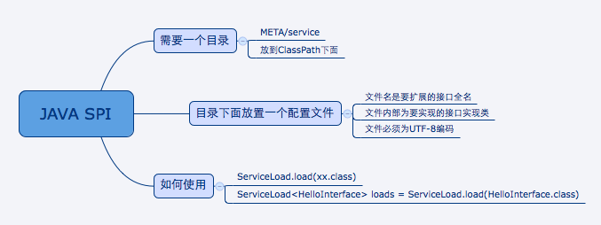
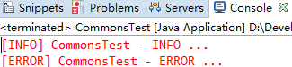
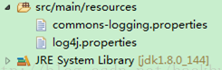
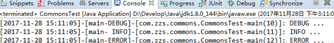

###  **dubbo 的 spi 思想是什么？** 

###### spi 是啥？

​	spi，简单来说，就是 `service provider interface`，说白了是什么意思呢，比如你有个接口，现在这个接口有 3 个实现类，那么在系统运行的时候对这个接口到底选择哪个实现类呢？这就需要 spi 了，需要**根据指定的配置**或者是**默认的配置**，去**找到对应的实现类**加载进来，然后用这个实现类的实例对象。

举个栗子。

​	你有一个接口 A。A1/A2/A3 分别是接口A的不同实现。你通过配置 `接口 A = 实现 A2`，那么在系统实际运行的时候，会加载你的配置，用实现 A2 实例化一个对象来提供服务。

​	spi 机制一般用在哪儿？**插件扩展的场景**，比如说你开发了一个给别人使用的开源框架，如果你想让别人自己写个插件，插到你的开源框架里面，从而扩展某个功能，这个时候 spi 思想就用上了。

###### Java spi 思想的体现

​	spi 经典的思想体现，大家平时都在用，比如说 jdbc。

​	Java 定义了一套 jdbc 的接口，但是 Java 并没有提供 jdbc 的实现类。

​	但是实际上项目跑的时候，要使用 jdbc 接口的哪些实现类呢？一般来说，我们要**根据自己使用的数据库**，比如 mysql，你就将 `mysql-jdbc-connector.jar` 引入进来；oracle，你就将 `oracle-jdbc-connector.jar` 引入进来。

​	在系统跑的时候，碰到你使用 jdbc 的接口，他会在底层使用你引入的那个 jar 中提供的实现类。

###### dubbo 的 spi 思想

​	dubbo 也用了 spi 思想，不过没有用 jdk 的 spi 机制，是自己实现的一套 spi 机制。

```java
Protocol protocol = ExtensionLoader.getExtensionLoader(Protocol.class).getAdaptiveExtension();Copy to clipboardErrorCopied
```

​	Protocol 接口，在系统运行的时候，，dubbo 会判断一下应该选用这个 Protocol 接口的哪个实现类来实例化对象来使用。

​	它会去找一个你配置的 Protocol，将你配置的 Protocol 实现类，加载到 jvm 中来，然后实例化对象，就用你的那个 Protocol 实现类就可以了。

​	上面那行代码就是 dubbo 里大量使用的，就是对很多组件，都是保留一个接口和多个实现，然后在系统运行的时候动态根据配置去找到对应的实现类。如果你没配置，那就走默认的实现好了，没问题。

```java
@SPI("dubbo")  
public interface Protocol {  

    int getDefaultPort();  

    @Adaptive  
    <T> Exporter<T> export(Invoker<T> invoker) throws RpcException;  

    @Adaptive  
    <T> Invoker<T> refer(Class<T> type, URL url) throws RpcException;  

    void destroy();  

}  Copy to clipboardErrorCopied
```

​	在 dubbo 自己的 jar 里，在`/META_INF/dubbo/internal/com.alibaba.dubbo.rpc.Protocol`文件中：

```xml
dubbo=com.alibaba.dubbo.rpc.protocol.dubbo.DubboProtocol
http=com.alibaba.dubbo.rpc.protocol.http.HttpProtocol
hessian=com.alibaba.dubbo.rpc.protocol.hessian.HessianProtocolCopy to clipboardErrorCopied
```

​	所以说，这就看到了 dubbo 的 spi 机制默认是怎么玩儿的了，其实就是 Protocol 接口，`@SPI("dubbo")` 说的是，通过 SPI 机制来提供实现类，实现类是通过 dubbo 作为默认 key 去配置文件里找到的，配置文件名称与接口全限定名一样的，通过 dubbo 作为 key 可以找到默认的实现类就是 `com.alibaba.dubbo.rpc.protocol.dubbo.DubboProtocol`。

​	如果想要动态替换掉默认的实现类，需要使用 `@Adaptive` 接口，Protocol 接口中，有两个方法加了 `@Adaptive` 注解，就是说那俩接口会被代理实现。

​	比如这个 Protocol 接口搞了俩 `@Adaptive` 注解标注了方法，在运行的时候会针对 Protocol 生成代理类，这个代理类的那俩方法里面会有代理代码，代理代码会在运行的时候动态根据 url 中的 protocol 来获取那个 key，默认是 dubbo，你也可以自己指定，你如果指定了别的 key，那么就会获取别的实现类的实例了。


# 1 SPI机制简介

SPI的全名为Service Provider Interface，这个是针对厂商或者插件的。在java.util.ServiceLoader的文档里有比较详细的介绍。简单的总结下java spi机制的思想。

系统里抽象的各个模块，往往有很多不同的实现方案，比如日志模块的方案，xml解析模块、jdbc模块的方案等。

面向的对象的设计里，我们一般推荐模块之间基于接口编程，模块之间不对实现类进行硬编码。一旦代码里涉及具体的实现类，就违反了可拔插的原则，如果需要替换一种实现，就需要修改代码。为了实现在模块装配的时候能不在程序里动态指明，这就需要一种服务发现机制。 java spi就是提供这样的一个机制：为某个接口寻找服务实现的机制。有点类似IOC的思想，就是将装配的控制权移到程序之外，在模块化设计中这个机制尤其重要。

# 2 SPI具体约定

java spi的具体约定为:

​    当服务的提供者，提供了服务接口的一种实现之后，在jar包的META-INF/services/目录里同时创建一个以服务接口命名的文件。

该文件里就是实现该服务接口的具体实现类。而当外部程序装配这个模块的时候，就能通过该jar包META-INF/services/里的配置文件找到具体的实现类名，并装载实例化，完成模块的注入。 基于这样一个约定就能很好的找到服务接口的实现类，而不需要再代码里制定。

jdk提供服务实现查找的一个工具类：java.util.ServiceLoader



# 3 应用场景

common-logging ：Jakarta  Commons-logging（JCL）是apache最早提供的日志的门面接口。只有接口，没有实现。具体方案由各提供商实现，提供简单的日志实现以及日志解耦功能。

JCL能够选择使用Log4j（或其他如slf4j等）还是JDK Logging，但是他不依赖Log4j，JDK Logging的API。如果项目的classpath中包含了log4j的类库，就会使用log4j，否则就使用JDK Logging。使用commons-logging能够灵活的选择使用那些日志方式，而且不需要修改源代码。（类似于JDBC的API接口）

原理：  
    JCL有两个基本的抽象类： Log( 基本记录器 ) 和 LogFactory( 负责创建 Log 实例 ) 。当 commons-logging.jar 被加入到 CLASSPATH之后，它会合理地猜测你想用的日志工具，然后进行自我设置，用户根本不需要做任何设置。默认的 LogFactory 是按照下列的步骤去发现并决定那个日志工具将被使用的（按照顺序，寻找过程会在找到第一个工具时中止） :

​    ①首先在classpath下寻找commons-logging.properties文件。如果找到，则使用其中定义的Log实现类；如果找不到，则在查找是否已定义系统环境变量org.apache.commons.logging.Log，找到则使用其定义的Log实现类；

​    ②查看classpath中是否有Log4j的包，如果发现，则自动使用Log4j作为日志实现类；

​    ③否则，使用JDK自身的日志实现类（JDK1.4以后才有日志实现类）；

​    ④否则，使用commons-logging自己提供的一个简单的日志实现类SimpleLog；

org.apache.commons.logging.Log 的具体实现有如下：

>     ---org.apache.commons.logging.impl.Jdk14Logger 　使用 JDK1.4 。
>
>     ---org.apache.commons.logging.impl.Log4JLogger 　使用 Log4J 。
>
>     ---org.apache.commons.logging.impl.LogKitLogger    使用 avalon-Logkit 。
>
>     ---org.apache.commons.logging.impl.SimpleLog 　    common-logging 自带日志实现类。
>
>     ---org.apache.commons.logging.impl.NoOpLog          common-logging 自带日志实现类。它实现了 Log 接口。 其输出日志的方法中不进行任何操作。

Maven依赖：

> <dependency>  
>  <groupId>commons-logging</groupId>  
>  <artifactId>commons-logging</artifactId>  
>  <version>1.2</version>  
> </dependency>

一、Commons-logging简单日志实现：  
    ①新建commons-logging.properties文件，放置在classpath根路径下：


> org.apache.commons.logging.Log=org.apache.commons.logging.impl.SimpleLog

​    ②代码中使用

> import org.apache.commons.logging.Log;  
> import org.apache.commons.logging.LogFactory;  
>
> public class CommonsTest {  
>  private final static Log logger = LogFactory.getLog(CommonsTest.class);  
>
>  public static void main(String\[\] args) {  
>      logger.debug("DEBUG ...");  
>      logger.info("INFO ...");  
>      logger.error("ERROR ...");  
>  }  
> }

​    输出：



二、Commons-logging的解耦功能：

commons-logging最核心有用的功能是解耦，它的SimpleLog实现性能比不上其他实现，如log4j等。 

​    ①添加依赖

> <dependency>  
>  <groupId>commons-logging</groupId>  
>  <artifactId>commons-logging</artifactId>  
>  <version>1.2</version>  
> </dependency>  
> <dependency>  
>  <groupId>log4j</groupId>  
>  <artifactId>log4j</artifactId>  
>  <version>1.2.17</version>  
> </dependency>

​    ②修改配置文件：

​    修改commons-logging.properties文件：显示地指定log4j



> org.apache.commons.logging.Log=org.apache.commons.logging.impl.Log4JLogger

​    并添加log4j.properties的配置文件：

> log4j.rootLogger=DEBUG,console
>
> \# 输出到控制台  
> log4j.appender.console=org.apache.log4j.ConsoleAppender  
> \# 设置输出样式      
> log4j.appender.console.layout=org.apache.log4j.PatternLayout  
> \# 日志输出信息格式为     
> log4j.appender.console.layout.ConversionPattern=\[%-d{yyyy-MM-dd HH:mm:ss}\]-\[%t-%5p\]-\[%C-%M(%L)\]: %m%n

​    ③代码中使用

> import org.apache.commons.logging.Log;  
> import org.apache.commons.logging.LogFactory;  
>
> public class CommonsTest {  
>  private final static Log logger = LogFactory.getLog(CommonsTest.class);  
>
>  public static void main(String\[\] args) {  
>      logger.debug("DEBUG ...");  
>      logger.info("INFO ...");  
>      logger.error("ERROR ...");  
>  }  
> }

​    输出：



# 4 案例说明

接口定义如：

```java
import java.util.List;

/**
 * 定义一个dog的接口
 *
 */
public interface DogService {
    void sleep();
}
```

​    A公司实现的类  BlackDogServiceImpl 

```java
import com.ming.spi.service.DogService;

public class BlackDogServiceImpl implements DogService{
    @Override
    public void sleep() {
        System.out.println("黑色dog。。。汪汪叫，不睡觉...");
    }
}
```

​    B公司实现的类 WhilteDogServiceImpl 

```java
import com.ming.spi.service.DogService;

public class WhilteDogServiceImpl implements DogService{
    @Override
    public void sleep() {
        System.out.println("白色dog。。。呼呼大睡觉...");
    }
}
```

那么A公司发布 实现jar包时，则要在jar包中META-INF/services/my.xyz.spi.Search文件中写下如下内容：

com.ming.spi.service.imp.BlackDogServiceImpl

那么B公司发布 实现jar包时，则要在jar包中META-INF/services/my.xyz.spi.Search文件中写下如下内容：

com.ming.spi.service.imp.WhilteDogServiceImpl

测试代码：

```java
import java.util.ServiceLoader;

public class Test {
    public static void main(String[] args) throws Exception {
        ServiceLoader<DogService> loaders = ServiceLoader.load(DogService.class);
        for (DogService d : loaders) {
            d.sleep();
        }
    }
}
```

#### **ServiceLoader缺点分析**

-   虽然ServiceLoader也算是使用的延迟加载，但是基本只能通过遍历全部获取，也就是接口的实现类全部加载并实例化一遍。如果你并不想用某些实现类，它也被加载并实例化了，这就造成了浪费。
    
-   获取某个实现类的方式不够灵活，只能通过Iterator形式获取，不能根据某个参数来获取对应的实现类