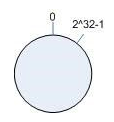
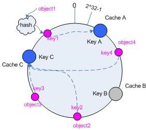

###  dubbo 负载均衡策略和集群容错策略都有哪些？动态代理策略呢？ 

##### dubbo 负载均衡策略

###### random loadbalance

​	默认情况下，dubbo 是 random load balance ，即**随机**调用实现负载均衡，可以对 provider 不同实例**设置不同的权重**，会按照权重来负载均衡，权重越大分配流量越高，一般就用这个默认的就可以了。

###### roundrobin loadbalance

​	这个的话默认就是均匀地将流量打到各个机器上去，但是如果各个机器的性能不一样，容易导致性能差的机器负载过高。所以此时需要调整权重，让性能差的机器承载权重小一些，流量少一些。

举个栗子。

​	跟运维同学申请机器，有的时候，我们运气好，正好公司资源比较充足，刚刚有一批热气腾腾、刚刚做好的虚拟机新鲜出炉，配置都比较高：8 核 + 16G 机器，申请到 2 台。过了一段时间，我们感觉 2 台机器有点不太够，我就去找运维同学说，“哥儿们，你能不能再给我一台机器”，但是这时只剩下一台 4 核 + 8G 的机器。我要还是得要。

​	这个时候，可以给两台 8 核 16G 的机器设置权重 4，给剩余 1 台 4 核 8G 的机器设置权重 2。

###### leastactive loadbalance

​	这个就是自动感知一下，如果某个机器性能越差，那么接收的请求越少，越不活跃，此时就会给**不活跃的性能差的机器更少的请求**。

###### consistanthash loadbalance

​	一致性 Hash 算法，相同参数的请求一定分发到一个 provider 上去，provider 挂掉的时候，会基于虚拟节点均匀分配剩余的流量，抖动不会太大。**如果你需要的不是随机负载均衡**，是要一类请求都到一个节点，那就走这个一致性 Hash 策略。

### dubbo 集群容错策略

###### failover cluster 模式

​	失败自动切换，自动重试其他机器，**默认**就是这个，常见于读操作。（失败重试其它机器）

​	可以通过以下几种方式配置重试次数：

```xml
<dubbo:service retries="2" />Copy to clipboardErrorCopied
```

​	或者

```xml
<dubbo:reference retries="2" />Copy to clipboardErrorCopied
```

​	或者

```xml
<dubbo:reference>
    <dubbo:method name="findFoo" retries="2" />
</dubbo:reference>Copy to clipboardErrorCopied
```

###### failfast cluster 模式

​	一次调用失败就立即失败，常见于非幂等性的写操作，比如新增一条记录（调用失败就立即失败）

#### [failsafe cluster 模式](https://doocs.github.io/advanced-java/#/./docs/distributed-system/dubbo-load-balancing?id=failsafe-cluster-模式)

​	出现异常时忽略掉，常用于不重要的接口调用，比如记录日志。

​	配置示例如下：

```xml
<dubbo:service cluster="failsafe" />Copy to clipboardErrorCopied
```

​	或者

```xml
<dubbo:reference cluster="failsafe" />Copy to clipboardErrorCopied
```

#### failback cluster 模式

​	失败了后台自动记录请求，然后定时重发，比较适合于写消息队列这种。

#### [forking cluster 模式](https://doocs.github.io/advanced-java/#/./docs/distributed-system/dubbo-load-balancing?id=forking-cluster-模式)

​	**并行调用**[多个]() provider，只要一个成功就立即返回。常用于实时性要求比较高的读操作，但是会浪费更多的服务资源，可通过 `forks="2"` 来设置最大并行数。

###### broadcacst cluster

​	逐个调用所有的 provider。任何一个 provider 出错则报错（从`2.1.0` 版本开始支持）。通常用于通知所有提供者更新缓存或日志等本地资源信息。

###### dubbo动态代理策略

​	默认使用 javassist 动态字节码生成，创建代理类。但是可以通过 spi 扩展机制配置自己的动态代理策略。


在集群负载均衡时，Dubbo提供了4种均衡策略，如：

-       Random LoadBalance(随机均衡算法)；
-       RoundRobin LoadBalance(权重轮循均衡算法);
-       LeastActive LoadBalance(最少活跃调用数均衡算法);
-       ConsistentHash LoadBalance(一致性Hash均衡算法)。

    缺省时为Random随机调用。

    这四种算法的原理简要介绍如下：

## 1、RoundRobin LoadBalance

Round-Robin既是轮询算法，是按照公约后的权重设置轮询比率，即权重轮询算法(Weighted Round-Robin) ，它是基于轮询算法改进而来的。这里之所以写RoundRobin是为了跟Dubbo中的内容保持一致。

轮询调度算法的原理是：每一次把来自用户的请求轮流分配给内部中的服务器。如：从1开始，一直到N(其中，N是内部服务器的总个数)，然后重新开始循环。

该算法的优点：

>     其简洁性，它无需记录当前所有连接的状态，所以它是一种无状态调度。

该算法的缺点：

>     轮询调度算法假设所有服务器的处理性能都相同，不关心每台服务器的当前连接数和响应速度。当请求服务间隔时间变化比较大时，轮询调度算法容易导致服务器间的负载不平衡。

所以此种均衡算法适合于服务器组中的所有服务器都有相同的软硬件配置并且平均服务请求相对均衡的情况。但是，在实际情况中，可能并不是这种情况。由于每台服务器的配置、安装的业务应用等不同，其处理能力会不一样。所以，我们根据服务器的不同处理能力，给每个服务器分配不同的权值，使其能够接受相应权值数的服务请求。

**权重轮询调度算法流程**

假设有一组服务器S = {S0, S1, …, Sn-1}，W(Si)表示服务器Si的权值，一个指示变量i表示上一次选择的服务器，指示变量cw表示当前调度的权值，max(S)表示集合S中所有服务器的最大权值，gcd(S)表示集合S中所有服务器权值的最大公约数。变量i初始化为-1，cw初始化为零。其算法如下：

```java
        while (true) {
			i = (i + 1) mod n;
			if (i == 0) {
				cw = cw - gcd(S);
				if (cw <= 0) {
					cw = max(S);
					if (cw == 0)
						return NULL;
				}
			}
			if (W(Si) >= cw)
				return Si;
		}
```

这种算法的逻辑实现如图2所示，图中我们假定四台服务器的处理能力为3:1:1:1。


    由于权重轮询调度算法考虑到了不同服务器的处理能力，所以这种均衡算法能确保高性能的服务器得到更多的使用率，避免低性能的服务器负载过重。所以，在实际应用中比较常见。

## 2、ConsistentHash LoadBalance

    一致性Hash，相同参数的请求总是发到同一个提供者。

1.  一致性Hash算法可以解决服务提供者的增加、移除及挂掉时的情况，能尽可能小的改变已存在 key 映射关系，尽可能的满足单调性的要求。
2.  一致性Hash通过构建虚拟节点，能尽可能避免分配失衡，具有很好的平衡性。

    一致性Hash下面就来按照 5 个步骤简单讲讲 consistent hash算法的基本原理。

    说明：下面例子中的对象就相当于Client发的请求，cache相当于服务提供者。

**环形hash空间**

    考虑通常的hash 算法都是将 value 映射到一个 32 为的 key 值，也即是 0~2^32-1 次方的数值空间；我们可以将这个空间想象成一个首(0)尾(2^32-1)相接的圆环。



**把对象映射到hash****空间**

    接下来考虑4个对象 object1~object4，通过 hash 函数计算出的 hash 值 key 在环上的分布如图所示。

> hash(object1) = key1;
>
> … …
>
> hash(object4) = key4;


**把cache****映射到****hash****空间**

    Consistent hashing 的基本思想就是将对象和 cache 都映射到同一个 hash 数值空间中，并且使用相同的hash算法。
    
    假设当前有A,B和C 共3台cache，那么其映射结果将如图所示，他们在 hash 空间中，以对应的 hash 值排列。

> hash(cache A) = key A;
>
> … …
>
> hash(cache C) = key C;


    cache 的 hash 计算，一般的方法可以使用 cache 机器的 IP 地址或者机器名作为 hash输入。

**把对象映射到cache**

现在 cache 和对象都已经通过同一个 hash 算法映射到 hash 数值空间中了，接下来要考虑的就是如何将对象映射到 cache上面了。

在这个环形空间中，如果沿着顺时针方向从对象的 key 值出发，直到遇见一个 cache ，那么就将该对象存储在这个 cache 上，因为对象和 cache 的 hash 值是固定的，因此这个 cache 必然是唯一和确定的。这样不就找到了对象和 cache 的映射方法了吗！

依然继续上面的例子（参见图 4 ），那么根据上面的方法，对象 object1 将被存储到 cache A 上； object2 和object3 对应到 cache C ； object4 对应到 cache B ；

**考察cache的变动**

    前面讲过，一致性Hash算法可以解决服务提供者的增加、移除及挂掉时的情况，能尽可能小的改变已存在 key 映射关系，尽可能的满足单调性的要求。

**移除cache**

    考虑假设 cache B 挂掉了，根据上面讲到的映射方法，这时受影响的将仅是那些沿 cache B 逆时针遍历直到下一个 cache （ cache C ）之间的对象，也即是本来映射到 cache B 上的那些对象。
    
    因此这里仅需要变动对象 object4 ，将其重新映射到 cache C 上即可.



**添加cache**

再考虑添加一台新的 cache D 的情况，假设在这个环形 hash 空间中， cache D 被映射在对象 object2 和object3 之间。这时受影响的将仅是那些沿 cache D 逆时针遍历直到下一个 cache （ cache B ）之间的对象（它们是也本来映射到 cache C 上对象的一部分），将这些对象重新映射到 cache D 上即可。

因此这里仅需要变动对象 object2 ，将其重新映射到 cache D 上 。


**虚拟节点**

考虑Hash 算法的另一个指标是平衡性 (Balance) ，定义如下：

平衡性是指哈希的结果能够尽可能分布到所有的缓冲中去，这样可以使得所有的缓冲空间都得到利用。

hash 算法并不是保证绝对的平衡，如果 cache 较少的话，对象并不能被均匀的映射到 cache 上，比如在上面的例子中，仅部署 cache A 和 cache C 的情况下，在 4 个对象中， cache A 仅存储了 object1 ，而 cache C 则存储了object2 、 object3 和 object4 ；分布是很不均衡的。

为了解决这种情况， consistent hashing 引入了“虚拟节点”的概念，它可以如下定义：

“虚拟节点”（ virtual node ）是实际节点在 hash 空间的复制品（ replica ），一实际个节点对应了若干个“虚拟节点”，这个对应个数也成为“复制个数”，“虚拟节点”在 hash 空间中以 hash 值排列。

仍以仅部署 cache A 和 cache C 的情况为例，在图 5 中我们已经看到， cache 分布并不均匀。现在我们引入虚拟节点，并设置“复制个数”为 2 ，这就意味着一共会存在 4 个“虚拟节点”， cache A1, cache A2 代表了cache A ； cache C1, cache C2 代表了 cache C ；假设一种比较理想的情况 。


此时，对象到“虚拟节点”的映射关系为：

objec1->cache A2 ； objec2->cache A1 ； objec3->cache C1 ； objec4->cache C2 ；

因此对象 object1 和 object2 都被映射到了 cache A 上，而 object3 和 object4 映射到了 cache C 上；平衡性有了很大提高。

引入“虚拟节点”后，映射关系就从 { 对象 -> 节点 } 转换到了 { 对象 -\> 虚拟节点 } 。查询物体所在 cache 时的映射关系如图所示。


“虚拟节点”的 hash 计算可以采用对应节点的 IP 地址加数字后缀的方式。例如假设 cache A 的 IP 地址为202.168.14.241 。

引入“虚拟节点”前，计算 cache A 的 hash 值：

> Hash(“202.168.14.241”);

引入“虚拟节点”后，计算“虚拟节”点 cache A1 和 cache A2 的 hash 值：

> Hash(“202.168.14.241#1”); // cache A1
>
> Hash(“202.168.14.241#2”); // cache A2

## 3、Random LoadBalance与LeastActive LoadBalance

RandomLoadBalance 是加权随机算法的具体实现，它的算法思想很简单。

假设我们有一组服务器 servers = \[A, B, C\]，他们对应的权重为 weights = \[5, 3, 2\]，权重总和为10。现在把这些权重值平铺在一维坐标值上，\[0, 5) 区间属于服务器 A，\[5, 8) 区间属于服务器 B，\[8, 10) 区间属于服务器 C。接下来通过随机数生成器生成一个范围在 \[0, 10) 之间的随机数，然后计算这个随机数会落到哪个区间上。比如数字3会落到服务器 A 对应的区间上，此时返回服务器 A 即可。权重越大的机器，在坐标轴上对应的区间范围就越大，因此随机数生成器生成的数字就会有更大的概率落到此区间内。只要随机数生成器产生的随机数分布性很好，在经过多次选择后，每个服务器被选中的次数比例接近其权重比例。比如，经过一万次选择后，服务器 A 被选中的次数大约为5000次，服务器 B 被选中的次数约为3000次，服务器 C 被选中的次数约为2000次。

 LeastActiveLoadBalance 翻译过来是最小活跃数负载均衡。

活跃调用数越小，表明该服务提供者效率越高，单位时间内可处理更多的请求。此时应优先将请求分配给该服务提供者。在具体实现中，每个服务提供者对应一个活跃数 active。初始情况下，所有服务提供者活跃数均为0。每收到一个请求，活跃数加1，完成请求后则将活跃数减1。在服务运行一段时间后，性能好的服务提供者处理请求的速度更快，因此活跃数下降的也越快，此时这样的服务提供者能够优先获取到新的服务请求、这就是最小活跃数负载均衡算法的基本思想。除了最小活跃数，LeastActiveLoadBalance 在实现上还引入了权重值。所以准确的来说，LeastActiveLoadBalance 是基于加权最小活跃数算法实现的。举个例子说明一下，在一个服务提供者集群中，有两个性能优异的服务提供者。某一时刻它们的活跃数相同，此时 Dubbo 会根据它们的权重去分配请求，权重越大，获取到新请求的概率就越大。如果两个服务提供者权重相同，此时随机选择一个即可。

Random LoadBalance与LeastActive LoadBalance算法比较简单，可以参照Dubbo文档中的给的描述及后面代码附录。

## 4、附录

在 Dubbo 中，所有负载均衡实现类均继承自 AbstractLoadBalance，该类实现了 LoadBalance 接口，并封装了一些公共的逻辑。所以在分析负载均衡实现之前，先来看一下 AbstractLoadBalance 的逻辑。首先来看一下负载均衡的入口方法 select，如下：

```java
@Override
public <T> Invoker<T> select(List<Invoker<T>> invokers, URL url, Invocation invocation) {
    if (invokers == null || invokers.isEmpty())
        return null;
    // 如果 invokers 列表中仅有一个 Invoker，直接返回即可，无需进行负载均衡
    if (invokers.size() == 1)
        return invokers.get(0);
    
    // 调用 doSelect 方法进行负载均衡，该方法为抽象方法，由子类实现
    return doSelect(invokers, url, invocation);
}

protected abstract <T> Invoker<T> doSelect(List<Invoker<T>> invokers, URL url, Invocation invocation);
```

select 方法的逻辑比较简单，首先会检测 invokers 集合的合法性，然后再检测 invokers 集合元素数量。如果只包含一个 Invoker，直接返回该 Inovker 即可。如果包含多个 Invoker，此时需要通过负载均衡算法选择一个 Invoker。具体的负载均衡算法由子类实现。

AbstractLoadBalance 除了实现了 LoadBalance 接口方法，还封装了一些公共逻辑，比如服务提供者权重计算逻辑。具体实现如下:

```java
protected int getWeight(Invoker<?> invoker, Invocation invocation) {
    // 从 url 中获取权重 weight 配置值
    int weight = invoker.getUrl().getMethodParameter(invocation.getMethodName(), Constants.WEIGHT_KEY, Constants.DEFAULT_WEIGHT);
    if (weight > 0) {
        // 获取服务提供者启动时间戳
        long timestamp = invoker.getUrl().getParameter(Constants.REMOTE_TIMESTAMP_KEY, 0L);
        if (timestamp > 0L) {
            // 计算服务提供者运行时长
            int uptime = (int) (System.currentTimeMillis() - timestamp);
            // 获取服务预热时间，默认为10分钟
            int warmup = invoker.getUrl().getParameter(Constants.WARMUP_KEY, Constants.DEFAULT_WARMUP);
            // 如果服务运行时间小于预热时间，则重新计算服务权重，即降权
            if (uptime > 0 && uptime < warmup) {
                // 重新计算服务权重
                weight = calculateWarmupWeight(uptime, warmup, weight);
            }
        }
    }
    return weight;
}

static int calculateWarmupWeight(int uptime, int warmup, int weight) {
    // 计算权重，下面代码逻辑上形似于 (uptime / warmup) * weight。
    // 随着服务运行时间 uptime 增大，权重计算值 ww 会慢慢接近配置值 weight
    int ww = (int) ((float) uptime / ((float) warmup / (float) weight));
    return ww < 1 ? 1 : (ww > weight ? weight : ww);
}
```

上面是权重的计算过程，该过程主要用于保证当服务运行时长小于服务预热时间时，对服务进行降权，避免让服务在启动之初就处于高负载状态。服务预热是一个优化手段，与此类似的还有 JVM 预热。主要目的是让服务启动后“低功率”运行一段时间，使其效率慢慢提升至最佳状态。

关于 AbstractLoadBalance 就先分析到这，接下来分析各个实现类的代码。

#### 1、RandomLoadBalance算法

```java
public class RandomLoadBalance extends AbstractLoadBalance {

    public static final String NAME = "random";

    private final Random random = new Random();

    @Override
    protected <T> Invoker<T> doSelect(List<Invoker<T>> invokers, URL url, Invocation invocation) {
        int length = invokers.size();
        int totalWeight = 0;
        boolean sameWeight = true;
        // 下面这个循环有两个作用，第一是计算总权重 totalWeight，
        // 第二是检测每个服务提供者的权重是否相同
        for (int i = 0; i < length; i++) {
            int weight = getWeight(invokers.get(i), invocation);
            // 累加权重
            totalWeight += weight;
            // 检测当前服务提供者的权重与上一个服务提供者的权重是否相同，
            // 不相同的话，则将 sameWeight 置为 false。
            if (sameWeight && i > 0
                    && weight != getWeight(invokers.get(i - 1), invocation)) {
                sameWeight = false;
            }
        }
        
        // 下面的 if 分支主要用于获取随机数，并计算随机数落在哪个区间上
        if (totalWeight > 0 && !sameWeight) {
            // 随机获取一个 [0, totalWeight) 区间内的数字
            int offset = random.nextInt(totalWeight);
            // 循环让 offset 数减去服务提供者权重值，当 offset 小于0时，返回相应的 Invoker。
            // 举例说明一下，我们有 servers = [A, B, C]，weights = [5, 3, 2]，offset = 7。
            // 第一次循环，offset - 5 = 2 > 0，即 offset > 5，
            // 表明其不会落在服务器 A 对应的区间上。
            // 第二次循环，offset - 3 = -1 < 0，即 5 < offset < 8，
            // 表明其会落在服务器 B 对应的区间上
            for (int i = 0; i < length; i++) {
                // 让随机值 offset 减去权重值
                offset -= getWeight(invokers.get(i), invocation);
                if (offset < 0) {
                    // 返回相应的 Invoker
                    return invokers.get(i);
                }
            }
        }
        
        // 如果所有服务提供者权重值相同，此时直接随机返回一个即可
        return invokers.get(random.nextInt(length));
    }
}
```

#### 2、RoundRobinLoadBalance算法

```java
public class RoundRobinLoadBalance extends AbstractLoadBalance {

    public static final String NAME = "roundrobin";

    private final ConcurrentMap<String, AtomicPositiveInteger> sequences = new ConcurrentHashMap<String, AtomicPositiveInteger>();

    private final ConcurrentMap<String, AtomicPositiveInteger> indexSeqs = new ConcurrentHashMap<String, AtomicPositiveInteger>();

    @Override
    protected <T> Invoker<T> doSelect(List<Invoker<T>> invokers, URL url, Invocation invocation) {
        String key = invokers.get(0).getUrl().getServiceKey() + "." + invocation.getMethodName();
        int length = invokers.size();
        int maxWeight = 0;
        int minWeight = Integer.MAX_VALUE;
        final List<Invoker<T>> invokerToWeightList = new ArrayList<>();
        
        // 查找最大和最小权重
        for (int i = 0; i < length; i++) {
            int weight = getWeight(invokers.get(i), invocation);
            maxWeight = Math.max(maxWeight, weight);
            minWeight = Math.min(minWeight, weight);
            if (weight > 0) {
                invokerToWeightList.add(invokers.get(i));
            }
        }
        
        // 获取当前服务对应的调用序列对象 AtomicPositiveInteger
        AtomicPositiveInteger sequence = sequences.get(key);
        if (sequence == null) {
            // 创建 AtomicPositiveInteger，默认值为0
            sequences.putIfAbsent(key, new AtomicPositiveInteger());
            sequence = sequences.get(key);
        }
        
        // 获取下标序列对象 AtomicPositiveInteger
        AtomicPositiveInteger indexSeq = indexSeqs.get(key);
        if (indexSeq == null) {
            // 创建 AtomicPositiveInteger，默认值为 -1
            indexSeqs.putIfAbsent(key, new AtomicPositiveInteger(-1));
            indexSeq = indexSeqs.get(key);
        }

        if (maxWeight > 0 && minWeight < maxWeight) {
            length = invokerToWeightList.size();
            while (true) {
                int index = indexSeq.incrementAndGet() % length;
                int currentWeight = sequence.get() % maxWeight;

                // 每循环一轮（index = 0），重新计算 currentWeight
                if (index == 0) {
                    currentWeight = sequence.incrementAndGet() % maxWeight;
                }
                
                // 检测 Invoker 的权重是否大于 currentWeight，大于则返回
                if (getWeight(invokerToWeightList.get(index), invocation) > currentWeight) {
                    return invokerToWeightList.get(index);
                }
            }
        }
        
        // 所有 Invoker 权重相等，此时进行普通的轮询即可
        return invokers.get(sequence.incrementAndGet() % length);
    }
}
```

上面代码的逻辑是这样的，每进行一轮循环，重新计算 currentWeight。如果当前 Invoker 权重大于 currentWeight，则返回该 Invoker。下面举例说明，假设服务器 \[A, B, C\] 对应权重 \[5, 2, 1\]。

-   第一轮循环，currentWeight = 1，可返回 A 和 B
-   第二轮循环，currentWeight = 2，返回 A
-   第三轮循环，currentWeight = 3，返回 A
-   第四轮循环，currentWeight = 4，返回 A
-   第五轮循环，currentWeight = 0，返回 A, B, C

    如上，这里的一轮循环是指 index 再次变为0所经历过的循环，这里可以把 index = 0 看做是一轮循环的开始。每一轮循环的次数与 Invoker 的数量有关，Invoker 数量通常不会太多，所以我们可以认为上面代码的时间复杂度为常数级。

    重构后的 RoundRobinLoadBalance 看起来已经很不错了，但是在代码更新不久后，很快又被重构了。这次重构原因是新的 RoundRobinLoadBalance 在某些情况下选出的服务器序列不够均匀。比如，服务器 \[A, B, C\] 对应权重 \[5, 1, 1\]。进行7次负载均衡后，选择出来的序列为 \[A, A, A, A, A, B, C\]。前5个请求全部都落在了服务器 A上，这将会使服务器 A 短时间内接收大量的请求，压力陡增。而 B 和 C 此时无请求，处于空闲状态。而我们期望的结果是这样的 \[A, A, B, A, C, A, A\]，不同服务器可以穿插获取请求。为了增加负载均衡结果的平滑性，社区再次对 RoundRobinLoadBalance 的实现进行了重构，这次重构参考自 Nginx 的平滑加权轮询负载均衡。每个服务器对应两个权重，分别为 weight 和 currentWeight。其中 weight 是固定的，currentWeight 会动态调整，初始值为0。当有新的请求进来时，遍历服务器列表，让它的 currentWeight 加上自身权重。遍历完成后，找到最大的 currentWeight，并将其减去权重总和，然后返回相应的服务器即可。

    上面描述不是很好理解，下面还是举例进行说明。这里仍然使用服务器 \[A, B, C\] 对应权重 \[5, 1, 1\] 的例子说明，现在有7个请求依次进入负载均衡逻辑，选择过程如下：

| 请求编号 | currentWeight 数组 | 选择结果 | 减去权重总和后的 currentWeight 数组 |
| -------- | ------------------ | -------- | ----------------------------------- |
| 1        | \[5, 1, 1\]        | A        | \[-2, 1, 1\]                        |
| 2        | \[3, 2, 2\]        | A        | \[-4, 2, 2\]                        |
| 3        | \[1, 3, 3\]        | B        | \[1, -4, 3\]                        |
| 4        | \[6, -3, 4\]       | A        | \[-1, -3, 4\]                       |
| 5        | \[4, -2, 5\]       | C        | \[4, -2, -2\]                       |
| 6        | \[9, -1, -1\]      | A        | \[2, -1, -1\]                       |
| 7        | \[7, 0, 0\]        | A        | \[0, 0, 0\]                         |

如上，经过平滑性处理后，得到的服务器序列为 \[A, A, B, A, C, A, A\]，相比之前的序列 \[A, A, A, A, A, B, C\]，分布性要好一些。初始情况下 currentWeight = \[0, 0, 0\]，第7个请求处理完后，currentWeight 再次变为 \[0, 0, 0\]。

以上就是平滑加权轮询的计算过程，接下来，我们来看看 Dubbo-2.6.5 是如何实现上面的计算过程的。

```java
public class RoundRobinLoadBalance extends AbstractLoadBalance {
    public static final String NAME = "roundrobin";
    
    private static int RECYCLE_PERIOD = 60000;
    
    protected static class WeightedRoundRobin {
        // 服务提供者权重
        private int weight;
        // 当前权重
        private AtomicLong current = new AtomicLong(0);
        // 最后一次更新时间
        private long lastUpdate;
        
        public void setWeight(int weight) {
            this.weight = weight;
            // 初始情况下，current = 0
            current.set(0);
        }
        public long increaseCurrent() {
            // current = current + weight；
            return current.addAndGet(weight);
        }
        public void sel(int total) {
            // current = current - total;
            current.addAndGet(-1 * total);
        }
    }

    // 嵌套 Map 结构，存储的数据结构示例如下：
    // {
    //     "UserService.query": {
    //         "url1": WeightedRoundRobin@123, 
    //         "url2": WeightedRoundRobin@456, 
    //     },
    //     "UserService.update": {
    //         "url1": WeightedRoundRobin@123, 
    //         "url2": WeightedRoundRobin@456,
    //     }
    // }
    // 最外层为服务类名 + 方法名，第二层为 url 到 WeightedRoundRobin 的映射关系。
    // 这里我们可以将 url 看成是服务提供者的 id
    private ConcurrentMap<String, ConcurrentMap<String, WeightedRoundRobin>> methodWeightMap = new ConcurrentHashMap<String, ConcurrentMap<String, WeightedRoundRobin>>();
    
    // 原子更新锁
    private AtomicBoolean updateLock = new AtomicBoolean();
    
    @Override
    protected <T> Invoker<T> doSelect(List<Invoker<T>> invokers, URL url, Invocation invocation) {
        String key = invokers.get(0).getUrl().getServiceKey() + "." + invocation.getMethodName();
        // 获取 url 到 WeightedRoundRobin 映射表，如果为空，则创建一个新的
        ConcurrentMap<String, WeightedRoundRobin> map = methodWeightMap.get(key);
        if (map == null) {
            methodWeightMap.putIfAbsent(key, new ConcurrentHashMap<String, WeightedRoundRobin>());
            map = methodWeightMap.get(key);
        }
        int totalWeight = 0;
        long maxCurrent = Long.MIN_VALUE;
        
        // 获取当前时间
        long now = System.currentTimeMillis();
        Invoker<T> selectedInvoker = null;
        WeightedRoundRobin selectedWRR = null;

        // 下面这个循环主要做了这样几件事情：
        //   1. 遍历 Invoker 列表，检测当前 Invoker 是否有
        //      相应的 WeightedRoundRobin，没有则创建
        //   2. 检测 Invoker 权重是否发生了变化，若变化了，
        //      则更新 WeightedRoundRobin 的 weight 字段
        //   3. 让 current 字段加上自身权重，等价于 current += weight
        //   4. 设置 lastUpdate 字段，即 lastUpdate = now
        //   5. 寻找具有最大 current 的 Invoker，以及 Invoker 对应的 WeightedRoundRobin，
        //      暂存起来，留作后用
        //   6. 计算权重总和
        for (Invoker<T> invoker : invokers) {
            String identifyString = invoker.getUrl().toIdentityString();
            WeightedRoundRobin weightedRoundRobin = map.get(identifyString);
            int weight = getWeight(invoker, invocation);
            if (weight < 0) {
                weight = 0;
            }
            
            // 检测当前 Invoker 是否有对应的 WeightedRoundRobin，没有则创建
            if (weightedRoundRobin == null) {
                weightedRoundRobin = new WeightedRoundRobin();
                // 设置 Invoker 权重
                weightedRoundRobin.setWeight(weight);
                // 存储 url 唯一标识 identifyString 到 weightedRoundRobin 的映射关系
                map.putIfAbsent(identifyString, weightedRoundRobin);
                weightedRoundRobin = map.get(identifyString);
            }
            // Invoker 权重不等于 WeightedRoundRobin 中保存的权重，说明权重变化了，此时进行更新
            if (weight != weightedRoundRobin.getWeight()) {
                weightedRoundRobin.setWeight(weight);
            }
            
            // 让 current 加上自身权重，等价于 current += weight
            long cur = weightedRoundRobin.increaseCurrent();
            // 设置 lastUpdate，表示近期更新过
            weightedRoundRobin.setLastUpdate(now);
            // 找出最大的 current 
            if (cur > maxCurrent) {
                maxCurrent = cur;
                // 将具有最大 current 权重的 Invoker 赋值给 selectedInvoker
                selectedInvoker = invoker;
                // 将 Invoker 对应的 weightedRoundRobin 赋值给 selectedWRR，留作后用
                selectedWRR = weightedRoundRobin;
            }
            
            // 计算权重总和
            totalWeight += weight;
        }

        // 对 <identifyString, WeightedRoundRobin> 进行检查，过滤掉长时间未被更新的节点。
        // 该节点可能挂了，invokers 中不包含该节点，所以该节点的 lastUpdate 长时间无法被更新。
        // 若未更新时长超过阈值后，就会被移除掉，默认阈值为60秒。
        if (!updateLock.get() && invokers.size() != map.size()) {
            if (updateLock.compareAndSet(false, true)) {
                try {
                    ConcurrentMap<String, WeightedRoundRobin> newMap = new ConcurrentHashMap<String, WeightedRoundRobin>();
                    // 拷贝
                    newMap.putAll(map);
                    
                    // 遍历修改，即移除过期记录
                    Iterator<Entry<String, WeightedRoundRobin>> it = newMap.entrySet().iterator();
                    while (it.hasNext()) {
                        Entry<String, WeightedRoundRobin> item = it.next();
                        if (now - item.getValue().getLastUpdate() > RECYCLE_PERIOD) {
                            it.remove();
                        }
                    }
                    
                    // 更新引用
                    methodWeightMap.put(key, newMap);
                } finally {
                    updateLock.set(false);
                }
            }
        }

        if (selectedInvoker != null) {
            // 让 current 减去权重总和，等价于 current -= totalWeight
            selectedWRR.sel(totalWeight);
            // 返回具有最大 current 的 Invoker
            return selectedInvoker;
        }
        
        // should not happen here
        return invokers.get(0);
    }
}

```

以上就是 Dubbo-2.6.5 版本的 RoundRobinLoadBalance，大家如果能够理解平滑加权轮询算法的计算过程，再配合代码中注释，理解上面的代码应该不难。

#### 3、LeastActionLoadBalance算法

```java
public class LeastActiveLoadBalance extends AbstractLoadBalance {

    public static final String NAME = "leastactive";

    private final Random random = new Random();

    @Override
    protected <T> Invoker<T> doSelect(List<Invoker<T>> invokers, URL url, Invocation invocation) {
        int length = invokers.size();
        // 最小的活跃数
        int leastActive = -1;
        // 具有相同“最小活跃数”的服务者提供者（以下用 Invoker 代称）数量
        int leastCount = 0; 
        // leastIndexs 用于记录具有相同“最小活跃数”的 Invoker 在 invokers 列表中的下标信息
        int[] leastIndexs = new int[length];
        int totalWeight = 0;
        // 第一个最小活跃数的 Invoker 权重值，用于与其他具有相同最小活跃数的 Invoker 的权重进行对比，
        // 以检测是否“所有具有相同最小活跃数的 Invoker 的权重”均相等
        int firstWeight = 0;
        boolean sameWeight = true;

        // 遍历 invokers 列表
        for (int i = 0; i < length; i++) {
            Invoker<T> invoker = invokers.get(i);
            // 获取 Invoker 对应的活跃数
            int active = RpcStatus.getStatus(invoker.getUrl(), invocation.getMethodName()).getActive();
            // 获取权重 - ⭐️
            int weight = invoker.getUrl().getMethodParameter(invocation.getMethodName(), Constants.WEIGHT_KEY, Constants.DEFAULT_WEIGHT);
            // 发现更小的活跃数，重新开始
            if (leastActive == -1 || active < leastActive) {
            	// 使用当前活跃数 active 更新最小活跃数 leastActive
                leastActive = active;
                // 更新 leastCount 为 1
                leastCount = 1;
                // 记录当前下标值到 leastIndexs 中
                leastIndexs[0] = i;
                totalWeight = weight;
                firstWeight = weight;
                sameWeight = true;

            // 当前 Invoker 的活跃数 active 与最小活跃数 leastActive 相同 
            } else if (active == leastActive) {
            	// 在 leastIndexs 中记录下当前 Invoker 在 invokers 集合中的下标
                leastIndexs[leastCount++] = i;
                // 累加权重
                totalWeight += weight;
                // 检测当前 Invoker 的权重与 firstWeight 是否相等，
                // 不相等则将 sameWeight 置为 false
                if (sameWeight && i > 0
                    && weight != firstWeight) {
                    sameWeight = false;
                }
            }
        }
        
        // 当只有一个 Invoker 具有最小活跃数，此时直接返回该 Invoker 即可
        if (leastCount == 1) {
            return invokers.get(leastIndexs[0]);
        }

        // 有多个 Invoker 具有相同的最小活跃数，但它们之间的权重不同
        if (!sameWeight && totalWeight > 0) {
        	// 随机生成一个 [0, totalWeight) 之间的数字
            int offsetWeight = random.nextInt(totalWeight);
            // 循环让随机数减去具有最小活跃数的 Invoker 的权重值，
            // 当 offset 小于等于0时，返回相应的 Invoker
            for (int i = 0; i < leastCount; i++) {
                int leastIndex = leastIndexs[i];
                // 获取权重值，并让随机数减去权重值 - ⭐️
                offsetWeight -= getWeight(invokers.get(leastIndex), invocation);
                if (offsetWeight <= 0)
                    return invokers.get(leastIndex);
            }
        }
        // 如果权重相同或权重为0时，随机返回一个 Invoker
        return invokers.get(leastIndexs[random.nextInt(leastCount)]);
    }
}
```

1.  遍历 invokers 列表，寻找活跃数最小的 Invoker
2.  如果有多个 Invoker 具有相同的最小活跃数，此时记录下这些 Invoker 在 invokers 集合中的下标，并累加它们的权重，比较它们的权重值是否相等
3.  如果只有一个 Invoker 具有最小的活跃数，此时直接返回该 Invoker 即可
4.  如果有多个 Invoker 具有最小活跃数，且它们的权重不相等，此时处理方式和 RandomLoadBalance 一致
5.  如果有多个 Invoker 具有最小活跃数，但它们的权重相等，此时随机返回一个即可

    以上就是 LeastActiveLoadBalance 大致的实现逻辑.

#### 4、ConsistentHashLoadBalance算法

```java
public class ConsistentHashLoadBalance extends AbstractLoadBalance {

    private final ConcurrentMap<String, ConsistentHashSelector<?>> selectors = 
        new ConcurrentHashMap<String, ConsistentHashSelector<?>>();

    @Override
    protected <T> Invoker<T> doSelect(List<Invoker<T>> invokers, URL url, Invocation invocation) {
        String methodName = RpcUtils.getMethodName(invocation);
        String key = invokers.get(0).getUrl().getServiceKey() + "." + methodName;

        // 获取 invokers 原始的 hashcode
        int identityHashCode = System.identityHashCode(invokers);
        ConsistentHashSelector<T> selector = (ConsistentHashSelector<T>) selectors.get(key);
        // 如果 invokers 是一个新的 List 对象，意味着服务提供者数量发生了变化，可能新增也可能减少了。
        // 此时 selector.identityHashCode != identityHashCode 条件成立
        if (selector == null || selector.identityHashCode != identityHashCode) {
            // 创建新的 ConsistentHashSelector
            selectors.put(key, new ConsistentHashSelector<T>(invokers, methodName, identityHashCode));
            selector = (ConsistentHashSelector<T>) selectors.get(key);
        }

        // 调用 ConsistentHashSelector 的 select 方法选择 Invoker
        return selector.select(invocation);
    }
    
    private static final class ConsistentHashSelector<T> {...}
}
```

如上，doSelect 方法主要做了一些前置工作，比如检测 invokers 列表是不是变动过，以及创建 ConsistentHashSelector。这些工作做完后，接下来开始调用 ConsistentHashSelector 的 select 方法执行负载均衡逻辑。在分析 select 方法之前，我们先来看一下一致性 hash 选择器 ConsistentHashSelector 的初始化过程，如下:

```java
private static final class ConsistentHashSelector<T> {

    // 使用 TreeMap 存储 Invoker 虚拟节点
    private final TreeMap<Long, Invoker<T>> virtualInvokers;

    private final int replicaNumber;

    private final int identityHashCode;

    private final int[] argumentIndex;

    ConsistentHashSelector(List<Invoker<T>> invokers, String methodName, int identityHashCode) {
        this.virtualInvokers = new TreeMap<Long, Invoker<T>>();
        this.identityHashCode = identityHashCode;
        URL url = invokers.get(0).getUrl();
        // 获取虚拟节点数，默认为160
        this.replicaNumber = url.getMethodParameter(methodName, "hash.nodes", 160);
        // 获取参与 hash 计算的参数下标值，默认对第一个参数进行 hash 运算
        String[] index = Constants.COMMA_SPLIT_PATTERN.split(url.getMethodParameter(methodName, "hash.arguments", "0"));
        argumentIndex = new int[index.length];
        for (int i = 0; i < index.length; i++) {
            argumentIndex[i] = Integer.parseInt(index[i]);
        }
        for (Invoker<T> invoker : invokers) {
            String address = invoker.getUrl().getAddress();
            for (int i = 0; i < replicaNumber / 4; i++) {
                // 对 address + i 进行 md5 运算，得到一个长度为16的字节数组
                byte[] digest = md5(address + i);
                // 对 digest 部分字节进行4次 hash 运算，得到四个不同的 long 型正整数
                for (int h = 0; h < 4; h++) {
                    // h = 0 时，取 digest 中下标为 0 ~ 3 的4个字节进行位运算
                    // h = 1 时，取 digest 中下标为 4 ~ 7 的4个字节进行位运算
                    // h = 2, h = 3 时过程同上
                    long m = hash(digest, h);
                    // 将 hash 到 invoker 的映射关系存储到 virtualInvokers 中，
                    // virtualInvokers 需要提供高效的查询操作，因此选用 TreeMap 作为存储结构
                    virtualInvokers.put(m, invoker);
                }
            }
        }
    }
}
```

ConsistentHashSelector 的构造方法执行了一系列的初始化逻辑，比如从配置中获取虚拟节点数以及参与 hash 计算的参数下标，默认情况下只使用第一个参数进行 hash。需要特别说明的是，ConsistentHashLoadBalance 的负载均衡逻辑只受参数值影响，具有相同参数值的请求将会被分配给同一个服务提供者。ConsistentHashLoadBalance 不 关系权重，因此使用时需要注意一下。

在获取虚拟节点数和参数下标配置后，接下来要做的事情是计算虚拟节点 hash 值，并将虚拟节点存储到 TreeMap 中。到此，ConsistentHashSelector 初始化工作就完成了。接下来，我们来看看 select 方法的逻辑。

```java
public Invoker<T> select(Invocation invocation) {
    // 将参数转为 key
    String key = toKey(invocation.getArguments());
    // 对参数 key 进行 md5 运算
    byte[] digest = md5(key);
    // 取 digest 数组的前四个字节进行 hash 运算，再将 hash 值传给 selectForKey 方法，
    // 寻找合适的 Invoker
    return selectForKey(hash(digest, 0));
}

private Invoker<T> selectForKey(long hash) {
    // 到 TreeMap 中查找第一个节点值大于或等于当前 hash 的 Invoker
    Map.Entry<Long, Invoker<T>> entry = virtualInvokers.tailMap(hash, true).firstEntry();
    // 如果 hash 大于 Invoker 在圆环上最大的位置，此时 entry = null，
    // 需要将 TreeMap 的头节点赋值给 entry
    if (entry == null) {
        entry = virtualInvokers.firstEntry();
    }

    // 返回 Invoker
    return entry.getValue();
}
```

如上，选择的过程相对比较简单了。首先是对参数进行 md5 以及 hash 运算，得到一个 hash 值。然后再拿这个值到 TreeMap 中查找目标 Invoker 即可。