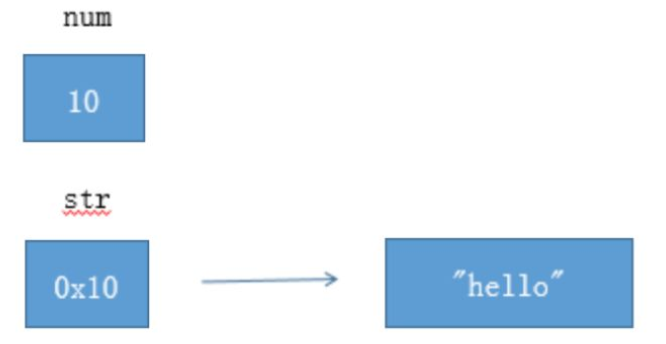
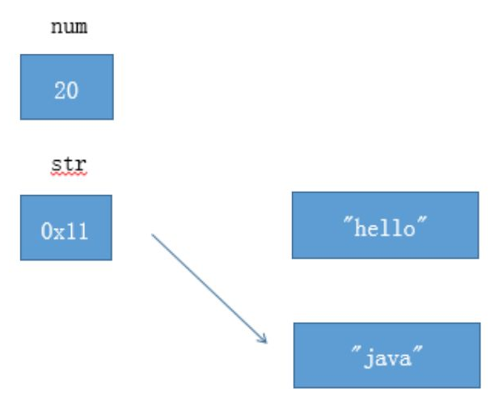
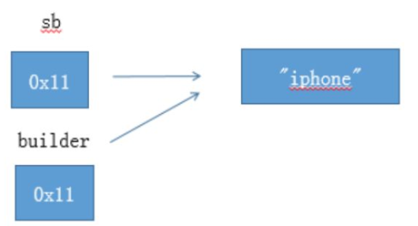
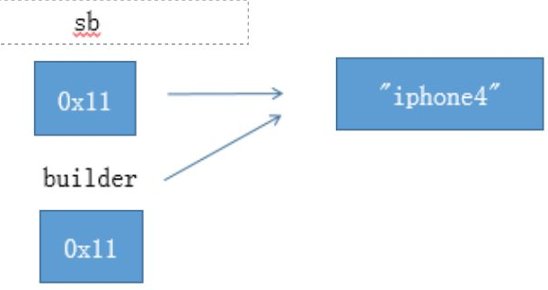
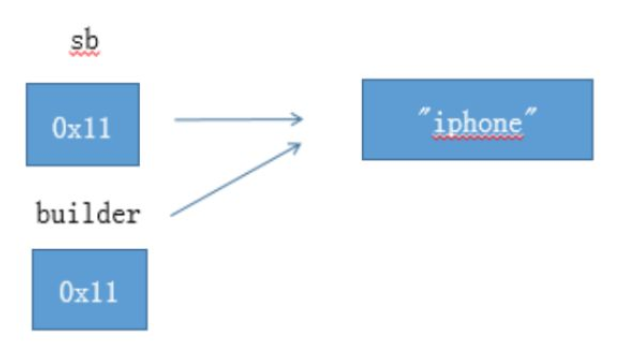
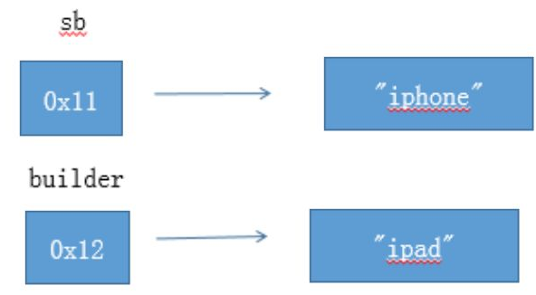
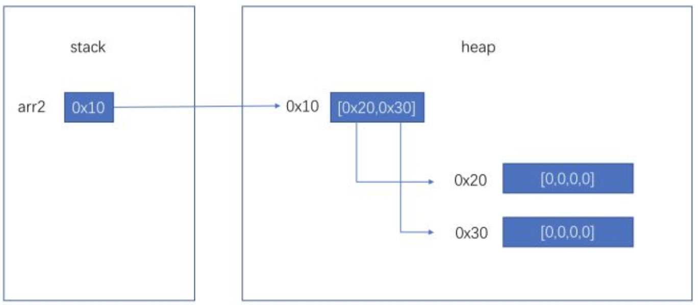
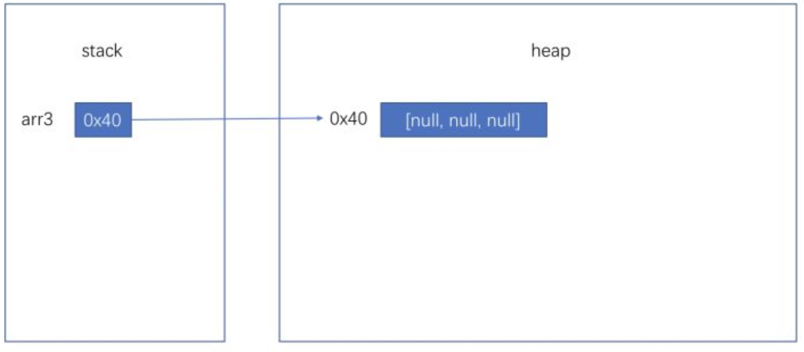
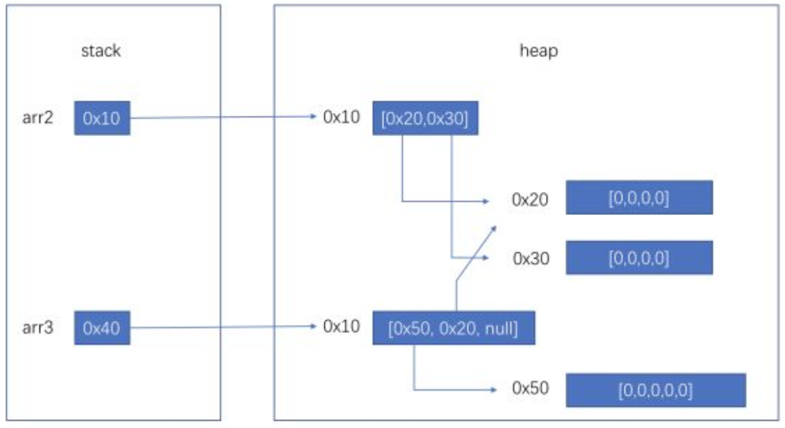
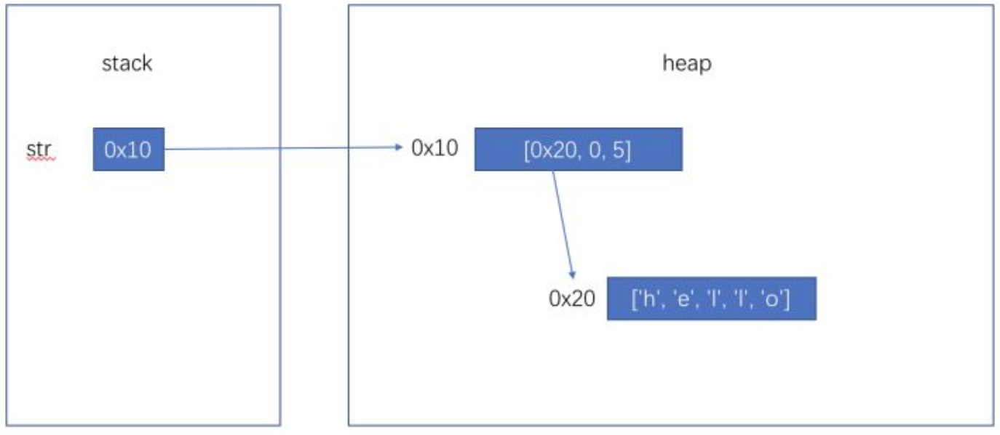

一：搞清楚 基本类型 和 引用类型的不同之处

```
int num = 10;
String str = "hello";
```



如图所示，num是基本类型，值就直接保存在变量中。而str是引用类型，变量中保存的只是实际对象的地址。一般称这种变量为"引用"，引用指向实际对象，实际对象中保存着内容。

二：搞清楚赋值运算符（=）的作用

```
num = 20;
str = "java";
```



对于基本类型 num ，赋值运算符会直接改变变量的值，原来的值被覆盖掉。  
对于引用类型 str，赋值运算符会改变引用中所保存的地址，原来的地址被覆盖掉。**但是原来的对象不会被改变（重要）。**  
如上图所示，"hello" 字符串对象没有被改变。（没有被任何引用所指向的对象是垃圾，会被垃圾回收器回收）

三：调用方法时发生了什么？**参数传递基本上就是赋值操作**。

第一个例子：基本类型

```
void foo(int value) {
    value = 100;
}
foo(num); // num 没有被改变
```

第二个例子：没有提供改变自身方法的引用类型

```
void foo(String text) {
    text = "windows";
}
foo(str); // str 也没有被改变
```

第三个例子：提供了改变自身方法的引用类型

```
StringBuilder sb = new StringBuilder("iphone");
void foo(StringBuilder builder) {
    builder.append("4");
}
foo(sb); // sb 被改变了，变成了"iphone4"。
```

第四个例子：提供了改变自身方法的引用类型，但是不使用，而是使用赋值运算符。

```
StringBuilder sb = new StringBuilder("iphone");
void foo(StringBuilder builder) {
    builder = new StringBuilder("ipad");
}
foo(sb); // sb 没有被改变，还是 "iphone"。
```

重点理解为什么，第三个例子和第四个例子结果不同？

下面是第三个例子的图解：



builder.append("4")之后



下面是第四个例子的图解：



builder = new StringBuilder("ipad"); 之后



---

**从局部变量/方法参数开始讲起：**

局部变量和方法参数在jvm中的储存方法是相同的，都是在栈上开辟空间来储存的，随着进入方法开辟，退出方法回收。以32位JVM为例，boolean/byte/short/char/int/float以及引用都是分配4字节空间，long/double分配8字节空间。对于每个方法来说，最多占用多少空间是一定的，这在编译时就可以计算好。

我们都知道JVM内存模型中有，stack和heap的存在，但是更准确的说，是每个线程都分配一个独享的stack，所有线程共享一个heap。对于每个方法的局部变量来说，是绝对无法被其他方法，甚至其他线程的同一方法所访问到的，更遑论修改。

当我们在方法中声明一个 int i = 0，或者 Object obj = null 时，仅仅涉及stack，不影响到heap，当我们 new Object() 时，会在heap中开辟一段内存并初始化Object对象。当我们将这个对象赋予obj变量时，仅仅是stack中代表obj的那4个字节变更为这个对象的地址。

**数组类型引用和对象：**

当我们声明一个数组时，如int\[\] arr = new int\[10\]，因为数组也是对象，arr实际上是引用，stack上仅仅占用4字节空间，new int\[10\]会在heap中开辟一个数组对象，然后arr指向它。

当我们声明一个二维数组时，如 int\[\]\[\] arr2 = new int\[2\]\[4\]，arr2同样仅在stack中占用4个字节，会在内存中开辟一个长度为2的，类型为int\[\]的数组，然后arr2指向这个数组。这个数组内部有两个引用（大小为4字节），分别指向两个长度为4的类型为int的数组。



所以当我们传递一个数组引用给一个方法时，数组的元素是可以被改变的，但是无法让数组引用指向新的数组。

你还可以这样声明：int\[\]\[\] arr3 = new int\[3\]\[\]，这时内存情况如下图



你还可以这样 arr3\[0\] = new int \[5\]; arr3\[1\] = arr2\[0\];



**关于String：**

原本回答中关于String的图解是简化过的，实际上String对象内部仅需要维护三个变量，char\[\] chars, int startIndex, int length。而chars在某些情况下是可以共用的。但是因为String被设计成为了不可变类型，所以你思考时把String对象简化考虑也是可以的。

String str = new String("hello")



当然某些JVM实现会把"hello"字面量生成的String对象放到常量池中，而常量池中的对象可以实际分配在heap中，有些实现也许会分配在方法区，当然这对我们理解影响不大。

```java
public class CursorTest {
	private static List<Test1> a = new ArrayList<>();

	static {
		Test1 test = new Test1();
		test.setAge(1);
		test.setName("1");
		a.add(test);

		Test1 test1 = new Test1();
		test1.setAge(2);
		test1.setName("2");
		a.add(test1);
	}

	/**
	 * List<Test1> a = CursorTest.a
	 * 方法参数a 指向了CursorTest.a的内存地址
	 *
	 * @param a
	 */
	private static void changeValue(List<Test1> a) {
		//对CursorTest.a的数组 第一个位置的元素进行了修改
		Test1 str = a.get(0);
		str.setAge(123);
		str.setName("123");
	}


	public static void main(String[] args) {
		System.out.println(CursorTest.a.get(0).getAge());
		System.out.println(CursorTest.a.get(0).getName());
		System.out.println(CursorTest.a.get(1).getAge());
		System.out.println(CursorTest.a.get(1).getName());
		changeValue(CursorTest.a);
		System.out.println(CursorTest.a.get(0).getAge());
		System.out.println(CursorTest.a.get(0).getName());
		System.out.println(CursorTest.a.get(1).getAge());
		System.out.println(CursorTest.a.get(1).getName());
	}
}

@Data
class Test1 {
	private String name;
	private int age;
}
```