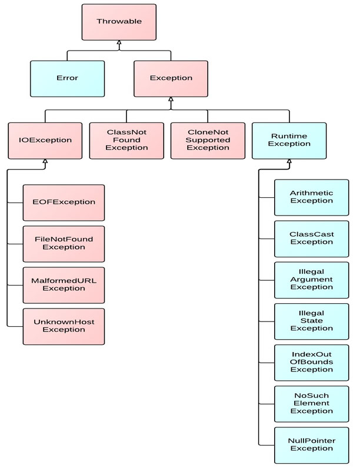
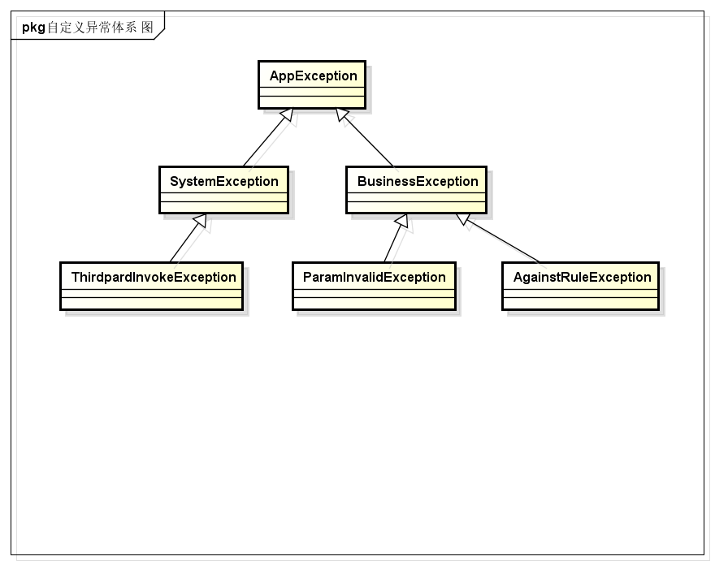
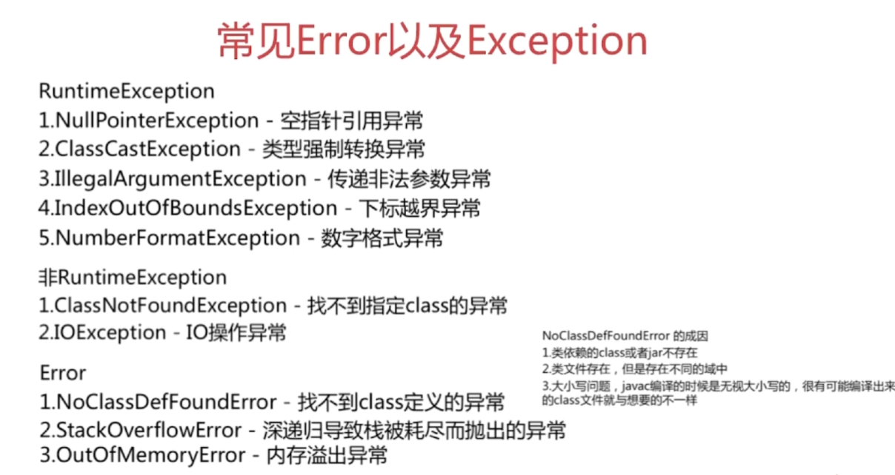

    异常，是Java中非常常用的功能，它可以简化代码，并且增强代码的安全性。

## 关于异常

异常机制，是指程序不正常时的处理方式。具体来说，异常机制提供了程序退出的安全通道。当出现错误后，程序执行的流程发生改变，程序的控制权转移到异常处理器。

异常的一般性语法为：

```java
    try {
        // 有可能抛出异常的代码
    } catch (Exception e) {
        // 异常处理
    } finally {
        // 无论是否捕获到异常都会执行的程序
    }
```

### Java异常体系

Java异常中的体系结构如下图所示：



-   **Throwable**类是整个Java异常体系的超类，都有的异常类都是派生自这个类。包含Error和Exception两个直接子类。
-   **Error**表示程序在运行期间出现了十分严重、不可恢复的错误，在这种情况下应用程序只能中止运行，例如JAVA虚拟机出现错误。在程序中不用捕获Error类型的异常。一般情况下，在程序中也不应该抛出Error类型的异常。
-   **Exception**是应用层面上最顶层的异常类，包含RuntimeException（运行时异常）和 Checked Exception（受检异常）。
    -   **RuntimeException**是一种Unchecked Exception，即表示编译器不会检查程序是否对RuntimeException作了处理，在程序中不必捕获RuntimException类型的异常，也不必在方法体声明抛出RuntimeException类。一般来说，RuntimeException发生的时候，表示程序中出现了编程错误，所以应该找出错误修改程序，而不是去捕获RuntimeException。常见的RuntimeException有NullPointException、ClassCastException、IllegalArgumentException、IndexOutOfBoundException等。
    -   **Checked Exception**是相对于Unchecked Exception而言的，Java中并没有一个名为Checked Exception的类。它是在编程中使用最多的Exception，所有继承自Exception并且不是RuntimeException的异常都是Checked Exception。JAVA 语言规定必须对checked Exception作处理，编译器会对此作检查，要么在方法体中声明抛出checked Exception，要么使用catch语句捕获checked Exception进行处理，不然不能通过编译。常用的Checked Exception有IOException、ClassNotFoundException等。

## 异常的特点

### 通用特点

####     JVM捕获并处理未被应用程序捕获的异常

无论是受检异常（Checked Exception）还是运行时异常（Runtime Exception），如果异常没有被应用程序捕获，那么最终这个异常会交由JVM来进行处理，会明显出现下面两个结果：

​    1\. 当前线程会停止运行，异常触发点后面的代码将得不到运行。

​    2\. 异常栈信息会通过标准错误流输出。

```java
/**
 * 应用程序没有处理抛出的异常时，会交由JVM来处理这个异常。结果是：
 * 1. 当前线程会停止运行，异常触发点后面的代码将得不到运行。
 * 2. 异常栈信息会通过标准错误流输出。
 */
public class UncatchedException {

    public static void main(String[] args) throws Exception {
        throwException();
        System.out.println("这一行不会被打印出来");
    }

    public static void throwException() throws Exception {
        int i = 0;
        if (i == 0) {
            throw new Exception();
        }
    }
}
```

#### 异常catch有顺序性

在catch异常时，如果有多个异常，那么是会有顺序要求的。子类型必须要在父类型之前进行catch，catch与分支逻辑是一致，如果父类型先被catch，那么后被catch的分支根本得不到运行机会。

```java
package demo.blog.java.exception;

/**
 * 在catch异常时，如果有多个异常，那么是会有顺序要求的。子类型必须要在父类型之前进行catch，
 * catch与分支逻辑是一致，如果父类型先被catch，那么后被catch的分支根本得不到运行机会。
 */
public class ExceptionCatchOrder {

    public void wrongCatchOrder() {
        try {
            Integer i = null;
            int j = i;
        } catch (Exception e) {
        } catch (NullPointerException e) { // 编译不通过，eclipse提示“Unreachable catch block for NullPointerException. It is already handled by the catch block for Exception”
        }
    }
}
```

#### 异常被吃掉

如果在finally中返回值，那么在程序中抛出的异常信息将会被吞噬掉。这是一个非常值得注意的问题，因为异常信息是非常重要的，在出现问题时，我们通常凭它来查找问题。如果编码不小心而导致异常被吞噬，排查起来是相当困难的，这将是一个大隐患。

```java
package demo.blog.java.exception;

/**
 * 如果在finally中返回值，那么在程序中抛出的异常信息将会被吞噬掉。
 */
public class FinallySwallowException {

    public static void main(String[] args) throws Exception {
        System.out.println(swallowException()); // 打印出2，而不是打印出异常栈
    }

    public static int swallowException() throws Exception {
        try {
            throw new Exception();
        } finally {
            return 2;
        }
    }
}
```

#### 重写Exception的fillInStackTrace()方法

使用自定义异常时，可以重写fillInStackTrace()方法来控制Exception的异常栈信息。默认情况下，在程序抛出异常时，最终会通过调用`private native Throwable fillInStackTrace(int dummy)`这个本地方法来获取当前线程的堆栈信息，这是一个非常耗时的操作。如果我们仅仅需要用到异常的传播性质，而不关系异常的堆栈信息，那么完全可以通过重写fillInStackTrace()方法来实现。

```java
package demo.blog.java.exception;

/**
 * 重写Exception的fillInStackTrace()方法
 */
public class MyException extends Exception {

    public MyException(String message) {
        super(message);
    }

    /*
     * 重写fillInStackTrace方法会使得这个自定义的异常不会收集线程的整个异常栈信息，会大大
     * 提高减少异常开销。
     */
    @Override
    public synchronized Throwable fillInStackTrace() {
        return this;
    }

    public static void main(String[] args) {
        try {
            throw new MyException("由于MyException重写了fillInStackTrace方法，那么它不会收集线程运行栈信息。");
        } catch (MyException e) {
            e.printStackTrace(); // 在控制台的打印结果为：demo.blog.java.exception.MyException: 由于MyException重写了fillInStackTrace方法，那么它不会收集线程运行栈信息。
        }
    }
}
```

### 受检异常（checked exception）

#### 必须处理或者向上抛出

我们必须要对底层抛出来的受检异常进行处理，处理方式有`try...catch...`或者向上抛出（throws），否则程序无法通过编译。

```java
package demo.blog.java.exception;

/**
 * 必须对底层抛出的异常进行处理
 */
public class CheckedException {

    public static void main(String[] args) {
        throwException(); // 编译不通过，必须对底层抛出的异常进行处理
    }

    public static void throwException() throws Exception {
        throw new Exception();
    }
}
```

#### 不能捕获未被抛出的受检异常

如果我们试图去捕获一个未被抛出的受检异常，程序将无法通过编译（Exception除外）。

```java
package demo.blog.java.exception;

import java.io.IOException;

/**
 * 不能捕获一个没有被抛出的受检异常（Exception除外）
 */
public class CantCatchUnthrowedException {

    public void cantCatchUnthrowedException() {
        try {
            int i = 0;
        } catch (IOException e) { // 编译不通过，eclipse提示：Unreachable catch block for IOException. This exception is never thrown from the try statement body
            e.printStackTrace();
        }
    }
}
```

### 运行时异常（runtime exception）

运行时异常（runtime exception）与受检异常（checked exception）的最大区别是不强制对抛出的异常进行处理。所有的运行时异常都继承自RuntimeException这个类。与受检异常类似的例子，如果抛出的是运行时异常，但是此时不捕获这个异常，程序也可以编译通过。

```java
package demo.blog.java.exception;

/**
 * 编译通过
 */
public class MyRuntimeException {

    public void myRuntimeException() {
        throw new RuntimeException(); // 可以正常编译
    }
}
```

## 自定义异常体系

在应用系统中应该要建立自己的异常体系，这样便于统一处理系统中出现的异常。越靠近底层，越使用更加底层的、具体的异常。如果是其他系统中的异常（譬如Java自身的异常），也应该将其转化为自定义体系中的对应异常。



## 异常处理和设计的几个建议

**1.只在必要使用异常的地方才使用异常，不要用异常去控制程序的流程**

谨慎地使用异常，异常捕获的代价非常高昂，异常使用过多会严重影响程序的性能。如果在程序中能够用if语句和Boolean变量来进行逻辑判断，那么尽量减少异常的使用，从而避免不必要的异常捕获和处理。

比如下面这段经典的程序：

```java
public void useExceptionsForFlowControl() {  
  try {  
     while (true) {  
        increaseCount();  
     }  
  } catch (MaximumCountReachedException ex) {  
  }  
  //Continue execution  
}  

    

public void increaseCount() throws MaximumCountReachedException {  
  if (count >= 5000)  
    throw new MaximumCountReachedException();  
}
```

java异常处理消耗性能的地方：

​    1.try-catch块影响JVM的优化

​    2.异常对象实例需要保存栈快照等信息，开销较大。

**2.切忌使用空catch块**

useExceptionsForFlowControl()用一个无限循环来增加count直到抛出异常，这种做法并没有让代码不易读懂，但是主要是使得程序执行效率降低。

在捕获了异常之后什么都不做，相当于忽略了这个异常。千万不要使用空的catch块，空的catch块意味着你在程序中隐藏了错误和异常，并且很可能导致程序出现不可控的执行结果。

如果你非常肯定捕获到的异常不会以任何方式对程序造成影响，最好用Log日志将该异常进行记录，以便日后方便更新和维护。

**3.检查异常和非检查异常的选择**

一旦你决定抛出异常，你就要决定抛出什么异常。这里面的主要问题就是抛出受检异常还是非受检异常。

受检异常导致了太多的try…catch代码，有很多受检异常对开发人员来说是无法合理地进行处理的，比如SQLException，而开发人员却不得不去进行try…catch，这样就会导致经常出现这样一种情况：逻辑代码只有很少的几行，而进行异常捕获和处理的代码却有很多行。这样不仅导致逻辑代码阅读起来晦涩难懂，而且降低了程序的性能。尽量避免受检异常的使用，如果确实该异常情况的出现很普遍，需要提醒调用者注意处理的话，就使用受检异常；否则使用非受检异常。

在一般情况下，都是尽量将受检异常转变为非受检异常，然后抛出交给上一级处理。

**4.注意catch块的顺序**

不要把上层类的异常放在最前面的catch块。比如下面这段代码：

```java
try {
   FileInputStream inputStream = new FileInputStream("d:/a.txt");
   int ch = inputStream.read();
   System.out.println("aaa");
   return "step1";
} catch (IOException e) {
   System.out.println("io exception");　　      
   return "step2";
}catch (FileNotFoundException e) {
   System.out.println("file not found");　　　　      
   return "step3";
}finally{
   System.out.println("finally block");
}
```

第二个catch的FileNotFoundException将永远不会被捕获到，因为FileNotFoundException是IOException的子类。　　

**5.不要将提供给用户看的信息放在异常信息里**

　　比如下面这段代码：

```java
public class Main {

    public static void main(String[] args) {
        try {
            String user = null;
            String pwd = null;
            login(user,pwd);
        } catch (Exception e) {
            System.out.println(e.getMessage());
        }
    }

    public static void login(String user,String pwd) {
        if(user==null||pwd==null)
            throw new NullPointerException("用户名或者密码为空");
        //...
    }
}
```

　　展示给用户错误提示信息最好不要跟程序混淆一起，比较好的方式是将所有错误提示信息放在一个配置文件中统一管理。

**6.避免多次在日志信息中记录同一个异常**

　　只在异常最开始发生的地方进行日志信息记录。很多情况下异常都是层层向上跑出的，如果在每次向上抛出的时候，都Log到日志系统中，则会导致无从查找异常发生的根源。

**7\. 异常处理尽量放在顶层进行**

　　尽量将异常统一抛给上层调用者，由上层调用者统一之时如何进行处理。如果在每个出现异常的地方都直接进行处理，会导致程序异常处理流程混乱，不利于后期维护和异常错误排查。由上层统一进行处理会使得整个程序的流程清晰易懂。

**8. 在finally中释放资源**

　　如果有使用文件读取、网络操作以及数据库操作等，记得在finally中释放资源。这样不仅会使得程序占用更少的资源，也会避免不必要的由于资源未释放而发生的异常情况。       

#### **面试题：**

```java
try{
   return "1";
}
catch(){
   return "2";
}
finally{
   return "3";
}
```

-   在try执行的前提下，finally是在retrun语句执行后，return返回之前执行的，也就是说finally必执行
    
-   finally中修改的基本类型没有return是不影响返回结果的，有了retrun才会影响
    
-   finally中修改list ,map,set引用类型时，就算没有return，也是是影响返回结果的
    

try 的 return 和 catch 的 return 一般 会执行其中一个。在return 返回之前，会先执行finally。

1.如果finally 有return语句，则return finally的结果。

2.若finally 没有return语句，则

1）finally 对基本类型的操作，不影响 try 或者 catch 返回的结果；

2）如果是对引用类型的操作，则还是会影响  try 或者 catch 返回的结果。

