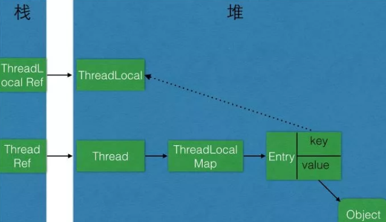

# 一、引言

ThreadLocal是并发场景下用来解决变量共享问题的类，它能使原本线程间共享的对象进行线程隔离，即一个对象只对一个线程可见。

首先来看一段ThreadLocal的使用示例：

```java
// ThreadLocal使用示例
public class ThreadLocalUtil {
    private static final ThreadLocal<Integer> testThreadLocal = new ThreadLocal<>();

    public static void main(String[] args) {
        CyclicBarrier barrier = new CyclicBarrier(4);
        for (int i = 0; i < 4; i ++) {
            new Thread(new TestThread(barrier)).start();
        }
    }

    static class TestThread implements Runnable{
        private CyclicBarrier barrier;

        public TestThread(CyclicBarrier barrier) {
            this.barrier = barrier;
        }
        
        @Override
        public void run() {
            try {
                barrier.await();
                for (int i = 0; i < 100; i++) {
                    Integer value = testThreadLocal.get();
                    if (value == null) {
                        value = 0;
                    }
                    Integer sum = value + i;
                    testThreadLocal.set(sum);
                }
                System.out.println(Thread.currentThread().getName() + " sum is " + testThreadLocal.get());
            } catch (Exception e) {
                e.printStackTrace();
            }
        }
    }
}
```

从运行结果可以看出，每个线程的求和结果都是4950，线程之间没有相互影响。

# 二、引用类型

对象在堆上创建之后所持有的引用是一种变量类型，引用的可达性是判断能否被垃圾回收的基本条件。我们可以把引用分为强引用、软引用、弱引用和虚引用四类。

-   强引用（Strong Reference）：最为常见。如`Object object = new Object();`这样的变量声明和定义就会产生对该对象的强引用。只要对象有强引用指向，并且GC Roots可达，那么Java内存回收时，即使濒临内存耗尽，也不会回收该对象。
-   软引用（Soft Reference）：引用力度弱于强引用，用于非必须对象上。在即将OOM之前，垃圾回收器会把这些软引用指向的对象加入回收范围，以获得更多的内存空间。软引用主要用来缓存中间计算结果及不需要实时保存的用户行为等。
-   弱引用（Weak Reference）：引用强度较前两者更弱，也是用来描述非必需对象的。如果弱引用指向的对象只存在弱引用这条线路，则在下一次YGC时会被回收。由于YGC时间的不确定性，弱引用何时被回收也具有不确定性。调用 WeakReference. get()可能返回null，要注意空指针异常。
-   虚引用（Phantom Reference）：是极弱的一种引用关系，定义完成后就无法通过该引用获取指向的对象。为一个对象设置虚引用的唯一目的就是希望能在这个对象被回收时收到一个系统通知。虚引用必须与引用队列联合使用，当垃圾回收时，如果发现存在虚引用，就会在回收对象内存前，把这个虚引用加入与之关联的引用队列中。

    除强引用外，其他三种引用可以减少对象在生命周期中所占用的内存大小。

# 三、ThreadLocal原理

## 自己实现ThreadLocal？

如果让我们自己实现一个ThreadLocal，可能最直接的想法就是维护一个map，将线程作为key来获取该线程的value，例如下面这段代码：

```java
public class MyThreadLocal<T> {
 
    private Map<Thread, T> keyValueMap = new WeakHashMap<>();
 
    public synchronized void set(T value) {
        Thread thread = Thread.currentThread();
        keyValueMap.put(thread, value);
    }
    
    public synchronized T get() {
        Thread thread = Thread.currentThread();
        return keyValueMap.get(thread);
    }
    
    public synchronized void remove() {
        Thread thread = Thread.currentThread();
        keyValueMap.remove(thread);
    }
}
```

这段代码最大的问题就是synchronized的使用会导致并发性能较差。那么，jdk中的ThreadLocal是如何实现的呢？

## ThreadLocal类源码分析

### set方法

```csharp
    public void set(T value) {
        Thread t = Thread.currentThread();
        ThreadLocalMap map = getMap(t);
        if (map != null)
            map.set(this, value);
        else
            createMap(t, value);
    }
 
    void createMap(Thread t, T firstValue) {
        t.threadLocals = new ThreadLocalMap(this, firstValue);
    }
 
    ThreadLocalMap getMap(Thread t) {
        return t.threadLocals;
    }

```

可以看到，set方法是通过一个ThreadLocalMap对象来set值，而ThreadLocalMap虽然是ThreadLocal的静态内部类，却是Thread类中的成员变量。

### get方法

```kotlin
    public T get() {
        Thread t = Thread.currentThread();
        ThreadLocalMap map = getMap(t);
        if (map != null) {
            ThreadLocalMap.Entry e = map.getEntry(this);
            if (e != null) {
                @SuppressWarnings("unchecked")
                T result = (T)e.value;
                return result;
            }
        }
        return setInitialValue();
    }
 
    private T setInitialValue() {
        T value = initialValue();
        Thread t = Thread.currentThread();
        ThreadLocalMap map = getMap(t);
        if (map != null)
            map.set(this, value);
        else
            createMap(t, value);
        return value;
    }
 
    protected T initialValue() {
        return null;
    }

```

get方法也是将操作委托给了ThreadLocalMap，通过最终获得ThreadLocalMap.Entry来获取最终的值。

### remove方法

最后看remove方法，同样是交给ThreadLocalMap来处理

```csharp
     public void remove() {
         ThreadLocalMap m = getMap(Thread.currentThread());
         if (m != null)
             m.remove(this);
     }

```

## ThreadLocalMap源码分析

ThreadLocalMap是线程的私有成员变量。这样做是为了避免多线程竞争，因为放在Thread对象中就相当于线程私有，处理的时候不需要加锁。

由于ThreadLocal本身的设计就是当前线程变量数据 不与 其他线程共享，不需要其他线程访问本对象的变量，放在Thread对象中 不会有问题。

### Entry数据结构

ThreadLocalMap维护了一个Entry类型的数据结构：

```dart
        static class Entry extends WeakReference<ThreadLocal<?>> {
            /** The value associated with this ThreadLocal. */
            Object value;
            Entry(ThreadLocal<?> k, Object v) {
                super(k);
                value = v;
            }
        }
        private Entry[] table;

```

Entry是一个以ThreadLocal对象为key，Object为value的键值对。需要注意的是，`Entry`是弱引用，若将 该ThreadLocal对象引用 置为null,  Entry 就会自动在下一次Young GC时被垃圾回收。例如：

```
ThreadLocal<Integer> a= **new** ThreadLocal<Integer>();  
_//......_  
a = **null**;

//此时ThreadLocalMap中存在 a 的引用的 相关线程，ThreadLocalMap的 对应Entry 会自动在下一次Young GC时被垃圾回收。
```

在ThreadLocal对象 使用 get() 时，若 当前线程ThreadLocalMap 为null，会给当前线程的 ThreadLocalMap创建空间, 向其中设置一个 key为当前引用，value为null 的 Entry。

### set方法

```csharp
    private void set(ThreadLocal<?> key, Object value) { 
        Entry[] tab = table;
        int len = tab.length;
        // 定位Entry存放的位置
        int i = key.threadLocalHashCode & (len-1);
        // 处理hash冲突的情况，这里采用的是开放地址法
        for (Entry e = tab[i];
             e != null;
             e = tab[i = nextIndex(i, len)]) {
            ThreadLocal<?> k = e.get();
            //更新
            if (k == key) {
                e.value = value;
                return;
            }
            if (k == null) {
                replaceStaleEntry(key, value, i);
                return;
            }
        }
        // 新建entry并插入
        tab[i] = new Entry(key, value);
        int sz = ++size;
        // 清除脏数据，扩容
        if (!cleanSomeSlots(i, sz) && sz >= threshold)
            rehash();
    }

```

### get方法

```csharp
    private Entry getEntry(ThreadLocal<?> key) {
        // 确定entry位置
        int i = key.threadLocalHashCode & (table.length - 1);
        Entry e = table[i];
        // 命中
        if (e != null && e.get() == key)
            return e;
        else
            // 存在hash冲突，继续查找
            return getEntryAfterMiss(key, i, e);
    }
 
    private Entry getEntryAfterMiss(ThreadLocal<?> key, int i, Entry e) {
        Entry[] tab = table;
        int len = tab.length;
 
        while (e != null) {
            ThreadLocal<?> k = e.get();
            //找到entry
            if (k == key)
                return e;
            // 脏数据处理
            if (k == null)
                expungeStaleEntry(i);
            else
                //遍历
                i = nextIndex(i, len);
            e = tab[i];
        }
        return null;
    }

```

### remove方法

```csharp
   private void remove(ThreadLocal<?> key) {
        Entry[] tab = table;
        int len = tab.length;
        int i = key.threadLocalHashCode & (len-1);
        for (Entry e = tab[i];
             e != null;
             e = tab[i = nextIndex(i, len)]) {
            if (e.get() == key) {
                //清空key
                e.clear();
                //清空value
                expungeStaleEntry(i);
                return;
            }
        }
    }
```

### 梳理一下ThreadLocal和Thread的类关系图与堆栈关系图：



上图中的关系简要概括：

-   1个Thread有1个ThreadLocalMap对象
-   1个ThreadLocalMap对象存储一个Entry对象数组
-   1个Entry对象的key弱引用指向1个ThreadLocal对象（因此一个Thread 线程可以存放 多个ThreadLocal对象的值）
-   1个ThreadLocal对象可以被多个线程所引用（因为 每个线程中 ThreadLocalMap 都是互相独立的）。

1.  调用ThreadLocal的set()方法时，实际上就是往当前线程Thread实例的ThreadLocalMap中Entry数组 设置值，key是 ThreadLocal对象实例，值是传递进来的对象
    
2.  调用ThreadLocal的get()方法时，实际上就是往当前线程Thread实例的ThreadLocalMap中Entry数组 获取值，key是ThreadLocal对象实例
    
3.  ThreadLocal对象不持有 Value，Value 由线程的Entry对象持有；因此每次ThreadLocal对象 执行get() 都是去当前线程对应的ThreadLocalMap 中Entry对象数组中取出 key为当前ThreadLocal对象的value.
    

# 四、ThreadLocal注意事项

## 脏数据

线程复用会产生脏数据。由于线程池会重用Thread对象，那么与Thread绑定的类的静态属性 ThreadLocalMap 变量也会被重用。

如果在实现的线程run()方法体中不显式地调用remove() 清理与线程相关的ThreadLocal信息，那么倘若下一个线程不调用set() 设置初始值，就可能get() 到重用的线程信息，包括 ThreadLocal所关联的线程对象的value值。

## 内存泄漏

通常我们会使用使用static关键字来修饰ThreadLocal（这也是在源码注释中所推荐的）。

在此场景下，其ThreadLocal对象 存活周期 贯穿整个程序运行生命周期。此时寄希望于ThreadLocal对象失去引用后，来触发弱引用机制，从而回收Entry的Value就不可能了。

如果不进行remove() 操作，那么这个线程执行完成后，通过ThreadLocal对象持有的对象是不会被释放的。

以上两个问题的解决办法很简单，就是在每次用完ThreadLocal时， 必须要及时调用 remove()方法清理，从而达到清除 **线程中的 ThreadLocalMap -> entry数组 -> ThreadLocal** 对应的数据 的目的。

## 父子线程共享线程变量

很多场景下通过ThreadLocal来透传全局上下文，会发现子线程的value和主线程不一致。比如用ThreadLocal来存储监控系统的某个标记位，暂且命名为traceId。某次请求下所有的traceld都是一致的，以获得可以统一解析的日志文件。

在实际开发过程中，发现子线程里的traceld为null，跟主线程的并不一致。这就需要使用**InheritableThreadLocal**来解决父子线程之间共享线程变量的问题，使整个连接过程中的traceId一致。