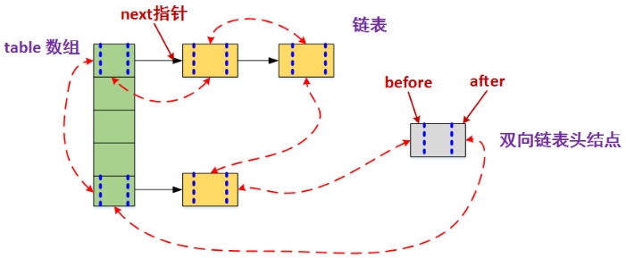

### Arraylist与Vector的区别：

> ​	ArrayList是线程不安全的，当多条线程访问同一个ArrayList集合时，程序需要手动保证该集合的同步性，而Vector则是线程安全的 

### Arraylist和Linkedlist区别及实现原理

>  Arraylist：底层是基于动态数组，根据下表随机访问数组元素的效率高，向数组尾部添加元素的效率高；但是，删除数组中的数据以及向数组中间添加数据效率低，因为需要移动数组。 
>
>  Linkedlist：基于链表实现，数据添加删除效率高，只需要改变指针指向即可，但是访问数据的平均效率低，需要对链表进行遍历。 
>
>  当随机访问List（get和set操作）时，ArrayList比LinkedList的效率更高，因为LinkedList是线性的数据存储方式，所以需要移动指针从前往后依次查找。
>
>  当对数据进行增加和删除的操作(add和remove操作)时，LinkedList比ArrayList的效率更高，因为ArrayList是数组，所以在其中进行增删操作时，会对操作点之后所有数据的下标索引造成影响，需要进行数据的移动。
>
>  **Arraylist实现原理：**
>
>  - 初始化ArrayList的时候，可以指定初始化容量的大小，如果不指定，就会使用默认大小，为10
>  - 当添加一个新元素的时候，首先会检查容量是否足够添加这个元素，如果够就直接添加，如果不够就进行扩容，扩容为原数组容量的1.5倍
>  - 当在index处放置一个元素的时候，会将数组index处右边的元素全部右移
>  - 当在index处删除一个元素的时候，会将数组index处右边的元素全部左移
>
>  **Linkedlist实现原理：**
>
>  ​	在类中包含了 first 和 last 两个指针(Node)。Node 中包含了上一个节点和下一个节点的引用，这样就构成了双向的链表。每个 Node 知道自己的前一个节点和后一个节点。

### HashMap的并发问题

### hashmap结构；什么对象能做为key

>  重写过hashCode和equals的对象，才能做为key，如果要将对象做为key，需要重写hashCode和equals
>
>  null可以做为key值，null也可以做为value值 

### hashmap会问到数组索引，hash碰撞怎么解决

>  	HashMap的底层结构是一个数组，而数组的元素是一个单向链表。 
>
>  		HashMap采用hash算法将key散列为一个int值，这个int值对应到数组的下标，再做查询操作的时候，拿到key的散列值，根据数组下标就能直接找到存储在数组的元素。但是由于hash可能会出现相同的散列值，为了解决冲突，HashMap采用将相同的散列值存储到一个链表中，也就是说在一个链表中的元素他们的散列值绝对是相同的。找到数组下标取出链表，再遍历链表。
>	
>  	**初始容量，加载因子**
>	
>  	​	这两个参数是影响HashMap性能的重要参数，其中容量表示哈希表中桶的数量，初始容量是创建哈希表时的容量 16，加载因子 0.75 是哈希表在其容量自动增加之前可以达到多满的一种尺度，它衡量的是一个散列表的空间的使用程度，负载因子越大表示散列表的装填程度越高，反之愈小。对于使用链表法的散列表来说，查找一个元素的平均时间是O(1+a)，因此如果负载因子越大，对空间的利用更充分，然而后果是查找效率的降低；如果负载因子太小，那么散列表的数据将过于稀疏，对空间造成严重浪费。系统默认负载因子为0.75，一般情况下我们是无需修改的。
>	
>  	**put()方法**
>	
>  	​	HashMap会对null值key进行特殊处理，总是放到table[0]位置
>	
>  	​	先计算hash，然后通过hash与table.length取模 计算index值，然后将key放到table[index]位置，当table[index]已存在其它元素时，比较equals是否已存在该key；不存在，则在table[index]位置形成一个链表，将新添加的元素放在table[index]，原来的元素通过Entry的 next 进行链接，这样以链表形式解决hash冲突问题，当元素数量达到临界值(capactiy * factor)时，则进行扩容，是table数组长度变为table.length * 2。扩容时， 每个元素都将根据hash全部重新计算index。 

### hashtable和hashmap的区别及实现原理

> hashtable的方法是同步的，HashMap无任何同步处理，这个区别 就像 Vector与ArrayList
>
> Hashtable不允许null值(key和value 都不可以)，HashMap允许null值(key和value都可以)。

### hashMap,hashtable,concurrentHashMap比较

> hashMap 是非线程安全的，hashtable,concurrentHashMap 是线程安全的。
>
> concurrentHashMap  仅仅锁定map的某个部分，而 hashtable 会锁定整个map
>
> concurrentHashMap 将整个hash桶进行了分段segment，将数组分为了几个小的片段segment,每个小的segment上都有锁的存在，插入元素是需要先找到应该插入哪一个segment,然后获取对应的segment锁，再进行插入操作。
>
> ​	hashtable(同一把锁):使用 synchronized 来保证线程安全，但效率非常低下。当一个线程访问同步方法时，其他线程也访问同步方法，可能会进入阻塞或轮询状态，如使用 put 添加元素，另一个线程不能使用 put 添加元素，也不能使用 get，竞争会越来越激烈效率越低
>
> ​	concurrenthashmap(分段锁):(锁分段技术)每一把锁只锁容器其中一部分数据，多线程访问容器里不同数据段的数据，就不会存在锁竞争，提高并发访问率。首先将数据分为一段一段的存储，然后给每一段数据配一把锁，当一个线程占用锁访问其中一个段数据时，其他段的数据也能被其他线程访问。
>
> ​	一个 concurrenthashmap 里包含一个 Segment 数组。Segment 的结构和 Hashmap 类似，是一种数组和链表结构，一个 Segment 包含一个 HashEntry 数组，每个 HashEntry 是一个链表结构的元素，每个 Segment 守护着一个 HashEntry 数组里的元素，当对 HashEntry 数组的数据进行修改时，必须首先获得对应的 Segment。Segment 是一种可重入锁 ReentrantLock，扮演锁的角色。HashEntry 用于存储键值对数据。 

### TreeMap的实现原理

### 了解LinkedHashMap的应用吗

>  HashMap和双向链表合二为一即是LinkedHashMap.
>
>  它是一个将所有Entry节点链入一个双向链表双向链表的HashMap。在LinkedHashMapMap中，所有put进来的Entry都保存在哈希表中，但由于它又额外定义了一个以head为头结点的双向链表，因此对于每次put进来Entry，除了将其保存到哈希表中对应的位置上之外，还会将其插入到双向链表的尾部。 
>
>  

### 有没有可能2个不相等的对象有相同的hashcode

> - 如果两个对象equals，Java运行时环境会认为他们的hashcode一定相等。
> - 如果两个对象不equals，他们的hashcode有可能相等。
> - 如果两个对象hashcode相等，他们不一定equals。
> - 如果两个对象hashcode不相等，他们一定不equals。 

### cloneable接口实现原理，浅拷贝or深拷贝

>  clone顾名思义就是复制， 在Java语言中， clone方法被对象调用，所以会复制对象。所谓的复制对象，首先要分配一个和源对象同样大小的空间，在这个空间中创建一个新的对象。 
>
>  浅拷贝：拷贝对象的内部有一个类的实例变量，默认clone拷贝的是对象的引用。
>
>  深拷贝： 如果想要深拷贝一个对象， 这个对象必须要实现Cloneable接口，实现clone方法，并且在clone方法内部，把该对象引用的其他对象也要clone一份 ， 这就要求这个被引用的对象必须也要实现Cloneable接口并且实现clone方法。 

### Arrays.sort实现原理和Collections.sort实现原理。

> Collections.sort方法底层会调用Arrays.sort方法，底层实现都是TimeSort实现的。TimSort算法就是找到已经排好序数据的子序列，然后对剩余部分排序，然后合并起来.