### 对Java内存模型的理解，以及其在并发中的应用

> Java内存模型的主要目标: 定义程序中各个变量的访问规则。 
>
> ​	Java线程之间的通信由Java内存模型（本文简称为JMM）控制。 
>
> ​	所有变量的存储都在主内存，每条线程还都有自己的工作内存，线程的工作内存中保存了被该线程使用到的变量的主内存副本拷贝，线程对变量的所有操作必须在工作内存完成，而不能直接读取主内存中的变量。不同的线程直接无法访问对方工作内存中的变量，线程间变量的传递均需要通过主内存来完成。
>
> 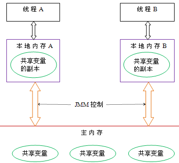
>
> ​	线程间通信： 
>
> 1. 首先，线程A把本地内存A中更新过的共享变量刷新到主内存中去。 
> 2. 然后，线程B到主内存中去读取线程A之前已更新过的共享变量。 

### 指令重排序，内存栅栏等

> ​	指令重排序：编译器或运行时环境为了优化程序性能而采取的对指令进行重新排序执行的一种手段。在单线程程序中，对存在控制依赖的操作重排序，不会改变执行结果；但在多线程程序中，对存在控制依赖的操作重排序，可能会改变程序的执行结果。 

### volatile的语义，它修饰的变量一定线程安全吗

>  一个变量被定义为volatile之后，具备两重语义：
>
>  ①保证此变量对所有线程的可见性，即当一条线程修改了这个值，新值对于其他所有线程来说是立即得知的，普通变量需要通过主内存传递。
>
>  ②禁止指令重排序优化。 
>
>  Volatile修饰的变量不一定是线程安全的，eg：非原子操作a++

### 类的实例化顺序，比如父类静态数据，构造函数，字段，子类静态数据，构造函数，字段，他们的执行顺序

> 先静态、先父后子。
>
> 先静态：父静态 > 子静态
>
> 优先级：父类 静态代码块> 子类 静态代码块 > 非静态代码块 > 构造函数
>
> 一个类的实例化过程：
>
> 1. 父类中的static代码块，当前类的static
> 2. 顺序执行父类的普通代码块
> 3. 父类的构造函数
> 4. 子类普通代码块
> 5. 子类（当前类）的构造函数，按顺序执行。
> 6. 子类方法的执行

### 锁优化：锁消除，锁粗化，锁偏向，轻量级锁

> ##### **锁优化**
>
> ​	为了在线程之间更高效地共享数据，解决竞争问题，从而提高程序的执行效率，实现了多种锁优化技术。
>
> **自旋锁与自适应自旋**
>
> ​	互斥同步对性能最大的影响：阻塞的实现，挂起和恢复线程的操作都需要转入内核态中完成。由于在很多时候，共享数据的锁定状态只会持续很短的时间，为了这段时间去进行挂起和恢复线程并不值得。因此可以考虑：当物理机有多个处理器，可以多次并行执行多个线程，此时可以让后面请求锁的线程稍等一会儿，但不放弃处理器的执行时间，看看持有锁的线程是否很快释放锁。为了让线程等待，会让线程执行一个忙循环(自旋)。
>
> ​	**自旋锁**：如果锁被占用的时间比较短，自旋等待的效果很好，避免了线程切换的开销。如果锁占用时间很长，自旋只会白白消耗处理器资源，因此自旋等待的时间会有一个限度。一般自旋次数 默认是 10次。自旋等待不能代替阻塞，主要原因是 虽然避免了线程切换的开销，但是需要占用处理器的执行时间。
>
> ​    **自适应自旋**：自适应表示 自旋的时间不固定，而是由 前一次在同一个锁上的 自旋时间 及 锁的拥有者状态 来决定。
>
> **锁消除**
>
> ​    对于一些代码要求同步，但被检测不可能存在共享数据竞争。此时会将同步锁移除。
>
> **锁粗化**
>
> ​    原则上：总是要求 同步块的作用范围尽可能的小。这样是使得 需要同步的操作数量尽可能变小，如果存在锁竞争，等待锁的线程也能尽快的拿到锁。
>
> ​    如果虚拟机检测到有一连串的操作 都是对同一个对象加锁，那么会将加锁同步的范围扩展到(粗化)到整个操作序列的外部。
>
> **轻量级锁**
>
> ​    在没有多线程竞争的前提下，轻量级锁使用CAS操作，来避免使用互斥量的开销。但是 若存在锁的竞争，此时不光有 互斥量的开销，还额外增加了CAS操作，因此在有竞争的情况下，轻量级锁会比重量级锁执行效率更慢。
>
> **偏向锁**
>
> ​    轻量级锁 是 在没有多线程竞争的前提下，使用CAS操作，来避免使用互斥量的开销。偏向锁 是在无竞争的情况下，将整个同步消除掉，连CAS操作都不做了。
>
> ​    当锁对象第一次被线程获取时，虚拟机会把对象的头的标志位设置为：01，即偏向模式。只要有另外的线程去产生获取这个锁，那么偏向模式就宣告结束。
>
> ​    偏向锁可以提高带有同步但无竞争的程序的性能。但是 它并不是总是对程序有利，如果程序中大多数的锁总是被多个不同的线程访问，那么偏向模式就是多余的。


# 1\. 缓存一致性问题

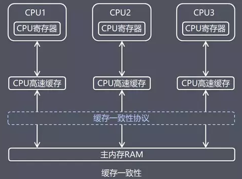

硬件内存架构

-   现代计算机一般都有 2 个以上 CPU，而且每个 CPU 还有可能包含多个核心。因此，如果应用是多线程的话，这些线程可能会在各个 CPU 核心中并行运行。
-   在 CPU 内部有一组 CPU 寄存器，也就是 CPU 的储存器。
    -   CPU 操作寄存器的速度要比操作计算机主存快的多。
    -   在主存和 CPU 寄存器之间还存在一个 CPU 缓存，CPU 操作 CPU 缓存的速度快于主存但慢于 CPU 寄存器。某些 CPU 可能有多个缓存层（一级缓存和二级缓存）。计算机的主存也称作 RAM，所有的 CPU 都能够访问主存，而且主存比上面提到的缓存和寄存器大很多。
    -   当一个 CPU 需要访问主存时，会先读取一部分主存数据到 CPU 缓存，进而在读取 CPU 缓存到寄存器。当 CPU 需要写数据到主存时，同样会先 flush 寄存器到  
        CPU 缓存，然后再在某些节点把缓存数据 flush 到主存。

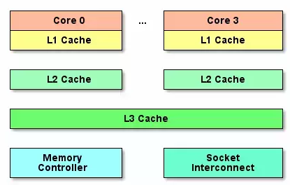

缓存架构

-   缓存大大缩小了高速 CPU 与低速内存之间的差距。以三层缓存架构为例。
    -   Core0 与 Core1 命中了内存中的同一个地址，那么各自的 L1 Cache 会缓存同一份数据的副本。
    -   Core0 修改了数据，两份缓存中的数据不同了，Core1 L1 Cache 中的数据相当于失效了。
-   除三级缓存外，各厂商实现的硬件架构中还存在多种多样的缓存，都存在类似的可见性问题。例如，寄存器就相当于 CPU 与 L1 Cache 之间的缓存。

## 1.2 MESI 协议

-   MESI（Modified Exclusive Shared Or Invalid，缓存的四种状态）协议的基本原理。
    -   Core0 修改数据 v 后，发送一个信号，将 Core1 缓存的数据 v 标记为失效，并将修改值写回内存。
    -   Core0 可能会多次修改数据 v，每次修改都只发送一个信号（发信号时会锁住缓存间的总线），Core1 缓存的数据 v 保持着失效标记。
    -   Core1 使用数据 v 前，发现缓存中的数据 v 已经失效了，得知数据 v 已经被修改，于是重新从其他缓存或内存中加载数据 v。
-   MESI 协议可以解决 CPU 缓存层面的一致性问题。

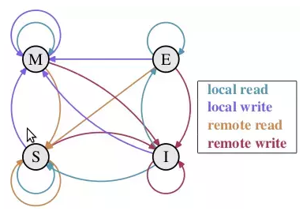

MESI 协议缓存状态

| 状态                 | 说明                                                         |
| -------------------- | ------------------------------------------------------------ |
| M（修改，Modified）  | 本地处理器已经修改缓存行, 即是脏行, 它的内容与内存中的内容不一样. 并且此 cache 只有本地一个拷贝（专有）。 |
| E（专有，Exclusive） | 缓存行内容和内存中的一样, 而且其它处理器都没有这行数据。     |
| S（共享，Shared）    | 缓存行内容和内存中的一样, 有可能其它处理器也存在此缓存行的拷贝。 |
| I（无效，Invalid）   | 缓存行失效, 不能使用。                                       |

# 2\. 优化重排序问题

-   在执行程序时，为了提高性能，处理器和编译器会对指令做重排序。
    -   **指令级并行的重排序**。如果不存在数据依赖性，**处理器** 可以改变语句对应机器指令的执行顺序。
    -   **编译器优化的重排序**。**编译器** 在不改变单线程程序语义的前提下，可以重新安排语句的执行顺序。
    -   **内存系统的重排序**。处理器使用 **缓存和读/写缓冲区**，这使得加载和存储操作看上去可能是在乱序执行。（导致的可见性问题也可以通过 MESI 协议解决）

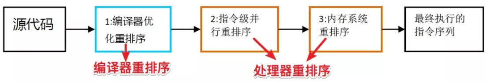

重排序

-   重排序不是随意重排序，它需要满足以下两个条件。

_数据依赖性_

-   如果两个操作访问同一个变量，其中一个为写操作，此时这两个操作之间存在数据依赖性。编译器和处理器不会改变存在数据依赖性关系的两个操作的执行顺序，即不会重排序。

_as-if-serial_

-   所有的动作（Action）都可以为了优化而被重排序，但是必须保证它们重排序后的结果和程序代码本身（单线程下的执行）的应有结果是一致的，编译器、runtime 和处理器都必须遵守 as-if-serial 语义。

## 2.1 指令级并行的重排序（处理器）

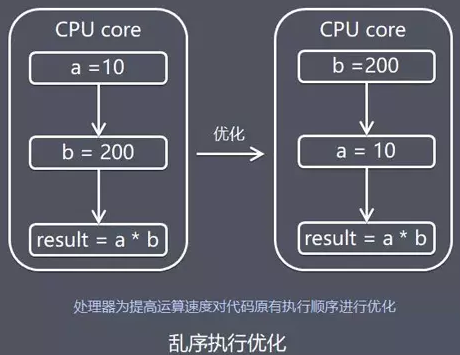

指令级并行的重排序

-   只要不影响程序单线程、顺序执行的结果，就可以对两个指令重排序。
-   乱序执行技术是处理器为提高运算速度而做出违背代码原有顺序的优化。

| 不优化时的执行过程                                           | 优化时的执行过程                                             |
| ------------------------------------------------------------ | ------------------------------------------------------------ |
| 指令获取。                                                   | 指令获取。                                                   |
| 如果输入的运算对象是可以获取的（比如已经存在于寄存器中），这条指令会被发送到合适的功能单元。如果一个或者更多的运算对象在当前的时钟周期中是不可获取的（通常需要从主内存获取），处理器会开始等待直到它们是可以获取的。 | 指令被发送到一个指令序列（也称执行缓冲区或者保留站）中。     |
| 指令在合适的功能单元中被执行。                               | 指令将在序列中等待，直到它的数据运算对象是可以获取的。然后，指令被允许在先进入的、旧的指令之前离开序列缓冲区。（此处表现为乱序） |
| 功能单元将运算结果写回寄存器。                               | 指令被分配给一个合适的功能单元并由之执行。                   |
|                                                              | 结果被放到一个序列中。                                       |
|                                                              | 仅当所有在该指令之前的指令都将他们的结果写入寄存器后，这条指令的结果才会被写入寄存器中。（重整乱序结果） |

## 2.2 编译器优化的重排序

-   和处理器乱序执行的目的是一样的，与其等待阻塞指令（如等待缓存刷入）完成，不如先执行其他指令。与处理器乱序执行相比，编译器重排序能够完成更大范围、效果更好的乱序优化。
-   编译器层面的重排序，自然可以由编译器控制。使用 **volatile** 做标记，就可以禁用编译器层面的重排序。
-   JVM 自己维护的 **内存模型** 中也有可见性问题，使用 volatile 做标记，取消 volatile 变量的缓存，就解决了 JVM 层面的可见性问题。

# 3\. 内存模型

-   可以把内存模型理解为在特定操作协议下，对特定的内存或高速缓存进行读写访问的过程抽象。
-   在并发编程需要处理的两个关键问题是：线程之间如何**通信** 和 线程之间如何**同步**。

_通信_

-   通信是指线程之间以何种机制来交换信息。
-   命令式编程中，线程之间的通信机制有两种，是 **共享内存** 和 **消息传递**。
    -   共享内存的并发模型里，线程之间共享程序的公共状态，线程之间通过写-读内存中的 **公共状态** 来 **隐式** 进行通信。
    -   消息传递的并发模型里，线程之间没有公共状态，线程之间必须通过明确的 **发送消息** 来 **显式** 进行通信。

_同步_

-   同步是指程序用于控制不同线程之间操作发生相对顺序的机制。
    
    -   共享内存的并发模型里，同步是 **显式** 进行的。程序员必须显式指定某个方法或某段代码需要在线程之间 **互斥执行**。
    -   消息传递的并发模型里，由于消息的发送必须在消息的接收之前，因此同步是 **隐式** 进行的。
-   Java 的并发采用的是 **共享内存模型**，线程之间的通信对程序员完全透明。
    

## 3.1 顺序一致性内存模型

-   顺序一致性内存模型有两大特性。
    -   一个线程中的所有操作必须按照程序的顺序来执行。
    -   （不管程序是否同步）所有线程都只能看到一个单一的操作执行顺序。在顺序一致性内存模型中，每个操作都必须原子执行且立刻对所有线程可见。

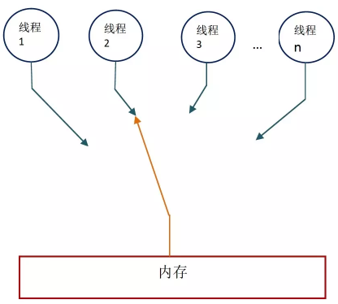

顺序一致性内存模型

-   在概念上，顺序一致性模型有一个单一的全局内存，这个内存通过一个左右摆动的开关可以连接到任意一个线程，同时每一个线程必须按照程序的顺序来执行内存读/写操作。
-   在任意时间点最多只能有一个线程可以连接到内存。
-   当多个线程并发执行时，开关装置能把所有线程的所有内存读/写操作串行化。

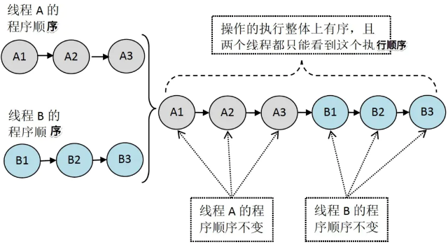

一致性模型执行效果

-   假设这两个线程使用监视器锁来正确同步：A 线程的三个操作执行后释放监视器锁，随后 B 线程获取同一个监视器锁。那么程序在顺序一致性模型中的执行效果。

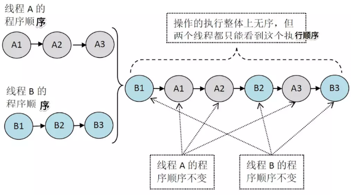

未同步程序在一致性模型中执行效果

-   未同步程序在顺序一致性模型中虽然整体执行顺序是无序的，但所有线程都只能看到一个一致的整体执行顺序。
-   之所以能得到这个保证是因为顺序一致性内存模型中的每个操作必须立即对任意线程可见。
    -   在 JMM 中就没有这个保证。未同步程序在 JMM 中不但整体的执行顺序是无序的，而且所有线程看到的操作执行顺序也可能不一致。比如，在当前线程把写过的数据缓存在本地内存中，在还没有刷新到主内存之前，这个写操作仅对当前线程可见。
    -   从其他线程的角度来观察，会认为这个写操作根本还没有被当前线程执行。只有当前线程把本地内存中写过的数据刷新到主内存之后，这个写操作才能对其他线程可见。
    -   在这种情况下，当前线程和其它线程看到的操作执行顺序将不一致。
-   在顺序一致性模型中，所有操作完全按程序的顺序执行。而在 JMM 中，临界区内的代码可以重排序（但 JMM 不允许临界区内的代码 " 逸出 " 到临界区之外，那样会破坏监视器的语义）。JMM 会在退出临界区和进入临界区这两个关键时间点做一些特别处理，使得线程在这两个时间点具有与顺序一致性模型相同的内存视图。
-   JMM 在具体实现上的基本方针：在不改变（正确同步的）程序执行结果的前提下，尽可能的为编译器和处理器的优化打开方便之门。
-   JMM 中与在顺序一致性内存模型中的执行结果的异同。

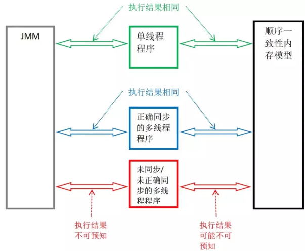

JMM 中与在顺序一致性内存模型中的执行结果的异同

# 4\. 抽象结构（JMM）

-   不同架构的物理计算机可以有不一样的内存模型，Java 虚拟机也有自己的内存模型。
    -   Java 虚拟机规范中试图定义一种 Java 内存模型（Java Memory Model，简称 JMM）来屏蔽掉各种硬件和操作系统的内存访问差异，以实现让 Java 程序在各种平台下都能达到一致的内存访问效果，不必因为不同平台上的物理机的内存模型的差异，对各平台定制化开发程序。
    -   Java 内存模型提出目标在于，定义程序中各个变量的访问规则，即在虚拟机中将变量存储到内存和从内存中取出变量这样的底层细节。
-   Java 线程之间的通信由 Java 内存模型（JMM）控制，JMM 决定一个线程对共享变量（实例域、静态域和数组）的写入何时对其它线程可见。
    -   从抽象的角度来看，JMM 定义了线程和主内存 Main Memory（堆内存）之间的抽象关系：线程之间的共享变量存储在主内存中，每个线程都有自己的本地内存（工作内存） Local Memory（只是一个抽象概念，物理上不存在），存储了该线程的共享变量副本。
    -   本地内存是 JMM 的一个抽象概念，并不真实存在。它涵盖了缓存，写缓冲区，寄存器以及其他的硬件和编译器优化。
    -   JMM 属于语言级的内存模型，它确保在不同的编译器和不同的处理器平台之上，通过插入特定类型的 **Memory Barrier**（内存屏障）来禁止特定类型的编译器重排序和处理器重排序，为上层提供一致的内存可见性保证。

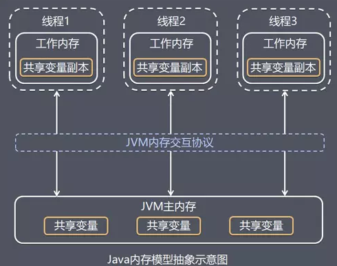

Java 内存模型抽象

-   线程 A 和线程 B 之间需要通信的话，必须经过两个步骤：
    -   线程 A 把本地内存（工作内存） A 中更新过的共享变量副本刷新到主内存中。
    -   线程 B 到主内存中读取线程 A 之前更新过的共享变量。
-   两个步骤实质上是线程 A 再向线程 B 发送消息，而这个通信过程必须经过主内存。
    -   JMM 通过控制主内存与每个线程的本地内存（工作内存）之间的交互，来为 Java 程序员提供内存可见性保证。

## 4.1 happens-before 关系（先行发生原则）

-   一会是编译器重排序一会是处理器重排序，如果让程序员再去了解这些底层的实现以及具体规则，那么程序员的负担就太重了，严重影响了并发编程的效率。因此，JMM 为程序员在上层提供了 8 个规则，这样我们就可以根据规则去推论跨线程的内存可见性问题，而不用再去理解底层重排序的规则。
    
-   从 jdk5 开始，Java 使用新的 JSR-133 内存模型，基于 happens-before 的概念来阐述操作之间的内存可见性。
    
-   在 JMM 中，如果一个操作执行的结果需要对另一个操作可见，那么这两个操作之间必须要存在 happens-before 关系。这里提到的两个操作既可以是在一个线程之内，也可以是在不同线程之间。
    
-   JMM 的设计示意图。
    

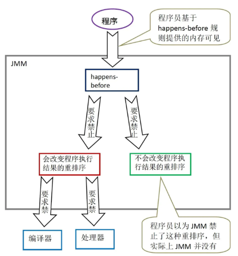

JMM 的设计示意图

-   **JMM 可以通过 happens-before 关系向程序员提供跨线程的内存可见性保证**（如果线程 A 的写操作 a 与 B 线程的读操作 b 之间存在 happens-before 关系，尽管 a 操作和 b 操作在不同的线程中执行，但 JMM 向程序员保证 a 操作将对 b 操作可见）。
    
-   具体的定义为。
    
    -   1）如果一个操作 happens-before 另一个操作，那么第一个操作的执行结果将对第二个操作可见，而且第一个操作的执行顺序排在第二个操作之前。
        -   这是 **JMM 对程序员的承诺**。从程序员的角度来说，可以这样理解 happens-before 关系：如果 A happens-before B，那么 Java 内存模型将向程序员保证，A 操作的结果将对 B 可见，且 A 的执行顺序排在 B 之前。注意，这只是 Java 内存模型向程序员做出的保证。
    -   2）两个操作之间存在 happens-before 关系，并不意味着 Java 平台的具体实现必须要按照 happens-before 关系指定的顺序来执行。如果重排序之后的执行结果，与按 happens-before 关系来执行的结果一致，那么这种重排序并不非法（也就是说，JMM 允许这种重排序）。
        -   这是 **JMM 对编译器和处理器重排序的约束原则**。JMM 其实是在遵循一个基本原则：只要不改变程序的执行结果（指的是单线程程序和正确同步的多线程程序），编译器和处理器怎么优化都行。JMM 这么做的原因是：程序员对于这两个操作是否真的被重排序并不关心，程序员关心的是程序执行时的语义不能被改变（即执行结果不能被改变）。因此，happens-before 关系本质上和 as-if-serial 语义是一回事。
-   happens-before 的具体规则如下。
    

| 规则              | 说明                                                         |
| ----------------- | ------------------------------------------------------------ |
| 程序次序规则      | 一个线程内，按照代码顺序，书写在前面的操作 happens-before 书写在后面的操作。 |
| 锁定规则          | 一个 unLock 操作 happens-before 后面对同一个锁的 lock 操作。 |
| volatile 变量规则 | 对一个变量的写操作 happens-before 后面对这个变量的读操作。   |
| 传递规则          | 如果操作 A happens-before 操作 B，而操作 B 又 happens-before 操作 C，则可以得出操作 A happens-before 操作 C。 |
| 线程启动规则      | Thread 对象的 start() 方法 happens-before 此线程的每个一个动作。 |
| 线程中断规则      | 对线程 interrupt() 方法的调用 happens-before 被中断线程的代码检测到中断事件的发生。 |
| 线程终结规则      | 线程中所有的操作都 happens-before 线程的终止检测，我们可以通过 Thread.join() 方法结束、Thread.isAlive() 的返回值手段检测到线程已经终止执行。 |
| 对象终结规则      | 一个对象的初始化完成 happens-before 它的 finalize() 方法的开始。 |

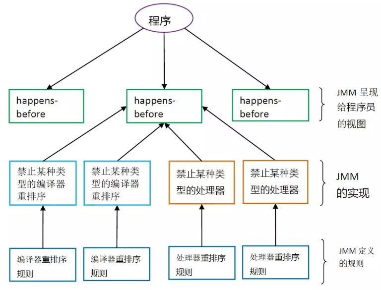

happens-before 与 JMM 的关系

-   一个 happens-before 规则对应于一个或多个编译器和处理器重排序规则。对于  
    Java 程序员来说，happens-before 规则简单易懂，它避免 Java 程序员为了理解  
    JMM 提供的内存可见性保证而去学习复杂的重排序规则以及这些规则的具体实现方法。

### 4.1.1 as-if-serial 和 happens-before 比较

-   as-if-serial 语义保证单线程内程序的执行结果不被改变，happens-before 关系保证正确同步的多线程程序的执行结果不被改变。
-   as-if-serial 语义给编写单线程程序的程序员创造了一个幻境：单线程程序是按程序的顺序来执行的。happens-before 关系给编写正确同步的多线程程序的程序员创造了一个幻境：正确同步的多线程程序是按 happens-before 指定的顺序来执行的。
-   as-if-serial 语义和 happens-before 这么做的目的，都是为了在不改变程序执行结果的前提下，尽可能地提高程序执行的并行度。

## 4.2 Java 内存模型的实现

-   关于主内存与本地内存（工作内存）之间的具体交互协议，即一个变量如何从主内存拷贝到工作内存、如何从工作内存同步回主内存之类的实现细节。
    -   Java 内存模型中定义了下面 **8** 种操作来完成。

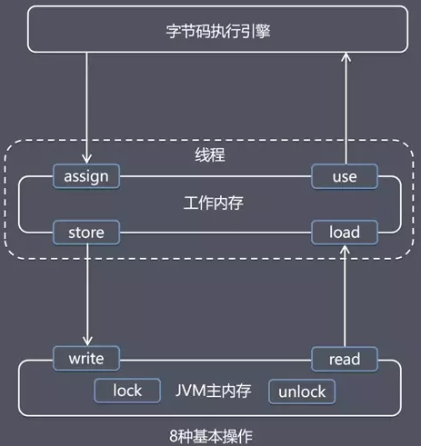

8 种基本操作

| 操作          | 作用                                                         |
| ------------- | ------------------------------------------------------------ |
| lock (锁定)   | 作用于主内存的变量，它把一个变量标识为一条线程独占的状态。   |
| unlock (解锁) | 作用于主内存的变量，它把一个处于锁定状态的变量释放出来，释放后的变量才可以被其他线程锁定。 |
| read (读取)   | 作用于主内存的变量，它把一个变量的值从主内存传输到线程的工作内存中，以便随后的 load 动作使用。 |
| load (载入)   | 作用于工作内存的变量，它把 read 操作从主内存中得到的变量值放入工作内存的变量副本中。 |
| use (使用)    | 作用于工作内存的变量，它把工作内存中一个变量的值传递给执行引擎，每当虚拟机遇到一个需要使用到变量的值的字节码指令时就会执行这个操作。 |
| assign (赋值) | 作用于工作内存的变量，它把一个从执行引擎接收到的值赋给工作内存的变量，每当虚拟机遇到一个给变量赋值的字节码指令时执行这个操作。 |
| store (存储)  | 作用于工作内存的变量，它把工作内存中一个变量的值传送到主内存中，以便随后 write 操作使用。 |
| write (写入)  | 作用于主内存的变量，它把 Store 操作从工作内存中得到的变量的值放入主内存的变量中。 |

-   内存交互基本操作的 **3** 个特性。

_原子性_

-   原子性即一个操作或者多个操作，要么全部执行并且执行的过程不会被任何因素打断，要么就都不执行。原子是世界上的最小单位，具有不可分割性。
-   在 Java 中，对基本数据类型的变量的读取和赋值操作是原子性操作，即这些操作是不可被中断的，要么执行，要么不执行。

_可见性_

-   可见性是指当多个线程访问同一个变量时，一个线程修改了这个变量的值，其他线程能够立即看得到修改的值。
-   JMM 是通过在线程 A 变量工作内存修改后将新值同步回主内存，线程 B 在变量读取前从主内存刷新变量值，这种依赖主内存作为传递媒介的方式来实现可见性。

_有序性_

-   有序性规则表现在以下两种场景。
    
    -   **线程内**，从某个线程的角度看方法的执行，指令会按照一种叫 " 串行 "（as-if-serial）的方式执行，此种方式已经应用于顺序编程语言。
    -   **线程间**，这个线程 " 观察 " 到其他线程并发地执行非同步的代码时，由于指令重排序优化，任何代码都有可能交叉执行。
    -   唯一起作用的约束是：对于同步方法，同步块（synchronized 关键字修饰）以及 volatile 字段的操作仍维持相对有序。
-   Java 内存模型的一系列运行规则，都是围绕原子性、可见性、有序性特征建立。是为了实现共享变量的在多个线程的工作内存的数据一致性，多线程并发，指令重排序优化的环境中程序能如预期运行。
    

## 4.3 Memory Barrier（内存屏障）

-   内存屏障（Memory Barrier），又称内存栅栏，是一个 CPU 指令。
-   基本内存屏障可以分为：LoadLoad 屏障、LoadStore 屏障、StoreStore 屏障和 StoreLoad 屏障。
-   内存屏障有两个作用。
    -   阻止屏障两侧的指令重排序，插入一条 Memory Barrier 会告诉编译器和 CPU，不管什么指令都不能和这条 Memory Barrier 指令重排序。
    -   强制把写缓冲区/高速缓存中的脏数据等写回主内存，让缓存中相应的数据失效。如一个 Write-Barrier（写入屏障）将刷出所有在 Barrier 之前写入 cache 的数据，因此，任何 CPU 上的线程都能读取到这些数据的最新版本。
-   内存屏障阻碍了 CPU 采用优化技术来降低内存操作延迟，因此必定会带来性能损失。

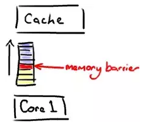

Memory Barrier

| 屏障类型        | 指令示例                   | 说明                                                         |
| --------------- | -------------------------- | ------------------------------------------------------------ |
| LoadLoad 屏障   | Load1; LoadLoad; Load2     | 在 Load2 及后续读取操作要读取的数据被访问前，保证 Load1 要读取的数据被读取完毕。 |
| StoreStore 屏障 | Store1; StoreStore; Store2 | 在 Store2 及后续写入操作执行前，保证 Store1 的写入操作对其它处理器可见。 |
| LoadStore 屏障  | Load1; LoadStore; Store2   | 在 Store2 及后续写入操作被执行前，保证 Load1 要读取的数据被读取完毕。 |
| StoreLoad 屏障  | Store1; StoreLoad; Load2   | 在 Load2 及后续所有读取操作执行前，保证 Store1 的写入对所有处理器可见。它的开销是四种屏障中最大的（冲刷写缓冲器，清空无效化队列）。在大多数处理器的实现中，这个屏障是个万能屏障，兼具其它三种内存屏障的功能。 |

-   Java 中对内存屏障的使用常见的有 volatile 和 synchronized 关键字修饰的代码块，还可以通过 Unsafe 这个类来使用内存屏障。

### 4.3.1 x86架构的内存屏障

-   x86架构并没有实现全部的内存屏障。

_Store Barrier_

-   sfence 指令实现了Store Barrier，相当于 StoreStore Barriers。
    -   强制所有在 sfence 指令之前的 store 指令，都在该 sfence 指令执行之前被执行，发送缓存失效信号，并把 store buffer 中的数据刷出到 CPU 的 L1 Cache 中。
    -   所有在 sfence 指令之后的 store 指令，都在该 sfence 指令执行之后被执行。即禁止对 sfence 指令前后 store 指令的重排序跨越 sfence 指令，使所有 Store Barrier 之前发生的内存更新都是可见的。这里的 " 可见 "，指修改值可见（内存可见性）且操作结果可见（禁用重排序）。

_Load Barrier_

-   lfence 指令实现了 Load Barrier，相当于 LoadLoad Barriers。
    -   强制所有在 lfence 指令之后的 load 指令，都在该 lfence 指令执行之后被执行，并且一直等到 load buffer 被该 CPU 读完才能执行之后的 load 指令（发现缓存失效后发起的刷入）。即禁止对 lfence 指令前后 load 指令的重排序跨越 lfence 指令，配合 Store Barrier，使所有 Store Barrier 之前发生的内存更新，对 Load Barrier 之后的 load 操作都是可见的。

_Full Barrier_

-   mfence 指令实现了 Full Barrier，相当于 StoreLoad Barriers。
    -   mfence 指令综合了 sfence 指令与 lfence 指令的作用，强制所有在 mfence 指令之前的 store/load 指令，都在该 mfence 指令执行之前被执行。
    -   所有在 mfence 指令之后的 store/load 指令，都在该 mfence 指令执行之后被执行。即禁止对 mfence 指令前后 store/load 指令的重排序跨越 mfence 指令，使所有 Full Barrier 之前发生的操作，对所有 Full Barrier 之后的操作都是可见的。

## 4.4 同步规则

-   JMM 在执行前面 4.1 中介绍的 8 种基本操作时，为了保证内存间数据一致性，JMM 中规定需要满足以下规则。

| 规则   | 说明                                                         |
| ------ | ------------------------------------------------------------ |
| 规则 1 | 如果要把一个变量从主内存中复制到工作内存，就需要按顺序的执行 read 和 load 操作，如果把变量从工作内存中同步回主内存中，就要按顺序的执行 store 和 write 操作。但 Java 内存模型只要求上述操作必须按顺序执行，而没有保证必须是连续执行。 |
| 规则 2 | 不允许 read 和 load、store 和 write 操作之一单独出现。       |
| 规则 3 | 不允许一个线程丢弃它的最近 assign 的操作，即变量在工作内存中改变了之后必须同步到主内存中。 |
| 规则 4 | 不允许一个线程无原因的（没有发生过任何 assign 操作）把数据从工作内存同步回主内存中。 |
| 规则 5 | 一个新的变量只能在主内存中诞生，不允许在工作内存中直接使用一个未被初始化（load 或 assign ）的变量。即对一个变量实施 use 和 store 操作之前，必须先执行过了 load 或 assign 操作。 |
| 规则 6 | 一个变量在同一个时刻只允许一条线程对其进行 lock 操作，但 lock 操作可以被同一条线程重复执行多次，多次执行 lock 后，只有执行相同次数的 unlock 操作，变量才会被解锁。所以 lock 和 unlock 必须成对出现。 |
| 规则 7 | 如果对一个变量执行 lock 操作，将会清空工作内存中此变量的值，在执行引擎使用这个变量前需要重新执行 load 或 assign 操作初始化变量的值。 |
| 规则 8 | 如果一个变量事先没有被 lock 操作锁定，则不允许对它执行 unlock 操作；也不允许去 unlock 一个被其他线程锁定的变量。 |
| 规则 9 | 对一个变量执行 unlock 操作之前，必须先把此变量同步到主内存中（执行 store 和 write 操作）。 |

-   规则 1、规则 2，工作内存中的共享变量作为主内存的副本。
    -   主内存变量的值同步到工作内存需要 read 和 load 一起使用。
    -   工作内存中的变量的值同步回主内存需要 store 和 write 一起使用。
    -   这 2 组操作各自都是一个固定的有序搭配，不允许单独出现。
-   规则 3、规则 4，由于工作内存中的共享变量是主内存的副本，为保证数据一致性，当工作内存中的变量被字节码引擎重新赋值，必须同步回主内存。
    -   如果工作内存的变量没有被更新，不允许无原因同步回主内存。
-   规则 5，由于工作内存中的共享变量是主内存的副本，必须从主内存诞生。
-   规则 6、7、8、9，为了并发情况下安全使用变量，线程可以基于 lock 操作独占主内存中的变量，其他线程不允许使用或 unlock 该变量，直到变量被线程 unlock。

## 4.5 volatile 关键字

-   volatile 的语义是 **保证可见性** 和 **禁止进行指令重排序**，不能确保 **原子性**。

_保证可见性_

-   保证了不同线程对该变量操作的内存可见性。
    -   线程对变量进行修改之后，要立刻回写到主内存。
    -   线程对变量读取的时候，要从主内存中读，而不是从线程的工作内存。

_禁止进行指令重排序_

-   当程序执行到 volatile 变量的读操作或者写操作时，在其前面的操作的更改肯定全部已经进行，且结果已经对后面的操作可见。在其后面的操作肯定还没有进行。
-   在进行指令优化时，不能将在对 volatile 变量访问的语句放在其后面执行，也不能把 volatile 变量后面的语句放到其前面执行。
    -   普通的变量仅仅会保证该方法的执行过程中所有依赖赋值结果的地方都能获取到正确的结果，而不能保证赋值操作的顺序与程序代码中的执行顺序一致。

_不能确保原子性_

-   例如自增 i++ 操作。将该操作拆分步骤为：
    -   1）从主内存读取 volatile 变量值 i 到工作内存。
    -   2）增加变量 i 的值。
    -   3）把工作内存的值写回主内存，让其它的线程可见。
-   因为 happens-before 中的 volatile 变量规则只规定了 **对一个变量的写操作 happens-before 后面对这个变量的读操作**。所以中间的过程（从 Load 到 Store）是不安全的。中间如果其他的 CPU 修改了值将会丢失。例如执行到步骤 2 时，线程B 对变量 i 进行了修改，但是线程 A 是不会感知的。只有线程 A 在下一次读取时，由于可见性才会感知到被线程 B 修改后的新值。

### 4.5.1 volatile 的实现原理

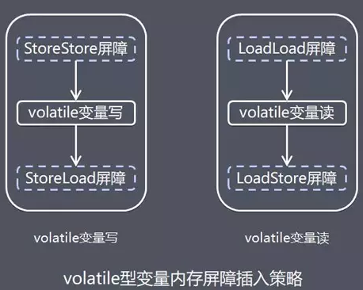

volatile

-   具体实现方式是在编译期生成字节码时，会在指令序列中增加 **内存屏障** 来保证。
    -   在每个 volatile 写操作的前面插入一个 StoreStore 屏障。该屏障除了保证了屏障之前的写操作和该屏障之后的写操作不能重排序，还会保证了 volatile 写操作之前，任何的读写操作都会先于 volatile 被提交。
    -   在每个 volatile 写操作的后面插入一个 StoreLoad 屏障。该屏障除了使 volatile 写操作不会与之后的读操作重排序外，还会刷新处理器缓存，使 volatile 变量的写更新对其他线程可见。
    -   在每个 volatile 读操作的后面插入一个 LoadLoad 屏障。该屏障除了使 volatile 读操作不会与之前的写操作发生重排序外，还会刷新处理器缓存，使 volatile 变量读取的为最新值。
    -   在每个 volatile 读操作的后面插入一个 LoadStore 屏障。该屏障除了禁止了 volatile 读操作与其之后的任何写操作进行重排序，还会刷新处理器缓存，使其他线程 volatile 变量的写更新对 volatile 读操作的线程可见。

# 4.6 final 关键字

_final 域的重排序规则_

-   在构造函数内对一个 final 域的写入，与随后把这个被构造对象的引用赋值给一个引用变量，这两个操作不能重排序。
-   初次读一个包含 final 域的对象的引用，与随后初次读这个 final 域，这两个操作之间不能重排序。

_写 final 域的重排序规则_

-   JMM 禁止编译器把 final 域的写重排序到构造函数之外。
    -   final 成员变量必须在声明的时候初始化或者在构造器中初始化，否则就会报编译错误。
    -   被 final 修饰的字段在声明时或者构造器中，一旦初始化完成，那么在其他线程无须同步就能正确看见 final 字段的值。
-   编译器会在 final 域的写之后，构造函数 return 之前，插入一个 StoreStore 屏障。这个屏障禁止处理器把 final 域的写重排序到构造函数之外。

_读 final 域的重排序规则_

-   初次读一个包含 final 域的对象的引用，与随后初次读这个 final 域，这两个操作之间不能重排序。编译器会在读 final 域操作的前面插入一个 LoadLoad 屏障。
    
-   当构造函数结束时，final 类型的值是被保证其他线程访问该对象时，它们的值是可见的。
    
-   final 类型的成员变量的值，包括那些用 final 引用指向的 collections 的对象，是读线程安全而无需使用 synchronized 的。
    

### 4.6.1 使用 final 的限制条件和局限性

-   当声明一个 final 成员时，必须在构造函数退出前设置它的值。

```java
public class MyClass {
  private final int myField = 1;
  public MyClass() {
    ...
  }
}
```

或者

```java
public class MyClass {
  private final int myField;
  public MyClass() {
    ...
    myField = 1;
    ...
  }
}
```

-   将指向对象的成员声明为 final 只能将该引用设为不可变的，而非所指的对象。

下面的方法仍然可以修改该 list。

```java
private final List myList = new ArrayList();
myList.add("Hello");
```

声明为 final 可以保证如下操作不合法

```java
myList = new ArrayList();
myList = someOtherList;
```

-   如果一个对象将会在多个线程中访问并且你并没有将其成员声明为 final，则必须提供其他方式保证线程安全。
-   " 其他方式 " 可以包括声明成员为 volatile，使用 synchronized 或者显式 Lock 控制所有该成员的访问。

## 4.7 synchronized 关键字

-   synchronized 是 Java 中的关键字，是一种同步锁。
    -   修饰一个代码块，被修饰的代码块称为同步语句块，其作用的范围是大括号 {} 括起来的代码，作用的对象是大括号中的对象。一次只有一个线程进入该代码块，此时，线程获得的是成员锁。
    -   修饰一个方法，被修饰的方法称为同步方法，锁是当前实例对象。线程获得的是成员锁，即一次只能有一个线程进入该方法，其他线程要想在此时调用该方法，只能排队等候。
    -   修饰一个静态的方法，其作用的范围是整个静态方法，锁是当前 Class 对象。线程获得的是对象锁，即一次只能有一个线程进入该方法（该类的所有实例），其他线程要想在此时调用该方法，只能排队等候。
-   当 synchronized 锁住一个对象后，别的线程如果也想拿到这个对象的锁，就必须等待这个线程执行完成释放锁，才能再次给对象加锁，这样才达到线程同步的目的。即使两个不同的代码段，都要锁同一个对象，那么这两个代码段也不能在多线程环境下同时运行。
-   在使用 synchronized 关键字的时候，能缩小代码段的范围就尽量缩小，能在代码段上加同步就不要再整个方法上加同步。
-   无论 synchronized 关键字加在方法上还是对象上，它取得的锁都是对象，而不是把一段代码或函数当作锁。而且同步方法很可能还会被其他线程的对象访问。
-   每个对象只有一个锁（lock）与之相关联。
-   实现同步是要很大的系统开销作为代价的，甚至可能造成死锁，所以尽量避免无谓的同步控制。

## 4.8 锁

-   锁释放和获取的内存语义。
    
    -   当线程释放锁时，JMM 会把该线程对应的本地内存中的共享变量刷新到主内存中。
    -   当线程获取锁时，JMM 会把该线程对应的本地内存置为无效。从而使得被监视器保护的临界区代码必须要从主内存中去读取共享变量。
-   concurrent 包的源代码实现通用化的实现模式。
    
    -   首先，声明共享变量为 volatile。
    -   然后，使用 CAS 的原子条件更新来实现线程之间的同步。
    -   同时，配合以 volatile 的读/写和 CAS 所具有的 volatile 读和写的内存语义来实现线程之间的通信。
-   AQS，非阻塞数据结构和原子变量类（java.util.concurrent.atomic 包中的类），这些 concurrent 包中的基础类都是使用这种模式来实现的，而 concurrent 包中的高层类又是依赖于这些基础类来实现的。
    

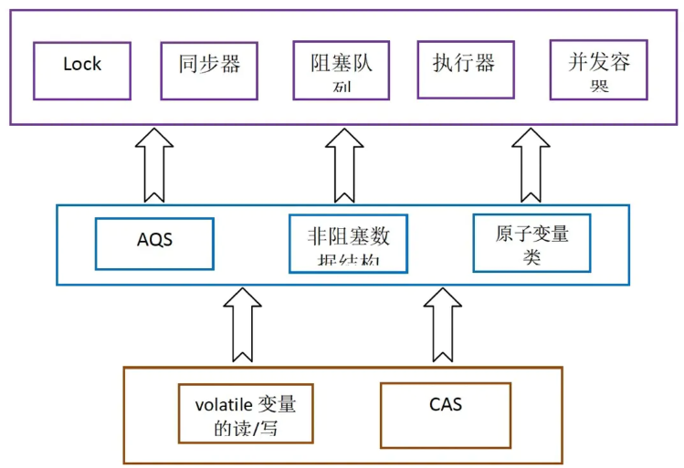

concurrent 包的源码实现

## 4.9 long 和 double 型变量

-   Java 内存模型要求 lock、unlock、read、load、assign、use、store、write 这 8 种操作都具有原子性。但是对于 64 位的数据类型（long 和 double），在模型中特别定义相对宽松的规定：允许虚拟机将没有被 volatile 修饰的 64 位数据的读写操作分为 2 次 32 位的操作来进行。也就是说虚拟机可选择不保证 64 位数据类型的 load、store、read 和 write 这 4 个操作的原子性。
    -   由于这种非原子性，有可能导致其他线程读到同步未完成的 " 32 位的半个变量 " 的值。
    -   不过实际开发中，Java 内存模型强烈建议虚拟机把 64 位数据的读写实现为具有原子性。
    -   目前各种平台下的商用虚拟机都选择把 64 位数据的读写操作作为原子操作来对待，因此我们在编写代码时一般不需要把用到的 long 和 double 变量专门声明为 volatile。

## 4.10 常见处理器内存模型

-   JMM 是一个语言级的内存模型，处理器内存模型是硬件级的内存模型，顺序一致性内存模型是一个理论参考模型。
-   如果完全按照顺序一致性模型来实现处理器和 JMM，那么很多处理器和编译器优化都要被禁止，这对性能将会有很大的影响。
-   根据不同类型的读/写操作组合的执行顺序的放松，可以把常见处理器的内存模型划分为以下几种类型。
    -   放松程序中写-读操作的顺序。产生 Total Store Ordering 内存模型（TSO）。
    -   在上面的基础上，继续放松程序中的写-写操作的顺序。产生 Partial Store Order 内存模型（PSO）。
    -   在前面两条的基础上，继续放松程序中的读-写 和 读-读操作的顺序。产生 Relaxed Memory Order 内存模型（RMO）和 PowerPc 内存模型。
-   注意：这里处理器对读/写的放松，是以两个操作之间不存在数据依赖性为前提的。

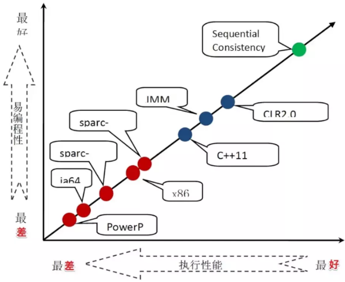

内存模型的强弱对比

-   常见处理器内存模型的细节特征。

| 内存模型名称 | 对应的处理器 | Store-Load 重排序 | Store-Store重排序 | Load-Load 和Load-Store重排序 | 可以更早读取到其它处理器的写 | 可以更早读取到当前处理器的写 |
| ------------ | ------------ | ----------------- | ----------------- | ---------------------------- | ---------------------------- | ---------------------------- |
| TSO          | sparc-TSO    | X64               | Y                 |                              |                              | Y                            |
| PSO          | sparc-PSO    | Y                 | Y                 |                              |                              | Y                            |
| RMO          | ia64         | Y                 | Y                 | Y                            |                              | Y                            |
| PowerPC      | PowerPC      | Y                 | Y                 | Y                            | Y                            | Y                            |

## 4.11 伪共享

-   CPU 缓存系统中是以缓存行（cache line）为单位存储的。
    -   目前主流的 CPU 缓存的缓存行大小都是 64 Bytes。
    -   在多线程情况下，如果需要修改 " 共享同一个缓存行的变量 "，就会无意中影响彼此的性能，这就是伪共享（False Sharing）。

**_CPU 的三级缓存_**

-   由于 CPU 的速度远远大于内存速度，所以 CPU 设计者们就给 CPU 加上了缓存（CPU 缓存），以免运算被内存速度拖累。
-   CPU 缓存分成了三个级别：L1，L2，L3。
    -   级别越小越接近 CPU，速度更快, 同时容量越小。
    -   CPU 获取数据是依次从 L1，L2，L3 中查找，找不到则直接向内存查找。

**_缓存行_**

-   由于共享变量在 CPU 缓存（Cache）中的存储是以缓存行（Cache line）为单位，一个缓存行可以存储 **多个变量**（存满当前缓存行的字节数）。
    -   每个缓存行除了包含数据，还包含 TAG（地址信息）和状态信息（MESI 协议）。
    -   而 CPU 对缓存的修改又是以 **缓存行** 为最小单位，所以会出现伪共享问题。
-   今天的 CPU 不再按字节访问内存，大部分 x86 CPU 是以 **64 字节** 为单位的块（chunk）拿取，称为一个缓存行（Cache line），可以理解为 CPU 缓存中的最小缓存单位。
-   当读一个特定的内存地址，整个缓存行将从主存换入（拷贝至）缓存，并且访问同一个缓存行内的其它值的开销会很小，例如。

```java
int[] arr = new int[64 * 1024 * 1024];
long start = System.nanoTime();
for (int i = 0; i < arr.length; i++) {
     arr[i] *= 3;
}
System.out.println(System.nanoTime() - start);
long start2 = System.nanoTime();
for (int i = 0; i < arr.length; i += 16) {
      arr[i] *= 3;
}
System.out.println(System.nanoTime() - start2);
```

-   表面上看，第二个循环工作量为第一个循环的 **1/16**，但是执行时间却相差不大。
    -   假设在内存规整的情况下，每 16 个 int 占用 **4 × 16 = 64** 字节，正好一个缓存行，那么两个循环访问内存的次数是一致的，导致耗时相差不大。

**_缓存关联方式（Associativity）_**

-   缓存的替换策略决定了主存中的数据块会拷贝到缓存中的某个位置，目前常用的缓存设计是 N 路组关联（N-Way Set Associative Cache），即内存中的某一块数据可能在缓存中的 N 个位置出现。
    -   原理是把一个缓存（Cache）按照 N 个缓存行（Cache line）作为一组（Set），缓存按组划为等分。每个内存块能够被映射到相对应的 Set 中的任意一个缓存行中。
        -   比如一个 16 路缓存，16 个缓存行作为一个 Set，每个内存块能够被映射到 **相对应的 Set 中的 16 个缓存行中的任意一个**。
        -   一般具有一定相同低 bit 位地址的内存块将共享同一个 Set。
-   一个 2 组 2 路关联缓存如下。

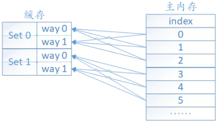

2 组 2 路关联缓存

-   缓存分成两组，每组包含两个缓存行（Cache line），也称为两路（2 ways）。
-   主存中的每个数据块只能位于两个 Set 中的某一个，但可以在指定 Set 中的任意一个缓存行中。
-   AMD Athlon 的 L1 cache 所采用的就是类似这种 2 路组相联的映射方式。

**_伪共享问题_**

-   假设多核 CPU 在多线程情况下，x 和 y 两个共享变量在同一个缓存行（Cache line）中，核 a 修改变量 x，会导致核 b，核 c 中的 x 和 y 变量同时失效。
-   核 a 上运行的线程，仅仅只是修改了变量 x，却导致同一个缓存行中的所有变量都无效，需要重新刷缓存（并不一定代表每次都要从内存中重新载入，也有可能是从其他缓存中导入数据，具体的实现要看各个芯片厂商的实现）。
-   假设此时在核 b 上运行的线程，正好也修改变量 y，那么就会出现相互竞争，相互失效的情况，这就是 **伪共享**。

_伪共享的传统解决方案_

```java
public final class Test implements Runnable {

    private final static int num = 4;

    private final static long arrayValue = 500L * 1000L * 1000L;

    private final int arrayIndex;

    private static VolatileLong[] longs = new VolatileLong[num];

    static {
        for (int i = 0; i < longs.length; i++) {
            longs[i] = new VolatileLong();
        }
    }

    public Test(int arrayIndex) {
        this.arrayIndex = arrayIndex;
    }

    public static void main(String[] arg) throws InterruptedException {
        final long start = System.nanoTime();
        runTest();
        System.out.println("duration = " + (System.nanoTime() - start));
    }

    private static void runTest() throws InterruptedException {
        Thread[] threads = new Thread[num];

        for (int i = 0; i < threads.length; i++) {
            threads[i] = new Thread(new Test(i));
        }

        for (Thread t : threads) {
            t.start();
        }

        for (Thread t : threads) {
            t.join();
        }

    }

    @Override
    public void run() {
        long i = arrayValue;
        while (0 != --i) {
            longs[arrayIndex].value = i;
        }
    }

    public final static class VolatileLong {
        public volatile long value = 0L;
        public long p1, p2, p3, p4, p5, p6;
    }
}

```

-   执行结果。

```undefined
16526073665
```

-   如果注释掉 VolatileLong 中不使用的 6 个 long 变量。

```java
public final static class VolatileLong {
        public volatile long value = 0L;
        // public long p1, p2, p3, p4, p5, p6;
}
```

-   执行结果

```undefined
31183015124
```

-   两个程序逻辑完全一致，只是注释了几个没有使用到的变量，导致性能相差很大。
-   一条缓存行有 **64** 字节, 而 Java 程序的对象头固定占 **8** 字节（**32** 位系统）或 **12** 字节（64 位系统默认开启压缩），不开压缩为 **16** 字节。
-   为对象 VolatileLong 增加 6 个无用的长整型，**6 × 8 = 48** 字节。
-   让不同的 VolatileLong 对象处于不同的缓存行，这样就可以避免伪共享。
-   这种办法叫做补齐（**Padding**）。

_Java 8 中的解决方案_

-   Java 8 中已经提供了官方的解决方案。
    -   新增了一个注解 **@sun.misc.Contended**。
    -   加上这个注解的类会自动补齐缓存行，需要注意的是此注解默认是无效的，需要在 JVM 启动时设置 **-XX:-RestrictContended** 才会生效。

```java
@sun.misc.Contended
public final static class VolatileLong {
        public volatile long value = 0L;
        // public long p1, p2, p3, p4, p5, p6;
}
```