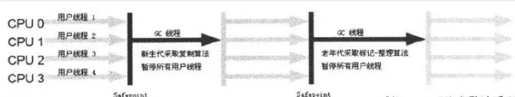

说到垃圾回收（Garbage Collection，GC），很多人就会自然而然地把它和Java联系起来。在Java中，程序员不需要去关心内存动态分配和垃圾回收的问题，这一切都交给了JVM来处理。顾名思义，垃圾回收就是释放垃圾占用的空间，那么在Java中，什么样的对象会被认定为“垃圾”？那么当一些对象被确定为垃圾之后，采用什么样的策略来进行回收（释放空间）？在目前的商业虚拟机中，有哪些典型的垃圾收集器？下面我们就来逐一探讨这些问题。

## 一.如何确定某个对象是“垃圾”？

先了解一个最基本的问题：如果确定某个对象是“垃圾”？既然垃圾收集器的任务是回收垃圾对象所占的空间供新的对象使用，那么垃圾收集器如何确定某个对象是“垃圾”？—即通过什么方法判断一个对象可以被回收了。

**引用计数算法：**

在java中是通过引用来和对象进行关联的，也就是说如果要操作对象，必须通过引用来进行。那么很显然一个简单的办法就是通过引用计数来判断一个对象是否可以被回收。不失一般性，如果一个对象没有任何引用与之关联，则说明该对象基本不太可能在其他地方被使用到，那么这个对象就成为可被回收的对象了。这种方式成为引用计数法。

　　这种方式的特点是实现简单，而且效率较高，但是它无法解决循环引用的问题，因此在Java中并没有采用这种方式（Python采用的是引用计数法）。看下面这段代码：

```java
public class Main {

    public static void main(String[] args) {
        MyObject object1 = new MyObject();
        MyObject object2 = new MyObject();

        object1.object = object2;
        object2.object = object1;
        object1 = null;
        object2 = null;
    }
}

class MyObject{
    public Object object = null;
}
```

**可达性分析算法:**

为了解决这个问题，在Java中采取了 可达性分析法。该方法的基本思想是通过一系列的“GC Roots”对象作为起点进行搜索，如果在“GC Roots”和一个对象之间没有可达路径，则称该对象是不可达的，不过要注意的是被判定为不可达的对象不一定就会成为可回收对象。被判定为不可达的对象要成为可回收对象：必须至少经历两次标记过程，如果在这两次标记过程中仍然没有逃脱成为可回收对象的可能性，则基本上就真的成为可回收对象了。


最后面两句将object1和object2赋值为null，也就是说object1和object2指向的对象已经不可能再被访问，但是由于它们互相引用对方，导致它们的引用计数都不为0，那么垃圾收集器就永远不会回收它们。

下面来看个例子：

```java
Object aobj = new Object ( ) ;
Object bobj = new Object ( ) ;
Object cobj = new Object ( ) ;
aobj = bobj;
aobj = cobj;
cobj = null;
aobj = null;
```

    总结一下平常遇到的比较常见的将对象判定为可回收对象的情况：

　　1）显示地将某个引用赋值为null或者将已经指向某个对象的引用指向新的对象，比如下面的代码：

```java
Object obj = new Object();
obj = null;
Object obj1 = new Object();
Object obj2 = new Object();
obj1 = obj2;
```

2）局部引用所指向的对象，比如下面这段代码：

```java
void fun() {
    for(int i=0;i<10;i++) {
        Object obj = new Object();
        System.out.println(obj.getClass());
    }   
}
```

循环每执行完一次，生成的Object对象都会成为可回收的对象。

3）只有弱引用与其关联的对象，比如：

```java
WeakReference<String> wr = new WeakReference<String>(new String("world"));
```

引用分为：**强引用、软引用、弱引用、虚引用**

强引用：只有强引用存在，垃圾收集器就永远不会回收掉被引用的对象。

软引用：对于软引用关联的对象，在系统将要发生内存溢出之前，将会把这些对象列入回收范围之中进行第二次回收。若第二次回收还是没有足够的内存，才会抛出内存溢出异常。

弱引用：被弱引用关联的对象只能生存到下一次垃圾回收发生之前。垃圾回收器工作时，无论当前内存是否足够，都会回收掉被弱引用关联的对象。

虚引用：为一个对象设置虚引用关联的唯一目的是 这个对象被垃圾回收器回收时，会收到一个系统通知。

### 回收方法区

方法区（或Hotspot虚拟中的永久代）的垃圾收集主要回收两部分内容：**废弃常量和无用的类。**

判定一个常量是否是“废弃常量”比较简单，而要判定一个类是否是“无用的类”的条件则相对苛刻许多。类需要同时满足下面3个条件才能算是 **“无用的类”** ：

-   该类所有的实例都已经被回收，也就是Java堆中不存在该类的任何实例。
    
-   加载该类的ClassLoader已经被回收。
    
-   该类对应的java.lang.Class对象没有在任何地方被引用，无法在任何地方通过反射访问该类的方法。
    

    在确定了哪些垃圾可以被回收后，垃圾收集器要做的事情就是开始进行垃圾回收，但是这里面涉及到一个问题是：如何高效地进行垃圾回收。由于Java虚拟机规范并没有对如何实现垃圾收集器做出明确的规定，因此各个厂商的虚拟机可以采用不同的方式来实现垃圾收集器，所以在此只讨论几种常见的垃圾收集算法的核心思想。

## 二.典型的垃圾收集算法

1.**Mark-Sweep（标记-清除）算法**

这是最基础的垃圾回收算法，之所以说它是最基础的是因为它最容易实现，思想也是最简单的。标记-清除算法分为两个阶段：标记阶段和清除阶段。标记阶段的任务是标记出所有需要被回收的对象，清除阶段就是回收被标记的对象所占用的空间。具体过程如下图所示：


从图中可以很容易看出标记-清除算法实现起来比较容易，但是有一个比较严重的问题就是容易产生内存碎片，碎片太多可能会导致后续过程中需要为大对象分配空间时无法找到足够的空间而提前触发新的一次垃圾收集动作。

2.**Copying（复制）算法（新生代）**

为了解决Mark-Sweep算法的缺陷，Copying算法就被提了出来。它将可用内存按容量划分为大小相等的两块，每次只使用其中的一块。当这一块的内存用完了，就将还存活着的对象复制到另外一块上面，然后再把已使用的内存空间一次清理掉，这样一来就不容易出现内存碎片的问题。具体过程如下图所示：


这种算法虽然实现简单，运行高效且不容易产生内存碎片，但是却对内存空间的使用做出了高昂的代价，因为能够使用的内存缩减到原来的一半。很显然，Copying算法的效率跟存活对象的数目多少有很大的关系，如果存活对象很多，那么Copying算法的效率将会大大降低。

3.**Mark-Compact（标记-整理）算法（老年代）**

为了解决Copying算法的缺陷，充分利用内存空间，提出了Mark-Compact算法。该算法标记阶段和Mark-Sweep一样，但是在完成标记之后，它不是直接清理可回收对象，而是将存活对象都向一端移动，然后清理掉端边界以外的内存。具体过程如下图所示：


4.**Generational Collection（分代收集）算法**

分代收集算法是目前大部分JVM的垃圾收集器采用的算法。它的核心思想是根据对象存活的生命周期将内存划分为若干个不同的区域。一般情况下将堆区划分为老年代（Tenured Generation）和新生代（Young Generation），老年代的特点是每次垃圾收集时只有少量对象需要被回收，而新生代的特点是每次垃圾回收时都有大量的对象需要被回收，那么就可以根据不同代的特点采取最适合的收集算法。

目前大部分垃圾收集器对于新生代都采取Copying算法，因为新生代中每次垃圾回收都要回收大部分对象，也就是说需要复制的操作次数较少，但是实际中并不是按照1：1的比例来划分新生代的空间的，一般来说是将新生代划分为一块较大的Eden空间和两块较小的Survivor空间，每次使用Eden空间和其中的一块Survivor空间，当进行回收时，将Eden和Survivor中还存活的对象复制到另一块Survivor空间中，然后清理掉Eden和刚才使用过的Survivor空间。

而由于老年代的特点是每次回收都只回收少量对象，一般使用的是Mark-Compact算法。

注意，在堆区之外还有一个代就是永久代（Permanet Generation），它用来存储class类、常量、方法描述等。Java虚拟机规范中，不要求虚拟机在方法区中实现垃圾收集。对永久代的回收主要回收两部分内容：废弃常量和无用的类。

判定一个类是否时一个无用的类：

1）该类所有的实例都已经被回收，也就是Java堆中不存在该类的任何实例。

2）加载该类的classLoader已经被回收。

3）该类的java.lang.class对象没有在任何地方被引用，无法在任何地方通过反射访问该类的方法。

## 三.典型的垃圾收集器

　　垃圾收集算法是 内存回收的理论基础，而垃圾收集器就是内存回收的具体实现。下面介绍一下HotSpot（JDK 7)虚拟机提供的几种垃圾收集器，用户可以根据自己的需求组合出各个年代使用的收集器。

#### 　　1.Serial/Serial Old

　　Serial/Serial Old收集器是最基本最古老的收集器，它是一个单线程收集器，并且在它进行垃圾收集时，必须暂停所有用户线程。Serial收集器是针对新生代的收集器，采用的是Copying算法，Serial Old收集器是针对老年代的收集器，采用的是Mark-Compact算法。它的优点是实现简单高效，但是缺点是会给用户带来停顿。



#### 　　2.ParNew

　　ParNew收集器是Serial收集器的多线程版本，使用多个线程进行垃圾收集。


**并行和并发：**

-   **并行（Parallel）** ：指多条垃圾收集线程并行工作，但此时用户线程仍然处于等待状态。
    
-   **并发（Concurrent）**：指用户线程与垃圾收集线程同时执行（但不一定是并行，可能会交替执行），用户程序在继续运行，而垃圾收集器运行在另一个CPU上。  
    
    

#### 　　3.Parallel Scavenge

　　Parallel Scavenge收集器是一个新生代的多线程收集器（并行收集器），它在回收期间不需要暂停其他用户线程，其采用的是Copying算法，该收集器与前两个收集器有所不同，它主要是为了达到一个可控的吞吐量。

#### 　　4.Parallel Old

　　Parallel Old是Parallel Scavenge收集器的老年代版本（并行收集器），使用多线程和Mark-Compact算法。

#### 　　5.CMS

　　CMS（Current Mark Sweep）收集器是一种以获取最短回收停顿时间为目标的收集器，它是一种并发收集器，采用的是Mark-Sweep算法。

​    它的运作过程相比于前面几种垃圾收集器来说更加复杂一些。整个过程分为四个步骤：

> -   **初始标记：** 暂停所有的其他线程，并记录下直接与root相连的对象，速度很快 ；
>     
> -   **并发标记：** 同时开启GC和用户线程，用一个闭包结构去记录可达对象。但在这个阶段结束，这个闭包结构并不能保证包含当前所有的可达对象。因为用户线程可能会不断的更新引用域，所以GC线程无法保证可达性分析的实时性。所以这个算法里会跟踪记录这些发生引用更新的地方。
>     
> -   **重新标记：** 重新标记阶段就是为了修正并发标记期间因为用户程序继续运行而导致标记产生变动的那一部分对象的标记记录，这个阶段的停顿时间一般会比初始标记阶段的时间稍长，远远比并发标记阶段时间短
>     
> -   **并发清除：** 开启用户线程，同时GC线程开始对为标记的区域做清扫
>     

主要优点：**并发收集、低停顿**。

但是它有下面三个明显的缺点：

> -   **对CPU资源敏感；**
>     
> -   **无法处理浮动垃圾；**
>     
> -   **它使用的回收算法-“标记-清除”算法会导致收集结束时会有大量空间碎片产生。**
>     

#### 　　6.G1

**G1 (Garbage-First)是一款面向服务器的垃圾收集器,主要针对配备多颗处理器及大容量内存的机器. 以极高概率满足GC停顿时间要求的同时,还具备高吞吐量性能特征.**

        被视为JDK1.7中HotSpot虚拟机的一个重要进化特征。它具备一下特点：

> -   **并行与并发**：G1能充分利用CPU、多核环境下的硬件优势，使用多个CPU（CPU或者CPU核心）来缩短stop-The-World停顿时间。部分其他收集器原本需要停顿Java线程执行的GC动作，G1收集器仍然可以通过并发的方式让java程序继续执行。
>     
> -   **分代收集**：虽然G1可以不需要其他收集器配合就能独立管理整个GC堆，但是还是保留了分代的概念。
>     
> -   **空间整合**：与CMS的“标记--清理”算法不同，G1从整体来看是基于“标记整理”算法实现的收集器；从局部上来看是基于“复制”算法实现的。
>     
> -   **可预测的停顿**：这是G1相对于CMS的另一个大优势，降低停顿时间是G1和ＣＭＳ共同的关注点，但Ｇ１除了追求低停顿外，还能建立可预测的停顿时间模型，能让使用者明确指定在一个长度为M毫秒的时间片段内。
>     

**G1收集器在后台维护了一个优先列表，每次根据允许的收集时间，优先选择回收价值最大的Region(这也就是它的名字Garbage-First的由来)**。这种使用Region划分内存空间以及有优先级的区域回收方式，保证了GF收集器在有限时间内可以尽可能高的收集效率（把内存化整为零）。

        G1收集器的运作大致分为以下几个步骤：

> -   初始标记
>     
> -   并发标记
>     
> -   最终标记
>     
> -   筛选回收
>     

上面几个步骤的运作过程和CMS有很多相似之处。

初始标记阶段仅仅只是标记一下GC Roots能直接关联到的对象，并且修改TAMS的值，让下一个阶段用户程序并发运行时，能在正确可用的Region中创建新对象，这一阶段需要停顿线程，但是耗时很短。

并发标记阶段是从GC Root开始对堆中对象进行可达性分析，找出存活的对象，这阶段时耗时较长，但可与用户程序并发执行。

而最终标记阶段则是为了修正在并发标记期间因用户程序继续运作而导致标记产生变动的那一部分标记记录，虚拟机将这段时间对象变化记录在线程Remenbered Set Logs里面，最终标记阶段需要把Remembered Set Logs的数据合并到Remembered Set Logs里面，最终标记阶段需要把Remembered Set Logs的数据合并到Remembered Set中，这一阶段需要停顿线程，但是可并行执行。

最后在筛选回收阶段首先对各个Region的回收价值和成本进行排序，根据用户所期望的GC停顿时间来制定回收计划。

## **内存分配**：

　　

　　对象的内存分配，往大方向上讲就是在堆上分配，对象主要分配在新生代的Eden Space和From Space，少数情况下会直接分配在老年代。如果新生代的Eden Space和From Space的空间不足，则会发起一次GC，如果进行了GC之后，Eden Space和From Space能够容纳该对象就放在Eden Space和From Space。在GC的过程中，会将Eden Space和From Space中的存活对象移动到To Space，然后将Eden Space和From Space进行清理。如果在清理的过程中，To Space无法足够来存储某个对象，就会将该对象移动到老年代中。在进行了GC之后，使用的便是Eden space和To Space了，下次GC时会将存活对象复制到From Space，如此反复循环。当对象在Survivor区躲过一次GC的话，其对象年龄便会加1，默认情况下，如果对象年龄达到15岁，就会移动到老年代中。

　　一般来说，大对象会被直接分配到老年代，所谓的大对象是指需要大量连续存储空间的对象，最常见的一种大对象就是大数组，比如：

　　byte\[\] data = new byte\[4\*1024\*1024\]

　　这种一般会直接在老年代分配存储空间。

　　当然分配的规则并不是百分之百固定的，这要取决于当前使用的是哪种垃圾收集器组合和JVM的相关参数。

    总结，内存分配的规则，有以下5点：

**1.对象优先在eden分配；** 大多数情况下，对象在新生代中Eden区分配。当Eden区没有足够空间进行分配时，虚拟机将发起一次Minor GC.

**2.大对象直接进入老年代；** 大对象就是需要大量连续内存空间的对象（比如：字符串、数组）

**3.长期存活的对象进入老年代；** 内存回收时需要识别那些对象应放在新生代，那些对象应放在老年代中。为了做到这一点，虚拟机给每个对象一个对象年龄（Age）计数器。

**4.动态对象年龄判定；** 为了更好的适应不同程序的内存情况，虚拟机不是永远要求对象年龄必须达到了某个值才能进入老年代，如果Survivor 空间中相同年龄所有对象大小的总和大于Survivor空间的一半，年龄大于或等于该年龄的对象就可以直接进入老年代，无需达到要求的年龄。

**5.空间分配担保。**