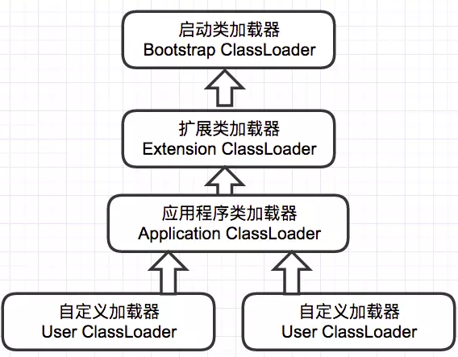
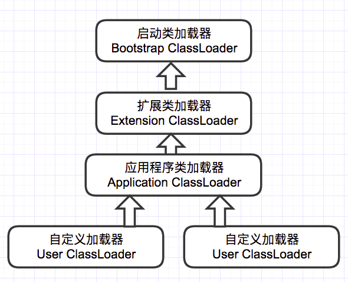
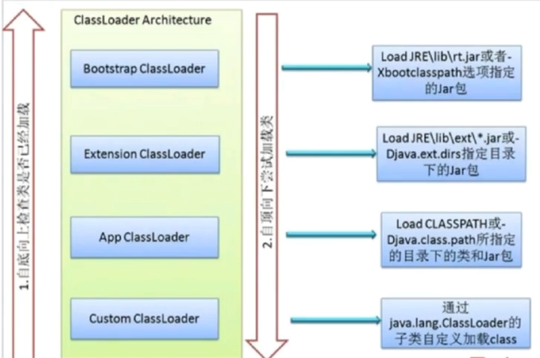
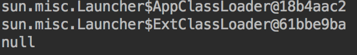
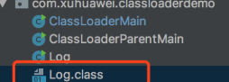
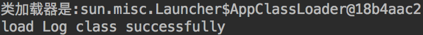

## 类加载器

类加载器是 Java 运行时环境（Java Runtime Environment）的一部分，负责动态加载 Java 类到 Java 虚拟机的内存空间中。**类通常是按需加载，即第一次使用该类时才加载。** 由于有了类加载器，Java 运行时系统不需要知道文件与文件系统。每个 Java 类必须由某个类加载器装入到内存。


类装载器除了要定位和导入二进制 class 文件外，还必须负责验证被导入类的正确性，为变量分配初始化内存，以及帮助解析符号引用。这些动作必须严格按一下顺序完成：

1. **装载**：查找并装载类型的二进制数据。
2. **链接**：执行验证、准备以及解析(可选) - **验证**：确保被导入类型的正确性 - **准备**：为类变量分配内存，并将其初始化为默认值。 - **解析**：把类型中的符号引用转换为直接引用。
3. **初始化**：把类变量初始化为正确的初始值。

## 装载

### 类加载器分类

在Java虚拟机中存在多个类装载器，Java应用程序可以使用两种类装载器：

- **Bootstrap ClassLoader**：此装载器是 Java 虚拟机实现的一部分。由原生代码（如C语言）编写，不继承自 `java.lang.ClassLoader` 。负责加载核心 Java 库，启动类装载器通常使用某种默认的方式从本地磁盘中加载类，包括 Java API。
- **Extention Classloader**：用来在`/jre/lib/ext` ,或 `java.ext.dirs` 中指明的目录中加载 Java 的扩展库。 Java 虚拟机的实现会提供一个扩展库目录。
- **Application Classloader**：根据 Java应用程序的类路径（ `java.class.path` 或 `CLASSPATH` 环境变量）来加载 Java 类。一般来说，Java 应用的类都是由它来完成加载的。可以通过 `ClassLoader.getSystemClassLoader()` 来获取它。
- **自定义类加载器**：可以通过继承 `java.lang.ClassLoader` 类的方式实现自己的类加载器，以满足一些特殊的需求而不需要完全了解 Java 虚拟机的类加载的细节。

### 全盘负责双亲委托机制

在一个 JVM 系统中，至少有 3 种类加载器，那么这些类加载器如何配合工作？在 JVM 种类加载器通过 **全盘负责双亲委托机制** 来协调类加载器。

- **全盘负责**：指当一个 `ClassLoader` 装载一个类的时，除非显式地使用另一个 `ClassLoader` ，该类所依赖及引用的类也由这个 `ClassLoader` 载入。
- **双亲委托机制**：指先委托父装载器寻找目标类，只有在找不到的情况下才从自己的类路径中查找并装载目标类。

全盘负责双亲委托机制只是 Java 推荐的机制，并不是强制的机制。实现自己的类加载器时，如果想保持双亲委派模型，就应该重写 `findClass(name)` 方法；如果想破坏双亲委派模型，可以重写 `loadClass(name)` 方法。

### 装载入口

所有Java虚拟机实现必须在每个类或接口首次主动使用时初始化。以下六种情况符合主动使用的要求：

- 当创建某个类的新实例时(new、反射、克隆、序列化)
- 调用某个类的静态方法
- 使用某个类或接口的静态字段，或对该字段赋值(用final修饰的静态字段除外，它被初始化为一个编译时常量表达式)
- 当调用Java API的某些反射方法时。
- 初始化某个类的子类时。
- 当虚拟机启动时被标明为启动类的类。

除以上六种情况，所有其他使用Java类型的方式都是被动的，它们不会导致Java类型的初始化。

对于接口来说，只有在某个接口声明的非常量字段被使用时，该接口才会初始化，而不会因为事先这个接口的子接口或类要初始化而被初始化。

**父类需要在子类初始化之前被初始化**。当实现了接口的类被初始化的时候，不需要初始化父接口。然而，当实现了父接口的子类(或者是扩展了父接口的子接口)被装载时，父接口也要被装载。(只是被装载，没有初始化)

## 验证

确认装载后的类型符合Java语言的语义，并且不会危及虚拟机的完整性。

- **装载时验证**：检查二进制数据以确保数据全部是预期格式、确保除 Object 之外的每个类都有父类、确保该类的所有父类都已经被装载。
- **正式验证阶段**：检查 final 类不能有子类、确保 final 方法不被覆盖、确保在类型和超类型之间没有不兼容的方法声明(比如拥有两个名字相同的方法，参数在数量、顺序、类型上都相同，但返回类型不同)。
- **符号引用的验证**：当虚拟机搜寻一个被符号引用的元素(类型、字段或方法)时，必须首先确认该元素存在。如果虚拟机发现元素存在，则必须进一步检查引用类型有访问该元素的权限。

## 准备

在准备阶段，Java虚拟机为类变量分配内存，**设置默认初始值**。但在到到初始化阶段之前，类变量都没有被初始化为真正的初始值。

| 类型      | 默认值   |
| --------- | -------- |
| int       | 0        |
| long      | 0L       |
| short     | (short)0 |
| char      | ’\u0000’ |
| byte      | (byte)0  |
| blooean   | false    |
| float     | 0.0f     |
| double    | 0.0d     |
| reference | null     |

## 解析

解析的过程就是在类型的常量池总寻找类、接口、字段和方法的符号引用，**把这些符号引用替换为直接引用的过程**。

- `类或接口的解析`：判断所要转化成的直接引用是数组类型，还是普通的对象类型的引用，从而进行不同的解析。
- `字段解析`：对字段进行解析时，会先在本类中查找是否包含有简单名称和字段描述符都与目标相匹配的字段，如果有，则查找结束；如果没有，则会按照继承关系从上往下递归搜索该类所实现的各个接口和它们的父接口，还没有，则按照继承关系从上往下递归搜索其父类，直至查找结束，

## 初始化

**所有的类变量(即静态量)初始化语句和类型的静态初始化器都被Java编译器收集在一起，放到一个特殊的方法中。** 对于类来说，这个方法被称作类初始化方法；对于接口来说，它被称为接口初始化方法。在类和接口的 class 文件中，这个方法被称为``。

1. 如果存在直接父类，且直接父类没有被初始化，先初始化直接父类。
2. 如果类存在一个类初始化方法，执行此方法。

这个步骤是递归执行的，即第一个初始化的类一定是`Object`。

**Java虚拟机必须确保初始化过程被正确地同步。** 如果多个线程需要初始化一个类，仅仅允许一个线程来进行初始化，其他线程需等待。

> 这个特性可以用来写单例模式。

### Clinit 方法

- 对于静态变量和静态初始化语句来说：执行的顺序和它们在类或接口中出现的顺序有关。
- **并非所有的类都需要在它们的`class`文件中拥有`()`方法，** 如果类没有声明任何类变量，也没有静态初始化语句，那么它就不会有`()`方法。如果类声明了类变量，但没有明确的使用类变量初始化语句或者静态代码块来初始化它们，也不会有`()`方法。如果类仅包含静态`final`常量的类变量初始化语句，而且这些类变量初始化语句采用编译时常量表达式，类也不会有`()`方法。**只有那些需要执行Java代码来赋值的类才会有`()`**
- `final`常量：Java虚拟机在使用它们的任何类的常量池或字节码中直接存放的是它们表示的常量值。


# 对象的生命周期

一旦一个类被装载、连接和初始化，它就随时可以被使用。程序可以访问它的静态字段，调用它的静态方法，或者创建它的实例。作为Java程序员有必要了解Java对象的生命周期。

## 类实例化

在Java程序中，类可以被明确或隐含地实例化。明确的实例化类有四种途径：

- 明确调用`new`。
- 调用`Class`或者`java.lang.reflect.Constructor`对象的`newInstance`方法。
- 调用任何现有对象的`clone`。
- 通过`java.io.ObjectInputStream.getObject()`反序列化。

隐含的实例化：

- 可能是保存命令行参数的`String`对象。
- 对于Java虚拟机装载的每个类，都会暗中实例化一个Class对象来代表这个类型
- 当Java虚拟机装载了在常量池中包含`CONSTANT_String_info`入口的类的时候，它会创建新的`String`对象来表示这些常量字符串。
- 执行包含字符串连接操作符的表达式会产生新的对象。

Java编译器为它编译的每个类至少生成一个实例初始化方法。在Java class文件中，这个方法被称为``。针对源代码中每个类的构造方法，Java编译器都会产生一个`()`方法。如果类没有明确的声明任何构造方法，编译器会默认产生一个无参数的构造方法，它仅仅调用父类的无参构造方法。

一个`()`中可能包含三种代码：调用另一个`()`、实现对任何实例变量的初始化、构造方法体的代码。

如果构造方法明确的调用了同一个类中的另一个构造方法(`this()`)，那么它对应的`()`由两部分组成：

- 一个同类的`()`的调用。
- 实现了对应构造方法的方法体的字节码。

> 在它对应的`()`方法中不会有父类的`()`，但不代表不会调用父类的`()`，因为`this()`中也会调用父类`()`

如果构造方法不是通过一个`this()`调用开始的，而且这个对象不是`Object`，`()`则有三部分组成：

- 一个父类的`()`调用。*如果这个类是`Object`,则没有这个部分*
- 任意实例变量初始化方法的字节码。
- 实现了对应构造方法的方法体的字节码。

如果构造方法明确的调用父类的构造方法`super()`开始，它的`()`会调用对应父类的`()`。比如，如果一个构造方法明确的调用`super(int,String)`开始，对应的`()`会从调用父类的`(int,String)`方法开始。**如果构造方法没有明确地从`this()`或`super()`开始，对应的`()`默认会调用父类的无参`()`。**

## 垃圾收集和对象的终结

程序可以明确或隐含的为对象分配内存，但不能明确的释放内存。一个对象不再为程序引用，虚拟机必须回收那部分内存。

## 卸载类

在很多方面，Java虚拟机中类的生命周期和对象的生命周期很相似。当程序不再使用某个类的时候，可以选择卸载它们。

> 类的垃圾收集和卸载值所以在Java虚拟机中很重要，是因为Java程序可以在运行时通过用户自定义的类装载器装载类型来动态的扩展程序。所有被装载的类型都在方法区占据内存空间。

Java虚拟机通过判断类是否在被引用来进行垃圾收集。判断动态装载的类的`Class`实例在正常的垃圾收集过程中是否可触及有两种方式：

- 如果程序保持非`Class`实例的明确引用。
- 如果在堆中还存在一个可触及的对象，在方法区中它的类型数据指向一个`Class`实例。


### 说一说你对环境变量classpath的理解？如果一个类不在classpath下，为什么会抛出ClassNotFoundException异常，如果在不改变这个类路径的前提下，怎样才能正确加载这个类？

> classpath是javac编译器的一个环境变量。它的作用与import、package关键字有关。
>
> package的所在位置，就是设置的CLASSPATH。
>
> 当编译器面对 import package 这个语句时，它先会查找CLASSPATH所指定的目录，并检视子目录java/util是否存在，然后找出名称吻合的已编译文件（.class文件）。如果没有找到就会报错。
>
> 在不改变这个类路径的前提下，怎样才能正确加载这个类：动态加载包 


### 深入分析Classloader，双亲委派机制

> ClassLoader：类加载器（class loader）用来加载 Java 类到 Java 虚拟机中。Java 源程序（.java 文件）在经过 Java 编译器编译之后就被转换成 Java 字节代码（.class 文件）。类加载器负责读取 Java 字节代码，并转换成 java.lang.Class 类的一个实例。 
> 双亲委派机制：某个特定的类加载器在接到加载类的请求时，首先将加载任务委托给父类加载器，依次递归，如果父类加载器可以完成类加载任务，就成功返回；只有父类加载器无法完成此加载任务时，才自己去加载。
>
> - ​	虚拟机设计团队把加载阶段中 "通过一个类的全限定名来获取定义此类的二进制字节流" 放到JVM外部实现，以便让应用程序决定如何获取所需的类。实现这个动作的代码模块被称为：类加载器。 
> - ​	类加载器虽然只用于实现类的加载动作，但对于一个类，需要由它的加载器和这个类本身 一起确立其在JVM的唯一性。每一个类加载器，都有一个独立的类名称空间。
> - ​	判断两个类的实例是否相等，只有两个类是在同一个类加载器加载的前提才有意义，否则，即使这两个类实例来源于同一个class文件，被同一个虚拟机加载，但是加载它们的类加载器不同，那么这两个就必定不相等。
>
> JVM提供了3种类加载器：
>
> - 启动类加载器(Bootstrap ClassLoader)：负责加载 JAVA_HOME\lib 目录中的，或通过-Xbootclasspath参数指定路径中的，且被虚拟机认可（按文件名识别，如rt.jar）的类。无法直接被java应用程序直接使用，用户在编写自定义类加载器，如果需要将加载请求委托给引导类加载器，那么直接使用null代替。
> - 扩展类加载器(Extension ClassLoader)：负责加载 JAVA_HOME\lib\ext 目录中的，或通过java.ext.dirs系统变量指定路径中的类库。开发者可以直接使用扩展类加载器。
> - 应用程序类加载器(Application ClassLoader)：负责加载用户路径（classpath）上的类库。开发者可以直接使用这个类加载器，如果程序没有定义自定义加载器，那么应用程序类加载器 就是默认的类加载器。
>
> 
>
> 	要求除了顶层的启动类加载器，其余的类加载器都要有自己的父类加载器。当一个类加载器收到类加载任务，会先交给其父类加载器去完成，因此最终加载任务都会传递到顶层的启动类加载器，只有当父类加载器无法完成加载任务时，才会交由当前类加载器尝试执行加载任务。 
>
> ​	采用双亲委派的好处：加载位于rt.jar包中的类java.lang.Object，不管是哪个加载器加载这个类，最终都是委托给顶层的启动类加载器进行加载，这样就保证了使用不同的类加载器最终得到的都是同样一个Object对象。
>
> ​	双亲委派模型不是一个强制性的约束模型，而是Java设计者推荐给开发者的类加载实现方式。 


如下图所示，JVM类加载机制分为五个部分：加载，验证，准备，解析，初始化，下面我们就分别来看一下这五个过程。


## **加载**

加载是类加载过程中的一个阶段，这个阶段会在内存中生成一个代表这个类的java.lang.Class对象，作为方法区这个类的各种数据的入口。注意这里不一定非得要从一个Class文件获取，这里既可以从ZIP包中读取（比如从jar包和war包中读取），也可以在运行时计算生成（动态代理），也可以由其它文件生成（比如将JSP文件转换成对应的Class类）。

完成3件事情：

1) 通过一个类的全限定名来获取定义此类的二进制字节流；

2)将这个字节流所代表的静态存储结构转化为方法区的运行时数据结构；

3)在内存中生成一个代表这个类的java.lang.Class 对象，作为方法区这个类的各种数据的访问入口。

## **验证**

这一阶段的主要目的是为了确保Class文件的字节流中包含的信息是否符合当前虚拟机的要求，并且不会危害虚拟机自身的安全。

1.文件格式验证

​    1)是否以魔数 0xCAFEBABE 开头

​    2)主、次版本是否在当前虚拟机处理范围之内

​    3)常量池的常量是否有不被支持的常量类型

​    ...

2.元数据验证

​    1）该类是否有父类(除了java.lang.Object之外，所有的类都应当有父类)

​    2）该类是否继承了不允许继承的类(被final修饰的类)

​    3）如果这个类不是抽象类，是否实现了其父类或接口中要求实现的所有方法。

​    4）类中的字段、方法是否和父类存在矛盾(如 覆盖了父类的final字段、出现了不符合规则的重载)

​    ...

3.字节码验证

4.符号引用验证

## **准备**

    准备阶段是正式为类变量分配内存并设置类变量的初始值阶段，即在方法区中分配这些变量所使用的内存空间。注意这里所说的初始值概念，比如一个类变量定义为：

`    public` `static` `int` `v =` `8080``;`

    实际上变量v在准备阶段过后的初始值为0而不是8080，将v赋值为8080的putstatic指令是程序被编译后，存放于类构造器<client>方法之中，这里我们后面会解释。  
但是注意如果声明为：

`    public` `static` `final` `int` `v =` `8080``;`

    在编译阶段会为v生成ConstantValue属性，在准备阶段虚拟机会根据ConstantValue属性将v赋值为8080。

## **解析**

解析阶段是指虚拟机将常量池中的符号引用替换为直接引用的过程。符号引用就是class文件中的：

-   CONSTANT\_Class\_info
-   CONSTANT\_Field\_info
-   CONSTANT\_Method\_info

等类型的常量。

下面我们解释一下符号引用和直接引用的概念：

-   符号引用与虚拟机实现的布局无关，引用的目标并不一定要已经加载到内存中。各种虚拟机实现的内存布局可以各不相同，但是它们能接受的符号引用必须是一致的，因为符号引用的字面量形式明确定义在Java虚拟机规范的Class文件格式中。
-   直接引用可以是指向目标的指针，相对偏移量或是一个能间接定位到目标的句柄。如果有了直接引用，那引用的目标必定已经在内存中存在。

## **初始化**

初始化阶段是类加载最后一个阶段，前面的类加载阶段之后，除了在加载阶段可以自定义类加载器以外，其它操作都由JVM主导。到了初始阶段，才开始真正执行类中定义的Java程序代码。

在准备阶段，变量已经赋过一个系统要求的初始值，在初始化阶段，将根据程序员设定的计划去初始化变量和其他资源。

初始化阶段就是执行类构造器<client>方法的过程。

1.<client>方法是由编译器自动收集类中所有的类变量(static 变量)的赋值操作和静态语句块中的语句(static{}块)合并而成的。收集的顺序是由语句在源文件中出现的顺序决定的。

​    静态语句块只能访问到定义在其之前的变量，对于定义在静态语句块之后的变量，静态代码块只能赋值，不能访问(得到该变量的值)。

2.虚拟机会保证<client>方法执行之前，父类的<client>方法已经执行完毕。p.s: 如果一个类中没有对静态变量赋值也没有静态语句块，那么编译器可以不为这个类生成<client>()方法。

3.由于父类的<client>方法 先执行，所以父类中定义的静态变量赋值/静态语句块会优先于子类的静态变量赋值/静态语句块的执行。

4.虚拟机会保证一个类的<client>方法 在多线程环境下被正确的加锁、同步，如果多个线程同时去初始化一个类，只会有一个线程去执行这个类的<client>方法，其余线程将阻塞等待，直到该活动线程执行<client>方法完毕。

以下5种情况会立即对类进行初始化：

1.遇到new、getstatic、putstatic 或 invokestatic 这4个字节码指令，如果该类没有进行初始化，则需要先触发初始化。

​    对应的场景为：

-   使用new关键字进行实例化对象
-   读取或设置一个类的静态字段(被final 修饰、已在编译期将结果放入常量池的静态字段 除外)
-   调用一个类的静态方法时

    2.使用java.lang.reflect包的方法对类进行反射调用时，如果该类没有进行初始化，则需要先触发初始化。

    3.当初始化一个类时，发现该父类未进行初始化，则需要先触发其父类的初始化。

    4.当虚拟机启动时，指定执行的主类(包含main的类)，虚拟机会优先初始化这个类。

    5.第5个可不记住....

    以下几种情况不会执行类初始化：

-   通过子类引用父类的静态字段，只会触发父类的初始化，而不会触发子类的初始化。
-   定义对象数组，不会触发该类的初始化。
-   常量在编译期间会存入调用类的常量池中，本质上并没有直接引用定义常量的类，不会触发定义常量所在的类。
-   通过类名获取Class对象，不会触发类的初始化。
-   通过Class.forName加载指定类时，如果指定参数initialize为false时，也不会触发类初始化，其实这个参数是告诉虚拟机，是否要对类进行初始化。
-   通过ClassLoader默认的loadClass方法，也不会触发初始化动作。

## **类加载器**

虚拟机设计团队把加载阶段中 "通过一个类的全限定名来获取定义此类的二进制字节流" 放到JVM外部实现，以便让应用程序决定如何获取所需的类。实现这个动作的代码模块被称为：类加载器。

类加载器虽然只用于实现类的加载动作，但对于一个类，需要由它的加载器和这个类本身 一起确立其在JVM的唯一性。每一个类加载器，都有一个独立的类名称空间。

判断两个类的实例是否相等，只有两个类是在同一个类加载器加载的前提才有意义，否则，即使这两个类实例来源于同一个class文件，被同一个虚拟机加载，但是加载它们的类加载器不同，那么这两个就必定不相等。

JVM提供了3种类加载器：

-   启动类加载器(Bootstrap ClassLoader)：负责加载 JAVA_HOME\\lib 目录中的，或通过-Xbootclasspath参数指定路径中的，且被虚拟机认可（按文件名识别，如rt.jar）的类。无法直接被java应用程序直接使用，用户在编写自定义类加载器，如果需要将加载请求委托给引导类加载器，那么直接使用null代替。
-   扩展类加载器(Extension ClassLoader)：负责加载 JAVA_HOME\\lib\\ext 目录中的，或通过java.ext.dirs系统变量指定路径中的类库。开发者可以直接使用扩展类加载器。
-   应用程序类加载器(Application ClassLoader)：负责加载用户路径（classpath）上的类库。开发者可以直接使用这个类加载器，如果程序没有定义自定义加载器，那么应用程序类加载器 就是默认的类加载器。

    双亲委派模型：



要求除了顶层的启动类加载器，其余的类加载器都要由自己的父类加载器。一般这种关系是使用 组合 的 方式来复用父加载器的。



当一个类加载器收到类加载任务，会先交给其父类加载器去完成，因此最终加载任务都会传递到顶层的启动类加载器，只有当父类加载器无法完成加载任务时，才会尝试执行加载任务。

采用双亲委派的一个好处是比如加载位于rt.jar包中的类java.lang.Object，不管是哪个加载器加载这个类，最终都是委托给顶层的启动类加载器进行加载，这样就保证了使用不同的类加载器最终得到的都是同样一个Object对象。

在有些情境中可能会出现要我们自己来实现一个类加载器的需求，直接看一下jdk中的ClassLoader的源码实现：

```java
protected synchronized Class<?> loadClass(String name, boolean resolve) throws ClassNotFoundException {

    // First, check if the class has already been loaded
    Class c = findLoadedClass(name);
    if (c == null) {
        try {
            if (parent != null) {
                c = parent.loadClass(name, false);
            } else {//Bootstrap ClassLoader 无法得到其父类了
                c = findBootstrapClass0(name);//Bootstrap ClassLoader 调用native方法去/lib/rt.jar扫描,扫描成功则加载
            }
        } catch (ClassNotFoundException e) {
            // If still not found, then invoke findClass in order
            // to find the class.
            c = findClass(name);
        }
    }
    if (resolve) {
        resolveClass(c);
    }
    return c;
}
```

-   首先通过Class c = findLoadedClass(name);判断一个类是否已经被加载过。
-   如果没有被加载过执行if (c == null)中的程序，遵循双亲委派的模型，首先会通过递归从父加载器开始找，直到父类加载器是Bootstrap ClassLoader为止。
-   最后根据resolve的值，判断这个class是否需要解析。

    上面的findClass()的实现如下，直接抛出一个异常，并且方法是protected，很明显这是留给我们开发者自己去实现的。

```java
protected Class<?> findClass(String name) throws ClassNotFoundException {
   throw new ClassNotFoundException(name);
}
```

代码 探究双亲委派模型的类加载顺序：

```java
public class ClassLoaderParentMain {
 
    public static void main(String[] args){
        ClassLoader ClassLoader1 = ClassLoaderParentMain.class.getClassLoader();
        ClassLoader ClassLoader2 = ClassLoader1.getParent();
        ClassLoader ClassLoader3 = ClassLoader2.getParent();
 
        System.out.println(ClassLoader1);
        System.out.println(ClassLoader2);
        System.out.println(ClassLoader3);
    }
}
```

输出结果：



双亲委派模型不是一个强制性的约束模型，而是Java设计者推荐给开发者的类加载实现方式。

在OSGi环境中，类加载器不再是双亲委派模型中的树形结构，而是发展为 更加复杂的 网状结构。

双亲委派托机制为什么安全

举个例子，ClassLoader 加载的 class 文件来源很多，比如编译器编译生成的 class、或者网络下载的字节码。 而一些来源的 class 文件是不可靠的，比如我可以自定义一个 java.lang.Integer 类来覆盖 jdk 中默认的 Integer 类，例如下面这样：

```java
package java.lang;

public class Integer {
   public Integer(int value) {
      System.exit(0);
   }
}

```

 初始化这个 Integer 的构造器是会退出 JVM，破坏应用程序的正常进行，如果使用双亲委派机制的话该 Integer 类永远不会被调用。

因为委托 BootStrapClassLoader 加载后，会加载 JDK 中的 Integer 类而不会加载自定义的这个 Integer，比如下面的这个测试用例：

```java
public static void main(String[] args) {
   Integer i = new Integer(1);
   System.err.println(i);
} 
```

执行时 JVM 并未在 new Integer(1)时退出，说明此时未使用自定义的 Integer，从而保证了安全性。 这也是无法定义一些与系统类同名的类 的原因。

## **自定义ClassLoader**

**1、为什么要自定义ClassLoader**

因为系统的ClassLoader只会加载指定目录下的class文件,如果你想加载自己的class文件,那么就可以自定义一个ClassLoader.

而且我们可以根据自己的需求，对class文件进行加密和解密。

**2.如何自定义ClassLoader**

2.1 新建一个类继承自java.lang.ClassLoader,重写它的findClass方法。

2.2 findClass() 中，将class字节码数组转换为Class类的实例

2.3 使用自定义类加载器加载自己的class文件，只需调用对应的loadClass方法即可.

下面的代码就是自定义ClassLoader的例子:

```java

public class MyClassLoader extends ClassLoader {
    //指定路径
    private String path ;
 
    public MyClassLoader(String classPath){
        path=classPath;
    }
 
    /**
     * 重写findClass方法
     * @param name 是我们这个类的全路径
     * @return
     * @throws ClassNotFoundException
     */
    @Override
    protected Class<?> findClass(String name) throws ClassNotFoundException {
        Class log = null;
        // 获取该class文件字节码数组
        byte[] classData = getData();
 
        if (classData != null) {
            // 将class的字节码数组转换成Class类的实例
            log = defineClass(name, classData, 0, classData.length);
        }
        return log;
    }
 
    /**
     * 将class文件转化为字节码数组
     * @return
     */
    private byte[] getData() {
        File file = new File(path);
        if (file.exists()){
            FileInputStream in = null;
            ByteArrayOutputStream out = null;
            try {
                in = new FileInputStream(file);
                out = new ByteArrayOutputStream();
 
                byte[] buffer = new byte[1024];
                int size = 0;
                while ((size = in.read(buffer)) != -1) {
                    out.write(buffer, 0, size);
                }
 
            } catch (IOException e) {
                e.printStackTrace();
            } finally {
                try {
                    in.close();
                } catch (IOException e) {
                    e.printStackTrace();
                }
            }
            return out.toByteArray();
        }else{
            return null;
        }
    }
}
```

可以在getData() 里面做很多事情 ，比如加密解密之类

先创建一个用于测试的class文件：

```java
public class Log {
    public static void main(String[] args) {
        System.out.println("load Log class successfully");
    }
}
```

执行命令行 javac Log.java 生成我们的Log.class文件



使用自定义类加载器进行加载自己的class文件：

```java
public class ClassLoaderMain {
 
    public static void main(String[] args) throws ClassNotFoundException, InstantiationException, IllegalAccessException, NoSuchMethodException, SecurityException, IllegalArgumentException, InvocationTargetException {
        //这个类class的路径
        String classPath = "/Users/mac/CommProjects/ClassLoaderDemo/src/com/xuhuawei/classloaderdemo/Log.class";
 
        MyClassLoader myClassLoader = new MyClassLoader(classPath);
        //类的全称
        String packageNamePath = "com.xuhuawei.classloaderdemo.Log";
 
        //加载Log这个class文件
        Class<?> Log = myClassLoader.loadClass(packageNamePath);
 
        System.out.println("类加载器是:" + Log.getClassLoader());
 
        //利用反射获取main方法
        Method method = Log.getDeclaredMethod("main", String[].class);
        Object object = Log.newInstance();
        String[] arg = {"ad"};
        method.invoke(object, (Object) arg);
    } 
}
```

输出结果为：

