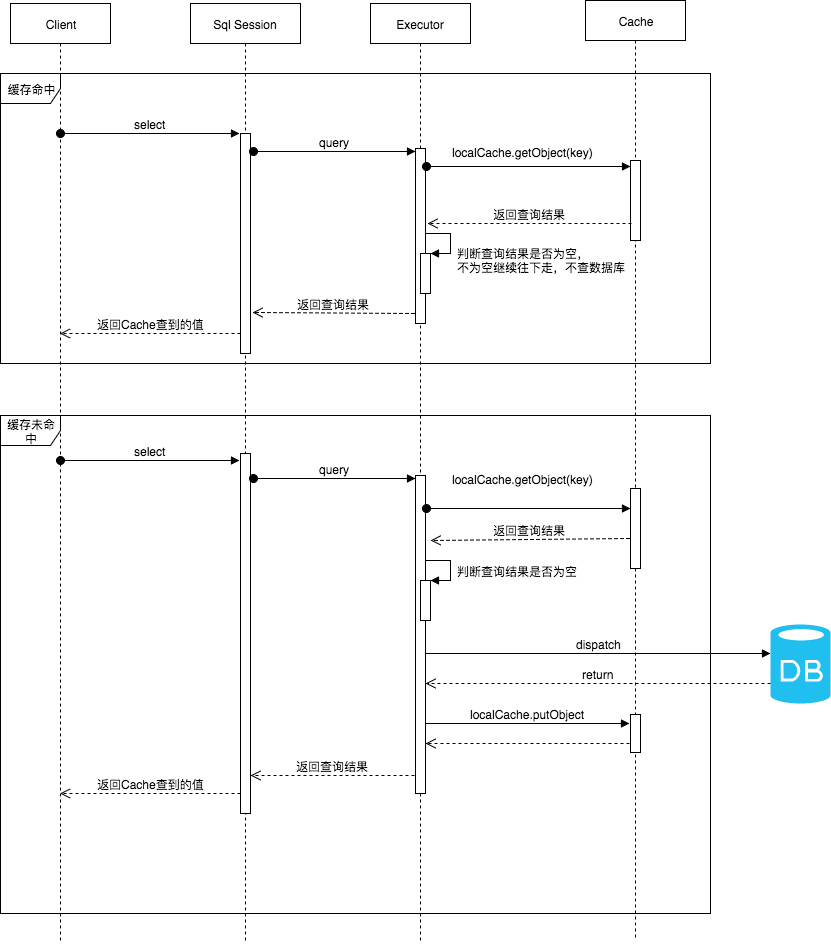
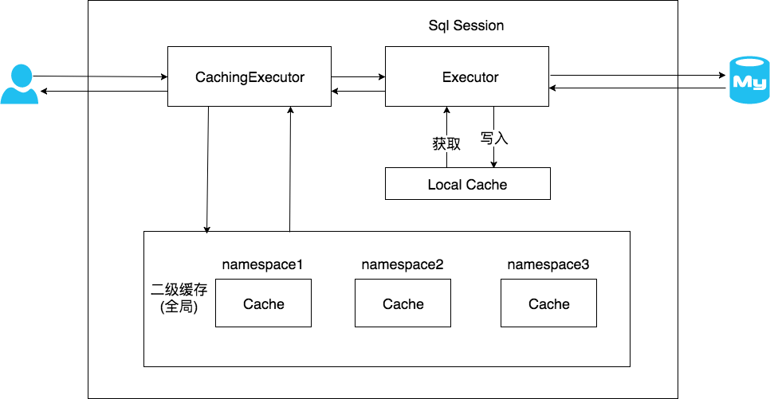

## Mybatis 缓存机制

​	Mybatis 的缓存均缓存查询操作结果。按照作用域范围，可以分为：

```
- **一级缓存**： `SqlSession` 级别的缓存
- **二级缓存**： `namespace` 级别的缓存
```

### 一级缓存

​	Mybatis 默认开启了一级缓存， 一级缓存有两个级别可以设置：分别是 `SESSION` 或者 `STATEMENT` 默认是 `SESSION` 级别，即在一个 MyBatis会话中执行的所有语句，都会共享这一个缓存。一种是 `STATEMENT` 级别，可以理解为缓存只对当前执行的这一个 `Statement` 有效。

> STATEMENT 级别相当于关闭一级缓存

```
<setting name="localCacheScope" value="SESSION"/>
```

#### 基本原理



在一级缓存中，当 `sqlSession` 执行写操作（执行插入、更新、删除），清空 `SqlSession` 中的一级缓存。

#### 总结

- MyBatis 一级缓存的生命周期和SqlSession一致。
- MyBatis 一级缓存内部设计简单，只是一个没有容量限定的HashMap，在缓存的功能性上有所欠缺。
- MyBatis 的一级缓存最大范围是SqlSession内部，有多个SqlSession或者分布式的环境下，数据库写操作会引起脏数据，建议设定缓存级别为Statement。

### 二级缓存

如果多个 SqlSession 之间需要共享缓存，则需要使用到二级缓存。开启二级缓存后，会使用 CachingExecutor 装饰 Executor ，进入一级缓存的查询流程前，先在CachingExecutor 进行二级缓存的查询，具体的工作流程如下所示。



二级缓存开启后，同一个namespace下的所有操作语句，都影响着同一个Cache，即二级缓存被多个SqlSession共享，是一个全局的变量。当开启缓存后，数据的查询执行的流程就是 `二级缓存 -> 一级缓存 -> 数据库`。

```
<setting name="cacheEnabled" value="true"/>
```

### 总结

- MyBatis 的二级缓存相对于一级缓存来说，实现了 SqlSession 之间缓存数据的共享，同时粒度更加的细，能够到 namespace 级别，通过 Cache 接口实现类不同的组合，对Cache的可控性也更强。
- MyBatis 在多表查询时，极大可能会出现脏数据，有设计上的缺陷，安全使用二级缓存的条件比较苛刻。
- 在分布式环境下，由于默认的 MyBatis Cache 实现都是基于本地的，分布式环境下必然会出现读取到脏数据，需要使用集中式缓存将 MyBatis 的 Cache 接口实现，有一定的开发成本，直接使用 Redis、Memcached 等分布式缓存可能成本更低，安全性也更高。