# MySQL 共享锁与排他锁

mysql锁机制分为表级锁和行级锁。

共享锁又称为读锁，简称S锁，顾名思义，共享锁就是多个事务对于同一数据可以共享一把锁，都能访问到数据，但是只能读不能修改。

排他锁又称为写锁，简称X锁，顾名思义，排他锁就是不能与其他所并存，如一个事务获取了一个数据行的排他锁，其他事务就不能再获取该行的其他锁，包括共享锁和排他锁，但是获取排他锁的事务是可以对数据就行读取和修改。

对于共享锁大家可能很好理解，就是多个事务只能读数据不能改数据，对于排他锁大家的理解可能就有些差别，我当初就犯了一个错误，以为排他锁锁住一行数据后，其他事务就不能读取和修改该行数据，其实不是这样的。排他锁指的是一个事务在一行数据加上排他锁后，其他事务不能再在其上加其他的锁。mysql InnoDB引擎默认的修改数据语句，update,delete,insert都会自动给涉及到的数据加上排他锁，select语句默认不会加任何锁类型，如果加排他锁可以使用select ...for update语句，加共享锁可以使用select ... lock in share mode语句。所以加过排他锁的数据行在其他事务种是不能修改数据的，也不能通过for update和lock in share mode锁的方式查询数据，但可以直接通过select ...from...查询数据，因为普通查询没有任何锁机制。

说了这么多，咱们来看下以下简单的例子：

我们有如下测试数据

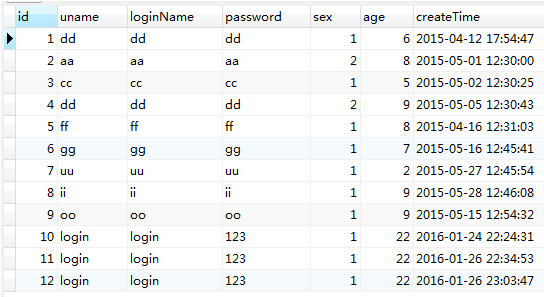

现在我们对id=1的数据行排他查询，这里会使用begin开启事务，而不会看见我关闭事务，这样做是用来测试，因为提交事务或回滚事务就会释放锁。

打开一个查询窗口

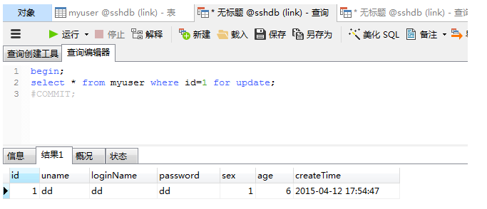

会查询到一条数据，现在打开另一个查询窗口，对同一数据分别使用排他查和共享锁查询两种方式查询

**排他查**

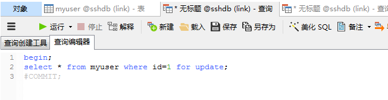

**共享查**

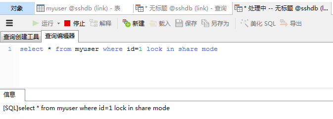

我们看到开了排他锁查询和共享锁查询都会处于阻塞状态，因为id=1的数据已经被加上了排他锁，此处阻塞是等待排他锁释放。

如果我们直接使用以下查询呢

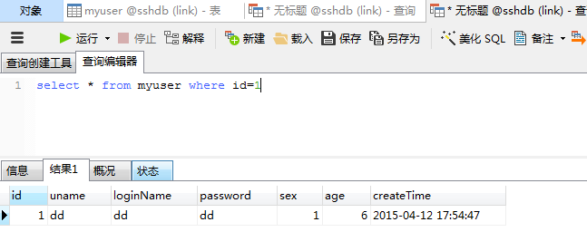

我们看到是可以查询到数据的。

我们再看一下一个事务获取了共享锁，在其他查询中也只能加共享锁或不加锁。

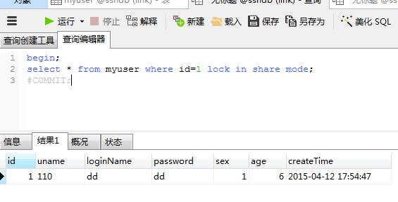

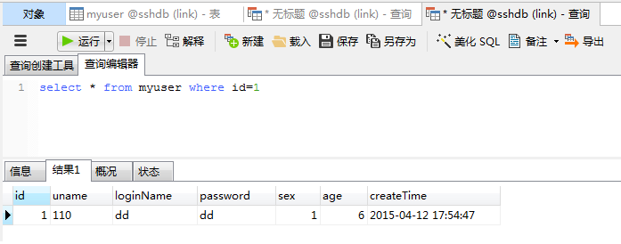

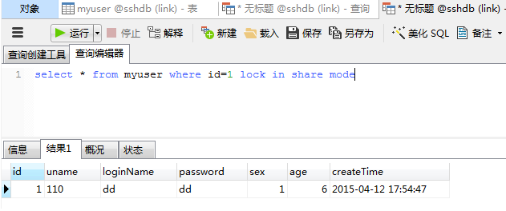

我们看到是可以查询数据的，但加排他锁就查不到，因为排他锁与共享锁不能存在同一数据上。

最后我们验证下上面说的mysql InnoDb引擎中update,delete,insert语句自动加排他锁的问题，

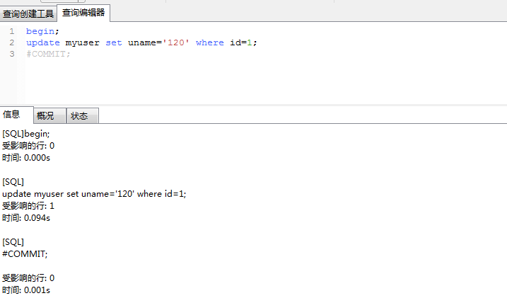

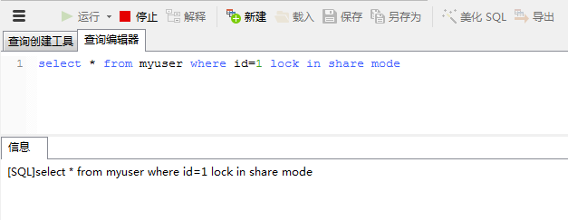

此时共享查询处于阻塞，等待排它锁的释放，但是用普通查询能查到数据，因为没用上锁机制不与排他锁互斥，但查到的数据是修改数据之前的老数据。

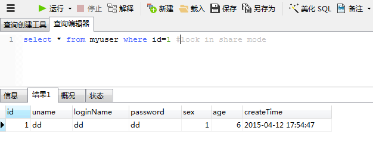

然后我们提交数据，释放排他锁看下修改后的数据，此时可用排他查，共享查和普通查询， 因为事务提交后该行数据释放排他锁，下面就只显示普通查询，其他的同学们自己去验证。

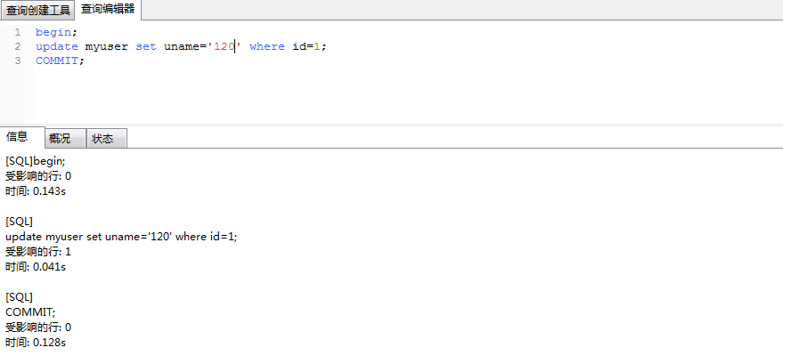

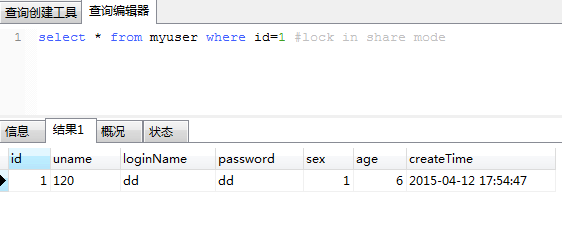

可以看到结果与预期的一样。