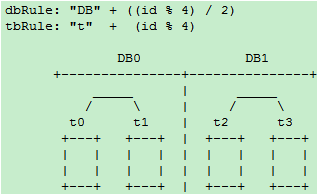

## 分库分表

目前绝大多数应用采取的两种分库分表规则

- mod方式
- dayofweek系列日期方式（所有星期1的数据在一个库/表,或所有?月份的数据在一个库表）

这两种方式有个本质的特点，就是 **离散性加周期性**。例如以一个表的主键对 `3` 取余数的方式分库或分表：


那么随着数据量的增大，每个表或库的数据量都是各自增长。当一个表或库的数据量增长到了一个极限，要加库或加表的时候， 介于这种分库分表算法的离散性，必需要做数据迁移才能完成。例如从3个扩展到5个的时候：


需要将原先以 `mod3` 分类的数据，重新以 `mod5` 分类，不可避免的带来数据迁移。每个表的数据都要被重新分配到多个新的表 相似的例子比如从 `dayofweek` 分的 `7` 个库/表,要扩张为以 `dayofmonth` 分的 `31` 张库/表，同样需要进行数据迁移。

数据迁移带来的问题是

- 业务至少要两次发布
- 要专门写工具来导数据。由于各业务之间的差别，很难做出统一的工具。目前几乎都是每个业务写一套
- 要解决增量、全量、时间点，数据不一致等问题

如何在数据量扩张到现有库表极限，加库加表时避免数据迁移呢？

通常的数据增长往往是随着时间的推移增长的。随着业务的开展，时间的推移，数据量不断增加。

考虑到数据增长的特点，如果我们以代表时间增长的字段，按递增的范围分库，则可以避免数据迁移。这样的方式下，在数据量再增加达到前几个库/表的上限时，则继续水平增加库表，原先的数据就不需要迁移了。但是这样的方式会带来一个 **热点问题**：当前的数据量达到某个库表的范围时，所有的插入操作，都集中在这个库/表了。

所以在满足基本业务功能的前提下，分库分表方案应该尽量避免的两个问题：

1. 数据迁移
2. 热点

**如何既能避免数据迁移又能避免插入更新的热点问题呢？**

结合离散分库/分表和连续分库/分表的优点，如果一定要写热点和新数据均匀分配在每个库，同时又保证易于水平扩展，可以考虑这样的模式：

### 水平扩展scale-out方案 – 模式一

#### 阶段一

一个库 `DB0` 之内分4个表，id%4 ：


#### 阶段二

增加 `DB1` 库，t2和t3整表搬迁到 `DB1`



#### 阶段三

增加 `DB2` 和 `DB3` 库，t1 整表搬迁到 `DB2` ，t3整表搬迁的 `DB3`：


为了规则表达，通过内部名称映射或其他方式，我们将DB1和DB2的名称和位置互换得到下图：

```
dbRule: “DB” + (id % 4)
tbRule: “t”  + (id % 4)
```


即逻辑上始终保持4库4表，每个表一个库。这种做法也是目前店铺线图片空间采用的做法。

上述方案有一个缺点，就是在从一个库到 4 个库的过程中，单表的数据量一直在增长。当单表的数据量超过一定范围时，可能会带来性能问题。比如索引的问题，历史数据清理的问题。另外当开始预留的表个数用尽，到了 4 物理库每库 1 个表的阶段，再进行扩容的话，不可避免的要从表上下手。

### 水平扩展scale-out方案 – 模式二

#### 阶段一

一个数据库，两个表，`rule0 = id % 2`

```
分库规则dbRule: “DB0″
分表规则tbRule: “t” + (id % 2)
```


#### 阶段二

当单库的数据量接近 1千万，单表的数据量接近 500 万时，进行扩容（数据量只是举例，具体扩容量要根据数据库和实际压力状况决定）：增加一个数据库 `DB1`，将 `DB0.t0` 整表迁移到新库 `DB1.t1`。每个库各增加1个表，未来10M-20M的数据mod2分别写入这2个表：`t0_1，t1_1`：


分库规则dbRule:

```
“DB” + (id % 2)
```

分表规则tbRule:

```
    if(id < 1千万){
        return "t"+ (id % 2);   //1千万之前的数据，仍然放在t0和t1表。t1表从DB0搬迁到DB1库
    }else if(id < 2千万){
        return "t"+ (id % 2) +"_1"; //1千万之后的数据，各放到两个库的两个表中: t0_1,t1_1
    }else{
        throw new IllegalArgumentException("id outof range[20000000]:" + id);
    }
```

这样 `10M` 以后的新生数据会均匀分布在 `DB0` 和 `DB1`; 插入更新和查询热点仍然能够在每个库中均匀分布。每个库中同时有老数据和不断增长的新数据。每表的数据仍然控制在 `500万` 以下。

#### 阶段三

当两个库的容量接近上限继续水平扩展时，进行如下操作：

- 新增加两个库：`DB2`和`DB3`，以`id % 4`分库。余数`0、1、2、3`分别对应`DB`的下标. `t0`和`t1`不变，
- 将`DB0.t0_1`整表迁移到`DB2`; 将`DB1.t1_1`整表迁移到`DB3`

`20M-40M`的数据 mod4 分为 4 个表：`t0_2，t1_2，t2_2，t3_2`，分别放到4个库中：


新的分库分表规则如下：

分库规则dbRule:

```
  if(id < 2千万){
      //2千万之前的数据，4个表分别放到4个库
      if(id < 1千万){
          return "db"+  (id % 2);     //原t0表仍在db0, t1表仍在db1
      }else{
          return "db"+ ((id % 2) +2); //原t0_1表从db0搬迁到db2; t1_1表从db1搬迁到db3
      }
  }else if(id < 4千万){
      return "db"+ (id % 4);          //超过2千万的数据，平均分到4个库
  }else{
      throw new IllegalArgumentException("id out of range. id:"+id);
  }
```

分表规则tbRule:

```
  if(id < 2千万){        //2千万之前的数据，表规则和原先完全一样，参见阶段二
      if(id < 1千万){
          return "t"+ (id % 2);       //1千万之前的数据，仍然放在t0和t1表
      }else{
          return "t"+ (id % 2) +"_1"; //1千万之后的数据，仍然放在t0_1和t1_1表
      }
  }else if(id < 4千万){
      return "t"+ (id % 4)+"_2";      //超过2千万的数据分为4个表t0_2，t1_2，t2_2，t3_2
  }else{
      throw new IllegalArgumentException("id out of range. id:"+id);
  }
```

随着时间的推移，当第一阶段的`t0/t1`，第二阶段的`t0_1/t1_1`逐渐成为历史数据，不再使用时，可以直接`truncate`掉整个表。省去了历史数据迁移的麻烦。

### 水平扩展scale-out方案 – 模式三

非倍数扩展：如果从上文的阶段二到阶段三不希望一下增加两个库呢？尝试如下方案：

迁移前：


新增库为`DB2`，`t0、t1`都放在 `DB0`，

```
t0_1整表迁移到 DB1
t1_1整表迁移到 DB2
```

迁移后：


这时 `DB0` 退化为旧数据的读库和更新库。新增数据的热点均匀分布在 `DB1` 和 `DB2` 4无法整除3，因此如果从4表2库扩展到3个库，不做行级别的迁移而又保证热点均匀分布看似无法完成。

当然如果不限制每库只有两个表，也可以如下实现：

​	小于 `10M` 的 `t0` 和 `t1` 都放到 `DB0` ，以 `mod2` 分为两个表，原数据不变 `10M-20M`的，以 `mod2` 分为两个表 `t0_1、t1_1`，原数据不变，分别搬迁到 `DB1` ，和 `DB2` `20M` 以上的以 `mod3` 平均分配到 3 个 DB 库的 `t_0、t_2、t_3`表中

​	这样 `DB1` 包含最老的两个表，和最新的 `1/3` 数据。`DB1` 和 `DB2` 都分表包含次新的两个旧表 `t0_1、t1_1` 和最新的 `1/3` 数据。新旧数据读写都可达到均匀分布。

### 总结

总而言之，两种规则映射（函数）：

- `离散映射`：如mod或dayofweek， 这种类型的映射能够很好的解决热点问题，但带来了数据迁移和历史数据问题。
- `连续映射`；如按id或gmt_create_time的连续范围做映射。这种类型的映射可以避免数据迁移，但又带来热点问题。

**离散映射和连续映射这两种相辅相成的映射规则，正好解决热点和迁移这一对相互矛盾的问题**。

我们之前只运用了离散映射，引入连续映射规则后，两者结合，精心设计，应该可以设计出满足避免热点和减少迁移之间任意权衡取舍的规则。

基于以上考量，分库分表规则的设计和配置，长远说来必须满足以下要求

- 可以动态推送修改
- **规则可以分层级叠加**，旧规则可以在新规则下继续使用，新规则是旧规则在更宽尺度上的拓展，以此支持新旧规则的兼容，避免数据迁移
- 用 `mod` 方式时，最好选 2 的指数级倍分库分表，这样方便以后切割。

## 全局ID

- 数据库自增 id
- 设置数据库 sequence 或者表自增字段步长
- UUID
- 获取系统当前时间
- Snowflake 算法

### Snowflake

twitter 开源的分布式 id 生成算法，采用 `Scala` 语言实现，是把一个 `64` 位的 `long` 型的 `id` ，`1` 个 `bit` 是不用的，用其中的 `41` `bit` 作为毫秒数，用 `10` `bit` 作为工作机器 `id` ，`12` `bit` 作为序列号。

```
|–1位符号位–|--41位时间戳–|--10位机器ID–|--12位序列号–|
```

- **1 bit**：不用，为啥呢？因为二进制里第一个 `bit` 为如果是 1，那么都是负数，但是我们生成的 id 都是正数，所以第一个 bit 统一都是 0。
- **41 bit**：表示的是时间戳，单位是毫秒。`41 bit` 可以表示的数字多达 `2^41 - 1`，也就是可以标识 `2^41 - 1` 个毫秒值，换算成年就是表示`69`年的时间。
- **10 bit**：记录工作机器 `id`，代表的是这个服务最多可以部署在 `2^10`台机器上哪，也就是`1024`台机器。但是 10 bit 里 5 个 bit 代表机房 id，5 个 bit 代表机器 id。意思就是最多代表 `2^5`个机房（32个机房），每个机房里可以代表 `2^5` 个机器（32台机器）。
- **12 bit**：这个是用来记录同一个毫秒内产生的不同 id，`12 bit` 可以代表的最大正整数是 `2^12 - 1 = 4096`，也就是说可以用这个 `12 bit` 代表的数字来区分同一个毫秒内的 `4096` 个不同的 id。

#### Snowflake 的问题

Snowflake 这样依赖时间的ID生成算法注定存在一个问题：**时间的准确度问题**。这一算法有一个默认前提：分布式环境下时间获取总是准确的，即时间总是递增的。而现实环境中，这样的条件很难满足。总会因为硬件、软件、人的原因造成时间变化。如果你的硬件时间本身就比正常时间快，而你接入了一个 NTP 服务，每当进行 NTP 时间校准时，你的机器时间总会向后 **回拨** 一段时间，这时悲剧就来了：有极大可能性生成重复ID。

针对上面提到的两个问题，可如下改进：

1. 时间戳由毫秒变为秒
2. 使用环形列表对时间戳对应的序列进行缓存
3. 使用CAS操作避免大粒度悲观锁

为了 **缓解** 时钟回拨问题，对之前的序列进行缓存，而原生算法很显然是不利于缓存的，最坏的情况下每秒需要缓存 1000 个值，这显然对内存很不友好。于是我将时间戳改为秒为单位，同时可以把省出来的位交给序列。此时缓存一个小时的数据（即可以容忍一个小时的时钟回拨）也就只需要缓存 3600 个序列，完全可以接受。改进后的 Snowflake 生成的ID是这样组成的：

```
|–1位符号位–|--32位时间戳–|--10位机器ID–|--21位序列号–|
```

> 环形列表：即整个列表的容量是一定的，当列表满了以后再加入的元素会按照入列的先后顺序覆盖之前的元素。