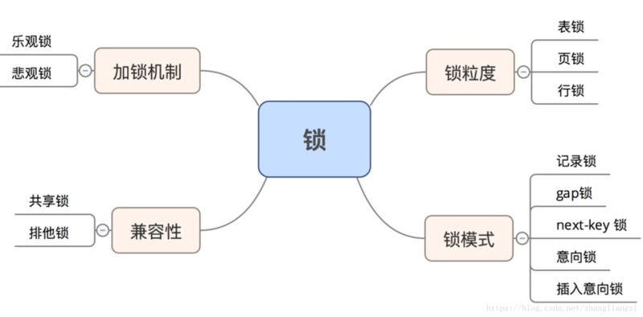

# InnoDB 并发控制

## InnoDB 锁机制



InnoDB默认使用行锁，实现了两种标准的行锁——共享锁与排他锁；

|行锁类型| 锁功能|锁兼容性| 加锁|释放锁| | :————- | :————- | |共享锁（读锁、S锁）| 允许获取共享锁的亊务读数据|与共享锁兼容，与排它锁不兼容| 只有 `SerializaWe` 隔离级别会默认为：读加共享锁；其他隔离级别下，可显示使用 `select...lock in share model` 为读加共享锁| 在事务提交或回滚后会自动同时释放锁；除了使用 `start transaction` 的方式显式开启事务，InnoDB 也会自动为增删改査语句开启事务，并自动提交或回滚；(`autocommit=1`)| |排它锁（写锁、X锁）|允许获取排它锁的事务更新或删除数据|与共享锁不兼容，与排它锁不兼容|在默认的 `Reapeatable Read` 隔离级别下，InnoDB 会自动为增删改操作的行加排它锁；也可显式使用 `select...for update` 为读加排它锁|…|

> 1. 除了显式加锁的情况，其他情况下的加锁与解锁都无需人工干预
> 2. InnoDB 所有的行锁算法都是基于索引实现的，锁定的也都是索引或索引区间

### 当前读 & 快照读

**当前读**：即加锁读，读取记录的最新版本，会加锁保证其他并发事务不能修改当前记录，直至获取锁的事务释放锁；使用当前读的操作主要包括：**显式加锁的读操作与插入/更新/删除等写操作**，如下所示：

```
select * from table where ? lock in share mode;
select * from table where ? for update;
insert into table values (…);
update table set ? where ?;
delete from table where ?;
```

> 注：当 `Update` SQL 被发给 `MySQL` 后， `MySQL Server` 会根据where条件，读取第一条满足条件的记录，然后 InnoDB 引擎会将第一条记录返回，并加锁，待 `MySQL Server` 收到这条加锁的记录之后，会再发起一个 `Update` 请求，更新这条记录。一条记录操作完成，再读取下一条记录，直至没有满足条件的记录为止。因此， `Update` 操作内部，就包含了当前读。同理， `Delete` 操作也一样。 `Insert` 操作会稍微有些不同，简单来说，就是 `Insert` 操作可能会触发 `Unique Key` 的冲突检查，也会进行一个当前读。

**快照读：即不加锁读，读取记录的快照版本而非最新版本，通过MVCC实现**；

InnoDB 默认的 `RR` 事务隔离级别下，不显式加`lock in share mode`与`for update`的 `select` 操作都属于快照读，保证事务执行过程中只有第一次读之前提交的修改和自己的修改可见，其他的均不可见；

### 共享锁与独占锁

### 意向锁

InnoDB 支持多粒度的锁，允许表级锁和行级锁共存。一个类似于 `LOCK TABLES ... WRITE` 的语句会获得这个表的 `x` 锁。为了实现多粒度锁，InnoDB 使用了意向锁（简称 I 锁）。I 锁是表明一个事务稍后要获得针对一行记录的某种锁（`s or x`）的对应表的表级锁，有两种：

- 意向排它锁（简称 IX 锁）表明一个事务意图在某个表中设置某些行的 x 锁
- 意向共享锁（简称 IS 锁）表明一个事务意图在某个表中设置某些行的 s 锁

`SELECT ... LOCK IN SHARE MODE` 设置一个 `IS` 锁, `SELECT ... FOR UPDATE` 设置一个 `IX` 锁。意向锁的原则如下：

- 一个事务必须先持有该表上的 IS 或者更强的锁才能持有该表中某行的 S 锁
- 一个事务必须先持有该表上的 IX 锁才能持有该表中某行的 X 锁

新请求的锁只有兼容已有锁才能被允许，否则必须等待不兼容的已有锁被释放。**一个不兼容的锁请求不被允许是因为它会引起死锁，错误会发生**。意向锁只会阻塞全表请求（比如 `LOCK TABLES ... WRITE` ）。**意向锁的主要目的是展示某人正在锁定表中一行，或者将要锁定一行**。

### Record Lock

记录锁（Record Lock）是加到**索引记录**上的锁，假设我们存在下面的一张表 `users`：

```
    CREATE TABLE users(
        id INT NOT NULL AUTO_INCREMENT,
        last_name VARCHAR(255) NOT NULL,
        first_name VARCHAR(255),
        age INT,
        PRIMARY KEY(id),
        KEY(last_name),
        KEY(age)
    );
```

如果我们使用 `id` 或者 `last_name` 作为 SQL 中 `WHERE` 语句的过滤条件，那么 InnoDB 就可以通过索引建立的 B+ 树找到行记录并添加索引，但是如果使用 `first_name` 作为过滤条件时，由于 InnoDB 不知道待修改的记录具体存放的位置，也无法对将要修改哪条记录提前做出判断就会锁定整个表。

### Gap Lock

记录锁是在存储引擎中最为常见的锁，除了记录锁之外，InnoDB 中还存在间隙锁（Gap Lock），间隙锁是对索引记录中的一段连续区域的锁；当使用类似 `SELECT * FROM users WHERE id BETWEEN 10 AND 20 FOR UPDATE;` 的 SQL 语句时，就会阻止其他事务向表中插入 `id = 15` 的记录，因为整个范围都被间隙锁锁定了。

> 间隙锁是存储引擎对于性能和并发做出的权衡，并且只用于某些事务隔离级别。

虽然间隙锁中也分为共享锁和互斥锁，不过它们之间并不是互斥的，也就是不同的事务可以同时持有一段相同范围的共享锁和互斥锁，它唯一阻止的就是**其他事务向这个范围中添加新的记录**。

#### 间隙锁的缺点

- 间隙锁有一个比较致命的弱点，就是当锁定一个范围键值之后，即使某些不存在的键值也会被无辜的锁定，而造成在锁定的时候无法插入锁定键值范围内的任何数据。在某些场景下这可能会对性能造成很大的危害
- 当Query无法利用索引的时候， InnoDB会放弃使用行级别锁定而改用表级别的锁定，造成并发性能的降低；
- 当Quuery使用的索引并不包含所有过滤条件的时候，数据检索使用到的索引键所指向的数据可能有部分并不属于该Query的结果集的行列，但是也会被锁定，因为间隙锁锁定的是一个范围，而不是具体的索引键；
- 当Query在使用索引定位数据的时候，如果使用的索引键一样但访问的数据行不同的时候（索引只是过滤条件的一部分），一样会被锁定

#### Next-Key Lock

Next-Key 锁相比前两者就稍微有一些复杂，它是记录锁和记录前的间隙锁的结合，在 `users` 表中有以下记录：

```
    +------|-------------|--------------|-------+
    |   id | last_name   | first_name   |   age |
    |------|-------------|--------------|-------|
    |    4 | stark       | tony         |    21 |
    |    1 | tom         | hiddleston   |    30 |
    |    3 | morgan      | freeman      |    40 |
    |    5 | jeff        | dean         |    50 |
    |    2 | donald      | trump        |    80 |
    +------|-------------|--------------|-------+
```

如果使用 Next-Key 锁，那么 Next-Key 锁就可以在需要的时候锁定以下的范围：

```
    (-∞, 21]
    (21, 30]
    (30, 40]
    (40, 50]
    (50, 80]
    (80, ∞)
```

> 既然叫 Next-Key 锁，锁定的应该是当前值和后面的范围，但是实际上却不是，Next-Key 锁锁定的是当前值和前面的范围。

当我们更新一条记录，比如 `SELECT * FROM users WHERE age = 30 FOR UPDATE;`，InnoDB 不仅会在范围 `(21, 30]` 上加 Next-Key 锁，还会在这条该记录索引增长方向的范围 `(30, 40]` 加间隙锁，所以插入 `(21, 40]` 范围内的记录都会被锁定。

> Next-Key 锁的作用其实是为了解决幻读的问题。

### 插入意向锁

插入意向锁是在插入一行记录操作之前设置的一种间隙锁，这个锁释放了一种插入方式的信号，亦即多个事务在相同的索引间隙插入时如果不是插入间隙中相同的位置就不需要互相等待。假设有索引值`4、7`，几个不同的事务准备插入`5、6`，每个锁都在获得插入行的独占锁之前用插入意向锁各自锁住了`4、7`之间的间隙，但是不阻塞对方因为插入行不冲突。

### 自增锁

自增锁是一个特殊的表级锁，事务插入自增列的时候需要获取，最简单情况下如果一个事务插入一个值到表中，任何其他事务都要等待，这样第一个事物才能获得连续的主键值。

### 锁选择

```
+——-+————-+
| id | name |
+——-+————-+
| 1 | title1 |
+——-+————-+
| 2 | title2 |
+——-+————-+
| 3 | title3 |
+——-+————-+
| 9 | title9 |
+——-+————-+
| 10 | title10 |
+——-+————-+
```

按照原理来说，`id>5 and id<7`这个查询条件，在表中找不到满足条件的项，因此会对第一个不满足条件的项(`id = 9`)上加GAP锁，防止后续其他事务插入满足条件的记录。

而 **GAP 锁与GAP 锁是不冲突的**，那么为什么两个同时执行`id>5 and id<7`查询的事务会冲突呢？

原因在于，`MySQL Server`并没有将`id<7`这个查询条件下降到`InnoDB`引擎层，因此`InnoDB`看到的查询，是`id>5`，正向扫描。读出的记录`id=9`，先加上`next key锁`(Lock X + GAP lock)，然后返回给 MySQL Server 进行判断。 MySQL Server 此时才会判断返回的记录是否满足`id<7`的查询条件。此处不满足，查询结束。

因此，`id=9`记录上，真正持有的锁是`next key`锁，**而`next key`锁之间是相互冲突的**，这也说明了为什么两个`id>5 and id<7`查询的事务会冲突的原因。


### Record Lock、Gap Lock、Next-Key Lock

> Record Lock:单个行记录上的锁
>
> Gap Lock:间隙锁，锁定一个范围，但不包含记录本身
>
> Next-Key Lock:锁定一个范围，并且锁定记录本身
>