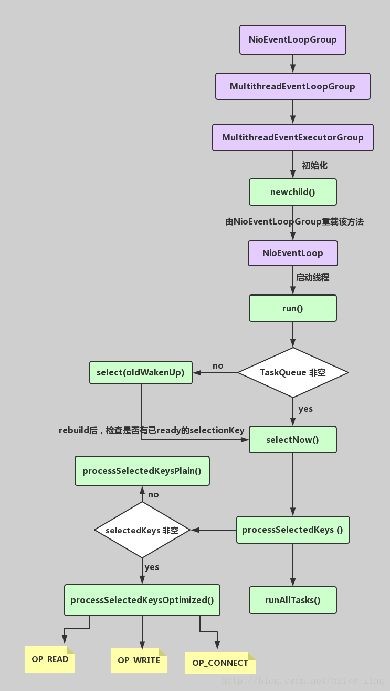

### 1.BIO、NIO和AIO的区别？

- BIO：一个连接一个线程，客户端有连接请求时服务器端就需要启动一个线程进行处理。线程开销大。
- 伪异步IO：将请求连接放入线程池，一对多，但线程还是很宝贵的资源。
- NIO：一个请求一个线程，但客户端发送的连接请求都会注册到多路复用器上，多路复用器轮询到连接有I/O请求时才启动一个线程进行处理。
- AIO：一个有效请求一个线程，客户端的I/O请求都是由OS先完成了再通知服务器应用去启动线程进行处理，
- BIO是面向流的，NIO是面向缓冲区的；BIO的各种流是阻塞的。而NIO是非阻塞的；BIO的Stream是单向的，而NIO的channel是双向的。
- NIO的特点：事件驱动模型、单线程处理多任务、非阻塞I/O，I/O读写不再阻塞，而是返回0、基于block的传输比基于流的传输更高效、更高级的IO函数zero-copy、IO多路复用大大提高了Java网络应用的可伸缩性和实用性。基于Reactor线程模型。
- 在Reactor模式中，事件分发器等待某个事件或者可应用或个操作的状态发生，事件分发器就把这个事件传给事先注册的事件处理函数或者回调函数，由后者来做实际的读写操作。如在Reactor中实现读：注册读就绪事件和相应的事件处理器、事件分发器等待事件、事件到来，激活分发器，分发器调用事件对应的处理器、事件处理器完成实际的读操作，处理读到的数据，注册新的事件，然后返还控制权。

### 2.NIO的组成？

- Buffer：与Channel进行交互，数据是从Channel读入缓冲区，从缓冲区写入Channel中的
  - flip方法 ： 反转此缓冲区，将position给limit，然后将position置为0，其实就是切换读写模式
  - clear方法 ：清除此缓冲区，将position置为0，把capacity的值给limit。
  - rewind方法 ： 重绕此缓冲区，将position置为0
- DirectByteBuffer可减少一次系统空间到用户空间的拷贝。但Buffer创建和销毁的成本更高，不可控，通常会用内存池来提高性能。直接缓冲区主要分配给那些易受基础系统的本机I/O 操作影响的大型、持久的缓冲区。如果数据量比较小的中小应用情况下，可以考虑使用heapBuffer，由JVM进行管理。
- Channel：表示 IO 源与目标打开的连接，是双向的，但不能直接访问数据，只能与Buffer 进行交互。通过源码可知，FileChannel的read方法和write方法都导致数据复制了两次！
- Selector可使一个单独的线程管理多个Channel，open方法可创建Selector，register方法向多路复用器器注册通道，可以监听的事件类型：读、写、连接、accept。注册事件后会产生一个SelectionKey：它表示SelectableChannel 和Selector 之间的注册关系，wakeup方法：使尚未返回的第一个选择操作立即返回，唤醒的原因是：注册了新的channel或者事件；channel关闭，取消注册；优先级更高的事件触发（如定时器事件），希望及时处理。
- Selector在Linux的实现类是EPollSelectorImpl，委托给EPollArrayWrapper实现，其中三个native方法是对epoll的封装，而EPollSelectorImpl. implRegister方法，通过调用epoll_ctl向epoll实例中注册事件，还将注册的文件描述符(fd)与SelectionKey的对应关系添加到fdToKey中，这个map维护了文件描述符与SelectionKey的映射。
- fdToKey有时会变得非常大，因为注册到Selector上的Channel非常多（百万连接）；过期或失效的Channel没有及时关闭。fdToKey总是串行读取的，而读取是在select方法中进行的，该方法是非线程安全的。
- Pipe：两个线程之间的单向数据连接，数据会被写到sink通道，从source通道读取
- NIO的服务端建立过程：Selector.open()：打开一个Selector；ServerSocketChannel.open()：创建服务端的Channel；bind()：绑定到某个端口上。并配置非阻塞模式；register()：注册Channel和关注的事件到Selector上；select()轮询拿到已经就绪的事件

### 3.Netty的特点？

- 一个高性能、异步事件驱动的NIO框架，它提供了对TCP、UDP和文件传输的支持
- 使用更高效的socket底层，对epoll空轮询引起的cpu占用飙升在内部进行了处理，避免了直接使用NIO的陷阱，简化了NIO的处理方式。
- 采用多种decoder/encoder 支持，对TCP粘包/分包进行自动化处理
- 可使用接受/处理线程池，提高连接效率，对重连、心跳检测的简单支持
- 可配置IO线程数、TCP参数， TCP接收和发送缓冲区使用直接内存代替堆内存，通过内存池的方式循环利用ByteBuf
- 通过引用计数器及时申请释放不再引用的对象，降低了GC频率
- 使用单线程串行化的方式，高效的Reactor线程模型
- 大量使用了volitale、使用了CAS和原子类、线程安全类的使用、读写锁的使用

### 4.Netty的线程模型？

- Netty通过Reactor模型基于多路复用器接收并处理用户请求，内部实现了两个线程池，boss线程池和work线程池，其中boss线程池的线程负责处理请求的accept事件，当接收到accept事件的请求时，把对应的socket封装到一个NioSocketChannel中，并交给work线程池，其中work线程池负责请求的read和write事件，由对应的Handler处理。
- 单线程模型：所有I/O操作都由一个线程完成，即多路复用、事件分发和处理都是在一个Reactor线程上完成的。既要接收客户端的连接请求,向服务端发起连接，又要发送/读取请求或应答/响应消息。一个NIO 线程同时处理成百上千的链路，性能上无法支撑，速度慢，若线程进入死循环，整个程序不可用，对于高负载、大并发的应用场景不合适。
- 多线程模型：有一个NIO 线程（Acceptor） 只负责监听服务端，接收客户端的TCP 连接请求；NIO 线程池负责网络IO 的操作，即消息的读取、解码、编码和发送；1 个NIO 线程可以同时处理N 条链路，但是1 个链路只对应1 个NIO 线程，这是为了防止发生并发操作问题。但在并发百万客户端连接或需要安全认证时，一个Acceptor 线程可能会存在性能不足问题。
- 主从多线程模型：Acceptor 线程用于绑定监听端口，接收客户端连接，将SocketChannel 从主线程池的Reactor 线程的多路复用器上移除，重新注册到Sub 线程池的线程上，用于处理I/O 的读写等操作，从而保证mainReactor只负责接入认证、握手等操作；

### 5.TCP 粘包/拆包的原因及解决方法？

- TCP是以流的方式来处理数据，一个完整的包可能会被TCP拆分成多个包进行发送，也可能把小的封装成一个大的数据包发送。
- TCP粘包/分包的原因：
  - 应用程序写入的字节大小大于套接字发送缓冲区的大小，会发生拆包现象，而应用程序写入数据小于套接字缓冲区大小，网卡将应用多次写入的数据发送到网络上，这将会发生粘包现象；
  - 进行MSS大小的TCP分段，当TCP报文长度-TCP头部长度>MSS的时候将发生拆包
  - 以太网帧的payload（净荷）大于MTU（1500字节）进行ip分片。
- 解决方法
  - 消息定长：FixedLengthFrameDecoder类
  - 包尾增加特殊字符分割：行分隔符类：LineBasedFrameDecoder或自定义分隔符类 ：DelimiterBasedFrameDecoder
  - 将消息分为消息头和消息体：LengthFieldBasedFrameDecoder类。分为有头部的拆包与粘包、长度字段在前且有头部的拆包与粘包、多扩展头部的拆包与粘包。

### 6.了解哪几种序列化协议？

- 序列化（编码）是将对象序列化为二进制形式（字节数组），主要用于网络传输、数据持久化等；而反序列化（解码）则是将从网络、磁盘等读取的字节数组还原成原始对象，主要用于网络传输对象的解码，以便完成远程调用。
- 影响序列化性能的关键因素：序列化后的码流大小（网络带宽的占用）、序列化的性能（CPU资源占用）；是否支持跨语言（异构系统的对接和开发语言切换）。
- Java默认提供的序列化：无法跨语言、序列化后的码流太大、序列化的性能差
- XML，优点：人机可读性好，可指定元素或特性的名称。缺点：序列化数据只包含数据本身以及类的结构，不包括类型标识和程序集信息；只能序列化公共属性和字段；不能序列化方法；文件庞大，文件格式复杂，传输占带宽。适用场景：当做配置文件存储数据，实时数据转换。
- JSON，是一种轻量级的数据交换格式，优点：兼容性高、数据格式比较简单，易于读写、序列化后数据较小，可扩展性好，兼容性好、与XML相比，其协议比较简单，解析速度比较快。缺点：数据的描述性比XML差、不适合性能要求为ms级别的情况、额外空间开销比较大。适用场景（可替代ＸＭＬ）：跨防火墙访问、可调式性要求高、基于Web browser的Ajax请求、传输数据量相对小，实时性要求相对低（例如秒级别）的服务。
- Fastjson，采用一种“假定有序快速匹配”的算法。优点：接口简单易用、目前java语言中最快的json库。缺点：过于注重快，而偏离了“标准”及功能性、代码质量不高，文档不全。适用场景：协议交互、Web输出、Android客户端
- Thrift，不仅是序列化协议，还是一个RPC框架。优点：序列化后的体积小, 速度快、支持多种语言和丰富的数据类型、对于数据字段的增删具有较强的兼容性、支持二进制压缩编码。缺点：使用者较少、跨防火墙访问时，不安全、不具有可读性，调试代码时相对困难、不能与其他传输层协议共同使用（例如HTTP）、无法支持向持久层直接读写数据，即不适合做数据持久化序列化协议。适用场景：分布式系统的RPC解决方案
- Avro，Hadoop的一个子项目，解决了JSON的冗长和没有IDL的问题。优点：支持丰富的数据类型、简单的动态语言结合功能、具有自我描述属性、提高了数据解析速度、快速可压缩的二进制数据形式、可以实现远程过程调用RPC、支持跨编程语言实现。缺点：对于习惯于静态类型语言的用户不直观。适用场景：在Hadoop中做Hive、Pig和MapReduce的持久化数据格式。
- Protobuf，将数据结构以.proto文件进行描述，通过代码生成工具可以生成对应数据结构的POJO对象和Protobuf相关的方法和属性。优点：序列化后码流小，性能高、结构化数据存储格式（XML JSON等）、通过标识字段的顺序，可以实现协议的前向兼容、结构化的文档更容易管理和维护。缺点：需要依赖于工具生成代码、支持的语言相对较少，官方只支持Java 、C++ 、python。适用场景：对性能要求高的RPC调用、具有良好的跨防火墙的访问属性、适合应用层对象的持久化
- 其它
  - protostuff 基于protobuf协议，但不需要配置proto文件，直接导包即可
  - Jboss marshaling 可以直接序列化java类， 无须实java.io.Serializable接口
  - Message pack 一个高效的二进制序列化格式
  - Hessian 采用二进制协议的轻量级remoting onhttp工具
  - kryo 基于protobuf协议，只支持java语言,需要注册（Registration），然后序列化（Output），反序列化（Input）

### 7.如何选择序列化协议？

- 具体场景
  - 对于公司间的系统调用，如果性能要求在100ms以上的服务，基于XML的SOAP协议是一个值得考虑的方案。
  - 基于Web browser的Ajax，以及Mobile app与服务端之间的通讯，JSON协议是首选。对于性能要求不太高，或者以动态类型语言为主，或者传输数据载荷很小的的运用场景，JSON也是非常不错的选择。
  - 对于调试环境比较恶劣的场景，采用JSON或XML能够极大的提高调试效率，降低系统开发成本。
  - 当对性能和简洁性有极高要求的场景，Protobuf，Thrift，Avro之间具有一定的竞争关系。
  - 对于T级别的数据的持久化应用场景，Protobuf和Avro是首要选择。如果持久化后的数据存储在hadoop子项目里，Avro会是更好的选择。
  - 对于持久层非Hadoop项目，以静态类型语言为主的应用场景，Protobuf会更符合静态类型语言工程师的开发习惯。由于Avro的设计理念偏向于动态类型语言，对于动态语言为主的应用场景，Avro是更好的选择。
  - 如果需要提供一个完整的RPC解决方案，Thrift是一个好的选择。
  - 如果序列化之后需要支持不同的传输层协议，或者需要跨防火墙访问的高性能场景，Protobuf可以优先考虑。
- protobuf的数据类型有多种：bool、double、float、int32、int64、string、bytes、enum、message。protobuf的限定符：required: 必须赋值，不能为空、optional:字段可以赋值，也可以不赋值、repeated: 该字段可以重复任意次数（包括0次）、枚举；只能用指定的常量集中的一个值作为其值；
- protobuf的基本规则：每个消息中必须至少留有一个required类型的字段、包含0个或多个optional类型的字段；repeated表示的字段可以包含0个或多个数据；[1,15]之内的标识号在编码的时候会占用一个字节（常用），[16,2047]之内的标识号则占用2个字节，标识号一定不能重复、使用消息类型，也可以将消息嵌套任意多层，可用嵌套消息类型来代替组。
- protobuf的消息升级原则：不要更改任何已有的字段的数值标识；不能移除已经存在的required字段，optional和repeated类型的字段可以被移除，但要保留标号不能被重用。新添加的字段必须是optional或repeated。因为旧版本程序无法读取或写入新增的required限定符的字段。
- 编译器为每一个消息类型生成了一个.java文件，以及一个特殊的Builder类（该类是用来创建消息类接口的）。如：UserProto.User.Builder builder = UserProto.User.newBuilder();builder.build()；
- Netty中的使用：ProtobufVarint32FrameDecoder 是用于处理半包消息的解码类；ProtobufDecoder(UserProto.User.getDefaultInstance())这是创建的UserProto.java文件中的解码类；ProtobufVarint32LengthFieldPrepender 对protobuf协议的消息头上加上一个长度为32的整形字段，用于标志这个消息的长度的类；ProtobufEncoder 是编码类
- 将StringBuilder转换为ByteBuf类型：copiedBuffer()方法

### 8.Netty的零拷贝实现？

- Netty的接收和发送ByteBuffer采用DIRECT BUFFERS，使用堆外直接内存进行Socket读写，不需要进行字节缓冲区的二次拷贝。堆内存多了一次内存拷贝，JVM会将堆内存Buffer拷贝一份到直接内存中，然后才写入Socket中。ByteBuffer由ChannelConfig分配，而ChannelConfig创建ByteBufAllocator默认使用Direct Buffer
- CompositeByteBuf 类可以将多个 ByteBuf 合并为一个逻辑上的 ByteBuf, 避免了传统通过内存拷贝的方式将几个小Buffer合并成一个大的Buffer。addComponents方法将 header 与 body 合并为一个逻辑上的 ByteBuf, 这两个 ByteBuf 在CompositeByteBuf 内部都是单独存在的, CompositeByteBuf 只是逻辑上是一个整体
- 通过 FileRegion 包装的FileChannel.tranferTo方法 实现文件传输, 可以直接将文件缓冲区的数据发送到目标 Channel，避免了传统通过循环write方式导致的内存拷贝问题。
- 通过 wrap方法, 我们可以将 byte[] 数组、ByteBuf、ByteBuffer等包装成一个 Netty ByteBuf 对象, 进而避免了拷贝操作。
- Selector BUG：若Selector的轮询结果为空，也没有wakeup或新消息处理，则发生空轮询，CPU使用率100%，
- Netty的解决办法：对Selector的select操作周期进行统计，每完成一次空的select操作进行一次计数，若在某个周期内连续发生N次空轮询，则触发了epoll死循环bug。重建Selector，判断是否是其他线程发起的重建请求，若不是则将原SocketChannel从旧的Selector上去除注册，重新注册到新的Selector上，并将原来的Selector关闭。

### 9.Netty的高性能表现在哪些方面？

- **心跳**，对服务端：会定时清除闲置会话inactive(netty5)，对客户端:用来检测会话是否断开，是否重来，检测网络延迟，其中idleStateHandler类 用来检测会话状态
- **串行无锁化设计**，即消息的处理尽可能在同一个线程内完成，期间不进行线程切换，这样就避免了多线程竞争和同步锁。表面上看，串行化设计似乎CPU利用率不高，并发程度不够。但是，通过调整NIO线程池的线程参数，可以同时启动多个串行化的线程并行运行，这种局部无锁化的串行线程设计相比一个队列-多个工作线程模型性能更优。
- **可靠性**，链路有效性检测：链路空闲检测机制，读/写空闲超时机制；内存保护机制：通过内存池重用ByteBuf;ByteBuf的解码保护；优雅停机：不再接收新消息、退出前的预处理操作、资源的释放操作。
- **Netty安全性**：支持的安全协议：SSL V2和V3，TLS，SSL单向认证、双向认证和第三方CA认证。
- **高效并发编程的体现**：volatile的大量、正确使用；CAS和原子类的广泛使用；线程安全容器的使用；通过读写锁提升并发性能。IO通信性能三原则：传输（AIO）、协议（Http）、线程（主从多线程）
- **流量整型**的作用（变压器）：防止由于上下游网元性能不均衡导致下游网元被压垮，业务流中断；防止由于通信模块接受消息过快，后端业务线程处理不及时导致撑死问题。
- **TCP参数配置**：SO_RCVBUF和SO_SNDBUF：通常建议值为128K或者256K；SO_TCPNODELAY：NAGLE算法通过将缓冲区内的小封包自动相连，组成较大的封包，阻止大量小封包的发送阻塞网络，从而提高网络应用效率。但是对于时延敏感的应用场景需要关闭该优化算法；

### 10.NIOEventLoopGroup源码？



- NioEventLoopGroup(其实是MultithreadEventExecutorGroup) 内部维护一个类型为 EventExecutor children [], 默认大小是处理器核数 * 2, 这样就构成了一个线程池，初始化EventExecutor时NioEventLoopGroup重载newChild方法，所以children元素的实际类型为NioEventLoop。
- 线程启动时调用SingleThreadEventExecutor的构造方法，执行NioEventLoop类的run方法，首先会调用hasTasks()方法判断当前taskQueue是否有元素。如果taskQueue中有元素，执行 selectNow() 方法，最终执行selector.selectNow()，该方法会立即返回。如果taskQueue没有元素，执行 select(oldWakenUp) 方法
- select ( oldWakenUp) 方法解决了 Nio 中的 bug，selectCnt 用来记录selector.select方法的执行次数和标识是否执行过selector.selectNow()，若触发了epoll的空轮询bug，则会反复执行selector.select(timeoutMillis)，变量selectCnt 会逐渐变大，当selectCnt 达到阈值（默认512），则执行rebuildSelector方法，进行selector重建，解决cpu占用100%的bug。
- rebuildSelector方法先通过openSelector方法创建一个新的selector。然后将old selector的selectionKey执行cancel。最后将old selector的channel重新注册到新的selector中。rebuild后，需要重新执行方法selectNow，检查是否有已ready的selectionKey。
- 接下来调用processSelectedKeys 方法（处理I/O任务），当selectedKeys != null时，调用processSelectedKeysOptimized方法，迭代 selectedKeys 获取就绪的 IO 事件的selectkey存放在数组selectedKeys中, 然后为每个事件都调用 processSelectedKey 来处理它，processSelectedKey 中分别处理OP_READ；OP_WRITE；OP_CONNECT事件。
- 最后调用runAllTasks方法（非IO任务），该方法首先会调用fetchFromScheduledTaskQueue方法，把scheduledTaskQueue中已经超过延迟执行时间的任务移到taskQueue中等待被执行，然后依次从taskQueue中取任务执行，每执行64个任务，进行耗时检查，如果已执行时间超过预先设定的执行时间，则停止执行非IO任务，避免非IO任务太多，影响IO任务的执行。
- 每个NioEventLoop对应一个线程和一个Selector，NioServerSocketChannel会主动注册到某一个NioEventLoop的Selector上，NioEventLoop负责事件轮询。
- Outbound 事件都是请求事件, 发起者是 Channel，处理者是 unsafe，通过 Outbound 事件进行通知，传播方向是 tail到head。Inbound 事件发起者是 unsafe，事件的处理者是 Channel, 是通知事件，传播方向是从头到尾。
- 内存管理机制，首先会预申请一大块内存Arena，Arena由许多Chunk组成，而每个Chunk默认由2048个page组成。Chunk通过AVL树的形式组织Page，每个叶子节点表示一个Page，而中间节点表示内存区域，节点自己记录它在整个Arena中的偏移地址。当区域被分配出去后，中间节点上的标记位会被标记，这样就表示这个中间节点以下的所有节点都已被分配了。大于8k的内存分配在poolChunkList中，而PoolSubpage用于分配小于8k的内存，它会把一个page分割成多段，进行内存分配。
- ByteBuf的特点：支持自动扩容（4M），保证put方法不会抛出异常、通过内置的复合缓冲类型，实现零拷贝（zero-copy）；不需要调用flip()来切换读/写模式，读取和写入索引分开；方法链；引用计数基于AtomicIntegerFieldUpdater用于内存回收；PooledByteBuf采用二叉树来实现一个内存池，集中管理内存的分配和释放，不用每次使用都新建一个缓冲区对象。UnpooledHeapByteBuf每次都会新建一个缓冲区对象。


Netty 是一个 异步 事件驱动 的网络应用框架，用于快速开发高性能、可扩展协议的服务器和客户端

## [Reactor](https://www.infoq.cn/article/netty-threading-model)

无论是 C++ 还是 Java 编写的网络框架，大多数都是基于 Reactor 模式进行设计和开发，Reactor 模式基于事件驱动，特别适合处理海量的 I/O 事件。

反应器设计模式(`Reactor pattern`)是一种为处理服务请求并发 提交到一个或者多个服务处理程序的事件设计模式。当请求抵达后，服务处理程序使用解多路分配策略，然后同步地派发这些请求至相关的请求处理程序。

### 单线程模型

Reactor 单线程模型，指的是所有的 IO 操作都在同一个 NIO 线程上面完成，NIO 线程的职责如下：

1. 作为 NIO 服务端，接收客户端的 TCP 连接；
2. 作为 NIO 客户端，向服务端发起 TCP 连接；
3. 读取通信对端的请求或者应答消息；
4. 向通信对端发送消息请求或者应答消息。


由于 `Reactor` 模式使用的是`异步非阻塞 IO`，所有的 `IO` 操作都不会导致阻塞，理论上一个线程可以独立处理所有 `IO` 相关的操作。从架构层面看，一个 `NIO` 线程确实可以完成其承担的职责。例如，通过 `Acceptor` 类接收客户端的 TCP 连接请求消息，链路建立成功之后，通过 `Dispatch` 将对应的 `ByteBuffer` 派发到指定的 `Handler` 上进行消息解码。用户线程可以通过消息编码通过 `NIO` 线程将消息发送给客户端。

对于一些小容量应用场景，可以使用单线程模型。但是 **对于高负载、大并发的应用场景却不合适**。

### 多线程模型

Rector 多线程模型与单线程模型最大的区别就是有一组 NIO 线程处理 IO 操作，它的原理图如下：


Reactor 多线程模型的特点：

1. 有专门一个 `NIO` 线程 `Acceptor` 线程用于监听服务端，接收客户端的 `TCP` 连接请求；
2. 网络 `IO` 操作 - 读、写等由一个 `NIO` 线程池负责，线程池可以采用标准的 `JDK` 线程池实现，它包含一个任务队列和 `N` 个可用的线程，由这些 `NIO` 线程负责消息的读取、解码、编码和发送；
3. 1 个 `NIO` 线程可以同时处理 N 条链路，但是 1 个链路只对应 1 个 `NIO` 线程，防止发生并发操作问题。

### 主从多线程模型

主从 `Reactor` 线程模型的特点是：服务端用于接收客户端连接的不再是个 `1` 个单独的 `NIO` 线程，而是一个独立的 `NIO` 线程池。 `Acceptor` 接收到客户端 `TCP` 连接请求处理完成后（可能包含接入认证等），将新创建的 `SocketChannel` 注册到 IO 线程池（`sub reactor` 线程池）的某个 IO 线程上，由它负责 `SocketChannel` 的读写和编解码工作。 `Acceptor` 线程池仅仅只用于客户端的登陆、握手和安全认证，一旦链路建立成功，就将链路注册到后端 `subReactor` 线程池的 `IO` 线程上，由 `IO` 线程负责后续的 `IO` 操作。


它的工作流程总结如下：

1. 从主线程池中随机选择一个 `Reactor` 线程作为 `Acceptor` 线程，用于绑定监听端口，接收客户端连接；
2. Acceptor 线程接收客户端连接请求之后创建新的 `SocketChannel` ，将其注册到主线程池的其它 Reactor 线程上，由其负责接入认证、IP 黑白名单过滤、握手等操作；
3. 步骤 2 完成之后，业务层的链路正式建立，将 `SocketChannel` 从主线程池的 `Reactor` 线程的多路复用器上摘除，重新注册到 `Sub` 线程池的线程上，用于处理 I/O 的读写操作。

## Netty 的优势

- 多路复用，并在 NIO 的基础上进行更高层次的抽象
- 事件机制
- 功能强大，预置了多种编解码功能，支持多种主流协议
- 定制能力强，可以通过ChannelHandler对通信框架进行灵活的扩展

### Netty 为什么性能好？

1. 纯异步：`Reactor` 线程模型
2. IO 多路复用
3. GC 优化：更少的分配内存、池化（Pooling）、复用、选择性的使用 `sun.misc.Unsafe`
4. 更多的硬件相关优化（mechanical sympathy）
5. 内存泄漏检测
6. “Zero Copy”

### Zero Copy

Netty 的 Zero-copy 体现在如下几个个方面:

- `Netty` 提供了 `CompositeByteBuf` 类, 它可以将多个 `ByteBuf` 合并为一个逻辑上的 `ByteBuf` , 避免了各个 `ByteBuf` 之间的拷贝.
- 通过 `wrap` 操作, 我们可以将 `byte[]` `数组、ByteBuf` 、 `ByteBuffer` 等包装成一个 `Netty ByteBuf` 对象, 进而避免了拷贝操作.
- `ByteBuf` 支持 `slice` 操作, 因此可以将 `ByteBuf` 分解为多个共享同一个存储区域的 `ByteBuf`, 避免了内存的拷贝.
- 通过 `FileRegion` 包装的 `FileChannel.tranferTo` 实现文件传输, 可以直接将文件缓冲区的数据发送到目标 `Channel` , 避免了传统通过循环 `write` 方式导致的内存拷贝问题.

### 垃圾回收

Netty 里 `HeapByteBuffer` 底下的 `byte[]` 能够依赖JVM GC自然回收；而 DirectByteBuffer 底下是 Java 堆外内存，除了等JVM GC，最好也能主动进行回收；所以，Netty ByteBuf需要在 JVM 的 GC 机制之外，有自己的引用计数器和回收过程。

> 原生的 JVM GC 很难回收掉 DirectByteBuffer 所占用的 Native Memory

Netty 中采用引用计数对 DirectByteBuffer 进行对象可达性检测，当 DirectByteBuffer 上的引用计数为 0 时将对象释放。

```java
@Override
public boolean release() {
    for (;;) {
        int refCnt = this.refCnt;
        if (refCnt == 0) {
            throw new IllegalReferenceCountException(0, -1);
        }
        if (refCntUpdater.compareAndSet(this, refCnt, refCnt - 1)) {
            if (refCnt == 1) {
                deallocate();
                return true;
            }
            return false;
        }
    }
}
```

Netty 内存泄漏，主要是针对池化的 ByteBuf 。 ByteBuf 对象被 JVM GC 掉之前，没有调用 `release()` 把底下的 `DirectByteBuffer` 或`byte[]` 归还，会导致池越来越大。而非池化的 ByteBuf ，即使像 `DirectByteBuf` 那样可能会用到 `System.gc()` ，但终归会被 release 掉的，不会出大事。因此 Netty 默认会从分配的 ByteBuf 里抽样出大约 1% 的来进行跟踪。

## 源码

### ByteBuf

1. ByteBuf 扩容采用先倍增后步进的方式

#### DirectBuffer vs HeapBuffer

在执行网络IO或者文件IO时，如果是使用 `DirectBuffer` 就会少一次内存拷贝。**如果是非 `DirectBuffer` ，JDK 会先创建一个 `DirectBuffer` ，再去执行真正的写操作**。这是因为，当我们把一个地址通过 `JNI` 传递给底层的C库的时候，有一个基本的要求，就是这个地址上的内容不能失效。然而，在 `GC` 管理下的对象是会在 `Java` 堆中移动的。也就是说，有可能我把一个地址传给底层的 `write` ，但是这段内存却因为 `GC` 整理内存而失效了。所以我必须要把待发送的数据放到一个 `GC` 管不着的地方。这就是调用 `native` 方法之前，数据一定要在堆外内存的原因。

### Netty 启动以及链接建立过程


## Epoll 触发

有两种模式，一是水平触发（LT），二是边缘触发（ET）。

在LT模式下，只要某个fd还有数据没读完，那么下次轮询还会被选出。而在ET模式下，只有fd状态发生改变后，该fd才会被再次选出。ET模式的特殊性，使在ET模式下的一次轮询必须处理完本次轮询出的fd的所有数据，否则该fd将不会在下次轮询中被选出。

- `NioChannel`：是水平触发
- `EpollChannel`：是边缘触发，Netty 为保证数据完整会在特定条件下自己触发 Epoll Event，来读取数据

## [JDK NIO BUG](https://bugs.java.com/bugdatabase/view_bug.do?bug_id=6403933)

- 正常情况下，`selector.select()` 操作是阻塞的，只有被监听的 `fd` 有读写操作时，才被唤醒
- 但是，在这个 `bug` 中，没有任何 `fd` 有读写请求，但是 `select()` 操作依旧被唤醒
- 很显然，这种情况下，`selectedKeys()` 返回的是个空数组
- 然后按照逻辑执行到 `while(true)` 处，循环执行，导致死循环。

Netty 解决方案：

```java
long currentTimeNanos = System.nanoTime();
for (;;) {
    // 1.定时任务截止事时间快到了，中断本次轮询
    //...
    // 2.轮询过程中发现有任务加入，中断本次轮询
    //...
    // 3.阻塞式select操作
    selector.select(timeoutMillis);
    // 4.解决jdk的nio bug
    long time = System.nanoTime();
    if (time - TimeUnit.MILLISECONDS.toNanos(timeoutMillis) >= currentTimeNanos) {
        selectCnt = 1;
    } else if (SELECTOR_AUTO_REBUILD_THRESHOLD > 0 &&
            selectCnt >= SELECTOR_AUTO_REBUILD_THRESHOLD) {

        rebuildSelector();
        selector = this.selector;
        selector.selectNow();
        selectCnt = 1;
        break;
    }
    currentTimeNanos = time;
    //...
 }
```

​	netty` 会在每次进行 `selector.select(timeoutMillis)` 之前记录一下开始时间 `currentTimeNanos` ，在 `select` 之后记录一下结束时间，**判断 `select` 操作是否至少持续了 `timeoutMillis` 秒**。如果持续的时间大于等于 `timeoutMillis` ，说明就是一次有效的轮询，重置 `selectCnt` 标志，否则，表明该阻塞方法并没有阻塞这么长时间，可能触发了 `jdk` 的空轮询 `bug` ，当空轮询的次数超过一个阀值的时候，默认是 `512` ，就开始重建 `selector