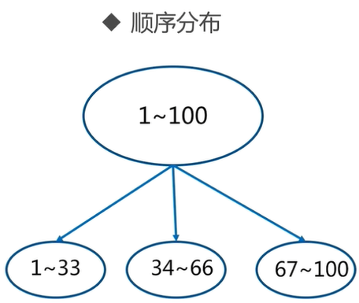

## redis sentinel选举流程

###### 	从节点选举

​	每个从节点，都根据自己对 master 复制数据的 offset，来设置一个选举时间，offset 越大（复制数据越多）的从节点，选举时间越靠前，优先进行选举。

​	所有的 master node 开始 slave 选举投票，给要进行选举的 slave 进行投票，如果大部分 master node`（N/2 + 1）`都投票给了某个从节点，那么选举通过，那个从节点可以切换成 master。

​	从节点执行主备切换，从节点切换为主节点。

详细流程：

- 1、某个节点认定master客观下线的节点后，该节点会先看看自己有没有投过票，如果自己已经投过票给其他节点了，在2倍故障转移的超时时间自己就不会成为Leader。相当于它是一个Follower。
- 2、如果该节点还没投过票，那么它就成为Candidate。
- 3、和Raft协议描述的一样，成为Candidate，Sentinel需要完成几件事情 
  - 1）更新故障转移状态为start
  - 2）当前epoch加1，相当于进入一个新term，在Sentinel中epoch就是Raft协议中的term。
  - 3）更新自己的超时时间为当前时间随机加上一段时间，随机时间为1s内的随机毫秒数。
  - 4）向其他节点发送`is-master-down-by-addr`命令请求投票。命令会带上自己的epoch。
  - 5）给自己投一票，在Sentinel中，投票的方式是把自己master结构体里的leader和leader_epoch改成投给的节点和它的epoch。
- 4、其他节点会收到Candidate的`is-master-down-by-addr`命令。如果节点当前epoch和Candidate传给他的epoch一样，说明他已经把自己master结构体里的leader和leader_epoch改成其他Candidate，相当于把票投给了其他Candidate。投过票给别的Sentinel后，在当前epoch内自己就只能成为Follower。
- 5、Candidate会不断的统计自己的票数，直到他发现认同他成为Leader的票数超过一半而且超过它配置的quorum（quorum可以参考[《redis sentinel设计与实现》](http://weizijun.cn/2015/04/30/redis sentinel 设计与实现/)）。Sentinel比Raft协议增加了quorum，这样一个Sentinel能否当选Leader还取决于它配置的quorum。
- 6、如果在一个选举时间内，Candidate没有获得超过一半且超过它配置的quorum的票数，自己的这次选举就失败了。
- 7、如果在一个epoch内，没有一个Candidate获得更多的票数。那么等待超过2倍故障转移的超时时间后，Candidate增加epoch重新投票。
- 8、如果某个Candidate获得超过一半且超过它配置的quorum的票数，那么它就成为了Leader。
- 9、与Raft协议不同，Leader并不会把自己成为Leader的消息发给其他节点。其他节点等待Leader从slave选出master后，检测到新的master正常工作后，就会去掉客观下线的标识，从而不需要进入故障转移流程。


## 集群

### 主从复制

单机的 Redis ，能够承载的 QPS 大概就在上万到几万不等。对于缓存来说，一般都是用来支撑读高并发的。因此架构做成 **主从(Master-Slave)架构** ，一主多从，主负责写，并且将数据复制到其它的 Slave 节点，从节点负责读。所有的读请求全部走从节点。这样也可以很轻松实现水平扩容，支撑读高并发。


Redis 默认采用异步方式复制数据到 Slave Node，同时 Slave Node 会周期性地确认自己每次复制的数据量：

1. 当 Master 和 Slave 网络连接顺畅时，Master 会持续向 Slave 推送命令，以保持在 Master 数据集合上执行的：客户端写、Key 过期、Key 淘汰等均在 Slave 数据集合上执行。
2. 当 Master 和 Slave 网络连接由于网络问题、超时等中断时， Slave 会尝试重连并进行连接断开期间的命令 **部分同步（partial resynchronization）**。
3. 当部分同步不可用时，Slave 会请求全量同步。在这个过程中，Master 会创建当前所有数据的镜像，发送给 Slave 并继续推送命令。

Redis 主从复制包含以下几个要点：

1. 一个 Master 可以有多个 Slave
2. Slave 支持级联结构，即 Slave 可以连接到其他 Slave 上
3. Redis 在复制过程中，不阻塞 Master ，不论是全量同步还是部分同步
4. 在大部分时间里，复制也不会阻塞 Slave 。当 Slave 在进行初始化同步时，Slave 会先使用旧的数据集提供服务。但当初始化同步完成时，会删除旧数据集，这时 Slave 会拒绝服务。
5. Redis 主从复制可以用来做水平扩容，以提供读写分离，或作为数据备份和高可用
6. 在主从复制的情况下，可以通过配置避免数据持久化，将 Slave 作为数据的备份或开启 Slave 的 AOF。但是这种情况下也会有风险：当 Master 重启后数据集将清空，这时如果 Slave 同步 Master 就会导致数据也被清空

#### 当 Master 不进行持久化如何保证数据安全

在生产环境中，强烈建议开启 Redis 持久化，不论是在 Master 还是在 Slave。如果由于磁盘速度等问题，不能开启持久化，那么需要 **避免 Redis 进程的自动重启**。

### 哨兵

`Sentinel` 是 Redis 官方推荐的 **高可用性( `HA` )解决方案**，当用 Redis 做主从复制的高可用方案时，假如 Master 宕机了， Redis 本身都没有实现自动进行主备切换，而哨兵本身也是一个独立运行的进程，它能监控多个节点，发现 Master 宕机后能进行自动切换。

它的主要功能有以下几点

- 集群监控：负责监控 Redis Master 和 Slave 进程是否正常工作。
- 消息通知：如果某个 Redis 实例有故障，那么哨兵负责发送消息作为报警通知给管理员。
- 故障转移：如果 Master node 挂掉了，会自动转移到 Slave node 上。
- 配置中心：如果故障转移发生了，通知 client 客户端新的 Master 地址。

#### 哨兵的核心知识

1. 哨兵至少需要 3 个实例，来保证自己的健壮性。
2. 哨兵 + Redis 主从的部署架构，是 **不保证数据零丢失** 的，只能保证 Redis 集群的高可用性。
3. 对于哨兵 + Redis 主从这种复杂的部署架构，尽量在测试环境和生产环境，都进行充足的测试和演练。
4. 哨兵的个数与集群节点个数无关，每个哨兵都会 Check 所有节点
5. 当启用哨兵后，客户端的连接是通过哨兵连接到 Node 的

哨兵集群必须部署 2 个以上节点，如果哨兵集群仅仅部署了 2 个哨兵实例，`Quorum` = 1。

```log
+----+         +----+
| M1 |---------| R1 |
| S1 |         | S2 |
+----+         +----+
```

如果 Master 宕机， `S1` 和 `S2` 中只要有 1 个哨兵认为 Master 宕机了，就可以进行切换，同时 `S1` 和 `S2` 会选举出一个哨兵来执行故障转移。但是同时这个时候，需要 `Majority` ，也就是超过半数的哨兵都是运行的。

如果此时仅仅是 `M1` 进程宕机了，哨兵 `s1` 正常运行，那么故障转移是 OK 的。但是如果是整个 `M1` 和 `S1` 运行的机器宕机了，那么哨兵只有 1 个，此时就没有 `Majority` 来允许执行故障转移，虽然另外一台机器上还有一个 R1，但是故障转移不会执行。

经典的 3 节点哨兵集群是这样的：

```log
       +----+
       | M1 |
       | S1 |
       +----+
          |
+----+    |    +----+
| R2 |----+----| R3 |
| S2 |         | S3 |
+----+         +----+
```

配置 `Quorum=2`，如果 `M1` 所在机器宕机了，那么三个哨兵还剩下 2 个， `S2` 和 `S3` 可以一致认为 Master 宕机了，然后选举出一个来执行故障转移，同时 3 个哨兵的 `Majority` 是 2，所以还剩下的 2 个哨兵运行着，就可以允许执行故障转移。

#### Slave 选主算法

如果一个 Master 被认为宕机，而且 `Majority` 数量的哨兵都允许主备切换，那么某个哨兵就会执行主备切换操作，此时首先要选举一个 Slave 来，会考虑 Slave 的一些信息：

- 跟 Master 断开连接的时长
- Slave 优先级
- 复制 offset
- run id

接下来会对 Slave 进行排序：

- 按照 Slave 优先级进行排序，Slave Priority 越低，优先级就越高。
- 如果 Slave Priority 相同，那么看 Replica Offset，哪个 Slave 复制了越多的数据，Offset 越靠后，优先级就越高。
- 如果上面两个条件都相同，那么选择一个 run id 比较小的那个 Slave。

### Redis Cluster

Redis Cluster 是一种服务器 `Sharding` 技术，提供内置的高可用支持，部分 master 不可用时，还可以继续工作。Redis Cluster 功能强大，直接集成了 **主从复制** 和 **哨兵** 的功能。

- **高性能**：在 Cluster 集群中没有代理，主从之间使用异步复制，并且不会对 Key 进行合并操作；
- **可接受的写入安全**：当客户端连接到 majority master 时集群尽最大努力保留所有客户端的写操作。通常情况下，在一小段窗口时间内写请求会被丢失，当客户端连接到 minority master 时这个窗口时间会很大；
- **可用性**：当 Redis Cluster 中大部分 master 是可达的，并且不可达 master 均有一个可用的 slave 时，Redis Cluster 能够在 `NODE_TIMEOUT` 时间后进行故障转移，使 Cluster 重新可用。此外，Cluster 还提供 **副本迁移（replicas migration）**，当 master 没有 slave 时，可从其他 master 下重新分配一个 slave ；

> majority master：能与大多数 master 连通的 master minority master：未能与大多数 master 连通的 master

#### 内部节点通信

在 Cluster 架构下，每个 Redis 都需要开启额外的端口来进行节点间通信，这种机制被称之为 **Cluster Bus**。

Redis 维护集群元数据采用 **gossip 协议**，所有节点都持有一份元数据，不同的节点如果出现了元数据的变更，就不断将元数据发送给其它的节点，让其它节点也进行元数据的变更。

gossip 好处在于，元数据的更新比较分散，不是集中在一个地方，更新请求会陆陆续续打到所有节点上去更新，降低了压力；不好在于，元数据的更新有延时，可能导致集群中的一些操作会有一些滞后。

#### 寻址算法

Redis Cluster 有固定的 16384 个 Hash Slot，对每个 key 计算 `CRC16` 值，然后对 `16384` 取模，可以获取 key 对应的 Hash Slot。Redis Cluster 中**每个 Master 都会持有部分 Slot**，Slot 的分配在 Cluster 未进行重配置（reconfiguration）时是稳定的。当 Cluster 稳定时，一个 Hash Slot 只在一个 master 上提供服务。不过一个 master 会有一个或多个 slave ，以在发生网络分区或故障时，替换 master。这些 slave 还可以缓解 master 的读请求的压力。

> 重配置：Hash Slot 从一个节点转移到另一个节点

Keys hash tags 可以破坏上述的分配规则，Hash tags 是一种保证多个键被分配到同一个槽位的方法。

#### 重定向

Redis Cluster 为了提高性能，不会提供代理，而是使用重定向的方式让 client 连接到正确的节点。

##### MOVED

Redis 客户端可以向集群的任意一个节点发送查询请求，节点接收到请求后会对其进行解析，如果是操作单个 key 的命令或者是包含多个在相同槽位 key 的命令，那么该节点就会去查找这个 key 是属于哪个槽位的。如果 key 所属的槽位由该节点提供服务，那么就直接返回结果。否则就会返回一个 `MOVED` 错误：

```log
GET x
-MOVED 3999 127.0.0.1:6381
```

这个错误包括了对应的 key 属于哪个槽位（3999）以及该槽位所在的节点的 IP 地址和端口号。client 收到这个错误信息后，就将这些信息存储起来以便可以更准确的找到正确的节点。

当客户端收到 `MOVED` 错误后，可以使用 `CLUSTER NODES` 或 `CLUSTER SLOTS` 命令来更新整个集群的信息，因为当重定向发生时，很少会是单个槽位的变更，一般都会是多个槽位一起更新。因此，在收到 `MOVED` 错误时，客户端应该尽早更新集群的分布信息。当集群达到稳定状态时，客户端保存的槽位和节点的对应信息都是正确的，cluster 的性能也会达到非常高效的状态。

##### ASK

对于 Redis Cluster 来讲， `MOVED` 重定向意味着请求的 slot 永久的由另一个节点提供服务，而 `ASK` 重定向仅代表将当前查询重定向到指定节点，不影响后续查询。在 Redis Cluster 迁移的时候会用到 ASK 重定向，下面看下 ASK 的处理流程：

1. Client 向节点 A 查询数据 `x`，A 发现数据 `x` 所在的 slot 状态为 `MIGRATING`，如果 `x` 存在则返回，否则返回 `ASK` 重定向；
2. Client 向 `ASK` 重定向节点 B 发送 `ASKING` ，再查询数据 `x`；
3. B 查找 `x` 发现其所在 slot 状态为 `IMPORTING`，则 B 会进行查询。若第二步未发送 `ASKING` ，则 B 会返回 `MOVED`命令，重定向到 A；

Redis Cluster 的迁移是以槽位单位的，一个槽位从节点 A 迁移到节点 B 需要经过以下步骤：

1. 节点 A 将待迁移 slot 设置为 `MIGRATING` 状态，将 B 节点 slot 设置为 `IMPORTING` 状态
2. A 获取 slot 中的 key，逐个调用 `MIGRATE` 命令
3. `MIGRATE` 会将特定的 key 从 A 迁移到 B，这个过程是原子操作（A、B均会进行加锁）

#### 容错能力

Redis Cluster和大多数集群一样，是通过心跳来判断一个节点是否存活的。心跳包的内容可以分为 header 和 gossip 消息两部分，其中header包含以下信息：

- NODE ID 节点在集群中的唯一标识
- currentEpoch 和 configEpoch 字段
- node flag，标识节点是 master 还是 slave ，另外还有一些其他的标识位
- 节点提供服务的 hash slot 的 bitmap
- 发送者的 TCP 端口
- 发送者认为的集群状态（down or ok）
- 如果是slave，则包含 master 的 NODE ID

gossip包含了该节点认为的其他节点的状态，不过不是集群的全部节点。具体有以下信息：

- NODE ID
- 节点的IP和端口
- NODE flags

##### 故障检测

故障检测用于识别集群中的不可达节点是否已下线，如果一个 master 下线，则会将它的 slave提 升为master。如果无法提升，则集群会处于错误状态。在 gossip 消息中，`NODE flags` 的值包括两种 PFAIL 和 FAIL。

如果一个节点发现另外一个节点不可达的时间超过 `NODE_TIMEOUT` ，则会将这个节点标记为 PFAIL，也就是 Possible failure。 PFAIL 标志只是一个节点本地的信息，为了使 slave 提升为 master ，需要将 PFAIL 升级为 FAIL 。当集群中大部分节点都将某个节点标记为 PFAIL 时，则可升级为 FAIL。

FAIL 状态是单向的，只能从 PFAIL 升级为 FAIL ，当节点重新可达时，可清除 FAIL 标记。


## 缓存机器增删如何对系统影响最小，一致性哈希的实现

> ​	全量数据，单机Redis节点无法满足要求，按照分区规则把数据分到若干个子集当中 
>
> **常用数据分布方式之顺序分布**
>
> ​	比如：1到100个数字，要保存在3个节点上，按照顺序分区，把数据平均分配三个节点上 1号到33号数据保存到节点1上，34号到66号数据保存到节点2上，67号到100号数据保存到节点3上 
>
> 
>
> **常用数据分布方式之哈希分布**
>
> ​	例如1到100个数字，对每个数字进行哈希运算，然后对每个数的哈希结果除以节点数进行取余，余数为1则保存在第1个节点上，余数为2则保存在第2个节点上，余数为0则保存在第3个节点，这样可以保证数据被打散，同时保证数据分布的比较均匀
>
> 
>
> 哈希分布方式分为三个分区方式： 
>
> *1 节点取余分区*
>
> ​	比如有100个数据，对每个数据进行hash运算之后，与节点数进行取余运算，根据余数不同保存在不同的节点上
>
> 节点取余方式优点：
>
> ​	客户端分片
> ​	配置简单：对数据进行哈希，然后取余
>
> 节点取余方式缺点：
>
> 	当增加或减少节点时，原来节点中的80%的数据会进行迁移操作，对所有数据重新进行分布
>
> 
>
> *2 一致性哈希分区*
>
> ​	将所有的数据当做一个token环，token环中的数据范围是0到2的32次方。然后为每一个数据节点分配一个token范围值，这个节点就负责保存这个范围内的数据。
>
> 
>
> ​	当服务器节点比较少的时候会出现一致性hash倾斜的问题，一个解决方法是多加机器，但是加机器是有成本的，那么就加虚拟节点。
>
> 
>
> ​	 ip1-1是ip1的虚拟节点，ip2-1是ip2的虚拟节点，ip3-1是ip3的虚拟节点 。
>
> 一致性哈希分区优点：
>
> ​	采用客户端分片方式：哈希 + 顺时针(优化取余)
> ​	节点伸缩时，只影响邻近节点，但是还是有数据迁移
>
> *3 虚拟槽分区*
>
> ​	虚拟槽分区是Redis Cluster采用的分区方式
>
> ​	预设虚拟槽，每个槽就相当于一个数字，有一定范围。每个槽映射一个数据子集，一般比节点数大
>
> > Redis Cluster中预设虚拟槽的范围为0到16383，把16384槽按照节点数量进行平均分配，由节点进行管理
>
> 
>
> 
>
> 1. ​	对每个key按照CRC16规则进行hash运算
> 2. ​	把hash结果对16383进行取余
> 3. ​	把余数发送给Redis节点
> 4. ​	节点接收到数据，验证是否在自己管理的槽编号的范围：如果在自己管理的槽编号范围内，则把数据保存到数据槽中，然后返回执行结果；如果在自己管理的槽编号范围外，则会把数据发送给正确的节点，由正确的节点来把数据保存在对应的槽中。
>
> ​	redis Cluster的节点之间会共享消息，每个节点都会知道是哪个节点负责哪个范围内的数据槽。
>
> ​	虚拟槽分布方式中，由于每个节点管理一部分数据槽，数据保存到数据槽中。当节点扩容或者缩容时，对数据槽进行重新分配迁移即可，数据不会丢失。
>
> ​	虚拟槽分区特点：
>
> - 使用服务端管理节点，槽，数据：例如Redis Cluster
> - 可以对数据打散，又可以保证数据分布均匀


###  **redis 集群模式的工作原理能说一下么？在集群模式下，redis 的 key 是如何寻址的？分布式寻址都有哪些算法？了解一致性 hash 算法吗？** 

​	在前几年，redis 如果要搞几个节点，每个节点存储一部分的数据，得**借助一些中间件**来实现，比如说有 `codis`，或者 `twemproxy`，都有。有一些 redis 中间件，你读写 redis 中间件，redis 中间件负责将你的数据分布式存储在多台机器上的 redis 实例中。

​	这两年，redis 不断在发展，redis 也不断有新的版本，现在的 redis 集群模式，可以做到在多台机器上，部署多个 redis 实例，每个实例存储一部分的数据，同时每个 redis 主实例可以挂 redis 从实例，自动确保说，如果 redis 主实例挂了，会自动切换到 redis 从实例上来。

​	现在 redis 的新版本，大家都是用 redis cluster 的，也就是 redis 原生支持的 redis 集群模式，那么面试官肯定会就 redis cluster 对你来个几连炮。要是你没用过 redis cluster，正常，以前很多人用 codis 之类的客户端来支持集群，但是起码你得研究一下 redis cluster 吧。

​	如果你的数据量很少，主要是承载高并发高性能的场景，比如你的缓存一般就几个 G，单机就足够了，可以使用 replication，一个 master 多个 slaves，要几个 slave 跟你要求的读吞吐量有关，然后自己搭建一个 sentinel 集群去保证 redis 主从架构的高可用性。

​	redis cluster，主要是针对**海量数据+高并发+高可用**的场景。redis cluster 支撑 N 个 redis master node，每个 master node 都可以挂载多个 slave node。这样整个 redis 就可以横向扩容了。如果你要支撑更大数据量的缓存，那就横向扩容更多的 master 节点，每个 master 节点就能存放更多的数据了。

###### redis cluster 介绍

- 自动将数据进行分片，每个 master 上放一部分数据

- 提供内置的高可用支持，部分 master 不可用时，还是可以继续工作的

  在 redis cluster 架构下，每个 redis 要放开两个端口号，比如一个是 6379，另外一个就是 加1w 的端口号，比如 16379。

  16379 端口号是用来进行节点间通信的，也就是 cluster bus 的东西，cluster bus 的通信，用来进行故障检测、配置更新、故障转移授权。cluster bus 用了另外一种二进制的协议，`gossip` 协议，用于节点间进行高效的数据交换，占用更少的网络带宽和处理时间。

##### 节点间的内部通信机制

###### 	基本通信原理

​	集群元数据的维护有两种方式：集中式、Gossip 协议。redis cluster 节点间采用 gossip 协议进行通信。

​	**集中式**是将集群元数据（节点信息、故障等等）几种存储在某个节点上。集中式元数据集中存储的一个典型代表，就是大数据领域的 `storm`。它是分布式的大数据实时计算引擎，是集中式的元数据存储的结构，底层基于 zookeeper（分布式协调的中间件）对所有元数据进行存储维护。


​	redis 维护集群元数据采用另一个方式， `gossip` 协议，所有节点都持有一份元数据，不同的节点如果出现了元数据的变更，就不断将元数据发送给其它的节点，让其它节点也进行元数据的变更。


​	**集中式**的**好处**在于，元数据的读取和更新，时效性非常好，一旦元数据出现了变更，就立即更新到集中式的存储中，其它节点读取的时候就可以感知到；**不好**在于，所有的元数据的更新压力全部集中在一个地方，可能会导致元数据的存储有压力。

​	gossip 好处在于，元数据的更新比较分散，不是集中在一个地方，更新请求会陆陆续续打到所有节点上去更新，降低了压力；不好在于，元数据的更新有延时，可能导致集群中的一些操作会有一些滞后。

- 10000 端口：每个节点都有一个专门用于节点间通信的端口，就是自己提供服务的端口号+10000，比如 7001，那么用于节点间通信的就是 17001 端口。每个节点每隔一段时间都会往另外几个节点发送 `ping` 消息，同时其它几个节点接收到 `ping` 之后返回 `pong`。
- 交换的信息：信息包括故障信息，节点的增加和删除，hash slot 信息等等。

###### gossip 协议

​	gossip 协议包含多种消息，包含 `ping`,`pong`,`meet`,`fail` 等等。

- meet：某个节点发送 meet 给新加入的节点，让新节点加入集群中，然后新节点就会开始与其它节点进行通信。

```bash
redis-trib.rb add-nodeCopy to clipboardErrorCopied
```

​	其实内部就是发送了一个 gossip meet 消息给新加入的节点，通知那个节点去加入我们的集群。

- ping：每个节点都会频繁给其它节点发送 ping，其中包含自己的状态还有自己维护的集群元数据，互相通过 ping 交换元数据。
- pong：返回 ping 和 meeet，包含自己的状态和其它信息，也用于信息广播和更新。
- fail：某个节点判断另一个节点 fail 之后，就发送 fail 给其它节点，通知其它节点说，某个节点宕机啦。

###### ping 消息深入

​	ping 时要携带一些元数据，如果很频繁，可能会加重网络负担。

​	每个节点每秒会执行 10 次 ping，每次会选择 5 个最久没有通信的其它节点。当然如果发现某个节点通信延时达到了 `cluster_node_timeout / 2`，那么立即发送 ping，避免数据交换延时过长，落后的时间太长了。比如说，两个节点之间都 10 分钟没有交换数据了，那么整个集群处于严重的元数据不一致的情况，就会有问题。所以 `cluster_node_timeout` 可以调节，如果调得比较大，那么会降低 ping 的频率。

​	每次 ping，会带上自己节点的信息，还有就是带上 1/10 其它节点的信息，发送出去，进行交换。至少包含 `3` 个其它节点的信息，最多包含 `总节点数减 2` 个其它节点的信息。

###### 分布式寻址算法

- hash 算法（大量缓存重建）
- 一致性 hash 算法（自动缓存迁移）+ 虚拟节点（自动负载均衡）
- redis cluster 的 hash slot 算法

###### hash 算法

​	来了一个 key，首先计算 hash 值，然后对节点数取模。然后打在不同的 master 节点上。一旦某一个 master 节点宕机，所有请求过来，都会基于最新的剩余 master 节点数去取模，尝试去取数据。这会导致**大部分的请求过来，全部无法拿到有效的缓存**，导致大量的流量涌入数据库。


##### 一致性 hash 算法

​	一致性 hash 算法将整个 hash 值空间组织成一个虚拟的圆环，整个空间按顺时针方向组织，下一步将各个 master 节点（使用服务器的 ip 或主机名）进行 hash。这样就能确定每个节点在其哈希环上的位置。

​	来了一个 key，首先计算 hash 值，并确定此数据在环上的位置，从此位置沿环**顺时针“行走”**，遇到的第一个 master 节点就是 key 所在位置。

​	在一致性哈希算法中，如果一个节点挂了，受影响的数据仅仅是此节点到环空间前一个节点（沿着逆时针方向行走遇到的第一个节点）之间的数据，其它不受影响。增加一个节点也同理。

​	当一致性哈希算法在节点太少时，容易因为节点分布不均匀而造成**缓存热点**的问题。为了解决这种热点问题，一致性 hash 算法引入了虚拟节点机制，即对每一个节点计算多个 hash，每个计算结果位置都放置一个虚拟节点。这样就实现了数据的均匀分布，负载均衡。


##### redis cluster 的 hash slot 算法

​	redis cluster 有固定的 `16384` 个 hash slot，对每个 `key` 计算 `CRC16` 值，然后对 `16384` 取模，可以获取 key 对应的 hash slot。

​	redis cluster 中每个 master 都会持有部分 slot，比如有 3 个 master，那么可能每个 master 持有 5000 多个 hash slot。hash slot 让 node 的增加和移除很简单，增加一个 master，就将其他 master 的 hash slot 移动部分过去，减少一个 master，就将它的 hash slot 移动到其他 master 上去。移动 hash slot 的成本是非常低的。客户端的 api，可以对指定的数据，让他们走同一个 hash slot，通过 `hash tag` 来实现。

​	任何一台机器宕机，另外两个节点，不影响的。因为 key 找的是 hash slot，不是机器。


###### redis cluster 的高可用与主备切换原理

​	redis cluster 的高可用的原理，几乎跟哨兵是类似的。

###### 	判断节点宕机

​	如果一个节点认为另外一个节点宕机，那么就是 `pfail`，**主观宕机**。如果多个节点都认为另外一个节点宕机了，那么就是 `fail`，**客观宕机**，跟哨兵的原理几乎一样，sdown，odown。

​	在 `cluster-node-timeout` 内，某个节点一直没有返回 `pong`，那么就被认为 `pfail`。

​	如果一个节点认为某个节点 `pfail` 了，那么会在 `gossip ping` 消息中，`ping` 给其他节点，如果**超过半数**的节点都认为 `pfail` 了，那么就会变成 `fail`。

###### 	从节点过滤

​	对宕机的 master node，从其所有的 slave node 中，选择一个切换成 master node。

​	检查每个 slave node 与 master node 断开连接的时间，如果超过了 `cluster-node-timeout * cluster-slave-validity-factor`，那么就**没有资格**切换成 `master`。

###### 	从节点选举

​	每个从节点，都根据自己对 master 复制数据的 offset，来设置一个选举时间，offset 越大（复制数据越多）的从节点，选举时间越靠前，优先进行选举。

​	所有的 master node 开始 slave 选举投票，给要进行选举的 slave 进行投票，如果大部分 master node`（N/2 + 1）`都投票给了某个从节点，那么选举通过，那个从节点可以切换成 master。

​	从节点执行主备切换，从节点切换为主节点。

###### 	与哨兵比较

​	整个流程跟哨兵相比，非常类似，所以说，redis cluster 功能强大，直接集成了 replication 和 sentinel 的功能。