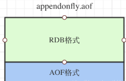
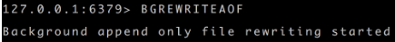
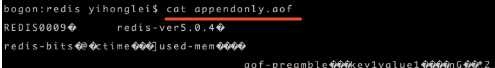
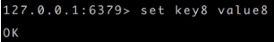
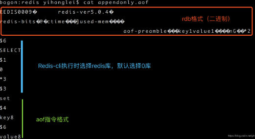

### Redis持久化的几种方式，优缺点是什么，怎么实现的

> RDB(Redis DataBase:在不同的时间点将 redis 的数据生成的快照同步到磁盘等介质上):内存到硬盘的快照，定期更新。缺点：耗时，耗性能(fork+io 操作)，易丢失数据。
>
> AOF(Append Only File：将 redis 所执行过的所有指令都记录下来，在下次 redis 重启时，只需要执行指令就可以了):
>
> 写日志。缺点：体积大，恢复速度慢。
>
> bgsave 做镜像全量持久化，aof 做增量持久化。因为 bgsave 会消耗比较长的时间，不够实时，在停机的时候会导致大量的数据丢失，需要 aof 来配合，在 redis 实例重启时，优先使用 aof 来恢复内存的状态，如果没有 aof 日志，就会使用 rdb 文件来恢复。
>
> Redis 会定期做aof 重写，压缩 aof 文件日志大小。Redis4.0 之后有了混合持久化的功能，将 bgsave 的全量和 aof 的增量做了融合处理，这样既保证了恢复的效率又兼顾了数据的安全性。bgsave 的原理，fork 和 cow, fork 是指 redis 通过创建子进程来进行 bgsave 操作，cow 指的是 copy onwrite，子进程创建后，父子进程共享数据段，父进程继续提供读写服务，写脏的页面数据会逐渐和子进程分离开来。

###  redis 的持久化有哪几种方式？不同的持久化机制都有什么优缺点？持久化机制具体底层是如何实现的？ 

​	持久化主要是做灾难恢复、数据恢复，也可以归类到高可用的一个环节中去，比如你 redis 整个挂了，然后 redis 就不可用了，你要做的事情就是让 redis 变得可用，尽快变得可用。

​	重启 redis，尽快让它对外提供服务，如果没做数据备份，这时候 redis 启动了，也不可用啊，数据都没了。

​	很可能说，大量的请求过来，缓存全部无法命中，在 redis 里根本找不到数据，这个时候就死定了，出现**缓存雪崩**问题。所有请求没有在 redis 命中，就会去 mysql 数据库这种数据源头中去找，一下子 mysql 承接高并发，然后就挂了...

​	如果你把 redis 持久化做好，备份和恢复方案做到企业级的程度，那么即使你的 redis 故障了，也可以通过备份数据，快速恢复，一旦恢复立即对外提供服务。

##### redis 持久化的两种方式

- RDB：RDB 持久化机制，是对 redis 中的数据执行**周期性**的持久化。

- AOF：AOF 机制对每条写入命令作为日志，以 `append-only` 的模式写入一个日志文件中，在 redis 重启的时候，可以通过**回放** AOF 日志中的写入指令来重新构建整个数据集。

  通过 RDB 或 AOF，都可以将 redis 内存中的数据给持久化到磁盘上面来，然后可以将这些数据备份到别的地方去，比如说阿里云等云服务。

  如果 redis 挂了，服务器上的内存和磁盘上的数据都丢了，可以从云服务上拷贝回来之前的数据，放到指定的目录中，然后重新启动 redis，redis 就会自动根据持久化数据文件中的数据，去恢复内存中的数据，继续对外提供服务。

  如果同时使用 RDB 和 AOF 两种持久化机制，那么在 redis 重启的时候，会使用 **AOF** 来重新构建数据，因为 AOF 中的**数据更加完整**。

###### RDB 优缺点

- RDB 会生成多个数据文件，每个数据文件都代表了某一个时刻中 redis 的数据，这种多个数据文件的方式，**非常适合做冷备**，可以将这种完整的数据文件发送到一些远程的安全存储上去，比如说 Amazon 的 S3 云服务上去，在国内可以是阿里云的 ODPS 分布式存储上，以预定好的备份策略来定期备份 redis 中的数据。
- RDB 对 redis 对外提供的读写服务，影响非常小，可以让 redis **保持高性能**，因为 redis 主进程只需要 fork 一个子进程，让子进程执行磁盘 IO 操作来进行 RDB 持久化即可。
- 相对于 AOF 持久化机制来说，直接基于 RDB 数据文件来重启和恢复 redis 进程，更加快速。
- 如果想要在 redis 故障时，尽可能少的丢失数据，那么 RDB 没有 AOF 好。一般来说，RDB 数据快照文件，都是每隔 5 分钟，或者更长时间生成一次，这个时候就得接受一旦 redis 进程宕机，那么会丢失最近 5 分钟的数据。
- RDB 每次在 fork 子进程来执行 RDB 快照数据文件生成的时候，如果数据文件特别大，可能会导致对客户端提供的服务暂停数毫秒，或者甚至数秒。

###### AOF 优缺点

- AOF 可以更好的保护数据不丢失，一般 AOF 会每隔 1 秒，通过一个后台线程执行一次`fsync`操作，最多丢失 1 秒钟的数据。
- AOF 日志文件以 `append-only` 模式写入，所以没有任何磁盘寻址的开销，写入性能非常高，而且文件不容易破损，即使文件尾部破损，也很容易修复。
- AOF 日志文件即使过大的时候，出现后台重写操作，也不会影响客户端的读写。因为在 `rewrite` log 的时候，会对其中的指令进行压缩，创建出一份需要恢复数据的最小日志出来。在创建新日志文件的时候，老的日志文件还是照常写入。当新的 merge 后的日志文件 ready 的时候，再交换新老日志文件即可。
- AOF 日志文件的命令通过非常可读的方式进行记录，这个特性非常**适合做灾难性的误删除的紧急恢复**。比如某人不小心用 `flushall` 命令清空了所有数据，只要这个时候后台 `rewrite` 还没有发生，那么就可以立即拷贝 AOF 文件，将最后一条 `flushall` 命令给删了，然后再将该 `AOF` 文件放回去，就可以通过恢复机制，自动恢复所有数据。
- 对于同一份数据来说，AOF 日志文件通常比 RDB 数据快照文件更大。
- AOF 开启后，支持的写 QPS 会比 RDB 支持的写 QPS 低，因为 AOF 一般会配置成每秒 `fsync` 一次日志文件，当然，每秒一次 `fsync`，性能也还是很高的。（如果实时写入，那么 QPS 会大降，redis 性能会大大降低）
- 以前 AOF 发生过 bug，就是通过 AOF 记录的日志，进行数据恢复的时候，没有恢复一模一样的数据出来。所以说，类似 AOF 这种较为复杂的基于命令日志 / merge / 回放的方式，比基于 RDB 每次持久化一份完整的数据快照文件的方式，更加脆弱一些，容易有 bug。不过 AOF 就是为了避免 rewrite 过程导致的 bug，因此每次 rewrite 并不是基于旧的指令日志进行 merge 的，而是**基于当时内存中的数据进行指令的重新构建**，这样健壮性会好很多。

###### RDB 和 AOF 到底该如何选择

- 不要仅仅使用 RDB，因为那样会导致你丢失很多数据；
- 也不要仅仅使用 AOF，因为那样有两个问题：第一，你通过 AOF 做冷备，没有 RDB 做冷备来的恢复速度更快；第二，RDB 每次简单粗暴生成数据快照，更加健壮，可以避免 AOF 这种复杂的备份和恢复机制的 bug；
- redis 支持同时开启开启两种持久化方式，我们可以综合使用 AOF 和 RDB 两种持久化机制，用 AOF 来保证数据不丢失，作为数据恢复的第一选择; 用 RDB 来做不同程度的冷备，在 AOF 文件都丢失或损坏不可用的时候，还可以使用 RDB 来进行快速的数据恢复。

## 持久化

### RDB

RDB 持久化机制，是对 Redis 中的数据执行周期性的持久化。

- RDB 会生成多个数据文件，每个数据文件都代表了某一个时刻中 Redis 的数据，**非常适合做冷备**
- RDB 对 Redis 对外提供的读写服务，影响非常小，可以让 Redis 保持高性能，因为 Redis 主进程只需要 fork 一个子进程，让子进程执行磁盘 IO 操作来进行 RDB 持久化即可。
- 相对于 AOF 持久化机制来说，直接基于 RDB 数据文件来重启和恢复 Redis 进程，更加快速。
- 一般来说，RDB 数据快照文件，都是每隔 5 分钟，或者更长时间生成一次，这个时候就得接受一旦 Redis 进程宕机，那么会丢失最近 5 分钟的数据。
- RDB 每次在 `fork` 子进程来执行 RDB 快照数据文件生成的时候，如果数据文件特别大，可能会导致对客户端提供的服务暂停数毫秒，或者甚至数秒。

### AOF

AOF 机制对每条写入命令作为日志，以 `append-only` 的模式写入一个日志文件中，在 Redis 重启的时候，可以通过回放 AOF 日志中的写入指令来重新构建整个数据集

- AOF 可以更好的保护数据不丢失，一般 AOF 会每隔 1 秒，通过一个后台线程执行一次 `fsync` 操作，最多丢失 1 秒钟的数据。
- AOF 日志文件以 `append-only` 模式写入，所以没有任何磁盘寻址的开销，写入性能非常高，而且文件不容易破损，即使文件尾部破损，也很容易修复。
- AOF 日志文件即使过大的时候，出现后台重写操作，也不会影响客户端的读写。因为在 **`rewrite log`** 的时候，会对其中的指令进行压缩，创建出一份需要恢复数据的最小日志出来。在创建新日志文件的时候，老的日志文件还是照常写入。当新的 `merge` 后的日志文件 `ready` 的时候，再交换新老日志文件即可。
- AOF 日志文件的命令通过非常可读的方式进行记录，这个特性非常 **适合做灾难性的误删除的紧急恢复**。比如某人不小心用 `flushall` 命令清空了所有数据，只要这个时候后台 `rewrite` 还没有发生，那么就可以立即拷贝 AOF 文件，将最后一条 `flushall` 命令给删了，然后再将该 AOF 文件放回去，就可以通过恢复机制，自动恢复所有数据。
- 对于同一份数据来说，AOF 日志文件通常比 RDB 数据快照文件更大。
- **AOF 开启后，支持的写 QPS 会比 RDB 支持的写 QPS 低**，因为 AOF 一般会配置成每秒 `fsync` 一次日志文件，当然，每秒一次 `fsync` ，性能也还是很高的。（如果实时写入，那么 QPS 会大降，Redis 性能会大大降低）
- 以前 AOF 发生过 bug，就是通过 AOF 记录的日志，进行数据恢复的时候，没有恢复一模一样的数据出来。所以说，类似 AOF 这种较为复杂的基于命令日志 / merge / 回放的方式，比基于 RDB 每次持久化一份完整的数据快照文件的方式，更加脆弱一些，容易有 bug。不过 AOF 就是为了避免 rewrite 过程导致的 bug，因此每次 rewrite 并不是基于旧的指令日志进行 merge 的，而是基于当时内存中的数据进行指令的重新构建，这样健壮性会好很多。

### RDB 和 AOF 到底该如何选择

1. 不要仅仅使用 RDB，因为那样会导致你丢失很多数据；
2. 也不要仅仅使用 AOF，因为那样有两个问题：第一，你通过 AOF 做冷备，没有 RDB 做冷备来的恢复速度更快；第二，RDB 每次简单粗暴生成数据快照，更加健壮，可以避免 AOF 这种复杂的备份和恢复机制的 bug；
3. Redis 支持同时开启开启两种持久化方式，我们可以综合使用 AOF 和 RDB 两种持久化机制，用 AOF 来保证数据不丢失，作为数据恢复的第一选择; 用 RDB 来做不同程度的冷备，在 AOF 文件都丢失或损坏不可用的时候，还可以使用 RDB 来进行快速的数据恢复。

**1.RDB优劣势**

**优势**：

  RDB只代表某个时间点上的数据快照，所以适用于备份与全量复制，如一天进行备份一次。
  Redis再加载RDB文件恢复数据远快于AOF文件
  性能上考虑RDB优于AOF，因为我们保存RDB文件只需fork一次子进程进行保存操作，父进程没有对磁盘I/O

**劣势**：

  RDB没办法做到实时的持久化数据，因为fork是重量级别的操作，频繁执行成本过高
  RDB需要经常fork子进程来保存数据集到磁盘，当数据集比较大额时候，fork的过程是比较耗时的，可能会导致redis在一些毫秒级不能响应客服端请求
  老版本的Redis无法兼容新版本的RDB文件

**2.AOF优劣势**

**优势**：

  通过配置同步策略基本能够达到实时持久化数据，如配置为everysec，则每秒同步一次AOF文件，也就是说最多丢失一秒钟的数据，兼顾了性能与数据的安全性
  AOF 文件是一个只进行追加操作的日志文件（append only log）， 因此对 AOF 文件的写入不需要进行 seek ， 即使日志因为某些原因而包含了未写入完整的命令（比如写入时磁盘已满，写入中途停机，等等）， redis-check-aof 工具也可以轻易地修复这种问题。

**劣势**：

  对于相同的数据集来说，AOF 文件的体积通常要大于 RDB 文件的体积。
  与AOF相比，在恢复大的数据时候，RDB方式更快一些

 

#### **混合持久化**

  重启Redis时，我们很少使用rdb来恢复内存状态，因为会丢失大量数据。我们通常使用AOF日志重写，但是AOF重写性能相对rdb来说要慢很多，这样在Redis实例很大的情况下，启动需要花费很长的时间。 

  Redis 4.0 为了解决这个问题，带来了一个新的持久化选项——混合持久化。

**1、混合持久化**

  AOF在进行文件重写(aof文件里可能有太多没用指令，所以aof会定期根据内存的最新数据生成aof文件)，将重写这一刻之前的内存rdb快照文件的内容 和 增量的AOF修改内存数据的命令日志文件存在一起，

  都写入新的aof文件，新的文件一开始不叫appendonly.aof，等到重写完新的AOF文件才会进行改名，原子性的覆盖原有的AOF文件，完成新旧两个AOF文件的替换。

  混合持久化文件结构：

**2、混合持久化配置**

  开启混合持久化：

>   aof-use-rdb-preamble yes  

  重启Redis服务。

**3、bgrewriteaof重写AOF**

  AOF根据配置规则在后台自动重写aof文件，也可以人为执行命令bgrewriteaof重写AOF。 于是在Redis重启的时候，可以先加载rdb的内容，然后再执行aof指令部分达到Redis数据重放的目的，重启效率因此大幅得到提升。

**4、实例验证**

  通过bgrewriteaof手动重写aof。

  查看appendonly.aof文件内容，看到rdb格式的二进制文件。

  再执行一条set命令。

  然后再看appendonly.aof文件内容。

  从文件格式可以看到，混合持久化appendonly.aof文件由rdb格式和aof指令格式两大部分组成。

  Redis在重启时，先重写rdb到内存，然后在重写aof到内存，重启效率高，还能减少数据的丢失。