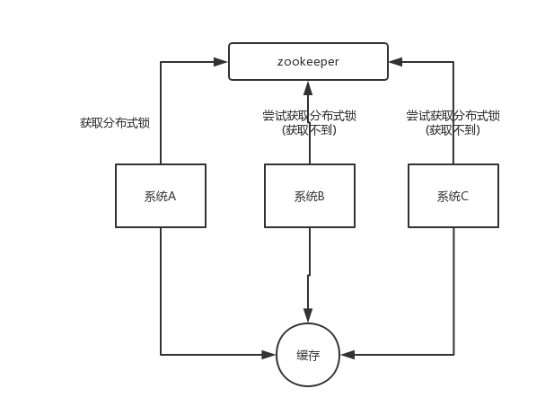

### 为什么要用缓存？

​	用缓存，主要有两个用途：**高性能**、**高并发**。

##### 	高性能

​	假设这么个场景，你有个操作，一个请求过来，吭哧吭哧你各种乱七八糟操作 mysql，半天查出来一个结果，耗时 600ms。但是这个结果可能接下来几个小时都不会变了，或者变了也可以不用立即反馈给用户。那么此时咋办？

​	缓存啊，折腾 600ms 查出来的结果，扔缓存里，一个 key 对应一个 value，下次再有人查，别走 mysql 折腾 600ms 了，直接从缓存里，通过一个 key 查出来一个 value，2ms 搞定。性能提升 300 倍。

​	就是说对于一些需要复杂操作耗时查出来的结果，且确定后面不怎么变化，但是有很多读请求，那么直接将查询出来的结果放在缓存中，后面直接读缓存就好。

##### 	高并发

​	mysql 这么重的数据库，压根儿设计不是让你玩儿高并发的，虽然也可以玩儿，但是天然支持不好。mysql 单机支撑到 `2000QPS` 也开始容易报警了。

​	所以要是你有个系统，高峰期一秒钟过来的请求有 1万，那一个 mysql 单机绝对会死掉。你这个时候就只能上缓存，把很多数据放缓存，别放 mysql。缓存功能简单，说白了就是 `key-value` 式操作，单机支撑的并发量轻松一秒几万十几万，支撑高并发 so easy。单机承载并发量是 mysql 单机的几十倍。

> 缓存是走内存的，内存天然就支撑高并发。

### 用了缓存之后会有什么不良后果？

​	常见的缓存问题有以下几个：

- [缓存与数据库双写不一致]
- [缓存雪崩、缓存穿透]
- [缓存并发竞争]

### 为什么redis需要把所有数据放到内存中?　

> ​	redis为了达到最快的读写速度将数据都读到内存中，并通过异步的方式将数据写入磁盘。所以redis具有快速和数据持久化的特征。如果不将数据放在内存中，磁盘I/O速度为严重影响redis的性能。在内存越来越便宜的今天，redis将会越来越受欢迎。

### 使用 Redis 做过异步队列吗，是如何实现的

> 使用 list 类型保存数据信息，rpush 生产消息，lpop 消费消息，当 lpop 没有消息时，可以 sleep 一段时间，然后再检查有没有信息，如果不想 sleep 的话，可以使用 blpop, 在没有信息的时候，会一直阻塞，直到信息的到来。redis 可以通过 pub/sub 主题订阅模式实现一个生产者，多个消费者，当然也存在一定的缺点，当消费者下线时，生产的消息会丢失。

### 说说 Redis 哈希槽的概念？

> Redis 集群没有使用一致性 hash,而是引入了哈希槽的概念，Redis 集群有 16384 个哈希槽，每个 key 通过 CRC16 校验后对 16384 取模来决定放置哪个槽，集群的每个节点负责一部分 hash 槽。

### 了解Redis事务的CAS操作吗

> 和众多其它数据库一样，Redis作为NoSQL数据库也同样提供了事务机制。在Redis中，MULTI/EXEC/DISCARD/WATCH这四个命令是我们实现事务的基石。
>
> **Redis中事务的实现特征**：
>
> 1. 在事务中的所有命令都将会被串行化的顺序执行，事务执行期间，Redis不会再为其它客户端的请求提供任何服务，从而保证了事物中的所有命令被原子的执行。
>
> 2. 和关系型数据库中的事务相比，在Redis事务中如果有某一条命令执行失败，其后的命令仍然会被继续执行。
>
> 3. 我们可以通过MULTI命令开启一个事务，有关系型数据库开发经验的人可以将其理解为"BEGIN TRANSACTION"语句。在该语句之后执行的命令都将被视为事务之内的操作，最后我们可以通过执行EXEC/DISCARD命令来提交/回滚该事务内的所有操作。这两个Redis命令可被视为等同于关系型数据库中的COMMIT/ROLLBACK语句。
>
> 4. 在事务开启之前，如果客户端与服务器之间出现通讯故障并导致网络断开，其后所有待执行的语句都将不会被服务器执行。然而如果网络中断事件是发生在客户端执行EXEC命令之后，那么该事务中的所有命令都会被服务器执行。
>
> 5. 当使用Append-Only模式时，Redis会通过调用系统函数write将该事务内的所有写操作在本次调用中全部写入磁盘。然而如果在写入的过程中出现系统崩溃，如电源故障导致的宕机，那么此时也许只有部分数据被写入到磁盘，而另外一部分数据却已经丢失。
>
> ****
>
> Redis服务器会在重新启动时执行一系列必要的一致性检测，一旦发现类似问题，就会立即退出并给出相应的错误提示。
>
> 此时，我们就要充分利用Redis工具包中提供的redis-check-aof工具，该工具可以帮助我们定位到数据不一致的错误，并将已经写入的部分数据进行回滚。修复之后我们就可以再次重新启动Redis服务器了。

###  redis 的并发竞争问题是什么？如何解决这个问题？了解 redis 事务的 CAS 方案吗？ 

​	某个时刻，多个系统实例都去更新某个 key。可以基于 zookeeper 实现分布式锁。每个系统通过 zookeeper 获取分布式锁，确保同一时间，只能有一个系统实例在操作某个 key，别人都不允许读和写。

​	你要写入缓存的数据，都是从 mysql 里查出来的，都得写入 mysql 中，写入 mysql 中的时候必须保存一个时间戳，从 mysql 查出来的时候，时间戳也查出来。

​	每次要**写之前，先判断**一下当前这个 value 的时间戳是否比缓存里的 value 的时间戳要新。如果是的话，那么可以写，否则，就不能用旧的数据覆盖新的数据。

### Redis的并发竞争问题如何解决

> ​	Redis为单进程单线程模式，采用队列模式将并发访问变为串行访问。Redis本身没有锁的概念，Redis对于多个客户端连接并不存在竞争，但是在Jedis客户端对Redis进行并发访问时会发生连接超时、数据转换错误、阻塞、客户端关闭连接等问题，这些问题均是由于客户端连接混乱造成。
>
> ​	对此有2种解决方法：
>
> 1.客户端角度，为保证每个客户端间正常有序与Redis进行通信，对连接进行池化，同时对客户端读写Redis操作采用内部锁synchronized。
>
> 2.服务器角度，利用setnx实现锁。
>
> *注：对于第一种，需要应用程序自己处理资源的同步，可以使用的方法比较通俗，可以使用synchronized也可以使用lock；第二种需要用到Redis的setnx命令，但是需要注意一些问题。*

### redis节点宕机如何处理

>   Redis的持久化机制来保证Redis的数据不会因为故障而丢失。
>
>   	Redis 的持久化机制有两种，第一种是快照，第二种是 AOF 日志。快照是一次全量备份，AOF 日志是连续的增量备份。快照是内存数据的二进制序列化形式，在存储上非常紧凑，而 AOF 日志记录的是内存数据修改的指令记录文本。AOF 日志在长期的运行过程中会变得无比庞大，数据库重启时需要加载 AOF 日志进行指令重放，这个时间就会无比漫长，所以需要定期进行 AOF 重写，给 AOF 日志进行瘦身。 
>
>   ###### 在主从模式下宕机要分为区分来看：
>
>   1. **slave从redis宕机**
>
>    在Redis中从库重新启动后会自动加入到主从架构中，自动完成同步数据；
>   ​ 如果从数据库实现了持久化，只要重新假如到主从架构中会实现增量同步。
>
>   2. **Master 宕机**
>
>    假如主从都没数据持久化，此时千万不要立马重启服务，否则可能会造成数据丢失，正确的操作如下：
>
>     - 在slave数据上执行SLAVEOF ON ONE,来断开主从关系并把slave升级为主库
>
>     - 此时重新启动主数据库，执行SLAVEOF,把它设置为从库，自动备份数据。
>       ​ 以上过程很容易配置错误，可以使用简单的方法：redis的哨兵（sentinel）的功能。
>
>   哨兵（sentinel）的原理：
>
>   ​	Redis提供了sentinel（哨兵）机制通过sentinel模式启动redis后，自动监控master/slave的运行状态，基本原理是：心跳机制+投票裁决。
>
>   ​	每个sentinel会向其它sentinal、master、slave定时发送消息，以确认对方是否“活”着，如果发现对方在指定时间（可配置）内未回应，则暂时认为对方已挂（所谓的“主观认为宕机” Subjective Down，简称SDOWN）。
>
>   ​	若"哨兵群"中的多数sentinel，都报告某一master没响应，系统才认为该master"彻底死亡"(即：客观上的真正down机，Objective Down，简称ODOWN)，通过一定的vote算法，从剩下的slave节点中，选一台提升为master，然后自动修改相关配置。

###  生产环境中的 redis 是怎么部署的？ 

​	redis cluster，10 台机器，5 台机器部署了 redis 主实例，另外 5 台机器部署了 redis 的从实例，每个主实例挂了一个从实例，5 个节点对外提供读写服务，每个节点的读写高峰qps可能可以达到每秒 5 万，5 台机器最多是 25 万读写请求/s。

​	机器是什么配置？32G 内存+ 8 核 CPU + 1T 磁盘，但是分配给 redis 进程的是10g内存，一般线上生产环境，redis 的内存尽量不要超过 10g，超过 10g 可能会有问题。

​	5 台机器对外提供读写，一共有 50g 内存。

​	因为每个主实例都挂了一个从实例，所以是高可用的，任何一个主实例宕机，都会自动故障迁移，redis 从实例会自动变成主实例继续提供读写服务。

​	你往内存里写的是什么数据？每条数据的大小是多少？商品数据，每条数据是 10kb。100 条数据是 1mb，10 万条数据是 1g。常驻内存的是 200 万条商品数据，占用内存是 20g，仅仅不到总内存的 50%。目前高峰期每秒就是 3500 左右的请求量。

​	其实大型的公司，会有基础架构的 team 负责缓存集群的运维。
