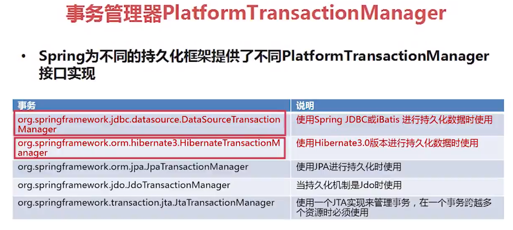
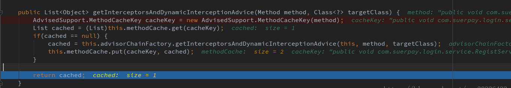

## 事务定义

  事务，就是一组操作数据库的动作集合。如果一组处理步骤或者全部发生或者一步也不执行，我们称该组处理步骤为一个事务。当所有的步骤像一个操作一样被完整地执行，我们称该事务被提交。由于其中的一部分或多步执行失败，导致没有步骤被提交，则事务必须回滚到最初的系统状态。

## 事务特点(ACID)

1.原子性：一个事务中所有对数据库的操作是一个不可分割的操作序列，要么全做要么全不做

2.一致性：事务执行前后过程中数据的完整性必须保持一致性

3.隔离性：多个用户并发访问数据库时，一个用户的事务的执行，不受其他用户事务的干扰，即并发执行的多个事务之间数据要相互隔离。

4.持久性：一个事物一旦提交，它对数据库的改变就是永久的。


## 事务管理器

  spring本身不管理事务，而是提供了多种事务管理器。它们将事务管理的工作委托给对应的持久化平台实现：



## 声明式事务

  spring中的声明式事务是通过事务属性去定义的。

  事务属性包含了5个方面：传播行为、隔离级别、回滚规则、事务超时、是否只读。


#### 传播行为

  当一个事务方法被另一个事务方法调用时，这个事务方法应该如何进行。

  例如：methodA事务方法调用methodB事务方法时，methodB是继续在调用者methodA的事务中运行呢，还是为自己开启一个新事务运行，这就是由methodB的事务传播行为决定的。

  Spring定义了七种传播行为：

　**PROPAGATION_REQUIRED** -- 支持当前事务，如果当前没有事务，就新建一个事务。这是最常见的选择。
　**PROPAGATION_SUPPORTS** -- 支持当前事务，如果当前没有事务，就以非事务方式执行。
　**PROPAGATION_MANDATORY** -- 支持当前事务，如果当前没有事务，就抛出异常。
　**PROPAGATION_REQUIRES_NEW** -- 新建事务，如果当前存在事务，把当前事务挂起。
　**PROPAGATION_NOT_SUPPORTED** -- 以非事务方式执行操作，如果当前存在事务，就把当前事务挂起。
　**PROPAGATION_NEVER** -- 以非事务方式执行，如果当前存在事务，则抛出异常。
　**PROPAGATION_NESTED**--如果当前存在事务，则在嵌套事务内执行。如果当前没有事务，就新建一个事务。嵌套的事务可以独立于当前存在的事务进行单独的提交或回滚，也就是出现异常时，可以选择某一个事务单独提交还是回滚操作。

  例如:

  有一个service1的方法 test1()中，调用了service2 的 test2方法 .如果test1 和 test2 方法都定义为 PROPAGATION_REQUIRED；

  在test1执行时，由于是PROPAGATION_REQUIRED 当前事务不存在，新建了一个事务；在 test2 执行时，由于也是 PROPAGATION_REQUIRED，则进入到了test1创建的事务中。

  因此，若test2中出现了异常，则不仅test2所作的操作将回滚，test1的操作也将回滚。

  

  **面试题：**

​    spring事务@Transactional在同一个类中的方法调用不生效。即有一个service 的方法 doTest()中，调用了 service 的 test1 方法。如果test1 方法定义为 PROPAGATION_REQUIRED；即使在test1() 中出现了异常，仍将不会出现回滚。

   spring的@Transactional事务生效的一个前提是进行方法调用前经过拦截器TransactionInterceptor，也就是说只有通过TransactionInterceptor拦截器的方法才会被加入到spring事务管理中，查看spring源码可以看到，在AdvisedSupport.getInterceptorsAndDynamicInterceptionAdvice方法中会从调用方法中获取@Transactional注解，如果有该注解，则启用事务，否则不启用。



  这个方法是通过spring的AOP类CglibAopProxy的内部类DynamicAdvisedInterceptor调用的，而DynamicAdvisedInterceptor继承了MethodInterceptor，用于拦截方法调用，并从中获取调用链。

  

  Spring采用动态代理(AOP)实现对bean的管理和切片，它为我们的每个class生成一个代理对象。只有在代理对象之间进行调用时，可以触发切面逻辑。

  而在同一个class中，方法B调用方法A，调用的是原对象的方法，而不通过代理对象。所以Spring无法切到这次调用，也就无法通过注解保证事务性了。

  也就是说 ，  如果是在同一个类中的方法调用，则不会被方法拦截器拦截到，因此事务不会起作用，必须将方法放入另一个类，并且该类通过spring注入。

  **简单来说，内部调用本类方法，不会再走代理了，所以有事务的方法的事务还是不起作用。**

  **解决办法**：要么将同一个类中无事务的 doTest 方法声明为 有事务，要么将doTest 无事务方法和 test1 有事务方法 拆分成两个类，要么直接在test1 有事务方法中 使用编程式事务。

  建议直接分成两个类比较好。


  **辨析：**

  示例代码：

```java
public void methodA() {
   service1.methodB();
   service2.methodC();
}


public void methodB() {
    // do something
}

public void methodC() {
    // do something
}
```


  方法之间的调用情况，可分为以下几种情况：

  1.methodA、methodB、methodC 方法均无事务，不存在提交回滚的说法。

  2.1.methodA 无事务、methodB 和 methodC 方法有事务，methodB 、methodC 和 methodA 不在同一个类。此时调用 methodA方法， methodB 和 methodC 将是独立的两个事务，不在同一个上下文中，提交和回滚 互不影响。

  2.2.methodA 无事务、methodB 和 methodC 方法有事务，但是 methodB 、methodC 和 methodA 在同一个类，此时，methodB 和 methodC 的事务将失效，此时也不存在提交和回滚的说法。若 methodB 或 methodC 中，谁和 methodA 不同类，谁的事务就会生效。

  3.1.methodA 有事务、methodB 和 methodC 方法有事务，methodB 、methodC 和 methodA 不在同一个类。此时按照 事务传播范围 规则进行辨析。

  3.2.methodA 有事务、methodB 和 methodC 方法有事务，但是 methodB 、methodC 和 methodA 在同一个类，此时，methodB 和 methodC 的事务将失效。

  4.methodA 有事务、methodB 和 methodC 方法没有事务，此时 methodB 和 methodC 出现异常均会导致 methodA 进行回滚操作。


#### 隔离级别

  隔离级别是指若干个并发的事务之间的隔离程度。

-   **ISOLATION_DEFAULT**--这是一个PlatfromTransactionManager默认的隔离级别：使用数据库默认的事务隔离级别（mysql默认为REPEATABLE_READ**，**oracle默认为READ_COMMITTED）；
-   **ISOLATION_READ_UNCOMMITTED**--这是事务最低的隔离级别，一个事务可以读取另一个事务读写但未提交的数据。这种隔离级别会产生脏读，不可重复读和幻像读。(脏读)
-   **ISOLATION_READ_COMMITTED**--保证一个事务修改的数据提交后才能被另外一个事务读取。另外一个事务不能读取该事务未提交的数据。这种事务隔离级别可以避免脏读出现，但是可能会出现不可重复读和幻像读。(不可重复读)
-   **ISOLATION_REPEATABLE_READ**--这种事务隔离级别可以防止脏读，不可重复读。但是可能出现幻像读。它除了保证一个事务不能读取另一个事务未提交的数据外，还保证了避免不可重复读。(幻读)
-   **ISOLATION_SERIALIZABLE**--这是花费最高代价但是最可靠的事务隔离级别。事务被处理为顺序执行。除了防止脏读，不可重复读外，还避免了幻像读。

> 1)幻读：事务1先读取1次记录，当事务2增加了某些记录并提交，此时事务1再次读取时发现第二次读取比第一次读取多了一些之前不存在的记录；
> 2)不可重复读：事务1先读取一次记录，当事务2更新了某些记录并提交，此时事务1再次读取时发现两次读取结果不一致；
> 3)脏读：事务1更新了记录，但没有提交，事务2读取到了事务1更新之后的记录，当事务T1回滚，则事务T2读取的数据无效。

  隔离级别主要是为了解决并发情况下，数据的一致性问题。因此可以看作是多个线程同时访问一个方法：

1.   ISOLATION_READ_UNCOMMITTED 就是什么都不做。 
2.   ISOLATION_READ_COMMITTED 一旦某个事务对某条记录进行了修改，在提交事务之前都将持有该条记录的行锁，不允许其他事务读取和修改。(只有修改才加锁)
3.   ISOLATION_REPEATABLE_READ 一旦某个事务对某条记录进行了修改，在提交事务之前都将持有该条记录的行锁，不允许其他事务读取和修改。 一旦某个事务对某条记录进行了读取，在提交事务之前也将持有该条记录的行锁，不允许其他事务读取和修改。（修改和读取都加锁）
4.   ISOLATION_SERIALIZABLE 规定事务的执行顺序，在前一个事务没有提交之前，下一个事务无法开始执行。


#### 回滚规则

  定义当遇到哪些异常就要进行回滚操作。默认情况，事务只有遇到运行时异常 RunTimeException 才会回滚，而遇到受检型异常时（如IOException、SQLException），则不会回滚。

  spring允许自定义回滚规则。因此，在声明事务时，可以声明当事务遇到特定的检查型异常时同样也会回滚，同样也可以声明在遇到某些特定异常不回滚，哪怕那个异常属于 运行时异常。


#### 事务超时

  定义一个事务执行的最大时间，可以防止某些事务长时间占用数据库资源，当事务运行超时，将自动回滚，而不是无限等待其运行结束为止。

  由于该超时时钟是在事务创建时才会启动，因此只有**PROPAGATION_REQUIRED、PROPAGATION_REQUIRES_NEW 、PROPAGATION_NESTED** 这3个能够在不存在事务时创建新事务的传播行为，考虑设置相应的事务超时时间，才是有意义的。


#### 是否只读

  如果事务只对数据库进行读取操作，数据库可以利用事务只读特性对其进行相应优化。由于该优化是在事务创建时数据库去实施的，因此只有**PROPAGATION_REQUIRED、PROPAGATION_REQUIRES_NEW 、PROPAGATION_NESTED** 这3个能够在不存在事务时创建新事务的传播行为，考虑设置为只读，才是有意义的。


## 在XML定义事务

```xml
<?xml version="1.0" encoding="UTF-8"?>
<beans xmlns="http://www.springframework.org/schema/beans"
       xmlns:xsi="http://www.w3.org/2001/XMLSchema-instance"
       xmlns:aop="http://www.springframework.org/schema/aop"
       xmlns:tx="http://www.springframework.org/schema/tx"
       xsi:schemaLocation="http://www.springframework.org/schema/beans
		http://www.springframework.org/schema/beans/spring-beans-4.3.xsd
		http://www.springframework.org/schema/aop
		http://www.springframework.org/schema/aop/spring-aop-4.3.xsd
    	http://www.springframework.org/schema/tx
    	http://www.springframework.org/schema/tx/spring-tx-4.3.xsd ">

<tx:advice id="txAdvice">
    <tx:attributes>
        <tx:method name="add*" rollback-for="java.lang.Exception" />
        <tx:method name="save*" rollback-for="java.lang.Exception" />
        <tx:method name="create*" rollback-for="java.lang.Exception" />
        <tx:method name="update*" rollback-for="java.lang.Exception" />
        <tx:method name="del*"  rollback-for="java.lang.Exception" />
        <tx:method name="init*" rollback-for="java.lang.Exception" />
        <tx:method name="do*" rollback-for="java.lang.Exception" />
        <tx:method name="*" read-only="true" />
    </tx:attributes>
</tx:advice>

<!-- （aop拦截,表示那些类需要事务管理）那些类的哪些方法参与事务，无须在方法前加@Transactional -->
<aop:config expose-proxy="true">
    <aop:pointcut id="serviceMethod" expression="execution(* com.core.service.*.*(..))" />
    <aop:advisor advice-ref="txAdvice" pointcut-ref="serviceMethod"/>
</aop:config>
</beans>
```


  tx 标签中相关属性：

1.   isolation：隔离级别。  取值：DEFAULT、READ_UNCOMMITTED、READ_COMMITTED、REPEATABLE_READ、SERIALIZABLE
2.   propagation：传播规则。  取值：REQUIRED、SUPPORTS、MANDATORY、REQUIRES_NEW、SUPPORTED、NEVER、NESTED
3.   read-only：是否只读  取值：true、false
4.   rollback-for：指定哪些异常回滚  eg：java.lang.Exception
5.   no-rollback-for：指定哪些异常将继续运行而不回滚  eg：java.lang.Exception
6.   timeout：事务超时时间(秒) 


## 使用注解定义事务

  在xml中，添加少量的配置：

```xml
<bean id="transactionManager"
class="org.springframework.jdbc.datasource.DataSourceTransactionManager"
p:dataSource-ref="dataSource"/>

<tx:annotation-driven transaction-manager="transactionManager"/>
```


  在需要事务管理的类上加[@Transactional](https://my.oschina.net/u/3770144) ，则表示该类的所有方法都拥有相同的事务属性；也可只在需要事务管理的方法上加@Transactional。 

  eg:

```java
@Transactional(propagation = Propagation.NESTED,isolation = Isolation.DEFAULT,readOnly = true,rollbackFor={java.lang.Exception.class},noRollbackFor = {java.sql.SQLException.class},timeout = 10)
public void test(){
   //...
}
```


  [@Transactional](https://my.oschina.net/u/3770144) 中相关属性：

1.   isolation：隔离级别。  取值：Isolation.DEFAULT、Isolation.READ_UNCOMMITTED、Isolation.READ_COMMITTED、Isolation.REPEATABLE_READ、Isolation.SERIALIZABLE
2.   propagation：传播规则。  取值：Propagation.REQUIRED、Propagation.SUPPORTS、Propagation.MANDATORY、Propagation.REQUIRES_NEW、Propagation.SUPPORTED、Propagation.NEVER、Propagation.NESTED
3.   readOnly：是否只读  取值：true、false
4.   rollbackFor：指定哪些异常回滚  eg：java.lang.Exception
5.   noRollbackFor：指定哪些异常将继续运行而不回滚  eg：java.lang.Exception
6.    timeout：事务超时时间(秒) 


#### **详解事务传播行为**

  什么叫事务传播行为？听起来挺高端的，其实很简单。 
  即然是传播，那么至少有两个东西，才可以发生传播。单体不存在传播这个行为。

  事务传播行为（propagation behavior）指的就是当一个事务方法被另一个事务方法调用时，这个事务方法应该如何进行。 
  例如：methodA事务方法调用methodB事务方法时，methodB是继续在调用者methodA的事务中运行呢，还是为自己开启一个新事务运行，这就是由methodB的事务传播行为决定的。

####   **Spring定义了七种传播行为：**

  现在来看看传播行为

  **1、PROPAGATION_REQUIRED**

  如果存在一个事务，则支持当前事务。如果没有事务则开启一个新的事务。 在这个场景下方法B用的是方法A产生的事务。 

  举例有两个方法：

```
@Transactional(propagation = Propagation.REQUIRED)
public void methodA() {
    service1.methodB();
    // do something
}

@Transactional(propagation = Propagation.REQUIRED)
public void methodB() {
    // do something
}
```

  单独调用methodB方法，因为当前上下文不存在事务，所以会开启一个新的事务。 

  若调用methodA方法，因为当前上下文不存在事务，所以会开启一个新的事务。当执行到methodB时，methodB发现当前上下文有事务，因此就加入到当前事务中来。


  **2、PROPAGATION_SUPPORTS**

  如果存在一个事务，支持当前事务。如果没有事务，则非事务的执行。 

  举例有两个方法：

```
@Transactional(propagation = Propagation.REQUIRED)
public void methodA() {
   service1.methodB();
   // do something
}

// 事务属性为SUPPORTS
@Transactional(propagation = Propagation.SUPPORTS)
public void methodB() {
    // do something
}
```

  单纯的调用methodB时，methodB方法是非事务的执行的。

  若调用methdA方法,methodB则加入了methodA的事务中,事务地执行。


  **3、PROPAGATION_MANDATORY**

  如果已经存在一个事务，支持当前事务。如果没有一个活动的事务，则抛出异常。

  举例有两个方法：

```
@Transactional(propagation = Propagation.REQUIRED)
public void methodA() {
   service1.methodB();
   // do something
}

// 事务属性为MANDATORY
@Transactional(propagation = Propagation.MANDATORY)
public void methodB() {
   // do something
}
```

  当单独调用methodB时，因为当前没有一个活动的事务，则会抛出异常throw new IllegalTransactionStateException(“Transaction propagation ‘mandatory’ but no existing transaction found”);

  当调用methodA时，methodB则加入到methodA的事务中，事务地执行。


  **4、PROPAGATION_REQUIRES_NEW**

  使用PROPAGATION_REQUIRES_NEW,需要使用 JtaTransactionManager作为事务管理器。 

  它会开启一个新的事务。如果一个事务已经存在，则先将这个存在的事务挂起。

  举例有两个方法：

```
@Transactional(propagation = Propagation.REQUIRED)
public void methodA() {
   doSomeThingA();
   service1.methodB();
   doSomeThingB();
   // do something else
}

// 事务属性为REQUIRES_NEW
@Transactional(propagation = Propagation.REQUIRES_NEW)
public void methodB() {
    // do something
}
```

  当调用 methodA()：

```
main{  
  methodA();
} 
```


  相当于调用：

```
main(){
  TransactionManager tm = null;
  try{
    //获得一个JTA事务管理器
    tm = getTransactionManager();
    tm.begin();//开启一个新的事务ts1
    Transaction ts1 = tm.getTransaction();
    doSomeThing();
    tm.suspend();//挂起当前事务ts1
    try{
      tm.begin();//开启第二个事务
      Transaction ts2 = tm.getTransaction();
      methodB();
      ts2.commit();//提交第二个事务
    } Catch(RunTimeException ex) {
      ts2.rollback();//回滚第二个事务
    } finally {
      //释放资源
    }
    //methodB执行完后，恢复第一个事务ts1
    tm.resume(ts1);
    doSomeThingB();
    ts1.commit();//提交第一个事务ts1
  } catch(RunTimeException ex) {
    ts1.rollback();//回滚第一个事务ts1
  } finally {
    //释放资源
  }
}
```


  在这里，我把ts1称为外层事务，ts2称为内层事务。从上面的代码可以看出，ts2与ts1是两个独立的事务，互不相干。

  Ts2是否成功并不依赖于 ts1。如果methodA方法在调用methodB方法后的doSomeThingB方法失败了，而methodB方法所做的结果依然被提交，除了 methodB之外的其它代码导致的结果会被回滚。

  **5、PROPAGATION_NOT_SUPPORTED**

  PROPAGATION_NOT_SUPPORTED 总是非事务地执行，并挂起任何存在的事务。使用PROPAGATION_NOT_SUPPORTED,也需要使用JtaTransactionManager作为事务管理器。 


  **6、PROPAGATION_NEVER**

  总是非事务地执行，如果存在一个活动事务，则抛出异常。


  **7、PROPAGATION_NESTED**

  如果一个活动的事务存在，则运行在一个嵌套的事务中。 如果没有活动事务, 则按 PROPAGATION_REQUIRED 属性执行(即开启一个新的事务)。 

  这是一个嵌套事务,使用JDBC 3.0驱动时,仅仅支持DataSourceTransactionManager作为事务管理器。 需要JDBC 驱动的java.sql.Savepoint类。使用PROPAGATION_NESTED，还需要把PlatformTransactionManager的nestedTransactionAllowed属性设为true(属性值默认为false)。

  关键在于：嵌套执行。

```
@Transactional(propagation = Propagation.REQUIRED)
public void methodA(){
     doSomeThingA();
     service1.methodB();
     doSomeThingB();
}

@Transactional(propagation = Propagation.NEWSTED)
public void methodB(){
     ……
}
```

  如果单独调用methodB方法，则按REQUIRED属性执行(开启一个新的事务)。如果调用methodA方法，相当于下面的效果：

```
main(){
  Connection con = null;
  Savepoint savepoint = null;
  try{
    con = getConnection();
    con.setAutoCommit(false);
    doSomeThingA();
    savepoint = con2.setSavepoint();//设置保存点
    try{
      methodB();
    } catch(RuntimeException ex) {
      con.rollback(savepoint);
    } finally {
      //释放资源
    }
    doSomeThingB();
    con.commit();
  } catch(RuntimeException ex) {
    con.rollback();
  } finally {
    //释放资源
  }
}
```


  当methodB方法调用之前，调用setSavepoint方法，保存当前的状态到savepoint。

  如果methodB方法调用失败，则恢复到之前保存的状态。但是需要注意的是，这时的事务并没有进行提交，如果后续的代码(doSomeThingB()方法)调用失败，则回滚包括methodB方法的所有操作。

  嵌套事务关键点：内层事务依赖于外层事务。外层事务失败时，会回滚内层事务所做的动作。而内层事务操作失败并不会引起外层事务的回滚。


  **PROPAGATION_NESTED 与PROPAGATION_REQUIRES_NEW的区别:**

  它们非常类似：如果不存在一个活动的事务，都会开启一个新的事务。 

- 使用 PROPAGATION_REQUIRES_NEW时，内层事务与外层事务就像两个独立的事务一样，一旦内层事务进行了提交后，外层事务不能对其进行回滚。两个事务互不影响。两个事务不是一个真正的嵌套事务。同时它需要JTA事务管理器的支持。
- 使用PROPAGATION_NESTED时，外层事务的回滚可以引起内层事务的回滚。而内层事务的异常并不会导致外层事务的回滚，它是一个真正的嵌套事务。DataSourceTransactionManager使用savepoint支持PROPAGATION_NESTED时，需要JDBC 3.0以上驱动及1.4以上的JDK版本支持。其它的JTATrasactionManager实现可能有不同的支持方式。
- PROPAGATION_REQUIRES_NEW 启动一个新的, 不依赖于环境的 “内部” 事务. 这个事务将被完全 commited 或 rolled back 而不依赖于外部事务, 它拥有自己的隔离范围, 自己的锁, 等等. 当内部事务开始执行时, 外部事务将被挂起, 内务事务结束时, 外部事务将继续执行。
- PROPAGATION_NESTED 开始一个 “嵌套的” 事务, 它是已经存在事务的一个真正的子事务. 潜套事务开始执行时, 它将取得一个 savepoint. 如果这个嵌套事务失败, 我们将回滚到此 savepoint. 潜套事务是外部事务的一部分, 只有外部事务结束后它才会被提交。

  **最大区别在于**：

​    PROPAGATION_REQUIRES_NEW 完全是一个新的事务, 而 PROPAGATION_NESTED 则是外部事务的子事务, 如果外部事务 commit, 嵌套事务也会被 commit, 如果外部事务 roll back, 嵌套事务也会被 roll back.