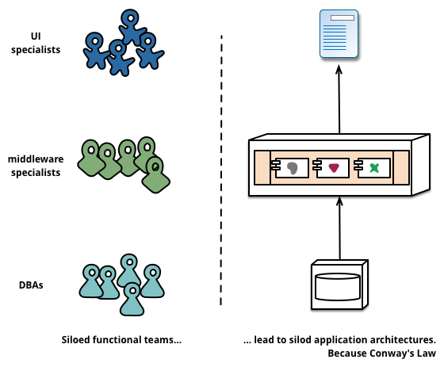
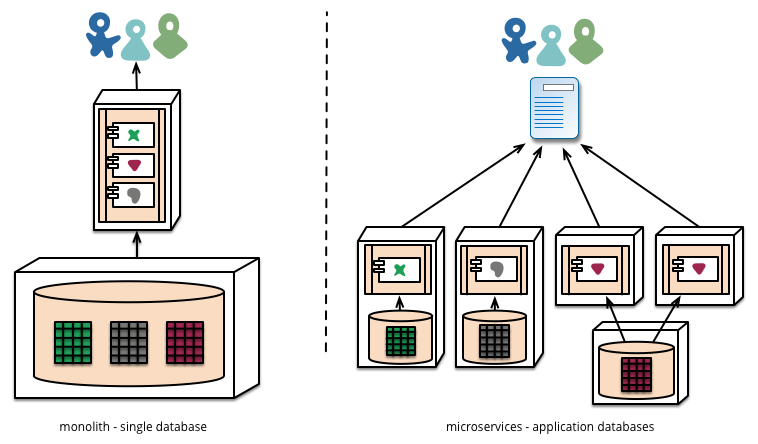
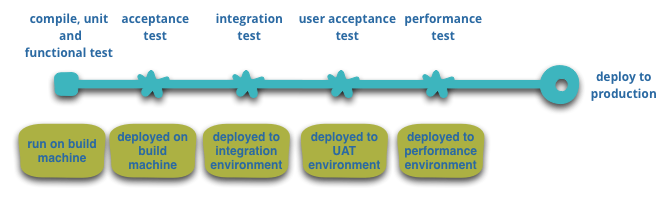
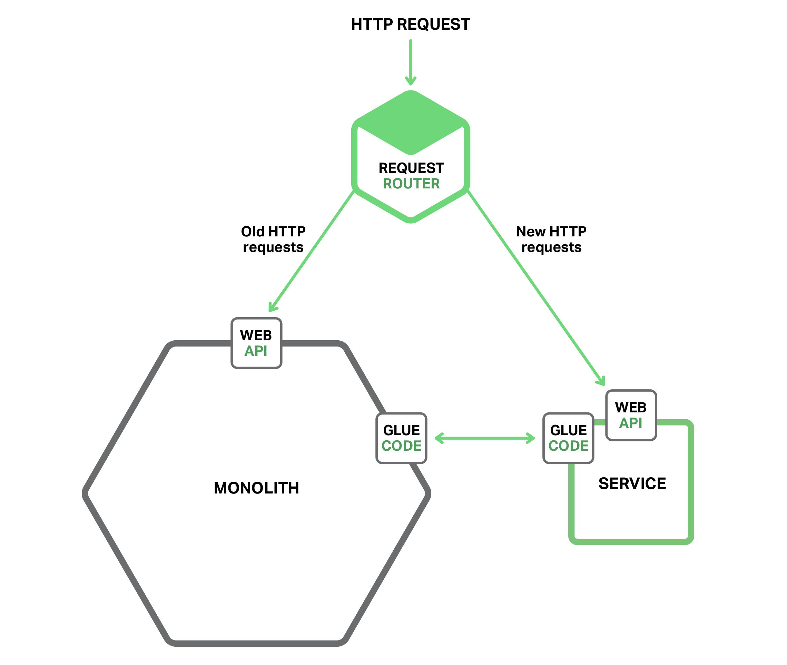
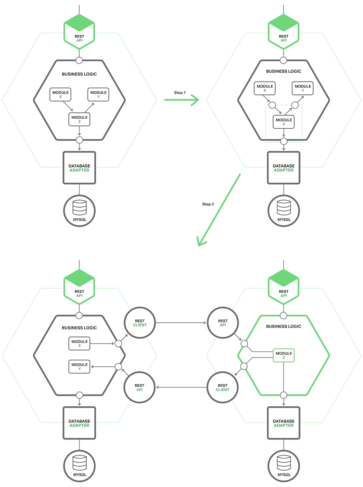
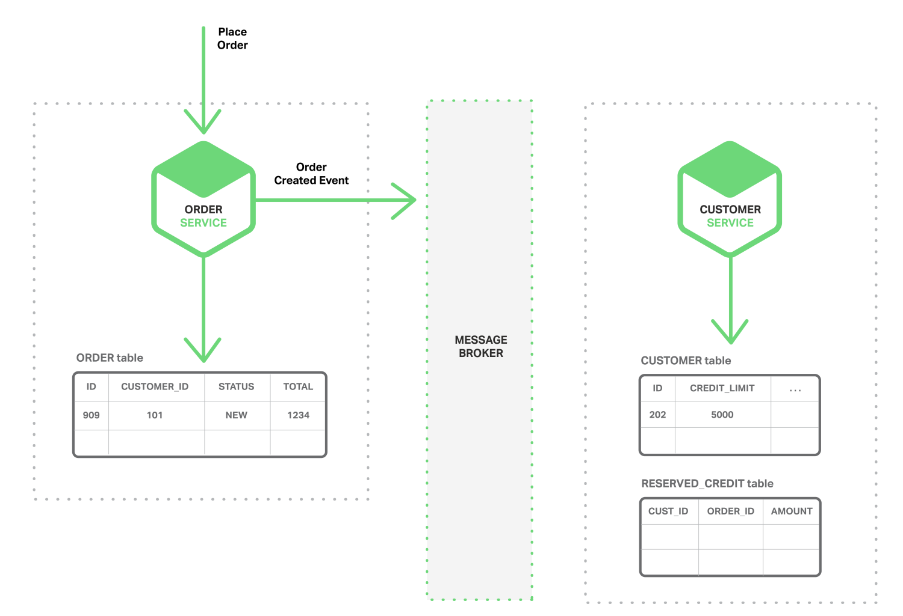
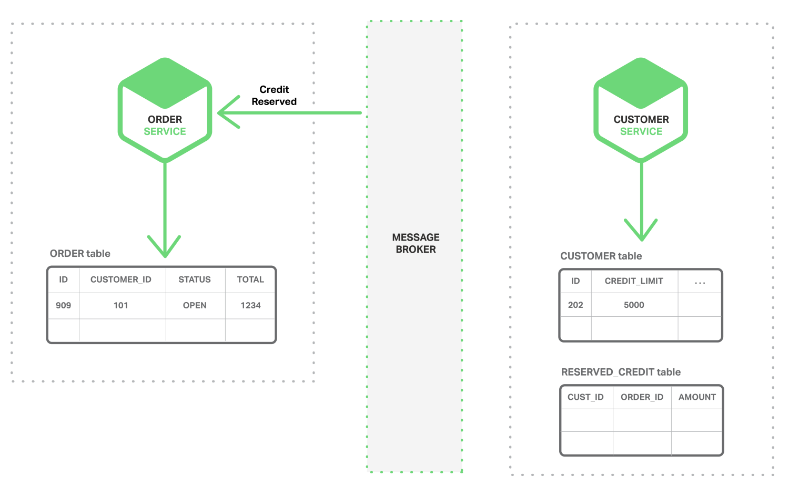

### [微服务架构的特征]

​	虽然不能说微服务架构风格有正式的定义，但我们可以尝试描述一下我们认为的在符合这个标签的架构中，它们所具有的一些共同特征。与概述共同特征的任何定义一样，并非所有微服务架构都具有所有特征，但我们确实期望大多数微服务架构都具有大多数特征。虽然我们的作者一直是这个相当宽松的社区的活跃成员，但我们的本意还是尝试描述我们两人在自己和自己所了解的团队的工作中所看到的情况。特别要说明的是，我们没有制定一些相关的定义。

###### 通过服务进行组件化

​	只要我们参与软件行业，就一直希望通过将组件集成在一起来构建系统，就像我们在物理世界中看到的事物的构建方式一样。在过去的几十年中，我们已经看到了大多数语言平台的公共软件库都取得了极大的进展。

​	在谈论组件时，就会碰到一个有关定义的难题，即什么是组件？我们的定义是，组件是可独立更换和升级的软件单元。

​	微服务架构也会使用软件库，但组件化软件的主要方式是拆分为多个服务。我们把库定义为链接到程序并使用内存函数调用来调用的组件，而服务是一种进程外组件，通过 Web 服务请求或远程过程调用等机制进行通信。（这与许多面向对象程序中的服务对象的概念是不同的[3]。）

​	将服务作为组件（而不是库）的一个主要原因是服务可以独立部署。如果你有一个应用程序[4]是由单一进程里的多个库组成，任何一个组件的更改都会导致整个应用程序的重新部署。但如果应用程序可拆分为多个服务，那么单个服务的变更只需要重新部署该服务即可。当然这也不是绝对的，一些服务接口的修改可能会导致多个服务之间的协同修改，但一个好的微服务架构的目的是通过内聚服务边界和服务协议的演进机制来最小化这些协同修改。

​	将服务用作组件的另一个结果是更明确的组件接口。大多数语言没有一个良好的机制来定义显式发布的接口。通常，它只是文档和规则来阻止客户端破坏组件的封装，这会导致组件之间过于紧耦合。通过使用显式远程调用机制，服务可以更轻松地避免这种情况。

​	像这样使用服务确实存在一些不好的地方。远程调用比进程内调用更昂贵，远程 API 需要设计成较粗的粒度，这通常更难以使用。如果你需要更改组件之间的职责分配，那么当你跨越进程边界时，这种组件行为的改动会更加难以实现。

​	近似地，我们可以把一个个服务映射为一个个运行时进程，但这仅仅是一个近似而已。一个服务可能包括多个始终一起开发和部署的进程，比如一个应用系统的进程和仅由该服务使用的数据库。

###### 围绕业务能力进行组织

​	在将大型应用程序拆分为多个部分时，管理层往往侧重于技术层面，从而导致 UI 团队、服务器端逻辑团队、数据库团队的划分。当团队按照这些方式分开时，即便是简单的更改也可能导致跨团队项目的时间和预算批准。一个聪明的团队将围绕这个进行优化，“两害相权取其轻”——只需将逻辑强制应用到他们可以访问的任何应用程序中。换句话说，逻辑无处不在。这是康威定律[5]的一个例子。

> 任何设计系统（广义上的）的组织都会产生一种设计，其结构是组织通信结构的副本。
> —— 梅尔文•康威，1967年



​	微服务采用不同的划分方式，它是围绕业务功能将系统拆分为多个服务 。这些服务为该业务领域采用广泛的软件实现，包括用户界面、持久化存储和任何外部协作。因此，团队是跨职能的，包括开发所需的全部技能：用户体验、数据库和项目管理。


​	以这种方式组建的一家公司是 [www.comparethemarket.com](http://www.comparethemarket.com/)。跨职能团队负责构建和运营每个产品，每个产品拆分为多个独立的服务，彼此通过消息总线来通信。

​	大型单体应用程序也可以围绕业务功能进行模块化，尽管这不是常见的情况。当然，我们会敦促构建单体应用系统的大型团队根据业务线来将自己分解为若干小团队。我们在这里看到的主要问题是，它们往往围绕太多的上下文进行组织。如果单体跨越了模块边界，对团队的个体成员来说，很难将它们装入短期的记忆中。此外，我们看到模块化生产线需要大量的规则来执行。服务组件所要求的更加明确的分离，使得它更容易保持团队边界清晰。

###### 是产品不是项目

​	我们看到的大多数应用程序开发工作都使用这样一个项目模式：目标是交付一些软件，然后就完工了。一旦完成后，软件将移交给维护组织，然后构建它的项目团队也随之解散了。

​	微服务支持者倾向于避免这种模式，而是认为团队应该负责产品的整个生命周期。对此一个共同的启示是亚马逊的 [“you build, you run it”](https://queue.acm.org/detail.cfm?id=1142065) 的概念，开发团队对生产中的软件负全部责任。这使开发者经常接触他们的软件在生产环境如何工作，并增加与他们的用户联系，因为他们必须承担至少部分的支持工作。

​	产品心态与业务能力的联系紧密相连。要持续关注软件如何帮助用户提升业务能力，而不是把软件看成是将要完成的一组功能。

​	没有理由说为什么这种方法不能用在单一应用程序上，但较小的服务粒度，使得它更容易在服务开发者和用户之间建立个人关系。

###### 智能端点和哑管

​	在不同进程之间建立通信时，我们已经看到许多产品和方法，都强调将大量的智能特性放入通信机制本身。一个很好的例子是企业服务总线（ESB），其中 ESB 产品通常包括用于消息路由、编排、转换和应用业务规则的复杂工具。

​	微服务社区倾向于采用另一种方法：智能端点和哑管。基于微服务构建的应用程序的目标是尽可能的解耦和尽可能的内聚——他们拥有自己的领域逻辑，他们的行为更像经典 UNIX 理念中的过滤器——接收请求，应用适当的逻辑并产生响应。使用简单的 REST 风格的协议来编排它们，而不是使用像 WS-Choreography 或者 BPEL 或者通过中心工具编制(orchestration)等复杂的协议。

​	最常用的两种协议是带有资源 API 的 HTTP 请求-响应和轻量级消息传递[8]。对第一种协议最好的表述是

> 本身就是 web，而不是隐藏在 web 的后面。
> ——[Ian Robinson](http://www.amazon.com/gp/product/0596805829?ie=UTF8&tag=martinfowlerc-20&linkCode=as2&camp=1789&creative=9325&creativeASIN=0596805829)

​	微服务团队使用的规则和协议，正是构建万维网的规则和协议(在更大程度上是 UNIX 的)。从开发者和运营人员的角度讲，通常使用的资源可以很容易的缓存。

​	第二种常用方法是在轻量级消息总线上传递消息。选择的基础设施是典型的哑的(哑在这里只充当消息路由器)——像 RabbitMQ 或 ZeroMQ 这样简单的实现仅仅提供一个可靠的异步交换结构 ——在服务里，智能特性仍旧存在于那些生产和消费诸多消息的各个端点中，即存在于各个服务中。

​	单体应用中，组件都在同一进程内执行，它们之间通过方法调用或函数调用通信。把单体变成微服务最大的问题在于通信模式的改变。一种幼稚的转换是从内存方法调用转变成 RPC，这导致频繁通信且性能不好。相反，你需要用粗粒度通信代替细粒度通信。

###### 去中心化的治理

​	集中治理的一个后果是单一技术平台的标准化发展趋势。经验表明，这种方法正在收缩 ——不是每个问题都是钉子，不是每个问题都是锤子。我们更喜欢使用正确的工具来完成工作，而单体应用程序在一定程度上可以利用语言的优势，这是不常见的。

​	把单体的组件分裂成服务，在构建这些服务时可以有自己的选择。你想使用 Node.js 开发一个简单的报告页面？去吧。用 C++ 实现一个特别粗糙的近乎实时的组件？好极了。你想换用一个更适合组件读操作数据的不同风格的数据库？我们有技术来重建它。

​	当然，仅仅因为你可以做些什么，而不意味着你应该这样做——但用这种方式划分系统意味着你可以选择。

​	团队在构建微服务时也更喜欢用不同的方法来达标。他们更喜欢生产有用的工具这种想法，而不是写在纸上的标准，这样其他开发者可以用这些工具解决他们所面临的相似的问题。有时，这些工具通常在实施中收获并与更广泛的群体共享，但不完全使用一个内部开源模型。现在 git 和 github 已经成为事实上的版本控制系统的选择，在内部开放源代码的实践也正变得越来越常见。

​	Netflix 是遵循这一理念的一个很好的例子。尤其是，以库的形式分享有用的且经过市场检验的代码，这激励其他开发者用类似的方式解决相似的问题，同时还为采用不同方法敞开了大门。共享库倾向于聚焦在数据存储、进程间通信和我们接下来要深入讨论的基础设施自动化的共性问题。

​	对于微服务社区来说，开销特别缺乏吸引力。这并不是说社区不重视服务合约。恰恰相反，因为他们有更多的合约。只是他们正在寻找不同的方式来管理这些合约。像 [Tolerant Reader](https://martinfowler.com/bliki/TolerantReader.html) 和 [Consumer-Driven Contracts](https://martinfowler.com/articles/consumerDrivenContracts.html) 这样的模式通常被用于微服务。这些援助服务合约在独立进化。执行消费者驱动的合约作为构建的一部分，增加了信心并对服务是否在运作提供了更快的反馈。事实上，我们知道澳大利亚的一个团队用消费者驱动的合约这种模式来驱动新业务的构建。他们使用简单的工具定义服务的合约。这已变成自动构建的一部分，即使新服务的代码还没写。服务仅在满足合约的时候才被创建出来 - 这是在构建新软件时避免 "YAGNI"[9] 困境的一个优雅的方法。围绕这些成长起来的技术和工具，通过减少服务间的临时耦合，限制了中心合约管理的需要。

​	也许去中心化治理的最高境界就是亚马逊广为流传的 build it/run it 理念。团队要对他们构建的软件的各方面负责，包括 7*24 小时的运营。这一级别的责任下放绝对是不规范的，但我们看到越来越多的公司让开发团队负起更多责任。Netflix 是采用这一理念的另一家公司[11]。每天凌晨 3 点被传呼机叫醒无疑是一个强有力的激励，使你在写代码时关注质量。这是关于尽可能远离传统的集中治理模式的一些想法。

###### 分散数据管理

​	数据管理的去中心化有许多不同的呈现方式。在最抽象的层面上，这意味着使系统间存在差异的世界概念模型。在整合一个大型企业时，客户的销售视图将不同于支持视图，这是一个常见的问题。客户的销售视图中的一些事情可能不会出现在支持视图中。它们确实可能有不同的属性和(更坏的)共同属性，这些共同属性在语义上有微妙的不同。

​	这个问题常见于应用程序之间，但也可能发生在应用程序内部，尤其当应用程序被划分成分离的组件时。一个有用的思维方式是[有界上下文](http://martinfowler.com/bliki/BoundedContext.html)(Bounded Context)内的领域驱动设计(Domain-Driven Design, DDD)理念。DDD 把一个复杂域划分成多个有界的上下文，并且映射出它们之间的关系。这个过程对单体架构和微服务架构都是有用的，但在服务和上下文边界间有天然的相关性，边界有助于澄清和加强分离，就像业务能力部分描述的那样。

​	和概念模型的去中心化决策一样，微服务也去中心化数据存储决策。虽然单体应用程序更喜欢单一的逻辑数据库做持久化存储，但企业往往倾向于一系列应用程序共用一个单一的数据库——这些决定是供应商授权许可的商业模式驱动的。微服务更倾向于让每个服务管理自己的数据库，或者同一数据库技术的不同实例，或完全不同的数据库系统 - 这就是所谓的[混合持久化](https://martinfowler.com/bliki/PolyglotPersistence.html)(Polyglot Persistence)。你可以在单体应用程序中使用混合持久化，但它更常出现在为服务里。



​	对跨微服务的数据来说，去中心化责任对管理升级有影响。处理更新的常用方法是在更新多个资源时使用事务来保证一致性。这个方法通常用在单体中。

​	像这样使用事务有助于一致性，但会产生显著地临时耦合，这在横跨多个服务时是有问题的。分布式事务是出了名的难以实现，因此微服务架构强调[服务间的无事务协作](http://www.eaipatterns.com/ramblings/18_starbucks.html)，对一致性可能只是最后一致性和通过补偿操作处理问题有明确的认知。

​	对很多开发团队来说，选择用这样的方式管理不一致性是一个新的挑战，但这通常与业务实践相匹配。通常业务处理一定程度的不一致，以快速响应需求，同时有某些类型的逆转过程来处理错误。这种权衡是值得的，只要修复错误的代价小于更大一致性下损失业务的代价。

###### 基建自动化

​	基础设施自动化技术在过去几年中发生了巨大变化——特别是云和 AWS 的发展降低了构建、部署和运行微服务的操作复杂性。

​	许多使用微服务构建的产品或系统都是由具有丰富的持续交付和持续集成经验的团队构建的。以这种方式构建软件的团队广泛使用基础设施自动化技术。如下面显示的构建管道所示。



​	由于这并不是一篇关于持续交付的文章，我们在这里只关注持续交付的几个关键特性。我们希望有尽可能多的信心确保我们的软件正常运行，因此我们进行了大量的**自动化测试**。想让软件达到“晋级”(Promotion)状态从而“推上”流水线，就意味着要在每一个新的环境中，对软件进行**自动化部署**。

​	一个单体应用程序可以非常愉快地通过这些环境构建、测试和推动。事实证明，一旦你为单体投入了自动化整体生产，那么部署更多的应用程序似乎不再那么可怕了。请记住，持续交付的目标之一就是让“部署”工作变得“枯燥”，所以无论是一个还是三个应用程序，只要部署工作依旧很“枯燥”，那么就没什么可担心的了[12]。

​	我们看到团队大量的基础设施自动化的另一个领域是在管理生产环境中的微服务。与我们上面的断言（只要部署很无聊）相比，单体和微服务之间没有太大的区别，但是每个部署的运行环境可能会截然不同。


###### 设计时为故障做好准备

​	使用服务作为组件的结果是，需要设计应用程序以便它们能够容忍服务的失败。如果服务提供者商不可用，任何服务呼叫都可能失败，客户必须尽可能优雅地对此做出响应。与单体设计相比，这是一个缺点，因为它这会引入额外的复杂性来处理它。结果是微服务团队不断反思服务失败是如何影响用户体验的。Netflix 的 [Simian Army](https://github.com/Netflix/SimianArmy) 能够引发服务甚至数据中心的故障在工作日发生故障，从而来测试应用程序的弹性和监控能力。

​	生产中的这种自动化测试足以让大多数运维团队兴奋得浑身颤栗，就像在一周的长假即将到来前一样。这并不是说单体架构风格不能构建先进的监控系统——只是根据我们的经验，这在单体系统中并不常见罢了。

​	由于服务可能随时发生故障，因此能够快速检测故障并在可能的情况下自动恢复服务就显得至关重要。微服务应用程序非常重视应用程序的实时监控，比如检查架构元素（数据库每秒获得多少请求）和业务相关度量（例如每分钟收到多少订单）。语义监控可以提供出现问题的早期预警系统，从而触发开发团队跟进和调查。

​	这对于微服务架构来说尤为重要，因为微服务偏好编排和事件写作，这会导致一些紧急状况。虽然许多权威人士对于偶然事件的价值持积极态度，但事实是，“突发行为”有时可能是一件坏事。监控至关重要，它能够快速发现不良紧急行为并进行修复。

​	单体系统也可以像微服务一样实现透明的监控——事实上，它们也应该如此。不同之处在于你必须能够知道在不同进程中运行的服务在何时断开了连接。对于同一过程中的库，这种透明性用处并不大。

​	微服务团队希望看到针对每个服务的复杂监控和日志记录，例如显示“运行/宕机”状态的仪表盘以及各种运维和业务相关的指标。有关断路器状态，当前吞吐量和延迟的详细信息也是我们在工作中经常遇到的其他例子。

###### 演化设计

​	微服务从业者通常有进化设计的背景，并把服务分解视为进一步的工具，使应用程序开发人员能够控制应用程序中的更改，而不会降低变更速度。变更控制并不一定意味着变更的减少——在正确的态度和工具的帮助下，你可以对软件进行频繁，快速且有良好控制的更改。

​	每当要试图将软件系统分解为组件时，你就会面临这样的决策，即如何进行拆分——我们决定拆分应用程序的原则是什么？组件的关键属性具有独立替换和可升级性的特点[13]——这意味着我们寻找这些点，想象如何在不影响其协作者的情况下重写组件。实际上，许多微服务组通过明确地期望许多服务被废弃而不是长期演变来进一步考虑这一点。

​	Guardian 网站是设计和构建成单体应用程序的一个很好的例子，但是它也在微服务方向上不断发展演化。原先的单体系统仍然是网站的核心，但他们更喜欢通过构建一些微服务 API 的方式来添加新的功能。这种方法对于本质上是临时的功能尤其方便，例如处理体育赛事的专用页面。网站的这一部分可以使用快速开发语言快速组合在一起，在赛事结束后立即删除。我们在金融机构看到过类似的方法，为市场机会增加新服务，并在几个月甚至几周后丢弃。

​	这种强调可替换性的特点，是模块化设计一般性原则的一个特例，即通过变化模式来驱动模块化的实现[14]。大家都愿意将那些同时发生变化的东西放在同一个模块，很少变化的系统模块应该与目前正在经历大量变动的系统处于不同的服务中。如果你发现自己反复更改两项服务，那就表明它们应该合并了。

​	将组件放入服务中可以为更细粒度的发布计划添加机会。对于单体来说，任何更改都需要完整构建和部署整个应用程序。但是，使用微服务，你只需要重新部署你修改的服务。这可以简化并加快发布过程。缺点是你必须担心一项服务的变化会打破其消费者。传统的集成方法是尝试使用版本控制来解决这个问题，但微服务世界中的偏好是仅仅把使用版本控制作为最后的手段。我们可以通过设计服务尽可能容忍服务提供者的变化来避免大量的版本控制。


### 微服务是未来吗？

​	我们写这篇文章的主要目的是解释微服务的主要思想和原则。通过花时间来做到这一点，我们清楚地认为微服务架构风格是一个重要的想法——在研发企业系统时，值得对它进行认真考虑。我们最近使用这种方式构建了几个系统，并且了解到其它团队也赞同这种风格。

​	我们了解到那些在某种程度上开创这种架构风格的先驱，包括亚马逊、Netflix、英国卫报、英国政府数字化服务中心、realestate.com.au、Forward 和 comparethemarket.com。2013 年的技术会议上充满了一些公司的例子，这些公司正在转向可以归类为微服务的公司，包括 Travis CI。此外，有很多组织长期以来一直在做我们称之为微服务的东西，但没有使用过这个名字。（通常这被标记为 SOA——尽管如我们所说，SOA 有许多相互矛盾的形式。[15]）

​	然而，尽管有这些积极的经验，但并不是说我们确信微服务是软件架构的未来发展方向。虽然到目前为止我们的经验与整体应用相比是积极的，但我们意识到没有足够的时间让我们做出充分完整的判断。

​	通常，架构决策所产生的真正效果，只有在该决策做出若干年后才能真正显现。我们已经看到由带着强烈的模块化愿望的优秀团队所做的一些项目，最终却构建出一个单体架构，并在几年之内不断腐化。许多人认为，如果使用微服务就不大可能出现这种腐化，因为服务的边界是明确的，而且难以随意搞乱。然而，对于那些开发时间足够长的各种系统，除非我们已经见识得足够多，否则我们无法真正评价微服务架构是如何成熟的。

​	有人觉得微服务或许很难成熟起来，这当然是有原因的。在组件化上所做的任何工作的成功与否，取决于软件与组件的匹配程度。准确地搞清楚某个组件的边界的位置应该出现在哪里，是一项困难的工作。进化设计承认难以对边界进行正确定位，所以它将工作的重点放到了易于对边界进行重构之上。但是当各个组件成为各个进行远程通信的服务后，比起在单一进程内进行各个软件库之间的调用，此时的重构就变得更加困难。跨越服务边界的代码移动就变得困难起来。接口的任何变化，都需要在其各个参与者之间进行协调。向后兼容的层次也需要被添加进来。测试也会变得更加复杂。

​	另一个问题是，如果这些组件不能干净利落地组合成一个系统，那么所做的一切工作，仅仅是将组件内的复杂性转移到组件之间的连接之上。这样做的后果，不仅仅是将复杂性搬了家，它还将复杂性转移到那些不再明确且难以控制的边界之上。当在观察一个小型且简单的组件内部时，人们很容易觉得事情已经变得更好了，然而他们却忽视了服务之间杂乱的连接。

​	最后，还有一个团队技能的因素。新技术往往会被技术更加过硬的团队所采用。对于技术更加过硬的团队而更有效的一项技术，不一定适用于一个技术略逊一筹的团队。我们已经看到大量这样的案例，那些技术略逊一筹的团队构建出了杂乱的单体架构。当这种杂乱发生到微服务身上时，会出现什么情况？这需要花时间来观察。一个糟糕的团队，总会构建一个糟糕的系统——在这种情况下，很难讲微服务究竟是减少了杂乱，还是让事情变得更糟。

​	我们听到的一个合理的论点是，你不应该从微服务架构开始，而是从整体开始，保持模块化，并在整体出现问题时将其拆分为微服务。（这个建议并不理想，因为好的进程内接口通常不是一个好的服务接口。）

​	所以我们谨慎乐观地写下这个。到目前为止，我们已经看到了足够多的微服务风格，觉得它可能是一条值得走的路。我们无法确定最终会在哪里结束，但软件开发的挑战之一是你只能根据你当前必须拥有的不完善信息做出决策。


### [迁移到微服务综述]

​	迁移单体式应用到微服务架构意味着一系列现代化过程，有点像这几代开发者一直在做的事情，实时上，当迁移时，我们可以重用一些想法。

​	一个策略是：不要大规模（big bang）重写代码（只有当你承担重建一套全新基于微服务的应用时候可以采用重写这种方法）。重写代码听起来很不错，但实际上充满了风险最终可能会失败，就如 Martin Fowler 所说：

> “the only thing a Big Bang rewrite guarantees is a Big Bang!”

​	相反，应该采取逐步迁移单体式应用的策略，通过逐步生成微服务新应用，与旧的单体式应用集成，随着时间推移，单体式应用在整个架构中比例逐渐下降直到消失或者成为微服务架构一部分。这个策略有点像在高速路上限速到 70 迈对车做维护，尽管有挑战，但是比起重写的风险小很多。

​	Martin Fowler 将这种现代化策略成为绞杀（Strangler）应用，名字来源于雨林中的绞杀藤（strangler vine），也叫绞杀榕 (strangler fig)。绞杀藤为了爬到森林顶端都要缠绕着大叔生长，一段时间后，树死了，留下树形藤。这种应用也使用同一种模式，围绕着传统应用开发了新型微服务应用，传统应用会渐渐退出舞台。

​	我们来看看其他可行策略。

###### 策略 1——停止挖掘

​	Law of Holes 是说当自己进洞就应该停止挖掘。对于单体式应用不可管理时这是最佳建议。换句话说，应该停止让单体式应用继续变大，也就是说当开发新功能时不应该为旧单体应用添加新代码，最佳方法应该是将新功能开发成独立微服务。如下图所示：



​	除了新服务和传统应用，还有两个模块，其一是请求路由器，负责处理入口（http）请求，有点像之前提到的 API 网关。路由器将新功能请求发送给新开发的服务，而将传统请求还发给单体式应用。

​	另外一个是胶水代码（glue code），将微服务和单体应用集成起来，微服务很少能独立存在，经常会访问单体应用的数据。胶水代码，可能在单体应用或者为服务或者二者兼而有之，负责数据整合。微服务通过胶水代码从单体应用中读写数据。

​	微服务有三种方式访问单体应用数据：

- 换气单体应用提供的远程 API
- 直接访问单体应用数据库
- 自己维护一份从单体应用中同步的数据

  胶水代码也被称为容灾层（anti-corruption layer），这是因为胶水代码保护微服务全新域模型免受传统单体应用域模型污染。胶水代码在这两种模型间提供翻译功能。术语 anti-corruption layer 第一次出现在 Eric Evans 撰写的必读书 *Domain Driven Design*，随后就被提炼为一篇白皮书。开发容灾层可能有点不是很重要，但却是避免单体式泥潭的必要部分。

  将新功能以轻量级微服务方式实现由很多优点，例如可以阻止单体应用变的更加无法管理。微服务本身可以开发、部署和独立扩展。采用微服务架构会给开发者带来不同的切身感受。

   然而，这方法并不解决任何单体式本身问题，为了解决单体式本身问题必须深入单体应用做出改变。我们来看看这么做的策略。

###### 策略 2——将前端和后端分离

​	减小单体式应用复杂度的策略是讲表现层和业务逻辑、数据访问层分开。典型的企业应用至少有三个不同元素构成：

1. 表现层——处理 HTTP 请求，要么响应一个 RESTAPI 请求，要么是提供一个基于 HTML 的图形接口。对于一个复杂用户接口应用，表现层经常是代码重要的部分。
2. 业务逻辑层——完成业务逻辑的应用核心。
3. 数据访问层——访问基础元素，例如数据库和消息代理。

   在表现层与业务数据访问层之间有清晰的隔离。业务层有由若干方面组成的粗粒度（coarse-grained）的 API，内部包含了业务逻辑元素。API 是可以将单体业务分割成两个更小应用的天然边界，其中一个应用是表现层，另外一个是业务和数据访问逻辑。分割后，表现逻辑应用远程调用业务逻辑应用，下图表示迁移前后架构不同：

​	单体应用这么分割有两个好处，其一使得应用两部分开发、部署和扩展各自独立，特别地，允许表现层开发者在用户界面上快速选择，进行 A/B 测试；其二，使得一些远程 API 可以被微服务调用。

​	然而，这种策略只是部分的解决方案。很可能应用的两部分之一或者全部都是不可管理的，因此需要使用第三种策略来消除剩余的单体架构。

###### 策略 3——抽出服务

​	第三种迁移策略就是从单体应用中抽取出某些模块成为独立微服务。每当抽取一个模块变成微服务，单体应用就变简单一些；一旦转换足够多的模块，单体应用本身已经不成为问题了，要么消失了，要么简单到成为一个服务。

###### 	排序那个模块应该被转成微服务

​	一个巨大的复杂单体应用由成十上百个模块构成，每个都是被抽取对象。决定第一个被抽取模块一般都是挑战，一般最好是从最容易抽取的模块开始，这会让开发者积累足够经验，这些经验可以为后续模块化工作带来巨大好处。

​	转换模块成为微服务一般很耗费时间，一般可以根据获益程度来排序，一般从经常变化模块开始会获益最大。一旦转换一个模块为微服务，就可以将其开发部署成独立模块，从而加速开发进程。

​	将资源消耗大户先抽取出来也是排序标准之一。例如，将内存数据库抽取出来成为一个微服务会非常有用，可以将其部署在大内存主机上。同样的，将对计算资源很敏感的算法应用抽取出来也是非常有益的，这种服务可以被部署在有很多 CPU 的主机上。通过将资源消耗模块转换成微服务，可以使得应用易于扩展。

​	查找现有粗粒度边界来决定哪个模块应该被抽取，也是很有益的，这使得移植工作更容易和简单。例如，只与其他应用异步同步消息的模块就是一个明显边界，可以很简单容易地将其转换为微服务。

###### 	如何抽取模块

​	抽取模块第一步就是定义好模块和单体应用之间粗粒度接口，由于单体应用需要微服务的数据，反之亦然，因此更像是一个双向 API。因为必须在负责依赖关系和细粒度接口模式之间做好平衡，因此开发这种 API 很有挑战性，尤其对使用域模型模式的业务逻辑层来说更具有挑战，因此经常需要改变代码来解决依赖性问题，如图所示：

​	一旦完成粗粒度接口，也就将此模块转换成独立微服务。为了实现，必须写代码使得单体应用和微服务之间通过使用进程间通信（IPC）机制的 API 来交换信息。如图所示迁移前后对比：



​	此例中，正在使用 Y 模块的 Z 模块是备选抽取模块，其元素正在被 X 模块使用，迁移第一步就是定义一套粗粒度 APIs，第一个接口应该是被 X 模块使用的内部接口，用于激活 Z 模块；第二个接口是被 Z 模块使用的外部接口，用于激活 Y 模块。

​	迁移第二步就是将模块转换成独立服务。内部和外部接口都使用基于 IPC 机制的代码，一般都会将 Z 模块整合成一个微服务基础框架，来出来割接过程中的问题，例如服务发现。

​	抽取完模块，也就可以开发、部署和扩展另外一个服务，此服务独立于单体应用和其它服务。可以从头写代码实现服务；这种情况下，将服务和单体应用整合的 API 代码成为容灾层，在两种域模型之间进行翻译工作。每抽取一个服务，就朝着微服务方向前进一步。随着时间推移，单体应用将会越来越简单，用户就可以增加更多独立的微服务。 将现有应用迁移成微服务架构的现代化应用，不应该通过从头重写代码方式实现，相反，应该通过逐步迁移的方式。有三种策略可以考虑：将新功能以微服务方式实现；将表现层与业务数据访问层分离；将现存模块抽取变成微服务。随着时间推移，微服务数量会增加，开发团队的弹性和效率将会大大增加。


### 微服务和分布式数据管理问题

​	单体式应用一般都会有一个关系型数据库，由此带来的好处是应用可以使用 ACID transactions，可以带来一些重要的操作特性：

1. 原子性 – 任何改变都是原子性的
2. 一致性 – 数据库状态一直是一致性的
3. 隔离性 – 即使交易并发执行，看起来也是串行的
4. Durable – 一旦交易提交了就不可回滚

   鉴于以上特性，应用可以简化为：开始一个交易，改变（插入，删除，更新）很多行，然后提交这些交易。

​	使用关系型数据库带来另外一个优势在于提供 SQL（功能强大，可声明的，表转化的查询语言）支持。用户可以非常容易通过查询将多个表的数据组合起来，RDBMS 查询调度器决定最佳实现方式，用户不需要担心例如如何访问数据库等底层问题。另外，因为所有应用的数据都在一个数据库中，很容易去查询。

​	然而，对于微服务架构来说，数据访问变得非常复杂，这是因为数据都是微服务私有的，唯一可访问的方式就是通过 API。这种打包数据访问方式使得微服务之间松耦合，并且彼此之间独立。如果多个服务访问同一个数据，schema 会更新访问时间，并在所有服务之间进行协调。

​	更甚于，不同的微服务经常使用不同的数据库。应用会产生各种不同数据，关系型数据库并不一定是最佳选择。某些场景，某个 NoSQL 数据库可能提供更方便的数据模型，提供更加的性能和可扩展性。例如，某个产生和查询字符串的应用采用例如 Elasticsearch 的字符搜索引擎。同样的，某个产生社交图片数据的应用可以采用图片数据库，例如，Neo4j ；因此，基于微服务的应用一般都使用 SQL 和 NoSQL 结合的数据库，也就是被称为 polyglot persistence 的方法。

​	分区的，polyglot-persistent 架构用于存储数据有许多优势，包括松耦合服务和更佳性能和可扩展性。然而，随之而来的则是分布式数据管理带来的挑战。

​	第一个挑战在于如何完成一笔交易的同时保持多个服务之间数据一致性。之所以会有这个问题，我们以一个在线 B2B 商店为例，客户服务维护包括客户的各种信息，例如 credit lines 。订单服务管理订单，需要验证某个新订单与客户的信用限制没有冲突。在单一式应用中，订单服务只需要使用 ACID 交易就可以检查可用信用和创建订单。

​	相反的，微服务架构下，订单和客户表分别是相对应服务的私有表，如下图所示：


​	订单服务不能直接访问客户表，只能通过客户服务发布的 API 来访问。订单服务也可以使用 distributed transactions, 也就是周知的两阶段提交 (2PC)。然而，2PC 在现在应用中不是可选性。根据 CAP 理论，必须在可用性（availability）和 ACID 一致性（consistency）之间做出选择，availability 一般是更好的选择。但是，许多现代科技，例如许多 NoSQL 数据库，并不支持 2PC。在服务和数据库之间维护数据一致性是非常根本的需求，因此我们需要找其他的方案。

​	第二个挑战是如何完成从多个服务中搜索数据。例如，设想应用需要显示客户和他的订单。如果订单服务提供 API 来接受用户订单信息，那么用户可以使用类应用型的 join 操作接收数据。应用从用户服务接受用户信息，从订单服务接受此用户订单。假设，订单服务只支持通过私有键（key）来查询订单（也许是在使用只支持基于主键接受的 NoSQL 数据库），此时，没有合适的方法来接收所需数据。

###### 事件驱动架构

​	对许多应用来说，这个解决方案就是使用事件驱动架构（event-driven architecture）。在这种架构中，当某件重要事情发生时，微服务会发布一个事件，例如更新一个业务实体。当订阅这些事件的微服务接收此事件时，就可以更新自己的业务实体，也可能会引发更多的时间发布。

​	可以使用事件来实现跨多服务的业务交易。交易一般由一系列步骤构成，每一步骤都由一个更新业务实体的微服务和发布激活下一步骤的事件构成。下图展现如何使用事件驱动方法，在创建订单时检查信用可用度，微服务通过消息代理（Messsage Broker）来交换事件。

​	订单服务创建一个带有 NEW 状态的 Order （订单），发布了一个 “Order Created Event（创建订单）” 的事件。



​	客户服务消费 Order Created Event 事件，为此订单预留信用，发布 “Credit Reserved Event（信用预留）” 事件。


​	订单服务消费 Credit Reserved Event ，改变订单的状态为 OPEN。



​	更复杂的场景可以引入更多步骤，例如在检查用户信用的同时预留库存等。

​	考虑到（a）每个服务原子性更新数据库和发布事件，然后，（b）消息代理确保事件传递至少一次，然后可以跨多个服务完成业务交易（此交易不是 ACID 交易）。这种模式提供弱确定性，例如最终一致性 eventual consistency。这种交易类型被称作 BASE model。

​	亦可以使用事件来维护不同微服务拥有数据预连接（pre-join）的实现视图。维护此视图的服务订阅相关事件并且更新视图。例如，客户订单视图更新服务（维护客户订单视图）会订阅由客户服务和订单服务发布的事件。


​	当客户订单视图更新服务收到客户或者订单事件，就会更新 客户订单视图数据集。可以使用文档数据库（例如 MongoDB）来实现客户订单视图，为每个用户存储一个文档。客户订单视图查询服务负责响应对客户以及最近订单（通过查询客户订单视图数据集）的查询。

​	事件驱动架构也是既有优点也有缺点，此架构可以使得交易跨多个服务且提供最终一致性，并且可以使应用维护最终视图；而缺点在于编程模式比 ACID 交易模式更加复杂：为了从应用层级失效中恢复，还需要完成补偿性交易，例如，如果信用检查不成功则必须取消订单；另外，应用必须应对不一致的数据，这是因为临时（in-flight）交易造成的改变是可见的，另外当应用读取未更新的最终视图时也会遇见数据不一致问题。另外一个缺点在于订阅者必须检测和忽略冗余事件。

###### 原子操作 Achieving Atomicity

​	事件驱动架构还会碰到数据库更新和发布事件原子性问题。例如，订单服务必须向 ORDER 表插入一行，然后发布 Order Created event，这两个操作需要原子性。如果更新数据库后，服务瘫了（crashes）造成事件未能发布，系统变成不一致状态。确保原子操作的标准方式是使用一个分布式交易，其中包括数据库和消息代理。然而，基于以上描述的 CAP 理论，这却并不是我们想要的。

###### 使用本地交易发布事件

​	获得原子性的一个方法是对发布事件应用采用 multi-step process involving only local transactions，技巧在于一个 EVENT 表，此表在存储业务实体数据库中起到消息列表功能。应用发起一个（本地）数据库交易，更新业务实体状态，向 EVENT 表中插入一个事件，然后提交此次交易。另外一个独立应用进程或者线程查询此 EVENT 表，向消息代理发布事件，然后使用本地交易标志此事件为已发布，如下图所示：


​	订单服务向 ORDER 表插入一行，然后向 EVENT 表中插入 Order Created event，事件发布线程或者进程查询 EVENT 表，请求未发布事件，发布他们，然后更新 EVENT 表标志此事件为已发布。

​	此方法也是优缺点都有。优点是可以确保事件发布不依赖于 2PC，应用发布业务层级事件而不需要推断他们发生了什么；而缺点在于此方法由于开发人员必须牢记发布事件，因此有可能出现错误。另外此方法对于某些使用 NoSQL 数据库的应用是个挑战，因为 NoSQL 本身交易和查询能力有限。

​	此方法因为应用采用了本地交易更新状态和发布事件而不需要 2PC，现在再看看另外一种应用简单更新状态获得原子性的方法。

###### 挖掘数据库交易日志

​	另外一种不需要 2PC 而获得线程或者进程发布事件原子性的方式就是挖掘数据库交易或者提交日志。应用更新数据库，在数据库交易日志中产生变化，交易日志挖掘进程或者线程读这些交易日志，将日志发布给消息代理。如下图所见：


​	此方法的例子如 LinkedIn Databus 项目，Databus 挖掘 Oracle 交易日志，根据变化发布事件，LinkedIn 使用 Databus 来保证系统内各记录之间的一致性。

​	另外的例子如：AWS 的 streams mechanism in AWS DynamoDB，是一个可管理的 NoSQL 数据库，一个 DynamoDB 流是由过去 24 小时对数据库表基于时序的变化（创建，更新和删除操作），应用可以从流中读取这些变化，然后以事件方式发布这些变化。

​	交易日志挖掘也是优缺点并存。优点是确保每次更新发布事件不依赖于 2PC。交易日志挖掘可以通过将发布事件和应用业务逻辑分离开得到简化；而主要缺点在于交易日志对不同数据库有不同格式，甚至不同数据库版本也有不同格式；而且很难从底层交易日志更新记录转换为高层业务事件。

​	交易日志挖掘方法通过应用直接更新数据库而不需要 2PC 介入。下面我们再看一种完全不同的方法：不需要更新只依赖事件的方法。

###### 使用事件源

​	Event sourcing （事件源）通过使用根本不同的事件中心方式来获得不需 2PC 的原子性，保证业务实体的一致性。 这种应用保存业务实体一系列状态改变事件，而不是存储实体现在的状态。应用可以通过重放事件来重建实体现在状态。只要业务实体发生变化，新事件就会添加到时间表中。因为保存事件是单一操作，因此肯定是原子性的。

​	为了理解事件源工作方式，考虑事件实体作为一个例子。传统方式中，每个订单映射为 ORDER 表中一行，例如在 ORDER_LINE_ITEM 表中。但是对于事件源方式，订单服务以事件状态改变方式存储一个订单：创建的，已批准的，已发货的，取消的；每个事件包括足够数据来重建订单状态。


​	事件是长期保存在事件数据库中，提供 API 添加和获取实体事件。事件存储跟之前描述的消息代理类似，提供 API 来订阅事件。事件存储将事件递送到所有感兴趣的订阅者，事件存储是事件驱动微服务架构的基干。

​	事件源方法有很多优点：解决了事件驱动架构关键问题，使得只要有状态变化就可以可靠地发布事件，也就解决了微服务架构中数据一致性问题。另外，因为是持久化事件而不是对象，也就避免了 object relational impedance mismatch problem。

​	数据源方法提供了 100%可靠的业务实体变化监控日志，使得获取任何时点实体状态成为可能。另外，事件源方法可以使得业务逻辑可以由事件交换的松耦合业务实体构成。这些优势使得单体应用移植到微服务架构变的相对容易。

​	事件源方法也有不少缺点，因为采用不同或者不太熟悉的变成模式，使得重新学习不太容易；事件存储只支持主键查询业务实体，必须使用 Command Query Responsibility Segregation (CQRS) 来完成查询业务，因此，应用必须处理最终一致数据。

###### 总结

​	在微服务架构中，每个微服务都有自己私有的数据集。不同微服务可能使用不同的 SQL 或者 NoSQL 数据库。尽管数据库架构有很强的优势，但是也面对数据分布式管理的挑战。第一个挑战就是如何在多服务之间维护业务交易一致性；第二个挑战是如何从多服务环境中获取一致性数据。

​	最佳解决办法是采用事件驱动架构。其中碰到的一个挑战是如何原子性的更新状态和发布事件。有几种方法可以解决此问题，包括将数据库视为消息队列、交易日志挖掘和事件源。


### [什么是微服务？微服务之间是如何独立通讯的？]

###### 什么是微服务

- 微服务架构是一个分布式系统, 按照业务进行划分成为不同的服务单元, 解决单体系统性能等不足。
- 微服务是一种架构风格，一个大型软件应用由多个服务单元组成。系统中的服务单元可以单独部署，各个服务单元之间是松耦合的。

> 微服务概念起源: [Microservices](https://martinfowler.com/articles/microservices.html)

### 微服务之间是如何独立通讯的

###### 同步

###### 	REST HTTP 协议

​	REST 请求在微服务中是最为常用的一种通讯方式, 它依赖于 HTTP\HTTPS 协议。RESTFUL 的特点是：

1. 每一个 URI 代表 1 种资源
2. 客户端使用 GET、POST、PUT、DELETE 4 个表示操作方式的动词对服务端资源进行操作: GET 用来获取资源, POST 用来新建资源(也可以用于更新资源), PUT 用来更新资源, DELETE 用来删除资源
3. 通过操作资源的表现形式来操作资源
4. 资源的表现形式是 XML 或者 HTML
5. 客户端与服务端之间的交互在请求之间是无状态的,从客户端到服务端的每个请求都必须包含理解请求所必需的信息

   举个例子，有一个服务方提供了如下接口：

```java
@RestController
@RequestMapping("/communication")
public class RestControllerDemo {
    @GetMapping("/hello")
    public String s() {
        return "hello";
    }
}Copy to clipboardErrorCopied
```

​	另外一个服务需要去调用该接口，调用方只需要根据 API 文档发送请求即可获取返回结果。

```java
@RestController
@RequestMapping("/demo")
public class RestDemo{
    @Autowired
    RestTemplate restTemplate;

    @GetMapping("/hello2")
    public String s2() {
        String forObject = restTemplate.getForObject("http://localhost:9013/communication/hello", String.class);
        return forObject;
    }
}Copy to clipboardErrorCopied
```

​	通过这样的方式可以实现服务之间的通讯。

###### RPC TCP协议

​	RPC(Remote Procedure Call)远程过程调用，简单的理解是一个节点请求另一个节点提供的服务。它的工作流程是这样的：

1. 执行客户端调用语句，传送参数
2. 调用本地系统发送网络消息
3. 消息传送到远程主机
4. 服务器得到消息并取得参数
5. 根据调用请求以及参数执行远程过程（服务）
6. 执行过程完毕，将结果返回服务器句柄
7. 服务器句柄返回结果，调用远程主机的系统网络服务发送结果
8. 消息传回本地主机
9. 客户端句柄由本地主机的网络服务接收消息
10. 客户端接收到调用语句返回的结果数据

   举个例子。

​	首先需要一个服务端：

```java
import java.io.IOException;
import java.io.ObjectInputStream;
import java.io.ObjectOutputStream;
import java.lang.reflect.Method;
import java.net.InetSocketAddress;
import java.net.ServerSocket;
import java.net.Socket;
import java.util.concurrent.ConcurrentHashMap;
import java.util.concurrent.ExecutorService;
import java.util.concurrent.Executors;

/**
 * RPC 服务端用来注册远程方法的接口和实现类
 * @Date: 2019-11-04
 */
public class RPCServer {
    private static ExecutorService executor = Executors.newFixedThreadPool(Runtime.getRuntime().availableProcessors());

    private static final ConcurrentHashMap<String, Class> serviceRegister = new ConcurrentHashMap<>();

    /**
     * 注册方法
     * @param service
     * @param impl
     */
    public void register(Class service, Class impl) {
        serviceRegister.put(service.getSimpleName(), impl);
    }

    /**
     * 启动方法
     * @param port
     */
    public void start(int port) {
        ServerSocket socket = null;
        try {
            socket = new ServerSocket();
            socket.bind(new InetSocketAddress(port));
            System.out.println("服务启动");
            System.out.println(serviceRegister);
            while (true) {
                executor.execute(new Task(socket.accept()));
            }
        } catch (Exception e) {
            e.printStackTrace();
        } finally {
            if (socket != null) {
                try {
                    socket.close();
                } catch (IOException e) {
                    e.printStackTrace();
                }
            }
        }
    }

    private static class Task implements Runnable {
        Socket client = null;

        public Task(Socket client) {
            this.client = client;
        }

        @Override
        public void run() {
            ObjectInputStream input = null;
            ObjectOutputStream output = null;
            try {
                input = new ObjectInputStream(client.getInputStream());
                // 按照顺序读取对方写过来的内容
                String serviceName = input.readUTF();
                String methodName = input.readUTF();
                Class<?>[] parameterTypes = (Class<?>[]) input.readObject();
                Object[] arguments = (Object[]) input.readObject();
                Class serviceClass = serviceRegister.get(serviceName);
                if (serviceClass == null) {
                    throw new ClassNotFoundException(serviceName + " 没有找到!");
                }
                Method method = serviceClass.getMethod(methodName, parameterTypes);
                Object result = method.invoke(serviceClass.newInstance(), arguments);

                output = new ObjectOutputStream(client.getOutputStream());
                output.writeObject(result);
            } catch (Exception e) {
                e.printStackTrace();

            } finally {
                try {
                    // 这里就不写 output!=null才关闭这个逻辑了
                    output.close();
                    input.close();
                    client.close();
                } catch (IOException e) {
                    e.printStackTrace();
                }

            }
        }
    }

}
Copy to clipboardErrorCopied
```

​	其次需要一个客户端：

```java
import java.io.ObjectInputStream;
import java.io.ObjectOutputStream;
import java.lang.reflect.InvocationHandler;
import java.lang.reflect.Method;
import java.lang.reflect.Proxy;
import java.net.InetSocketAddress;
import java.net.Socket;

/**
 * RPC 客户端
 * @Date: 2019-11-04
 */
public class RPCclient<T> {
    /**
     * 通过动态代理将参数发送过去到 RPCServer ,RPCserver 返回结果这个方法处理成为正确的实体
     */
    public static <T> T getRemoteProxyObj(final Class<T> service, final InetSocketAddress addr) {

        return (T) Proxy.newProxyInstance(service.getClassLoader(), new Class<?>[]{service}, new InvocationHandler() {
            @Override
            public Object invoke(Object proxy, Method method, Object[] args) throws Throwable {

                Socket socket = null;
                ObjectOutputStream out = null;
                ObjectInputStream input = null;
                try {
                    socket = new Socket();
                    socket.connect(addr);

                    // 将实体类,参数,发送给远程调用方
                    out = new ObjectOutputStream(socket.getOutputStream());
                    out.writeUTF(service.getSimpleName());
                    out.writeUTF(method.getName());
                    out.writeObject(method.getParameterTypes());
                    out.writeObject(args);

                    input = new ObjectInputStream(socket.getInputStream());
                    return input.readObject();
                } catch (Exception e) {
                    e.printStackTrace();
                } finally {
                    out.close();
                    input.close();
                    socket.close();
                }
                return null;
            }
        });

    }

}
Copy to clipboardErrorCopied
```

​	再来一个测试的远程方法。

```java
public interface Tinterface {
    String send(String msg);
}

public class TinterfaceImpl implements Tinterface {
    @Override
    public String send(String msg) {
        return "send message " + msg;
    }
}
Copy to clipboardErrorCopied
```

​	测试代码如下：

```java
import com.huifer.admin.rpc.Tinterface;
import com.huifer.admin.rpc.TinterfaceImpl;

import java.net.InetSocketAddress;

/**
 * @Date: 2019-11-04
 */
public class RunTest {
    public static void main(String[] args) {
        new Thread(new Runnable() {
            @Override
            public void run() {
                RPCServer rpcServer = new RPCServer();
                rpcServer.register(Tinterface.class, TinterfaceImpl.class);
                rpcServer.start(10000);
            }
        }).start();
        Tinterface tinterface = RPCclient.getRemoteProxyObj(Tinterface.class, new InetSocketAddress("localhost", 10000));
        System.out.println(tinterface.send("rpc 测试用例"));


    }
}
Copy to clipboardErrorCopied
```

​	输出 `send message rpc 测试用例`。

##### 异步

###### 消息中间件

> 常见的消息中间件有 Kafka、ActiveMQ、RabbitMQ、RocketMQ , 常见的协议有AMQP、MQTTP、STOMP、XMPP. 这里不对消息队列进行拓展了, 具体如何使用还是请移步官网.


### 微服务的优势与缺点：

> 微服务的优势：
>
> 1. 将一个复杂的业务拆分为若干小的业务，将复杂的业务简单化，新人只需要了解他所接管的服务的代码，减少了新人的学习成本。
> 2. 由于微服务是分布式服务，服务于服务之间没有任何耦合。微服务系统的微服务单元具有很强的横向拓展能力。
> 3. 服务于服务之间采用HTTP网络通信协议来通信，单个服务内部高度耦合，服务与服务之间完全独立，无耦合。这使得微服务可以采用任何的开发语言和技术来实现，提高开发效率、降低开发成本。
> 4. 微服务是按照业务进行拆分的，并有坚实的服务边界，若要重写某一业务代码，不需了解所以业务，重写简单。
> 5. 微服务的每个服务单元是独立部署的，即独立运行在某个进程中，微服务的修改和部署对其他服务没有影响。
> 6. 微服务在CAP理论中采用的AP架构，具有高可用分区容错特点。高可用主要体现在系统7x24不间断服务，他要求系统有大量的服务器集群，从而提高系统的负载能力。分区容错也使得系统更加健壮。
>
> 微服务的不足：
>
> 1. 微服务的复杂度：构建一个微服务比较复杂，服务与服务之间通过HTTP协议或其他消息传递机制通信，开发者要选出最佳的通信机制，并解决网络服务差时带来的风险。
> 2. 分布式事务：将事务分成多阶段提交，如果一阶段某一节点失败仍会导致数据不正确。如果事务涉及的节点很多，某一节点的网络出现异常会导致整个事务处于阻塞状态，大大降低数据库的性能。
> 3. 服务划分：将一个完整的系统拆分成很多个服务，是一件非常困难的事，因为这涉及了具体的业务场景。