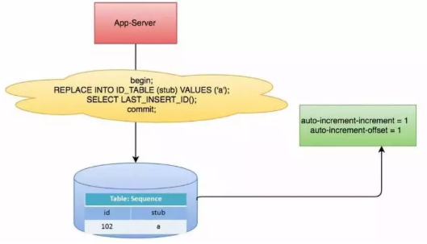

### 分布式集群下如何做到唯一序列号

> **全局唯一ID的特点** 
>
> 全局唯一性：不能出现重复的ID号，既然是唯一标识，这是最基本的要求；
>
> 趋势递增：在MySQL InnoDB引擎中使用的是聚集索引，由于多数RDBMS使用B-tree的数据结构来存储索引数据，在主键的选择上面我们应该尽量使用有序的主键保证写入性能。
>
> 单调递增：保证下一个ID一定大于上一个ID，例如事务版本号、IM增量消息、排序等特殊需求。
>
> 信息安全：如果ID是连续的，恶意用户的扒取工作就非常容易做了，直接按照顺序下载指定URL即可；如果是订单号就更危险了，竞对可以直接知道我们一天的单量。所以在一些应用场景下，会需要ID无规则、不规则。
>
> 高可用性：同时除了对ID号码自身的要求，业务还对ID号生成系统的可用性要求极高，想象一下，如果ID生成系统瘫痪，这就会带来一场灾难。所以不能有单点故障。
>
> 分片支持：可以控制ShardingId。比如某一个用户的文章要放在同一个分片内，这样查询效率高，修改也容易。•长度适中
>
> 由此总结下一个ID生成系统应该做到如下几点：
>
> 1.平均延迟和TP999延迟都要尽可能低；
>
> 2.可用性5个9；
>
> 3.高QPS。
>
> 
>
> ###### 1 UUID生成
>
> ​	UUID (Universally Unique Identifier) 的目的，是让分布式系统中的所有元素，都能有唯一的辨识，而不需要透过中央控制端来做辨识资讯的指定。如此一来，每个人都可以建立不与其它人冲突的 UUID。在这样的情况下，就不需考虑数据库建立时的名称重复问题。
>
> ​	UUID的标准形式包含32个16进制数字，以连字号分为五段，形式为8-4-4-4-12的36个字符，示例：550e8400-e29b-41d4-a716-446655440000，到目前为止业界一共有5种方式生成UUID，详情见IETF发布的UUID规范 A Universally Unique IDentifier (UUID) URN Namespace。
>
> 在Java中我们可以直接使用下面的API生成UUID。
>
> ```java
> UUID uuid  =  UUID.randomUUID(); 
> String s = UUID.randomUUID().toString();
> ```
>
> 优点：
>
> 性能非常高：本地生成，API调用方便，没有网络消耗。
>
> 缺点：
>
> 存储成本高：UUID太长，16字节128位，通常以36长度的字符串表示，很多场景不适用。
>
> 信息不安全：基于MAC地址生成UUID的算法可能会造成MAC地址泄露，这个漏洞曾被用于寻找梅丽莎病毒的制作者位置。
>
> ID作为主键时在特定的环境会存在一些问题，比如做DB主键的场景下，UUID就非常不适用。UUID不是趋势递增的，而现阶段主流的数据库主键索引都是选用的B+树索引，对于无序长度过长的主键插入效率比较低。
>
> ###### 2 数据库生成
>
> ```
> 以MySQL举例，利用给字段设置 auto_increment_increment 和 auto_increment_offset 来保证ID自增，每次业务使用下列SQL读写MySQL得到ID号。 
> ```
>
> 
>
> 优点：
>
> ​	非常简单，利用现有数据库系统的功能实现，成本小，有DBA专业维护。•ID号单调自增，可以实现一些对ID有特殊要求的业务。
>
> 缺点：
>
> ​	强依赖DB，当DB异常时整个系统不可用，属于致命问题。配置主从复制可以尽可能的增加可用性，但是数据一致性在特殊情况下难以保证。主从切换时的不一致可能会导致重复发号。
>
> ​	ID发号性能瓶颈限制在单台MySQL的读写性能。
>
> ###### 3 Redis生成
>
> ​	当使用数据库来生成ID性能不够要求的时候，我们可以尝试使用Redis来生成ID。这主要依赖于Redis是单线程的，所以也可以用生成全局唯一的ID。可以用Redis的原子操作 INCR和INCRBY来实现。
>
> ​	比较适合使用Redis来生成日切流水号。比如订单号=日期+当日自增长号。可以每天在Redis中生成一个Key，使用INCR进行累加。
>
> 优点：
>
> ​	不依赖于数据库，灵活方便，且性能优于数据库。
>
> ​	数字ID天然排序，对分页或者需要排序的结果很有帮助。
>
> 缺点：
>
> ​	如果系统中没有Redis，还需要引入新的组件，增加系统复杂度。
>
> ​	需要编码和配置的工作量比较大。
>
> ​	Redis单点故障，影响序列服务的可用性。
>
> ###### 4 利用zookeeper生成
>
> ​	zookeeper主要通过其znode数据版本来生成序列号，可以生成32位和64位的数据版本号，客户端可以使用这个版本号来作为唯一的序列号。
>
> ​	很少会使用zookeeper来生成唯一ID。主要是由于需要依赖zookeeper，并且是多步调用API，如果在竞争较大的情况下，需要考虑使用分布式锁。因此，性能在高并发的分布式环境下，也不甚理想。
>
> ###### 5 雪花算法生成
>
> ​	 这种方案大致来说是一种以划分命名空间（UUID也算，由于雪花算法生成比较常见，所以单独分析）来生成ID的一种算法，这种方案把64-bit分别划分成多段，分开来标示机器、时间等，比如在snowflake中的64-bit分别表示如下图所示： 
>
> 
>
> ​	41个bit的时间可以表示`（1L<<41/(1000L360024*365)=69`年的时间，10-bit机器可以分别表示1024台机器。如果我们对IDC划分有需求，还可以将10-bit分5-bit给IDC，分5-bit给工作机器。这样就可以表示：32个IDC，每个IDC下可以有32台机器，可以根据自身需求定义。12个自增序列号可以表示2^12个ID，理论上snowflake方案的QPS约为409.6w/s，这种分配方式可以保证在任何一个IDC的任何一台机器在任意毫秒内生成的ID都是不同的。
>
> 优点：
>
> ​	毫秒数在高位，自增序列在低位，整个ID都是趋势递增的。
>
> ​	不依赖数据库等第三方系统，以服务的方式部署，稳定性更高，生成ID的性能也是非常高的。
>
> ​	可以根据自身业务特性分配bit位，非常灵活。
>
> 缺点：
>
> ​	强依赖机器时钟，如果机器上时钟回拨，会导致发号重复或者服务会处于不可用状态。
>
> ###### 6 滴滴 Tinyid
>
> ​	Tinyid是用Java开发的一款分布式id生成系统，基于数据库号段算法实现，关于这个算法可以参考美团leaf或者tinyid原理介绍。Tinyid扩展了leaf-segment算法，支持了多db(master)，同时提供了java-client(sdk)使id生成本地化，获得了更好的性能与可用性。Tinyid在滴滴客服部门使用，均通过tinyid-client方式接入，每天生成亿级别的id。
>
> Tinyid的特性:
>
> 1.全局唯一的long型id
>
> 2.趋势递增的id，即不保证下一个id一定比上一个大
>
> 3.非连续性
>
> 4.提供http和java client方式接入
>
> 5.支持批量获取id
>
> 6.支持生成1,3,5,7,9...序列的id
>
> 7.支持多个db的配置，无单点
>
> tinyid的原理
>
> ​	tinyid是基于数据库发号算法实现的，简单来说是数据库中保存了可用的id号段，tinyid会将可用号段加载到内存中，之后生成id会直接内存中产生。
>
> ​	可用号段在第一次获取id时加载，如当前号段使用达到一定量时，会异步加载下一可用号段，保证内存中始终有可用号段。
>
> ​	如可用号段11000被加载到内存，则获取id时，会从1开始递增获取，当使用到一定百分比时，如20%(默认)，即200时，会异步加载下一可用号段到内存，假设新加载的号段是10012000,则此时内存中可用号段为2001000,10012000，当id递增到1000时，当前号段使用完毕，下一号段会替换为当前号段。依次类推。
>
> ###### 7 其他生成方式
>
> 百度 UidGenerator	https://github.com/baidu/uid-generator
>
> 美团 Leaf	https://github.com/zhuzhong/idleaf


### **唯一ID简介**

在复杂分布式系统中，往往需要对大量的数据和消息进行唯一标识。如在美团点评的金融、支付、餐饮、酒店、猫眼电影等产品的系统中，数据日渐增长，对数据分库分表后需要有一个唯一ID来标识一条数据或消息，数据库的自增ID显然不能满足需求；特别一点的如订单、骑手、优惠券也都需要有唯一ID做标识。此时一个能够生成全局唯一ID的系统是非常必要的。

#### **全局唯一ID的特点**


全局唯一性：不能出现重复的ID号，既然是唯一标识，这是最基本的要求

趋势递增：在MySQL InnoDB引擎中使用的是聚集索引，由于多数RDBMS使用B-tree的数据结构来存储索引数据，在主键的选择上面我们应该尽量使用有序的主键保证写入性能

单调递增：保证下一个ID一定大于上一个ID，例如事务版本号、IM增量消息、排序等特殊需求

信息安全：如果ID是连续的，恶意用户的扒取工作就非常容易做了，直接按照顺序下载指定URL即可；如果是订单号就更危险了，竞对可以直接知道我们一天的单量。所以在一些应用场景下，会需要ID无规则、不规则

高可用性：同时除了对ID号码自身的要求，业务还对ID号生成系统的可用性要求极高，想象一下，如果ID生成系统瘫痪，这就会带来一场灾难。所以不能有单点故障

分片支持：可以控制ShardingId。比如某一个用户的文章要放在同一个分片内，这样查询效率高，修改也容易

长度适中

由此总结下一个ID生成系统应该做到如下几点：

1.平均延迟和TP999延迟都要尽可能低；

2.可用性5个9；

3.高QPS。

### **全局ID常见生成方案**


####     **UUID生成**

UUID (Universally Unique Identifier) 的目的，是让分布式系统中的所有元素，都能有唯一的辨识资讯，而不需要透过中央控制端来做辨识资讯的指定。如此一来，每个人都可以建立不与其它人冲突的 UUID。在这样的情况下，就不需考虑数据库建立时的名称重复问题。

UUID的标准形式包含32个16进制数字，以连字号分为五段，形式为8-4-4-4-12的36个字符，示例：550e8400-e29b-41d4-a716-446655440000，到目前为止业界一共有5种方式生成UUID，详情见IETF发布的UUID规范 A Universally Unique IDentifier (UUID) URN Namespace。

在Java中我们可以直接使用下面的API生成UUID。

```java
UUID uuid  =  UUID.randomUUID(); 
String s = UUID.randomUUID().toString();
```

优点：性能非常高：本地生成，API调用方便，没有网络消耗。

缺点：

​    存储成本高：UUID太长，16字节128位，通常以36长度的字符串表示，很多场景不适用。

信息不安全：基于MAC地址生成UUID的算法可能会造成MAC地址泄露，这个漏洞曾被用于寻找梅丽莎病毒的制作者位置。

ID作为主键时在特定的环境会存在一些问题，比如做DB主键的场景下，UUID就非常不适用。UUID不是趋势递增的，而现阶段主流的数据库主键索引都是选用的B+树索引，对于无序长度过长的主键插入效率比较低。

####     **数据库生成**

以MySQL举例，利用给字段设置 auto\_increment\_increment 和 auto\_increment\_offset 来保证ID自增，每次业务使用下列SQL读写MySQL得到ID号。



这种方案的优缺点如下：

优点：

​    非常简单，利用现有数据库系统的功能实现，成本小，有DBA专业维护。

​    ID号单调自增，可以实现一些对ID有特殊要求的业务。

缺点：

​    强依赖DB，当DB异常时整个系统不可用，属于致命问题。配置主从复制可以尽可能的增加可用性，但是数据一致性在特殊情况下难以保证。主从切换时的不一致可能会导致重复发号。

ID发号性能瓶颈限制在单台MySQL的读写性能。

####     **Redis生成**

当使用数据库来生成ID性能不够要求的时候，我们可以尝试使用Redis来生成ID。这主要依赖于Redis是单线程的，所以也可以用生成全局唯一的ID。可以用Redis的原子操作 INCR和INCRBY来实现。

比较适合使用Redis来生成日切流水号。比如订单号=日期+当日自增长号。可以每天在Redis中生成一个Key，使用INCR进行累加。

优点：

不依赖于数据库，灵活方便，且性能优于数据库

数字ID天然排序，对分页或者需要排序的结果很有帮助。

缺点：

如果系统中没有Redis，还需要引入新的组件，增加系统复杂度

需要编码和配置的工作量比较大

Redis单点故障，影响序列服务的可用性。

####     **利用zookeeper生成**

zookeeper主要通过其znode数据版本来生成序列号，可以生成32位和64位的数据版本号，客户端可以使用这个版本号来作为唯一的序列号。

很少会使用zookeeper来生成唯一ID。主要是由于需要依赖zookeeper，并且是多步调用API，如果在竞争较大的情况下，需要考虑使用分布式锁。因此，性能在高并发的分布式环境下，也不甚理想。

####     **雪花算法生成**

这种方案大致来说是一种以划分命名空间（UUID也算，由于比较常见，所以单独分析）来生成ID的一种算法，这种方案把64-bit分别划分成多段，分开来标示机器、时间等，比如在snowflake中的64-bit分别表示如下图所示：


1-bit的时间可以表示`（1L<<41/(1000L360024*365)=69`年的时间，10-bit机器可以分别表示1024台机器。

如果我们对IDC划分有需求，还可以将10-bit分5-bit给IDC，分5-bit给工作机器。这样就可以表示32个IDC，每个IDC下可以有32台机器，可以根据自身需求定义。

12个自增序列号可以表示2^12个ID，理论上snowflake方案的QPS约为409.6w/s，这种分配方式可以保证在任何一个IDC的任何一台机器在任意毫秒内生成的ID都是不同的。

优点：

​    毫秒数在高位，自增序列在低位，整个ID都是趋势递增的。

不依赖数据库等第三方系统，以服务的方式部署，稳定性更高，生成ID的性能也是非常高的。

可以根据自身业务特性分配bit位，非常灵活。

缺点：

强依赖机器时钟，如果机器上时钟回拨，会导致发号重复或者服务会处于不可用状态。

**snowflake 算法的实现代码解析**

```java
/**
 * Twitter_Snowflake
 * SnowFlake的结构如下(每部分用-分开):
 * 0 - 0000000000 0000000000 0000000000 0000000000 0 - 00000 - 00000 - 000000000000 <br>
 * 1位标识，由于long基本类型在Java中是带符号的，最高位是符号位，正数是0，负数是1，所以id一般是正数，最高位是0<br>
 * 41位时间截(毫秒级)，注意，41位时间截不是存储当前时间的时间截，而是存储时间截的差值（当前时间截 - 开始时间截)
 * 得到的值），这里的的开始时间截，一般是我们的id生成器开始使用的时间，由我们程序来指定的（如下下面程序IdWorker类的
 startTime属性）。41位的时间截，可以使用69年，年T = (1L << 41) / (1000L * 60 * 60 * 24 * 365) = 69<br>
 * 10位的数据机器位，可以部署在1024个节点，包括5位datacenterId和5位workerId<br>
 * 12位序列，毫秒内的计数，12位的计数顺序号支持每个节点每毫秒(同一机器，同一时间截)产生4096个ID序号<br>
 * 加起来刚好64位，为一个Long型。<br>
 * SnowFlake的优点是，整体上按照时间自增排序，并且整个分布式系统内不会产生ID碰撞(由数据中心ID和机器ID作区分)，并且效率较高，经测试，SnowFlake每秒能够产生26万ID左右。
 */
public class SnowflakeIdWorker {

    // ==============================Fields===========================================
    /** 开始时间截 (2015-01-01) */
    private final long twepoch = 1420041600000L;

    /** 机器id所占的位数 */
    private final long workerIdBits = 5L;

    /** 数据标识id所占的位数 */
    private final long datacenterIdBits = 5L;

    /** 支持的最大机器id，结果是31 (这个移位算法可以很快的计算出几位二进制数所能表示的最大十进制数) */
    private final long maxWorkerId = -1L ^ (-1L << workerIdBits);

    /** 支持的最大数据标识id，结果是31 */
    private final long maxDatacenterId = -1L ^ (-1L << datacenterIdBits);

    /** 序列在id中占的位数 */
    private final long sequenceBits = 12L;

    /** 机器ID向左移12位 */
    private final long workerIdShift = sequenceBits;

    /** 数据标识id向左移17位(12+5) */
    private final long datacenterIdShift = sequenceBits + workerIdBits;

    /** 时间截向左移22位(5+5+12) */
    private final long timestampLeftShift = sequenceBits + workerIdBits + datacenterIdBits;

    /** 生成序列的掩码，这里为4095 (0b111111111111=0xfff=4095) */
    private final long sequenceMask = -1L ^ (-1L << sequenceBits);

    /** 工作机器ID(0~31) */
    private long workerId;

    /** 数据中心ID(0~31) */
    private long datacenterId;

    /** 毫秒内序列(0~4095) */
    private long sequence = 0L;

    /** 上次生成ID的时间截 */
    private long lastTimestamp = -1L;

    //==============================Constructors=====================================
    /**
     * 构造函数
     * @param workerId 工作ID (0~31)
     * @param datacenterId 数据中心ID (0~31)
     */
    public SnowflakeIdWorker(long workerId, long datacenterId) {
        if (workerId > maxWorkerId || workerId < 0) {
            throw new IllegalArgumentException(String.format("worker Id can't be greater than %d or less than 0", maxWorkerId));
        }
        if (datacenterId > maxDatacenterId || datacenterId < 0) {
            throw new IllegalArgumentException(String.format("datacenter Id can't be greater than %d or less than 0", maxDatacenterId));
        }
        this.workerId = workerId;
        this.datacenterId = datacenterId;
    }

    // ==============================Methods==========================================
    /**
     * 获得下一个ID (该方法是线程安全的)
     * @return SnowflakeId
     */
    public synchronized long nextId() {
        long timestamp = timeGen();

        //如果当前时间小于上一次ID生成的时间戳，说明系统时钟回退过这个时候应当抛出异常
        if (timestamp < lastTimestamp) {
            throw new RuntimeException(
                    String.format("Clock moved backwards.  Refusing to generate id for %d milliseconds", lastTimestamp - timestamp));
        }

        //如果是同一时间生成的，则进行毫秒内序列
        if (lastTimestamp == timestamp) {
            sequence = (sequence + 1) & sequenceMask;
            //毫秒内序列溢出
            if (sequence == 0) {
                //阻塞到下一个毫秒,获得新的时间戳
                timestamp = tilNextMillis(lastTimestamp);
            }
        }
        //时间戳改变，毫秒内序列重置
        else {
            sequence = 0L;
        }

        //上次生成ID的时间截
        lastTimestamp = timestamp;

        //移位并通过或运算拼到一起组成64位的ID
        return ((timestamp - twepoch) << timestampLeftShift) //
                | (datacenterId << datacenterIdShift) //
                | (workerId << workerIdShift) //
                | sequence;
    }

    /**
     * 阻塞到下一个毫秒，直到获得新的时间戳
     * @param lastTimestamp 上次生成ID的时间截
     * @return 当前时间戳
     */
    protected long tilNextMillis(long lastTimestamp) {
        long timestamp = timeGen();
        while (timestamp <= lastTimestamp) {
            timestamp = timeGen();
        }
        return timestamp;
    }

    /**
     * 返回以毫秒为单位的当前时间
     * @return 当前时间(毫秒)
     */
    protected long timeGen() {
        return System.currentTimeMillis();
    }

    //==============================Test=============================================
    /** 测试 */
    public static void main(String[] args) {
//      System.out.println(Long.toBinaryString(5));
        SnowflakeIdWorker idWorker = new SnowflakeIdWorker(1, 1);
        for (int i = 0; i < 1000; i++) {
            long id = idWorker.nextId();
            System.out.println(Long.toBinaryString(id));
            System.out.println(id);
        }
    }
}
```

#### **滴滴 Tinyid**

Tinyid是用Java开发的一款分布式id生成系统，基于数据库号段算法实现。

Tinyid扩展了leaf-segment算法，支持了多db(master)，同时提供了java-client(sdk)使id生成本地化，获得了更好的性能与可用性。

Tinyid在滴滴客服部门使用，均通过tinyid-client方式接入，每天生成亿级别的id。

Tinyid的特性:

​    1.全局唯一的long型id

​    2.趋势递增的id，即不保证下一个id一定比上一个大

​    3.非连续性

​    4.提供http和java client方式接入

​    5.支持批量获取id

​    6.支持生成1,3,5,7,9...序列的id

​    7.支持多个db的配置，无单点

tinyid的原理

tinyid是基于数据库发号算法实现的，简单来说是数据库中保存了可用的id号段，tinyid会将可用号段加载到内存中，之后生成id会直接内存中产生。

可用号段在第一次获取id时加载，如当前号段使用达到一定量时，会异步加载下一可用号段，保证内存中始终有可用号段。

如可用号段11000被加载到内存，则获取id时，会从1开始递增获取，当使用到一定百分比时，如20%(默认)，即200时，会异步加载下一可用号段到内存，假设新加载的号段是10012000,则此时内存中可用号段为2001000,10012000，当id递增到1000时，当前号段使用完毕，下一号段会替换为当前号段。依次类推。

**tinyid系统架构图**


下面是一些关于这个架构图的说明:

nextId和getNextSegmentId是tinyid-server对外提供的两个http接口

nextId是获取下一个id，当调用nextId时，会传入bizType，每个bizType的id数据是隔离的，生成id会使用该bizType类型生成的IdGenerator。

getNextSegmentId是获取下一个可用号段，tinyid-client会通过此接口来获取可用号段

IdGenerator是id生成的接口

IdGeneratorFactory是生产具体IdGenerator的工厂，每个biz\_type生成一个IdGenerator实例。通过工厂，我们可以随时在db中新增biz\_type，而不用重启服务

IdGeneratorFactory实际上有两个子类IdGeneratorFactoryServer和IdGeneratorFactoryClient，区别在于，getNextSegmentId的不同，一个是DbGet,一个是HttpGet

CachedIdGenerator则是具体的id生成器对象，持有currentSegmentId和nextSegmentId对象，负责nextId的核心流程。nextId最终通过AtomicLong.andAndGet(delta)方法产生。

#### **    其他生成方式**

百度 UidGenerator    https://github.com/baidu/uid-generator

美团 Leaf    https://github.com/zhuzhong/idleaf