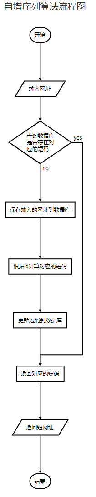

## 短链接

### 使用场景(Scenario)

​	微博和Twitter都有140字数的限制，如果分享一个长网址，很容易就超出限制，发布出去。短网址服务可以把一个长网址变成短网址，方便在社交网络上传播。

### 需求(Needs)

​	很显然，要尽可能的短。长度设计为多少才合适呢？

### 短网址的长度

​	当前互联网上的网页总数大概是 45亿(参考 短网址_短网址资讯`mrw.so`)，45亿 超过了 `2^{32}=4294967296232=4294967296`，但远远小于64位整数的上限值，那么用一个64位整数足够了。微博的短网址服务用的是长度为 `7` 的字符串，这个字符串可以看做是62进制的数，那么最大能表示`{62}^7=3521614606208627=3521614606208`个网址，远远大于 45亿。所以长度为7就足够了。一个64位整数如何转化为字符串呢？，假设我们只是用大小写字母加数字，那么可以看做是62进制数，`log_{62{(2^{64}-1)=10.7log62(264−1)=10.7`，即字符串最长11就足够了。实际生产中，还可以再短一点，比如新浪微博采用的长度就是7，因为 62^7=3521614606208627=3521614606208，这个量级远远超过互联网上的URL总数了，绝对够用了。现代的web服务器（例如Apache, Nginx）大部分都区分URL里的大小写了，所以用大小写字母来区分不同的URL是没问题的。

​	因此，正确答案：长度不超过7的字符串，由大小写字母加数字共62个字母组成。

### 一对一还是一对多映射？

​	一个长网址，对应一个短网址，还是可以对应多个短网址？ 这也是个重大选择问题。一般而言，一个长网址，在不同的地点，不同的用户等情况下，生成的短网址应该不一样，这样，在后端数据库中，可以更好的进行数据分析。如果一个长网址与一个短网址一一对应，那么在数据库中，仅有一行数据，无法区分不同的来源，就无法做数据分析了。

​	以这个7位长度的短网址作为唯一ID，这个ID下可以挂各种信息，比如生成该网址的用户名，所在网站，HTTP头部的 User Agent等信息，收集了这些信息，才有可能在后面做大数据分析，挖掘数据的价值。短网址服务商的一大盈利来源就是这些数据。

​	正确答案：一对多

### 如何计算短网址

​	现在我们设定了短网址是一个长度为7的字符串，如何计算得到这个短网址呢？

​	最容易想到的办法是哈希，先hash得到一个64位整数，将它转化为62进制整，截取低7位即可。但是哈希算法会有冲突，如何处理冲突呢，又是一个麻烦。这个方法只是转移了矛盾，没有解决矛盾，抛弃。

​	正确答案：分布式发号器(`Distributed ID Generator`)

### 如何存储

​	如果存储短网址和长网址的对应关系？以短网址为 `primary key`, 长网址为`value`, 可以用传统的关系数据库存起来，例如`MySQL,PostgreSQL`，也可以用任意一个分布式 KV 数据库，例如`Redis, LevelDB`。

### 301还是302重定向

​	这也是一个有意思的问题。这个问题主要是考察你对301和302的理解，以及浏览器缓存机制的理解。

​	301是永久重定向，302是临时重定向。短地址一经生成就不会变化，所以用301是符合http语义的。但是如果用了301， `Google`，`百度`等搜索引擎，搜索的时候会直接展示真实地址，那我们就无法统计到短地址被点击的次数了，也无法收集用户的`Cookie`, `User Agent` 等信息，这些信息可以用来做很多有意思的大数据分析，也是短网址服务商的主要盈利来源。

​	所以，正确答案是302重定向。

​	可以抓包看看mrw.so的短网址是怎么做的，使用 Chrome 浏览器，访问这个URL `http://mrw.so/4UD39p`，是我事先发微博自动生成的短网址。来抓包看看返回的结果是啥，可见新浪微博用的就是302临时重定向。


## 什么是短链接

> 就是把普通网址，转换成比较短的网址。比如：http://t.cn/RlB2PdD 这种，在微博这些限制字数的应用里。好处不言而喻。短、字符少、美观、便于发布、传播。

  百度短网址 http://dwz.cn/
  谷歌短网址服务 https://goo.gl/ （需科学上网）号称是最快的

## 原理解析

  当我们在浏览器里输入 http://t.cn/RlB2PdD 时

1. DNS首先解析获得 [http://t.cn](http://t.cn/) 的 `IP` 地址
2. 当 `DNS` 获得 `IP` 地址以后（比如：74.125.225.72），会向这个地址发送 `HTTP` `GET` 请求，查询短码 `RlB2PdD`
3. [http://t.cn](http://t.cn/) 服务器会通过短码 `RlB2PdD` 获取对应的长 URL
4. 请求通过 `HTTP` `301` 转到对应的长 URL [https://m.helijia.com](https://m.helijia.com/) 。

  这里有个小的知识点，为什么要用 301 跳转而不是 302 呐？

> 301 是永久重定向，302 是临时重定向。短地址一经生成就不会变化，所以用 301 是符合 `http` 语义的。同时对服务器压力也会有一定减少。
> 但是如果使用了 `301`，我们就无法统计到短地址被点击的次数了。而这个点击次数是一个非常有意思的大数据分析数据源。能够分析出的东西非常非常多。所以选择302虽然会增加服务器压力，但是我想是一个更好的选择。


## **如何将长链转换为短链接**

  思路1： 实现一个算法，将长地址转成短地址。实现长和短一一对应。然后再实现它的逆运算，将短地址还能换算回长地址。

​    假设 短地址的长度为100位。那么它的变化是62的100次方。62=10数字+26大写字母+26小写字母。但是无论这个数多么大，他也不可能容下世界上可能存在的长地址。

​    如果真有这么一个算法和逆运算，那么基本上现在的压缩软件都可以卸载了，因为世界上所有的信息，都可以被这个算法给压缩到100个字符，然后还能还原回去。这明显是不可能的。

​    （不要幻想使用压缩算法，对于URL这种不超过100bytes的字符串，压缩算法的压缩比通常都大于1，也就是压缩结果比原来的内容还要长）

  思路2： 把长地址转成短地址，但是不存在逆运算。我们需要把短对长的关系存到DB中。通过短查长的时候，需要查DB。

​    如果真有这么一个转换算法，那必然是会出现碰撞的，也就是多个长地址转成了同一个短地址。 不同的长网址缩短成了同一个短网址，那也做不到还原了。 

​    因为我们无法预知会输入什么样的长地址到这个系统中，所以不可能实现这样一个绝对不碰撞的hash函数。

​    （不要幻想使用Hash映射，因为Hash冲突是不可控的。当然，我们有解决Hash冲突的N种方法，但是这只会增加系统的复杂度 ）

  思路3：用一个hash算法，我承认它会碰撞，碰撞后我再在后面加1，2，3不就行了

​    当通过这个hash算法算出来之后，可能我们会需要根据 like 查找到 现在应该在后面加1，2，还是3，这个也可能由于输入的长地址集的不确定性。导致生成短链接时间的不确定性。

​     同理：随机生成一个短地址，去查找是否用过，用过就再随机，如此往复，直到随机到一个没用过的短地址。也是存在生成短链接时间的不确定性。


  正确做法：

#   思路1： **自增序列算法** 

​    设置 id 自增，一个 10进制 id 对应一个 62进制的数值，1对1，也就不会出现重复的情况。这个利用的就是低进制转化为高进制时，字符数会减少的特性。

​    如下图：十进制 10000，对应不同进制的字符表示 ：

  

​    短址的长度一般设为 6 位，而每一位是由 `[a - z, A - Z, 0 - 9]` 总共 62 个字母组成的，所以 6 位的话，总共会有 62^6 ~= 568亿种组合，基本上够用了。

​    通过发号策略，给每一个过来的长地址，发一个号即可，小型系统直接用mysql的自增索引就搞定了。如果是大型应用，可以考虑各种分布式key-value系统做发号器。不停的自增就行了。


   **如何保证同一个长地址，每次转出来都是一样的短地址 ？**

​    上述发号原理中，是不判断长地址是否已经转过的。也就是说用拿着百度首页地址来转，我给返回一个：http://xx.xx/abc，过一段时间你再来转，我会给你另一个地址：http://xx.xx/xyz

  由于出现了 一长对多短，浪费了空间。如果考虑 使用一个全量的 K-V 存储来保证不会 一长对多短，但是这个 KV存储本身就是浪费大量空间，而且是 大空间换小空间 ，不划算。

  我们做不到真正的一一对应，那么适当地打个折扣：

​     用key-value存储，保存“最近”生成的长对短的一个对应关系。注意是“最近”，也就是说，不保存全量的长对短的关系，而只保存最近的。比如采用一小时过期的机制来实现LRU淘汰。

​     长转短的流程变成这样：

> ​    1 在这个“最近”表中查看一下，看长地址有没有对应的短地址
>
> ​    2 有就直接返回，并且将这个key-value对的过期时间再延长成一小时
>
> ​    3 如果没有，就通过发号器生成一个短地址，并且将这个“最近”表中，过期时间为1小时

​    当一个地址被频繁使用，那么它会一直在这个key-value表中，总能返回当初生成那个短地址，不会出现重复的问题。如果它使用并不频繁，那么长对短的key会过期，LRU机制自动就会淘汰掉它。

​    这不能保证100%的同一个长地址一定能转出同一个短地址，比如你拿一个"冷门"的url，每间隔1小时来转一次，你会得到不同的短地址，但是这种情况，是在能容忍的范围内的。


  **如何保证发号器的高并发和高可用？**

​     如果做成分布式的，那么多节点要保持同步加1，多点同时写入。

​    可以考虑实现两个发号器，一个发单号，一个发双号，这样就变单点为多点了。

​    依次类推，我们可以实现1000个逻辑发号器，分别发尾号为0到999的号。每发一个号，每个发号器加1000，而不是加1。这些发号器独立工作，互不干扰即可。而且在实现上，也可以先是逻辑的，真的压力变大了，再拆分成独立的物理机器单元。


####   自增算法流程图

  

  插入记录，得到 id，再进行 进制换算得到 短链接，再把 短链接 更新至 刚刚插入的记录。


  **允许用户自定义短链，此时该如何实现呢？**

​    自增序列算法 短链接 是和 id 绑定的， 如果允许自定义短码就会占用当前id之后的短码，之后的 id 要生成短码的时候就发现在前面的记录中短码已经被用了。

​    解决方法：

> ​    1.数据库增加一个类型 type 字段，用来标记短码是用户自定义生成的，还是系统自动生成的。
>
> ​    2.用户自定义短码，把它的类型标记自定义，并插入一条记录。
>
> ​    3.根据 id 计算 短码时，如果发现计算出的短码被之前的记录给占用了，那么就从 类型为自定义的记录里选取出一条记录，用该记录的 id 去计算短码。
>
> ​    这样既可以区分：哪些长连接是用户自己定义还是系统自动生成的，还可以不浪费被自定义短码占用的数据库记录 id 对应的短码地址。 

  


####   # DB设计

   只需要一张表，存放短码与原网址的映射关系，其他一些属性比如原网址的sha1码，过期时间等保存好即可。当然短码和sha1字段都要加上唯一索引，保证唯一性的同时提高查询效率。

  links 表

| 字段       | 含义                            |
| :--------- | :------------------------------ |
| id         | link_id                         |
| url        | 长连接                          |
| keyword    | 短链接码                        |
| type       | 系统: “system” 自定义: “custom” |
| insert_at  | 插入时间                        |
| updated_at | 更新时间                        |

  自增算法，可以保留了若干位的短码，例如 1 到 2 位的 短码，一开始可以从三位的短码开始生成。

| 位数 | 个数      | 区间                    |
| :--- | :-------- | :---------------------- |
| 1位  | 62        | 0 - 61                  |
| 2位  | 3844      | 62 - 3843               |
| 3位  | 约 23万   | 3844 - 238327           |
| 4位  | 约 1400万 | 238328 - 14776335       |
| 5位  | 约 9.1亿  | 14776336 - 916132831    |
| 6位  | 约 568亿  | 916132832 - 56800235583 |

####   # Redis设计

​    若想短链接服务达到低延迟高并发的目标，Redis在很多环节都可以起到关键作用。
  **1. 自增长序列**
​    通过Redis的 `incr` 方法可以很容易的实现全局自增长序列，但前提是Redis的高可用。

​    如果Redis挂了序列从哪里开始呢？当然是从DB中拿咯，怎么拿？

```
  方式一：DB表中新增一个字段，每次都存入生成短码基于的全局序号值。获取到最新的一个全局序号值,Redis在此基础上+1即可； 
  方式二：直接从DB中获取最新的短码，然后逆向计算出全局序号值，Redis在此基础上+1即可。
```

  **2. 长网址的Hash表**
    在Redis中存入热点网址的hash映射数据，注意，这里说的是热点网址而且不是全量网址，实现者需要有所取舍。或者没有命中的就产生新的短码（会导致同址不同码），或者没有命中就到数据库查询，保证强一致的同址同码。

  **3. 短码与长网址的映射表**
    在Redis中存入热点网址的映射，在短网址还原的请求处理中可以快速的查询到原网址。所以这个点的缓存是必须的。


**可能需要考虑的问题：**

  **1. 字符超长问题**
    即使到了10亿(Billion)转换而成的62进制也无非是6位字符，所以长度基本不在考虑范围内，这个范围足够使用了。

  **2. 短码安全问题**
    按照算法从0-61都是1位字符，然后2位、3位...这样的话很容易被人发现规律并进行攻击，当然防御手段很多，请求签名之类的安全验证手段不在本文讨论范围内。
    首先计数器可以从一个比较大的随机中间值开始，比如从`10000`开始计数，他的62进制是 `2Bi` 3位的字符串；
    然后采用一些校验位算法(比如Luhn改进一下)，计算出1位校验位拼接起来，4位短码，这样可以排除一定的安全风险；
    再加点安全料的话，可以在62进制的转换过程中把排序好的62个字母数字随机打乱，比如`ABCD1234`打乱成`1BC43A2D`, 转换的62进制也就更难hack了；
    最后如果仍不放心，还可以在某些位置（比如1，3，5）插入随机数，让人无法看出规律来也可以达到良好的效果。

   3**. 自增算法是否完美无缺**
    自增算法 随着序号的自增，码越来越长，到了很大的数值后没有办法循环往复，让码重新变短！


#   思路二：hash

> 1. 将长网址 `md5` 生成 32 位签名串,分为 4 段, 每段 8 个字节
> 2. 对这四段循环处理, 取 8 个字节, 将他看成 16 进制串与 0x3fffffff(30位1) 与操作, 即超过 30 位的忽略处理
> 3. 这 30 位分成 6 段, 每 5 位的数字作为字母表的索引取得特定字符, 依次进行获得 6 位字符串
> 4. 总的 `md5` 串可以获得 4 个 6 位串,取里面的任意一个就可作为这个长 url 的短 url 地址

   这个算法在服务量不大的情况下hash碰撞的概率尚可以接受，一定量的压测效果也还算理想。因为有4个hash可选项，即使碰撞到了还有其他3次机会去避免。但是如果作为基础服务，在使用方调用量级无法估量无法保证短链接绝对可用的情况下，这个算法还是有很大的隐患.

  

###   两种算法对比

​    第一种算法的好处就是简单好理解，永不重复。但是短码的长度不固定，随着 id 变大从一位长度开始递增。如果非要让短码长度固定也可以就是让 id 从指定的数字开始递增就可以了。百度短网址用的这种算法。

​    第二种算法，存在碰撞（重复）的可能性，虽然几率很小。短码位数是比较固定的。不会从一位长度递增到多位的。据说微博使用的这种算法。 如果业务所需的短网址有效期相对较短，通过批处理定期清洗掉，此时算法二 不失为一种可选方案。