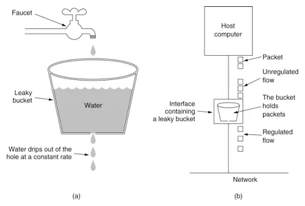
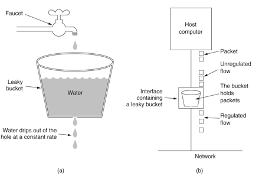
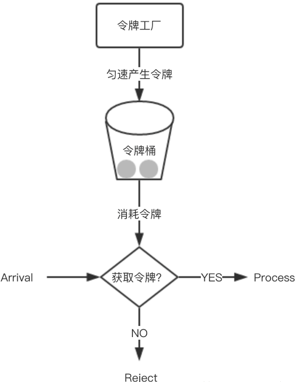

### 什么是限流

> 限流可以认为服务降级的一种，限流就是限制系统的输入和输出流量已达到保护系统的目的。一般来说系统的吞吐量是可以被测算的，为了保证系统的稳定运行，一旦达到的需要限制的阈值，就需要限制流量并采取一些措施以完成限制流量的目的。比如：延迟处理，拒绝处理，或者部分拒绝处理等等。

### 高并发下的流量控制

​	如果不做任何保护措施，服务器就会承受很大的处理压力，请求量很高，服务器负载也很高，并且当请求超过服务器承载极限的时候，系统就会崩溃，导致所有人都不能访问。

​	为了应用服务的高可用，一个常用的办法是对大流量的请求（秒杀/抢购）进行限流，拦截掉大部分请求，只允许一部分请求真正进入后端服务器，这样就可以防止大量请求造成系统压力过大导致的系统崩溃，从而保护服务正常可用。

`	令牌桶(Token Bucket)`、`漏桶(leaky bucket)`和 `计数器` 算法是最常用的三种限流的算法。

## 限流算法

### 计数器

​	计数器限流算法也是比较常用的，主要用来限制总并发数。比如限流 `qps` 为 `100` ，算法的实现思路就是从第一个请求进来开始计时，在接下去的 `1s` 内，每来一个请求，就把计数加 `1` ，如果累加的数字达到了 `100` ，那么后续的请求就会被全部拒绝。等到 `1s` 结束后，把计数恢复成 `0` ，重新开始计数。

​	这种实现方式有一个弊端：如果我在单位时间 `1s` 内的前 `10ms` ，已经通过了 `100` 个请求，那后面的 `990ms` ，只能眼巴巴的把请求拒绝，这种现象称为 **突刺现象**。

### 漏桶

​	为了消除 **突刺现象**，可以采用漏桶算法实现限流，漏桶算法这个名字就很形象，算法内部有一个容器，类似生活用到的漏斗，当请求进来时，相当于水倒入漏斗，然后从下端小口慢慢匀速的流出。不管上面流量多大，下面流出的速度始终保持不变。

​	不管服务调用方多么不稳定，通过漏桶算法进行限流，每 `10` 毫秒处理一次请求。因为处理的速度是固定的，请求进来的速度是未知的，可能突然进来很多请求，没来得及处理的请求就先放在桶里，既然是个桶，肯定是有容量上限，如果桶满了，那么新进来的请求就丢弃。



​	在算法实现方面，可以 **准备一个队列，用来保存请求，另外通过一个线程池定期从队列中获取请求并执行，可以一次性获取多个并发执行**。

​	这种算法，在使用过后也存在弊端：**无法应对短时间的突发流量**，同时它的优点也是可以平滑网络上的突发流量，请求可以被整形成稳定的流量。

### 令牌桶

​	从某种意义上讲，**令牌桶算法是对漏桶算法的一种改进，桶算法能够限制请求调用的速率，而令牌桶算法能够在限制调用的平均速率的同时还允许一定程度的突发调用**。

​	在令牌桶算法中，存在一个桶，用来存放固定数量的令牌。算法中存在一种机制，以一定的速率往桶中放令牌。每次请求调用需要先获取令牌，只有拿到令牌，才有机会继续执行，否则选择选择等待可用的令牌、或者直接拒绝。

​	放令牌这个动作是持续不断的进行，如果桶中令牌数达到上限，就丢弃令牌，所以就存在这种情况，桶中一直有大量的可用令牌，这时进来的请求就可以直接拿到令牌执行，比如设置 `qps` 为 `100` ，那么限流器初始化完成一秒后，桶中就已经有 100 个令牌了，这时服务还没完全启动好，等启动完成对外提供服务时，该限流器可以抵挡瞬时的 `100` 个请求。所以，只有桶中没有令牌时，请求才会进行等待，最后相当于以一定的速率执行。


​	实现思路：可以 **准备一个队列，用来保存令牌，另外通过一个线程池定期生成令牌放到队列中，每来一个请求，就从队列中获取一个令牌，并继续执行**。

> 漏桶 VS 令牌桶：两者主要区别在于“漏桶算法”能够强行限制数据的传输速率，而“令牌桶算法”在能够限制数据的平均传输速率外，还允许某种程度的突发传输。在“令牌桶算法”中，只要令牌桶中存在令牌，那么就允许突发地传输数据直到达到用户配置的门限，所以它适合于具有突发特性的流量。

## 集群限流

### Redis 请求窗口

> 采用redis 的计时和计数方式,在规定的时间窗口期,允许通过的最大请求数量

​	比如为了限制某个资源被每个用户或者商户的访问次数，5s 只能访问 2 次，或者一天只能调用 1000 次，这种需求，单机限流是无法实现的，这时就需要通过集群限流进行实现。

​	如何实现？为了控制访问次数，肯定需要一个计数器，而且这个计数器只能保存在第三方服务，比如redis。

​	大概思路：每次有相关操作的时候，就向 `redis` 服务器发送一个 `incr` 命令，比如需要限制某个用户访问 `/index` 接口的次数，只需要拼接用户 id 和接口名生成 `redis` 的 `key` ，每次该用户访问此接口时，只需要对这个 `key` 执行 `incr` 命令，在这个 `key` 带上过期时间，就可以实现指定时间的访问频率。

### Nginx 限流

​	Nginx按请求速率限速模块使用的是漏桶算法，即能够强行保证请求的实时处理速度不会超过设置的阈值。

​	Nginx官方版本限制IP的连接和并发分别有两个模块：

- `limit_req_zone` 用来限制单位时间内的请求数，即速率限制,采用的漏桶算法 “leaky bucket”。
- `limit_req_conn` 用来限制同一时间连接数，即并发限制。


### 限流方法

##### 计数器

###### 实现方式

​	控制单位时间内的请求数量

```java
import java.util.concurrent.atomic.AtomicInteger;

public class Counter { 
	/** * 最大访问数量 */ 
	private final int limit = 10;
	/** * 访问时间差 */
	private final long timeout = 1000;
	/** * 请求时间 */
	private long time;
	/** * 当前计数器 */
	private AtomicInteger reqCount = new AtomicInteger(0);

	public boolean limit() {
		long now = System.currentTimeMillis();
		if (now < time + timeout) {
			// 单位时间内
        	reqCount.addAndGet(1);
        	return reqCount.get() <= limit;
    	} else {
        	// 超出单位时间
        	time = now;
        	reqCount = new AtomicInteger(0);
        	return true;
    	}
	}
}
```

劣势

​	假设在 00:01 时发生一个请求,在 00:01-00:58 之间不在发送请求,在 00:59 时发送剩下的所有请求 `n-1` (n为限流请求数量),在下一分钟的 00:01 发送n个请求,这样在2秒钟内请求到达了 `2n - 1` 个.

​	设每分钟请求数量为60个,每秒可以处理1个请求,用户在 00:59 发送 60 个请求,在 01:00 发送 60 个请求 此时2秒钟有120个请求(每秒60个请求),远远大于了每秒钟处理数量的阈值


##### 滑动窗口

###### 	实现方式

​	滑动窗口是对计数器方式的改进,增加一个时间粒度的度量单位

​	把一分钟分成若干等分(6份,每份10秒), 在每一份上设置独立计数器,在 00:00-00:09 之间发生请求计数器累加1.当等分数量越大限流统计就越详细

```java
package com.example.demo1.service;

import java.util.Iterator;
import java.util.Random;
import java.util.concurrent.ConcurrentLinkedQueue;
import java.util.stream.IntStream;

public class TimeWindow {
    private ConcurrentLinkedQueue<Long> queue = new ConcurrentLinkedQueue<Long>();

    /**
     * 间隔秒数
     */
    private int seconds;

    /**
     * 最大限流
     */
    private int max;

    public TimeWindow(int max, int seconds) {
        this.seconds = seconds;
        this.max = max;

        /**
         * 永续线程执行清理queue 任务
         */
        new Thread(() -> {
            while (true) {
                try {
                    // 等待 间隔秒数-1 执行清理操作
                    Thread.sleep((seconds - 1) * 1000L);
                } catch (InterruptedException e) {
                    e.printStackTrace();
                }
                clean();
            }
        }).start();

    }

    public static void main(String[] args) throws Exception {

        final TimeWindow timeWindow = new TimeWindow(10, 1);

        // 测试3个线程
        IntStream.range(0, 3).forEach((i) -> {
            new Thread(() -> {

                while (true) {

                    try {
                        Thread.sleep(new Random().nextInt(20) * 100);
                    } catch (InterruptedException e) {
                        e.printStackTrace();
                    }
                    timeWindow.take();
                }

            }).start();

        });

    }

    /**
     * 获取令牌，并且添加时间
     */
    public void take() {
        long start = System.currentTimeMillis();
        try {
            int size = sizeOfValid();
            if (size > max) {
                System.err.println("超限");
            }
            synchronized (queue) {
                if (sizeOfValid() > max) {
                    System.err.println("超限");
                    System.err.println("queue中有 " + queue.size() + " 最大数量 " + max);
                }
                this.queue.offer(System.currentTimeMillis());
            }
            System.out.println("queue中有 " + queue.size() + " 最大数量 " + max);

        }
    }


    public int sizeOfValid() {
        Iterator<Long> it = queue.iterator();
        Long ms = System.currentTimeMillis() - seconds * 1000;
        int count = 0;
        while (it.hasNext()) {
            long t = it.next();
            if (t > ms) {
                // 在当前的统计时间范围内
                count++;
            }
        }
        return count;
    }


    /**
     * 清理过期的时间
     */
    public void clean() {
        Long c = System.currentTimeMillis() - seconds * 1000;
        Long tl = null;
        while ((tl = queue.peek()) != null && tl < c) {
            System.out.println("清理数据");
            queue.poll();
        }
    }
}
```


##### Leaky Bucket 漏桶

###### 实现方式

​	规定固定容量的桶,有水进入,有水流出. 对于流进的水我们无法估计进来的数量、速度,对于流出的水我们可以控制速度.

```java
public class LeakBucket {
  /**
   * 时间
   */
  private long time;
  /**
   * 总量
   */
  private Double total;
  /**
   * 水流出去的速度
   */
  private Double rate;
  /**
   * 当前总量
   */
  private Double nowSize;
  
  public boolean limit() {
    long now = System.currentTimeMillis();
    nowSize = Math.max(0, (nowSize - (now - time) * rate));
    time = now;
    if ((nowSize + 1) < total) {
        nowSize++;
        return true;
    } else {
        return false;
    }
  }
}
```


##### Token Bucket 令牌桶

###### 实现方式

​	规定固定容量的桶,token 以固定速度往桶内填充,当桶满时 token 不会被继续放入,每过来一个请求把 token 从桶中移除,如果桶中没有 token 不能请求

```java
public class TokenBucket {
    /**
     * 时间
     */
    private long time;
    /**
     * 总量
     */
    private Double total;
    /**
     * token 放入速度
     */
    private Double rate;
    /**
     * 当前总量
     */
    private Double nowSize;


    public boolean limit() {
        long now = System.currentTimeMillis();
        nowSize = Math.min(total, nowSize + (now - time) * rate);
        time = now;
        if (nowSize < 1) {
            // 桶里没有token
            return false;
        } else {
            // 存在token
            nowSize -= 1;
            return true;
        }
    }
}
```


##### 工作中的使用

###### 	spring cloud gateway

​	spring cloud gateway 默认使用redis进行限流,笔者一般只是修改修改参数属于拿来即用.并没有去从头实现上述那些算法.

```xml
<dependency>
  <groupId>org.springframework.cloud</groupId>
  <artifactId>spring-cloud-starter-gateway</artifactId>
</dependency>
<dependency>
  <groupId>org.springframework.boot</groupId>
  <artifactId>spring-boot-starter-data-redis-reactive</artifactId>
</dependency>Copy to clipboardErrorCopied
```

```yaml
spring:
  cloud:
    gateway:
      routes:
      - id: requestratelimiter_route
        uri: lb://pigx-upms
        order: 10000
        predicates:
        - Path=/admin/**
        filters:
        - name: RequestRateLimiter
          args:
            redis-rate-limiter.replenishRate: 1  # 令牌桶的容积
            redis-rate-limiter.burstCapacity: 3  # 流速 每秒
            key-resolver: "#{@remoteAddrKeyResolver}" #SPEL表达式去的对应的bean
        - StripPrefix=1Copy to clipboardErrorCopied
@Bean
KeyResolver remoteAddrKeyResolver() {
    return exchange -> Mono.just(exchange.getRequest().getRemoteAddress().getHostName());
}Copy to clipboardErrorCopied
```


###### sentinel

​	通过配置来控制每个url的流量

```xml
<dependency>
  <groupId>com.alibaba.cloud</groupId>
  <artifactId>spring-cloud-starter-alibaba-sentinel</artifactId>
</dependency>Copy to clipboardErrorCopied
```

```yaml
spring:
cloud:
  nacos:
    discovery:
      server-addr: localhost:8848
  sentinel:
    transport:
      dashboard: localhost:8080
      port: 8720
    datasource:
      ds:
        nacos:
          server-addr: localhost:8848
          dataId: spring-cloud-sentinel-nacos
          groupId: DEFAULT_GROUP
          rule-type: flow
          namespace: xxxxxxxxCopy to clipboardErrorCopied
```

​	配置内容在nacos上进行编辑

```json
[
  {
      "resource": "/hello",
      "limitApp": "default",
      "grade": 1,
      "count": 1,
      "strategy": 0,
      "controlBehavior": 0,
      "clusterMode": false
  }
]Copy to clipboardErrorCopied
```

- resource：资源名，即限流规则的作用对象。

- limitApp：流控针对的调用来源，若为 default 则不区分调用来源。

- grade：限流阈值类型，QPS 或线程数模式，0代表根据并发数量来限流，1代表根据QPS来进行流量控制。

- count：限流阈值

- strategy：判断的根据是资源自身，还是根据其它关联资源 (refResource)，还是根据链路入口

- controlBehavior：流控效果（直接拒绝 / 排队等待 / 慢启动模式）

- clusterMode：是否为集群模式

  

  

  ##### 总结

  > sentinel和spring cloud gateway两个框架都是很好的限流框架,但是在我使用中还没有将[spring-cloud-alibaba](https://github.com/alibaba/spring-cloud-alibaba)接入到项目中进行使用,所以我会选择**spring cloud gateway**,当接入完整的或者接入Nacos项目使用setinel会有更加好的体验.


一、场景描述

由于业务应用系统的负载能力有限，为了防止非预期的请求对系统压力过大而拖垮业务应用系统。

面对大流量时，如何进行流量控制？

服务接口的流量控制策略：分流、降级、限流等。

本文讨论限流策略，虽然降低了服务接口的访问频率和并发量，却换取服务接口和业务应用系统的高可用。

实际场景中常用的限流策略：

**Nginx前端限流**

​    按照一定的规则如帐号、IP、系统调用逻辑等在Nginx层面做限流

**业务应用系统限流**

​    1、客户端限流

​    2、服务端限流

**数据库限流**

​    红线区，力保数据库

按照服务的调用方，可以分为以下几种类型服务

1、与用户打交道的服务

​    比如web服务、对外API，这种类型的服务有以下几种可能导致机器被拖垮：

> -   用户增长过快
>     
> -   因为某个热点事件（微博热搜）
>     
> -   竞争对象爬虫
>     
> -   恶意的刷单
>     

这些情况都是无法预知的，不知道什么时候会有10倍甚至20倍的流量打进来，如果真碰上这种情况，扩容是根本来不及的

2、对内的RPC服务

一个服务A的接口可能被B C D E多个服务进行调用，在B服务发生突发流量时，直接把A服务给调用挂了，导致A服务对C D E 也无法提供服务。 这种情况时有发生，解决方案有两种：

1、每个调用方采用线程池进行资源隔离

2、使用限流手段对每个调用方进行限流

二、常用的限流算法

常见的限流算法有：计数器、令牌桶、漏桶。

**1、计数器算法**

​    采用计数器实现限流有点简单粗暴，一般我们会限制一秒钟的能够通过的请求数，比如限流qps为100，算法的实现思路就是从第一个请求进来开始计时，在接下去的1s内，每来一个请求，就把计数加1，如果累加的数字达到了100，那么后续的请求就会被全部拒绝。等到1s结束后，把计数恢复成0，重新开始计数。

​    具体的实现可以是这样的：对于每次服务调用，可以通过`AtomicLong#incrementAndGet()`方法来给计数器加1并返回最新值，通过这个最新值和阈值进行比较。

​    这种实现方式，相信大家都知道有一个弊端：如果我在单位时间1s内的前10ms，已经通过了100个请求，那后面的990ms，只能眼巴巴的把请求拒绝，我们把这种现象称为“突刺现象”

**2、漏桶算法**

​    漏桶(Leaky Bucket)算法思路很简单,水(请求)先进入到漏桶里,漏桶以一定的速度出水(接口有响应速率),当水流入速度过大会直接溢出(访问频率超过接口响应速率),然后就拒绝请求,可以看出漏桶算法能强行限制数据的传输速率.

​    示意图如下:

　　　

​    可见这里有两个变量,一个是桶的大小,支持流量突发增多时可以存多少的水(burst),另一个是水桶漏洞的大小(rate)。

​    因为漏桶的漏出速率是固定的参数,所以,即使网络中不存在资源冲突(没有发生拥塞),漏桶算法也不能使流突发(burst)到端口速率.因此,漏桶算法对于存在突发特性的流量来说缺乏效率.

​    在算法实现方面，可以准备一个队列，用来保存请求，另外通过一个线程池定期从队列中获取请求并执行，可以一次性获取多个并发执行。

​    这种算法，在使用过后也存在弊端：无法应对短时间的突发流量。

**3、令牌桶算法**

​    令牌桶算法(Token Bucket)和 Leaky Bucket 效果一样但方向相反的算法,更加容易理解.随着时间流逝,系统会按恒定1/QPS时间间隔(如果QPS=100,则间隔是10ms)往桶里加入Token(想象和漏洞漏水相反,有个水龙头在不断的加水),如果桶已经满了就不再加了.

​    新请求来临时,会各自拿走一个Token,如果没有Token可拿了就阻塞或者拒绝服务.


​    令牌桶的另外一个好处是可以方便的改变速度. 一旦需要提高速率,则按需提高放入桶中的令牌的速率. 一般会定时(比如100毫秒)往桶中增加一定数量的令牌, 有些变种算法则实时的计算应该增加的令牌的数量.

​    从某种意义上讲，令牌桶算法是对漏桶算法的一种改进，桶算法能够限制请求调用的速率，而令牌桶算法能够在限制调用的平均速率的同时还允许一定程度的突发调用。

​    在令牌桶算法中，存在一个桶，用来存放固定数量的令牌。算法中存在一种机制，以一定的速率往桶中放令牌。每次请求调用需要先获取令牌，只有拿到令牌，才有机会继续执行，否则选择选择等待可用的令牌、或者直接拒绝。

​    放令牌这个动作是持续不断的进行，如果桶中令牌数达到上限，就丢弃令牌，所以就存在这种情况，桶中一直有大量的可用令牌，这时进来的请求就可以直接拿到令牌执行，比如设置qps为100，那么限流器初始化完成一秒后，桶中就已经有100个令牌了，这时服务还没完全启动好，等启动完成对外提供服务时，该限流器可以抵挡瞬时的100个请求。所以，只有桶中没有令牌时，请求才会进行等待，最后相当于以一定的速率执行。



​    实现思路：可以准备一个队列，用来保存令牌，另外通过一个线程池定期生成令牌放到队列中，每来一个请求，就从队列中获取一个令牌，并继续执行。

**google开源工具包guava: 限流工具类RateLimiter **

​    1.通过Google开源的guava包，我们可以很轻松的创建一个令牌桶算法的限流器。

```xml
<dependency>
   <groupId>com.google.guava</groupId>
   <artifactId>guava</artifactId>
   <version>18.0</version>
</dependency>
```

​    通过RateLimiter类的create方法，创建限流器。

```java
package ratelimite;
import com.google.common.util.concurrent.RateLimiter;

public class RateLimiterDemo {
    public static void main(String[] args) {
        testNoRateLimiter();
        testWithRateLimiter();
    }

    public static void testNoRateLimiter() {
        long start = System.currentTimeMillis();
        for (int i = 0; i < 10; i++) {
            System.out.println("call execute.." + i);
        }
        long end = System.currentTimeMillis();
        System.out.println(end - start);
    }

    public static void testWithRateLimiter() {
        long start = System.currentTimeMillis();
        RateLimiter limiter = RateLimiter.create(10.0);
        // 每秒不超过10个任务被提交 
        for (int i = 0; i < 10; i++) {
            limiter.acquire();
            // 请求RateLimiter, 超过permits会被阻塞 
            System.out.println("call execute.." + i);
        }
        long end = System.currentTimeMillis();
        System.out.println(end - start);
    }
}
```

​    其实Guava提供了多种create方法，方便创建适合各种需求的限流器。在上述例子中，创建了一个每秒生成10个令牌的限流器，即100ms生成一个，并最多保存10个令牌，多余的会被丢弃。

​    rateLimiter提供了acquire()和tryAcquire()接口

​    1、使用acquire()方法，如果没有可用令牌，会一直阻塞直到有足够的令牌。

​    2、使用tryAcquire()方法，如果没有可用令牌，就直接返回false。

​    3、使用tryAcquire()带超时时间的方法，如果没有可用令牌，就会判断在超时时间内是否可以等到令牌，如果不能，就返回false，如果可以，就阻塞等待。

​    spring cloud网关通过Zuul RateLimit 限流配置

​    在pom文件中引入Zuul RateLimit的依赖:

```xml
<dependency>
    <groupId>com.marcosbarbero.cloud</groupId>
    <artifactId>spring-cloud-zuul-ratelimit</artifactId>
    <version>1.3.2.RELEASE</version>
</dependency>
```

​    **配置信息**

```bash
更详细的配置解读下面有写，这里只是简单配置一下，以下这个配置就可以对服务进行限流了
zuul:
  routes: 你的路由配置
    test:
      path: 
      serviceId: 
  ratelimit:
    enabled: true
    policies:
      test: 路由名
        limit: 限制次数
        refresh-interval: 刷新时间
        type: 类型
```

​    **RateLimit源码简单分析**

​    本地让自己的一个服务配置为一分钟内该服务的API只能访问十次，超过十次，网关就会报错

```bash
zuul:
  routes:
    test:
      path: /api/test/**
      serviceId: hscf-cloud-test-9457
  ratelimit:
    enabled: true
    policies:
      test:
        limit: 10
        refresh-interval: 60
        type: origin  限流方式
```

​    RateLimit类是继承ZuulFilter。filterType为“pre”表示在每一个API访问之前进行拦截，LIMIT\_HEADER，REMAINING\_HEADER，RESET_HEADER 这三个变量是获取配置中的访问次数，记录该时间内剩余的访问次数。

```java
public class RateLimitFilter extends ZuulFilter {
    public static final String LIMIT_HEADER = "X-RateLimit-Limit";
    public static final String REMAINING_HEADER = "X-RateLimit-Remaining";
    public static final String RESET_HEADER = "X-RateLimit-Reset";

    public String filterType() {
        return "pre";
    }
    public int filterOrder() {
        return -1;
    }
    public boolean shouldFilter() {
        return this.properties.isEnabled() && this.policy(this.route()).isPresent();
    }
}
```

​    在主体逻辑run()中进行判断。先通过 this.policy(route).ifPresent((policy) 判断policy配置信息是否存在，存在的话会读取到当前的限制值 和 剩余的限制值，最终判断剩余的限制值是否小于0，小于0的话就会报出太多请求的异常： TOO\_MANY\_REQUESTS(429, "Too Many Requests")

```java
public Object run() {
        RequestContext ctx = RequestContext.getCurrentContext();
        HttpServletResponse response = ctx.getResponse();
        HttpServletRequest request = ctx.getRequest();
        Route route = this.route();
        this.policy(route).ifPresent((policy) -> {
            String key = this.rateLimitKeyGenerator.key(request, route, policy);
            Rate rate = this.rateLimiter.consume(policy, key);
            response.setHeader("X-RateLimit-Limit", policy.getLimit().toString());
            response.setHeader("X-RateLimit-Remaining", String.valueOf(Math.max(rate.getRemaining().longValue(), 0L)));
            response.setHeader("X-RateLimit-Reset", rate.getReset().toString());
            if(rate.getRemaining().longValue() < 0L) {
                ctx.setResponseStatusCode(HttpStatus.TOO_MANY_REQUESTS.value());
                ctx.put("rateLimitExceeded", "true");
                throw new ZuulRuntimeException(new ZuulException(HttpStatus.TOO_MANY_REQUESTS.toString(), HttpStatus.TOO_MANY_REQUESTS.value(), (String)null));
            }
        });
        return null;
}
```

​    控制台的异常信息，异常code为429，也就是太多请求的异常：TOO\_MANY\_REQUESTS(429, "Too Many Requests")

​    **RateLimit详细的配置信息解读**

```
zuul:

    ratelimit:

        key-prefix: your-prefix  #对应用来标识请求的key的前缀

        enabled: true

        repository: REDIS  #对应存储类型（用来存储统计信息）

        behind-proxy: true  #代理之后

        default-policy: #可选 - 针对所有的路由配置的策略，除非特别配置了policies

             limit: 10 #可选 - 每个刷新时间窗口对应的请求数量限制

             quota: 1000 #可选-  每个刷新时间窗口对应的请求时间限制（秒）

              refresh-interval: 60 # 刷新时间窗口的时间，默认值 (秒)

               type: #可选 限流方式

                    - user  #通过请求路径区分
```

**集群限流**

前面讨论的几种算法都属于单机限流的范畴，但是业务需求五花八门，简单的单机限流，根本无法满足他们。

比如为了限制某个资源被每个用户或者商户的访问次数，5s只能访问2次，或者一天只能调用1000次，这种需求，单机限流是无法实现的，这时就需要通过集群限流进行实现。

**如何实现？**

为了控制访问次数，肯定需要一个计数器，而且这个计数器只能保存在第三方服务，比如redis。

大概思路：每次有相关操作的时候，就向redis服务器发送一个incr命令，比如需要限制某个用户访问/index接口的次数，只需要拼接用户id和接口名生成redis的key，每次该用户访问此接口时，只需要对这个key执行incr命令，在这个key带上过期时间，就可以实现指定时间的访问频率。