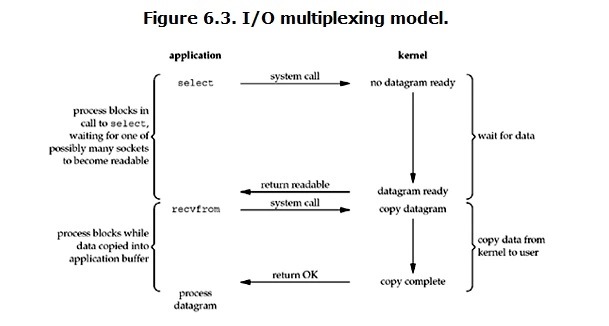

### I/O

#### 基本概念

##### 文件描述符fd

​	文件描述符（`File descriptor`）是计算机科学中的一个术语，是一个用于表述指向文件的引用的抽象化概念。

​	文件描述符在形式上是一个非负整数。实际上，它是一个索引值，指向内核为每一个进程所维护的该进程打开文件的记录表。当程序打开一个现有文件或者创建一个新文件时，内核向进程返回一个文件描述符。在程序设计中，一些涉及底层的程序编写往往会围绕着文件描述符展开。但是文件描述符这一概念往往只适用于 `UNIX、Linux` 这样的操作系统。

##### 缓存 I/O

​	缓存 `I/O` 又被称作标准 `I/O`，大多数文件系统的默认 `I/O` 操作都是缓存 `I/O`。在 `Linux` 的`缓存 I/O` 机制中，操作系统会将 `I/O` 的数据缓存在文件系统的页缓存（ `page cache` ）中，也就是说，数据会先被拷贝到操作系统内核的缓冲区中，然后才会从操作系统内核的缓冲区拷贝到应用程序的地址空间。

​	缓存 I/O 的缺点：数据在传输过程中需要在应用程序地址空间和内核进行多次数据拷贝操作，这些数据拷贝操作所带来的 `CPU` 以及内存开销是非常大的。

##### IO模式

​	刚才说了，对于一次IO访问（以read举例），数据会先被拷贝到操作系统内核的缓冲区中，然后才会从操作系统内核的缓冲区拷贝到应用程序的地址空间。所以说，当一个read操作发生时，它会经历两个阶段：

1. 等待数据准备
2. 将数据从内核拷贝到进程中

  正是因为这两个阶段，Linux系统产生了下面五种网络模式的方案。

- `阻塞 I/O`（blocking IO）
- `非阻塞 I/O`（nonblocking IO）
- `I/O 多路复用`（ IO multiplexing）
- `信号驱动 I/O`（ signal driven IO）
- `异步 I/O`（asynchronous IO）

> 由于signal driven IO在实际中并不常用，所以这里只提及剩下的四种 IO Model。

##### 阻塞IO

​	在 `Linux` 中，默认情况下所有的 `socket` 都是 `blocking` ，一个典型的读操作流程大概是这样：

​	当用户进程调用了 `recvfrom` 这个系统调用， `kernel` 就开始了 IO 的第一个阶段：准备数据（对于网络IO来说，很多时候数据在一开始还没有到达。比如，还没有收到一个完整的 `UDP` 包。这个时候 `kernel` 就要等待足够的数据到来）。这个过程需要等待，也就是说数据被拷贝到操作系统内核的缓冲区中是需要一个过程的。而在用户进程这边，整个进程会被阻塞（当然，是进程自己选择的阻塞）。当 `kernel` 一直等到数据准备好了，它就会将数据从 `kernel` 中拷贝到用户内存，然后 `kernel` 返回结果，用户进程才解除 `block` 的状态，重新运行起来。

> blocking IO的特点就是在IO执行的两个阶段都被block了

##### 非阻塞 I/O

`	Linux` 下，可以通过设置 `socket` 使其变为 `non-blocking` 。当对一个 `non-blocking socket` 执行读操作时，流程是这个样子：

​	当用户进程发出 `read` 操作时，如果 `kernel` 中的数据还没有准备好，那么它并不会 `block` 用户进程，而是立刻返回一个 `error` 。从用户进程角度讲 ，它发起一个 `read` 操作后，并不需要等待，而是马上就得到了一个结果。用户进程判断结果是一个 `error` 时，它就知道数据还没有准备好，于是它可以再次发送 `read` 操作。一旦 `kernel` 中的数据准备好了，并且又再次收到了用户进程的 `system call` ，那么它马上就将数据拷贝到了用户内存，然后返回。

> nonblocking IO的特点是用户进程需要不断的主动询问kernel数据好了没有

##### IO多路复用

​	IO多路复用就是我们说的 `select，poll，epoll` ，有些地方也称这种IO方式为 `event driven IO` 。`select/epoll` 的好处就在于单个 `process` 就可以同时处理多个网络连接的 IO 。它的基本原理就是 `select，poll，epoll` 这个 `function` 会不断的轮询所负责的所有 `socket` ，当某个 `socket` 有数据到达了，就通知用户进程。

​	**当用户进程调用了 select，那么整个进程会被 block**，而同时， `kernel` 会监视所有 `select` 负责的 `socket` ，当任何一个 `socket` 中的数据准备好了， `select` 就会返回。这个时候用户进程再调用 `read` 操作，将数据从 `kernel` 拷贝到用户进程。

> I/O 多路复用的特点是通过一种机制一个进程能同时等待多个文件描述符，而这些文件描述符（套接字描述符）其中的任意一个进入读就绪状态，`select()` 函数就可以返回。

​	这个图和 `blocking IO` 的图其实并没有太大的不同，事实上，还更差一些。因为这里需要使用两个 `system call` (`select` 和 `recvfrom`)，而 `blocking IO` 只调用了一个 `system call` (`recvfrom`)。但是，用 `select` 的优势在于它可以同时处理多个 `connection` 。

​	所以，**如果处理的连接数不是很高的话，使用 `select/epoll` 的 `web server` 不一定比使用 `multi-threading + blocking IO` 的 `web server` 性能更好，可能延迟还更大**。`select/epoll` 的优势并不是对于单个连接能处理得更快，而是在于能处理更多的连接。

​	在IO多路复用实际使用中，对于每一个socket，一般都设置成为 `non-blocking` ，但是，如上图所示，整个用户的 `process` 其实是一直被block的。只不过 `process` 是被 `select` 这个函数 `block` ，而不是被 `socket IO` 给 `block` 。

#### 基本概念

在 I/O 编程过程中,当需要同时处理多个客户端接入请求时，可以利用多线程或者 `I/O 多路复用` 技术进行处理。**`I/O多路复用` 技术通过把多个I/O的阻塞复用到同一个selct的阻塞上，从而使得系统在单线程的情况下可以同时处理多个客户端请求**。**与传统的 `多线程/多进程` 模型比，I/O多路复用的最大优势是系统开销小，系统不需要创建新的额外进程或者线程，也不需要维护这些进程和线程的运行，降低了系统的维护工作量，节省了系统资源**，I/O多路复用的主要应用场景如下。

- 服务器需要同时处理多个处于监听状态或者多个连接状态的套接字
- 服务器需要同时处理多种网络协议的套接字

   目前支持I/O多路复用的系统调用有 `select、pselect、poll、epoll`，在Linux网络编程; 过程中，很长一段时间都使用 `select` 做轮询和网络事件通知，然而 `select` 的一些固有缺陷导致了它的应用受到了很大的限制。最终 `Linux` 不得不在新的内核版本中寻找 `select` 的替代方案，最终选择了 `epoll`。 `epoll` 与 `select` 的原理比较类似，为了克服 `select` 的缺点， `epoll` 作了很多重大改进，现总结如下。

##### 支持一个进程打开的 socket 描述符（FD）不受限制（仅受限于操作系统的最大文件句柄数）。

​	**`select` 最大的缺陷就是单个进程所打开的 FD 是有一定限制的**，它由 `FD_SETSIZE` 设置，默认值是 `1024` 。对于那些需要支持上万个 TCP 连接的大型服务器来说显然太少了。可以选择修改这个宏然后重新编译内核，不过这会带来网络效率的下降。我们也可以通过选择多进程的方案（传统的 Apache 方案）解决这个问题，不过虽然在 Linux上创建进程的代价比较小，但仍旧是不可忽视的，另外，进程间的数据交换非常麻烦，对于 Java 由于没有共享内存，需要通过 `Socket` 通信或者其他方式进行数据同步，这带来了额外的性能损耗，增加了程序复杂度，所以也不是一种完美的解决方案。值得庆幸的是， `epoll` 并没有这个限制，它所支持的 `FD` 上限是操作系统的 **最大文件句柄数**，这个数字远远大于 `1024` 。例如，在 `1 GB` 内存的机器上大约是 10万个句柄左右，具体的值可以通过`cat /proc/sys/fs/file- max` 察看，**通常情况下这个值跟系统的内存关系比较大**。

##### I/O效率不会随着FD数目的增加而线性下降。

​	传统的 `select/poll` 另-个致命弱点就是当你拥有一个很大的 `socket` 集合，由于网络延时或者链路空闲，任一时刻只有少部分的 `socket` 是“活跃”的，但是 **`select/poll` 每次调用都会线性扫描全部的集合，导致效率呈现线性下降**。 `epoll` 不存在这个问题，它只会对“活跃”的 `socket` 进行操作，这是因为在内核实现中 `epoll` 是根据每个 `fd` 上面的 `callback` 函数实现的，那么，只有“活跃”的 `socket` 才会主动的去调用 `callback` 函数，其他 `idle` 状态 `socket` 则不会。**在这点上， `epoll` 实现了一个伪 AIO**。针对 `epoll` 和 `select` 性能对比的 `benchmark` 测试表明：**如果所有的 `socket` 都处于活跃态，例如一个高速 `LAN` 环境， `epoll` 并不比 `select/poll` 效率高太多；相反，如果过多使用 `epoll_ ctl` , 效率相比还有稍微的下降。但是一旦使用 `idleconnections` 模拟 `WAN` 环境，`epoll` 的效率就远在 `select/poll` 之上了**。

##### 使用 mmap 加速内核与用户空间的消息传递

​	无论是 `select`，`poll` 还是 `epoll` 都需要内核把 FD 消息通知给用户空间，如何避免不必要的内存复制（Zero Copy）就显得非常重要， `epoll` 是通过内核和用户空间 `mmap` 共享同一块内存来实现。

##### Epoll 的 API 更加简单

​	包括创建一个 `epoll` 描述符、添加监听事件、阻塞等待所监听的事件发生，关闭 `epoll` 描述符等。

​	值得说明的是，用来克服 `select/poll` 缺点的方法不只有 `epoll` , `epoll` 只是一种 `Linux` 的 实现方案。在 `freeBSD` 下有 `kqueue`

### Epoll 边缘触发&水平触发

​	epoll 对文件描述符的操作有两种模式：LT（`level trigger`）和ET（`edge trigger`）。LT模式是 **默认模式** ，LT模式与ET模式的区别如下：

- **LT模式**：当 epoll_wait 检测到描述符事件发生并将此事件通知应用程序，应用程序可以不立即处理该事件。下次调用 epoll_wait 时，会再次响应应用程序并通知此事件。
- **ET模式**：当 epoll_wait 检测到描述符事件发生并将此事件通知应用程序，应用程序必须立即处理该事件。如果不处理，下次调用 epoll_wait 时，不会再次响应应用程序并通知此事件。

> ET模式 在很大程度上减少了 epoll 事件被重复触发的次数，因此 **效率要比LT模式高**。epoll 工作在ET模式的时候，**必须使用非阻塞套接口**，以避免由于一个文件句柄的阻塞读/阻塞写操作把处理多个文件描述符的任务饿死。

#### 异步 I/O

​	用户进程发起 `read` 操作之后，立刻就可以开始去做其它的事。而另一方面，从 `kernel` 的角度，当它受到一个 `asynchronous read` 之后，首先它会立刻返回，所以不会对用户进程产生任何 `block` 。然后，`kernel` 会等待数据准备完成，然后将数据拷贝到用户内存，当这一切都完成之后，`kernel` 会给用户进程发送一个 `signal` ，告诉它 `read` 操作完成了。

#### blocking vs non-blocking

​	调用 `blocking IO` 会一直 `block` 住对应的进程直到操作完成，而 `non-blocking IO` 在 `kernel` 还准备数据的情况下会立刻返回。

#### synchronous IO vs asynchronous IO

​	在说明`synchronous IO`和`asynchronous IO`的区别之前，需要先给出两者的定义。 `POSIX` 的定义是这样子的：

- A synchronous I/O operation causes the requesting process to be blocked until that I/O operation completes;

- An asynchronous I/O operation does not cause the requesting process to be blocked;

  两者的区别就在于 `synchronous IO` 做 `IO operation` 的时候会将 `process` 阻塞。按照这个定义，之前所述的 `blocking IO，non-blocking IO，IO multiplexing` 都属于 `synchronous IO`。

   有人会说，`non-blocking IO` 并没有被 `block` 啊。这里有个非常 **狡猾** 的地方，定义中所指的 `IO operation` 是指真实的 IO 操作，就是例子中的 `recvfrom` 这个 `system call` 。`non-blocking IO` 在执行 `recvfrom` 这个 `system call` 的时候，如果 `kernel` 的数据没有准备好，这时候不会 `block` 进程。但是，当 `kernel` 中数据准备好的时候，`recvfrom` 会将数据从 `kernel` 拷贝到用户内存中，这个时候进程是被 `block` 了，在这段时间内，进程是被 `block` 的。

​	而 `asynchronous IO` 则不一样，当进程发起 `IO` 操作之后，就直接返回再也不理睬了，直到 `kernel` 发送一个信号，告诉进程说IO完成。在这整个过程中，进程完全没有被 `block` 。